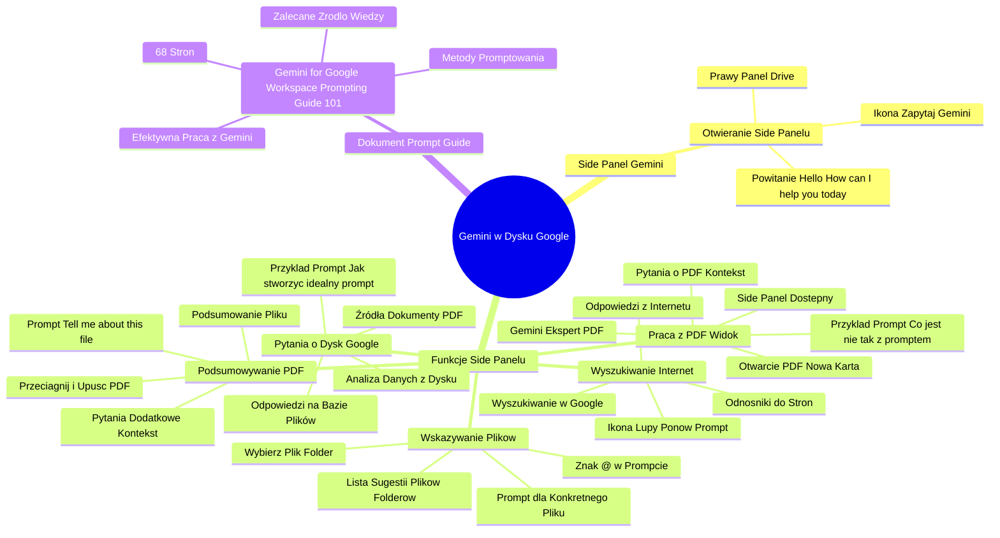

# Lekcje wideo - 3. Drive

# 💡 Diagram

___

# 🗒️ Notatka

# Notatki i Podsumowanie Wideo Transkrypcji o Gemini w Dysku Google

## Wprowadzenie

Niniejszy dokument zawiera szczegółowe notatki i podsumowanie transkrypcji wideo poświęconej wykorzystaniu Gemini w Dysku Google, z naciskiem na funkcjonalność `side panelu`. Wideo demonstruje, jak za pomocą **paska bocznego** Gemini zadawać pytania, uzyskiwać odpowiedzi w oparciu o dane z Dysku Google, podsumowywać pliki i foldery, a także wyszukiwać informacje w Internecie.

## Korzystanie z Side Panelu Gemini w Dysku Google

### Otwieranie Side Panelu Gemini

- Aby uruchomić `side panel` Gemini w Dysku Google, kliknij ikonę "Zapytaj Gemini"  znajdującą się w górnej części strony Dysku.
- Po kliknięciu, po prawej stronie okna Drive pojawi się `side panel` "Gemini Alpha" z powitaniem: "Hello, How can I help you today?".

### Zadawanie Pytań w Oparciu o Dane z Dysku Google

- W `side panelu` Gemini możesz zadawać pytania dotyczące informacji przechowywanych na Twoim Dysku Google.
- Przykładowe zapytanie: "How I should create the perfect prompt?" (Jak stworzyć idealny prompt?).
- Gemini analizuje zawartość Dysku w poszukiwaniu odpowiedzi na zadane pytanie.
- W prezentowanym przykładzie Gemini znajduje odpowiedź w pliku PDF "Prompt Guide" znajdującym się na Dysku użytkownika.
- Odpowiedź Gemini przedstawia listę kluczowych elementów idealnego promptu:
    - **Persona**
    - **Zadanie**
    - **Kontekst**
    - **Format**
- W sekcji "Sources" (Źródła) widoczne jest odwołanie Gemini do pliku PDF o promptowaniu, co potwierdza wykorzystanie dokumentu z Dysku.

### Wyszukiwanie Informacji w Internecie za Pomocą Gemini

- Kliknięcie ikony lupy w `side panelu` Gemini powoduje ponowne uruchomienie promptu, tym razem z wykorzystaniem wyszukiwarki Google.
- W tym trybie Gemini korzysta z zasobów Internetu, a nie danych zgromadzonych na Dysku Google.
- Odpowiedzi generowane w tym trybie zawierają odnośniki do stron internetowych, blogów i innych źródeł online.

### Podsumowywanie Plików PDF Metodą Przeciągnij i Upuść

- Możesz przeciągnąć plik PDF (lub kilka plików) z Dysku Google bezpośrednio do `side panelu` Gemini.
- Przeciągnięcie pliku automatycznie generuje prompt: "Tell me about this file" (Powiedz mi o tym pliku).
- Gemini podsumuje zawartość przeciągniętego pliku PDF.
- Możesz zadawać dodatkowe pytania dotyczące podsumowanego pliku, kontynuując kontekstową konwersację.
- Przykładowe pytanie dodatkowe, w kontekście dokumentu o bezpieczeństwie: "How Google encrypts data?" (Jak Google szyfruje dane?).

### Wskazywanie Plików za Pomocą Znaku "@"

- W polu promptu możesz użyć znaku "@", aby wyświetlić listę sugestii plików i folderów z Dysku Google.
- Po wpisaniu "@" pojawi się lista, z której możesz wybrać plik lub folder.
- Możesz zacząć wpisywać nazwę pliku po "@", aby zawęzić listę sugestii (np. "@G" wyświetli pliki zaczynające się na "G").
- Po wybraniu pliku, możesz dodać prompt odnoszący się do konkretnych informacji z tego pliku.

### Praca z Gemini w Widoku Pliku PDF

- Otwarcie pliku PDF z Dysku Google spowoduje jego uruchomienie w nowej karcie.
- W widoku otwartego pliku PDF, `side panel` Gemini pozostaje dostępny po prawej stronie.
- Dostępność `side panelu` w widoku PDF oznacza, że Gemini "wczytał" i "zrozumiał" treść PDF-a.
- Gemini staje się "ekspertem" w zakresie treści otwartego PDF-a.
- Możesz zadawać pytania dotyczące treści PDF-a w `side panelu`, a Gemini odpowie, bazując na kontekście otwartego dokumentu.
- Przykładowe zapytanie w kontekście otwartego PDF-a "Prompting Guide": "What's wrong with my prompt, how can I make it better?" (Co jest nie tak z moim promptem i jak mogę go ulepszyć?).

### Dokument "Gemini for Google Workspace Prompting Guide 101"

- Wideo wspomina o dokumencie "Gemini for Google Workspace Prompting Guide 101" (liczącym 68 stron), który szczegółowo opisuje skuteczne metody promptowania w Gemini.
- Dokument ten ma być dostępny pod filmem i jest rekomendowany jako źródło wiedzy dla użytkowników pragnących zwiększyć efektywność pracy z Gemini.

## Podsumowanie

Wideo prezentuje praktyczne zastosowanie `side panelu` Gemini w Dysku Google, demonstrując, jak Gemini może być wykorzystywany do:

- **Uzyskiwania odpowiedzi na pytania** w oparciu o dane z Dysku Google.
- **Podsumowywania plików PDF** poprzez przeciąganie lub wskazywanie ich za pomocą "@".
- **Wyszukiwania informacji w Internecie** bezpośrednio z Dysku Google.
- **Kontekstowej pracy z otwartymi dokumentami PDF**, gdzie Gemini pełni rolę eksperta od treści dokumentu.

Funkcjonalność `side panelu` Gemini w Dysku Google znacząco usprawnia dostęp do informacji i umożliwia efektywniejszą pracę z dokumentami przechowywanymi w chmurze. Dokument "Gemini for Google Workspace Prompting Guide 101" stanowi cenne źródło wiedzy dla użytkowników, którzy chcą w pełni wykorzystać potencjał Gemini.

___

# 🔉 Transcript
File: Lekcje wideo - 3. Drive.mp4 
[00:00:05] Przejdźmy teraz do dysku Google.
[00:00:08] W dysku Google będziemy używali głównie funkcjonalności side panelu, czyli tego paska bocznego i możemy ją używać zarówno do zadawania pytań i uzyskiwania odpowiedzi bazując na naszych danych, danych z modelu lub danych z internetu.
[00:00:23] Możemy podsumowywać za jej pomocą pliki lub całe katalogi.
[00:00:30] (Ekran: Mój Dysk w Google Drive, nazwa folderu "Gemini", lista plików: "Latvian_Grammar-2021.pdf", "gws_security_whitepaper.pdf", "gemini_for_workspace_prompt_guide_october_2024_digital_final.pdf", kolumny "Nazwa", "Właściciel", "Ostatnio modyfikowane", "Rozmiar pliku")
[00:00:31] Zobaczmy jak to może wyglądać.
[00:00:33] (Ekran: Google Drive - Mój Dysk w folderze "Gemini")
[00:00:33] U góry klikam ikonę zapytaj Gemini.
[00:00:37] (Ekran: po prawej stronie okna Drive pojawia się side panel "Gemini Alpha" z tekstem "Hello, How can I help you today?")
[00:00:38] Otwiera mi to side panel.
[00:00:40] Mogę teraz w ramach tego side panelu zadać pytanie.
[00:00:45] (Ekran: w oknie Gemini Alpha, w polu "Enter a prompt here" wpisuje "How I should create the perfect prompt?")
[00:00:52] Zapytałem w jaki sposób powinienem tworzyć idealny prompt.
[00:00:58] (Ekran: w oknie Gemini Alpha pojawia się odpowiedź na pytanie, rozwinięta lista "Sources")
[00:00:58] Zadałem to pytanie, ponieważ wiem, że na moim dysku, tu widzicie po lewej stronie, mam PDF Prompt Guide, który jest można powiedzieć taką Biblią, podsumowującą jak promptować w których działach i jak to powinno wyglądać, więc wiem, że taka wiedza na moim dysku się znajduje.
[01:00:19] Zobaczcie, że teraz rozszerzając tutaj trochę ten side panel, widzę, że na to pytanie Gemini odpisał, żeby stworzyć idealny prompt, są cztery obszary, na które musisz zwrócić uwagę.
[01:00:33] Persona, zadanie, kontekst w ramach którego się obracasz i format.
[01:01:39] I przypisał dodatkowe informacje, które warto pamiętać.
[01:01:44] Natomiast w źródłach widzimy, że pojawiają się różne dokumenty nienazwane, bo akurat wynik generowałem różne rzeczy odnośnie promptowania i widzimy tutaj między innymi ten PDF o promptowaniu, do którego się odwołujemy i z którego została wyciągnięta wiedza, dzięki czemu wiem, że został wykorzystany ten dokument, na którym najbardziej mi zależało.
[01:02:07] Mogę oczywiście przejechać w dół i tutaj kliknąć teraz lupkę po to, żeby ponowić ten prompt, ale za pomocą wyszukiwarki Google.
[01:02:18] W tym momencie side panel już nie będzie się odwoływał do mojego dysku i wiedzy tutaj zgromadzonej, ale odwoła się bezpośrednio do wiedzy w internecie i widzicie, że kolejna odpowiedź, która została tutaj zawarta zawiera już odnośniki do różnych stron internetowych, blogów, podsumowań i tak dalej.
[01:02:37] I teraz mógłbym ewentualnie zadawać dodatkowe pytania, żeby, żeby zagłębić się w ten temat.
[01:02:44] (Ekran: w prawym górnym rogu menu Gemini Alpha - opcja "Clear history")
[01:02:44] Wyczyszczę okienko i pokażę wam teraz inny przykład użycia Gemini w ramach dysku.
[01:02:53] (Ekran: czysty side panel Gemini Alpha)
[01:02:53] Możemy złapać na przykład PDF-a, którego mamy lub wiele PDF-ów, gdybyśmy chcieli i przeciągnąć go na prawą stronę na ten boczny pasek Gemini.
[01:03:09] Takie przeciągnięcie automatycznie utworzy nam prompt tell me about this file, czyli powiedz mi odnośnie tego pliku i tutaj został zawarty plik i mamy już podsumowanie.
[01:03:21] Moglibyśmy teraz pisać kolejne prompty, czyli przykładowo w ramach tego pliku mogę zapytać.
[01:03:33] (Ekran: w okno Gemini Alpha wpisuje "How Google encrypts data?")
[01:03:33] Jak Google szyfruje dane, to jest akurat dokument traktujący o bezpieczeństwie i na bazie tego dokumentu, na bazie tego kontekstu, o którym rozmawiamy, Gemini będzie w stanie udzielić mi dodatkowych informacji.
[01:03:48] Więc kontekstowo możemy rozmawiać w taki sposób o dodatkowych elementach.
[01:03:53] Jeżeli przykładowo nie chcielibyśmy tego dokumentu przeciągać, bo być może jesteśmy w innym folderze, w innym miejscu, a nie chcemy też przeszukiwać po dysku gdzie ten plik się znajduje to możemy w okienku promptowania wstawić małpkę i zobaczycie, że wtedy zaczną nam się wyświetlać podpowiedzi, podpowiedzi do plików jak i całych folderów.
[01:04:14] Możemy już teraz znaleźć coś po tej liście lub ewentualnie zacząć pisać G i już widzę tutaj Google Workspace Security Whitepaper PDF i mogę na niego kliknąć i teraz mogę dopisać prompt, który będzie konkretnym pytaniem odnośnie tego pliku.
[01:04:40] Więc w ten sposób możecie wskazywać, że chcecie pytać o konkretne dokumenty i informacje z nim związane.
[01:04:50] Natomiast możemy też z takimi PDF-ami czy innymi dokumentami, które macie na dysku Google pracować w inny sposób.
[01:04:57] (Ekran: Mój Dysk, folder Gemini, pliki PDF)
[01:04:57] Zobaczcie co się stanie jak uruchomię na przykład tego PDF-a.
[01:05:02] (Ekran: Mój Dysk - plik PDF "gemini_for_workspace_prompt_..." - po prawej stronie okno "Gemini Alpha")
[01:05:02] Odpali mi się odrębna zakładka.
[01:05:05] Mam tutaj dokument Gemini for Google Workspace Prompting Guide 101 i to jest taki dokument na 68 stron, który traktuje o tym jak promptować w ramach Gemini, żeby to promptowanie było skuteczne i żeby dawało wam oczekiwane efekty.
[01:05:17] Ten dokument podlinkujemy na dole pod tym filmem i bardzo zachęcam wszystkich do zapoznania się z nim, ponieważ to pomoże wam pracować o wiele lepiej i prościej z Gemini.
[01:05:28] Natomiast na dzisiaj pokażę wam jeden trick.
[01:05:58] Trick, który możecie używać nie tylko z tym dokumentem, ale też z innymi dokumentami, które macie na dysku Google.
[01:06:07] Jeżeli mamy uruchomiony ten PDF, po prawej stronie widzicie side panel, to to oznacza, że Gemini ma teraz tego PDF-a wczytanego w swoje okienko kontekstowe.
[01:08:21] Czyli można powiedzieć, że w pełni odczytał, zrozumiał informacje tutaj zawarte i jest gotowy do użycia tych informacji w dowolny, oczekiwany przez was sposób.
[01:08:33] Jeżeli PDF-em, który ja tutaj mam jest Prompting Guide, czyli Biblia promptowania, to Gemini w tym momencie jest ekspertem od tworzenia promptów.
[01:08:46] Więc jeżeli przykładowo w side panelu powiem mu tak.
[01:08:51] (Ekran: w polu "Enter a prompt here" wpisuje "What's wrong with my prompt, how can I make it better?")
[01:09:04] Co jest nie tak z moim promptem, jak mogę sprawić, że będzie lepszy?

___
# 🏷️ Tags
#gemini #google_drive #side_panel #pasek_boczny #dysk_google #prompt #promptowanie #wyszukiwanie_informacji #pliki_PDF #podsumowywanie_plików #kontekst #bezpieczeństwo #szyfrowanie_danych #google_workspace #dokumentacja #wiedza #efektywność #chmura #persona #zadanie #kontekst #format #źródła #internet #wyszukiwarka_google #odnosniki #blogi #katalogi #małpka #sugestie #dokument #ekspert #prompting_guide #google_workspace_prompting_guide_101 #uzyskiwanie_odpowiedzi #dane_z_dysku #przeciągnij_i_upuść #praca_z_dokumentami #zarządzanie_danymi
