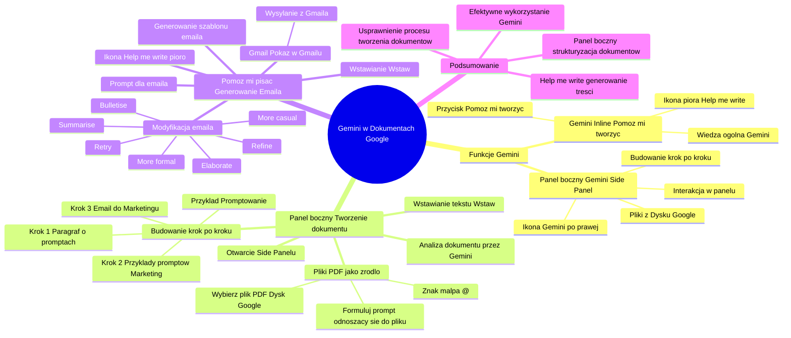

# Lekcje wideo - 4. Dokumenty

# 💡 Diagram



___

# 🗒️ Notatka


# Notatki i Podsumowanie Transkrypcji Wideo: Gemini w Dokumentach Google

## Wprowadzenie

Transkrypcja wideo omawia wykorzystanie funkcjonalności **Gemini** w Dokumentach Google.  Przedstawiono dwie główne metody interakcji z **Gemini**: funkcja inline "**Pomóż mi tworzyć**" oraz panel boczny **Gemini** (`side panel`). Główny nacisk położono na praktyczne zastosowanie panelu bocznego w procesie tworzenia dokumentów krok po kroku, z wykorzystaniem własnych plików z Dysku Google jako źródeł informacji. Pokazano również, jak użyć funkcji "**Pomóż mi pisać**" do generowania wiadomości email na podstawie wcześniej przygotowanego tekstu.

## Funkcje Gemini w Dokumentach Google

W Dokumentach Google dostępne są dwie główne funkcje **Gemini**:

*   **Gemini inline** ("**Pomóż mi tworzyć**"):
    *   Dostępna jako przycisk "+ Pomóż mi tworzyć" na pasku narzędzi.
    *   Ikona pióra "**Help me write**" pojawia się po prawej stronie ekranu podczas edycji dokumentu.
    *   Wykorzystuje ogólną wiedzę **Gemini**.
*   **Panel boczny Gemini** (`Side panel`):
    *   Dostępny po kliknięciu ikony **Gemini** po prawej stronie ekranu.
    *   Umożliwia interakcję z **Gemini** w bocznym panelu.
    *   Pozwala na budowanie dokumentu krok po kroku.
    *   Możliwość wykorzystania własnych plików z Dysku Google jako źródła informacji.

## Tworzenie dokumentu krok po kroku za pomocą `Side Panelu`

Prezenter demonstruje preferowaną metodę tworzenia dokumentów, wykorzystując panel boczny **Gemini**. Pozwala to na lepszą kontrolę nad procesem i efektywne wykorzystanie własnych zasobów wiedzy.

**Etapy tworzenia dokumentu:**

1.  **Otwarcie `Side Panelu` Gemini:** Kliknięcie ikony **Gemini** po prawej stronie ekranu aktywuje panel boczny.
2.  **Krokowe budowanie dokumentu:**
    *   To zalecane podejście, umożliwiające stopniowe generowanie dokumentu.
    *   Przykład: Tworzenie dokumentu o promptowaniu.
        *   **Krok 1:** Wygenerowanie wstępnego paragrafu wyjaśniającego, czym jest `prompt` i jak go konstruować.
        *   **Krok 2:** Wygenerowanie przykładów `promptów` dla działu marketingu.
        *   **Krok 3:** Przekształcenie zgromadzonej wiedzy w wiadomość email skierowaną do działu marketingu.
3.  **Wykorzystanie własnych plików (PDF) jako źródła danych:**
    *   W polu tekstowym `side panelu` należy wpisać znak `@` (małpa).
    *   Następnie, wybierz plik PDF z Dysku Google (np. "gemini\_for\_workspace\_prompt...pdf").
    *   Sformułuj `prompt` odnoszący się do wybranego pliku, na przykład: "Prepare a description on how to create a perfect prompt."
4.  **Analiza dokumentu i generowanie odpowiedzi przez Gemini:**
    *   **Gemini** analizuje wskazany dokument PDF.
    *   Generuje odpowiedź na zadany `prompt`.
    *   Przykład odpowiedzi: Lista wskazówek "**Here are some ways to craft the perfect prompt:**" (w transkrypcji w języku angielskim):
        *   Use natural language: Write in a conversational style...
        *   Be specific and descriptive: Clearly articulate your request to Gemini...
        *   Be concise and focused: While providing context is crucial...
        *   Engage in a dialogue: Think of prompting as an ongoing conversation...
        *   Leverage your documents: Enhance the personalization and relevance of Gemini...
        *   Utilize Gemini as your prompt editor: In Gemini Advanced, you can seek assistance in refining your prompts...
        *   Remember that effective prompting is a skill that develops with practice...
5.  **Wstawianie wygenerowanego tekstu do dokumentu:**
    *   Kliknięcie ikony "**Wstaw**" (`Insert`).
    *   Wygenerowany fragment tekstu zostanie wstawiony do aktywnego dokumentu Google.

## Generowanie wiadomości email za pomocą "**Help me write**"

Po przygotowaniu fragmentu tekstu w dokumencie, prezenter pokazuje, jak szybko wygenerować na jego podstawie wiadomość email.

**Etapy generowania wiadomości email:**

1.  **Użycie funkcji "**Help me write**":** Kliknięcie ikony "**Help me write**" (pióra) w dokumencie.
2.  **Wprowadzenie `promptu` dla wiadomości email:** W oknie `promptowania` wpisz prośbę, np. "Prepare an email about the above that I'll send to the marketing department to explain them on how can they use gemini and prompt" (w transkrypcji w języku angielskim).
3.  **Generowanie szablonu wiadomości email przez Gemini:**
    *   **Gemini** analizuje tekst znajdujący się powyżej `promptu`.
    *   Generuje szablon wiadomości email.
    *   Przykład wygenerowanej wiadomości email (fragment w transkrypcji w języku angielskim):\
        
        To: A Person, A Person, A Person
        Cc: A Person
        Bcc: A Person
        Subject:
        Dear Marketing Team,
        I hope this email finds you well.
        ...
        ```
4.  **Modyfikacja i personalizacja wiadomości email:**
    *   Istnieje możliwość modyfikacji wiadomości za pomocą kolejnego `promptu` lub ikon z listy rozwijanej (**Refine**, **Elaborate**, **More formal**, **More casual**, **Bulletise**, **Summarise**, **Retry**).
    *   Wstaw szablon wiadomości do dokumentu, klikając "**Insert**".
5.  **Wysyłanie wiadomości email z Gmaila:**
    *   Kliknij "**person**" w polach "**Do**", "**Cc**" itp. i zmień na konkretne kontakty (np. Krzysztof, Anna, Agnieszka).
    *   Kliknij ikonę "**Pokaż w Gmailu**" (`Show in Gmail`).
    *   Otworzy się wersja robocza wiadomości w Gmailu, gotowa do wysłania po kliknięciu "**Wyślij**".

## Podsumowanie

Wideo prezentuje praktyczne zastosowanie **Gemini** w Dokumentach Google, koncentrując się na efektywnym wykorzystaniu panelu bocznego do tworzenia dokumentów krok po kroku z użyciem własnych plików oraz na szybkim generowaniu wiadomości email za pomocą funkcji "**Help me write**". Panel boczny **Gemini** jest szczególnie przydatny do strukturyzowanego tworzenia dokumentów i wykorzystania spersonalizowanej wiedzy z własnych zasobów. Natomiast "**Help me write**" umożliwia sprawne generowanie treści, takich jak wiadomości email, na podstawie istniejącego tekstu w dokumencie. Obie funkcje znacząco usprawniają proces tworzenia dokumentów i komunikacji w środowisku Google Workspace.
```

___

# 🔉 Transcript
File: Lekcje wideo - 4. Dokumenty.mp4<br>
[00:00:05] Przejdźmy teraz do dokumentów Google.
[00:00:08] W dokumentach, podobnie jak w Gmailu, znajdziecie funkcjonalność Gemini inline, czyli tutaj akurat będziemy mówili o tym przycisku pomóż mi tworzyć lub jak już zaczniecie tworzyć dokument, to tu po prawej stronie będziecie mieli to piórko zawsze dostępne.
[00:00:15] (Ekran: Dokument Google. Na pasku narzędzi widoczny przycisk "+ Help me create". Po prawej stronie ekranu znajduje się ikona pióra "Help me write")
[00:00:22] Plus będziemy tu mówili o funkcjonalności panelu bocznego, czyli standardowo klikamy tu po prawej stronie na ikonę Gemini.
[00:00:27] (Ekran: Po prawej stronie ekranu pojawia się panel boczny Gemini z nagłówkiem "Hello Kacper, How can I help you today?" i propozycjami: Create an outline for a pitch, Brainstorm a list of ideas, Create a list of conferences i polem tekstowym "Enter a prompt here")
[00:00:33] I w tym momencie wyświetla nam się side panel.
[00:00:33] Pokażę wam jak ja zazwyczaj tworzę dokumenty, bo oczywiście moglibyśmy zacząć od tej funkcji pomóż mi utworzyć tutaj spróbować coś generować, ale tak jak wam wcześniej wspominałem ta funkcjonalność ma dostęp do tej wiedzy ogólnej.
[00:00:49] A jeżeli chcecie generować dokument bazując na swoich plikach lub chcecie tą wiedzę w jakiś konkretny sposób najpierw sobie zreorganizować i przygotować, to warto wykorzystać side panel.
[00:01:01] Przykładowo w ramach side panelu bardzo mocno wam polecam budować dokument krok po kroku.
[00:01:09] Czyli wyobraźmy sobie, że na samym początku chcemy wygenerować tylko pierwszy paragraf i zastanówmy się co w ramach tego paragrafu powinno się znaleźć.
[00:01:19] W tym przykładzie chcę mieć dokument, który w pierwszym paragrafie wytłumaczy jak promptować, czyli jak powinien być zbudowany prompt, co to w ogóle znaczy i tak dalej.
[00:01:31] W drugim akapicie będę chciał wygenerować parę przykładów używania promptów dla działu marketingu i w kolejnym kroku, jak już będziemy mieli tą wiedzę przygotowaną, spróbujemy ją przeorganizować na wiadomość mailową, którą będziemy mogli wysłać do działu marketingu, tak żeby ich nauczyć o tym jak promptować.
[00:01:52] Więc przejdźmy do kroku numer jeden.
[00:01:54] W side panelu
[00:01:56] (Ekran: Dokument Google. Na pasku narzędzi po prawej stronie w polu tekstowym "Enter a prompt here" widoczny kursor)
[00:01:57] napiszę małpkę
[00:02:00] I już widzimy, że tu podpowiada mi się PDF, który mam na dysku i to jest ten Gemini for workspace prompting guide, czyli nasz dokument mówiący o tym jak promptować.
[00:02:12] (Ekran: Pod polem tekstowym pojawia się lista plików. Na samej górze "gemini_for_workspace_prompt...pdf")
[00:02:12] Zaznaczam, że o ten dokument mi chodzi.
[00:02:15] (Ekran: Zaznaczenie pliku powoduje jego wyświetlenie pod polem tekstowym i zniknięcie z listy)
[00:02:15] Prepare a description on how to create a perfect prompt.
[00:02:34] Enter.
[00:02:37] Czekam, aż Gemini przeanalizuje mój dokument, wyciągnie z niego informacje o które poprosiłem.
[00:02:44] I po chwili pojawi mi się gotowa odpowiedź.
[00:02:47] Widzicie, że tutaj mamy.
[00:02:48] (Ekran: Po prawej stronie pojawia się lista wskazówek jak tworzyć idealne prompty.
[00:02:48] Here are some ways to craft the perfect prompt:
[00:02:48] Use natural language: Write in a conversational style, using full sentences to express your thoughts clearly and concisely.
[00:02:49] Be specific and descriptive: Clearly articulate your request to Gemini, whether it's to summarize, write, adjust the tone, or create something new. Providing ample context, such as the intended audience, purpose, or desired format, enhances the quality of the output.
[00:02:50] Be concise and focused: While providing context is crucial, strive for brevity and avoid unnecessary complexity. State your request succinctly and precisely.
[00:02:51] Engage in a dialogue: Think of prompting as an ongoing conversation. If the initial output doesn't meet your expectations, don't hesitate to refine your prompt and iterate. Offer feedback, ask follow-up questions, or request specific modifications to guide Gemini towards the desired outcome.
[00:02:52] Leverage your documents: Enhance the personalization and relevance of Gemini by incorporating information from your own files in Google Drive. Utilize the "@" symbol followed by the file name to reference specific documents.
[00:02:52] Utilize Gemini as your prompt editor: In Gemini Advanced, you can seek assistance in refining your prompts. Begin your prompt with the phrase: "Make this a power prompt," followed by your original prompt text. Gemini will offer suggestions to improve clarity, specificity, and effectiveness.
[00:02:53] Remember that effective prompting is a skill that develops with practice. By embracing these tips and experimenting with different approaches, you can harness the full potential of Gemini for Workspace and achieve your desired results.
[00:02:54] How do I make my prompts more specific and descriptive?
[00:02:54] Show more suggestions
[00:02:54] Sources (1))
[00:02:54] Tu jest kilka przykładów jak tworzyć perfect prompty.
[00:02:55] Fajnie to wygląda, bardzo mi się podoba, więc wybieram ikonkę wstaw i za jej pomocą wstawiam ten fragment do mojego dokumentu.
[00:03:03] Teraz w kolejnym kroku, tak jak wspominałem chcę wygenerować treści wiadomości mailowej, którą będę mógł wysłać działowi marketingu i która będzie zawierała te wszystkie informacje tutaj zgromadzone.
[00:03:24] Dlatego wciskam sobie ze trzy entery.
[00:03:29] Klikam po prawej stronie ikonkę Help me write.
[00:03:32] (Ekran: Na dole dokumentu pojawia się okienko, w którym można wpisać prompt)
[00:03:32] Pojawia mi się okienko promptowania i teraz proszę o
[00:03:37] (Ekran: W okienku pojawia się tekst: Prepare an email about the above that I'll send to the marketing department to explain them on how can they use gemini and prompt)
[00:05:00] Przygotuj mi wiadomość email odnośnie powyższego tekstu, którą będę mógł wysłać do działu marketingu i za jej pomocą wyjaśnię jak dział marketingu może używać Gemini i promptowania.
[00:05:16] Klikam Create.
[00:05:25] (Ekran: Po prawej stronie pojawia się okno z szablonem wiadomości mailowej)
[00:05:25] W tym momencie Gemini zbiera informacje o tym co jest u góry, odpowiednio to modyfikuje i przerabia i generuje mi wiadomość mailową, więc tak jak widzicie tutaj mam już mój prompt, a tu mam przykład wiadomości mailowej, która została wygenerowana.
[00:05:35] (Ekran: Prepare an email about the above that Gemini send to the marketing department.
[00:05:35] To: A Person, A Person, A Person
[00:05:35] Cc: A Person
[00:05:36] Bcc: A Person
[00:05:36] Subject:
[00:05:36] Dear Marketing Team,
[00:05:37] I hope this email finds you well.
[00:05:37] I'm excited to share with you how we can leverage Gemini, our AI collaborative partner, to enhance our marketing efforts and create exceptional content that resonates with our audience.
[00:05:37] Gemini is designed to assist you directly in Gmail, Docs, Sheets, Slides, and Meet.
[00:05:37] By embracing its capabilities, you can streamline your workflows, write compelling copy, visualize data, organize information, and connect more meaningfully.
[00:05:37] One key aspect of utilizing Gemini effectively is crafting well-structured prompts.
[00:05:37] Here are some tips to help you get started:
[00:05:37] Use Natural Language: Write your prompts in a conversational style, using full sentences to express your thoughts clearly and concisely.
[00:05:37] To further illustrate how you can leverage Gemini's capabilities, I have included some examples of prompts tailored for our marketing department:
[00:05:37] Simple and Direct:
[00:05:37] Write a catchy tagline for our new product launch.
[00:05:38] Summarize the key takeaways from our latest market research report.
[00:05:38] Draft a social media post announcing our upcoming webinar.
[00:05:38] More Detailed and Contextual:
[00:05:38] Create a blog post outline targeting small business owners, highlighting the benefits of our cloud-based accounting software.
[00:05:38] Develop a series of email subject lines for a lead nurturing campaign, focused on sustainability and eco-friendly practices.
[00:05:38] Analyze our competitor's latest advertising campaign and identify their strengths and weaknesses.
[00:05:39] Leveraging Documents and Advanced Features:
[00:05:39] Using data from our @Sales Report Q3.txt file, create a compelling infographic showcasing our sales growth.
[00:05:39] Make this a power prompt: Brainstorm creative ideas for a viral marketing campaign that aligns with our brand values and resonates with our target audience.
[00:05:39] I encourage you to experiment with different levels of detail and specificity in your prompts to find what works best for you.
[00:05:39] By tailoring the prompts to your specific products, services, and target audience, we can unlock the full potential of Gemini and elevate our marketing efforts.
[00:05:39] Should you have any questions or require further assistance, please don't hesitate to reach out to me.
[00:05:39] Best regards,
[00:05:39] [Your Name]
[00:05:39] This is a creative writing aid and is not intended to be factual.
[00:05:39] Refine with a prompt
[00:05:39] Refine
[00:05:40] Insert
[00:05:40] Elaborate
[00:05:40] More formal
[00:05:40] More casual
[00:05:40] Bulletise
[00:05:40] Summarise
[00:05:41] Retry)
[00:05:41] Mogę ją zredefiniować za pomocą kolejnego promta, jeżeli będę chciał.
[00:05:44] Mogę zredefiniować za pomocą ikon tutaj z listy rozwijanej albo mogę po prostu wcisnąć insert.
[00:05:46] Zobaczcie, że jak wcisnę insert został tutaj wstawiony od razu blok inteligentnej wiadomości mailowej, więc jeżeli teraz przykładowo chciałbym tą wiadomość do kogoś wysłać to wystarczy, że tutaj kliknę na person i podmienię przykładowo na Krzysztof.
[00:06:02] (Ekran: W polach To i Cc pojawiają się rozwijane listy kontaktów)
[00:06:02] Podmienię na Anna.
[00:06:04] (Ekran: W polach To i Cc pojawiają się rozwijane listy kontaktów)
[00:06:05] Podmienię na Agnieszka.
[00:06:07] (Ekran: W polach To i Cc pojawiają się rozwijane listy kontaktów)
[00:06:07] Mam już wskazane konkretne osoby i w momencie kiedy kliknę ikonkę Pokaż w Gmailu.
[00:06:14] (Ekran: Otwiera się okno przeglądarki z oknem wiadomości w Gmailu)
[00:06:14] to zostanie mi już utworzony draft wiadomości mailowej i wystarczy, że teraz wcisnę wyślij i mam tą wiadomość wysłaną.
[00:06:25] (Ekran: Logo Umiejętności Jutra)

___
# 🏷️ Tags
#gemini #google_docs #dokumenty_google #transkrypcja #wideo #pomóż_mi_tworzyć #help_me_create #panel_boczny_gemini #side_panel #dysk_google #google_drive #prompt #promptowanie #marketing #email #gmail #help_me_write #pomóż_mi_pisać #generowanie_tekstu #sztuczna_inteligencja #ai #google_workspace #krok_po_kroku #instrukcja #tutorial #szablon_email #wskazówki #natural_language #personalizacja #refine #elaborate #more_formal #more_casual #bulletise #summarise #retry #wstaw #insert #pokaż_w_gmailu #show_in_gmail #draft_email #wiadomość_email #dokument_pdf #analiza_dokumentu #generowanie_odpowiedzi #umiejętności_jutra
