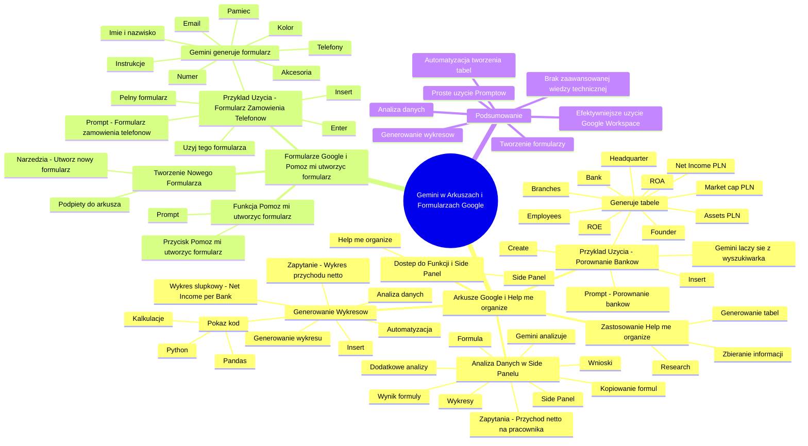

# Lekcje wideo - 5. Arkusze

# 💡 Diagram

___

# 🗒️ Notatka

# Gemini w Arkuszach i Formularzach Google: Notatki i Podsumowanie

## Wprowadzenie

Niniejsza prezentacja demonstruje wykorzystanie narzędzia **Gemini** w Arkuszach Google i Formularzach Google w celu usprawnienia organizacji danych, analizy i tworzenia formularzy. Prezentacja koncentruje się na funkcjach `Help me organize` w Arkuszach i `Pomóż mi utworzyć formularz` w Formularzach, demonstrując, jak Gemini może automatyzować zadania i upraszczać pracę z danymi.

## Arkusze Google i Funkcja `Help me organize`

### Dostęp do Funkcji i Side Panel

*   W Arkuszach Google, po prawej stronie ekranu, znajduje się **side panel**.
*   Funkcja `Help me organize` (Pomóż mi przeorganizować) jest dostępna w **side panelu**.

### Zastosowanie `Help me organize`

*   Funkcja `Help me organize` jest przydatna do **generowania nowych tabel** z danymi, szczególnie podczas **researchu** i **zbierania informacji**.

### Przykład Użycia - Porównanie Banków

1.  Kliknięcie przycisku `Help me organize` otwiera okno po prawej stronie **side panelu**.
2.  Użytkownik wpisuje **prompt**: "Potrzebuję porównania 10 największych banków w Polsce."
3.  Kliknięcie **`Create`**.
4.  **Gemini łączy się z wyszukiwarką** i wyszukuje informacje.
5.  **Generuje tabelę** z danymi banków, zawierającą kolumny takie jak:
    *   Headquarter
    *   Bank
    *   Founder
    *   Assets (PLN)
    *   Net Income (PLN)
    *   Return on equity (ROE)
    *   Return on assets (ROA)
    *   Market capitalization (PLN)
    *   Number of branches
    *   Number of employees
6.  Można ponownie kliknąć `Create`, aby wygenerować **inną tabelę**.
7.  Kliknięcie **`Insert`** w celu umieszczenia tabeli w arkuszu.

### Analiza Danych w Side Panelu

*   Po umieszczeniu tabeli w arkuszu, **side panel** może być użyty do analizy danych.
*   Przykład zapytania: "który bank ma największy przychód netto na pracownika".
*   **Gemini analizuje tabelę** i odpowiada, prezentując:
    *   **Wynik formuły**.
    *   **Formułę**, która została utworzona do uzyskania wyniku.
*   Użytkownik **nie musi być ekspertem w arkuszach kalkulacyjnych** ani znać formuł.
*   Istnieje możliwość **kopiowania i ponownego wykorzystania formuł**.
*   Można również poprosić o **dodatkowe analizy**, **wnioski** oraz **wygenerowanie wykresów**.

### Generowanie Wykresów

*   Przykład zapytania: "Pokaż mi wykres przychodu netto dla każdego z banków."
*   **Proces generowania wykresu składa się z dwóch etapów:**
    1.  **Analiza danych** i wyciągnięcie informacji potrzebnych do wykresu.
    2.  **Wygenerowanie samego wykresu**.
*   Wygenerowany zostanie **wykres słupkowy** z tytułem `Net Income per Bank`.
*   Przy odpowiedzi pojawia się przycisk `Pokaż kod`.
*   Kliknięcie `Pokaż kod` wyświetla **kod w Pythonie**, wygenerowany przez Gemini do analizy danych i stworzenia wykresu.
    *   Kod używa biblioteki **Pandas**.
    *   Kod wykonuje **kalkulacje** i zwraca tabelę.
    *   Drugi kod generuje **wykres**.
*   To **automatyzacja** procesu analizy i wizualizacji danych, który ręcznie byłby czasochłonny lub wymagałby specjalistycznych umiejętności programowania.
*   Wykres można **wstawić** do arkusza za pomocą przycisku `Insert`.

## Formularze Google i Funkcja `Pomóż mi utworzyć formularz`

### Tworzenie Nowego Formularza

*   W Arkuszach Google należy kliknąć **`Tools`** (Narzędzia).
*   Następnie wybrać **`Utwórz nowy formularz`**.
*   Formularz jest automatycznie **podpięty do arkusza**, z którego został utworzony.

### Funkcja `Pomóż mi utworzyć formularz`

*   U góry formularza dostępny jest przycisk `Pomóż mi utworzyć formularz`.
*   Można wpisać **prompt** opisujący potrzebny formularz.

### Przykład Użycia - Formularz Zamówienia Telefonów

1.  Użytkownik wpisuje **prompt**: "Potrzebuję formularz, który będzie zbierał informacje o zamówieniach klientów na telefony komórkowe."
2.  Kliknięcie **`Enter`**.
3.  **Gemini generuje propozycję formularza** z polami:
    *   Pełne imię i nazwisko
    *   Numer kontaktowy
    *   Adres email
    *   Lista telefonów do wyboru
    *   Wybranie pamięci
    *   Wybranie koloru
    *   Dodatkowe akcesoria (np. ochraniacz na ekran, Case)
    *   Dodatkowe instrukcje
4.  Kliknięcie **`Użyj tego formularza`**.
5.  Kliknięcie **`Insert`** w celu umieszczenia formularza.
6.  Zostanie **wygenerowany pełny formularz**, eliminując konieczność ręcznego tworzenia pytań.

## Podsumowanie

W niniejszej prezentacji zademonstrowano, jak **Gemini** integruje się z Arkuszami i Formularzami Google, oferując funkcje `Help me organize` i `Pomóż mi utworzyć formularz`. Te narzędzia pozwalają na **automatyzację tworzenia tabel, analizy danych, generowania wykresów i tworzenia formularzy**. Użytkownicy mogą w prosty sposób, za pomocą **promptów**, zlecać Gemini realizację złożonych zadań, nawet **nie posiadając zaawansowanej wiedzy technicznej** z zakresu arkuszy kalkulacyjnych czy programowania. Gemini upraszcza pracę, oszczędza czas i pozwala na efektywniejsze wykorzystanie narzędzi Google Workspace.

___

# 🔉 Transcript
File: Lekcje wideo - 5. Arkusze.mp4 
[00:00:05] Przejdźmy do arkuszy i zaraz po nich pokażę wam szybko formularze.
[00:00:10] Zaczynamy od arkuszy.
[00:00:12] W arkuszach oczywiście macie dostępny side panel, ale też macie taką fajną funkcję tutaj po lewej stronie, która się nazywa Help me organize, czyli pomóż mi przeorganizować.
[00:00:24] Ja tej funkcji zazwyczaj używam w momencie, kiedy potrzebuję wygenerować nową tabelę z jakimiś danymi, zrobić research, zebrać informacje i je tutaj umieścić.
[00:00:35] Zobaczcie jak to może wyglądać.
[00:00:37] Klikając na przycisk, pojawia mi się po prawej stronie okienko.
[00:00:41] Screen: po prawej stronie ekranu pojawia sie okno z tekstem "Create a custom template" i polem do wpisywania tekstu.
[00:00:48] Potrzebuję porównania 10 największych banków w Polsce.
[00:00:53] Klikam Create.
[00:00:56] Gemini łączy się teraz do wyszukiwarki, wyszukuje dla mnie wszystkie informacje, które mogą być przydatne i wyrzuca mi zestawienie banków.
[01:05] Screen: Pojawia się tabela z danymi "Headquarter", "Bank", "Founder", "Assets (PLN)", "Net Income (PLN)", "Return on equity (ROE)", "Return on assets (ROA)", "Market capitalization (PLN)", "Number of branches", "Number of employees".
[01:06] To jest jeden przykład jak to może wyglądać.
[01:09] Jeżeli kliknę ponownie Create, zostanie mi wygenerowana inna tabelka, która może wyglądać inaczej.
[01:15] Natomiast patrząc na to jak ona wygląda, ja jestem z tego zadowolony.
[01:20] Zostawmy ją, więc wciskam insert.
[01:24] Tabela została umieszczona w arkuszach.
[01:27] Co my teraz możemy z tym zrobić?
[01:29] Możemy po prawej stronie kliknąć ikonkę side panelu i w ramach side panelu możemy teraz analizować dane, które tutaj mamy umieszczone.
[01:40] Przykładowo mogę zapytać który bank ma największy przychód netto na pracownika.
[02:02] Wciskam enter.
[02:04] Gemini analizuje naszą tabelkę z danymi.
[02:10] I po chwili odpowiada mi używając dwóch rzeczy.
[02:15] Zobaczcie.
[02:16] Pierwsza rzecz to jest wynik formuły, a druga rzecz to jest formuła, która została utworzona, aby zwrócić mi wynik tego zapytania.
[02:27] Więc zobaczcie, że dzięki temu ja już tak naprawdę nie muszę być ekspertem w arkuszach kalkulacyjnych, nie muszę znać się na formułach.
[02:34] Mogę zapytać Gemini, żeby przygotował mi odpowiednią formułę i na bazie tego mogę później taką formułę skopiować i wykorzystać sobie ponownie w dowolnym miejscu.
[02:44] Mogę tutaj poprosić również o dodatkowe analityki, o wyciągnięcie dodatkowych wniosków lub nawet o wygenerowanie wykresu.
[02:53] Spróbujmy wygenerować wykres.
[03:05] Pokaż mi wykres przychodu netto dla każdego z banków.
[03:17] Zobaczcie, że teraz, kiedy wykonuje się to zapytanie, mamy informację o tym, że jest pisany kod, są łapane różnego typu wnioski.
[03:29] Znowu jest pisany kod i mamy informacje zwrotną.
[03:34] Generowanie tego wykresu, który nam się tutaj wyświetla.
[03:37] Screen: Po prawej stronie okna pojawia się wykres słupkowy z tytułem "Net Income per Bank".
[03:41] Generowanie tego wykresu zostało wykonane w dwóch etapach.
[03:44] Etap numer pierwszy, zostały przeanalizowane dane i wyciągnięta z nich informacja, która jest potrzebna do tego, żeby przygotować dane pod wykres.
[03:54] W drugim etapie został wygenerowany sam wykres.
[03:57] Zobaczcie, że teraz przy tej odpowiedzi pojawiło mi się dodatkowo taki przycisk pokaż kod i tutaj mamy drugi tego typu przycisk.
[04:05] Jak zaznaczę ten pierwszy, wyświetli wam się kod w Pythonie, który Gemini sobie pod spodem wygenerował do tego, żeby udzielić wam odpowiedzi.
[04:15] Mamy tutaj informacje o tym, że zapytał biblioteki Pandas, wykonał różnego typu kalkulacje i zwrócił tego typu tabelkę jako jako informację zwrotną.
[04:28] Później drugi kod został użyty do tego, żeby wygenerować nam wykres.
[04:33] Zobaczcie, że nie używając Gemini, gdybyście chcieli sami to zrobić, to albo ręcznie musielibyście taką taki wykres sobie stworzyć, albo musielibyście sami napisać fragment kodu, żeby te dane odpowiednio przeanalizować i sobie przygotować.
[04:51] Tutaj zostało to zrobione dla was.
[04:54] Akurat przykład, który podałem jest dość prosty, ale jeżeli będziecie wykonywać bardziej złożoną i zaawansowaną analitykę, to tego typu możliwości używania przez Gemini narzędzi takich jak kodowanie sprawią, że Gemini będzie w stanie o wiele prościej dostarczyć wam odpowiedzi na bardzo złożone pytania.
[05:15] A wykres, który został wygenerowany tutaj możemy za pomocą insertu wstawić sobie do naszego arkusza i już mamy arkusz łącznie z zawartym wykresem.
[05:28] Zobaczmy teraz co możemy zrobić z formularzami.
[05:33] Kliknę u góry Tools i w ramach Tools wybiorę Utwórz nowy formularz.
[05:43] Utworzył mi się nowy formularz, który będzie podpięty do arkusza, z którego zaczęliśmy tworzenie i zobaczcie, że moglibyśmy tak jak to zazwyczaj robiliśmy, przejść przez cały formularz i utworzyć ręcznie wszelakie pytania.
[05:56] Ale jeżeli nie chciałbym tego robić, tylko chciałbym automatycznie wygenerować coś, mam tutaj u góry dostępny przycisk Pomóż mi utworzyć formularz.
[06:07] Mogę teraz napisać w prompcie informacje jakiego formularza potrzebuję.
[06:29] Potrzebuję formularz, który będzie zbierał informacje o zamówieniach klientów na telefony komórkowe.
[06:37] Wciskam enter.
[06:42] Widzę propozycje formularza, który zostanie utworzony, czyli pełne imię i nazwisko, numer kontaktowy, adres email, listę telefonów do wyboru, która została wygenerowana wybranie pamięci, wybranie koloru, wybranie, czy jakieś dodatkowe akcesoria, jak na przykład ochraniacz na ekran, czy jakiś Case.
[07:04] I dodatkowe instrukcje, jak kliknę użyj tego formularza, wcisnę insert, to zobaczcie, że mam już wygenerowany pełny formularz i nie muszę tego pisać ręcznie.

___
# 🏷️ Tags
#Gemini #Arkusze_Google #Formularze_Google #Help_me_organize #Pomóż_mi_utworzyć_formularz #side_panel #generowanie_tabel #research #zbieranie_informacji #porównanie_banków #prompt #wyszukiwarka #analiza_danych #przychód_netto #formuły #ekspert_arkusze_kalkulacyjne #wnioski #wykresy #wykres_słupkowy #Pokaż_kod #Python #Pandas #kalkulacje #automatyzacja #wizualizacja_danych #Tools #Utwórz_nowy_formularz #formularz_zamówienia_telefonów #pełne_imię_i_nazwisko #numer_kontaktowy #adres_email #lista_telefonów #wybranie_pamięci #wybranie_koloru #akcesoria #instrukcje #Google_Workspace #wiedza_techniczna
