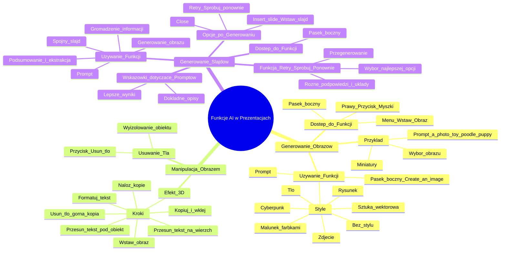

# Lekcje wideo - 6. Prezentacje

# 💡 Diagram

___

# 🗒️ Notatka

# Notatki i Podsumowanie Transkrypcji Wideo - Generowanie Obrazów i Slajdów w Prezentacjach

## Wprowadzenie

Ten dokument zawiera szczegółowe notatki i podsumowanie transkrypcji wideo, która omawia funkcje generowania i manipulacji obrazami oraz slajdami w programie do prezentacji. Prezentacja skupia się na wykorzystaniu sztucznej inteligencji do tworzenia treści wizualnych i ulepszania slajdów.

## Generowanie Obrazów

### Dostęp do Funkcji Generowania Obrazów

- Funkcja generowania obrazów jest dostępna w **pasku bocznym** programu do prezentacji, podobnie jak inne narzędzia.
- Przycisk do generowania obrazów znajduje się w kilku miejscach:
    - **Menu "Wstaw"** -> **Obraz** -> **Pomóż mi wygenerować obraz** (prawy górny róg).
    - **Prawy przycisk myszy** na istniejącym obrazie -> **Zastąp obraz** -> **Wygeneruj**.

### Używanie Funkcji Generowania Obrazów

- Po wybraniu opcji generowania obrazu, po prawej stronie ekranu pojawia się **pasek boczny "Create an image"**.
- W pasku bocznym użytkownik może wprowadzić **prompt** opisujący oczekiwany obraz.
- Możliwość wyboru **stylu** generowanego obrazu:
    - **Bez stylu**: Styl jest narzucany przez prompt.
    - **Zdjęcie**.
    - **Tło**.
    - **Sztuka wektorowa**.
    - **Rysunek**.
    - **Malunek farbkami kolorowymi/wodnymi**.
    - **Cyberpunk**: Styl futurystyczny.

### Przykład Generowania Obrazu

- W przykładzie, użytkownik wybiera **"bez stylu"** i wpisuje prompt **"a photo toy poodle puppy"**.
- Program generuje **cztery różne miniatury** obrazów przedstawiających brązowego pudla toy.
- Użytkownik wybiera jeden z wygenerowanych obrazów, który pojawia się na slajdzie.

## Manipulacja Obrazem - Usuwanie Tła i Efekt 3D

### Usuwanie Tła

- Po wstawieniu obrazu na slajd, można użyć funkcji **"Usuń tło"** (przycisk u góry ekranu po zaznaczeniu obrazu).
- Funkcja **"Usuń tło"** pozwala na wyizolowanie głównego obiektu z obrazu poprzez usunięcie tła.
- W przykładzie, tło zostaje usunięte ze zdjęcia szczeniaka pudla, pozostawiając samego szczeniaka bez tła.

### Tworzenie Efektu 3D

- Funkcja usuwania tła może być użyta do stworzenia **efektu trójwymiarowego** na slajdzie.
- **Kroki do stworzenia efektu 3D:**
    1. Wstaw obraz na slajd.
    2. **Skopiuj i wklej** obraz (Ctrl+C, Ctrl+V), aby nałożyć dwie identyczne kopie na siebie.
    3. Upewnij się, że kopie są **dokładnie nałożone** na siebie.
    4. Wybierz **"Usuń tło"** dla górnej kopii obrazu.
    5. Tekst umieszczony pod obrazami należy **przesunąć na wierzch** (opcja "Porządek" -> "Przesuń do przodu").
    6. Tekst można **sformatować** (np. kolor, pogrubienie, rozmiar czcionki) i umieścić w odpowiednim miejscu.
    7. **Przesuń tekst pod wyizolowanego obiektu** (opcja "Porządek" -> "Przesuń na spód" lub "Send backwards"), aby tekst znalazł się między tłem slajdu a obiektem z usuniętym tłem.
- Ten proces tworzy **efekt trójwymiarowy**, gdzie tekst wydaje się być umieszczony za obiektem na pierwszym planie.

## Generowanie Slajdów

### Dostęp do Funkcji Generowania Slajdów

- Funkcja generowania slajdów jest dostępna w **pasku bocznym** (side panel).
- Oprócz generowania tekstu i obrazów, pasek boczny umożliwia **generowanie całych slajdów**.

### Używanie Funkcji Generowania Slajdów

- W pasku bocznym, użytkownik może wprowadzić **prompt** opisujący temat slajdu.
- Przykład promptu: **"Create a slide about Toy Poodles"**.
- Program **gromadzi informacje** na temat zadanego tematu.
- Informacje są **podsumowywane i ekstraktowane** do krótkiego akapitu, który zostanie umieszczony na slajdzie.
- Generowany jest również **obraz** pasujący do tematu slajdu.
- Wszystkie elementy (tekst, obraz, układ) są składane w **spójny slajd**.

### Opcje po Wygenerowaniu Slajdu

- Po wygenerowaniu slajdu, użytkownik ma do dyspozycji opcje na dole slajdu:
    - **"Close"**: Zamknięcie podglądu slajdu.
    - **"Retry" (Spróbuj ponownie)**: Przegenerowanie całego slajdu (nowy tekst, nowy obraz, nowy układ).
    - **"Insert slide" (Wstaw slajd)**: Wstawienie wygenerowanego slajdu do prezentacji.

### Funkcja "Retry" (Spróbuj Ponownie)

- Funkcja **"Retry"** pozwala na **wielokrotne przegenerowanie slajdu**.
- Warto kilkukrotnie użyć funkcji "Retry", aby sprawdzić różne **podpowiedzi i układy** slajdu.
- Umożliwia to wybór **najlepszej opcji** slajdu.

### Wskazówki dotyczące Promptów

- **Dokładne opisywanie promptem** tego, co ma się znaleźć na slajdzie, prowadzi do **lepszych wyników** generowania.

## Podsumowanie

Prezentacja demonstruje funkcje generowania obrazów i slajdów w programie do prezentacji, wykorzystujące sztuczną inteligencję. Użytkownicy mogą łatwo tworzyć obrazy za pomocą promptów i stylów, manipulować nimi poprzez usuwanie tła i tworzenie efektów 3D, a także generować całe slajdy na podstawie zadanych tematów. Funkcja "Retry" pozwala na iteracyjne ulepszanie generowanych slajdów, a dokładne prompty są kluczowe dla uzyskania satysfakcjonujących rezultatów. Te narzędzia znacząco ułatwiają i przyspieszają proces tworzenia atrakcyjnych i profesjonalnych prezentacji.

___

# 🔉 Transcript
File: Lekcje wideo - 6. Prezentacje.mp4 
[00:00:05] Przejdźmy teraz do prezentacji.
[00:00:08] W prezentacjach, tak jak i w poprzednich narzędziach, znajdziecie pasek boczny, który pozwoli wam na przeszukiwanie i generowanie treści, ale dodatkowo znajdziecie tutaj też przyciski do generowania obrazów.
[00:00:20] Są one umieszczone w kilku miejscach.
[00:00:22] Po pierwsze, tutaj po prawej stronie u góry, w menu wstaw pod obrazem (menu rozwijane "wstaw" rozwija się, podświetlona opcja "obraz" i "pomóż mi wygenerować obraz").
[00:00:32] Pomóż mi wygenerować obraz oraz jak zamieścicie już jakieś inne zdjęcie w slajdzie, będziecie mogli na nie kliknąć prawym przyciskiem myszki i tam wybrać opcję zastąp obraz i wybrać opcję wygenerowania.
[00:00:47] Kiedy wybierzemy dowolny z tych przycisków, pojawi nam się po prawej stronie ekranu pasek, w którym możemy promptem powiedzieć jakiego obrazu oczekujemy i na dole wybrać styl.
[00:01:00] I mamy do dyspozycji wiele różnych czy bez stylu, to wtedy styl jest narzucany z tego co było opisane w prompcie, czy zdjęcie, czy tło, sztuka wektorowa, rysunek, malunek farbkami kolorowymi, wodnymi, czy ewentualnie opcja Cyberpunk, która wygląda bardzo futurystycznie.
[00:01:22] Ja załóżmy wybiorę bez stylu, natomiast w prompcie napiszę, że chciałbym zdjęcie.
[00:01:58] (Po prawej stronie ekranu pojawia się pasek "Create an image". Wpisano prompt "a photo toy poodle puppy". Pod spodem 4 małe miniaturki. Wygenerowane obrazy przedstawiają brązowego pudla toy.)
[00:02:00] Widzimy, że mamy cztery różne zdjęcia.
[00:02:04] Mogę przykładowo kliknąć na to tutaj ostatnie.
[00:02:08] (Po lewej stronie w centralnej części ekranu pojawia się obraz brązowego pudla toy na tle zielonej trawy. Po prawej stronie nadal widoczne miniaturki wygenerowanych obrazów.)
[00:02:09] Wygląda całkiem przyjemnie i teraz, jak mamy takie zdjęcie, możemy pójść o krok dalej i możemy kliknąć u góry przycisk Usuń tło.
[00:02:19] W momencie kiedy wybierzemy usuń tło (kliknięto "remove background"), zobaczcie, że zostanie usunięte tło z tego obrazka i zostanie sam szczeniak, którego możemy umieścić w dowolnym miejscu na prezentacji, tak żeby ewentualnie spójnie grał z tym, co widzimy w prezentacji.
[00:02:36] Natomiast ja zazwyczaj tej funkcjonalności używam w trochę inny sposób.
[00:02:40] Używam jej po to, żeby nadać takiego trójwymiarowego wyglądu konkretnemu slajdowi.
[00:02:46] Zobaczcie, co się stanie, jak jeszcze raz wstawię tego szczeniaka.
[00:02:51] Zrobię kopię tego zdjęcia Ctrl+C, Ctrl+V.
[00:02:55] (Na ekranie pojawia się drugie identyczne zdjęcie pudla nałożone na siebie. Widoczny napis "a photo toy poodle puppy".)
[00:02:56] Ustawie dokładnie w tym samym miejscu, czyli narzucam jedno na drugie.
[00:03:00] Usunę tło.
[00:03:08] (Z góry ekranu znika tło i pozostaje sam pudel.)
[00:03:08] Super i teraz tekst, który był pod spodem, wcisnę porządek, przesunę do przodu.
[00:03:21] Dodam napis "Toy Poodle" i ten napis jakoś przeformatujemy.
[00:03:25] Zróbmy przykładowo żeby był koloru czerwonego, kliknijmy, żeby był pogrubiony i dodatkowo zmieńmy rozmiar czcionki.
[00:03:40] Może na jeszcze większy 96.
[00:03:41] Myślę, że taki będzie dobry.
[00:03:43] Podniosę go trochę w górę i kliknę znowu prawym myszki i tym razem wybiorę opcję porządek send backwards, czyli przesuń jedno w dół.
[00:03:55] To spowoduje, że tekst znajduje się między tłem a obiektem na tym zdjęciu, czyli tym szczeniakiem, dzięki czemu mamy bardzo fajny trójwymiarowy widok slajdu, na którym możemy pracować dalej.
[00:04:17] Ale to nie wszystko.
[00:04:19] Idąc teraz do side panelu, oprócz oczywiście tej części gromadzenia i generowania tekstu, możemy tutaj też wygenerować slajd.
[00:04:30] Więc wygenerujmy przykładowo slajd o pudlach Toy.
[00:04:42] (Po prawej stronie ekranu w side panelu wpisano "Create a slide about Toy Poodles".)
[00:04:42] (Na ekranie pojawia się slajd "Toy Poodle: The Pint-Sized Companion" oraz informacje o rasie i zdjęcie pudla. Na dole 3 opcje: "close", "retry", "insert slide".)
[00:04:42] Pisałem prompta wygeneruj slajd o pudlach Toy.
[00:04:46] Chwilę czekamy, pod spodem teraz jest gromadzona informacja na temat tej rasy.
[00:04:52] Podsumowywane są informacje i ekstraktowane do takiego malutkiego, można powiedzieć akapitu, który będzie umieszczony na slajdzie.
[00:04:58] Generowane jest też zdjęcie, które będzie tutaj użyte i to wszystko jest składane w jeden spójny slajd, który właśnie widzicie, że został tutaj utworzony i podpowiedziany.
[00:05:09] Jeżeli coś by tu się wygenerowało nie tak, albo chcielibyśmy spróbować ponownie, to mamy na dole do dyspozycji funkcję spróbuj ponownie, czyli Retry.
[00:05:22] Klikając ją, zostanie przegenerowany od nowa cały slajd, to oznacza nowy tekst, nowe zdjęcie i nowy układ.
[00:05:31] Warto parę razy kliknąć ten przycisk i sprawdzić, co nam tutaj zostanie podpowiedziane i utworzone.
[00:05:39] Po to żeby wybrać jedną z najlepszych opcji.
[00:05:40] Pamiętajcie też im dokładniej opiszecie promptem, co chcecie mieć na slajdzie, tym lepsze uzyskacie wyniki i mając taki slajd, możemy wcisnąć wstaw i mamy już umieszczone to co chcieliśmy tutaj mieć.

___
# 🏷️ Tags
#generowanie_obrazów #generowanie_slajdów #sztuczna_inteligencja #AI #program_do_prezentacji #pasek_boczny #side_panel #menu_wstaw #obraz #pomóż_mi_wygenerować_obraz #prawy_przycisk_myszy #zastąp_obraz #create_an_image #prompt #styl #bez_stylu #zdjęcie #tło #sztuka_wektorowa #rysunek #malunek_farbkami_kolorowymi #malunek_farbkami_wodnymi #cyberpunk #futurystyczny #miniatura #usuń_tło #wyizolowanie_obiektu #efekt_3D #kopiuj_wklej #ctrl+c #ctrl+v #porządek #przesuń_do_przodu #formatowanie_tekstu #pogrubienie #rozmiar_czcionki #przesuń_na_spód #send_backwards #spójny_slajd #close #retry #spróbuj_ponownie #insert_slide #wstaw_slajd #podpowiedzi #układ #dokładne_opisywanie #ulepszanie_slajdów #toy_poodle #pudel_toy #prezentacja #treści_wizualne #manipulacja_obrazem
