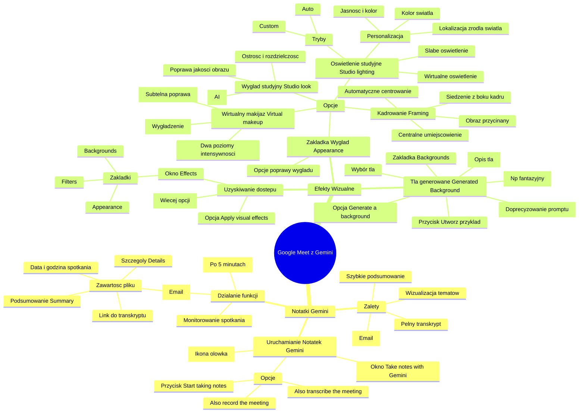

# Lekcje wideo - 7. Meet

# 💡 Diagram

___

# 🗒️ Notatka

# Notatki i Podsumowanie Funkcji Google Meet z Gemini

## Wprowadzenie

Ten dokument zawiera szczegółowe notatki i podsumowanie funkcji Google Meet wspomaganych przez **Gemini**, przedstawionych w materiale wideo. Materiał omawia nowe funkcjonalności, które usprawniają wideokonferencje poprzez automatyczne notowanie, generowanie teł oraz poprawę wyglądu wideo.

## 1. Notatki Gemini

### Uruchamianie Notatek Gemini

- Funkcja jest dostępna po prawej stronie u góry okna Meet, oznaczona ikoną ołówka ✏️.
- Kliknięcie ikony rozwija okno `Take notes with Gemini` (Utwórz notatki z Gemini).
- Dostępne opcje w oknie:
    - `Also transcribe the meeting` (Dodatkowo transkrybuj spotkanie) - opcjonalne
    - `Also record the meeting` (Dodatkowo nagraj spotkanie) - opcjonalne
    - Przycisk `Start taking notes` (Rozpocznij robienie notatek) - uruchamia funkcję.

### Działanie funkcji Notatek Gemini

- Po uruchomieniu funkcji, **Gemini** zaczyna monitorować spotkanie.
- Po upływie około **5 minut**, **Gemini** generuje **pierwsze podsumowanie** w oknie Meet.
    - Przykład podsumowania: "Kacper omawiał funkcje **Gemini** w Google Meet, prezentując ich możliwości."
- Po **zakończeniu spotkania**, użytkownik otrzymuje **plik z pełnym podsumowaniem** na adres e-mail powiązany z Google Workspace.

### Przykładowa zawartość pliku z podsumowaniem (e-mail)

- Temat wiadomości e-mail: `Gemini Notes: Meeting on [Data] at [Godzina] CET`
- Załączony plik (dokument Google Docs) zawiera:
    - **Datę i godzinę spotkania** (np. `Meeting on 19 Nov 2024 at 14:14 CET`).
    - **Link do pełnego transkryptu spotkania**.
        - Pełny transkrypt to **dokładny zapis** wszystkiego, co zostało powiedziane.
    - **Podsumowanie (Summary)** spotkania.
    - **Szczegóły (Details)** spotkania - **wyszczególnione punkty**, które były omawiane.

### Zalety Notatek Gemini

- **Szybkie podsumowanie** spotkania.
- **Wizualizacja** kluczowych tematów i ich zapisywanie w notatkach.
- **Łatwy dostęp** do podsumowania po spotkaniu (przez e-mail 📧).
- **Pełny transkrypt** umożliwiający szczegółową analizę.

## 2. Efekty Wizualne

### Uzyskiwanie dostępu do Efektów Wizualnych

- Kliknij ikonę trzech kropek ⫶ (Więcej opcji) znajdującą się w dolnym pasku narzędzi okna Meet.
- Wybierz opcję `Apply visual effects` (Zastosuj efekty wizualne) z menu.
- Po prawej stronie ekranu otworzy się okno `Effects`.
- Okno `Effects` zawiera zakładki: `Backgrounds` (Tła), `Filters` (Filtry), `Appearance` (Wygląd).

### 2.1. Tła generowane (Generated Background)

- Dostępne w zakładce `Backgrounds`.
- Opcja `Generate a background` (Wygeneruj tło) - funkcja generatywna.
- **Wprowadzanie tekstu (prompt)**: Użytkownik wprowadza opis pożądanego tła.
    - Przykład promptu: "w lesie, obok jeziora, złota godzina".
- **Styl**: Możliwość wyboru stylu tła (np. "fantazyjny").
- Przycisk `Utwórz przykład` (Create example) - generuje przykładowe tła na podstawie wprowadzonego promptu.
- Wybór wygenerowanego tła z dostępnych przykładów.
- **Personalizacja**: Możliwość doprecyzowania promptu poprzez dodanie szczegółów (np. "z tyłu latają ptaki" lub "smok 🐉").

### 2.2. Zakładka Wygląd (Appearance)

- W zakładce `Appearance` znajdują się opcje umożliwiające poprawę wyglądu wideo.
- Dostępne opcje (pola wyboru):
    - `Studio lighting` (Oświetlenie studyjne)
    - `Studio look` (Wygląd studyjny)
    - `Virtual makeup` (Wirtualny makijaż)
    - `Framing` (Kadrowanie)

#### 2.2.1. Oświetlenie studyjne (Studio lighting)

- Funkcja przeznaczona do pomieszczeń o słabym oświetleniu.
- **Wirtualne oświetlenie**: Dodaje sztuczne światło do obrazu wideo.
- Dostępne tryby:
    - `Auto` (Automatyczny)
    - `Custom` (Własny) - bardziej widoczny efekt.
- **Personalizacja**:
    - Regulacja jasności i koloru światła (np. niebieskiego, pomarańczowego 🟠).
    - Możliwość wyboru lokalizacji źródła światła ("żarówki") na ekranie podglądu.
        - Co wpływa na kierunek padania światła na twarz.
    - Możliwość wyboru koloru światła.

#### 2.2.2. Wygląd studyjny (Studio look)

- Poprawa jakości obrazu kamery, redukcja niedoskonałości.
- **Sztuczna inteligencja (AI)** wykrywa i redukuje niedoskonałości obrazu.
- Podkreślenie ostrości i rozdzielczości wideo.

#### 2.2.3. Wirtualny makijaż (Virtual makeup)

- Dostępne dwa poziomy intensywności.
- **Poziom pierwszy (domyślny)**: Subtelna poprawa, redukcja widoczności zmarszczek i porów.
- **Poziom `Smooth` (Wygładzenie)**: Intensywniejsza redukcja, efekt wygładzenia skóry (może być zbyt wyraźny dla niektórych użytkowników).

#### 2.2.4. Kadrowanie (Framing)

- Funkcja automatycznego centrowania obrazu.
- Funkcja szczególnie przydatna dla osób siedzących z boku kadru.
- Obraz jest przycinany w taki sposób, aby osoba znalazła się na środku ekranu.
- Umożliwia centralne umiejscowienie osoby w kadrze, co poprawia odbiór przez rozmówców.

## Podsumowanie

Nowe funkcje Google Meet, wspierane przez **Gemini**, znacząco usprawniają wideokonferencje. Funkcja **Notatki Gemini** automatyzuje proces sporządzania notatek i podsumowań, oszczędzając czas użytkowników i ułatwiając dostęp do kluczowych informacji. **Efekty wizualne** umożliwiają personalizację tła, poprawę oświetlenia i jakości wideo, a także subtelne korekty wyglądu, co podnosi komfort i profesjonalizm wideorozmów. Wszystkie te funkcje wykorzystują **sztuczną inteligencję** do automatyzacji i ulepszania doświadczenia użytkownika w Google Meet.

___

# 🔉 Transcript
File: Lekcje wideo - 7. Meet.mp4 
[00:00:05] Przejdźmy teraz do wideorozmów w ramach Google Meet.
[00:00:09] (Widzicie ekran Google Meet. Kliknięto przycisk Utwórz nowe spotkanie, następnie Wystartuj spotkanie już teraz.)
[00:00:10] Widzicie ekran Google Meet. Kliknę przycisk Utwórz nowe spotkanie.
[00:00:15] Wystartuj spotkanie już teraz.
[00:00:20] Załaduje mi się tutaj okienko i wybiorę dodatkowo uruchomienie mojej kamery, tak żeby wam pokazać jak to wygląda.
[00:00:33] W ramach Meet, znajdziecie parę funkcjonalności, które są trochę inne niż te, które widzieliście dotychczasowo.
[00:00:40] (Ekran prezentuje okno przeglądarki Google Chrome z otwartym oknem spotkania w Meet. W prawym górnym rogu ekranu widoczna ikona ołówka. Kliknięcie ikony powoduje rozwinięcie okna Take notes with Gemini, z opcjami Also transcribe the meeting, Also record the meeting i przyciskiem Start taking notes.)
[00:00:41] Pierwsza z nich znajduje się tutaj po prawej stronie u góry.
[00:00:45] I to jest funkcjonalność robienia notatek z Gemini.
[00:00:49] Jak klikniecie tutaj na opcję rozpocznij robienie notatek.
[00:00:54] W tym momencie Gemini zacznie słuchać co się dzieje na waszym spotkaniu.
[00:00:59] Po około pięciu minutach od rozpoczęcia słuchania.
[01:03] Gemini pokaże wam w tym miejscu pierwsze podsumowanie.
[01:07] I to podsumowanie będzie mówiło o tym, że przykładowo Kacper przez ostatnie 5 minut, opowiadał o Gemini w ramach Google Meet i opowiedział o tych o tych o tych funkcjach.
[01:19] Później, w momencie kiedy takie spotkanie zostanie zakończone, dostaniemy na maila plik z pełnym podsumowaniem, co zostało powiedziane na tym spotkaniu.
[01:31] Pokażę wam taki plik z jednego z poprzednich spotkań, które prowadziłem.
[01:33] (Ekran prezentuje skrzynkę mailową Google Workspace z wiadomością od Gemini Notes: Meeting on 19 Nov 2024 at 14:14 CET.)
[01:34] Czyli na mailu widzicie tutaj przyszło podsumowanie.
[01:39] Klikam na plik, który został załączony.
[01:44] (Został otwarty dokument Google z podsumowaniem spotkania. Na samej górze widnieje data i godzina spotkania: Meeting on 19 Nov 2024 at 14:14 CET. Poniżej znajduje się odnośnik do pełnego transkryptu spotkania oraz podsumowanie Summary i szczegóły spotkania Details.)
[01:44] I tak wygląda ten plik.
[01:46] Mamy u góry informację kiedy spotkanie się odbyło.
[01:49] Mamy odnośnik do pełnego transkryptu i wtedy pełen transkrypt daje nam dokładny opis co, kto powiedział słowo w słowo, czyli to jest dokładny cytat jeden długi z tego z tej wypowiedzi.
[02:02] Natomiast tutaj mamy podsumowanie tego spotkania i mamy wyszczególnione punkty, które na tym spotkaniu były omawiane.
[02:11] Więc dzięki temu możemy w prosty sposób zwizualizować i podsumować notatką ze spotkania o czym była mowa.
[02:20] To jest pierwsza z funkcjonalności w ramach Meet.
[02:23] Przejdźmy dalej.
[02:25] (Ekran prezentuje okno spotkania w Meet. W dolnym pasku narzędzi, po prawej stronie, wciśnięto ikonę z trzema pionowymi kropkami. Spowodowało to rozwinięcie menu, na którym widnieje opcja Apply visual effects.)
[02:25] Druga funkcjonalność będzie schowana tutaj w trzech kropkach.
[02:30] pod, zaaplikuj efekty wizualne.
[02:34] (Następuje rozwinięcie okna Effects z opcjami Backgrounds, Filters i Appearance. Wybrana jest opcja Backgrounds, a poniżej Generate a background.)
[02:34] Klikając na to, wyświetli nam się po prawej stronie ekranu okienko i w ramach tego okna, od razu widzimy pierwszą generatywną funkcję wygeneruj tło.
[02:44] Wybierając ją, mogę wpisać prompt i powiedzieć, że przykładowo chcę być.
[02:51] w lesie.
[02:54] obok jeziora.
[03:09] Złota godzina i w ramach stylu mogę powiedzieć, że chciałbym żeby to było na przykład fantazji.
[03:15] I kliknę utwórz przykład.
[03:18] (Generowanie trwa.)
[03:27] Widzę tutaj kilka z nich.
[03:28] Wybieram przykładowo ten.
[03:33] (Tło ekranu zmienia się na wygenerowany obraz lasu górskiego.)
[03:34] I zobaczcie, już mam tło na spotkaniu, które wygenerowałem specjalnie pod siebie.
[03:38] Gdybym chciał, to dodatkowo w prompcie mógłbym dodać informację, że z tyłu latają ptaki albo smok, albo cokolwiek innego, bo mamy magię promptowania, więc możemy zrobić co chcemy.
[03:51] I to jest pierwszy z takich fajnych generowanych filtrów.
[03:52] Kolejne elementy znajdziecie tutaj w ostatniej zakładce, czyli wygląd.
[03:57] I w ramach tego miejsca mamy cztery checkboxy do odpalenia.
[04:01] Ja na razie wyłączę wszystkie, żebyśmy, żeby nam to nie kolidowało.
[04:04] Pierwszy checkbox to jest oświetlenie studyjne.
[04:08] Jeżeli przykładowo używalibyście komputera, kamery w miejscu, w którym nie jesteście odpowiednio doświetleni, możecie wybrać taką opcję i możecie narzucić sobie wirtualne oświetlenie.
[04:21] Albo macie do wyboru funkcję auto, albo custom.
[04:24] Pokażę wam Custom, bo ją o wiele bardziej widać.
[04:29] Podkreślę jasność światła niebieskiego w górę.
[04:34] Pomarańczowego może też.
[04:35] I teraz zobaczcie tutaj na tym podglądzie po prawej stronie mam tak jakby dwie żarówki i mogę wybrać w którym miejscu ta żarówka ma się znajdować.
[04:44] Patrzcie w międzyczasie, co się dzieje ze światłem na mojej twarzy.
[04:48] Jak umieszczę tą żarówkę z przodu u góry, to bardziej tutaj na moim czole jest umieszczone niebieskie światło.
[04:55] Jak je umieszczę bardziej po prawej stronie na dole, to widzicie, że to światło jest bardziej na brodzie.
[05:00] W zależności od tego gdzie ustawicie te światła, możecie odpowiednio doświetlić swoją twarz i skonstruować sobie taki widok, żeby idealnie was otuliło światłami, które wybierzecie.
[05:12] Możecie też tutaj dobrać kolory, które mają być użyte.
[05:19] Więc jeżeli chcielibyście poeksperymentować z dodatkowym oświetleniem bardzo polecam tą opcję.
[05:22] Druga opcja, to jest studio look.
[05:25] Jeżeli przykładowo wasza kamera nie jest najlepszej jakości, czegoś w niej brakuje lub ewentualnie potrzebowalibyście, może podkreślić rozdzielczość, to wybierając tą funkcję.
[05:38] AI wykryje niedoskonałości waszego obrazu i postara się je zredukować.
[05:45] Kolejna opcja to jest wirtualny makeup.
[05:50] W ramach niego macie do wyboru dwa poziomy.
[05:53] Zobaczcie, jak mam wyłączony, to w tym momencie widać zmarszczki tutaj u mnie na czole i pewnie jakieś pory.
[05:59] Jak włączę tą opcję, to w tym momencie już mi je poprawia delikatnie, więc już zmarszczki są mniejsze, jak tutaj zaczynam robić gest mimiczny.
[06:08] A jak wybiorę smooth to już w ogóle mam taką redukcję, jakbym był świeżo po botoksie.
[06:15] Więc może to już dla mnie akurat przesada, ale wam może się spodoba.
[06:19] I ostatnią opcją do wyboru jest framing.
[06:21] Jeżeli przykładowo na co dzień siedzicie bardziej z boku kadru, a chcecie żeby wasi odbiorcy, osoby z którymi rozmawiacie, widzieli was scentralizowanych, to możecie wybrać opcję framing.
[06:35] I w tym momencie automatycznie zostanie wasz obraz przycięty tak, żeby się znajdował na środku ekranu i wtedy wszyscy będą was widzieli tak jakbyście mieli kamerę wprost przed sobą.

___
# 🏷️ Tags
#google_meet #gemini #wideokonferencje #notatki #podsumowanie #transkrypcja #efekty_wizualne #tła #filtry #wygląd #sztuczna_inteligencja #ai #google_workspace #prompt #oświetlenie_studyjne #wygląd_studyjny #wirtualny_makijaż #kadrowanie #generatywne_tło #take_notes_with_gemini #apply_visual_effects #studio_lighting #studio_look #virtual_makeup #framing #generated_background #meeting_summary #meeting_details #meeting_transcript #automatyczne_notowanie #personalizacja #ulepszanie_wideo #poprawa_wyglądu #redukcja_niedoskonałości #automatyczne_centrowanie #łatwy_dostęp #kluczowe_informacje #profesjonalizm #komfort_użytkowania #oszczędność_czasu #wirtualne_oświetlenie #korekta_wyglądu #ulepszanie_doświadczenia #generowanie_tła #email_podsumowanie #plik_z_podsumowaniem #pełny_transkrypt #szczegółowa_analiza #wizualizacja_tematów #zapisywanie_notatek #dostęp_po_spotkaniu #automatyzacja_procesu #ulepszanie_obrazu #poprawa_jakości_wideo #subtelne_korekty #wygładzenie_skóry #intensywność_efektu #poziomy_intensywności #domyślny_poziom #smooth_poziom #automatyczny_tryb #custom_tryb #regulacja_jasności #regulacja_koloru #lokalizacja_źródła_światła #kierunek_padania_światła #wybór_koloru_światła #eksperymentowanie_z_oświetleniem #podkreślenie_ostrości #podkreślenie_rozdzielczości #wykrywanie_niedoskonałości #redukcja_zmarszczek #redukcja_porów #efekt_botoksu #centralne_umiejscowienie #poprawa_odbioru #nowe_funkcje #usprawnianie_wideokonferencji #monitorowanie_spotkania #pierwsze_podsumowanie #pełne_podsumowanie #adres_email #temat_wiadomości #załączony_plik #dokument_google_docs #data_spotkania #godzina_spotkania #link_do_transkryptu #szczegóły_spotkania #zalety_notatek #szybkie_podsumowanie #wizualizacja_tematów #łatwy_dostęp_do_podsumowania #pełny_transkrypt_spotkania #uzyskiwanie_dostępu #więcej_opcji #zastosuj_efekty_wizualne #okno_efektów #zakładka_tła #zakładka_filtry #zakładka_wygląd #opcja_generowania_tła #wprowadzanie_tekstu #opis_tła #wybór_stylu #przycisk_utwórz_przykład #wybór_tła #doprecyzowanie_promptu #dodawanie_szczegółów #checkboxy_do_odpalenia #włączanie_funkcji #wyłączanie_funkcji #kolidowanie_funkcji #używanie_komputera #używanie_kamery #miejsce_bez_oświetlenia #narzucanie_wirtualnego_oświetlenia #podgląd_po_prawej_stronie #żarówki_na_ekranie #umieszczanie_żarówki #światło_na_twarzy #dobieranie_kolorów #eksperymentowanie_z_oświetleniem #kamera_nie_najlepszej_jakości #brak_jakości #potrzeba_podkreślenia_rozdzielczości #wykrywanie_niedoskonałości_obrazu #redukcja_niedoskonałości_obrazu #poprawa_delikatna #redukcja_widoczności #gest_mimiczny #przesada_z_efektem #siedzenie_z_boku_kadru #chęć_scentralizowania #automatyczne_przycięcie_obrazu #znajdowanie_się_na_środku_ekranu #widzenie_wprost_przed_sobą #nowe_funkcje_google_meet #wspierane_przez_gemini #znacząco_usprawniają #automatyzacja_procesu_sporządzania_notatek #oszczędzanie_czasu_użytkowników #ułatwianie_dostępu #personalizacja_tła #poprawa_oświetlenia #poprawa_jakości_wideo #subtelne_korekty_wyglądu #podnoszenie_komfortu #podnoszenie_profesjonalizmu #wykorzystanie_sztucznej_inteligencji #automatyzacja_doświadczenia #ulepszanie_doświadczenia_użytkownika #wirtualny_makijaż_poziomy #intensywność_wirtualnego_makijażu #efekt_wygładzenia_skóry #automatyczne_centrowanie_obrazu #poprawa_odbioru_przez_rozmówców #centralne_umiejscowienie_w_kadrze #wirtualne_oświetlenie_tryby #wirtualne_oświetlenie_personalizacja #wirtualne_oświetlenie_regulacja #wirtualne_oświetlenie_lokalizacja #wirtualne_oświetlenie_kolory #studio_look_poprawa_jakości #studio_look_redukcja_niedoskonałości #studio_look_podkreślenie_ostrości #studio_look_podkreślenie_rozdzielczości #wirtualny_makijaż_redukcja_zmarszczek #wirtualny_makijaż_redukcja_porów #wirtualny_makijaż_efekt_wygładzenia #kadrowanie_automatyczne_centrowanie #kadrowanie_poprawa_odbioru #kadrowanie_centralne_umiejscowienie
