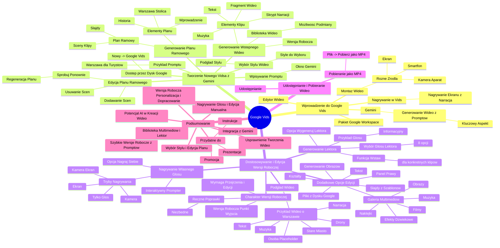

# Lekcje wideo - 8. Vids

# 💡 Diagram

___

# 🗒️ Notatka

# Notatki i Podsumowanie Transkrypcji Wideo o Google Vids

## Wprowadzenie do Google Vids

*   Google Vids to nowa aplikacja w pakiecie `Google Workspace`, pełniąca funkcję **edytora wideo**.
*   Umożliwia **montaż wideo** z różnorodnych źródeł, takich jak:
    *   Wideo nagrane smartfonem.
    *   Nagrania ekranu.
    *   Materiały z kamery lub aparatu.
*   Oferuje możliwość **nagrywania bezpośrednio w Vids**:
    *   Nagrywanie ekranu z narracją głosową, przydatne do tworzenia instrukcji.
*   Wykorzystuje **Gemini** do **generowania wideo** na podstawie **promptów** – **kluczowy aspekt prezentacji**.

## Tworzenie Nowego Vidsa z Wykorzystaniem Gemini

1.  **Dostęp przez Dysk Google:**
    *   Otwórz **Dysk Google**.
    *   Kliknij **Nowy** -> **Google Vids**.
    *   **Ekran:** Prezentacja Dysku Google.
2.  **Wpisywanie Promptu:**
    *   Po uruchomieniu Vidsa, pojawi się okno z prośbą o **wprowadzenie promptu**.
    *   **Prompt** definiuje zawartość generowanego wideo.
    *   **Ekran:** Wyskakujące okno Gemini.
3.  **Przykład Promptu:**
    *   Prelegent podaje przykładowy **prompt**: „Chciałbym pokazać turystom, dlaczego warto odwiedzić Warszawę.”
4.  **Generowanie Planu Ramowego (Outline):**
    *   Po wprowadzeniu **promptu** i kliknięciu „Dalej”, generowany jest **plan ramowy wideo**.
    *   **Plan ramowy** składa się z **pojedynczych scen** lub **klipów**.
    *   Analogicznie do **slajdów w prezentacji**.
    *   **Plan ramowy** zawiera: wprowadzenie, przedstawienie Warszawy jako stolicy Polski, elementy historyczne i inne.
5.  **Edycja Planu Ramowego:**
    *   Dostępna jest opcja **edycji planu**.
    *   Możliwość dodawania **nowych scen**.
    *   Usuwania **istniejących scen**.
    *   Opcja **„Spróbuj ponownie”** – ponowne generowanie planu.
6.  **Wybór Stylu Wideo:**
    *   Po edycji planu, pojawia się pytanie o **styl wideo**.
    *   Dostępnych jest kilka **stylów do wyboru**.
    *   **Ekran:** Wybór stylu wideo.
    *   Możliwość **podglądu przykładu stylu** przed dokonaniem wyboru.
7.  **Generowanie Wstępnego Wideo (Wersji Roboczej):**
    *   Kliknięcie **„Utwórz wersję roboczą wideo”** inicjuje generowanie **wstępnego wideo**.
    *   Wideo składa się z **pojedynczych klipów**, a każdy z nich zawiera:
        *   **Tekst**.
        *   **Fragment wideo** z biblioteki – z możliwością ręcznej podmiany i wyszukiwania.
        *   **Muzykę** w tle.
        *   **Skrypt** po prawej stronie – sugestie dotyczące narracji dla każdej sceny.

## Dostosowywanie i Edycja Wersji Roboczej Wideo

1.  **Nagrywanie Własnego Głosu:**
    *   Opcja **„Nagraj siebie”**.
    *   Wybór trybu nagrywania:
        *   Z kamerą.
        *   Z ekranem.
        *   Kamera i ekran jednocześnie.
        *   Tylko głos.
    *   **Interaktywny prompter** ułatwiający nagrywanie narracji.
        *   **Prompter** wyświetlany u góry ekranu, blisko kamery.
2.  **Generowanie Lektora (Voice Over):**
    *   Opcja **„Wygeneruj lektora”**.
    *   Wybór **głosu lektora** spośród ośmiu dostępnych opcji.
    *   Przykład wybranego głosu: **„informacyjny”**.
    *   Możliwość wstawiania narracji do **konkretnych klipów** za pomocą funkcji „Wstaw”.
3.  **Podgląd Wideo:**
    *   Możliwość **podglądu wygenerowanego wideo**.
    *   Przykład wideo o Warszawie:
        *   Muzyka w tle.
        *   Narracja lektora.
        *   Ujęcia z drona.
        *   Tekstowe informacje.
        *   Obraz osoby (placeholder – do zastąpienia własnym wideo).
        *   Fragment Starego Miasta w Warszawie.
4.  **Charakter Wersji Roboczej Wideo:**
    *   **Ważne:** Wygenerowane wideo to **jedynie wersja robocza**.
    *   Mimo że **wersja robocza jest dobrze zmontowana**, wymaga **przejrzenia i dalszej edycji**.
    *   **Ręczne poprawki** są niezbędne do uzyskania finalnej, idealnej wersji wideo.
5.  **Dodatkowe Opcje Edycji:**
    *   Panel po prawej stronie oferuje przyciski do:
        *   Generowania **dodatkowych obrazów**.
        *   Wstawiania **slajdów z szablonów**.
        *   Dodawania **tekstu**.
        *   Dodawania **kształtów**.
        *   Przeglądania **galerii filmów, obrazów, muzyki, naklejek i efektów dźwiękowych**.
        *   Wstawiania **plików z Dysku Google**.

## Udostępnianie i Pobieranie Wideo

*   **Udostępnianie:** Kliknij **„Udostępnij”**.
*   **Pobieranie:** Plik -> **Pobierz jako MP4**.

## Podsumowanie

Google Vids to nowe narzędzie w `Google Workspace`, które usprawnia proces tworzenia wideo, szczególnie dzięki integracji z **Gemini**. Użytkownicy mogą szybko generować **wstępne wersje wideo (wersje robocze)** na podstawie **promptów**, wybierając styl i edytując plan ramowy. Aplikacja udostępnia bibliotekę multimediów, funkcję generowania lektora, opcje nagrywania własnego głosu oraz szeroki zakres manualnych opcji edycji. **Kluczowe jest zrozumienie, że wygenerowane wideo stanowi punkt wyjścia (wersję roboczą), wymagający dalszej personalizacji i dopracowania przez użytkownika.** Google Vids jest przydatny do szybkiego tworzenia filmów instruktażowych, prezentacji czy materiałów promocyjnych, wykorzystując potencjał sztucznej inteligencji w procesie kreacji wideo.

___

# 🔉 Transcript
File: Lekcje wideo - 8. Vids.mp4 
[00:00:05] Speaker: Przejdziemy teraz do Google Vids, czyli nowej aplikacji w pakiecie Google Workspace, która jest edytorem wideo.
[00:00:13] Speaker: Możecie do niej zarówno wrzucić wideo, które wcześniej nagraliście telefonem, kawałek swojego ekranu, coś nagranego kamerą, aparatem i tak dalej, i zmontować to w jeden długi film.
[00:00:26] Speaker: Możecie wejść bezpośrednio w Vid i nagrać na przykład kawałek swojego ekranu z waszym głosem, żeby komuś wytłumaczyć, jak mają używać danej aplikacji, lub możecie też w Vidsach wykorzystać Gemini do tego, żeby wygenerowało wam jakieś wideo.
[00:00:42] Speaker: I to jest to, na czym właśnie się skupimy.
[00:00:45] Speaker: Aby utworzyć nowego Vidsa, wchodzimy na Dysk Google, wybieramy nowy i tworzymy Google Vids.
[00:00:46] Screen: Prezentacja Dysku Google.
[00:00:56] Speaker: Po utworzeniu nowego Vidsa zostanie nam wyświetlone okienko z prośbą o wpisanie prompta.
[00:01:04] Speaker: I w tym promcie możemy zawrzeć, co dokładnie chcielibyśmy zobaczyć w ramach naszego wideo, które tworzymy.
[00:01:11] Screen: Okno wyskakujące Gemini.
[00:01:12] Speaker: Ja przykładowo stworzyłem prompta.
[00:01:27] Speaker: Chciałbym pokazać turystom, dlaczego warto odwiedzić Warszawę.
[00:01:31] Speaker: Wciskam next.
[00:01:33] Speaker: W tym momencie zostanie wygenerowany taki plan ramowy naszego wideo, który później przełoży się na pojedyncze klipy.
[00:01:43] Speaker: Możecie to sobie wyobrazić, tak jakby to były pojedyncze slajdy w prezentacji, a całokształt będzie jednym długim nagraniem.
[00:01:49] Speaker: Zobaczymy, że zaczyna od wprowadzenia, od przywitania Warszawy jako stolicy Polski, opowieści historycznej i wielu, wielu innych elementów.
[00:02:03] Speaker: W tym momencie możemy wyedytować te fragmenty, możemy dodać nowe sceny lub skasować już istniejące, albo u góry wcisnąć przycisk spróbuj ponownie, żeby wygenerowało nam wszystko od nowa.
[00:02:16] Speaker: Klikając dalej, zostaniemy zapytani o to, w jakim stylu powinno być stworzone to wideo.
[00:02:22] Speaker: Mamy tutaj do wyboru spośród kilku.
[00:02:25] Screen: Wybór stylu wideo.
[00:02:26] Speaker: Myślę, że to jest dość interesujące, więc wybierzemy taki styl.
[00:02:30] Speaker: Klikając na niego, widzę przykład, jak będą wyglądały różne slajdy zawarte w tym stylu.
[00:02:40] Speaker: I klikając Create the draft video zostanie utworzone nam pierwsze wideo.
[00:02:44] Speaker: Będzie ono składało się z pojedynczych klipów.
[00:02:49] Speaker: Na każdym klipie będzie jakiś tekst, będzie fragment wideo, który jest wyciągnięty z wcześniej przygotowanej biblioteki wideo, do której możecie sięgnąć, wyszukać sobie dodatkowe kadry i je ewentualnie umieścić ręcznie, bądź podmienić na inne, jeżeli tak będziecie chcieli.
[00:03:06] Speaker: Zostanie tutaj też podstawiony dźwięk pod spodem, dzięki czemu całe wideo będzie miało muzykę.
[00:03:14] Speaker: Zobaczymy też tutaj po prawej skrypty, które będą nam opowiadały o tym, co powinniśmy powiedzieć na każdym kolejnym slajdzie.
[00:03:23] Speaker: Możemy w tym momencie wybrać opcję nagraj samego siebie i wybrać, czy chcemy nagrywać siebie z kamerą, z ekranem, czy i kamerą sam ekran, czy tylko nasz głos.
[00:03:35] Speaker: Jak będziemy tutaj nagrywali głos, to dodatkowo pojawi nam się interaktywny prompter, który będzie nam podpowiadał, co mamy powiedzieć.
[00:03:43] Speaker: Prompter będzie się znajdował na górze ekranu, dzięki czemu wasz wzrok naturalnie skupi się w tym punkcie, w którym jest zamontowana kamera zazwyczaj w komputerach.
[00:03:52] Speaker: Lub też możecie kliknąć Generate the voice over i za pomocą tego wybrać jaki głos chcecie wygenerować.
[00:04:01] Speaker: Mamy tu do dyspozycji osiem głosów i przykładowo chciałbym wybrać informacyjny.
[00:04:06] Speaker: Wybierz i jak wstawię wstaw, jak wybiorę wstaw, to w tym momencie zostanie wstawiona ta narracja do konkretnego klipu.
[00:04:17] Speaker: Wstawię tą narrację też do drugiego klipu, żebyście zobaczyli trochę więcej wygeneruj, insert.
[00:04:27] Speaker: Przewinę na początek.
[00:04:31] Speaker: I zobaczmy, jak wygląda teraz nasze wideo.
[00:04:34] Speaker: Discover Warsaw, a city of captivating history, rich culture, and undeniable charm.
[00:04:42] Speaker: Welcome to Warsaw, Poland's vibrant and enchanting capital city.
[00:04:48] Speaker: W tle możecie słyszeć muzykę, były wstawione narracje, widzimy loty z drona, widzimy dodatkowe informacje i ewentualnie obraz osoby, którą możecie podmienić na swoje wideo nagranie siebie, żeby to lepiej wyglądało.
[00:05:02] Speaker: Tutaj widzimy fragment starówki i pamiętajcie, że to jest znowu, tak samo jak w wypadku innych generowanych elementów, tylko draft.
[00:05:10] Speaker: Draft, który już jest bardzo fajnie poskładany, ale teraz powinniście przejrzeć ten draft, zobaczyć które elementy wam się podobają, które nie i ewentualnie poprawić je manualnie tak, żeby stworzyć wideo, które będzie dla was idealne.
[00:05:27] Speaker: W dowolnym miejscu możecie tu po prawej stronie wykorzystać przyciski do tego, żeby generować dodatkowe obrazki, żeby wstawiać sobie slajdy z templatów, żeby wstawiać dodatkowy tekst, dodatkowe kształty, żeby przeszukiwać galerię filmów, galerię obrazów, wygenerowanych muzyki, naklejek, efektów dźwiękowych i innych rzeczy, czy też za pomocą tego folderu odwołać się do plików na waszym dysku i wtedy wstawić sobie pliki z waszego dysku, tak żeby urozmaicić to nagranie.
[00:06:01] Speaker: Jak już będziecie gotowi, możecie taki film komuś udostępnić, klikając Share albo wchodząc w plik, pobrać go jako MP4.

___
# 🏷️ Tags
#Google_Vids #Google_Workspace #edytor_wideo #montaż_wideo #nagrywanie_ekranu #Gemini #generowanie_wideo #prompt #Dysk_Google #plan_ramowy #sceny #klipy #slajdy #edycja_wideo #styl_wideo #wersja_robocza #tekst #muzyka #skrypt #narracja #nagrywanie_głosu #kamera #ekran #interaktywny_prompter #lektor #voice_over #udostępnianie_wideo #pobieranie_wideo #MP4 #film_instruktażowy #prezentacje #materiały_promocyjne #sztuczna_inteligencja #Warszawa #turystyka #Stare_Miasto #Polska #AI #wideo
