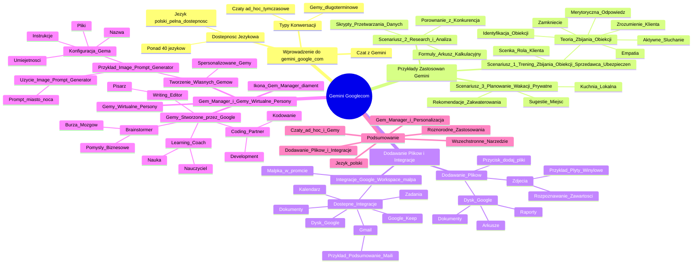

# Lekcje wideo - 9. Gemini

# 💡 Diagram

___

# 🗒️ Notatka

# Gemini - Szczegółowe Notatki i Podsumowanie

## Wprowadzenie do gemini.google.com

*   Strona **gemini.google.com** umożliwia bezpośredni czat z `Gemini`.
*   Dostępne typy konwersacji:
    *   **Czaty ad hoc (tymczasowe):**
        *   Do szybkich pytań i natychmiastowych odpowiedzi.
        *   Konwersacje dostępne w przyszłości.
    *   **`Gemy` (konwersacje długoterminowe):**
        *   Konwersacje przydatne w dłuższej perspektywie.
        *   Szczegóły omówione zostaną później.
*   **Dostępność językowa:**
    *   `Gemini Googlecom` dostępny w ponad 40 językach.
    *   **Pełna dostępność w języku polskim.**
    *   Możliwość wprowadzania promptów i otrzymywania odpowiedzi po polsku.
    *   Analiza polskich dokumentów i zdjęć.

## Przykłady Zastosowań `Gemini`

### Scenariusz 1: Trening Zbijania Obiekcji (Sprzedawca Ubezpieczeń)

*   **Prompt:** "Jestem sprzedawcą ubezpieczeń. Chcę potrenować zbijanie obiekcji. Odegramy scenkę, w której Ty będziesz klientem, a ja sprzedawcą."
*   `Gemini` wciela się w rolę klienta.
*   **Przykład interakcji:**
    *   **Sprzedawca:** "Mam super ubezpieczenie, tanie i ubezpiecza wszystko!"
    *   **`Gemini` (Klient):** "Wszystko? To ogólnikowe stwierdzenie. Co konkretnie obejmuje to ubezpieczenie i co rozumie Pan przez "tanie"? Potrzeby i możliwości finansowe są różne. Proszę o więcej szczegółów."
*   Możliwość ćwiczenia umiejętności sprzedażowych poprzez:
    *   Pogłębianie rozmowy.
    *   Opisywanie szczegółów.
    *   Używanie języka sprzedażowego.
*   **Przerwanie scenki i przejście do teorii:**
    *   **Prompt:** "Przerwijmy scenę. Jaka jest teoria zbijania obiekcji?"
    *   `Gemini` przedstawia teorię zbijania obiekcji:
        *   Zrozumienie klienta i jego problemu.
        *   Aktywne słuchanie.
        *   Empatia.
        *   Identyfikacja prawdziwej obiekcji.
        *   Merytoryczna odpowiedź.
        *   Zamknięcie.

### Scenariusz 2: Research i Analiza

*   **Przykłady promptów:**
    *   Porównanie firmy z konkurencją - wskazanie kierunków rozwoju i mocnych stron.
    *   Generowanie formuł do arkuszy kalkulacyjnych.
    *   Generowanie skryptów do automatycznego przetwarzania danych.

### Scenariusz 3: Planowanie Wakacji (Zastosowanie Prywatne)

*   Wykorzystanie `Gemini` do planowania podróży.
*   **Możliwości:**
    *   Sugestie miejsc do zwiedzania.
    *   Rekomendacje dzielnic/regionów do zakwaterowania.
    *   Podpowiedzi dotyczące lokalnej kuchni.

## Dodawanie Plików i Integracje

### Dodawanie Plików

*   **Przycisk "dodaj pliki" po prawej stronie okna promptowania.**
*   Możliwość dodawania **zdjęć**.
    *   `Gemini` rozpoznaje zawartość zdjęć i wyodrębnia informacje.
    *   **Przykład z listą prezentów:**
        *   Zdjęcie biblioteczki płyt winylowych.
        *   `Gemini` wygenerował listę płyt (zespół, płyta, rok wydania).
        *   Udostępnienie listy żonie, aby uniknąć zdublowanych prezentów.
*   Załączanie plików z **Dysku Google**.
    *   Odwoływanie się do raportów, arkuszy kalkulacyjnych, dokumentów.
    *   Przetwarzanie danych, analiza, podejmowanie decyzji, generowanie dodatkowych informacji.

### Integracje Google Workspace (@)

*   Wpisanie **małpki (@)** w promcie wyświetla listę dostępnych integracji.
*   **Dostępne integracje:**
    *   Dysk Google
    *   Dokumenty
    *   Gmail
    *   Zadania
    *   Google Keep
    *   Kalendarz
*   **Przykład integracji z `Gmail`:**
    *   **Prompt:** "Podsumuj maile o bezpieczeństwie `Workspace`."
    *   `Gemini` odwołuje się do `Gmaila` i analizuje maile.
    *   **Przykład działania:** "Podsumuj moje maile."
    *   `Gemini` analizuje wiadomości e-mail i generuje podsumowanie (powiadomienia o terminach, notatki ze spotkań, udostępnione pliki, raporty itp.).

## `Gem Manager` i `Gemy` (Wirtualne Persony)

*   **Ikona `Gem Manager` (diament 💎) po lewej stronie.**
*   **`Gemy`:** Wirtualne persony tworzone w konkretnym celu.
*   **`Gemy` Stworzone przez Google:**
    *   **`Brainstormer`:**
        *   Do burzy mózgów i generowania nowych pomysłów biznesowych.
        *   Skalowanie pomysłów, rozwijanie możliwości.
        *   Planowanie kampanii marketingowych, inwestycji.
    *   **`Coding Partner`:**
        *   Partner do kodowania i developmentu.
        *   Generowanie kodu, poprawki w kodzie, tworzenie aplikacji.
    *   **`Learning Coach`:**
        *   Nauczyciel.
        *   Nauka nowych rzeczy (np. teoria muzyki, interwały muzyczne).
    *   **`Writing Editor`:**
        *   `Gem` pisarza.
*   **Tworzenie Własnych `Gemów`:**
    *   Możliwość tworzenia spersonalizowanych `Gemów`.
    *   **Przykład: `Image Prompt Generator`**
        *   `Gem` do generowania promptów dla obrazów.
        *   **Konfiguracja Gema (Edit):**
            *   **Nazwa:** `Image Prompt Generator`.
            *   **Instrukcje:** "Jesteś ekspertem w fotografii, generowaniu obrazów i grafice komputerowej. Zawsze gotowy dostarczyć najlepszy prompt, aby otrzymać realistyczny obraz."
            *   Dodatkowe umiejętności i sposób umieszczania odpowiedzi (szczegóły w konfiguracji).
            *   Możliwość dodawania plików PDF, dokumentów z Dysku Google jako źródła wiedzy dla gema.
        *   **Przykład użycia `Image Prompt Generator`:**
            *   **Prompt:** "miasto nocą"
            *   `Gem` generuje opis, jak powinno wyglądać wygenerowane zdjęcie na podstawie prostego promptu.
            *   Możliwość doprecyzowania promptu i uzyskania bardziej szczegółowych opisów.

## Podsumowanie

`Gemini` na gemini.google.com to wszechstronne narzędzie do interakcji z modelem językowym, dostępne w języku polskim. Oferuje szybkie czaty ad hoc i długoterminowe `Gemy` do bardziej złożonych zadań. Użytkownicy mogą wykorzystywać `Gemini` do różnorodnych celów, od treningu umiejętności sprzedażowych, poprzez research i planowanie, aż po generowanie pomysłów i kodowanie. Kluczową funkcjonalnością jest dodawanie plików (zdjęć, dokumentów) oraz integracja z usługami `Google Workspace` (@), co pozwala na analizę danych z `Gmaila`, `Dysku Google` i innych aplikacji. Funkcja `Gem Manager` umożliwia tworzenie i korzystanie z wirtualnych person (`Gemów`) dostosowanych do konkretnych zadań, co zwiększa efektywność i personalizację interakcji z `Gemini`. `Gemy` mogą być predefiniowane przez Google lub tworzone indywidualnie, otwierając szerokie możliwości dostosowania narzędzia do specyficznych potrzeb.

___

# 🔉 Transcript
File: Lekcje wideo - 9. Gemini.mp4 
[00:00:05] Przejdźmy teraz do gemini.google.com.
[00:00:09] To jest pełnowymiarowa strona, w której możecie czatować bezpośrednio z Gemini.
[00:00:15] Możecie tutaj otwierać zarówno
[00:00:17] tymczasowe, ja to nazywam ad hocowe czaty, w których zapytacie o dowolny element, który was interesuje, już teraz chcecie uzyskać odpowiedź, przejść przez tą konwersację, ale wiecie, że do tej konwersacji może kiedyś wrócicie, a może nie.
[00:00:34] Ale też możecie tutaj tworzyć sobie gemy, czyli konwersacje, które będą wam przydatne
[00:00:41] w dłuższym czasie, do których za chwilę przejdziemy.
[00:00:44] Warto tutaj wspomnieć, że Gemini Googlecom już dzisiaj jest dostępne w ponad 40 językach.
[00:00:52] W tym jest dostępne w pełni po polsku.
[00:00:55] Dzięki czemu jeżeli teraz tutaj wpiszemy prompt w języku polskim, otrzymamy pełną polską odpowiedź.
[00:01:02] Będzie w stanie nam też przeanalizować polskie dokumenty, zdjęcia i wiele, wiele innych elementów.
[00:01:08] Zobaczmy, co możemy zrobić.
[00:01:10] Możemy przykładowo
[00:01:15] wpisać taki prompt.
[00:01:17] Jestem
[00:01:23] Jestem sprzedawcą ubezpieczeń.
[00:01:25] Chciałbym
[00:01:28] potrenować
[00:01:31] zbijanie obiekcji.
[00:01:35] Odegramy scenkę,
[00:01:40] w której ty będziesz klientem, a ja będę próbował sprzedać.
[00:01:17] (Ekran przedstawia okno przeglądarki z Gemini Advanced. Pole do wpisywania tekstu zawiera: "Jestem sprzedawcą ubezpieczeń. Chciałbym potrenować zbijanie obiekcji. Odegramy scenkę w której Ty będziesz Klientem a ja będę próbował sprzedać")
[00:01:58] Gemini przeanalizuje tego prompta, wcieli się w rolę i już jest gotowy.
[00:02:04] Teraz ja jako sprzedawca mogę powiedzieć
[00:02:09] Mam dla pana
[00:02:20] Mam dla Pana super ubezpieczenie, tanie i ubezpiecza wszystko!
[00:02:21] (Ekran przedstawia okno przeglądarki z Gemini Advanced. Pole do wpisywania tekstu zawiera: "Mam dla Pana super ubezpieczenie! Tanie i ubezpiecza wszystko!")
[00:02:24] Na co Gemini mi odpowie, wszystko?
[00:02:26] To dość ogólne stwierdzenie.
[00:02:28] A co konkretnie obejmuje to ubezpieczenie i co Pan rozumie przez tanie?
[00:02:31] Każdy ma inne potrzeby i możliwości finansowe.
[00:02:34] Proszę o więcej szczegółów.
[00:02:35] W ten sposób mogę ćwiczyć swoje umiejętności sprzedażowe, wchodząc w głąbiej w rozmowę z Geminiem, opisując mu więcej, używając konkretnych elementów języka sprzedażowego i szlifując moje umiejętności.
[00:02:50] Mógłbym tą scenkę rozgrywać przez dłuższy czas, a mógłbym w tym momencie ją przerwać i odwołać się przykładowo do wiedzy teoretycznej.
[00:03:00] I na przykład
[00:03:02] napisać coś takiego.
[00:03:04] Przerwijmy scenę.
[00:03:10] Powiedz mi, jaka jest teoria zbijania obiekcji.
[00:03:17] (Ekran przedstawia okno przeglądarki z Gemini Advanced. Pole do wpisywania tekstu zawiera: "Przerwijmy scenę. Powiedz mi jaka jest teoria zbijania obiekcji")
[00:03:20] W ten sposób przerwiemy tą konwersację i Gemini zamiast tego powie mi, że najważniejsze jest przede wszystkim zrozumieć klienta i rozwiązać jego problem, czyli ważne jest aktywne słuchanie, empatia, identyfikacja prawdziwej obiekcji, merytoryczna odpowiedź, zamknięcie i tak dalej.
[00:03:37] To jest tylko jeden z przykładów, jak możemy dokonywać interakcji z Gemini.
[00:03:42] Innym przykładem byłoby, kiedy chciałbym zrobić jakiś research.
[00:03:48] Mógłbym tu przykładowo wpisać prompta, w którym odpytam o porównanie mojej firmy z firmami konkurencyjnymi i dostanę odpowiedzi wskazujące, w których kierunkach warto się rozwijać, które kierunki warto nadgonić, a w których kierunkach być może moja firma już dzisiaj jest mocna i warto je jeszcze szlifować.
[00:04:10] Mógłbym tutaj poprosić o generowanie formuł do arkuszy kalkulacyjnych, albo nawet skryptów, które później będę mógł wykorzystać do tego, żeby automatycznie przetwarzać dane.
[00:04:21] I wiele, wiele innych elementów.
[00:04:24] Prywatnie, muszę wam się przyznać, że ja używam tego czatu do planowania wakacji, w którym przykładowo jestem w stanie umieścić informację, w jakich miesiącach, gdzie chcę się wybrać.
[00:04:35] Gemini podpowie mi, jakie są dobre punkty do zwiedzania, w których dzielnicach miasta lub regionach warto się zatrzymać, co zjeść.
[00:04:44] To też jest bardzo super narzędzie.
[00:04:46] Zobaczcie teraz, że w ramach tego promptowania, po prawej stronie macie też przycisk dodaj pliki, więc tu możecie wskazać zdjęcia i to na przykład rozpozna, co macie na zdjęciu zawarte, jakie informacje.
[00:05:01] Ostatnio na przykład robiłem dla mojej żony listę prezentów, które mogłaby mi zrobić na gwiazdkę.
[00:05:08] Zrobiłem zdjęcie biblioteczki płyt winylowych, które mam u siebie zgromadzone.
[00:05:13] Poprosiłem Gemini o wylistowanie, jakie płyty tam się znajdują, wyciągnął informacje ze zdjęć, zrobił mi pełną listę z informacją, co to za zespół, płyta, rok wydania i mogłem to udostępnić mojej żonie, dzięki czemu ona wiedziała, jakie płyty już mam, żeby ewentualnie nie pomyliła prezentu.
[00:05:31] Kolejną z opcji jest umieszczanie tutaj plików lub załączanie plików z Dysku Google, dzięki czemu możecie odwoływać się do konkretnych raportów, arkuszy kalkulacyjnych, tabel z danymi, dokumentów, które posiadacie i odpowiednio przetwarzać te dane do tego, żeby je czy to analizować, czy podejmować jakieś konkretne decyzje, czy też generować na ich bazie jakieś dodatkowe informacje.
[00:06:00] Możecie też bezpośrednio w ramach promptu wstawić małpkę
[00:06:06] i zobaczcie, że wyświetla mi się teraz lista dodatkowych rozszerzeń, z których możecie użyć.
[00:06:12] Przykładowo, mamy odwołanie do Dysku Google.
[00:06:16] Mamy odwołanie do dokumentów, do Gmaila, do zadań, do Google Kipa i kalendarza
[00:06:22] i jeżeli chciałbym powtórzyć to ćwiczenie, które robiliśmy w jednej z pierwszych lekcji Gmailowych i odwołać się do wszystkich maili, które mówią o bezpieczeństwie w Google Workspace, to tutaj mógłbym też napisać prompta.
[00:06:37] Podsumuj
[00:06:40] mi wszystkie maile o bezpieczeństwie
[00:06:49] workspace.
[00:06:51] Piszac takiego prompta Gemini odwołuje się do Gmaila, wyciąga informacje na temat maili, których tam mam zgromadzone i będzie w stanie mi je pokazać.
[07:01] Widzimy, że za pierwszym razem coś się nie powiodło, dlatego mogę kliknąć przycisk Regenerate draft, spróbuj ponownie.
[07:09] Zobaczmy, czy za drugim razem nam się uda.
[07:16] Widzimy, że pojawił się moduł Workspaceowy, odwołało się do maili, ale niestety akurat w tym wypadku nie był w stanie ich znaleźć.
[07:24] Więc może powtórzmy ten przypadek od nowa.
[07:27] Dobra.
[07:27] Tutaj utniemy.
[07:31] Zobaczcie, że jak bezpośrednio w promcie wciśniemy małpę,
[07:35] to tutaj możemy wybrać dodatkowe integracje.
[07:39] Możemy przyłączyć się do Dysku Googlewego, do dokumentów, do Gmaila, do zadań, Kipa czy kalendarza i za pomocą tego możemy przykładowo przeanalizować nasze wiadomości email.
[07:50] Mogę wybrać Gmail,
[07:52] Mogę wpisać prompta podsumuj moje maile.
[07:57] W tym momencie widzicie, że Gemini podpiął się do rozszerzenia Google Workspace, ocenia wiadomości email i za chwilę mi tutaj wylistuje, jakie mam ostatnie wiadomości i
[08:09] podsumowanie.
[08:09] Mamy powiadomienia o terminach, notatki ze spotkań, udostępnione pliki, jakieś raporty i tak dalej i tak dalej, więc widzimy, że w tym punkcie możemy też dokonywać fajnych interakcji z naszą skrzynką.
[08:23] Ale słuchajcie, tak naprawdę zabawa w tym panelu Gemini zaczyna się dopiero, kiedy wejdziemy tutaj po lewej stronie w ikonę Gem Manager, to jest ten diament.
[08:36] Klikając na niego możecie dostać się do tak zwanych gemów.
[08:41] Gemy to są wirtualne persony, które budujecie w jakimś celu.
[08:48] U góry zobaczcie, macie tutaj listę gemów stworzonych przez Google.
[08:53] Jak kliknę pokaż więcej, zobaczycie, że mamy tak.
[08:57] Pierwszy z nich nazwany Brainstormer, to jest gem, do którego powinniśmy się odwoływać za każdym razem, kiedy potrzebujemy stworzyć jakąś burzę myśli i wygenerować być może nowy pomysł biznesowy.
[09:10] Takimu gemowi możecie rzucić pomysł na nowy produkt i on będzie starał się go zeskaloować, dorzucając wam kolejne pomysły, kolejne możliwości rozwinięcia tego, tak żeby to było jak najlepsze, jak największe.
[09:24] Tu możecie planować kampanie marketingowe.
[09:27] Tu możecie planować różnego typu inwestycje i wiele, wiele innych elementów.
[09:53] Kolejny gem to jest coding partner, czyli nasz partner do kodowania developmentu i tu będziecie mogli rozmawiać o generowaniu kodu, o poprawkach w kodzie, o tworzeniu nowych aplikacji i wielu innych rzeczach.
[10:10] Mamy też learning coacha, czyli nauczyciela.
[10:16] Jeżeli potrzebujemy się czegoś nowego nauczyć, możemy go wykorzystać.
[10:19] Ja przykładowo ostatnio używałem go do nauki teorii muzyki.
[10:24] Poprosiłem tutaj, żeby podawał mi interwały muzyczne i ja na bazie tego byłem w stanie odtworzyć je na klawiszach i zgadywać jakie mają być kolejne, żeby się odpowiednio tego nauczyć.
[10:36] Widzimy, że jest jeszcze writing editor, czyli gem pisarza, ale też możemy tu poniżej tworzyć swoje własne gemy.
[10:45] Popatrzcie na to, mam przykładowo takiego gema jak Image Prompt Generator, to jest gem, którego używam do generowania obrazów.
[10:55] Jak wcisnę Edit, zobaczcie jak on jest skonstruowany.
[10:59] Mamy nazwę,
[11:01] mamy instrukcje i tu w ramach instrukcji zawarłem informacje.
[11:06] Jesteś ekspertem w fotografii, generowaniu obrazów i komputerowej grafice.
[11:13] Zawsze gotowy do dostarczenia najlepszego promptu, żeby otrzymać realistyczny obraz.
[11:20] I dalej wypisałem, jakie umiejętności ten gem powinien posiadać, do czego powinien się odwoływać i w jaki sposób powinien mi umieszczać odpowiedzi.
[11:30] Gdybym chciał, mógłbym jeszcze tutaj na dole umieścić dodatkowe pliki i możemy podpinać dodatkowe PDFy, dokumenty z Dysku Google czy inne elementy, z których ten gem będzie mógł czerpać wiedzę i jednorazowo tworząc sobie takiego gema, tworzymy mu charakter konkretny i teraz jak zadam mu jakieś pytanie, przykładowo chciałbym zobaczyć miasto nocą,
[11:55] wciskam enter.
[12:02] Zobaczcie, że na bazie tak prostego tak prostej instrukcji, jak napisanie miasto nocą, Gemini był w stanie mi stworzyć opis, jak powinien jak powinno wyglądać wygenerowane zdjęcie.
[12:16] Mogę spróbować ponownie, mogę odpytać go o to, żeby jeszcze więcej szczegółów mi dodał, jak ja też napiszę dłuższy prom, to on mi to odpowiednio przerobi i teraz jak przejdę do tworzenia

___
# 🏷️ Tags
#gemini #google #gemini-googlecom #czat #chat #ad_hoc #gemy #konwersacje #język_polski #prompt #promptowanie #ubezpieczenia #sprzedaż #zbijanie_obiekcji #scenka #klient #sprzedawca #teoria_zbijania_obiekcji #research #analiza #arkusze_kalkulacyjne #skrypty #automatyzacja_danych #planowanie_wakacji #podróże #miejsca_do_zwiedzania #lokalna_kuchnia #dodawanie_plików #zdjęcia #dysk_google #raporty #arkusze #dokumenty #integracje #google_workspace #gmail #zadania #google_keep #kalendarz #bezpieczeństwo #workspace #gem_manager #wirtualne_persony #brainstormer #pomysły_biznesowe #skalowanie_pomysłów #kampanie_marketingowe #inwestycje #coding_partner #kodowanie #development #aplikacje #learning_coach #nauczyciel #teoria_muzyki #interwały_muzyczne #writing_editor #image_prompt_generator #fotografia #grafika_komputerowa #realistyczny_obraz #podsumowanie #model_językowy #personalizacja #prezenty #lista_prezentów #płyty_winylowe
