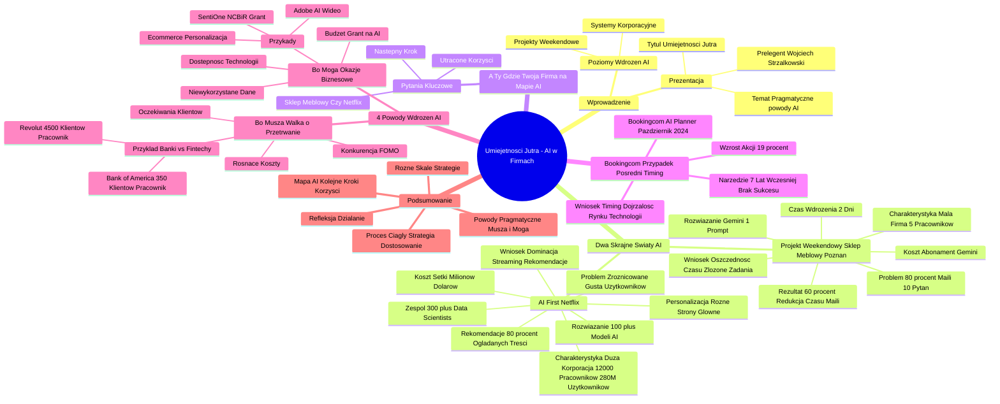

# Lekcje wideo - 1. Powody wdrażania AI w firmach

# 💡 Diagram

___

# 🗒️ Notatka

# Umiejętności Jutra: Dlaczego Firmy Naprawdę Wdrażają AI? - Szczegółowe Notatki i Podsumowanie

## Wprowadzenie

Prezentacja zatytułowana "Umiejętności Jutra" analizuje rzeczywiste motywacje firm do wdrażania sztucznej inteligencji (`AI`). Prelegent, Wojciech Strzałkowski (Head of Product, GOG.com), na wstępie odrzuca górnolotne hasła konferencyjne, koncentrując się na pragmatycznych powodach inwestycji w `AI`.  Prezentacja prowadzi słuchaczy przez różne poziomy wdrożeń `AI`, od prostych projektów weekendowych po zaawansowane systemy korporacyjne, ilustrując je konkretnymi przykładami i kluczowymi pytaniami dla firm rozważających implementację `AI`.

## Dwa Skrajne Światy AI: Od Projektu Weekendowego do Netflixa

Prelegent przedstawia dwa skrajne przykłady, aby uwypuklić różnorodność podejść do `AI` i ich skalę.

### Projekt Weekendowy - Mały Sklep Meblowy z Poznania

* **Charakterystyka:** Niewielka firma, zatrudniająca 5 osób.
* **Problem:** Aż 80% zapytań mailowych dotyczyło tych samych 10 kwestii (dostawa, dostępność produktów, czas realizacji zamówienia).
* **Rozwiązanie:** Wykorzystanie modelu **Gemini** i stworzenie **jednego prompta**.
* **Czas wdrożenia:** 2 dni (1 dzień na prompt, 1 dzień na przeszkolenie pracowników).
* **Koszt:** Abonament Gemini (około 20 dolarów miesięcznie - równowartość dwóch pizz z dostawą).
* **Rezultat:** Redukcja czasu poświęcanego na obsługę maili o **60%**.
* **Wniosek:** Nawet proste wdrożenie `AI` może przynieść znaczące oszczędności czasu i umożliwić pracownikom skupienie się na bardziej złożonych zadaniach.

### AI-first - Netflix

* **Charakterystyka:** Duża korporacja, zatrudniająca 12 000 osób, obsługująca 280 milionów użytkowników.
* **Problem:** Ogromna liczba użytkowników o zróżnicowanych gustach i preferencjach.
* **Rozwiązanie:** Ponad **100 modeli AI**.
* **Zespół:** Ponad **300 data scientists**.
* **Personalizacja:** Różne strony główne wyświetlane jednocześnie różnym użytkownikom.
* **Rekomendacje:** **80% treści** oglądanych na Netflixie stanowią rekomendacje `AI`.
* **Koszt:** Setki milionów dolarów rocznie.
* **Wniosek:** Inwestycje w zaawansowane `AI` pozwalają na dominację w branży streamingowej poprzez dogłębne zrozumienie i zaspokojenie potrzeb użytkowników, nawet przy ogromnych nakładach finansowych. Netflix zawdzięcza swoją dominację nie tylko treści, ale przede wszystkim skutecznym rekomendacjom.

## A Ty? Gdzie Jest Twoja Firma na Mapie AI?

Prelegent zachęca do zastanowienia się nad pozycją własnej firmy na skali wdrożenia `AI`, pomiędzy "projektem weekendowym" a "Netflixem".  Stawia kluczowe pytania:

* **Czy Twojej firmie bliżej do sklepu meblowego, czy do Netflixa?** -  Pozwala to określić punkt wyjścia.
* **Czy wiesz, jaki powinien być Twój następny krok?** - Rozwój `AI` to maraton, a nie sprint, wymagający strategicznego podejścia.
* **Ile pieniędzy tracisz, nie wdrażając AI?** -  Chodzi o utracone korzyści, takie jak oszczędność czasu (jak w sklepie meblowym) lub potencjał personalizacji (jak w przypadku Netflixa przed erą `AI`).

Te pytania mają pomóc firmom w zdefiniowaniu ich obecnej sytuacji i przemyśleniu strategii wdrożenia `AI`.

## Booking.com - Przypadek Pośredni i Znaczenie Timingu

* **Booking.com AI Planner (Październik 2024):** Asystent `AI` rozumiejący preferencje urlopowe i proponujący spersonalizowane rozwiązania.
* **Reakcja rynku:** Wzrost wartości akcji Booking Holding Inc o **19%** w ciągu kilku tygodni.
* **Punkt zwrotny:** Booking.com dysponował podobnym narzędziem już **7 lat wcześniej**, jednak wówczas nie odniosło ono sukcesu.
* **Wniosek:** Nawet najlepsze rozwiązanie `AI` potrzebuje odpowiedniego momentu i dojrzałości rynku, technologii oraz użytkowników. Wdrożenie `AI` w nieodpowiednim czasie może zakończyć się fiaskiem,  przypominającym "sadzenie palmy na Antarktydzie".

## 4 Powody, Dla Których Firmy NAPRAWDĘ Wdrażają AI

Prelegent przedstawia 4 główne, pragmatyczne powody, dla których firmy decydują się na wdrożenia `AI`:

### 1. „Bo muszą” - Walka o Przetrwanie

* **Motywacja:** Presja konkurencji i konieczność dostosowania się do dynamicznie zmieniającego się rynku.
* **Konkurencja już to robi (FOMO - Fear of Missing Out):** Obawa przed pozostaniem w tyle za konkurentami, którzy już implementują `AI`.
* **Klienci tego oczekują:** Rosnące oczekiwania klientów w zakresie szybkości i personalizacji obsługi.
* **Koszty rosną szybciej niż przychody:** Konieczność automatyzacji w celu optymalizacji kosztów operacyjnych.
* **Przykład: Banki vs Fintechy:**
    * **Revolut:** 4 500 klientów na pracownika dzięki `AI`.
    * **Bank of America:** 350 klientów na pracownika.
    * **Wniosek:** Fintechy, wykorzystując `AI`, osiągają znacznie wyższą efektywność, co zmusza tradycyjne banki do adaptacji i wdrażania innowacji.

### 2. „Bo mogą” - Okazje Biznesowe

* **Motywacja:** Wykorzystanie nowych możliwości i dostępnych zasobów do generowania wartości.
* **Dostępność technologii drastycznie wzrosła:** `AI` stała się powszechniej dostępna, tańsza i prostsza we wdrożeniu.
* **Posiadane dane pozostają niewykorzystane:** Firmy gromadzą ogromne ilości danych, które mogą zostać użyte do trenowania modeli `AI` i generowania zysków.
* **Pojawił się budżet/grant na AI:** Dostępność finansowania projektów związanych z `AI`, na przykład w formie grantów.
* **Przykład: E-commerce i personalizacja:** Personalizacja oferty w e-commerce za pomocą `AI` zwiększa sprzedaż i zadowolenie klientów.
* **Przykład: Adobe i AI wideo:** Adobe wdraża narzędzia `AI` do obróbki wideo, konkurując z OpenAI i Meta.
* **Przykład: SentiOne i NCBiR:** SentiOne otrzymało niemal 19 mln zł grantu od NCBiR na rozwój konwersacyjnej sztucznej inteligencji.

## Podsumowanie

Prezentacja "Umiejętności Jutra"  wyjaśnia, że firmy wdrażają `AI` z powodów pragmatycznych, które zasadniczo sprowadzają się do dwóch kategorii: **konieczności przetrwania ("bo muszą")** i **wykorzystania nowych możliwości biznesowych ("bo mogą")**.  Przykłady sklepu meblowego, Netflixa i Booking.com ilustrują różnorodne skale i strategie podejścia do `AI`, podkreślając, że wdrożenie `AI` to proces ciągły, wymagający przemyślanej strategii i dostosowania do specyfiki danego przedsiębiorstwa. Kluczowe jest zrozumienie, gdzie firma znajduje się na "mapie `AI`", jakie powinny być jej kolejne kroki oraz jakie korzyści może osiągnąć, implementując `AI` we właściwy sposób i we właściwym czasie.  Prezentacja stanowi zachętę do refleksji nad potencjałem `AI` w kontekście własnej organizacji oraz do podjęcia działań mających na celu efektywne wykorzystanie tej technologii.

___

# 🔉 Transcript
File: Lekcje wideo - 1. Powody wdrażania AI w firmach.mp4 
[00:00:01] Screen: Białe tło z napisem "Umiejętności Jutra" w kolorze czarnym oraz logo "AI" w kolorach tęczy. Pod napisem znajduje się napis "Organizator: Google" oraz "Partner edukacyjny: SGH".
[00:00:05] Screen: Mężczyzna w białej koszulce siedzi na krześle, za nim widać ścianę z drewnianymi panelami z otworami. Na półkach za nim stoją małe rośliny i logo Google. Pod mężczyzną widać napis "Wojciech Strzałkowski + Head of Product + GOG.com".
[00:00:05] Wojciech Strzałkowski: Dlaczego firmy naprawdę wdrażają AI?
[00:00:08] Wojciech Strzałkowski: Zastanówmy się.
[00:00:09] Wojciech Strzałkowski: Nie chodzi o te górnolotne powody, które słyszymy na konferencjach czy czytamy w komunikatach prasowych.
[00:00:15] Screen: Białe tło z napisem "Dlaczego firmy NAPRAWDĘ wdrażają AI?". Napis jest w kolorze czarnym, a słowo "NAPRAWDĘ" jest podkreślone na niebiesko.
[00:00:15] Wojciech Strzałkowski: Co naprawdę skłania prezesów i zarządy do inwestowania milionów w sztuczną inteligencję?
[00:00:21] Screen: Białe tło z napisem "Od Weekendowego projektu do Netflixa - gdzie jesteś na mapie AI?". Napis jest w kolorze żółtym.
[00:00:21] Wojciech Strzałkowski: Żeby to zrozumieć zabiorę was w podróż przez dwa skrajne światy AI.
[00:00:25] Wojciech Strzałkowski: Wyobraźcie sobie mapę, gdzie na jednym końcu mamy weekendowy projekt z domowego zacisza, a na drugim potężną machinę korporacyjną napędzaną setkami modeli AI.
[00:00:35] Wojciech Strzałkowski: Brzmi jak przepaść i tak właśnie jest.
[00:00:38] Wojciech Strzałkowski: Zacznijmy od początku tej skali.
[00:00:38] Screen: Białe tło z napisem "Weekendowy projekt - Mały sklep meblowy z Poznania". Pod napisem znajdują się punkty w kolorze zielonym: "Liczba pracowników: 5", "Problem: 80% maili to te same 10 pytań", "Rozwiązanie: Gemini + 1 prompt", "Czas wdrożenia: 2 dni", "Rezultat: 60% mniej czasu na obsługę maili", "Koszt: Abonament Gemini".
[00:00:40] Wojciech Strzałkowski: Mały sklep meblowy z Poznania.
[00:00:42] Wojciech Strzałkowski: Pięciu pracowników klasyczny problem małego biznesu.
[00:00:46] Wojciech Strzałkowski: Wiecie co ich najbardziej frustruje?
[00:00:48] Wojciech Strzałkowski: 80% wszystkich maili to wciąż te same 10 pytań.
[00:00:53] Wojciech Strzałkowski: Kiedy będzie dostawa, czy mają państwo ten model w magazynie, ile trzeba czekać na realizację.
[00:00:59] Wojciech Strzałkowski: Brzmi znajomo?
[00:01:00] Wojciech Strzałkowski: Pewnie każdy z was kiedyś wysłał podobnego maila.
[00:01:03] Wojciech Strzałkowski: Co zrobili?
[00:01:04] Wojciech Strzałkowski: Implementacja zajęła dokładnie dwa dni.
[00:01:07] Wojciech Strzałkowski: Jeden na napisanie prompta do Gemini, drugi na przeszkolenie pracowników.
[00:01:11] Wojciech Strzałkowski: Koszt 20 dolarów miesięcznie tyle co dwie dobre pizze z dowozem, a efekt?
[00:01:17] Wojciech Strzałkowski: Redukcja czasu obsługi maili o 60%.
[00:01:21] Wojciech Strzałkowski: Pomyślcie.
[00:01:22] Wojciech Strzałkowski: Połowa dnia pracy uwolniona na rzeczy, które naprawdę wymagają ludzkiej uwagi.
[00:01:27] Wojciech Strzałkowski: A teraz przenieśmy się na drugi koniec spektrum do świata Netflixa.
[00:01:30] Screen: Białe tło z napisem "AI-first - Netflix". Pod napisem znajdują się punkty w kolorze czerwonym: "Liczba pracowników: 12,000", "Problem: Miliony użytkowników, każdy chce coś innego", "Rozwiązanie: 100+ modeli AI", "Zespół: 300+ data scientists", "Rezultat: 80% treści oglądanej na platformie pochodzi z rekomendacji", "Koszt: Setki milionów $".
[00:01:31] Wojciech Strzałkowski: Skala 12000 pracowników, 280 milionów użytkowników.
[00:01:38] Wojciech Strzałkowski: Ale najciekawsze jest co innego.
[00:01:40] Wojciech Strzałkowski: Czy wiecie że gdy wy i wasz przyjaciel otwieracie Netflixa w tym samym momencie, prawdopodobnie widzicie zupełnie inne strony główne?
[00:01:48] Wojciech Strzałkowski: To nie przypadek.
[00:01:49] Wojciech Strzałkowski: Za tą pozornie prostą różnicą stoi ponad 100 modeli AI i 300 data scientists.
[00:01:55] Wojciech Strzałkowski: Wyobraźcie sobie 80% contentu, który oglądacie na Netflixie pochodzi z rekomendacji.
[00:02:02] Wojciech Strzałkowski: To jak mieć osobistego krytyka filmowego, który zna wasze gusta lepiej niż wy sami.
[00:02:07] Wojciech Strzałkowski: Koszt setki milionów dolarów rocznie.
[00:02:10] Wojciech Strzałkowski: Ale czy się opłaca?
[00:02:12] Wojciech Strzałkowski: Cóż Netflix dominował streaming nie dlatego, że ma najlepsze filmy, ale dlatego, że najlepiej wie co chcecie obejrzeć.
[00:02:13] Screen: Białe tło z napisem "AI-first - Netflix". Pod napisem znajdują się punkty w kolorze czerwonym: "Liczba pracowników: 12,000", "Problem: Miliony użytkowników, każdy chce coś innego", "Rozwiązanie: 100+ modeli AI", "Zespół: 300+ data scientists", "Rezultat: 80% treści oglądanej na platformie pochodzi z rekomendacji", "Koszt: Setki milionów $".
[00:02:19] Screen: Białe tło z napisem "A Ty?". Pod napisem znajduje się skala z punktami oznaczonymi kolorami: niebieski "Weekendowy projekt z Gemini", żółty, zielony, czerwony "Netflix". Pod osią punktów znajdują się pytania w kolorze czarnym: "Czy jesteś bliżej sklepu meblowego czy Netflixa?", "Czy wiesz, jaki powinien być Twój następny krok?", "Ile zostawiasz pieniędzy na stole nie wdrażając AI?".
[00:02:19] Wojciech Strzałkowski: A teraz zatrzymajmy się na moment i zastanówmy się nad waszą firmą.
[00:02:24] Wojciech Strzałkowski: Na tej skali, którą widzicie na ekranie od weekendowego projektu z Gemini do zaawansowanych systemów Netflixa, gdzie znajduje się wasza organizacja?
[00:02:34] Wojciech Strzałkowski: To nie jest tylko teoretyczne pytanie, bo widząc te dwa skrajne przykłady naturalnie pojawia się kilka kluczowych pytań.
[00:02:42] Wojciech Strzałkowski: Pierwsze, czy jesteście bliżej tego małego sklepu meblowego, który w weekend wdrożył prostą automatyzację, czy może jednak bliżej Netflixa z jego setką modeli AI.
[00:02:53] Wojciech Strzałkowski: Ta odpowiedź pomoże wam zrozumieć wasz aktualny punkt startowy.
[00:02:57] Wojciech Strzałkowski: Drugie, być może nawet ważniejsze, czy wiecie jaki powinien być wasz następny krok?
[00:03:03] Wojciech Strzałkowski: Bo rozwój AI w firmie to nie sprint, to maraton, składający się z wielu małych przemyślanych kroków.
[00:03:11] Wojciech Strzałkowski: I wreszcie trzecie, chyba najbardziej pragmatyczne pytanie.
[00:03:15] Wojciech Strzałkowski: Ile zostawiacie pieniędzy na stole nie wdrażając AI?
[00:03:19] Wojciech Strzałkowski: Czy to te 60% czasu jak w przypadku sklepu meblowego, czy może niewykorzystany potencjał personalizacji jak przed wdrożeniem AI w Netflixie.
[00:03:29] Wojciech Strzałkowski: Te pytania będą nam towarzyszyć przez resztę prezentacji gdzie przyjrzymy się dokładnie jak różne firmy odpowiadają na te wyzwania i jakie konkretnie kroki podejmują w swojej podróży z AI.
[00:03:40] Wojciech Strzałkowski: Ale jest jeszcze coś pomiędzy tymi ekstremami, to fascynujący przypadek Booking.com.
[00:03:43] Screen: po lewej stronie widoczna jest strona internetowa Booking.com, a po prawej stronie ekran telefonu z włączoną aplikacją Booking.com.
[00:03:43] Wojciech Strzałkowski: W październiku 2024 roku wprowadzili AI plannera.
[00:03:50] Wojciech Strzałkowski: Wyobraźcie sobie asystenta, który rozumie wasze wakacyjne marzenia i przekłada je na konkretne propozycje.
[00:03:57] Wojciech Strzałkowski: Brzmi nieźle?
[00:03:58] Wojciech Strzałkowski: Rynek też tak pomyślał.
[00:04:01] Screen: Wykres akcji Booking Holding Inc na giełdzie NASDAQ, widać wzrost o +19% w ciągu roku.
[00:04:01] Wojciech Strzałkowski: Akcje Booking wzrosły o 19% w kilka tygodni.
[00:04:04] Wojciech Strzałkowski: Ale tutaj pojawia się zwrot akcji, który idealnie pokazuje jak działa świat AI.
[00:04:10] Screen: Strona internetowa Booking.com z artykułem "Booking.com Expands Global Access to the Booking Assistant". Na zdjęciu w artykule widać dłonie trzymające telefon komórkowy.
[00:04:10] Wojciech Strzałkowski: Booking miał już podobne narzędzie 7 lat temu.
[00:04:13] Wojciech Strzałkowski: Dlaczego więc nie odniosło sukcesu?
[00:04:16] Wojciech Strzałkowski: Bo czasem nawet najlepszy produkt wypuszczony w złym momencie to jak zasadzenie palmy na Antarktydzie.
[00:04:24] Wojciech Strzałkowski: Nie ma szans na rozwój.
[00:04:25] Wojciech Strzałkowski: Rynek nie był gotowy, technologia nie dojrzała, a użytkownicy nie przekonani.
[00:04:29] Screen: Białe tło z napisem "4 powody dlaczego firmy NAPRAWDĘ wdrażają AI?". Napis jest w kolorze czarnym, a słowo "NAPRAWDĘ" jest podkreślone na niebiesko.
[00:04:31] Wojciech Strzałkowski: Przyjrzyjmy się zatem dokładniej tym czterem głównym powodom dla których firmy wdrażają AI.
[00:04:36] Screen: Białe tło z napisem ""Bo muszą" - walka o przetrwanie". Pod napisem znajdują się punkty w kolorze czarnym: "Konkurencja już to robi (FOMO)", "Klienci tego oczekują", "Koszty rosną szybciej niż przychody", "Przykład: Banki vs Fintechy". Po prawej stronie znajduje się napis "Revolut" oraz ikona banku.
[00:04:37] Wojciech Strzałkowski: Pierwszy powód, bo muszą, to czysta walka o przetrwanie na rynku.
[00:04:42] Wojciech Strzałkowski: Weźmy Revoluta.
[00:04:43] Wojciech Strzałkowski: Jeden pracownik obsługuje tam 4,5 tysiąca klientów.
[00:04:47] Wojciech Strzałkowski: Dla porównania w Bank of America to zaledwie 350 klientów na pracownika.
[00:04:52] Wojciech Strzałkowski: Ponad dziesięciokrotna różnica.
[00:04:55] Wojciech Strzałkowski: To pokazuje jak AI zmienia zasady gry w finansach.
[00:04:59] Wojciech Strzałkowski: Konkurencja już to robi, więc pojawia się klasyczne FOMO strach przed pozostaniem w tyle.
[00:05:04] Wojciech Strzałkowski: Do tego dochodzą rosnące oczekiwania klientów, chcą szybszej i bardziej spersonalizowanej obsługi.
[00:05:11] Wojciech Strzałkowski: A ponieważ koszty rosną szybciej niż przychody firmy muszą szukać sposobów na automatyzację.
[00:05:17] Screen: Białe tło z napisem ""Bo mogą" - Okazje biznesowe". Pod napisem znajdują się punkty w kolorze czarnym: "Dostępność technologii drastycznie wzrosła", "Mają dane, których nie wykorzystują", "Pojawił się budżet/grant na AI", "Przykład: E-commerce i personalizacja". Po prawej stronie znajdują się napisy: "Adobe starts roll-out of AI video tools, challenging OpenAI and Meta", "Niemal 19 mln zł od NCBiR dla SentiOne na rozwój konwersacyjnej sztucznej inteligencji. To najwyższa dotychczas dot

___
# 🏷️ Tags
#AI #sztuczna_inteligencja #umiejętności_jutra #wdrożenie_AI #implementacja_AI #uczenie_maszynowe #machine_learning #deep_learning #sieci_neuronowe #modele_AI #data_science #dane #analiza_danych #big_data #algorytmy #automatyzacja #optymalizacja #personalizacja #rekomendacje #chatbot #asystent_AI #generative_AI #LLM #large_language_model #prompt #Gemini #Netflix #Booking.com #GOG.com #Wojciech_Strzałkowski #sklep_meblowy #Poznań #e-commerce #fintech #banki #Revolut #Bank_of_America #Adobe #OpenAI #Meta #SentiOne #NCBiR #konkurencja #FOMO #Fear_of_Missing_Out #przetrwanie #okazje_biznesowe #inwestycje #rynek #technologia #klienci #koszty #przychody #efektywność #produktywność #oszczędność_czasu #wartość_akcji #akcje #strategia_AI #transformacja_cyfrowa #digital_transformation #przyszłość_pracy #future_of_work #AI-first #projekt_weekendowy #abonament #streaming #personalizacja_oferty #AI_w_wideo #grant #budżet #dostepność_technologii #dojrzałość_rynku #punkt_zwrotny #AI_Planner #Booking_Assistant #NASDAQ #akcje_Booking_Holding_Inc
