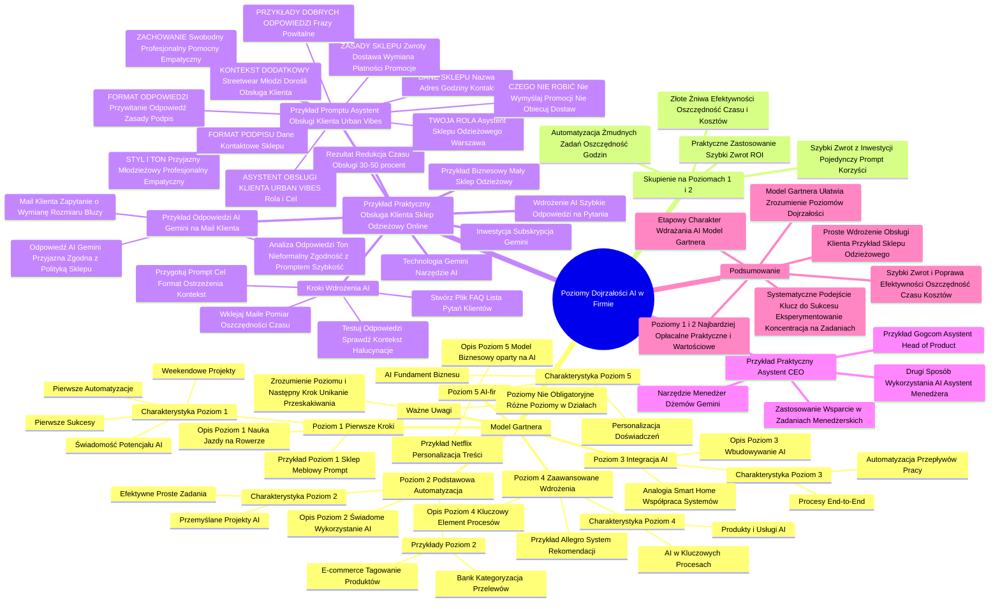

# Lekcje wideo - 2. 5 poziomów dojrzałości AI w firmie

# 💡 Diagram

___

# 🗒️ Notatka

# Poziomy Dojrzałości AI w Firmie - Notatki i Podsumowanie

## Wprowadzenie

Niniejsze notatki stanowią podsumowanie transkrypcji wideo omawiającej poziomy dojrzałości sztucznej inteligencji (AI) w firmach, w oparciu o model Gartnera. Prezentacja koncentruje się na pięciu etapach rozwoju – od początkowej świadomości potencjału AI, aż po model biznesowy całkowicie oparty na AI (`AI-first`). Szczególny nacisk położono na poziom pierwszy i drugi, uznając je za najbardziej praktyczne i przynoszące szybki zwrot z inwestycji dla większości organizacji. Wideo ilustruje praktyczne zastosowanie AI na poziomie pierwszym, podając przykład małego sklepu odzieżowego online wykorzystującego AI w obsłudze klienta.

## Poziomy Dojrzałości AI w Firmie (Model Gartnera)

Model dojrzałości AI opracowany przez Gartnera przedstawia ścieżkę rozwoju firm w zakresie wdrażania i wykorzystywania sztucznej inteligencji. Składa się on z pięciu poziomów, których osiąganie niekoniecznie musi następować sekwencyjnie w całej organizacji.

### Poziom 1: Pierwsze Kroki

- **Opis:** Początkowa faza, analogiczna do nauki jazdy na rowerze z bocznymi kółkami.
- **Charakterystyka:**
    - Uświadomienie sobie potencjału AI w kontekście biznesowym.
    - Realizacja pierwszych projektów i eksperymentów z AI, często o charakterze weekendowym.
    - Wdrażanie pojedynczych automatyzacji i odnoszenie pierwszych sukcesów.
- **Przykład:** Sklep meblowy z Poznania, który zautomatyzował pojedynczy proces za pomocą `prompta`.

### Poziom 2: Podstawowa Automatyzacja

- **Opis:** Świadome wykorzystanie AI do automatyzacji konkretnych, pojedynczych procesów.
- **Charakterystyka:**
    - Przemyślane projekty AI, wykraczające poza ramy weekendowych eksperymentów.
    - Wykorzystanie AI do realizacji prostych, lecz efektywnych zadań.
- **Przykłady:**
    - Bank automatyzujący proces kategoryzacji przelewów.
    - Sklep internetowy tagujący produkty z wykorzystaniem AI.

### Poziom 3: Integracja AI

- **Opis:** Wbudowywanie AI w istniejące produkty, narzędzia i procesy.
- **Charakterystyka:**
    - Automatyzacja nie tylko pojedynczych procesów, ale całych przepływów pracy.
    - Wdrażanie pierwszych procesów **end-to-end**, które są w pełni zautomatyzowane.
- **Analogia:** Przejście od automatycznego oświetlenia do **smart home**, gdzie systemy ze sobą współpracują.

### Poziom 4: Zaawansowane Wdrożenia

- **Opis:** AI staje się kluczowym elementem wielu procesów w firmie.
- **Charakterystyka:**
    - Wykorzystanie AI w kluczowych procesach, nie tylko w celu ich usprawnienia.
    - Budowa kompleksowych produktów i usług opartych na sztucznej inteligencji.
- **Przykład:** System rekomendacji Allegro, który łączy dane o użytkownikach, historii ich zakupów oraz trendach rynkowych.

### Poziom 5: AI-first

- **Opis:** Najwyższy poziom dojrzałości, gdzie cały model biznesowy firmy opiera się na AI.
- **Charakterystyka:**
    - AI stanowi fundament działalności przedsiębiorstwa.
    - Personalizacja każdego aspektu doświadczenia użytkownika za pomocą AI.
- **Przykład:** Netflix, gdzie AI personalizuje dobór treści i miniaturek filmów.

### Ważne Uwagi Dotyczące Poziomów Dojrzałości

- **Poziomy nie są obligatoryjne:** Firmy nie muszą przechodzić przez kolejne poziomy w sposób sekwencyjny w całej organizacji. Poszczególne działy mogą znajdować się na różnych poziomach dojrzałości.
- **Kluczowe jest zrozumienie obecnego poziomu i określenie następnego kroku:** Należy unikać przeskakiwania zbyt wielu poziomów naraz, ponieważ może to być ryzykowne i nieefektywne.

## Skupienie na Poziomach 1 i 2 – Złote Żniwa Efektywności

Kurs koncentruje się na poziomach pierwszym i drugim, ponieważ są one najbardziej praktyczne i wartościowe dla większości organizacji.

- **Praktyczne Zastosowanie:** Poziom 1 i 2 oferują najszybszy zwrot z inwestycji (ROI) oraz charakteryzują się najmniej skomplikowanymi wdrożeniami.
- **Złote Żniwa Efektywności:** Na tych poziomach można osiągnąć znaczące oszczędności czasu i kosztów.
- **Szybki Zwrot z Inwestycji:** Pojedynczy `prompt` lub prosty model AI może przynieść wymierne korzyści, na przykład oszczędność 60% czasu pracy.
- **Automatyzacja Żmudnych Zadań:** AI umożliwia automatyzację zadań, które wcześniej pochłaniały wiele godzin.

## Przykład Praktyczny Poziomu 1: Obsługa Klienta w Sklepie Odzieżowym Online

Poniżej przedstawiono praktyczny przykład wdrożenia AI na poziomie pierwszym, demonstrujący jego prostotę i efektywność:

- **Przykład Biznesowy:** Mały sklep odzieżowy online.
- **Wdrożenie AI:** Wykorzystanie AI do szybkiego odpowiadania na typowe pytania klientów.
- **Technologia:** Dostępne narzędzie AI, np. Gemini.
- **Inwestycja:** Subskrypcja Gemini.
- **Rezultat:** Redukcja czasu pracy działu obsługi klienta o 30-50%.

### Kroki Wdrożenia AI do Obsługi Klienta (Poziom 1)

1. **Stwórz plik z listą najczęściej zadawanych pytań klientów (FAQ).**
    - Uwzględnij pytania dotyczące: czasu i opcji dostawy, polityki zwrotów, tabeli rozmiarów, itp.
    - Można wykorzystać Google Docs, Worda, Notatnik – AI poradzi sobie z różnymi formatami plików.

2. **Przygotuj `prompt` dla AI.**
    - **Struktura dobrego `prompta`:**
        1. **Cel:** Opis działalności firmy i roli AI (np. asystent obsługi klienta).
        2. **Format Odpowiedzi:** Określenie oczekiwanego formatu odpowiedzi generowanej przez AI.
        3. **Ostrzeżenia:** Wskazówki, czego AI ma unikać (np. wymyślania promocji).
        4. **Kontekst:** Dodatkowe informacje i zasady obowiązujące w sklepie.
    - Wklej plik FAQ jako kontekst do `prompta`.

3. **Przetestuj odpowiedzi AI na kilku przykładowych zapytaniach.**
    - Sprawdź, czy AI poprawnie rozumie kontekst i czy nie generuje nieprawdziwych informacji (tzw. "halucynacje").
    - W razie potrzeby doprecyzuj `prompt`.

4. **Wklejaj wiadomości e-mail od klientów bezpośrednio do AI i kopiuj wygenerowane odpowiedzi.**
    - Po tygodniu dokonaj pomiaru oszczędności czasu.

### Przykład `Promptu` dla Asystenta Obsługi Klienta „Urban Vibes”

- **# ASYSTENT OBSŁUGI KLIENTA - URBAN VIBES**
- **# TWOJA ROLA:** Jesteś asystentem obsługi klienta Urban Vibes, modnego sklepu odzieżowego z Warszawy. Twoim zadaniem jest odpowiadanie na wiadomości e-mail klientów w sposób pomocny i przyjazny, zgodny z charakterem marki.
- **# ZACHOWANIE:** Odpowiadaj swobodnie, lecz profesjonalnie. Bądź pomocny i staraj się znajdować rozwiązania. Przestrzegaj polityki sklepu. Wykazuj zrozumienie dla sytuacji klienta.
- **# DANE SKLEPU:** Nazwa: Urban Vibes, Adres: ul. Złota 59, 00-120 Warszawa, Godziny otwarcia: Pon-Sob 10-21, Nd 10-20, Kontakt: contact@urbanvibes.pl, tel. 22 222 22 22
- **# ZASADY SKLEPU:** Zwroty: 30 dni z paragonem, Dostawa: Darmowa od 200 zł, Wymiana rozmiaru: Możliwa w sklepie stacjonarnym, Płatności: Karty, BLIK, PayPo, Aktualne promocje: [NIE WYMYŚLAJ - czekaj na informację]
- **# FORMAT ODPOWIEDZI:** 1. Przywitanie z imieniem klienta (jeśli jest znane), 2. Jasna odpowiedź na główne pytanie, 3. Informacja o zasadach (jeśli to konieczne), 4. Pozytywne zakończenie, 5. Podpis sklepu
- **# STYL I TON:** Przyjazny i przystępny, Młodzieżowy i aktualny, Profesjonalny, ale nie formalny, Empatyczny i wyrozumiały
- **# CZEGO NIE ROBIĆ:** Nie wymyślaj promocji ani zniżek, Nie obiecuj konkretnych terminów dostawy, Nie modyfikuj zasad sklepu, Nie podawaj informacji spoza udostępnionej listy
- **# PRZYKŁADY DOBRYCH ODPOWIEDZI:** Cześć [Imię]! Dziękuję za Twoją wiadomość… Rozumiem Twoją sytuację… Z przyjemnością pomogę…
- **# FORMAT PODPISU:** Zespół Urban Vibes, ul. Złota 59, 00-120 Warszawa, contact@urbanvibes.pl, tel. 22 222 22 22
- **# KONTEKST DODATKOWY:** Urban Vibes to nowoczesny sklep ze `streetwear`em dla młodych dorosłych (18-35 lat). Koncentrujemy się na modzie casualowej i przykładamy dużą wagę do wysokiej jakości obsługi klienta.

### Przykład Odpowiedzi AI na Mail Klienta

- **Mail Klienta:** Zapytanie o możliwość wymiany rozmiaru bluzy.
- **Odpowiedź AI (Gemini):**
    > Cześć Anno! :-) Dziękuję za wiadomość i bardzo się cieszę, że bluza „Street Vibes” Ci się spodobała. Oczywiście, wymiana na rozmiar L jest możliwa – w naszym sklepie stacjonarnym to żaden problem. :-) Zapraszam Cię do naszego sklepu na Złotej 59 z bluzą i paragonem, a pomożemy Ci dobrać idealny rozmiar. :-) Wymiana w sklepie to najszybsze rozwiązanie, dzięki czemu od razu wyjdziesz z odpowiednią bluzą. Jeśli jednak wolisz najpierw zamówić rozmiar L i porównać obie bluzy w domu, to również nie ma problemu. Pamiętaj tylko, że na zwrot masz 30 dni od daty zakupu (liczy się data na paragonie). Daj znać, jeśli będziesz miała jeszcze jakieś pytania! Zespół Urban Vibes, ul. Złota 59, 00-120 Warszawa, contact@urbanvibes.pl, tel. 22 222 22 22

- **Analiza Odpowiedzi:**
    - Ton nieformalny i przyjazny, zgodny z założeniami `promptu`.
    - Odpowiedź zgodna z polityką sklepu (wymiana w sklepie, 30 dni na zwrot).
    - Błyskawiczne generowanie odpowiedzi – ułamek sekundy.
    - Znacząca oszczędność czasu dla pracowników działu obsługi klienta.

## Przykład Praktyczny: Asystent CEO

- **Drugi sposób wykorzystania AI:** Asystent CEO (lub innego menedżera wysokiego szczebla).
- **Przykład:** Wykorzystanie Gemini jako asystenta Head of Product w firmie Gog.com.
- **Narzędzie:** „Menedżer dżemów” w Gemini.
- **Zastosowanie:** Wsparcie w codziennych zadaniach menedżerskich.

## Podsumowanie

Prezentacja podkreśla etapowy charakter wdrażania AI w firmie, a model Gartnera ułatwia zrozumienie poszczególnych poziomów dojrzałości. Dla większości przedsiębiorstw najbardziej opłacalne i praktyczne okazują się pierwsze dwa poziomy – Pierwsze Kroki i Podstawowa Automatyzacja. Oferują one szybki zwrot z inwestycji oraz znaczną poprawę efektywności. Przykład sklepu odzieżowego online ilustruje, jak proste wdrożenie AI na poziomie pierwszym może znacząco usprawnić obsługę klienta i przynieść oszczędność czasu pracy. Kluczem do sukcesu jest systematyczne podejście, gotowość do eksperymentowania i koncentracja na konkretnych, powtarzalnych zadaniach.

___

# 🔉 Transcript
File: Lekcje wideo - 2. 5 poziomów dojrzałości AI w firmie.mp4 
Sure, here's the formatted transcript in Polish:

[00:00:00] (Białe tło z czarnym pionowym paskiem po lewej stronie.)
[00:00:01] (Białe tło z napisem „Umiejętności Jutra AI”. Pod napisem znajdują się loga Google i SGH.)
[00:00:05] Wojciech Strzałkowski: Po tym jak przyjrzeliśmy się przyczynom wdrażania AI, naturalne pytanie brzmi: jak właściwie wygląda ta droga? Jak firmy przechodzą od pierwszych eksperymentów do zaawansowanych wdrożeń.
(Wojciech Strzałkowski siedzi przy biurku. Za nim znajduje się drewniana ściana z logo Google. Na ekranie widnieje napis „Poziomy dojrzałości AI w firmie”.)
[00:00:17] (Ekran po prawej stronie pokazuje wykres z pięcioma poziomami dojrzałości AI w firmie. Wykres przedstawia wzrost poziomu dojrzałości AI w firmie. Na osi X znajdują się poziomy dojrzałości, a na osi Y wzrost. Wykres jest linią wznoszącą się od poziomu 1 do poziomu 5. Na dole wykresu znajduje się napis: „Na podstawie Gartner Artificial Intelligence Maturity Model”.)
[00:00:18] Eksperci z Gartnera stworzyli model dojrzałości AI, który świetnie pokazuje tę drogę. Wyobraźcie sobie to jako mapę rozwoju, gdzie mamy pięć wyraźnych poziomów. Przyjrzyjmy się każdemu z nich.
[00:00:30] Poziom pierwszy to pierwsze kroki. To jak nauka jazdy na rowerze z bocznymi kółkami. Firma zaczyna dostrzegać potencjał AI w kontekście biznesowym.
(Wykres po prawej stronie pokazuje poziom 1: „Pierwsze kroki”. Pod poziomem znajduje się opis: „Świadomość istnienia AI w kontekście biznesowym, pierwsze weekendowe projekty”.)
[00:00:36] Pojawiają się pierwsze weekendowe projekty. Dokładnie jak ten sklep meblowy z Poznania, o którym mówiliśmy wcześniej. Jeden prompt, jedna automatyzacja, pierwszy sukces.
[00:00:52] Poziom drugi. Podstawowa automatyzacja. Tutaj firma zaczyna świadomie wykorzystywać AI do konkretnych pojedynczych procesów. To już nie są eksperymenty weekendowe, ale przemyślane projekty.
(Wykres po prawej stronie pokazuje poziom 2: „Podstawowa automatyzacja”. Pod poziomem znajduje się opis: „Wykorzystanie AI do podstawowych automatycznych procesów w firmie”.)
[00:01:04] Przykład: bank automatyzujący kategoryzację przelewów albo e-commerce wykorzystujący AI do tagowania produktów. Proste, ale efektywne zastosowania.
[00:01:15] Poziom trzeci to integracja AI. Tu zaczyna się prawdziwa zabawa. Firmy nie tylko automatyzują pojedyncze procesy, ale zaczynają wbudowywać AI w istniejące produkty i narzędzia. Pojawiają się pierwsze end-to-end zautomatyzowane procesy.
(Wykres po prawej stronie pokazuje poziom 3: „Integracja AI”. Pod poziomem znajduje się opis: „Wdrożenie AI do istniejących produktów i narzędzi, pierwsze procesy end-to-end zautomatyzowane”.)
[00:01:31] To jak przejście od automatycznych świateł w domu do prawdziwego smart home'u, gdzie wszystkie systemy ze sobą współpracują.
[00:01:39] Poziom czwarty, zaawansowane wdrożenia. AI staje się kluczowym elementem wielu procesów w firmie. To nie tylko automatyzacja czy usprawnienia, to budowanie całych produktów opartych o sztuczną inteligencję.
(Wykres po prawej stronie pokazuje poziom 4: „Zaawansowane wdrożenia”. Pod poziomem znajduje się opis: „Wykorzystanie AI w wielu kluczowych procesach w firmie, budowa produktów opartych o AI”.)
[00:01:53] Pomyślcie o Allegro i ich systemie rekomendacji, który łączy dane o zachowaniach użytkowników, historii zakupów oraz trendy rynkowe.
[00:02:03] I wreszcie poziom piąty. AI first. To najwyższy poziom dojrzałości, gdzie cały model biznesowy jest zbudowany wokół AI.
(Wykres po prawej stronie pokazuje poziom 5: „AI-first”. Pod poziomem znajduje się opis: „Całość modelu biznesowego oparta o AI”.)
[00:02:11] Przykład: Netflix, o którym mówiliśmy, gdzie każdy aspekt doświadczenia użytkownika jest personalizowany przez AI, od doboru treści po miniaturki filmów. Co ciekawe, te poziomy nie są jak schody, po których musicie wspinać się krok po kroku. Możecie mieć różne części organizacji na różnych poziomach. Masz dział obsługi klienta może być na poziomie drugim z prostym chatbotem, podczas gdy dział produktowy już eksperymentuje z zaawansowanymi rozwiązaniami z poziomu czwartego.
[00:02:41] Kluczowe jest zrozumienie, gdzie jesteście teraz i jaki powinien być wasz następny krok. Bo wiecie co jest najgorsze w AI? Próba przeskoczenia zbyt wielu poziomów naraz. To jak próba nauczenia się jazdy przez wejście na tor wyścigowy. Może skończyć się boleśnie.
[00:03:01] (Wykres po prawej stronie pokazuje poziomy 1 i 2 zaznaczone na żółto.)
[00:03:02] Na potrzeby naszego kursu skupimy się szczególnie na poziomach pierwszym i drugim. Dlaczego? Bo to właśnie te poziomy mają najbardziej praktyczne zastosowanie dla większości organizacji. Nie każda firma musi, czy nawet powinna dążyć do bycia drugim Netflixem. Dla wielu z was największą wartość biznesową przyniosą właśnie te pierwsze poziomy dojrzałości AI. Pomyślcie o tym tak. Te pierwsze dwa poziomy to jak złote żniwa efektywności. To tutaj często znajdziecie najszybszy zwrot z inwestycji i najmniej skomplikowane wdrożenia. To właśnie na tych poziomach pojedynczy prompt może zaoszczędzić 60% czasu pracy, a prosty model AI może zautomatyzować żmudne zadania, które dotychczas zajmowały godziny.
[00:03:47] (Ekran po prawej stronie pokazuje slajd zatytułowany „Jak to zrobić?”. Zawiera cztery punkty: 1. Stwórz plik z najczęściej zadawanymi pytaniami klientów. 2. Stwórz prompt dla AI. 3. Przetestuj odpowiedzi AI na kilku przykładach. 4. Wklejaj maile od klientów bezpośrednio do AI i kopiuj jego odpowiedzi.)
[00:03:47] Przejdźmy teraz do bardzo konkretnego przykładu, który świetnie pokazuje jak wygląda poziom pierwszy w praktyce. Weźmy mały sklep odzieżowy online. Biznes, który prawdopodobnie jest bliski wielu z was. Jakie jest wdrożenie? Proste. Wykorzystanie AI do szybkiej odpowiedzi na typowe pytania klientów. Technologia? Gotowe narzędzie takie jak Gemini. Inwestycja? Sama subskrypcja Gemini. A rezultat? Redukcja czasu pracy działu obsługi klienta od 30 do 50%. Imponujące, prawda? Ale najważniejsze pytanie, jak to zrobić? Przeprowadzę was przez to krok po kroku.
(Ekran po prawej stronie pokazuje slajd zatytułowany „Gotowe narzędzia AI”. Zawiera punkty: Przykład: Mały sklep odzieżowy online, Wdrożenie: Wykorzystanie AI do szybkiej odpowiedzi na typowe pytania klientów, Technologia: Gotowe narzędzie AI (np. Gemini), Inwestycja: Subskrypcja Gemini, Rezultat: Redukcja czasu pracy obsługi klienta o 30-50%.)
[00:04:47] Krok pierwszy. Stwórzcie plik z najczęściej zadawanymi pytaniami klientów. Co warto tam umieścić? Czas i opcje dostawy, politykę zwrotów, informacje o rozmiarówce, wszystko o co klienci pytają regularnie. I tutaj mała wskazówka. Możecie użyć Google Docs, Worda, albo nawet zwykłego notatnika. AI jest na tyle sprytne, że poradzi sobie z dowolnym formatem.
(Ekran po prawej stronie pokazuje slajd zatytułowany „Jak to zrobić?”. Zawiera cztery punkty: 1. Stwórz plik z najczęściej zadawanymi pytaniami klientów. 2. Stwórz prompt dla AI. 3. Przetestuj odpowiedzi AI na kilku przykładach. 4. Wklejaj maile od klientów bezpośrednio do AI i kopiuj jego odpowiedzi. Po prawej stronie znajduje się tekst: „Możesz użyć Google docs, worda, albo nawet notatnik - AI sam przetworzy dane w dowolnym formacie.” oraz „Struktura dobrego promptu: 1. Cel, 2. Format odpowiedzi od AI, 3. Ostrzeżenia, 4. Kontekst” i „Czasami AI może źle zrozumieć kontekst, albo halucynować. W takich wypadkach warto upewnić się, że w prompcie uczulamy go na to.” i „Po tygodniu policz ile czasu zaoszczędziłeś :-)”.)
[00:05:09] Krok drugi. Stwórzcie prompt dla AI. To kluczowy element. Musicie opisać czym zajmuje się wasz biznes, jaką rolę ma odgrywać AI i w jakim formacie ma zwracać odpowiedzi. Do tego wklejacie plik z najczęściej zadawanymi pytaniami jako element kontekstu prompta. Struktura dobrego prompta jest prosta: cel, format odpowiedzi od AI, ostrzeżenia i kontekst.
[00:05:38] Krok trzeci. Przetestujcie odpowiedzi AI na kilku przykładach. To ważne, bo czasem AI może źle zrozumieć kontekst, albo jak to mówimy w branży, halucynować. W takich sytuacjach warto doprecyzować prompt, żeby uniknąć takich sytuacji w przyszłości.
[00:05:54] I wreszcie krok czwarty. Po prostu wklejajcie maile od klientów bezpośrednio do AI i kopiujcie jego odpowiedzi. A po tygodniu, policzcie ile czasu zaoszczędziliście. Gwarantuję, że będziecie pozytywnie zaskoczeni. To właśnie jest piękno poziomu pierwszego, jego prostota. Nie potrzebujecie tu zespołu programistów, miesięcy przygotowań czy skomplikowanych integracji. Potrzebujecie tylko systematycznego podejścia i chęci do eksperymentowania. I pamiętajcie, te 30 do 50% oszczędności czasu to nie jest magia. To rezultat przemyślanego krok po kroku procesu wdrożenia AI do konkretnego powtarzalnego zadania w firmie.
[00:06:36] Teraz zobaczmy jak to działa w praktyce.
[00:06:38] (Ekran po prawej stronie pokazuje okno przeglądarki z otwartym Gemini Advanced. W oknie znajduje się tekst „Cześć, Specjalisto”.)
[00:06:39] Więc otwieram Gemini. To jest jej podstawowy widok, w którym komunikuję się z LLM. Mam już przygotowany prompt naszego sklepu odzieżowego, o którym wspominałem wcześniej. Wklejam ten prompt, możemy sobie przez niego przejść w szczegółach. Jak widzicie jest on w specyficzny sposób sformatowany. Zaczynamy od nagłówka, jakby o co chodzi. Jest to będzie asystent obsługi klienta Urban Vibes. To jest nazwa naszej firmy. Opisuję rolę asystenta, tak? W tym wypadku jesteś asystentem obsługi klienta Urban Vibes, modnego sklepu odzieżowego w Warszawie. Odpowiadasz na maile klientów w sposób pomocny i przyjazny, zgodny z głosem marki, tak? Czyli widzicie, jakby tutaj zwracamy uwagę na to w jaki sposób mają te odpowiedzi wyglądać w kierunku klienta. Następnie opisujemy w prompcie zachowanie. Odpowiadaj w swobodnym, ale profesjonalnym tonie. Bądź pomocny i szukaj rozwiązań. Trzymaj się ściśle polityki sklepu. Okazuj zrozumienie dla sytuacji klienta, tak? Czyli chcemy, żeby ten asystent empatyzował z naszymi klientami. Podajemy dane naszego sklepu. Oczywiście są to zmyślone dane, ten sklep nie istnieje. No i wklejamy zasady naszego sklepu, tak? Czyli jaka jest polityka zwrotów, dostawa, czy jest możliwa wymiana rozmiaru, jakie płatności obsługujemy i tak dalej. No i teraz tak, to co jest super tutaj kluczowe, zobaczcie, aktualne promocje. Dajemy mu informację: nie wymyślaj, czekaj na informacje, tak? Jest to super ważne, żeby uniknąć tego, o czym wspominałem, czyli właśnie tego halucynowania. Nie chcemy, żeby asystent sam wymyślał promocje, które później przekaże klientom. Był taki przypadek linii lotniczej, która jakby wykorzystała chatbota AI-owego do tego, żeby komunikować się ze swoimi klientami i on wymyślał różnego rodzaju promocje, które później sąd w Stanach Zjednoczonych uznał, że skoro tak przedstawiciel firmy zwrócił się do klienta i taką przekazał informację, to firma musi ten tą promocję uhonorować i tą zniżkę temu klientowi dać. Więc pilnujemy, żeby te aktualne promocje, czy inne informacje kluczowe takie wrażliwe, żeby asystent dopytał nas, czy agenta obsługi klienta, z którym będzie współpracował. Następnie pokazujemy mu format odpowiedzi, jaki chcemy, żeby był. Przywitanie z imieniem klienta, jasna odpowiedź na główne pytanie, informacje o zasadach i tak dalej i tak dalej. Styl i ton, przyjazny i przystępny, młodzieżowy i na czasie. Sklep nazywa się Urban Vibes, profesjonalny, ale nieformalny, empatyczny i wyrozumiały. I właśnie te ostrzeżenia, o których wspominałem. Czego nie robić? Nie wymyślać promocji ani zniżek, nie obiecywać konkretnych dat dostawy, nie zmieniać zasad sklepu, nie podawać informacji spoza tej listy. I można dać również przykład dobrych odpowiedzi, jakieś takie szczególne frazy, które chcemy, żeby ten sklep wykorzystywał. Dodatkowy kontekst, wszystko co może być dla niego ważne. Więc tak skonstruowany prompt, jak widzicie jest on dość długi, ale dzięki temu daje pełen kontekst sytuacji naszemu asystentowi. Wysyłamy do Gemini, on to przetwarza. No i właśnie, super. Jestem gotowy, aby wcielić się w rolę asystenta obsługi klienta Urban Vibes i odpowiadać na maile klientów w sposób pomocny, przyjazny i postępować zgodnie z zasadami sklepu. Postaram się być pomocny, przyjazny i postępować zgodnie z zasadami sklepu. Czekam na pierwsze zapytanie od klienta.
(Ekran po prawej stronie pokazuje okno przeglądarki z otwartym Gemini Advanced. W oknie znajduje się tekst: „# ASYSTENT OBSŁUGI KLIENTA - URBAN VIBES”, „# TWOJA ROLA: Jesteś asystentem obsługi klienta Urban Vibes, modnego sklepu odzieżowego w Warszawie. Odpowiadasz na maile klientów w sposób pomocny i przyjazny, zgodny z głosem marki.”, „# ZACHOWANIE: Odpowiadaj w swobodnym, ale profesjonalnym tonie. Bądź pomocny i szukaj rozwiązań. Trzymaj się ściśle polityki sklepu. Okazuj zrozumienie dla sytuacji klienta.”, „# DANE SKLEPU: Nazwa: Urban Vibes, Adres: ul. Złota 59, 00-120 Warszawa, Godziny: Pon-Sob 10-21, Nd 10-20, Kontakt: contact@urbanvibes.pl, tel. 22 222 22 22”, „# ZASADY SKLEPU: Zwroty: 30 dni z paragonem, Dostawa: Darmowa od 200 zł, Wymiana rozmiaru: Możliwa w sklepie, Płatności: Karty, BLIK, PayPo, Aktualne promocje: [NIE WYMYŚLAJ - czekaj na informację]”, „# FORMAT ODPOWIEDZI: 1. Przywitanie z imieniem Klienta (jeśli podane), 2. Jasna odpowiedź na główne pytanie, 3. Informacja o zasadach (jeśli potrzeba), 4. Pozytywne zakończenie, 5. Podpis sklepu”, „# STYL I TON: Przyjazny i przystępny, Młodzieżowy i na czasie, Profesjonalny, ale nie formalny, Empatyczny i wyrozumiały”, „# CZEGO NIE ROBIĆ: Nie wymyślaj promocji ani zniżek, Nie obiecywać konkretnych dat dostawy, Nie zmieniaj zasad sklepu, Nie podawać informacji spoza tej listy”, „# PRZYKŁADY DOBRYCH ODPOWIEDZI: Cześć [Imię]! Dziękuję za Twoją wiadomość… Rozumiem Twoją sytuację… Z przyjemnością pomogę…”, „# FORMAT PODPISU: Zespół Urban Vibes, ul. Złota 59, 00-120 Warszawa, contact@urbanvibes.pl, tel. 22 222 22 22”, „# KONTEKST DODATKOWY: Urban Vibes to nowoczesny sklep na streetwear dla młodych dorosłych (18-35 lat). Skupiamy się na modzie, casualowej odzieży i stawiamy na świetną obsługę klienta.”.)
[00:06:46] Mam tu przygotowany mail od od klienta, który przekleję właśnie teraz do do asystenta i zobaczymy w jaki sposób udzieli on odpowiedzi. Mamy tutaj… proszę bardzo, mail od pani Anny Kowalskiej. Dzień dobry, kupiłam wczoraj u Was bluzę Street Vibes w rozmiarze M, ale chyba będzie za mała. Nie oderwałam jeszcze metki. Czy mogę ją wymienić na rozmiar L, albo najlepiej, czy mogę najpierw zamówić L, przymierzyć obie i tę niedopasowaną zwrócić? Wolałabym nie zostać bez bluzy, bo jest super. Dodam, że mieszkam w Warszawie, więc mogę podjechać do sklepu, jak będzie taka możliwość. Czyli jak widzimy jest to dość złożony request, złożona prośba od od klienta, tak? Jakby ona chce wymienić tą bluzę na jakąś inną, ale tak naprawdę najpierw chce zamówić, przymierzyć obie i jedną zwrócić. Czyli jest to request od klienta wymagający kilku różnych kilku różnych akcji od od agenta obsługi klienta. Zobaczmy czy czy Gemini sobie z nim poradzi. Przesyłamy tego maila.
(Ekran po prawej stronie pokazuje okno przeglądarki z otwartym Gemini Advanced. W oknie znajduje się tekst: „# ASYSTENT OBSŁUGI KLIENTA - URBAN VIBES”, „# TWOJA ROLA: Jesteś asystentem obsługi klienta Urban Vibes, modnego sklepu odzieżowego w Warszawie. Odpowiadasz na maile klientów w sposób pomocny i przyjazny, zgodny z głosem marki.”, „# ZACHOWANIE: Odpowiadaj w swobodnym, ale profesjonalnym tonie. Bądź pomocny i szukaj rozwiązań. Trzymaj się ściśle polityki sklepu. Okazuj zrozumienie dla sytuacji klienta.”, „# DANE SKLEPU: Nazwa: Urban Vibes, Adres: ul. Złota 59, 00-120 Warszawa, Godziny: Pon-Sob 10-21, Nd 10-20, Kontakt: contact@urbanvibes.pl, tel. 22 222 22 22”, „# ZASADY SKLEPU: Zwroty: 30 dni z paragonem, Dostawa: Darmowa od 200 zł, Wymiana rozmiaru: Możliwa w sklepie, Płatności: Karty, BLIK, PayPo, Aktualne promocje: [NIE WYMYŚLAJ - czekaj na informację]”, „# FORMAT ODPOWIEDZI: 1. Przywitanie z imieniem Klienta (jeśli podane), 2. Jasna odpowiedź na główne pytanie, 3. Informacja o zasadach (jeśli potrzeba), 4. Pozytywne zakończenie, 5. Podpis sklepu”, „# STYL I TON: Przyjazny i przystępny, Młodzieżowy i na czasie, Profesjonalny, ale nie formalny, Empatyczny i wyrozumiały”, „# CZEGO NIE ROBIĆ: Nie wymyślaj promocji ani zniżek, Nie obiecywać konkretnych dat dostawy, Nie zmieniaj zasad sklepu, Nie podawać informacji spoza tej listy”, „# PRZYKŁADY DOBRYCH ODPOWIEDZI: Cześć [Imię]! Dziękuję za Twoją wiadomość… Rozumiem Twoją sytuację… Z przyjemnością pomogę…”, „# FORMAT PODPISU: Zespół Urban Vibes, ul. Złota 59, 00-120 Warszawa, contact@urbanvibes.pl, tel. 22 222 22 22”, „# KONTEKST DODATKOWY: Urban Vibes to nowoczesny sklep na streetwear dla młodych dorosłych (18-35 lat). Skupiamy się na modzie, casualowej odzieży i stawiamy na świetną obsługę klienta.”.)
[00:09:58] Proszę. I od razu odpowiada. Cześć Anno! Dziękuję za wiadomość i super, że bluza „Street Vibes” Ci się spodobała. Jasne, że możesz ją wymienić na rozmiar L - w naszym sklepie stacjonarnym wymiana rozmiaru to bułka z masłem. Możesz śmiało wpaść do nas na Złotą 59 z bluzą i paragonem, a pomożemy Ci dobrać idealny rozmiar. Wymiana w sklepie jest najszybszą opcją, więc od razu wyjdziesz z odpowiednią bluzą. Jeśli wolisz jednak najpierw zamówić rozmiar L i porównać obie bluzy w domu, to też nie ma problemu. Pamiętaj tylko, że na zwrot masz 30 dni od daty zakupu (liczy się data na paragonie). Daj znać, jakby miała jeszcze jakieś pytania! Zespół Urban Vibes, ul. Złota 59, 00-120 Warszawa, contact@urbanvibes.pl, tel. 22 222 22 22. Jak widzimy, ton jest nieformalny, przyjazny, tak jak poprosiliśmy asystenta. Jeżeli sprawdzimy sobie z oryginalnym promptem właśnie jego zachowanie, on odpowiedział faktycznie w swobodnym, ale profesjonalnym tonie. Bądź pomocny i szukaj rozwiązań. Trzymaj się ściśle polityki sklepu. Okazuj zrozumienie dla sytuacji klienta, tak? Czyli zasady sklepu były takie: zwroty 30 dni z paragonem, wymiana rozmiaru możliwa w sklepie, płatności karty, BLIK, PayPo. Aktualne promocje: [NIE WYMYŚLAJ - czekaj na informację]. Zobaczmy co on tutaj odpowiedział. Faktycznie, jasne, że możesz ją wymienić, czyli zgadza się z polityką sklepu. W naszym sklepie stacjonarnym wymiana rozmiaru to bułka z masłem. Faktycznie wspomina o tym, że musi się to odbyć w sklepie stacjonarnym. Wspomina adres, adres jest prawidłowy, że też wymiana następuje z paragonem. No i ogólnie jakby ton jest dość pomocny, tak? Wymiana w sklepie jest najszybszą opcją i tak dalej. Także widzicie, jest to zamiast napisanie takiego maila prawdopodobnie jakiemuś agentowi obsługi klienta zajęłoby chwilkę czasu, żeby się zastanowić, ją skomponować. Też kwestia jest taka, czy odpowiadając na 10, 20, 50 tego typu maili dziennie, jaka jest pojemność tego agenta obsługi klienta do tego, żeby za każdym razem odpowiadać w tak angażujący i przyjazny sposób. AI się nie męczy, tak? Za każdym razem robi to w ułamek sekundy. Za każdym razem będzie tak samo przyjazny. Oczywiście poziom jego stylu i tonu możemy sobie konfigurować, zadając mu dodatkowe prompty na zasadzie odpowiadaj bardziej formalnie, mniej formalnie, w bullet pointach, czy czy w paragrafach. Wszystko tutaj to się da zrobić. Najważniejsze tak naprawdę w tym wszystkim jest to, że zajmuje to tak naprawdę ułamek sekundy, żeby wygenerować takiego maila. No i dosłownie 30 sekund na to, żeby przekleić go do maila i wysłać do do klienta. Jest to gigantyczna oszczędność czasu, która dla takiej firmy jak właśnie Street Vibes, czyli jakiś mały butik sklepowy, no zwalnia tak naprawdę prawdopodobnie dużą część ich etatu na robienie innej, bardziej kreatywnej, bardziej twórczej, bardziej przychodowej pracy.
(Ekran po prawej stronie pokazuje okno przeglądarki z otwartym Gemini Advanced. W oknie znajduje się tekst: „Super! Rozumiem. Jestem gotowy, aby wcielić się w rolę asystenta obsługi klienta Urban Vibes i odpowiadać na maile klientów zgodnie z Twoimi wytycznymi. Postaram się być pomocny, przyjazny i postępować zgodnie z zasadami sklepu. Czekam na pierwsze zapytanie od klienta. :-)”, „Mail od klientki: Od: anna.kowalska83@gmail.com… Do: contact@urbanvibes.pl, Temat: Pytanie o zwrot i wymianę rozmiaru, Dzień dobry, kupiłam wczoraj u Was bluzę „Street Vibes” w rozmiarze M, ale chyba będzie za mała. Nie oderwałam jeszcze metki. Czy mogę ją wymienić na rozmiar L? Albo najlepiej czy mogę najpierw zamówić L, przymierzyć obie i tę niedopasowaną zwrócić? Wolałabym nie zostać bez bluzy, bo jest super! Dodam, że mieszkam w Warszawie, więc mogę podjechać do sklepu jak będzie taka możliwość. PS. Numer zamówienia: U2023/41234”, „Cześć Anno! :-) Dziękuję za wiadomość i super, że bluza „Street Vibes” Ci się spodobała. Jasne, że możesz ją wymienić na rozmiar L - w naszym sklepie stacjonarnym wymiana rozmiaru to bułka z masłem. :-) Możesz śmiało wpaść do nas na Złotą 59 z bluzą i paragonem, a pomożemy Ci dobrać idealny rozmiar. :-) Wymiana w sklepie jest najszybszą opcją, więc od razu wyjdziesz z odpowiednią bluzą. Jeśli wolisz jednak najpierw zamówić rozmiar L i porównać obie bluzy w domu, to też nie ma problemu. Pamiętaj tylko, że na zwrot masz 30 dni od daty zakupu (liczy się data na paragonie). Daj znać, jakby miała jeszcze jakieś pytania! Zespół Urban Vibes, ul. Złota 59, 00-120 Warszawa, contact@urbanvibes.pl, tel. 22 222 22 22”.)
[00:13:36] Jest jeszcze drugi sposób wykorzystania AI w firmie, który nazywam tak naprawdę asystentem CEO, tak? Czyli asystentem prezesa firmy. Jest to sposób, z którego ja osobiście najczęściej korzystam z AI. Ja osobiście jestem Head of Product w firmie Gog.com. Jest to sklep, w którym sprzedajemy gry komputerowe i wykorzystuję, wykorzystuję AI-a jako asystenta do mojej pracy jako Head of Product. I w tym celu wykorzystuję na przykład Gemini, który ma coś takiego jak menedżer dżemów.
(Ekran po prawej stronie pokazuje okno przeglądarki z otwartym Gemini Advanced. W oknie znajduje się tekst: „# ASYSTENT OBSŁUGI KLIENTA - URBAN VIBES”, „# TWOJA ROLA: Jesteś asystentem obsługi klienta Urban Vibes, modnego sklepu odzieżowego w Warszawie. Odpowiadasz na maile klientów w sposób pomocny i przyjazny, zgodny z głosem marki.”, „# ZACHOWANIE: Odpowiadaj w swobodnym, ale profesjonalnym tonie. Bądź pomocny i szukaj rozwiązań. Trzymaj się ściśle polityki sklepu. Okazuj zrozumienie dla sytuacji klienta.”, „# DANE SKLEPU: Nazwa: Urban Vibes, Adres: ul. Złota 59, 00-120 Warszawa, Godziny: Pon-Sob 10-21, Nd 10-20, Kontakt: contact@urbanvibes.pl, tel. 22 222 22 22”, „# ZASADY SKLEPU: Zwroty: 30 dni z paragonem, Dostawa: Darmowa od 200 zł, Wymiana rozmiaru: Możliwa w sklepie, Płatności: Karty, BLIK, PayPo, Aktualne promocje: [NIE WYMYŚLAJ - czekaj na informację]”, „# FORMAT ODPOWIEDZI: 1. Przywitanie z imieniem Klienta (jeśli podane), 2. Jasna odpowiedź na główne pytanie, 3. Informacja o zasadach (jeśli potrzeba), 4. Pozytywne zakończenie, 5. Podpis sklepu”, „# STYL I TON: Przyjazny i przystępny, Młodzieżowy i na czasie, Profesjonalny, ale nie formalny, Empatyczny i wyrozumiały”, „# CZEGO NIE ROBIĆ: Nie wymyślaj promocji ani zniżek, Nie obiecywać konkretnych dat dostawy, Nie zmieniaj zasad sklepu, Nie podawać informacji spoza tej listy”, „# PRZYKŁADY DOBRYCH ODPOWIEDZI: Cześć [Imię]! Dziękuję za Twoją wiadomość… Rozumiem Twoją sytuację… Z przyjemnością pomogę…”, „# FORMAT PODPISU: Zespół Urban Vibes, ul. Złota 59, 00-120 Warszawa, contact@urbanvibes.pl, tel. 22 222 22 22”, „# KONTEKST DODATKOWY: Urban Vibes to nowoczesny sklep na streetwear dla młodych dorosłych (18-35 lat). Skupiamy się na modzie, casualowej odzieży i stawiamy na świetną obsługę klienta.”.)
[00:14:14] (Ekran po prawej stronie pokazuje okno przeglądarki z otwartym Gemini Advanced. W oknie znajduje się tekst: „# ASYSTENT OBSŁUGI KLIENTA - URBAN VIBES”, „# TWOJA ROLA: Jesteś asystentem obsługi klienta Urban Vibes, modnego sklepu odzieżowego w Warszawie. Odpowiadasz na maile klientów w sposób pomocny i przyjazny, zgodny z głosem marki.”, „# ZACHOWANIE: Odpowiadaj w swobodnym, ale profesjonalnym tonie. Bądź pomocny i szukaj rozwiązań. Trzymaj się ściśle polityki sklepu. Okazuj zrozumienie dla sytuacji klienta.”, „# DANE SKLEPU: Nazwa: Urban Vibes, Adres: ul. Złota 59, 00-120 Warszawa, Godziny: Pon-Sob 10-21, Nd 10-20, Kontakt: contact@urbanvibes.pl, tel. 22 222 22 22”, „# ZASADY SKLEPU: Zwroty: 30 dni z paragonem, Dostawa: Darmowa od 200 zł, Wymiana rozmiaru: Możliwa w sklepie, Płatności: Karty, BLIK, PayPo, Aktualne promocje: [NIE WYMYŚLAJ - czekaj na informację]”, „# FORMAT ODPOWIEDZI: 1. Przywitanie z imieniem Klienta (jeśli podane), 2. Jasna odpowiedź na główne pytanie, 3. Informacja o zasadach (jeśli potrzeba), 4. Pozytywne zakończenie, 5. Podpis sklepu”, „# STYL I TON: Przyjazny i przystępny, Młodzieżowy i na czasie, Profesjonalny, ale nie formalny, Empatyczny i wyrozumiały”, „# CZEGO NIE ROBIĆ: Nie wymyślaj promocji ani zniżek, Nie obiecywać konkretnych dat dostawy, Nie zmieniaj zasad sklepu, Nie podawać informacji spoza tej listy”, „# PRZYKŁADY DOBRYCH ODPOWIEDZI: Cześć [Imię]! Dziękuję za Twoją wiadomość… Rozumiem Twoją sytuację… Z przyjemnością pomogę…”, „# FORMAT PODPISU: Zespół Urban Vibes, ul. Złota 59, 00-120 Warszawa, contact@urbanvibes.pl, tel. 22 222 22 22”, „# KONTEKST DODATKOWY: Urban Vibes to nowoczesny sklep na streetwear dla młodych dorosłych (18-35 lat). Skupiamy się na modzie, casualowej odzieży i stawiamy na świetną obsługę klienta.”.)
[00:14:14] (Ekran po prawej stronie pokazuje okno przeglądarki z otwartym Gemini Advanced. W oknie znajduje się tekst: „# ASYSTENT OBSŁUGI KLIENTA - URBAN VIBES”, „# TWOJA ROLA: Jesteś asystentem obsługi klienta Urban Vibes, modnego sklepu odzieżowego w Warszawie. Odpowiadasz na maile klientów w sposób pomocny i przyjazny, zgodny z głosem marki.”.)
[00:14:24] (Ekran po prawej stronie pokazuje okno przeglądarki z otwartym Gemini Advanced. W oknie znajduje się tekst: „# ZACHOWANIE: Odpowiadaj w swobodnym, ale profesjonalnym tonie. Bądź pomocny i szukaj rozwiązań. Trzymaj się ściśle polityki sklepu. Okazuj zrozumienie dla sytuacji klienta.”.)
[00:14:39] (Ekran po prawej stronie pokazuje okno przeglądarki z otwartym Gemini Advanced. W oknie znajduje się tekst: „# DANE SKLEPU: Nazwa: Urban Vibes, Adres: ul. Złota 59, 00-120 Warszawa, Godziny: Pon-Sob 10-21, Nd 10-20, Kontakt: contact@urbanvibes.pl, tel. 22 222 22 22”.)
[0

___
# 🏷️ Tags
#poziomy_dojrzałości_AI #sztuczna_inteligencja #AI #Gartner #model_Gartnera #AI-first #automatyzacja #obsługa_klienta #sklep_odzieżowy_online #pierwsze_kroki #podstawowa_automatyzacja #integracja_AI #zaawansowane_wdrożenia #model_biznesowy #doświadczenie_użytkownika #zwrot_z_inwestycji #ROI #prompt #sklep_meblowy #Poznań #kategoryzacja_przelewów #tagowanie_produktów #procesy_end-to-end #smart_home #system_rekomendacji #Allegro #Netflix #działy #efektywność #oszczędność_czasu #żmudne_zadania #Gemini #FAQ #halucynacje #Urban_Vibes #streetwear #asystent_CEO #Head_of_Product #Gog.com #menedżer_dżemów #systematyczne_podejście #eksperymentowanie #powtarzalne_zadania #chatbot #SGH #Umiejętności_Jutra_AI #Wojciech_Strzałkowski #e-commerce #LLM
