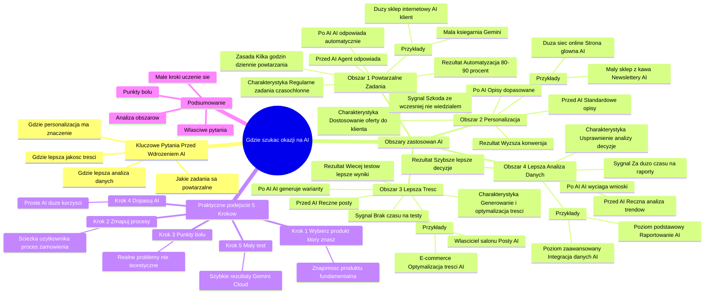

# Lekcje wideo - 3. Gdzie szukać okazji na AI w firmie

# 💡 Diagram

___

# 🗒️ Notatka

# Gdzie szukać okazji na AI w organizacjach? - Notatki i Podsumowanie

## Wprowadzenie

Niniejsza prezentacja koncentruje się na identyfikacji obszarów w organizacjach, w których wdrożenie sztucznej inteligencji (**AI**) może przynieść największą wartość przy minimalnym ryzyku. Kluczowe jest znalezienie miejsc, gdzie **AI** może usprawnić procesy, zwiększyć personalizację, podnieść jakość treści oraz udoskonalić analizę danych.

## Kluczowe Pytania Przed Wdrożeniem AI

Zanim rozpoczniesz poszukiwania możliwości zastosowania **AI** w swojej organizacji, odpowiedz sobie na kilka fundamentalnych pytań:

- **Jakie zadania są powtarzalne?**
- **Gdzie personalizacja ma istotne znaczenie?**
- **W jakich obszarach potrzebna jest lepsza jakość treści?**
- **Gdzie usprawniona analiza danych wspomogłaby proces decyzyjny?**

Odpowiedzi na te pytania pomogą w określeniu obszarów, w których **AI** może przynieść najwięcej korzyści.

## Obszary, w których warto poszukiwać zastosowań AI

### Obszar 1: Powtarzalne Zadania

- **Charakterystyka:** Regularnie wykonywane zadania, które pochłaniają znaczną ilość czasu pracowników.
- **Przykłady:**
    - **Mała księgarnia:** Właściciel odpowiada na te same pytania dotyczące dostępności książek i czasu dostawy. Wdrożenie **AI** (Gemini) do obsługi bazy wiedzy zaowocowało oszczędnością 2-3 godzin dziennie.
    - **Duży sklep internetowy:** Integracja **AI** z systemem obsługi klienta. **AI** odpowiada na pytania, weryfikuje dostępność produktów, informuje o statusie zamówień, realizując 90% komunikacji bez interwencji człowieka.
- **Przed AI:** Agent obsługi klienta odpowiada na standardowe pytania.
- **Po AI:** **AI** automatycznie odpowiada na typowe zapytania.
- **Rezultat:** Automatyzacja 80-90% spraw.
- **Zasada:** Jeżeli Ty lub Twój zespół poświęcacie więcej niż kilka godzin dziennie na powtarzanie tych samych czynności, warto rozważyć wdrożenie **AI**.

### Obszar 2: Personalizacja

- **Charakterystyka:** Dostosowanie oferty i komunikacji do indywidualnych potrzeb klientów. Efektywna personalizacja to nie tylko dopasowanie treści, ale również uczenie się na podstawie zachowań użytkowników.
- **Przykłady:**
    - **Mały sklep z kawą:** Spersonalizowane newslettery. **AI** analizuje preferencje zakupowe klientów (np. miłośników espresso, kaw bezkofeinowych) i wysyła im zróżnicowane wersje wiadomości e-mail. W rezultacie, wskaźnik otwieralności maili wzrósł o 25%.
    - **Duża sieć spożywcza online:** Zaawansowana personalizacja strony głównej. System analizuje historię zakupów, czas i sposób przeglądania strony przez użytkownika. Strona główna jest dynamicznie dostosowywana do preferencji użytkownika, prezentując różne produkty rano i wieczorem, latem i zimą.
- **Przed AI:** Standardowe opisy produktów dla wszystkich klientów.
- **Po AI:** Opisy produktów dopasowane do preferencji klienta.
- **Rezultat:** Zwiększony współczynnik konwersji.
- **Sygnał:** Klienci wyrażają opinię: „Szkoda, że wcześniej nie wiedziałem o tym produkcie” lub „Gdybym wiedział, że to macie, na pewno bym kupił”.

### Obszar 3: Potrzeba Lepszej Treści (Generowanie i Optymalizacja)

- **Charakterystyka:** Tworzenie i ulepszanie treści marketingowych, opisów produktów itp. Najbardziej efektywne rozwiązania **AI** integrują dane o wynikach, umożliwiając iteracyjną poprawę skuteczności treści.
- **Przykłady:**
    - **Właściciel salonu:** **AI** do generowania postów w mediach społecznościowych. Po wprowadzeniu opisu usług, **AI** tworzy różnorodne warianty postów. Czas tworzenia posta skrócił się z 30 do 5 minut, umożliwiając testowanie różnych wersji.
    - **Platforma e-commerce:** Kompleksowa optymalizacja treści. **AI** generuje opisy produktów, analizuje, które sformułowania przekładają się na wyższą sprzedaż, i automatycznie testuje warianty tytułów, opisów oraz *call to action*.
- **Przed AI:** Ręczne tworzenie postów.
- **Po AI:** **AI** generuje warianty treści.
- **Rezultat:** Większa liczba testów, lepsze wyniki.
- **Sygnał:** Tworzenie treści pochłania ponad 20% czasu zespołu, brak czasu na testowanie różnych wariantów.

### Obszar 4: Potrzeba Lepszej Analizy Danych

- **Charakterystyka:** Usprawnienie analizy danych w celu podejmowania trafniejszych decyzji. **AI** powinno nie tylko analizować dane, ale również łączyć informacje z różnych źródeł, dostarczając *actionable insights*.
- **Przykłady:**
    - **Poziom podstawowy:** Automatyczne raportowanie. **AI** wyciąga kluczowe wnioski z danych sprzedażowych i marketingowych, zastępując ręczną analizę arkuszy kalkulacyjnych i tworzenie wykresów. Przynosi to oszczędność czasu i ułatwia identyfikację trendów.
    - **Poziom zaawansowany:** Systemy integrujące dane z różnych źródeł (sprzedaż, marketing, obsługa klienta, media społecznościowe). **AI** analizuje zdarzenia, prognozuje trendy i sugeruje konkretne działania.
- **Przed AI:** Ręczna analiza trendów.
- **Po AI:** **AI** automatycznie wyciąga wnioski.
- **Rezultat:** Szybsze i lepsze decyzje.
- **Sygnał:** Zespół poświęca więcej czasu na przygotowywanie raportów niż na wyciąganie z nich wniosków, opóźnione wykrywanie istotnych trendów.

## Praktyczne Podejście do Poszukiwania Okazji AI - 5 Kroków

### Krok 1: Wybierz Produkt, Który Dobrze Znasz

- Dogłębna znajomość produktu jest fundamentalna. Umożliwia szybką identyfikację rzeczywistych problemów i ocenę potencjału **AI**. Pozwala zrozumieć, co realnie utrudnia życie użytkownikom.

### Krok 2: Zmapuj Główne Procesy

- Naszkicuj na kartce papieru typową ścieżkę użytkownika lub proces realizacji zamówienia. Zidentyfikuj punkty kontaktu z klientem, decyzje podejmowane na każdym etapie, oraz czas trwania poszczególnych faz. To zapewni pełniejszy obraz sytuacji.

### Krok 3: Zidentyfikuj Punkty Bólu

- Skoncentruj się na miejscach, gdzie procesy wyraźnie nie funkcjonują prawidłowo. Szukaj realnych problemów, a nie tylko teoretycznych usprawnień. Gdzie tracisz najwięcej czasu? Gdzie najczęściej popełniacie błędy? Gdzie klienci doświadczają frustracji? Te obszary stanowią „złote szanse” na wprowadzenie ulepszeń.

### Krok 4: Dopasuj Możliwości AI

- Często najprostsze rozwiązania **AI** przynoszą największe korzyści. Nie zawsze konieczne jest wdrażanie zaawansowanych systemów. Prosty chatbot lub automatyczna kategoryzacja wiadomości e-mail mogą rozwiązać wiele problemów.

### Krok 5: Zacznij od Małego Testu

- Wybierz konkretny problem i spróbuj go rozwiązać w najprostszy możliwy sposób. Wykorzystaj dostępne narzędzia (Gemini, Cloud) do automatyzacji odpowiedzi na wiadomości e-mail. Kluczowe jest szybkie uzyskanie realnych rezultatów.

## Podsumowanie

Poszukiwanie możliwości wdrożenia **AI** w organizacji powinno rozpocząć się od analizy kluczowych obszarów, takich jak powtarzalne zadania, personalizacja, generowanie treści i analiza danych. Istotne jest zadanie sobie właściwych pytań i zidentyfikowanie punktów bólu w istniejących procesach. Praktyczne podejście obejmuje pięć kroków: wybór dobrze znanego produktu, mapowanie procesów, identyfikację punktów bólu, dopasowanie możliwości **AI** i rozpoczęcie od małego testu. Często największy potencjał **AI** tkwi w prostych rozwiązaniach, a kluczem do sukcesu jest rozpoczęcie od małych kroków i uczenie się w trakcie procesu wdrożenia.

___

# 🔉 Transcript
File: Lekcje wideo - 3. Gdzie szukać okazji na AI w firmie.mp4 
[00:00:04] Skoro już wiemy jak podejść do wdrożenia AI, skupmy się na tym, gdzie szukać największych okazji w naszych organizacjach.
[00:00:07] (Ekran: Wojciech Strzałkowski Head of Product GOG.com. Pytanie: Gdzie szukać okazji na AI?)
[00:00:13] To kluczowy moment. Musimy znaleźć te miejsca, gdzie AI da nam największą wartość przy najmniejszym ryzyku.
[00:00:19] (Ekran: Zanim zaczniesz, zadaj sobie pytania.)
[00:00:20] Jest kilka obszarów, które powinniśmy przeanalizować i zadać sobie kilka podstawowych pytań.
[00:00:26] (Ekran: Zanim zaczniesz, zadaj sobie pytania. Jakie zadania się powtarzają? Gdzie personalizacja ma znaczenie? Gdzie potrzebna jest lepsza treść? Gdzie lepsza analiza pomoże w decyzjach?)
[00:00:27] Po pierwsze, gdzie w naszej organizacji powtarzają się te same zadania.
[00:00:31] Po drugie, gdzie personalizacja może przynieść największą wartość.
[00:00:36] Gdzie potrzebujemy lepszej jakości treści i wreszcie, gdzie lepsza analiza danych pomoże nam podejmować lepsze decyzje.
[00:00:43] Przyjrzyjmy się dokładniej tym obszarom.
[00:00:46] (Ekran: Zadania, które się powtarzają. Szukaj zadań, które można nie tylko zautomatyzować, ale też ulepszyć przez AI - np. chatbot, który nie tylko odpowiada, ale też proaktywnie prowadzi użytkownika do rozwiązania. PRZED: Agent odpowiada na te same pytania. PO: AI automatycznie odpowiada na typowe sprawy. REZULTAT: 80% spraw rozwiązanych automatycznie.)
[00:00:47] Pierwszy obszar, w którym warto szukać okazji o do AI, to zadania powtarzalne.
[00:00:51] Wyobraźmy sobie dwie sytuacje z życia wzięte. Z jednej strony mamy małą księgarnię, gdzie właściciel każdego dnia odpowiada na te same pytania o dostępność książek i czas dostawy.
[00:01:02] Wdrożył proste rozwiązanie z Gemini, stworzył bazę odpowiedzi i pozwolił AI na ich obsługę. Całkowity koszt, miesięczna subskrypcja, a odzyskał dwie, trzy godziny dziennie.
[00:01:13] Z drugiej strony duży sklep internetowy poszedł krok dalej.
[00:01:17] Zintegrowali AI z całym systemem obsługi klienta.
[00:01:20] Ich rozwiązanie nie tylko odpowiada na pytania, ale łączy się z magazynem, samo sprawdza dostępność produktów i aktywnie informuje o statusie zamówień.
[00:01:30] Jasne, potrzebowali do tego programistów i sporo pracy nad integracją, ale teraz 90% komunikacji dzieje się bez udziału człowieka.
[00:01:39] Reguła kciuka?
[00:01:41] Jeśli łapiesz się na tym, że ty lub twój zespół spędzacie więcej niż kilka godzin dziennie na powtarzaniu tych samych czynności, to pierwszy sygnał, że warto pomyśleć o AI.
[00:01:52] (Ekran: Gdzie personalizacja ma znaczenie. Dobra personalizacja to nie tylko dostosowywanie treści, ale uczenie się z zachowań użytkownika by stale poprawiać dopasowanie. PRZED: Te same opisy dla wszystkich. PO: Opisy dostosowane do preferencji klienta. REZULTAT: Wyższy współczynnik konwersji.)
[00:01:52] Drugi obszar to personalizacja.
[00:01:55] Znów, zobaczmy to na dwóch przykładach. Mały sklep z kawą zaczął od prostego rozwiązania.
[00:02:00] Używają AI do tworzenia spersonalizowanych newsletterów. Patrzą, kto co kupuje, dzielą klientów na kilka grup: miłośników espresso, fanów kaw bezkofeinowych i wysyłają im różne wersje maili.
[00:02:13] Proste? Tak, skuteczne?
[00:02:16] Ich maile otwiera o 25% więcej osób.
[00:02:20] Tymczasem duża sieć spożywcza online poszła dalej. Ich system analizuje nie tylko co kupujesz, ale kiedy to robisz, jak poruszasz się po stronie, jakie produkty przeglądasz.
[00:02:31] Na tej podstawie AI układa stronę główną pod każdego użytkownika osobno. Rano pokazują ci inne produkty niż wieczorem. Latem inne niż zimą.
[00:02:41] Więc jeśli twoi klienci często mówią: szkoda, że wcześniej nie wiedziałem o tym produkcie, albo gdybym wiedział, że to macie, to na pewno bym kupił, to znak, że personalizacja mogłaby wam pomóc.
[00:02:53] (Ekran: Gdzie potrzeba lepszej treści? Najlepsze rozwiązania AI nie tylko tworzą treść, ale integrują dane o wynikach by iteracyjnie poprawiać jej skuteczność. PRZED: Ręczne pisanie postów. PO: AI generuje warianty treści. REZULTAT: Więcej testów, lepsze wyniki.)
[00:02:53] Kolejny obszar to generowanie i optymalizacja treści. Na poziomie podstawowym mamy na przykład właściciela salonu, który używa AI do tworzenia postów w mediach społecznościowych.
[00:03:04] Zamiast spędzać godziny na wymyślaniu treści, opisuje AI swoje usługi i pozwala jej generować różne warianty postów.
[00:03:12] Każdy post zajmuje mu teraz 5 minut zamiast 30, a co więcej możesz szybko przetestować różne wersje i sprawdzić co działa najlepiej.
[00:03:22] Na drugim końcu spektrum mamy platformę e-commerce, która używa AI do kompleksowej optymalizacji wszystkich treści.
[00:03:30] System nie tylko tworzy opisy produktów, ale też analizuje, które sformułowania prowadzą do większej sprzedaży.
[00:03:36] Automatycznie testuje różne warianty tytułów, opisów i wezwań do działania, ucząc się na bieżąco z wyników.
[00:03:43] Zatem jeśli tworzenie treści zajmuje więcej niż 20% czasu twojego zespołu, albo nie masz czasu na testowanie różnych wariantów, to znak, że AI mogłoby tu pomóc.
[00:03:53] (Ekran: Gdzie potrzebna jest lepsza analiza danych. AI powinno nie tylko analizować dane, ale też łączyć różne źródła by dostarczać actionable insights. PRZED: Ręczne analizowanie trendów. PO: AI automatycznie wyciąga wnioski. REZULTAT: Szybsze i lepsze decyzje.)
[00:03:54] Ostatni obszar to analiza danych.
[00:03:57] Na poziomie podstawowym spotykam firmy, które używają AI do automatycznego raportowania. Zamiast ręcznie analizować arkusze i tworzyć wykresy, pozwalają AI wyciągnąć kluczowe wnioski z danych sprzedażowych czy marketingowych.
[00:04:11] To oszczędza kilka godzin tygodniowo i pomaga zauważyć trendy, które łatwo przeoczyć.
[00:04:16] Na poziomie zaawansowanym widzimy systemy, które łączą dane z różnych źródeł, z sprzedaży, marketingu, obsługi klienta, mediów społecznościowych i tworzą kompleksowy obraz sytuacji.
[00:04:28] AI nie tylko analizuje co się stało, ale przewiduje trendy i proponuje konkretne działania.
[00:04:34] Jeśli twój zespół spędza więcej czasu na przygotowywaniu raportów niż na wyciąganiu z nich wniosków, albo często odkrywacie ważne trendy zbyt późno, to sygnał, że warto rozważyć AI w analizie danych.
[00:04:48] (Ekran: Od czego zacząć? 01 Wybierz produkt, który dobrze znasz.)
[00:04:48] Jak więc praktycznie podejść do szukania okazji AI w swojej organizacji?
[00:04:53] Proponuję pięć konkretnych kroków.
[00:04:55] Po pierwsze, zacznij od produktu, który najlepiej znasz.
[00:04:59] To nie przypadek, że to pierwszy krok. Kiedy znasz produkt na wylot, natychmiast widzisz, które problemy są realne, a które wydumane. Wiesz, co faktycznie przeszkadza użytkownikom, a co jest tylko małą niedogodnością. Ta wiedza jest bezcenna przy ocenie potencjału AI.
[00:05:15] (Ekran: 02 Zmapuj główne procesy.)
[00:05:16] Drugi to zmapowanie głównych procesów. Weź kartkę papieru i narysuj jak wygląda typowa ścieżka użytkownika albo proces obsługi zamówienia. Gdzie są punkty styku z klientem? Jakie decyzje podejmujemy po drodze? Ile czasu zajmuje każdy etap?
[00:05:32] To da ci szerszy obraz sytuacji.
[00:05:35] (Ekran: 03 Znajdź punkty bólu.)
[00:05:35] Trzeci krok to znalezienie punktów bólu i tu ważna uwaga. Szukaj miejsc, gdzie coś ewidentnie nie działa jak powinno. Nie chodzi o teoretyczne usprawnienia, tylko o realne problemy. Gdzie tracisz najwięcej czasu? Gdzie popełniacie najwięcej błędów? Gdzie klienci najczęściej się frustrują?
[00:05:55] Te miejsca to twoje złote szanse na usprawnienia.
[00:06:00] (Ekran: 04 Dopasuj możliwości AI.)
[00:06:00] Czwarty krok to dopasowanie możliwości AI do tych problemów i tu ciekawa rzecz.
[00:06:06] Często okazuje się, że najprostsze rozwiązanie AI może przynieść największe korzyści. Nie zawsze potrzebujesz zaawansowanego systemu. Czasem prosty chatbot albo automatyczne kategoryzowanie maili rozwiąże większość problemów.
[00:06:20] (Ekran: 05 Zacznij od małego testu.)
[00:06:21] I wreszcie piąty kluczowy krok. Zacznij od małego testu. Wybierz jeden konkretny problem i rozwiąż go najprostszym możliwym sposobem.
[00:06:30] Może to być nawet wykorzystanie gotowego narzędzia jak Gemini czy Cloud do automatyzacji odpowiedzi na maile.
[00:06:36] Ważne, żeby szybko zobaczyć realne rezultaty.
[00:06:39] Co ciekawe, często podczas takiego procesu odkrywasz, że największe możliwości AI leżą nie tam, gdzie początkowo myślałeś.
[00:06:47] Dlatego tak ważne jest, żeby zacząć od małych kroków i uczyć się po drodze, zamiast od razu planować wielką transformację.
[00:06:54] (Ekran: Umiejętności Jutra AI. Organizator Google, Partner edukacyjny SGH.)

___
# 🏷️ Tags
#AI #sztuczna_inteligencja #wdrożenie_AI #okazje_AI #automatyzacja #personalizacja #generowanie_treści #analiza_danych #proces_decyzyjny #powtarzalne_zadania #jakość_treści #usprawnienie_procesów #minimalne_ryzyko #baza_wiedzy #Gemini #sklep_internetowy #obsługa_klienta #automatyzacja_obsługi_klienta #newsletter #e-mail_marketing #współczynnik_konwersji #platforma_e-commerce #optymalizacja_treści #call_to_action #automatyczne_raportowanie #actionable_insights #ścieżka_użytkownika #punkty_bólu #chatbot #Google #Cloud #transformacja_cyfrowa #uczenie_maszynowe #machine_learning #dane_sprzedażowe #trendy_sprzedażowe #media_społecznościowe #social_media #integracja_danych #customer_service #doświadczenie_klienta #customer_experience #księgarnia #sklep_z_kawą #salon #produkt #proces #testowanie #testy #test
