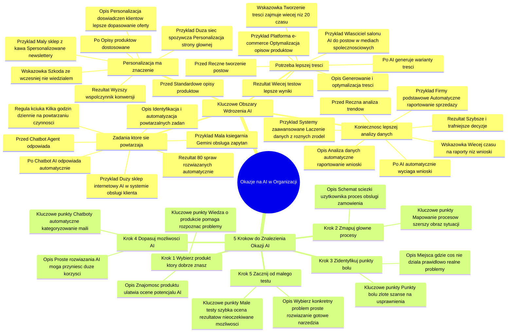

# Lekcje wideo - 3. Gdzie szukać okazji na AI w firmie

# 💡 Diagram

___

# 🗒️ Notatka

# Gdzie Szukać Okazji na AI w Organizacji

## Wprowadzenie

Niniejsze opracowanie koncentruje się na identyfikacji obszarów w organizacjach, gdzie wdrożenie sztucznej inteligencji (`AI`) przyniesie największą wartość przy minimalnym ryzyku. Przedstawia cztery kluczowe obszary, w których `AI` może być efektywnie zastosowane, oraz pięć praktycznych kroków, które pomogą organizacjom rozpocząć wdrażanie `AI`.

## Kluczowe Obszary do Wdrożenia AI

Prelegent wyróżnia cztery główne obszary, w których warto poszukiwać okazji do wdrożenia `AI`:

### 1. Zadania, które się powtarzają

- **Opis:** Identyfikacja i automatyzacja powtarzalnych zadań w organizacji. `AI` może nie tylko zautomatyzować te zadania, ale również je ulepszyć.
- **Przykłady:**
    - **Mała księgarnia:** Właściciel wykorzystuje `AI` (np. Gemini) do obsługi zapytań o dostępność książek i czas dostawy, oszczędzając 2-3 godziny dziennie.
    - **Duży sklep internetowy:** Zintegrowane rozwiązanie `AI` z systemem obsługi klienta automatycznie odpowiada na pytania, sprawdza dostępność produktów i informuje o statusie zamówień. 90% komunikacji odbywa się bez udziału człowieka.
- **Przed - Po - Rezultat (Chatbot jako przykład):**
    - **PRZED:** Agent odpowiada na te same pytania.
    - **PO:** `AI` automatycznie odpowiada na typowe zapytania.
    - **REZULTAT:** 80% spraw rozwiązanych automatycznie.
- **Reguła kciuka:** Jeśli Ty lub Twój zespół spędzacie więcej niż kilka godzin dziennie na powtarzaniu tych samych czynności, warto rozważyć wdrożenie `AI`.

### 2. Personalizacja ma znaczenie

- **Opis:** Wykorzystanie `AI` do personalizacji doświadczeń klientów, co prowadzi do lepszego dopasowania oferty i zwiększenia konwersji. Personalizacja to nie tylko dostosowanie treści, ale również ciągłe uczenie się na podstawie zachowań użytkowników.
- **Przykłady:**
    - **Mały sklep z kawą:** Wykorzystanie `AI` do tworzenia spersonalizowanych newsletterów na podstawie historii zakupów klientów (np. miłośników espresso, kaw bezkofeinowych). Otwieralność maili wzrosła o 25%.
    - **Duża sieć spożywcza online:** System analizuje zachowania użytkowników (co, kiedy kupują, sposób poruszania się po stronie) i personalizuje stronę główną, wyświetlając różne produkty w zależności od pory dnia i roku.
- **Przed - Po - Rezultat (Opisy produktów jako przykład):**
    - **PRZED:** Standardowe opisy produktów dla wszystkich klientów.
    - **PO:** Opisy produktów dostosowane do preferencji klienta.
    - **REZULTAT:** Wyższy współczynnik konwersji.
- **Wskazówka:** Jeśli klienci często mówią: „szkoda, że wcześniej nie wiedziałem o tym produkcie” lub „gdybym wiedział, że to macie, to bym kupił”, personalizacja może być rozwiązaniem.

### 3. Potrzeba lepszej treści

- **Opis:** Generowanie i optymalizacja treści za pomocą `AI`. `AI` może wspomóc tworzenie różnorodnych wariantów treści i iteracyjne poprawianie ich skuteczności w oparciu o dane.
- **Przykłady:**
    - **Właściciel salonu:** Wykorzystuje `AI` do generowania postów w mediach społecznościowych, opisując usługi i pozwalając `AI` tworzyć różne wersje postów. Czas tworzenia posta skrócił się z 30 do 5 minut.
    - **Platforma e-commerce:** System `AI` optymalizuje treści, tworząc opisy produktów, analizując, które sformułowania generują większą sprzedaż, i automatycznie testując warianty tytułów, opisów oraz wezwań do działania (CTA).
- **Przed - Po - Rezultat (Posty w mediach społecznościowych jako przykład):**
    - **PRZED:** Ręczne tworzenie postów.
    - **PO:** `AI` generuje warianty treści.
    - **REZULTAT:** Więcej testów, lepsze wyniki.
- **Wskazówka:** Jeśli tworzenie treści zajmuje więcej niż 20% czasu Twojego zespołu lub brakuje czasu na testowanie różnych wariantów, `AI` może okazać się bardzo pomocne.

### 4. Konieczność lepszej analizy danych

- **Opis:** Wykorzystanie `AI` do analizy danych, automatycznego raportowania i wyciągania wniosków. `AI` może łączyć dane z różnych źródeł, dostarczając *actionable insights* (praktycznych wniosków).
- **Przykłady:**
    - **Firmy na poziomie podstawowym:** Wykorzystują `AI` do automatycznego raportowania danych sprzedażowych i marketingowych, oszczędzając czas i szybciej identyfikując trendy.
    - **Systemy zaawansowane:** Łączą dane z różnorodnych źródeł (sprzedaż, marketing, obsługa klienta, media społecznościowe), tworząc kompleksowy obraz sytuacji, przewidując trendy i sugerując konkretne działania.
- **Przed - Po - Rezultat (Analiza trendów jako przykład):**
    - **PRZED:** Ręczna analiza trendów.
    - **PO:** `AI` automatycznie wyciąga wnioski.
    - **REZULTAT:** Szybsze i trafniejsze decyzje.
- **Wskazówka:** Jeśli Twój zespół poświęca więcej czasu na przygotowywanie raportów niż na wyciąganie z nich wniosków, lub często odkrywacie istotne trendy zbyt późno, warto rozważyć `AI` w analizie danych.

## Od Czego Zacząć? - 5 Kroków do Znalezienia Okazji AI

Prelegent proponuje pięć konkretnych kroków, aby praktycznie podejść do poszukiwania okazji `AI` w organizacji:

### 1. Wybierz produkt, który dobrze znasz.

- **Opis:** Zacznij od produktu, który znasz najlepiej. Znajomość produktu umożliwia szybką ocenę, które problemy są realne, a które wydumane, co ułatwia ocenę potencjału `AI`.
- **Kluczowe punkty:** Wiedza o produkcie pomaga rozpoznać rzeczywiste problemy użytkowników i ocenić, gdzie `AI` może wnieść największą wartość.

### 2. Zmapuj główne procesy.

- **Opis:** Narysuj schemat typowej ścieżki użytkownika lub procesu obsługi zamówienia. Zidentyfikuj punkty styku z klientem, podejmowane decyzje i czas trwania każdego etapu.
- **Kluczowe punkty:** Mapowanie procesów pozwala uzyskać szerszy obraz sytuacji i zidentyfikować obszary wymagające usprawnień.

### 3. Zidentyfikuj punkty bólu.

- **Opis:** Poszukaj miejsc, w których coś wyraźnie nie działa prawidłowo. Skoncentruj się na realnych problemach, a nie teoretycznych usprawnieniach. Zidentyfikuj obszary, w których tracisz najwięcej czasu, popełniacie najwięcej błędów i w których klienci odczuwają frustrację.
- **Kluczowe punkty:** Punkty bólu stanowią „złote szanse” na usprawnienia za pomocą `AI`.

### 4. Dopasuj możliwości AI.

- **Opis:** Dopasuj możliwości `AI` do zidentyfikowanych problemów. Często najprostsze rozwiązania `AI` mogą przynieść największe korzyści. Nie zawsze konieczne są zaawansowane systemy.
- **Kluczowe punkty:** Proste rozwiązania `AI`, takie jak chatboty czy automatyczne kategoryzowanie maili, mogą okazać się bardzo skuteczne.

### 5. Zacznij od małego testu.

- **Opis:** Wybierz konkretny problem i spróbuj rozwiązać go w najprostszy możliwy sposób. Można wykorzystać gotowe narzędzia, takie jak Gemini lub Cloud, do automatyzacji prostych zadań. Kluczowe jest szybkie zobaczenie realnych rezultatów.
- **Kluczowe punkty:** Małe testy pozwalają szybko ocenić rezultaty i często ujawniają nieoczekiwane możliwości `AI` w obszarach, które początkowo nie były brane pod uwagę. Zacznij od małych kroków i ucz się w trakcie, zamiast planować od razu kompleksową transformację.

## Podsumowanie

Wdrożenie `AI` w organizacji powinno być strategiczne i skoncentrowane na obszarach, gdzie przyniesie największą wartość. Kluczowe obszary to: **powtarzalne zadania, personalizacja, generowanie treści i analiza danych**. Aby skutecznie rozpocząć, należy: **zrozumieć swój produkt, zmapować procesy, zidentyfikować punkty bólu, dopasować odpowiednie rozwiązania `AI` i zacząć od małych testów**. Podejście krok po kroku, rozpoczynając od małych, mierzalnych projektów, jest kluczem do sukcesu i odkrycia pełnego potencjału `AI` w organizacji. Ważne jest ciągłe uczenie się i iteracyjne rozwijanie rozwiązań `AI`.

___

# 🔉 Transcript
File: Lekcje wideo - 3. Gdzie szukać okazji na AI w firmie.mp4 
[00:00:05] Skoro już wiemy jak podejść do wdrożenia AI, skupmy się na tym, gdzie szukać największych okazji w naszych organizacjach.
[00:00:13] To kluczowy moment.
[00:00:15] Musimy znaleźć te miejsca, gdzie AI da nam największą wartość przy najmniejszym ryzyku.
[00:00:20] Jest kilka obszarów, które powinniśmy przeanalizować i zadać sobie kilka podstawowych pytań.
[00:00:27] Po pierwsze, gdzie w naszej organizacji powtarzają się te same zadania.
[00:00:31] Po drugie, gdzie personalizacja może przynieść największą wartość.
[00:00:36] Gdzie potrzebujemy lepszej jakości treści i wreszcie, gdzie lepsza analiza danych pomoże nam podejmować lepsze decyzje.
[00:00:43] Przyjrzyjmy się dokładniej tym obszarom.
[00:00:46] Ekran: Slajd z tytułem "Zadania, które się powtarzają". Pod spodem tekst: "Szukaj zadań, które można nie tylko zautomatyzować, ale też ulepszyć przez AI - np. chatbot, który nie tylko odpowiada, ale też proaktywnie prowadzi użytkownika do rozwiązania. PRZED: Agent odpowiada na te same pytania. PO: AI automatycznie odpowiada na typowe sprawy. REZULTAT: 80% spraw rozwiązanych automatycznie."
[00:00:47] Pierwszy obszar, w którym warto szukać okazji o do AI, to zadania powtarzalne.
[00:00:52] Wyobraźmy sobie dwie sytuacje z życia wzięte.
[00:00:54] Z jednej strony mamy małą księgarnię, gdzie właściciel każdego dnia odpowiada na te same pytania o dostępność książek i czas dostawy.
[00:01:02] Wdrożył proste rozwiązanie z Gemini, stworzył bazę odpowiedzi i pozwolił AI na ich obsługę.
[00:01:07] Całkowity koszt, miesięczna subskrypcja, a odzyskał dwie, trzy godziny dziennie.
[00:01:13] Z drugiej strony, duży sklep internetowy poszedł krok dalej.
[00:01:17] Zintegrowali AI z całym systemem obsługi klienta.
[00:01:21] Ich rozwiązanie nie tylko odpowiada na pytania, ale łączy się z magazynem, samo sprawdza dostępność produktów i aktywnie informuje o statusie zamówień.
[00:01:30] Jasne, potrzebowali do tego programistów i sporo pracy nad integracją, ale teraz 90% komunikacji dzieje się bez udziału człowieka.
[00:01:40] Reguła kciuka.
[00:01:41] Jeśli łapiesz się na tym, że ty lub twój zespół spędzacie więcej niż kilka godzin dziennie na powtarzaniu tych samych czynności, to pierwszy sygnał, że warto pomyśleć o AI.
[00:01:52] Ekran: Slajd z tytułem "Gdzie personalizacja ma znaczenie". Pod spodem tekst: "Dobra personalizacja to nie tylko dostosowanie treści, ale uczenie się z zachowań użytkownika by stale poprawiać dopasowanie. PRZED: Te same opisy dla wszystkich. PO: Opisy dostosowane do preferencji klienta. REZULTAT: Wyższy współczynnik konwersji."
[00:01:52] Drugi obszar to personalizacja.
[00:01:55] Znów, zobaczmy to na dwóch przykładach.
[00:01:57] Mały sklep z kawą zaczął od prostego rozwiązania.
[00:02:00] Używają AI do tworzenia spersonalizowanych Newsletterów.
[00:02:04] Patrzą, kto co kupuje.
[00:02:06] Dzielą klientów na kilka grup, miłośników espresso, fanów kaw bezkofeinowych i wysyłają im różne wersje maili.
[00:02:13] Proste?
[00:02:14] Tak.
[00:02:15] Skuteczne?
[00:02:16] Ich maile otwiera o 25% więcej osób.
[00:02:20] Tymczasem duża sieć spożywcza online poszła dalej.
[00:02:23] Ich system analizuje nie tylko co kupujesz, ale kiedy to robisz, jak poruszasz się po stronie, jakie produkty przeglądasz.
[00:02:31] Na tej podstawie AI układa stronę główną pod każdego użytkownika osobno.
[00:02:36] Rano pokazują ci inne produkty niż wieczorem.
[00:02:39] Latem inne niż zimą.
[00:02:41] Więc jeśli twoi klienci często mówią: szkoda, że wcześniej nie wiedziałem o tym produkcie, albo gdybym wiedział, że to macie to na pewno bym kupił.
[00:02:50] To znak, że personalizacja mogłaby wam pomóc.
[00:02:53] Ekran: Slajd z tytułem "Gdzie potrzeba lepszej treści?". Pod spodem tekst: "Najlepsze rozwiązania AI nie tylko tworzą treść, ale integrują dane o wynikach by iteracyjnie poprawiać jej skuteczność. PRZED: Ręczne pisanie postów. PO: AI generuje warianty treści. REZULTAT: Więcej testów, lepsze wyniki."
[00:02:53] Kolejny obszar to generowanie i optymalizacja treści.
[00:02:56] Na poziomie podstawowym mamy na przykład właściciela salonu, który używa AI do tworzenia postów w mediach społecznościowych.
[00:03:04] Zamiast spędzać godziny na wymyślaniu treści, opisuje AI swoje usługi i pozwala jej generować różne warianty postów.
[00:03:12] Każdy post zajmuje mu teraz 5 minut zamiast 30, a co więcej, możesz szybko przetestować różne wersje i sprawdzić co działa najlepiej.
[00:03:22] Na drugim końcu spektrum mamy platformę e-commerce, która używa AI do kompleksowej optymalizacji wszystkich treści.
[00:03:30] System nie tylko tworzy opisy produktów, ale też analizuje, które sformułowania prowadzą do większej sprzedaży.
[00:03:36] Automatycznie testuje różne warianty tytułów, opisów i wezwań do działania, ucząc się na bieżąco z wyników.
[00:03:43] Zatem jeśli tworzenie treści zajmuje więcej niż 20% czasu twojego zespołu, albo nie masz czasu na testowanie różnych wariantów, to znak, że AI mogłoby tu pomóc.
[00:03:53] Ekran: Slajd z tytułem "Gdzie potrzebna jest lepsza analiza danych". Pod spodem tekst: "AI powinno nie tylko analizować dane, ale łączyć różne źródła by dostarczać actionable insights. PRZED: Ręczne analizowanie trendów. PO: AI automatycznie wyciąga wnioski. REZULTAT: Szybsze i lepsze decyzje."
[00:03:54] Ostatni obszar to analiza danych.
[00:03:57] Na poziomie podstawowym spotykam firmy, które używają AI do automatycznego raportowania.
[00:04:02] Zamiast ręcznie analizować arkusze i tworzyć wykresy, pozwalają AI wyciągnąć kluczowe wnioski z danych sprzedażowych czy marketingowych.
[00:04:11] To oszczędza kilka godzin tygodniowo i pomaga zauważyć trendy, które łatwo przeoczyć.
[00:04:17] Na poziomie zaawansowanym widzimy systemy, które łączą dane z różnych źródeł, sprzedaży, marketingu, obsługi klienta, mediów społecznościowych i tworzą kompleksowy obraz sytuacji.
[00:04:28] AI nie tylko analizuje co się stało, ale przewiduje trendy i proponuje konkretne działania.
[00:04:34] Jeśli twój zespół spędza więcej czasu na przygotowywaniu raportów niż na wyciąganiu z nich wniosków, albo często odkrywacie ważne trendy zbyt późno, to sygnał, że warto rozważyć AI w analizie danych.
[00:04:48] Ekran: Slajd z tytułem "Od czego zacząć?" i numerem "01". Pod spodem tekst: "Wybierz produkt, który dobrze znasz."
[00:04:48] Jak więc praktycznie podejść do szukania okazji AI w swojej organizacji.
[00:04:53] Proponuję pięć konkretnych kroków.
[00:04:55] Po pierwsze, zacznij od produktu, który najlepiej znasz.
[00:04:59] To nie przypadek, że to pierwszy krok.
[00:05:02] Kiedy znasz produkt na wylot, natychmiast widzisz, które problemy są realne, a które wydumane.
[00:05:07] Wiesz co faktycznie przeszkadza użytkownikom, a co jest tylko małą niedogodnością.
[00:05:12] Ta wiedza jest bezcenna przy ocenie potencjału AI.
[00:05:16] Ekran: Slajd z tytułem "Od czego zacząć?" i numerem "02". Pod spodem tekst: "Zmapuj główne procesy."
[00:05:16] Drugi to zmapowanie głównych procesów.
[00:05:19] Weź kartkę papieru i narysuj jak wygląda typowa ścieżka użytkownika albo proces obsługi zamówienia.
[00:05:25] Gdzie są punkty styku z klientem.
[00:05:27] Jakie decyzje podejmujemy po drodze.
[00:05:30] Ile czasu zajmuje każdy etap.
[00:05:32] To da ci szerszy obraz sytuacji.
[00:05:35] Ekran: Slajd z tytułem "Od czego zacząć?" i numerem "03". Pod spodem tekst: "Znajdź punkty bólu."
[00:05:35] Trzeci krok to znalezienie punktów bólu i tu ważna uwaga.
[00:05:40] Szukaj miejsc, gdzie coś ewidentnie nie działa jak powinno.
[00:05:43] Nie chodzi o teoretyczne usprawnienia, tylko o realne problemy.
[00:05:48] Gdzie tracisz najwięcej czasu, gdzie popełniacie najwięcej błędów, gdzie klienci najczęściej się frustrują.
[00:05:55] Te miejsca to twoje złote szanse na usprawnienia.
[00:06:00] Ekran: Slajd z tytułem "Od czego zacząć?" i numerem "04". Pod spodem tekst: "Dopasuj możliwości AI."
[00:06:01] Czwarty krok to dopasowanie możliwości AI do tych problemów i tu ciekawa rzecz.
[00:06:07] Często okazuje się, że najprostsze rozwiązanie AI może przynieść największe korzyści.
[00:06:12] Nie zawsze potrzebujesz zaawansowanego systemu, czasem prosty chatbot albo automatyczne kategoryzowanie maili rozwiąże większość problemów.
[00:06:21] Ekran: Slajd z tytułem "Od czego zacząć?" i numerem "05". Pod spodem tekst: "Zacznij od małego testu."
[00:06:21] I wreszcie piąty kluczowy krok, zacznij od małego testu.
[00:06:24] Wybierz jeden konkretny problem i rozwiąż go najprostszym możliwym sposobem.
[00:06:30] Może to być nawet wykorzystanie gotowego narzędzia jak Gemini czy Cloud do automatyzacji odpowiedzi na maile.
[00:06:36] Ważne, żeby szybko zobaczyć realne rezultaty.
[00:06:40] Co ciekawe, często podczas takiego procesu odkrywasz, że największe możliwości AI leżą nie tam, gdzie początkowo myślałeś.
[00:06:47] Dlatego tak ważne jest, żeby zacząć od małych kroków i uczyć się po drodze, zamiast od razu planować wielką transformację.
[00:06:54] Ekran: Logo Umiejętności Jutra AI.

___
# 🏷️ Tags
#AI #sztuczna_inteligencja #wdrożenie_AI #okazje_AI #automatyzacja #ulepszanie_zadań #chatbot #Gemini #dostępność_książek #czas_dostawy #sklep_internetowy #system_obsługi_klienta #status_zamówień #reguła_kciuka #personalizacja #doświadczenia_klientów #konwersja #newsletter #historia_zakupów #espresso #kawa_bezkofeinowa #sieć_spożywcza_online #zachowania_użytkowników #strona_główna #opisy_produktów #współczynnik_konwersji #generowanie_treści #optymalizacja_treści #media_społecznościowe #platforma_e-commerce #tytuły #opisy #wezwania_do_działania #CTA #analiza_danych #raportowanie #actionable_insights #dane_sprzedażowe #dane_marketingowe #trendy #obsługa_klienta #media_społecznościowe #decyzje #produkt #procesy #ścieżka_użytkownika #obsługa_zamówienia #punkty_styku_z_klientem #punkty_bólu #usprawnienia #testy #transformacja #małe_kroki #uczenie_się #rozwiązywanie_problemów #narzędzia #Cloud #automatyzacja_maili #wartość_AI #ryzyko_AI #powtarzalne_zadania #lepsza_treść #lepsza_analiza_danych #decyzje #mapowanie_procesów #realne_problemy #teoretyczne_usprawnienia #frustracja_klientów #proste_rozwiązania_AI #skuteczne_rozwiązania_AI #mierzalne_projekty #ciągłe_uczenie_się #iteracyjne_rozwijanie_rozwiązań
