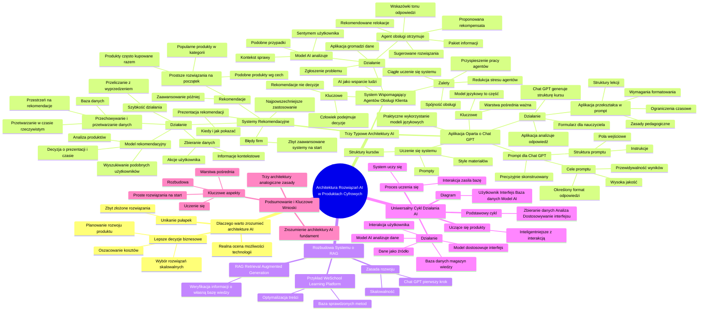

# Lekcje wideo - 4. Architektura rozwiązań AI w produktach

# 💡 Diagram

___

# 🗒️ Notatka

# Architektura Rozwiązań AI w Produktach Cyfrowych - Notatki i Podsumowanie

## Wprowadzenie

Ten film omawia architekturę rozwiązań **sztucznej inteligencji** (AI) w produktach cyfrowych, demistyfikując powszechne, często magiczne wyobrażenia o AI jako o „czarnej skrzynce” 🪞. Celem prezentacji jest ukazanie, jak AI funkcjonuje „pod maską” 🎭, co jest niezwykle istotne dla product managerów, decydentów biznesowych i wszystkich osób zainteresowanych efektywnym wykorzystaniem tej technologii. Zrozumienie fundamentalnych zasad działania AI umożliwia podejmowanie trafniejszych decyzji biznesowych, precyzyjne oszacowanie kosztów, efektywne planowanie rozwoju produktów oraz wybór rozwiązań adekwatnych do skali działalności. Pomaga również w uniknięciu typowych pułapek, takich jak wdrażanie nadmiernie skomplikowanych rozwiązań, gdy prostsze metody mogą okazać się w pełni wystarczające.

## Dlaczego warto zrozumieć architekturę AI?

*   **Realna ocena możliwości technologii:** Zrozumienie rzeczywistych możliwości, jakie oferuje współczesna technologia AI. Pozwala to unikać nierealnych oczekiwań w stylu „AI jak w Netflixie”,  gdy prostsze rozwiązania mogą być w pełni wystarczające.
*   **Lepsze decyzje biznesowe:** Znajomość architektury AI przekłada się na:
    *   **Oszacowanie kosztów** implementacji i utrzymania.
    *   **Planowanie rozwoju produktu** w oparciu o realne, a nie wyimaginowane możliwości AI.
    *   **Wybór rozwiązań skalowalnych** i odpowiednich do rzeczywistych potrzeb biznesowych.
*   **Unikanie pułapek:** Zapobieganie implementacji zbyt złożonych rozwiązań, w sytuacjach gdy prostsze metody mogą przynieść porównywalne, a często nawet lepsze efekty.

## Trzy Typowe Architektury AI w Produktach Cyfrowych

Prezentacja koncentruje się na trzech modelowych architekturach AI. Mimo różnic w zastosowaniu, łączy je szereg wspólnych elementów:

### 1. Systemy Rekomendacyjne

*   **Najpowszechniejsze zastosowanie AI** w produktach cyfrowych.
*   **Diagram:** Użytkownik -> Baza danych -> Model rekomendacyjny.
*   **Działanie:**
    *   **Zbieranie danych:**
        *   **Akcje bezpośrednie użytkownika:** Kliknięcia, zakupy 🛒, dodania do koszyka 🧺.
        *   **Informacje kontekstowe:** Czas oglądania produktu 🕰️, pora dnia zakupów, rodzaj urządzenia.
    *   **Przechowywanie i przetwarzanie danych:** Baza danych gromadząca historię zachowań, system przetwarzania danych w czasie rzeczywistym, przestrzeń na wygenerowane rekomendacje.
    *   **Model rekomendacyjny (składa się z kilku komponentów):**
        *   **Wyszukiwanie podobnych użytkowników:** Rekomendacje bazujące na zakupach osób o zbliżonych preferencjach.
        *   **Analiza produktów:** Rekomendacje produktów komplementarnych (np. czarne szpilki 👠 -> czarna torebka 👜).
        *   **Decyzja o prezentacji i czasie wyświetlenia:** Dostosowanie rekomendacji do aktualnego czasu i kontekstu (np. piątkowy wieczór 🌃 vs. poniedziałkowy poranek 🌄).
    *   **Szybkość działania:** Rekomendacje są przeliczane z wyprzedzeniem, aby zapewnić szybkie ładowanie strony.
*   **Częsty błąd firm:** Próby budowania zaawansowanych systemów na wzór Netflixa czy Amazona już na starcie.
*   **Rekomendacja:** Rozpoczęcie od prostszych rozwiązań:
    *   Wyświetlanie produktów często kupowanych razem.
    *   Rekomendowanie popularnych produktów w danej kategorii.
    *   Sugerowanie podobnych produktów na podstawie cech (kolor, styl).
*   **Zaawansowanie:** Dopiero po osiągnięciu sukcesu podstawowych mechanizmów i zgromadzeniu wystarczającej ilości danych, warto rozważyć wdrożenie bardziej zaawansowanych rozwiązań.
*   **Prezentacja rekomendacji:** Kluczowe jest nie tylko *co* pokazać, ale również *kiedy* i *jak*. System powinien dostosowywać sposób prezentacji rekomendacji do preferencji użytkownika (np. dół strony produktowej vs. mailing, „inni kupili również” vs. „specjalnie dla Ciebie”).

### 2. System Wspomagający Agentów Obsługi Klienta

*   **AI jako wsparcie dla ludzi**, a nie ich zastępstwo.
*   **Diagram:** Użytkownik -> Aplikacja -> Model AI -> Agent obsługi klienta.
*   **Działanie:**
    *   **Zgłoszenie problemu przez użytkownika:** Rezerwacja, reklamacja, zapytanie o produkt.
    *   **Aplikacja gromadzi informacje:** Dane użytkownika, historia zakupów, wcześniejsze interakcje.
    *   **Model AI analizuje dane:**
        *   **Sentymem użytkownika:** Rozpoznawanie emocji – zdenerwowany, zadowolony, neutralny.
        *   **Kontekst sprawy:** Pilność, potencjalne konsekwencje.
        *   **Podobne przypadki z przeszłości:** Dostępne rozwiązania i ich skuteczność.
    *   **Agent obsługi otrzymuje:**
        *   Kompletny pakiet informacji o zgłoszeniu.
        *   Sugerowane rozwiązania problemu.
        *   Proponowaną rekompensatę.
        *   Rekomendowane relokacje (np. w przypadku problemów z rezerwacją).
        *   Wskazówki dotyczące tonu odpowiedzi.
*   **Kluczowe:** System dostarcza *rekomendacje*, ale *ostateczną decyzję podejmuje człowiek*. AI pełni rolę „inteligentnego asystenta” 🧑‍💼.
*   **Zalety:**
    *   **Przyspieszenie pracy agentów:** Eliminacja konieczności samodzielnego wyszukiwania informacji.
    *   **Spójność obsługi:** Podobne przypadki są rozwiązywane w zbliżony sposób, zgodnie z rekomendacjami systemu.
    *   **Ciągłe uczenie się systemu:** Decyzje agentów wzbogacają bazę wiedzy systemu.
    *   **Redukcja stresu agentów:** Wsparcie w podejmowaniu trudnych decyzji.
*   **Efektywne i satysfakcjonujące wykorzystanie AI do wsparcia pracy ludzi.**

### 3. Aplikacja Oparta o Chat GPT (np. dla nauczycieli)

*   **Praktyczne wykorzystanie modeli językowych.**
*   **Diagram:** Użytkownik (Nauczyciel) -> Aplikacja -> Chat GPT.
*   **Działanie:**
    *   **Formularz dla nauczyciela:** Zbieranie kluczowych informacji niezbędnych do stworzenia kursu: temat, poziom zaawansowania, czas trwania, cele, preferowany styl nauczania.
    *   **Aplikacja przekształca dane w `prompt` dla Chat GPT:** Nie tylko przekazuje tekst, ale wzbogaca go o:
        *   Zasady pedagogiczne.
        *   Sprawdzone struktury lekcji.
        *   Wymagania formatowania.
        *   Ograniczenia czasowe modułów.
        *   Aplikacja działa jak „doświadczony metodyk” 👩‍🏫.
    *   **Chat GPT generuje strukturę kursu.**
    *   **Aplikacja analizuje odpowiedź Chat GPT:** Weryfikuje założenia, formatuje, prezentuje nauczycielowi w przystępnej formie.
*   **Uczenie się systemu:** Z czasem system uczy się, które `prompty` generują lepsze rezultaty, jakie struktury kursów cieszą się popularnością, a jakie style materiałów są preferowane przez użytkowników.
*   **Kluczowe w aplikacjach opartych o Chat GPT:**
    *   **Model językowy to tylko jeden z elementów rozwiązania.**
    *   **Warstwa pośrednia ma równie istotne znaczenie:** Efektywna komunikacja z modelem, transformacja surowych danych w użyteczny produkt.
*   **`Prompt` dla Chat GPT:**
    *   **Precyzyjnie skonstruowana instrukcja.**
    *   **Cele `promptu`:**
        *   **Wysoka jakość i przewidywalność wyników:** Minimalizacja ryzyka uzyskania nieprzewidywalnych i nieużytecznych odpowiedzi.
        *   **Odpowiedzi w ściśle określonym formacie:** Umożliwienie automatycznego przetwarzania odpowiedzi przez aplikację.
    *   **Struktura `promptu`:**
        *   **Pola wejściowe:** `Target input criteria`, `topic input criteria` itp. (wypełniane danymi z formularza).
        *   **Instrukcje:** Określenie sposobu przetwarzania danych i formatu oczekiwanej odpowiedzi.
    *   **Sztuka tworzenia aplikacji AI łączy się z inżynierią oprogramowania:** Kontrola nad wynikami modelu i integracja z aplikacją to kluczowe aspekty.

### 4. Rozbudowa Systemu o Retrieval Augmented Generation (RAG)

*   **`RAG` (Retrieval Augmented Generation):** System, który przed wygenerowaniem odpowiedzi weryfikuje informacje w oparciu o własną bazę wiedzy.
*   **Przykład WeSchool Learning Platform:**
    *   System `RAG` przeszukuje bazę sprawdzonych metod nauczania i materiałów edukacyjnych.
    *   Model AI korzysta z konkretnych, zweryfikowanych materiałów, a nie tylko z ogólnej, „wrodzonej wiedzy”.
    *   System gromadzi dane dotyczące wyników uczniów i na ich podstawie optymalizuje generowane treści.
*   **Zasada rozwoju produktów AI:** Architektura powinna być projektowana z myślą o przyszłej rozbudowie i skalowalności. Prosta integracja z Chat GPT to często jedynie pierwszy krok na drodze rozwoju.

## Wysoko-poziomowy Sposób Działania AI w Produktach Cyfrowych - Uniwersalny Cykl

*   **Diagram:** Użytkownik -> Interfejs -> Baza danych -> Model AI.
*   **Uniwersalny cykl** obecny w niemal każdym rozwiązaniu AI.
*   **Działanie:**
    1.  **Użytkownik wchodzi w interakcję z interfejsem produktu.**
    2.  **Interakcja staje się źródłem danych.**
    3.  **Dane trafiają do bazy danych** (magazynu wiedzy o użytkownikach).
    4.  **Model AI analizuje zgromadzone dane.**
    5.  **Model AI dostosowuje interfejs dla użytkownika:** Personalizacja rekomendacji, odpowiedzi, sugestie dla agentów.
*   **Proces uczenia się:** System nieustannie się uczy, każda interakcja zasila bazę danych, a model AI zyskuje lepsze zrozumienie i zdolność przewidywania potrzeb użytkowników.
*   **„Uczące się produkty”:** Z każdą interakcją stają się inteligentniejsze i lepiej dopasowane do indywidualnych potrzeb.
*   **Podstawowy cykl:** Zbieranie danych -> Analiza -> Dostosowywanie interfejsu – pozostaje niezmienny, niezależnie od konkretnego zastosowania.

## Podsumowanie i Kluczowe Wnioski

Zrozumienie architektury AI jest fundamentem efektywnego wykorzystania tej technologii w produktach cyfrowych. Zaprezentowane trzy architektury – systemy rekomendacyjne, systemy wsparcia agentów i aplikacje oparte na modelach językowych – ilustrują różnorodne zastosowania AI, lecz wszystkie bazują na analogicznych zasadach: gromadzeniu danych, ich analizie i personalizacji interfejsu. Kluczowe jest, aby rozpoczynać od prostych rozwiązań, projektować architekturę z myślą o przyszłej rozbudowie oraz pamiętać o nieustannym uczeniu się systemów AI poprzez interakcje z użytkownikami. Należy również pamiętać, że model AI stanowi tylko część składową rozwiązania, a równie istotna jest warstwa pośrednia, która sprawnie komunikuje się z modelem i integruje go z pozostałą częścią aplikacji.

___

# 🔉 Transcript
File: Lekcje wideo - 4. Architektura rozwiązań AI w produktach.mp4 
[00:00:00] (Biały ekran).
[00:00:05] Speaker: Kiedy słyszymy o AI w produktach cyfrowych, często wyobrażamy sobie coś magicznego.
[00:00:11] Speaker: Czarną skrzynkę, która w jakiś tajemniczy sposób wie, czego chcemy.
[00:00:15] Speaker: Ale rzeczywistość jest znacznie ciekawsza.
[00:00:17] Speaker: Dzisiaj zajrzymy pod maskę typowych integracji AI i zobaczymy jak to naprawdę działa.
[00:00:23] Speaker: To zrozumienie jest kluczowe z kilku powodów.
[00:00:26] Speaker: Po pierwsze, jako product managerowie, tak jak ja, czy decydenci biznesowi, musimy wiedzieć co jest realnie możliwe z dzisiejszą technologią.
[00:00:34] Speaker: Czasem słyszę od klientów: chcemy AI jak w Netfliksie.
[00:00:38] Speaker: Ale czy na pewno potrzebujecie całego tego skomplikowanego systemu?
[00:00:43] Speaker: Może wystarczy znacznie prostsze rozwiązanie.
[00:00:46] Speaker: Po drugie, znajomość podstawowej architektury rozwiązań AI pozwala nam podejmować lepsze decyzje biznesowe.
[00:00:52] Speaker: Kiedy wiemy jak to działa pod maską, łatwiej jest oszacować koszty, zaplanować rozwój produktu i co najważniejsze, wybrać rozwiązanie odpowiednie do skali naszego biznesu.
[00:01:02] Speaker: I wreszcie, to zrozumienie pomaga nam uniknąć typowych pułapek.
[00:01:06] Speaker: Widziałem wiele projektów, gdzie firmy próbowały zaimplementować zbyt skomplikowane rozwiązania, nie rozumiejąc, że podobne efekty można osiągnąć znacznie prostszymi metodami.
[00:01:12] (Ekran: Architektura rozwiązań. AI w produktach. Jak w zasadzie działa AI w produktach cyfrowych?)
[00:01:16] Speaker: Przyjrzymy się dzisiaj trzem typowym architekturą AI w produktach cyfrowych.
[00:01:18] Speaker: Zobaczymy systemy rekomendacyjne, które wszyscy znamy ze sklepów internetowych.
[00:01:23] Speaker: Przeanalizujemy jak działają aplikacje oparte o modele językowe, takie jak Chat GPT i wreszcie spojrzymy na systemy wspomagające pracę agentów obsługi klienta.
[00:01:33] Speaker: Co ciekawe, mimo że każde z tych zastosowań wydaje się zupełnie inne, wszystkie dzielą pewne wspólne elementy architektoniczne.
[00:01:40] Speaker: To trochę jak z samochodami, czy to miejskie auto czy luksusowa limuzyna, podstawowe zasady działania są podobne.
[00:01:47] Speaker: Różnica leży w szczegółach implementacji i stopniu zaawansowania poszczególnych komponentów.
[00:01:53] (Ekran: System rekomendacyjny. Użytkownik. Baza danych. Model rekomendacyjny).
[00:01:54] Speaker: Zacznijmy od systemów rekomendacyjnych, bo to prawdopodobnie najczęściej spotykane zastosowanie AI w produktach cyfrowych.
[00:02:01] Speaker: Spójrzmy na ten diagram.
[00:02:02] Speaker: Może wyglądać prosto, ale kryje się za nim sporo ciekawej logiki.
[00:02:07] Speaker: Wyobraźcie sobie typowy sklep internetowy z butami.
[00:02:10] Speaker: Użytkownik wchodzi na stronę i zaczyna przeglądać produkty.
[00:02:13] Speaker: Każda jego interakcja, kliknięcie w produkt, przewinięcie strony, dodanie do koszyka, jest zapisywana w bazie danych.
[00:02:21] Speaker: System zbiera informacje nie tylko o tym, co kupiliśmy, ale też czym się interesowaliśmy, jak długo oglądaliśmy dany produkt, w jakiej kolejności przeglądaliśmy rzeczy.
[00:02:31] Speaker: Przyjrzymy się bliżej jak naprawdę działa system rekomendacyjny.
[00:02:34] Speaker: Na diagramie widzimy uproszczony schemat, ale pod spodem kryje się kilka istotnych elementów, które warto zrozumieć planując takie rozwiązanie.
[00:02:42] Speaker: Pierwsza rzecz to zbieranie danych.
[00:02:44] Speaker: Nasz system musi śledzić dwa rodzaje informacji: bezpośrednie akcje użytkownika, co kliknął, co kupił, co dodał do koszyka; informacje kontekstowe, jak długo patrzył na produkt, o jakiej porze dnia robi zakupy, z jakiego urządzenia korzysta.
[00:02:58] Speaker: Te wszystkie dane muszą być gdzieś przechowywane i przetwarzane.
[00:03:02] Speaker: Mówimy o setkach lub tysiącach interakcji dziennie dla każdego użytkownika.
[00:03:07] Speaker: Dlatego potrzebujemy przynajmniej bazy danych do przechowywania historii i zachowań, systemu, który przetwarza te dane na bieżąco, miejsca do przechowywania już wyliczonych rekomendacji.
[00:03:20] Speaker: Sam model rekomendacyjny zazwyczaj składa się z kilku części.
[00:03:24] Speaker: Jedna część szuka podobnych użytkowników.
[00:03:27] Speaker: Jeśli ktoś kupuje podobne rzeczy jak ty, pewnie spodobać się to, co on ostatnio kupił.
[00:03:32] Speaker: Druga analizuje same produkty.
[00:03:35] Speaker: Jeśli oglądasz czarne szpilki, pokażemy ci pasującą czarną torebkę.
[00:03:39] Speaker: Trzecia decyduje co i kiedy pokazać.
[00:03:42] Speaker: Może w piątek wieczorem lepiej zadziałają inne rekomendacje niż w poniedziałek rano.
[00:03:47] Speaker: To wszystko musi działać szybko.
[00:03:49] Speaker: Nikt nie będzie czekał 5 sekund na załadowanie strony.
[00:03:52] Speaker: Dlatego większość rekomendacji jest przeliczana z wyprzedzeniem, a system tylko wybiera odpowiednie w danym momencie.
[00:03:59] Speaker: Co ciekawe, wiele firm popełnia ten sam błąd.
[00:04:03] Speaker: Próbują od razu zbudować zaawansowany system jak Netflix czy Amazon.
[00:04:07] Speaker: A prawda jest taka, że można zacząć od prostszych rozwiązań.
[00:04:11] Speaker: Pokazywanie produktów często kupowanych razem, rekomendowanie rzeczy popularnych w danej kategorii czy sugerowanie podobnych produktów na podstawie cech jak kolor czy styl.
[00:04:22] Speaker: Dopiero gdy te podstawowe mechanizmy działają dobrze i mamy wystarczająco dużo danych, warto pomyśleć o bardziej zaawansowanych rozwiązaniach.
[00:04:31] Speaker: Ale prawdziwa magia dzieje się w sposobie prezentacji tych rekomendacji.
[00:04:35] Speaker: System nie tylko wybiera co pokazać, ale też kiedy i jak.
[00:04:39] Speaker: Może na przykład zauważyć, że konkretny użytkownik chętnie reaguje na rekomendacje pokazywane na dole strony produktowej, niż w mailingu.
[00:04:47] Speaker: Albo, że lepiej odpowiada na sugestie w stylu inni kupili również, niż specjalnie dla ciebie.
[00:04:51] (Ekran: Agent obsługi klienta. Użytkownik. Aplikacja. Model AI).
[00:04:52] Speaker: Teraz przyjrzymy się kolejnemu typowi architektury AI, systemowi wspomagającemu pracę agentów obsługi klienta.
[00:04:58] Speaker: To ciekawy przykład, bo pokazuje jak AI może wspierać ludzi zamiast ich zastępować.
[00:05:03] Speaker: Na diagramie widzimy przepływ, który zaczyna się od użytkownika zgłaszającego problem.
[00:05:08] Speaker: Może to być kwestia rezerwacji, reklamacja czy pytanie o produkt.
[00:05:13] Speaker: Te informacje wraz z danymi użytkowników, jego historią zakupów, poprzednimi interakcjami trafiają do aplikacji.
[00:05:20] Speaker: Aplikacja przekazuje te dane do modelu AI, który analizuje pod kilkoma kontami.
[00:05:25] Speaker: Po pierwsze, ocenia sentyment użytkownika, czy jest zdenerwowany, zadowolony czy neutralny.
[00:05:31] Speaker: Następnie analizuje kontekst sprawy, czy to pilne, jakie są potencjalne implikacje.
[00:05:37] Speaker: Następnie sprawdza podobne przypadki z przeszłości, jak były rozwiązywane i z jakim skutkiem.
[00:05:43] Speaker: To co otrzymuje agent obsługi to nie samo zgłoszenie, ale cały pakiet przydatnych informacji, sugerowane rozwiązania bazujące na podobnych przypadkach, proponowana kwota rekompensaty, jeśli sytuacja tego wymaga, rekomendowane miejsca do relokacji w przypadku problemu z rezerwacją, wskazówki dotyczące ton of voice w odpowiedzi.
[00:06:05] Speaker: Kluczowe jest to, że system nie podejmuje decyzji, a automatycznie dostarcza rekomendacje, ale to człowiek decyduje czy i jak z nich skorzystać.
[00:06:13] Speaker: To jak mądry asystent, który przygotował całe potrzebne zaplecze informacyjne, ale ostateczną decyzję zostawia doświadczonemu agentowi.
[00:06:22] Speaker: Taka architektura ma kilka istotnych zalet.
[00:06:24] Speaker: Przyspiesza pracę agentów, nie muszą sami szukać wszystkich informacji, zapewnia spójność obsługi.
[00:06:30] Speaker: Podobne przypadki obejmują podobne rekomendacje, pozwala na ciągłe uczenie się systemu.
[00:06:36] Speaker: Każda decyzja za agenta zasila bazę wiedzy i wreszcie redukuje stres agentów.
[00:06:41] Speaker: Mają wsparcie w podejmowaniu trudnych decyzji.
[00:06:45] Speaker: To świetny przykład tego jak AI może być wykorzystane nie do zastąpienia ludzi, ale do uczynienia ich pracy bardziej efektywną i satysfakcjonującą.
[00:06:53] (Ekran: Aplikacja oparta o Chat GPT. Użytkownik. Aplikacja. Chat GPT).
[00:06:54] Speaker: A teraz aplikacja, która pomaga nauczycielom w tworzeniu kursów.
[00:06:57] Speaker: To świetny przykład tego jak można wykorzystać możliwości modeli językowych w praktyczny sposób.
[00:07:02] Speaker: Na diagramie widzimy pozornie prosty przepływ, ale diabeł tkwi w szczegółach.
[00:07:06] Speaker: Zacznijmy od początku.
[00:07:08] Speaker: Nauczyciel wchodzi do aplikacji i wypełnia formularz, ale nie jest to zwykły formularz.
[00:07:12] Speaker: Zbiera on kluczowe informacje potrzebne do stworzenia dobrego kursu, temat kursu, poziom zaawansowania uczniów, przewidywany czas trwania, cele edukacyjne, które chcemy osiągnąć, styl nauczania, który preferujemy.
[00:07:25] Speaker: Aplikacja bierze te informacje i to jest kluczowy moment, przekształca je w przemyślany prompt dla Chata GPT.
[00:07:32] Speaker: To nie jest proste przekazanie tekstu użytkownika.
[00:07:36] Speaker: Aplikacja dodaje szereg istotnych elementów: zasady pedagogiczne, sprawdzone struktury lekcji, wymagania dotyczące formatowania materiałów, ograniczenia czasowe dla poszczególnych modułów.
[00:07:46] Speaker: Można powiedzieć, że aplikacja działa jak doświadczony metodyk, który wie jakie pytania zadać AI, żeby otrzymać naprawdę użyteczny materiał edukacyjny.
[00:07:55] Speaker: Chat GPT generuje strukturę kursu, ale to znowu nie koniec procesu.
[00:08:00] Speaker: Aplikacja analizuje otrzymaną odpowiedź, sprawdza czy spełnia wszystkie założenia, formatuje ją w czytelny sposób i prezentuje nauczycielowi.
[00:08:09] Speaker: Co ciekawe, cały ten system uczy się z czasem.
[00:08:12] Speaker: Może zauważyć, że pewne typy promptów generują lepsze rezultaty, że określone struktury kursów są częściej wykorzystywane, że niektórzy nauczyciele preferują konkretny styl materiałów.
[00:08:22] Speaker: To pokazuje kluczową rzecz w projektowaniu aplikacji opartych o Chat GPT.
[00:08:27] Speaker: Sam model językowy to tylko część rozwiązania.
[00:08:30] Speaker: Równie ważna jest warstwa pośrednia, która wie jak efektywnie komunikować się z modelem, jak przekształcić surowe dane w użyteczny produkt końcowy.
[00:08:40] (Ekran: Prompt dla Chat GPT).
[00:08:40] Speaker: To co widzicie na ekranie, to nie jest zwykłe zapytanie do Chata GPT.
[00:08:44] Speaker: To precyzyjnie skonstruowana instrukcja w poprzedniej aplikacji, która musi spełnić dwa główne cele.
[00:08:50] Speaker: Po pierwsze, musi zapewnić wysoką jakość i przewidywalność wyników.
[00:08:54] Speaker: Nie możemy sobie pozwolić na to, aby AI raz generowało świetny plan kursu, a innym razem coś kompletnie nieprzydatnego.
[00:09:02] Speaker: To dlatego prompt jest tak rozbudowany i zawiera tak szczegółowe instrukcje.
[00:09:05] Speaker: Po drugie i to jest często pomijane przez początkujących, musi generować odpowiedzi w ściśle określonym formacie.
[00:09:11] Speaker: Czemu to takie ważne?
[00:09:13] Speaker: Bo te odpowiedzi będą później przetwarzane automatycznie przez naszą aplikację.
[00:09:18] Speaker: To trochę jak z formularzem podatkowym.
[00:09:20] Speaker: Nie możesz wpisać danych gdzie chcesz.
[00:09:23] Speaker: Muszą być w odpowiednich polach, żeby system je zrozumiał.
[00:09:26] Speaker: Spójrzcie na strukturę tego promptu.
[00:09:28] Speaker: Mamy tu precyzyjnie zdefiniowane pola wejściowe.
[00:09:32] Speaker: Target input criteria, topic input criteria i tak dalej.
[00:09:35] Speaker: Każde z nich zostanie zastąpione rzeczywistymi danymi z formularza, ale co ważniejsze prompt zawiera też dokładne instrukcje jak te dane mają być przetworzone i w jakim formacie mają wrócić do aplikacji.
[00:09:47] Speaker: To jest właśnie ten moment, gdzie sztuka tworzenia aplikacji AI spotyka się z inżynierią oprogramowania.
[00:09:53] Speaker: Możesz mieć najlepszy model AI na świecie, ale jeśli nie potrafisz precyzyjnie kontrolować jego wyjścia i efektywnie integrować go z resztą aplikacji, końcowy produkt nie będzie użyteczny.
[01:00:15] (Ekran: WeSchool Learning Platform. Teacher. Students. WeSchool Course Generator. Learning Methodology Database. Platform Metrics Database. Retrieval Augmented Generation (RAG). WeSchool Teaching Assistant. WeSchool Educational Specialist).
[01:11:17] Speaker: To co już mówiliśmy, prosty system promptowania Chat GPT, może być rozbudowane o znacznie bardziej zaawansowane funkcje.
[01:11:29] Speaker: Spójrzcie na ten diagram.
[01:11:30] Speaker: Widzimy tu coś co nazywamy RAG, Retrieval Augmented Generation.
[01:11:34] Speaker: To skomplikowana nazwa na coś bardzo praktycznego.
[01:11:37] Speaker: System, który przed generowaniem odpowiedzi sprawdza własną bazę wiedzy.
[01:11:41] Speaker: W tym przypadku bazę sprawdzonych metod nauczania i materiałów edukacyjnych.
[01:11:45] Speaker: To trochę jak różnica między nauczycielem, który zna tylko podstawowy program, a taki, który ma dostęp do całej biblioteki materiałów i doświadczeń innych pedagogów.
[01:11:55] Speaker: Model AI nie opiera się już tylko na swojej wrodzonej wiedzy, ale aktywnie korzysta z konkretnych sprawdzonych materiałów.
[01:12:01] Speaker: Co więcej, system nie działa w próżni.
[01:12:04] Speaker: Zbiera dane o tym jak uczniowie radzą sobie z materiałem, jakie podejścia działają najlepiej, gdzie pojawiają się problemy.
[01:12:10] Speaker: Te informacje są wykorzystywane do ciągłego doskonalenia generowanych treści.
[01:12:15] Speaker: To pokazuje ważną zasadę w rozwoju produktów AI.
[01:12:18] Speaker: Możesz zacząć od prostego rozwiązania, ale architektura powinna być zaprojektowana z myślą o przyszłej rozbudowie.
[01:12:25] Speaker: Czasem prosta integracja z Chatem GPT to dopiero pierwszy krok w budowie znacznie bardziej zaawansowanego ekosystemu.
[01:12:58] (Ekran: Wysoko-poziomowy sposób działania AI w produktach digitalowych.
[01:13:02] Użytkownik. Interfejs. Baza danych. Model AI).
[01:13:33] Speaker: Podsumujmy teraz jak w praktyce działa AI w produktach cyfrowych.
[01:13:36] Speaker: Ten diagram pokazuję uniwersalny cykl, który występuje w prawie każdym rozwiązaniu AI, niezależnie czy mówimy o systemie rekomendacji, chatbotcie czy asystencie dla obsługi klienta.
[01:13:47] Speaker: Wszystko zaczyna się od użytkownika, który wchodzi w interakcję z interfejsem produktu.
[01:13:51] Speaker: Może to być przeglądanie produktów, zadawanie pytań czy zgłaszanie problemu.
[01:13:56] Speaker: Każda taka interakcja jest cennym źródłem danych.
[01:13:59] Speaker: Te dane trafiają do bazy danych, to nasz magazyn wiedzy o zachowaniach, preferencjach i potrzebach użytkowników.
[01:14:05] Speaker: Ale same dane to za mało.
[01:14:07] Speaker: Potrzebujemy czegoś co przekształci je w użyteczne informacje.
[01:14:11] Speaker: I tu wkracza model AI.
[01:14:13] Speaker: Analizuje zebrane dane i na ich podstawie podpowiada jak dostosować interfejs dla konkretnego użytkownika.
[01:14:19] Speaker: Może to być lista rekomendowanych produktów.
[01:14:22] Speaker: Spersonalizowana odpowiedź na pytanie czy sugestia dla agenta obsługi klienta.
[01:14:27] Speaker: Co najważniejsze, to nie jest proces jednostronny.
[01:14:31] Speaker: System nieustannie się uczy.
[01:14:33] Speaker: Każda nowa interakcja zasila bazę danych, pozwalając modelowi AI coraz lepiej rozumieć i przewidywać potrzeby użytkowników.
[01:14:41] Speaker: To właśnie dlatego mówimy o uczących się produktach.
[01:14:45] Speaker: Z każdą interakcją stają się trochę mądrzejsze i lepiej dopasowane do potrzeb użytkowników.
[01:14:50] Speaker: Niezależnie od konkretnego zastosowania ten podstawowy cykl zbierania danych, analizy i dostosowywania interfejsu pozostaje ten sam.
[01:14:58] (Ekran: Umiejętności Jutra. AI. Google. SGH).

___
# 🏷️ Tags
#architektura_AI #sztuczna_inteligencja #AI #produkty_cyfrowe #product_manager #decyzje_biznesowe #koszty #planowanie_rozwoju_produktu #skalowalność #systemy_rekomendacyjne #baza_danych #model_rekomendacyjny #dane_użytkownika #akcje_użytkownika #informacje_kontekstowe #przetwarzanie_danych #wyszukiwanie_podobnych_użytkowników #analiza_produktów #prezentacja_rekomendacji #system_wspomagający_agentów #obsługa_klienta #aplikacja #sentymem_użytkownika #kontekst_sprawy #rekompensata #relokacje #ton_odpowiedzi #inteligentny_asystent #Chat_GPT #model_językowy #formularz_dla_nauczyciela #prompt #zasady_pedagogiczne #struktury_lekcji #wymagania_formatowania #ograniczenia_czasowe #inżynieria_oprogramowania #Retrieval_Augmented_Generation #RAG #baza_wiedzy #WeSchool_Learning_Platform #interfejs #personalizacja #uczenie_się #uczące_się_produkty #umiejętności_jutra #google #sgh #Netflix #Amazon #czarna_skrzynka #black_box #machine_learning
