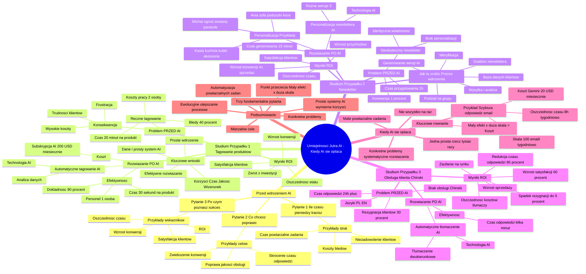

# Lekcje wideo - 5. Kiedy AI się opłaca - mierzenie sukcesu

# 💡 Diagram

___

# 🗒️ Notatka

# Umiejętności Jutra AI: Kiedy wdrożenie AI się opłaca - Notatki i Podsumowanie

## Wprowadzenie

Prezentacja "Umiejętności Jutra AI", zorganizowana przez Google i SGH, koncentruje się na kluczowym pytaniu: **kiedy wdrożenie sztucznej inteligencji (AI) rzeczywiście staje się opłacalne?** Wojciech Strzałkowski z GOG.com przedstawia praktyczne podejście do mierzenia sukcesu i rentowności inwestycji w AI. Podkreśla, że AI, mimo swojej mocy, nie stanowi uniwersalnego rozwiązania dla każdego problemu.  Kluczowe jest strategiczne podejście i skupienie się na konkretnych celach.

## Kluczowe Pytania Przed Wdrożeniem AI

Przed podjęciem decyzji o wdrożeniu AI, należy odpowiedzieć na trzy fundamentalne pytania. Pomogą one zaplanować projekt i ocenić jego potencjalny sukces:

- **Ile czasu 🕰️ / pieniędzy 💰 obecnie tracisz?**
    - Zrozumienie obecnych strat jest kluczowe dla oceny, czy inwestycja w AI przyniesie zwrot.
    - Przykłady strat:
        - Czas poświęcany na powtarzalne zadania.
        - Koszty wynikające z błędów w procesach.
        - Straty spowodowane niezadowoleniem klientów (np. powolna obsługa).

- **Co konkretnie chcesz poprawić?**
    - AI nie jest magicznym rozwiązaniem na wszystkie problemy. Skoncentruj się na **jednym lub kilku precyzyjnie określonych celach**.
    - Przykłady celów:
        - Skrócenie czasu odpowiedzi na zapytania klientów.
        - Poprawa jakości obsługi klienta.
        - Zwiększenie konwersji w kampaniach marketingowych.

- **Po czym poznasz, że się udało?**
    - Ustal **mierzalne wskaźniki sukcesu** (KPIs) przed wdrożeniem. Bez nich obiektywna ocena efektów będzie niemożliwa.
    - Przykłady wskaźników:
        - Wskaźniki finansowe (ROI).
        - Oszczędność czasu pracy (godziny tygodniowo).
        - Wzrost konwersji.
        - Poprawa satysfakcji klientów.

## Studium Przypadku 1: Automatyczne Tagowanie Produktów w Sklepie Internetowym

### Problem (PRZED AI)

- Sklep internetowy z szerokim asortymentem (ubrania, akcesoria, dodatki do domu).
- Duży ruch i liczba zamówień, ale **problem z ręcznym tagowaniem produktów**.
- **Ręczne tagowanie:**
    - Zajmowało **20 minut na produkt**.
    - Wysoki poziom **błędów (40% produktów niepoprawnie otagowanych)**.
    - **Dwie osoby** na pełen etat zajmowały się wyłącznie tagowaniem.
- **Konsekwencje:**
    - Klienci mieli trudności ze znalezieniem produktów.
    - Frustracja klientów i opuszczanie sklepu bez dokonania zakupu.
    - Wysokie koszty pracy i błędów.

### Rozwiązanie (PO AI)

- Wdrożenie systemu AI do **automatycznego tagowania** produktów.
- AI analizuje zdjęcia, opisy i specyfikacje produktów.
- **Automatyczne tagowanie:**
    - Czas tagowania skrócony do **30 sekund na produkt**.
    - **Dokładność wzrosła do 90%**.
    - **Jedna osoba** potrzebna do weryfikacji tagów generowanych przez AI.
- **Koszt:** Subskrypcja narzędzia AI - **200 USD miesięcznie**.

### Wyniki (ROI)

- **Oszczędność jednego etatu**.
- **Poprawa satysfakcji klientów** dzięki usprawnionej nawigacji.
- **Wzrost konwersji** w sklepie.
- **Szybki zwrot z inwestycji**.

### Kluczowe wnioski z przypadku 1

- AI szybko i efektywnie rozwiązuje **realny problem biznesowy**.
- Wdrożenie AI nie musi być skomplikowane.
- Kluczowe są **dane, zrozumienie problemu i prosty system AI**.
- **Korzyści:** oszczędność czasu, poprawa jakości obsługi, wizerunek nowoczesnej firmy.

## Studium Przypadku 2: Personalizacja Newslettera w Sklepie Meblowym

### Problem (PRZED AI)

- Sklep meblowy online.
- **Nieskuteczny newsletter** - wszyscy klienci otrzymywali identyczną wiadomość.
- **Brak personalizacji** - newsletter nie uwzględniał historii zakupów klientów.
- **Czas przygotowania newslettera: 1 godzina tygodniowo**.
- **Konwersja na zakup: 1%**.

### Rozwiązanie (PO AI)

- Wdrożenie AI do **personalizacji newslettera**.
- AI generuje **3 zróżnicowane wersje newslettera** w oparciu o historię zakupów klientów.
- **Personalizacja:**
    - Ania (kupiła sofę) - otrzymuje oferty poduszek i koców.
    - Michał (kupił zestaw ogrodowy) - otrzymuje promocje na parasole ogrodowe.
    - Kasia (interesuje się kuchnią) - otrzymuje ofertę kubków i akcesoriów kuchennych.
- **Czas generowania 3 wersji newslettera: 15 minut**.

### Wyniki (ROI)

- **Oszczędność czasu** na przygotowanie newslettera.
- **Konwersja na zakup wzrosła do 4%** (**4-krotny wzrost sprzedaży**).
- **Większe zadowolenie klientów** dzięki personalizowanym ofertom.
- **Znaczący wzrost przychodów**.

### Jak to zrobić? (Proces wdrożenia personalizacji newslettera)

1. **Przygotowanie bazy danych klientów:** Analiza historii zakupów, kategorii zainteresowań, dat ostatnich zakupów.
2. **Podział klientów na grupy** o zbliżonych zainteresowaniach.
3. **Stworzenie prostego szablonu newslettera:** Powitanie, nawiązanie do zakupów, rekomendacje produktów, wezwanie do działania.
4. **Wygenerowanie zróżnicowanych wersji newslettera przez AI:** Dla każdej grupy zainteresowań (np. salon, ogród, kuchnia).
5. **Weryfikacja i dopracowanie szczegółów** wygenerowanych wersji.
6. **Wysyłka newslettera i obserwacja wyników:** Analiza skuteczności poszczególnych wersji, ciągłe uczenie się i dostosowywanie komunikacji.

## Studium Przypadku 3: Obsługa Klienta po Chińsku

### Problem (PRZED AI)

- Sklep internetowy z klientami z Chin.
- **Brak obsługi klienta w języku chińskim**.
- Obsługa dostępna tylko w języku polskim i angielskim.
- **Klienci rezygnowali z kontaktu (30%)**.
- **Długi czas odpowiedzi (ponad 24h)** - ręczne tłumaczenie zapytań.

### Rozwiązanie (PO AI)

- Wdrożenie systemu AI do **automatycznego tłumaczenia obsługi klienta**.
- AI **tłumaczy pytania z chińskiego na angielski**, **generuje odpowiedź po angielsku**, a następnie **tłumaczy odpowiedź na chiński**.
- **Czas odpowiedzi skrócony do kilku minut**.

### Wyniki (ROI)

- **Spadek liczby klientów rezygnujących z kontaktu (z 30% do 5%)**.
- **Wzrost satysfakcji klientów o 60%**.
- **Redukcja czasu odpowiedzi o 95%**.
- **Oszczędność na kosztach tłumaczy**.
- **Budowanie zaufania na nowym rynku**.
- **Wzrost sprzedaży**.

## Kiedy AI Najbardziej Się Opłaca?

- **Kluczowe równanie: Mały efekt x duża skala > Koszt wdrożenia.**
- Szukaj **małych, powtarzalnych zadań**, które AI może zautomatyzować na dużą skalę.
- Przykład:
    - **5 minut szybsza odpowiedź na e-mail klienta**.
    - **x 100 e-maili tygodniowo = 8 godzin tygodniowo oszczędności**.
    - **Koszt: subskrypcja Gemini (20 USD miesięcznie)**.
- **Nie szukaj AI, która zrobi wszystko.**
- **Szukaj AI, która zrobi jedną prostą rzecz tysiąc razy.**
- Skup się na **konkretnych problemach** i **systematycznym rozwiązywaniu ich za pomocą AI**.

## Podsumowanie

Wdrożenie sztucznej inteligencji staje się opłacalne, gdy koncentrujemy się na **konkretnych, mierzalnych problemach** i wykorzystujemy AI do **automatyzacji powtarzalnych zadań na dużą skalę**. Kluczowe jest zadanie sobie **trzech fundamentalnych pytań** przed wdrożeniem, aby jasno określić cele i wskaźniki sukcesu. Przedstawione studia przypadków ilustrują, jak nawet **proste systemy AI** mogą przynosić **wymierne korzyści**, takie jak oszczędność czasu, redukcja kosztów, wzrost sprzedaży i poprawa satysfakcji klientów. Istotą opłacalnego wdrożenia AI jest znalezienie **punktu przecięcia małego efektu z dużą skalą**, gdzie nawet niewielka poprawa, zastosowana masowo, generuje znaczące oszczędności i zyski, przewyższając koszt implementacji AI. Nie chodzi o rewolucję, lecz o **ewolucyjne ulepszanie procesów** poprzez inteligentną automatyzację.

___

# 🔉 Transcript
File: Lekcje wideo - 5. Kiedy AI się opłaca - mierzenie sukcesu.mp4 
[00:00:01] (Na ekranie pojawia się tekst "Umiejętności Jutra AI". Poniżej widnieją loga organizatorów: Google i SGH.)
[00:00:05] Zaczniemy od najważniejszego pytania. Kiedy wdrożenie sztucznej inteligencji rzeczywiście się opłaca.
[00:00:10] (Na ekranie po prawej stronie widnieje tekst "Kiedy AI się opłaca - mierzenie sukcesu".)
[00:00:10] (Na dole ekranu pojawia się imię i nazwisko prezentera: Wojciech Strzałkowski, Head of Product + GOG.com.)
[00:00:11] AI to potężne narzędzie, ale nie każdy projekt jest wart realizacji. Decydując się na wdrożenie, musimy odpowiedzieć sobie na kilka kluczowych pytań.
[00:00:20] Odpowiedzi na nie nie tylko ułatwią podjęcie decyzji, ale także pozwolą na lepsze zaplanowanie projektu.
[00:00:26] Wyobraźmy to sobie jako trzy etapy: rozpoznanie problemu,
[00:00:30] identyfikacja celu oraz mierzenie efektów.
[00:00:33] Zanim przejdziemy do konkretnych przypadków, zadajmy sobie właśnie te pytania.
[00:00:38] (Na ekranie po prawej pojawia się tekst "Przed wdrożeniem AI zadaj sobie pytania". Poniżej w białym prostokącie widnieje pytanie: "Ile czasu / pieniędzy obecnie tracisz?".)
[00:00:38] Pierwsze pytanie: ile czasu lub pieniędzy tracimy obecnie? Bez określenia, jakie mamy obecnie straty, trudno będzie ocenić, czy wdrożenie się opłaci.
[00:00:48] Możemy na przykład zadać sobie pytania: jak dużo czasu zajmują powtarzalne zadania? Jakie są koszty błędów w naszych procesach? A może ile tracimy na niezadowolonych klientach, którzy rezygnują z naszych usług, bo obsługa nie działa wystarczająco szybko?
[00:01:04] (Na ekranie pojawia się kolejny biały prostokąt z pytaniem: "Co konkretnie chcesz poprawić?")
[00:01:04] Drugie pytanie to: co dokładnie chcemy na poprawić? AI nie rozwiązuje wszystkiego naraz.
[00:01:11] Dobrze zaplanowane wdrożenie koncentruje się na jednym lub kilku precyzyjnie określonych celach. Na przykład, czy chcemy skrócić czas odpowiedzi klientom, czy może zależy nam na poprawie jakości obsługi? A może celem jest zwiększenie konwersji w kampaniach marketingowych?
[00:01:28] (Na ekranie pojawia się kolejny biały prostokąt z pytaniem: "Po czym poznasz, że się udało?")
[00:01:28] I wreszcie pytanie trzecie: po czym poznamy, że się udało? To niezwykle ważne, bo bez wskaźników sukcesu nie będziemy wiedzieć, czy nasze wdrożenie przyniosło oczekiwane rezultaty.
[00:01:39] Mogą to być wskaźniki finansowe, takie jak ROI, oszczędność czasu pracy w godzinach tygodniowo, wzrost konwersji czy poprawa satysfakcji klientów. Ważne jest, by były one mierzalne.
[00:01:50] (Ekran zmienia się. Po lewej stronie w niebieskim prostokącie znajduje się tekst: "PRZED: 20 minut na produkt; 40% błędów w kategoryzacji; 2 osoby zajmujące się tylko tym". Po prawej stronie znajdują się prostokąty z tekstem: "Shoulder: Cold-Shoulder; Category: Tops; Neck: Halter Neck; Sleeve: Long Sleeve; Sleeve Styling: Puffed; Color: Red". Na górze ekranu widnieje napis: "Case: Automatyczne tagowanie".)
[00:01:50] Wyobraźmy sobie sklep internetowy, który oferuje szeroki asortyment od ubrań, przez akcesoria, aż po dodatki do domu.
[00:01:57] Na pierwszy rzut oka wszystko działa świetnie. Duża liczba produktów, stały ruch na stronie, zamówienia płyną.
[00:02:04] Ale w rzeczywistości zespół operacyjny zmaga się z problemem, który wymaga nie tylko czasu, ale też powoduje błędy wpływające na doświadczenie klientów.
[00:02:12] Mówię o procesie przypisywania tagów do produktów, który ma kluczowe znaczenie w każdym e-commerce.
[00:02:18] Każdy produkt w sklepie musi być dokładnie opisany: kategorie, kolory, materiały, style, aby klienci mogli łatwo je znaleźć w wyszukiwarce.
[00:02:27] Wydaje się to proste. W praktyce jednak przy setkach nowych produktów każdego tygodnia ręczne przypisywanie tagów staje się koszmarem.
[00:02:36] Zespoły muszą poświęcać godziny na analizowanie każdego produktu, jego zdjęć i specyfikacji, aby przypisać odpowiednie tagi.
[00:02:43] W rezultacie średnio 20 minut zajmuje oznaczenie jednego produktu. Przy dużej liczbie produktów to tygodnie pracy. Co więcej, dochodzi do błędów.
[00:02:52] W natłoku zadań tagi często są przypisywane nieprawidłowo. Na przykład produkt o kroju oversized trafia do kategorii slim fit, albo czerwony sweter zostaje oznaczony jako bordowy.
[00:03:03] Wynik: klienci nie znajdują produktów, których szukają, co prowadzi do frustracji i opuszczenia sklepu bez zakupów.
[00:03:09] Z danych firmy wynika, że aż 40% produktów było niepoprawnie oznaczonych. Jakby tego było mało, dwie osoby w pełnym wymiarze czasu pracy były odpowiedzialne wyłącznie za tagowanie produktów. To ogromny koszt dla firmy zarówno w postaci czasu, jak i wynagrodzeń.
[00:03:23] (Na ekranie pojawia się pomarańczowy prostokąt z tekstem: "PO: 30 sekund na produkt; 90% poprawnych kategoryzacji; 1 osoba do weryfikacji; Koszt: $200 USD miesięcznie". Poniżej widnieje napis: "ROI: Oszczędność 1 etatu".)
[00:03:23] I wtedy firma postanowiła wprowadzić AI. Co się zmieniło? Zamiast ręcznego przypisywania tagów, wdrożono system oparty na sztucznej inteligencji, który analizuje zdjęcia, opisy i specyfikacje produktów, a następnie automatycznie przypisuje odpowiednie tagi.
[00:03:39] W praktyce wygląda to tak: AI przetwarza zdjęcie produktu i rozpoznaje kluczowe cechy, takie jak kolor, materiał, długość rękawa czy krój.
[00:03:47] Na przykład, w przypadku sukienki AI potrafi zidentyfikować, że jest to sukienka wieczorowa w kolorze czarnym, z dekoltem V i długością midi.
[00:03:56] Następnie system automatycznie przypisuje odpowiednie tagi.
[00:04:00] Co najważniejsze, cały proces trwa zaledwie 30 sekund na produkt w porównaniu do 20 minut wcześniej.
[00:04:06] Rezultaty: dokładność tagów wzrosła z 60 do 90%. Dzięki temu klienci łatwiej znajdują to, czego szukają, co bezpośrednio przekłada się na wyższą konwersję w sklepie.
[00:04:17] Zespół, który wcześniej pracował nad tagowaniem, teraz może skupić się na innych zadaniach, a całość pracy nad tagowaniem produktów ogranicza się do jednej osoby, która weryfikuje wyniki generowane przez AI.
[00:04:30] Warto wspomnieć o kosztach. Subskrypcja narzędzia AI, które umożliwia takie automatyczne tagowanie wynosi 200 dolarów miesięcznie. W zamian firma oszczędza czas na dwóch etatów, co przynosi natychmiastowy zwrot z inwestycji.
[00:04:42] Ale nie chodzi tylko o koszty. Dzięki poprawie jakości tagów, klienci są bardziej zadowoleni, a sprzedaż rośnie. To pokazuje, jak zastosowanie AI może rozwiązać realne biznesowe problemy w sposób szybki i efektywny.
[00:04:55] Ten przykład doskonale ilustruje, że AI nie musi być skomplikowane, aby przyniosło wymierne korzyści.
[00:05:00] Wdrożenie nie wymagało wielomiesięcznych przygotowań czy skomplikowanego kodowania. Wystarczyło odpowiednie dane, zrozumienie problemu i prosty system AI, który przejął powtarzalne zadania. Firma zyskała czas, poprawiła jakość swojej obsługi i zrobiła krok w stronę nowoczesności.
[00:05:15] Wszystko to za koszt niższy niż pensja jednego pracownika.
[00:05:18] To jest właśnie siła automatyzacji z wykorzystaniem sztucznej inteligencji. Zamiana żmudnej pracy na szybkie, precyzyjne i skalowalne rozwiązanie, które pozwalają firmom skupić się na tym, co naprawdę ważne: obsłudze klientów i rozwoju biznesu.
[00:05:31] (Ekran zmienia się. Po lewej stronie w niebieskim prostokącie znajduje się tekst: "PRZED: 1h na napisanie newslettera; Wszyscy dostawali to samo; Konwersja na zakup: 1%". Po prawej stronie znajduje się szablon newslettera z napisem "Hydrate Fully. Refill Easily. Our new sustainable and reusable 32oz rambler bottle keeps your drinks icy cold or piping hot. Crafted from eco-friendly materials, this bottle is perfect for all-day hydration on the go. Write with AI". Na górze ekranu widnieje napis: "Case: Sklep meblowy - newsletter".)
[00:05:31] Kolejny przykład: sklep meblowy, który działa głównie online. Codziennie mierzy się on z klasycznym problemem w marketingu: jak przyciągnąć klientów do powrotu i zakupu kolejnych produktów?
[00:05:42] I głównym narzędziem komunikacji z klientami jest newsletter. I choć regularnie go wysyłają, efekty są mizerne.
[00:05:49] Dlaczego? Każdy klient dostaje tę samą wiadomość, bez względu na to, czy ostatnio kupił stół jadalniany, sofę czy dekoracje do salonu. Wszyscy otrzymują tę samą ofertę.
[00:06:00] Właściciele sklepu spędzają godzinę tygodniowo na przygotowywaniu treści, które nikogo szczególnie nie interesują.
[00:06:07] Konwersja na zakup wynosi 1%. Innymi słowy, jeden na 100 odbiorców otwiera newsletter i faktycznie coś kupuje.
[00:06:15] Frustracja jest ogromna, bo przecież wysyłają te maile, ale nic się nie dzieje.
[00:06:20] (Na ekranie pojawia się pomarańczowy prostokąt z tekstem: "PO: 15 minut na wygenerowanie 3 wersji; Personalizacja wg historii zakupów; Konwersja na zakup: 4%". Poniżej widnieje napis: "ROI: Oszczędność czasu i 4x więcej sprzedaży".)
[00:06:20] I wtedy postanawiają wypróbować AI. Zamiast jednego uniwersalnego maila, AI generuje trzy różne wersje newslettera. Jak to działa?
[00:06:29] Sklep wykorzystuje dane o historii zakupów swoich klientów. Wiemy na przykład, że Ania kupiła sofę, Michał zestaw ogrodowy, a Kasia interesuje się dodatkami do kuchni.
[00:06:39] AI analizuje te dane i przygotowuje wiadomości dopasowane do ich preferencji. Ania otrzymuje propozycje poduszek i koców pasujących do nowej sofy, Michał widzi promocje na parasole ogrodowe, a Kasia dostaje ofertę eleganckich kubków i akcesoriów do gotowania.
[00:06:53] I co się dzieje? Przygotowanie tej wiadomości zajmuje teraz 15 minut, znacznie mniej niż wcześniej, ale co najważniejsze, konwersja rośnie do 4%.
[00:07:02] To czterokrotny wzrost sprzedaży przy tej samej liczbie wysłanych maili.
[00:07:06] Efekt jest oszałamiający. Sklep nie tylko oszczędza czas, ale także zauważa znaczący wzrost przychodów. Klienci są zadowoleni, bo otrzymują oferty, które naprawdę ich interesują, a sklep widzi, że personalizacja opłaca się nie tylko w teorii.
[00:07:20] (Ekran zmienia się. Prezentacja pokazuje "Jak to zrobić?". W czterech punktach opisany proces wdrożenia.)
[00:07:20] Świetnie, ale jak to działa? Jak takie wdrożenie mogłoby wyglądać w mojej firmie?
[00:07:25] Pozwólcie, że wyjaśnię krok po kroku.
[00:07:27] (Na ekranie pojawia się tekst "Jak to zrobić?". Poniżej w czterech punktach opisany proces wdrożenia AI.)
[00:07:27] Pierwszym krokiem jest przygotowanie bazy danych klientów. To oznacza analizę ich historii zakupów. Na przykład, które produkty kupowali, jakie kategorie ich interesują, kiedy dokonali ostatniego zakupu.
[00:07:39] Na tej podstawie możemy podzielić klientów na grupy o podobnych zainteresowaniach. To trochę jak organizowanie imprezy. Najpierw musimy zrozumieć, kto lubi jazz, a kto techno, żeby każdy dobrze się bawił.
[00:07:50] Następnie tworzymy prosty szablon newslettera. To szablon, który AI będzie modyfikować w zależności od grupy odbiorców.
[00:07:56] Powinien on zawierać powitanie, nawiązanie do poprzednich zakupów, rekomendacje kilku produktów oraz jasne wezwanie do działania, na przykład sprawdź naszą ofertę.
[00:08:06] Ale kluczem jest tu personalizacja. Klient musi poczuć, że ten mail został napisany właśnie dla niego.
[00:08:13] Kiedy mamy już dane i szablon, prosimy AI o wygenerowanie różnych wersji newslettera.
[00:08:19] Możemy na przykład powiedzieć: stwórz trzy warianty dla klientów zainteresowanych salonem, ogrodem i kuchnią.
[00:08:25] AI szybko wygeneruje te wersje bazując na dostarczonych danych. Naszym zadaniem jest jedynie sprawdzenie, czy wszystko wygląda dobrze i dopracowanie szczegółów.
[00:08:34] Na końcu wysyłamy newsletter i obserwujemy wyniki. Co było najbardziej skuteczne? Jakie wersje przyciągnęły największą uwagę? To nie jest jednorazowa akcja.
[00:08:43] Za każdym razem uczymy się czegoś nowego, co pozwala jeszcze bardziej dopasować komunikację do klientów.
[00:08:49] Prosty proces, a rezultaty mogą być spektakularne.
[00:08:54] (Ekran zmienia się. Po lewej stronie w niebieskim prostokącie znajduje się tekst: "PRZED: Brak chińskojęzycznej obsługi; Przekierowywanie do angielskiego supportu; 30% klientów rezygnowało z kontaktu; Czas odpowiedzi: 24h+". Po prawej stronie znajduje się e-mail napisany w języku chińskim. Na górze ekranu widnieje napis: "Case: Obsługa klienta po chińsku".)
[00:08:55] Kolejny przykład pokazuje, jak AI może pomóc firmom przekroczyć bariery językowe.
[00:09:00] Wyobraźcie sobie sklep internetowy, który zaczyna przyciągać klientów z Chin. Problem w tym, że obsługa klienta działa tylko po polsku i angielsku. Co się dzieje?
[00:09:09] Klienci próbują pisać po angielsku, co dla wielu z nich nie jest wygodne, a czasem wręcz niemożliwe. Przez to 30% zapytań w ogóle nie jest realizowanych, a klienci rezygnują z zakupu.
[00:09:19] Dodatkowo czas odpowiedzi wynosi ponad 24 godziny, bo zapytania trzeba tłumaczyć ręcznie. Tutaj wkracza AI.
[00:09:27] (Na ekranie pojawia się pomarańczowy prostokąt z tekstem: "PO: 15 sekund na wygenerowanie odpowiedzi po węgiersku; AI tłumaczy pytanie na angielski, generuje odpowiedź i tłumaczy na chiński; Tylko 5% klientów potrzebuje dodatkowej pomocy; Czas odpowiedzi: kilka minut". Poniżej widnieje napis: "ROI: Oszczędność na tłumaczach; Wzrost satysfakcji klientów o 60%; Redukcja czasu odpowiedzi o 95%")
[00:09:27] Firma wdraża system, który automatycznie tłumaczy pytania od klientów z chińskiego na angielski, generuje odpowiedzi i tłumaczy je z powrotem na chiński.
[00:09:37] Dzięki temu cały proces trwa kilka minut, a klient otrzymuje odpowiedź w swoim języku. Efekt: liczba klientów, którzy rezygnują z kontaktu spada z 30 do 5%.
[00:09:46] Satysfakcja klientów wzrasta o 60%, a czas odpowiedzi skraca się z jednego dnia do kilku minut. Firma nie tylko zwiększa sprzedaż, ale także buduje zaufanie na nowym rynku.
[00:09:57] Koszty wdrożenia znikome w porównaniu do korzyści. To pokazuje, jak AI może otwierać nowe możliwości, których wcześniej nawet nie braliśmy pod uwagę.
[01:00:08] (Ekran zmienia się. Widnieje tekst: "Kiedy AI najbardziej się opłaca? Mały efekt x duża skala > Koszt wdrożenia. 5 minut szybsza odpowiedź na maila od klienta x 100 maili tygodniowo = 8 godzin tygodniowo oszczędności. Koszt: subskrypcja Gemini ($20 miesięcznie). Nie szukaj AI która zrobi wszystko. Szukaj AI która zrobi jedną prostą rzecz tysiąc razy".)
[01:00:08] Na koniec musimy odpowiedzieć na pytanie, które spina te wszystkie przykłady: kiedy AI naprawdę się opłaca?
[01:00:16] Klucz tkwi w prostym równaniu: mały efekt, pomnożony przez dużą skalę, musi przewyższać koszt wdrożenia.
[01:00:24] Wyobraźcie sobie sytuację, w której odpowiedź na maila klienta trwa 5 minut krócej dzięki AI. To niewiele, prawda?
[01:00:31] Ale jeśli odpowiadacie na 100 maili tygodniowo, oszczędzacie w ten sposób 500 minut, czyli ponad 8 godzin pracy.
[01:00:39] A co, jeśli ta oszczędność kosztuje was zaledwie 20 dolarów miesięcznie za subskrypcję?
[01:00:45] To się po prostu opłaca. Dlatego nie szukajmy AI, który zrobi wszystko. Szukajmy takich narzędzi, które zrobią jedną prostą rzecz, ale 1000 razy lepiej.
[01:00:55] Skupmy się na konkretnych problemach i systematycznie je rozwiązujmy. To podejście, które pozwala każdej firmie, niezależnie od jej wielkości, wykorzystać potencjał sztucznej inteligencji w praktyczny i opłacalny sposób.
[01:01:08] (Na ekranie pojawia się logo Umiejętności Jutra AI.)

___
# 🏷️ Tags
#Umiejętności_Jutra_AI #AI #sztuczna_inteligencja #wdrożenie_AI #opłacalność_AI #rentowność_AI #Google #SGH #Wojciech_Strzałkowski #GOG.com #strategiczne_podejście #cele #kluczowe_pytania #planowanie_projektu #ocena_sukcesu #czas #pieniądze #straty #powtarzalne_zadania #koszty #błędy #niezadowolenie_klientów #obsługa_klienta #poprawa #konwersja #kampanie_marketingowe #mierzalne_wskaźniki_sukcesu #KPIs #wskaźniki_finansowe #ROI #oszczędność_czasu_pracy #wzrost_konwersji #poprawa_satysfakcji_klientów #studium_przypadku #automatyczne_tagowanie #sklep_internetowy #asortyment #ubrania #akcesoria #dodatki_do_domu #ruch #zamówienia #ręczne_tagowanie #dokładność #nawigacja #zwrot_z_inwestycji #realny_problem_biznesowy #dane #system_AI #nowoczesna_firma #personalizacja_newslettera #sklep_meblowy #newsletter #historia_zakupów #wzrost_sprzedaży #baza_danych_klientów #kategorie_zainteresowań #szablon_newslettera #rekomendacje_produktów #wezwanie_do_działania #weryfikacja #dostosowywanie_komunikacji #obsługa_klienta_po_chińsku #język_chiński #automatyczne_tłumaczenie #budowanie_zaufania #nowy_rynek #mały_efekt_x_duża_skala #koszt_wdrożenia #automatyzacja #konkretne_problemy #systematyczne_rozwiązywanie #ewolucyjne_ulepszanie_procesów #inteligentna_automatyzacja #mierzenie_sukcesu #Head_of_Product #e-commerce #kategoryzacja #subskrypcja #Gemini
