# Lekcje wideo - 5. Kiedy AI się opłaca - mierzenie sukcesu

# 💡 Diagram

```mermaid
mindmap
  root((Kiedy AI sie Oplaca))
    Wprowadzenie
      Umiejetnosci Jutra
      Wojciech Strzalkowski GOGcom
      Mierzenie Sukcesu AI
    Kluczowe Pytania Przed Wdrozeniem AI
      Ile Czasu Pieniedzy Tracisz Obecnie
        Powtarzalne Zadania
        Bledy w Procesach
        Niezadowolenie Klientow
      Co Konkretnie Chcesz Poprawic
        Skrocenie Czasu Odpowiedzi
        Poprawa Jakosci Obslugi
        Zwiekszenie Konwersji
      Jak Zmierzysz Sukces Wdrozenia
        Mierzalne Wskazniki
        ROI
        Oszczednosc Czasu
        Wzrost Konwersji
        Satysfakcja Klientow
    Studium Przypadku 1 Automatyczne Tagowanie Produktow
      Problem PRZED AI
        Czasochlonne Tagowanie Reczne
          20 Minut na Produkt
        Bledy Kategoryzacji
          40 Procent Bledow
        Koszt Pracy
          2 Osoby
        Frustracja Klientow
      Rozwiazanie PO AI
        Automatyczne Tagowanie AI
        Analiza Zdjec Opisow Specyfikacji
        Kategorie Kolory Materialy Style
      Efekty PO AI
        30 Sekund na Produkt
        90 Procent Poprawnosc
        1 Osoba do Weryfikacji
        Koszt Subskrypcji 200 USD Miesiecznie
        ROI Oszczednosc 1 Etatu
      Korzysci
        Oszczednosc Czasu i Kosztow
        Dokladnosc Tagowania
        Lepsze Doswiadczenie Klienta
        Wzrost Konwersji
        Skupienie Zespolu na Strategii
    Studium Przypadku 2 Personalizacja Newslettera
      Problem PRZED AI
        Niska Skutecznosc Newslettera
          1 Procent Konwersja
        Uniwersalny Newsletter
        Czas Przygotowania 1h Tygodniowo
        Nieinteresujace Tresci
      Rozwiazanie PO AI
        Personalizacja AI
        3 Wersje Newslettera
        Personalizacja Historii Zakupow
        Grupowanie Klientow
      Efekty PO AI
        15 Minut na 3 Wersje
        Personalizacja Historii Zakupow
        4 Procent Konwersja
        ROI Oszczednosc Czasu 4x Sprzedaz
      Korzysci
        Wzrost Przychodow
        Oszczednosc Czasu
        Satysfakcja Klientow
        Skuteczna Strategia Marketingowa
      Jak to Zrobic
        Baza Danych Klientow
          Historia Zakupow
          Kategorie Produktow
          Daty Zakupow
        Szablon Newslettera
          Temat Personalizowany
          Tresc Personalizowana
          Rekomendacje Produktow
          Call to Action
        Generowanie Wariantow AI
          Glowny Temat
          3 Wersje dla Grup
          Sprawdzenie i Zatwierdzenie
        Instrukcje dla AI Przyklad
    Studium Przypadku 3 AI dla Wielojęzycznej Obslugi Klienta
      Problem PRZED AI
        Rynek Chinski
        Obsluga PL EN
        Bariera Jezykowa
        30 Procent Zapytan Bez Odpowiedzi
        Czas Odpowiedzi Ponad 24h
      Rozwiazanie PO AI
        Automatyczne Tlumaczenie AI
        Chinski Angielski
      Efekty PO AI
        Odpowiedz w Jezyku Klienta Chinski
        Czas Odpowiedzi Kilka Minut
        Rezygnacja Klientow 5 Procent
        Satysfakcja Klientow Plus 60 Procent
      Korzysci
        Wzrost Sprzedazy Rynek Chinski
        Zaufanie Klientow
        Szybka Obsluga
        Niskie Koszty Wdrozenia
        Rozwoj Miedzynarodowy
    Kiedy AI Najbardziej Sie Oplaca
      Maly Efekt x Duza Skala Wiekszy Koszt Wdrozenia
      Przyklad 5 Minut x 100 Maili 8h Oszczednosci
      Koszt Subskrypcji Gemini 20 USD
      Nie Wszystko na Raz
      Jedna Prosta Rzecz Tysiac Razy
      Konkretne Problemy
      Praktyczne i Oplacalne Podejscie
    Podsumowanie
      Planowanie i Konkretne Problemy
      Mierzalne Cele i Wskazniki
      Automatyczne Tagowanie Newsletter Obsluga Klienta Przykłady
      Wymierne Korzysci Czas Koszty Sprzedaz Satysfakcja
      Automatyzacja Powtarzalnych Zadan w Duzej Skali
```

___

# 🗒️ Notatka

# Notatki i Podsumowanie: Kiedy AI się Opłaca - Mierzenie Sukcesu

## Wprowadzenie

Prezentacja "Umiejętności Jutra" omawia kluczowe aspekty wdrażania sztucznej inteligencji (`AI`) w biznesie, koncentrując się na opłacalności inwestycji w `AI`. Wojciech Strzałkowski z GOG.com przedstawia praktyczne podejście do mierzenia sukcesu projektów `AI`, podkreślając znaczenie identyfikacji problemu, celu i mierzalnych efektów. Prezentacja ilustruje te koncepcje konkretnymi przykładami wdrożeń `AI` w różnych branżach.

## Kluczowe Pytania Przed Wdrożeniem AI

Przed podjęciem decyzji o wdrożeniu `AI`, należy odpowiedzieć na trzy kluczowe pytania, które pomogą zaplanować projekt i ocenić jego opłacalność:

- **Ile czasu lub pieniędzy tracisz obecnie?**
    - Określenie obecnych strat jest kluczowe dla oceny opłacalności wdrożenia `AI`.
    - Przykłady strat:
        - Czas poświęcony na **powtarzalne zadania**.
        - Koszty **błędów w procesach**.
        - Straty wynikające z **niezadowolenia klientów** (np. zbyt wolna obsługa).

- **Co konkretnie chcesz poprawić?**
    - `AI` nie jest uniwersalnym rozwiązaniem. Skuteczne wdrożenie koncentruje się na **jednym lub kilku precyzyjnie określonych celach**.
    - Przykłady celów:
        - **Skrócenie czasu odpowiedzi** klientom.
        - **Poprawa jakości obsługi**.
        - **Zwiększenie konwersji** w kampaniach marketingowych.

- **Jak zmierzysz sukces wdrożenia?**
    - Ustalenie **mierzalnych wskaźników sukcesu** jest niezbędne do oceny efektów wdrożenia.
    - Wskaźniki powinny być **mierzalne**.
    - Przykłady wskaźników:
        - **ROI** (Return on Investment - Zwrot z Inwestycji).
        - **Oszczędność czasu pracy** (w godzinach tygodniowo).
        - **Wzrost konwersji**.
        - **Poprawa satysfakcji klientów**.

## Studium Przypadku 1: Automatyczne Tagowanie Produktów w Sklepie Internetowym

### Problem (PRZED AI)

- Sklep internetowy z szerokim asortymentem (ubrania, akcesoria, dodatki do domu).
- Ręczne tagowanie produktów jest **czasochłonne i generuje błędy**.
    - **20 minut** na oznaczenie jednego produktu.
    - **40% błędów** w kategoryzacji.
    - **Dwie osoby** na pełnym etacie zajmują się wyłącznie tagowaniem.
- Konsekwencje:
    - Klienci **nie znajdują szukanych produktów**.
    - **Frustracja klientów** i opuszczanie sklepu bez zakupu.
    - **Wysokie koszty** pracy i wynagrodzeń.

### Rozwiązanie (PO AI)

- Wdrożenie systemu `AI` do **automatycznego tagowania** produktów.
- `AI` analizuje **zdjęcia, opisy i specyfikacje** produktów.
- Automatyczne przypisywanie **kategorii, kolorów, materiałów, stylów**.

### Efekty (PO AI)

- **30 sekund** na produkt (zamiast 20 minut).
- **90% poprawnych kategoryzacji** (wzrost z 60%).
- **Jedna osoba** do weryfikacji wyników `AI` (zamiast dwóch).
- Koszt subskrypcji narzędzia `AI`: **200 USD miesięcznie**.
- **ROI: Oszczędność kosztów odpowiadająca jednemu etatowi**.

### Korzyści

- **Oszczędność czasu i kosztów** (wynagrodzenia).
- **Poprawa dokładności tagowania**.
- **Lepsze doświadczenie klienta** - łatwiejsze wyszukiwanie produktów.
- **Wzrost konwersji** i sprzedaży.
- **Skupienie zespołu** na bardziej strategicznych zadaniach.

## Studium Przypadku 2: Personalizacja Newslettera w Sklepie Meblowym

### Problem (PRZED AI)

- Sklep meblowy online z newsletterem jako głównym narzędziem komunikacji.
- **Niska skuteczność newslettera** - **konwersja na zakup tylko 1%**.
- **Uniwersalny newsletter** dla wszystkich klientów - **brak personalizacji**.
- **Jedna godzina tygodniowo** na przygotowanie treści newslettera.
- Treści **nieinteresujące** dla większości odbiorców.

### Rozwiązanie (PO AI)

- Wdrożenie `AI` do **personalizacji newslettera**.
- Generowanie **trzech różnych wersji newslettera** zamiast jednego uniwersalnego.
- Personalizacja na podstawie **historii zakupów klientów**.
    - Grupowanie klientów według **zainteresowań produktowych**.

### Efekty (PO AI)

- **15 minut** na wygenerowanie 3 wersji newslettera (oszczędność czasu).
- **Personalizacja** newslettera w oparciu o historię zakupów.
- **Konwersja na zakup: 4%** (czterokrotny wzrost).
- **ROI: Oszczędność czasu i 4-krotny wzrost sprzedaży**.

### Korzyści

- **Znaczący wzrost przychodów** (4-krotnie większa sprzedaż).
- **Oszczędność czasu** na przygotowanie newslettera.
- **Wyższa satysfakcja klientów** - otrzymują oferty dopasowane do ich zainteresowań.
- **Personalizacja** jako skuteczna strategia marketingowa.

### Jak to Zrobić? - Kroki Wdrożenia Personalizacji Newslettera

1.  **Przygotuj bazę danych klientów:**
    - Pogrupuj klientów według **historii zakupów**.
    - Oznacz **kategorie produktów**, które ich interesują.
    - Zbierz **daty ostatnich zakupów**.
2.  **Stwórz szablon newslettera dla `AI`:**
    - **Temat:** Kategoria produktu specjalnie dla Ciebie!
    - **Treść:**
        - **Spersonalizowane** powitanie.
        - Nawiązanie do **poprzednich zakupów**.
        - **2-3 rekomendacje produktów**.
        - **Call to action** (zachęta do zakupu).
3.  **Wygeneruj warianty z `AI`:**
    - Przygotuj **jeden główny temat** newslettera.
    - Poproś `AI` o **3 różne wersje** dostosowane do grup klientów.
    - **Sprawdź i zatwierdź** wygenerowane treści.
4.  **Przykładowe instrukcje dla `AI`:**
    - "Stwórz newsletter dla klienta, który ostatnio kupił sofę. Zaproponuj pasujące dodatki i meble uzupełniające, używając przyjaznego tonu. Newsletter ma być krótki i konkretny, z jednym głównym Call to action."

## Studium Przypadku 3: `AI` dla Wielojęzycznej Obsługi Klienta

### Problem (PRZED AI)

- Sklep internetowy rozszerza działalność na rynek chiński.
- **Obsługa klienta tylko po polsku i angielsku**.
- **Bariera językowa** dla klientów z Chin.
- **30% zapytań pozostaje bez odpowiedzi** (klienci rezygnują z kontaktu).
- **Czas odpowiedzi przekracza 24 godziny** (ręczne tłumaczenie zapytań).

### Rozwiązanie (PO AI)

- Wdrożenie systemu `AI` do **automatycznego tłumaczenia** zapytań i odpowiedzi.
- Tłumaczenie z **chińskiego na angielski** i z **angielskiego na chiński**.

### Efekty (PO AI)

- Odpowiedź dla klienta w **jego języku** (chińskim).
- Czas odpowiedzi: **kilka minut** (zamiast 24 godzin).
- Liczba klientów rezygnujących z kontaktu spadła z **30% do 5%**.
- **Satysfakcja klientów wzrosła o 60%**.

### Korzyści

- **Zwiększenie sprzedaży** na nowym rynku (chińskim).
- **Budowanie zaufania** wśród klientów.
- **Szybka i efektywna obsługa klienta** w wielu językach.
- **Niskie koszty wdrożenia** w porównaniu do korzyści.
- **Otwarcie nowych możliwości** rozwoju międzynarodowego.

## Kiedy AI Najbardziej Się Opłaca?

- **Niewielki efekt w dużej skali > Koszt wdrożenia.**
- Kluczowe jest znalezienie zastosowań `AI`, gdzie **nawet mała poprawa efektywności, ale w dużej skali, przynosi znaczące korzyści**.
- Przykład: **5 minut szybsza odpowiedź na maila x 100 maili tygodniowo = 8 godzin oszczędności tygodniowo**.
- Koszt subskrypcji narzędzia `AI` (np. Gemini): **20 USD miesięcznie** (przykładowo).
- **Nie szukaj `AI`, które zrobi wszystko.**
- **Szukaj `AI`, które zrobi jedną prostą rzecz tysiąc razy.**
- Skupienie się na **konkretnych problemach** i ich systematyczne rozwiązywanie.
- Podejście **praktyczne i opłacalne** dla każdej firmy, niezależnie od wielkości.

## Podsumowanie

Wdrożenie `AI` może być bardzo opłacalne, jeśli jest dobrze zaplanowane i skoncentrowane na rozwiązywaniu konkretnych problemów biznesowych. Kluczowe jest zdefiniowanie mierzalnych celów i wskaźników sukcesu przed wdrożeniem. Przykłady automatycznego tagowania, personalizacji newslettera i wielojęzycznej obsługi klienta pokazują, jak `AI` może przynosić wymierne korzyści w różnych obszarach działalności firmy, oszczędzając czas, redukując koszty, zwiększając sprzedaż i poprawiając satysfakcję klientów. Najbardziej opłacalne są wdrożenia `AI` skupiające się na automatyzacji powtarzalnych zadań w dużej skali, nawet jeśli pojedynczy efekt jest niewielki.

___

# 🔉 Transcript
File: Lekcje wideo - 5. Kiedy AI się opłaca - mierzenie sukcesu.mp4 
[00:00:01] Ekran: (Wyświetla się czarne tło z napisem „Umiejętności Jutra” i logo AI. W dolnej części ekranu znajdują się loga organizatora „Google” i partnera edukacyjnego „SGH”).
[00:00:05] Wojciech Strzałkowski: Zacznijmy od najważniejszego pytania, kiedy wdrożenie sztucznej inteligencji rzeczywiście się opłaca.
[00:00:10] Ekran: (Po prawej stronie ekranu wyświetla się napis „Kiedy AI się opłaca – mierzenie sukcesu”. Po lewej stronie widać Wojciecha Strzałkowskiego, Head of Product z GOG.com).
[00:00:10] Wojciech Strzałkowski: AI to potężne narzędzie, ale nie każdy projekt jest wart realizacji.
[00:00:16] Wojciech Strzałkowski: Decydując się na wdrożenie musimy odpowiedzieć sobie na kilka kluczowych pytań.
[00:00:20] Wojciech Strzałkowski: Odpowiedzi na nie nie tylko ułatwią podjęcie decyzji, ale także pozwolą na lepsze zaplanowanie projektu.
[00:00:26] Wojciech Strzałkowski: Wyobraźmy to sobie jako trzy etapy: rozpoznanie problemu,
[00:00:30] Wojciech Strzałkowski: identyfikacja celu oraz mierzenie efektów.
[00:00:33] Wojciech Strzałkowski: Zanim przejdziemy do konkretnych przypadków, zadajmy sobie właśnie te pytania.
[00:00:37] Ekran: (Na ekranie pojawia się napis „Przed wdrożeniem AI zadaj sobie pytania”. Po lewej stronie ekranu pojawia się napis: „Ile czasu/pieniędzy obecnie tracisz?”).
[00:00:38] Wojciech Strzałkowski: Pierwsze pytanie, ile czasu lub pieniędzy tracimy obecnie.
[00:00:43] Wojciech Strzałkowski: Bez określenia jakie mamy obecnie straty trudno będzie ocenić czy wdrożenie się opłaci.
[00:00:48] Wojciech Strzałkowski: Możemy na przykład zadać sobie pytania, jak dużo czasu zajmują powtarzalne zadania.
[00:00:52] Wojciech Strzałkowski: Jakie są koszty błędów w naszych procesach, a może ile tracimy na niezadowolonych klientach, którzy rezygnują z naszych usług, bo obsługa nie działa wystarczająco szybko.
[00:01:03] Ekran: (Po prawej stronie ekranu pojawia się napis: „Co konkretnie chcesz poprawić?”).
[00:01:05] Wojciech Strzałkowski: Drugie pytanie to, co dokładnie chcemy na poprawić.
[00:01:08] Wojciech Strzałkowski: AI nie rozwiązuje wszystkiego naraz.
[00:01:11] Wojciech Strzałkowski: Dobrze zaplanowane wdrożenie koncentruje się na jednym lub kilku precyzyjnie określonych celach.
[00:01:16] Wojciech Strzałkowski: Na przykład, czy chcemy skrócić czas odpowiedzi klientom, czy może zależy nam na poprawie jakości obsługi.
[00:01:23] Wojciech Strzałkowski: A może celem jest zwiększenie konwersji w kampaniach marketingowych.
[00:01:28] Ekran: (Po prawej stronie ekranu pojawia się napis: „Po czym poznasz, że się udało?”).
[00:01:29] Wojciech Strzałkowski: I wreszcie pytanie trzecie,
[00:01:30] Wojciech Strzałkowski: po czym poznamy, że się udało.
[00:01:32] Wojciech Strzałkowski: To niezwykle ważne, bo bez wskaźników sukcesu nie będziemy wiedzieć, czy nasze wdrożenie przyniosło oczekiwane rezultaty.
[00:01:39] Wojciech Strzałkowski: Mogą to być wskaźniki finansowe takie jak ROI, oszczędność czasu pracy w godzinach tygodniowo, wzrost konwersji, czy poprawa satysfakcji klientów.
[00:01:47] Wojciech Strzałkowski: Ważne jest by były one mierzalne.
[00:01:50] Ekran: (Na ekranie pojawia się napis „Case: Automatyczne tagowanie”. Po lewej stronie znajduje się niebieskie pole z napisem „PRZED” i punktami: „20 minut na produkt”, „40% błędów w kategoryzacji”, „2 osoby zajmujące się tylko tym”. Po prawej stronie znajdują się tagi: „Shoulder: Cold-Shoulder”, „Category: Tops”, „Neck: Halter Neck”, „Sleeve: Long Sleeve”, „Color: Red”, „Sleeve Styling: Puffed”).
[00:01:50] Wojciech Strzałkowski: Wyobraźmy sobie sklep internetowy, który oferuje szeroki asortyment, od ubrań, przez akcesoria, aż po dodatki do domu.
[00:01:57] Wojciech Strzałkowski: Na pierwszy rzut oka wszystko działa świetnie.
[00:02:00] Wojciech Strzałkowski: Duża liczba produktów, stały ruch na stronie, zamówienia płyną, ale w rzeczywistości zespół operacyjny zmaga się z problemem, który wymaga nie tylko czasu, ale też powoduje błędy wpływające na doświadczenia klientów.
[00:02:12] Wojciech Strzałkowski: Mówię o procesie przypisywania tagów do produktów, który ma kluczowe znaczenie w każdym e-commerce.
[00:02:18] Wojciech Strzałkowski: Każdy produkt w sklepie musi być dokładnie opisany, kategorie, kolory, materiały, style, aby klienci mogli łatwo je znaleźć w wyszukiwarce.
[00:02:27] Wojciech Strzałkowski: Wydaje się to proste.
[00:02:29] Wojciech Strzałkowski: W praktyce jednak przy setkach nowych produktów każdego tygodnia, ręczne przypisywanie tagów staje się koszmarem.
[00:02:36] Wojciech Strzałkowski: Zespoły muszą poświęcać godziny na analizowanie każdego produktu, jego zdjęć i specyfikacji, aby przypisać odpowiednie tagi.
[00:02:43] Wojciech Strzałkowski: W rezultacie średnio 20 minut zajmuje oznaczenie jednego produktu.
[00:02:47] Wojciech Strzałkowski: Przy dużej liczbie produktów to tygodnie pracy.
[00:02:50] Wojciech Strzałkowski: Co więcej, dochodzi do błędów.
[00:02:52] Wojciech Strzałkowski: W natłoku zadań tagi często są przypisywane nieprawidłowo.
[00:02:56] Wojciech Strzałkowski: Na przykład produkt o kroju oversize trafia do kategorii slim fit, albo czerwony sweter zostaje oznaczony jako bordowy.
[00:03:03] Wojciech Strzałkowski: Wynik, klienci nie znajdują produktów, których szukają, co prowadzi do frustracji i opuszczenia sklepu bez zakupu.
[00:03:09] Wojciech Strzałkowski: Z danych firmy wynika, że aż 40% produktów było niepoprawnie oznaczonych.
[00:03:14] Wojciech Strzałkowski: Jakby tego było mało, dwie osoby w pełnym wymiarze czasu pracy były odpowiedzialne wyłącznie za tagowanie produktów.
[00:03:19] Wojciech Strzałkowski: To ogromny koszt dla firmy zarówno w postaci czasu jak i wynagrodzeń.
[00:03:23] Ekran: (Pod napisem „PRZED” pojawia się pomarańczowe pole z napisem „PO” i punktami: „30 sekund na produkt”, „90% poprawnych kategoryzacji”, „1 osoba do weryfikacji”, „Koszt: $200 USD miesięcznie”. Pod spodem pojawia się napis „ROI: Oszczędność 1 etatu”).
[00:03:23] Wojciech Strzałkowski: I wtedy firma postanowiła wprowadzić AI.
[00:03:26] Wojciech Strzałkowski: Co się zmieniło?
[00:03:27] Wojciech Strzałkowski: Zamiast ręcznego przypisywania tagów wdrożono system oparty na sztucznej inteligencji, który analizuje zdjęcia, opisy i specyfikacje produktów, a następnie automatycznie przypisuje odpowiednie tagi.
[00:03:39] Wojciech Strzałkowski: W praktyce wygląda to tak, AI przetwarza zdjęcie produktu i rozpoznaje kluczowe cechy, takie jak kolor, materiał, długość rękawa, czy krój.
[00:03:48] Wojciech Strzałkowski: Na przykład w przypadku sukienki, AI potrafi zidentyfikować, że jest to sukienka wieczorowa w kolorze czarnym z dekoltem V i długością midi.
[00:03:56] Wojciech Strzałkowski: Następnie system automatycznie przypisuje odpowiednie tagi.
[00:04:00] Wojciech Strzałkowski: Co najważniejsze, cały proces trwa zaledwie 30 sekund na produkt w porównaniu do 20 minut wcześniej.
[00:04:05] Wojciech Strzałkowski: Rezultaty?
[00:04:07] Wojciech Strzałkowski: Dokładność tagów wzrosła z 60 do 90%.
[00:04:11] Wojciech Strzałkowski: Dzięki temu klienci łatwiej znajdują to czego szukają, co bezpośrednio przekłada się na wyższą konwersję w sklepie.
[00:04:17] Wojciech Strzałkowski: Zespół, który wcześniej pracował nad tagowaniem, teraz może skupić się na innych zadaniach, a całość pracy nad tagowaniem produktów ogranicza się do jednej osoby, która weryfikuje wyniki generowane przez AI.
[00:04:30] Wojciech Strzałkowski: Warto wspomnieć o kosztach.
[00:04:31] Wojciech Strzałkowski: Subskrypcja narzędzia AI, które umożliwia takie automatyczne tagowanie wynosi 200 dolarów miesięcznie.
[00:04:37] Wojciech Strzałkowski: W zamian firma oszczędza czas na dwóch etatach, co przynosi natychmiastowy zwrot z inwestycji.
[00:04:42] Wojciech Strzałkowski: Ale nie chodzi tylko o koszty.
[00:04:44] Wojciech Strzałkowski: Dzięki poprawie jakości tagów, klienci są bardziej zadowoleni, a sprzedaż rośnie.
[00:04:48] Wojciech Strzałkowski: To pokazuje jak zastosowanie AI może rozwiązać realne biznesowe problemy w sposób szybki i efektywny.
[00:04:55] Wojciech Strzałkowski: Ten przykład doskonale ilustruje, że AI nie musi być skomplikowane, aby przyniosło wymierne korzyści.
[00:05:00] Wojciech Strzałkowski: Wdrożenie nie wymagało wielomiesięcznych przygotowań, czy skomplikowanego kodowania.
[00:05:03] Wojciech Strzałkowski: Wystarczyło odpowiednie dane, zrozumienie problemu i prosty system AI, który przejął powtarzalne zadania.
[00:05:09] Wojciech Strzałkowski: Firma zyskała czas, poprawiła jakość swojej obsługi i zrobiła krok w stronę nowoczesności.
[00:05:15] Wojciech Strzałkowski: Wszystko to za koszt niższy niż pensja jednego pracownika.
[00:05:18] Wojciech Strzałkowski: To jest właśnie siła automatyzacji z wykorzystaniem sztucznej inteligencji.
[00:05:22] Wojciech Strzałkowski: Zamiana żmudnej pracy na szybkie, precyzyjne i skalowalne rozwiązanie, które pozwalają firmą skupić się na tym, co naprawdę ważne, obsłudze klientów i rozwoju biznesu.
[00:05:31] Ekran: (Na ekranie pojawia się napis „Case: Sklep meblowy – newsletter”. Po lewej stronie znajduje się niebieskie pole z napisem „PRZED” i punktami: „1h na napisanie newslettera”, „Wszyscy dostawali to samo”, „Konwersja na zakup: 1%”. Po prawej stronie znajduje się zdjęcie newslettera, w którym promowana jest butelka na wodę. Nad zdjęciem widnieje napis: „New product. Hydrate Fully. Refill Easily.”).
[00:05:31] Wojciech Strzałkowski: Kolejny przykład, sklep meblowy, który działa głównie online.
[00:05:34] Wojciech Strzałkowski: Codziennie mierzy się z klasycznym problemem w marketingu.
[00:05:37] Wojciech Strzałkowski: Jak przyciągnąć klientów do powrotu i zakupu kolejnych produktów.
[00:05:42] Wojciech Strzałkowski: I głównym narzędziem komunikacji z klientami jest newsletter i choć regularnie go wysyłają, efekty są mizerne.
[00:05:48] Wojciech Strzałkowski: Dlaczego?
[00:05:50] Wojciech Strzałkowski: Każdy klient dostaje tę samą wiadomość.
[00:05:53] Wojciech Strzałkowski: Bez względu na to czy ostatnio kupił stół jadalniany, sofę, czy dekoracje do salonu.
[00:05:57] Wojciech Strzałkowski: Wszyscy otrzymują tę samą ofertę.
[00:06:00] Wojciech Strzałkowski: Właściciele sklepu spędzają godzinę tygodniowo na przygotowywaniu treści, które nikogo szczególnie nie interesują.
[00:06:07] Wojciech Strzałkowski: Konwersja na zakup wynosi 1%.
[00:06:10] Wojciech Strzałkowski: Innymi słowy, jeden na 100 odbiorców otwiera newsletter i faktycznie coś kupuje.
[00:06:14] Wojciech Strzałkowski: Frustracja jest ogromna, bo przecież wysyłają te maile, ale nic się nie dzieje.
[00:06:20] Ekran: (Pod napisem „PRZED” pojawia się pomarańczowe pole z napisem „PO” i punktami: „15 minut na wygenerowanie 3 wersji”, „Personalizacja wg historii zakupów”, „Konwersja na zakup: 4%”. Pod spodem pojawia się napis „ROI: Oszczędność czasu i 4x więcej sprzedaży”).
[00:06:20] Wojciech Strzałkowski: I wtedy postanawiają wypróbować AI.
[00:06:23] Wojciech Strzałkowski: Zamiast jednego uniwersalnego maila, AI generuje trzy różne wersje newslettera.
[00:06:28] Wojciech Strzałkowski: Jak to działa?
[00:06:29] Wojciech Strzałkowski: Sklep wykorzystuje dane o historii zakupów swoich klientów.
[00:06:32] Wojciech Strzałkowski: Wiemy na przykład, że Ania kupiła sofę, Michał zestaw ogrodowy, a Kasia interesuje się dodatkami do kuchni.
[00:06:39] Wojciech Strzałkowski: AI analizuje te dane i przygotowuje wiadomości dopasowane do ich preferencji.
[00:06:43] Wojciech Strzałkowski: Ania otrzymuje propozycje poduszek i koców pasujących do nowej sofy, Michał widzi promocje na parasole ogrodowe, a Kasia dostaje ofertę eleganckich kubków i akcesoriów do gotowania.
[00:06:52] Wojciech Strzałkowski: I co się dzieje?
[00:06:55] Wojciech Strzałkowski: Przygotowanie tych wiadomości zajmuje teraz 15 minut, znacznie mniej niż wcześniej, ale co najważniejsze konwersja rośnie do 4%.
[00:07:02] Wojciech Strzałkowski: To czterokrotny wzrost sprzedaży przy tej samej liczbie wysłanych maili.
[00:07:06] Wojciech Strzałkowski: Efekt jest oszałamiający, sklep nie tylko oszczędza czas, ale także zauważa znaczący wzrost przychodów.
[00:07:11] Wojciech Strzałkowski: Klienci są zadowoleni, bo otrzymują oferty, które naprawdę ich interesują, a sklep widzi, że personalizacja opłaca się nie tylko w teorii.
[00:07:19] Ekran: (Na ekranie pojawia się napis „Jak to zrobić?” i lista: „1. Przygotuj bazę danych klientów: Pogrupuj klientów według historii zakupów, Oznacz kategorie produktów, które ich interesują, Zbierz daty ostatnich zakupów. 2. Stwórz szablon newslettera dla AI: Temat: Kategoria produktu specjalnie dla Ciebie!, Treść: Powitanie spersonalizowane, Nawiązanie do poprzednich zakupów, 2-3 rekomendacje produktów, Call to action (zachęta do zakupu). 3. Wygeneruj warianty z AI: Przygotuj jeden główny temat newslettera, Poproś AI o 3 różne wersje dostosowane do grup klientów, Sprawdź i zatwierdź wygenerowane treści. 4. Przykładowe instrukcje dla AI: „Stwórz newsletter dla klienta, który ostatnio kupił sofę. Zaproponuj pasujące dodatki i meble uzupełniające, używając przyjaznego tonu. Newsletter ma być krótki i konkretny, z jednym głównym Call to action.”).
[00:07:20] Wojciech Strzałkowski: Brzmi świetnie, ale jak to działa?
[00:07:22] Wojciech Strzałkowski: Jak takie wdrożenie mogłoby wyglądać w mojej firmie?
[00:07:25] Wojciech Strzałkowski: Pozwólcie, że wyjaśnię krok po kroku.
[00:07:27] Wojciech Strzałkowski: Pierwszym krokiem jest przygotowanie bazy danych klientów.
[00:07:30] Wojciech Strzałkowski: To oznacza analizę ich historii zakupów.
[00:07:33] Wojciech Strzałkowski: Na przykład, które produkty kupowali, jakie kategorie ich interesują, kiedy dokonali ostatniego zakupu.
[00:07:39] Wojciech Strzałkowski: Na tej podstawie możemy podzielić klientów na grupy o podobnych zainteresowaniach.
[00:07:43] Wojciech Strzałkowski: To trochę jak organizowanie imprezy.
[00:07:45] Wojciech Strzałkowski: Najpierw musimy zrozumieć, kto lubi jazz, a kto techno, żeby każdy dobrze się bawił.
[00:07:50] Wojciech Strzałkowski: Następnie tworzymy prosty szablon newslettera.
[00:07:52] Wojciech Strzałkowski: To szablon, który AI będzie modyfikować w zależności od grupy odbiorców.
[00:07:57] Wojciech Strzałkowski: Powinien on zawierać powitanie, nawiązanie do poprzednich zakupów, rekomendację kilku produktów oraz jasne wezwanie do działania, na przykład sprawdź naszą ofertę.
[00:08:06] Wojciech Strzałkowski: Ale kluczem jest tu personalizacja.
[00:08:08] Wojciech Strzałkowski: Klient musi poczuć, że ten mail został napisany właśnie dla niego.
[00:08:13] Wojciech Strzałkowski: Kiedy mamy już dane i szablon, prosimy AI o wygenerowanie różnych wersji newslettera.
[00:08:18] Wojciech Strzałkowski: Możemy na przykład powiedzieć, stwórz trzy warianty dla klientów zainteresowanych salonem, ogrodem i kuchnią.
[00:08:25] Wojciech Strzałkowski: AI szybko wygeneruje te wersje bazując na dostarczonych danych.
[00:08:29] Wojciech Strzałkowski: Naszym zadaniem jest jedynie sprawdzenie czy wszystko wygląda dobrze i dopracowanie szczegółów.
[00:08:34] Wojciech Strzałkowski: Na końcu wysyłamy newsletter i obserwujemy wyniki.
[00:08:37] Wojciech Strzałkowski: Co było najbardziej skuteczne, jakie wersje przyciągnęły największą uwagę.
[00:08:41] Wojciech Strzałkowski: To nie jest jednorazowa akcja.
[00:08:43] Wojciech Strzałkowski: Za każdym razem uczymy się czegoś nowego, co pozwala jeszcze bardziej dopasować komunikację do klientów.
[00:08:50] Wojciech Strzałkowski: Prosty proces, a rezultaty mogą być spektakularne.
[00:08:55] Wojciech Strzałkowski: Kolejny przykład pokazuje jak AI może pomóc firmom przekroczyć bariery językowe.
[00:09:00] Wojciech Strzałkowski: Wyobraźcie sobie sklep internetowy, który zaczyna przyciągać klientów z Chin.
[00:09:04] Wojciech Strzałkowski: Problem w tym, że obsługa klienta działa tylko po polsku i angielsku.
[00:09:07] Wojciech Strzałkowski: Co się dzieje?
[00:09:09] Wojciech Strzałkowski: Klienci próbują pisać po angielsku, co dla wielu z nich nie jest wygodne, a czasem wręcz niemożliwe.
[00:09:14] Wojciech Strzałkowski: Przez to 30% zapytań w ogóle nie jest realizowanych, a klienci rezygnują z zakupu.
[00:09:19] Wojciech Strzałkowski: Dodatkowo czas odpowiedzi wynosi ponad 24 godziny, bo zapytania trzeba tłumaczyć ręcznie.
[00:09:25] Wojciech Strzałkowski: Tutaj wkracza AI.
[00:09:27] Wojciech Strzałkowski: Firma wdraża system, który automatycznie tłumaczy pytania oraz klientów z chińskiego na angielski, generuje odpowiedzi i tłumaczy je z powrotem na chiński.
[00:09:36] Wojciech Strzałkowski: Dzięki temu cały proces trwa kilka minut, a klient otrzymuje odpowiedź w swoim języku.
[00:09:41] Wojciech Strzałkowski: Efekt?
[00:09:42] Wojciech Strzałkowski: Liczba klientów, którzy rezygnują z kontaktu spada z 30 do 5%, satysfakcja klientów wzrasta o 60%, a czas odpowiedzi skraca się z jednego dnia do kilku minut.
[00:09:53] Wojciech Strzałkowski: Firma nie tylko zwiększa sprzedaż, ale także buduje zaufanie na nowym rynku.
[00:09:57] Wojciech Strzałkowski: Koszty wdrożenia?
[01:00:00] Wojciech Strzałkowski: Znikome w porównaniu do korzyści.
[01:00:02] Wojciech Strzałkowski: To pokazuje jak AI może otwierać nowe możliwości, których wcześniej nawet nie braliśmy pod uwagę.
[01:00:08] Ekran: (Na ekranie pojawia się napis „Kiedy AI najbardziej się opłaca? Mały efekt x duża skala > Koszt wdrożenia. 5 minut szybsza odpowiedź na maila od klienta x 100 maili tygodniowo = 8 godzin tygodniowo oszczędności. Koszt: subskrypcja Gemini ($20 miesięcznie). Nie szukaj AI które zrobi wszystko. Szukaj AI które zrobi jedną prostą rzecz tysiąc razy.”).
[01:00:08] Wojciech Strzałkowski: Na koniec musimy odpowiedzieć na pytanie, które spina te wszystkie przykłady.
[01:00:12] Wojciech Strzałkowski: Kiedy AI naprawdę się opłaca?
[01:00:17] Wojciech Strzałkowski: Klucz tkwi w prostym równaniu.
[01:00:18] Wojciech Strzałkowski: Mały efekt pomnożony przez dużą skalę musi przewyższać koszt wdrożenia.
[01:00:24] Wojciech Strzałkowski: Wyobraźcie sobie sytuację, w której odpowiedź na maile klienta trwa 5 minut krócej dzięki AI.
[01:00:30] Wojciech Strzałkowski: To niewiele, prawda?
[01:00:31] Wojciech Strzałkowski: Ale jeśli odpowiadacie na 100 maili tygodniowo, oszczędzacie w ten sposób 500 minut, czyli ponad 8 godzin pracy.
[01:00:39] Wojciech Strzałkowski: A co jeśli ta oszczędność kosztuje was zaledwie 20 dolarów miesięcznie za subskrypcję?
[01:00:44] Wojciech Strzałkowski: To się po prostu opłaca, dlatego nie szukajmy AI, który zrobi wszystko.
[01:00:49] Wojciech Strzałkowski: Szukajmy takich narzędzi, które zrobią jedną prostą rzecz, ale 1000 razy lepiej.
[01:00:55] Wojciech Strzałkowski: Skupmy się na konkretnych problemach i systematycznie je rozwiązujmy.
[01:00:59] Wojciech Strzałkowski: To podejście, które pozwala każdej firmie, niezależnie od jej wielkości, wykorzystać potencjał sztucznej inteligencji w praktyczny i opłacalny sposób.
[01:01:09] Ekran: (Wyświetla się czarne tło z napisem „Umiejętności Jutra” i logo AI. W dolnej części ekranu znajdują się loga organizatora „Google” i partnera edukacyjnego „SGH”).

___
# 🏷️ Tags
#AI #sztuczna_inteligencja #wdrożenie_AI #opłacalność_AI #mierzenie_sukcesu #umiejętności_jutra #GOG.com #Wojciech_Strzałkowski #identyfikacja_problemu #określenie_celu #mierzalne_efekty #ROI #Return_on_Investment #zwrot_z_inwestycji #oszczędność_czasu #wzrost_konwersji #poprawa_satysfakcji_klientów #automatyczne_tagowanie #sklep_internetowy #kategoryzacja_produktów #doświadczenie_klienta #personalizacja_newslettera #sklep_meblowy #marketing #baza_danych_klientów #historia_zakupów #szablon_newslettera #call_to_action #wielojęzyczna_obsługa_klienta #bariera_językowa #automatyczne_tłumaczenie #rynek_chiński #efektywna_obsługa_klienta #rozwój_międzynarodowy #automatyzacja_zadań #skalowalność #konkretne_problemy #systematyczne_rozwiązywanie #praktyczne_podejście #opłacalne_rozwiązania #powtarzalne_zadania #straty_finansowe #satysfakcja_klienta #kampanie_marketingowe #subskrypcja_AI #Gemini #koszty_wdrożenia #mierzenie_wskaźników #wskaźniki_sukcesu #precyzyjnie_określone_cele #poprawa_jakości_obsługi #skrócenie_czasu_odpowiedzi #wzrost_sprzedaży #zaufanie_klientów #nowe_możliwości #rozpoznanie_problemu #identyfikacja_celu #mierzenie_efektów #e-commerce #tagowanie_produktów #przypisywanie_tagów #specyfikacja_produktów #zdjęcia_produktów #kolory_produktów #materiały_produktów #style_produktów #wyszukiwarka_produktów #kategorie_produktów #kategoryzacja #błędy_w_kategoryzacji #frustracja_klientów #koszty_pracy #wynagrodzenia #system_AI #analiza_produktów #poprawne_kategoryzacje #weryfikacja_wyników #oszczędność_kosztów #lepsze_doświadczenie_klienta #skupienie_zespołu #strategiczne_zadania #narzędzie_komunikacji #skuteczność_newslettera #uniwersalny_newsletter #brak_personalizacji #treści_nieinteresujące #odbiorcy_newslettera #generowanie_newslettera #wersje_newslettera #grupowanie_klientów #zainteresowania_produktowe #wzrost_przychodów #dopasowane_oferty #skuteczna_strategia_marketingowa #dane_klientów #daty_ostatnich_zakupów #temat_newslettera #treść_newslettera #spersonalizowane_powitanie #nawiązanie_do_zakupów #rekomendacje_produktów #zachęta_do_zakupu #warianty_newslettera #instrukcje_dla_AI #ton_newslettera #krótki_newsletter #konkretny_newsletter #call_to_action_newsletter #rozszerzenie_działalności #język_chiński #obsługa_klienta_w_języku_chińskim #rezygnacja_z_kontaktu #czas_odpowiedzi #automatyczne_tłumaczenie_zapytań #tłumaczenie_odpowiedzi #satysfakcja_klientów_wzrost #budowanie_zaufania #szybka_obsługa_klienta #efektywna_obsługa_klienta #niskie_koszty_wdrożenia #mały_efekt_duża_skala #koszt_wdrożenia_AI #szybsza_odpowiedź_na_maila #oszczędność_czasu_pracy #prosta_rzecz_tysiąc_razy #systematyczne_rozwiązywanie_problemów #praktyczny_sposób #opłacalny_sposób #automatyzacja_powtarzalnych_zadań #wymierne_korzyści #redukcja_kosztów #zwiększenie_sprzedaży #poprawa_satysfakcji_klientów #rozwiązywanie_problemów_biznesowych #planowanie_wdrożenia_AI #koncentracja_na_problemach #system_oparty_na_AI #przetwarzanie_zdjęć #rozpoznawanie_cech #identyfikacja_produktu #dokładność_tagów #wyższa_konwersja #nowoczesność #siła_automatyzacji #precyzyjne_rozwiązanie #skalowalne_rozwiązanie #rozwój_biznesu #problemy_w_marketingu #przyciągnięcie_klientów #powrót_klientów #zakup_produktów #regularny_newsletter #mizerne_efekty #dane_o_historii_zakupów #preferencje_klientów #propozycje_produktów #spektakularne_rezultaty #wiedza_o_kliencie #dopasowanie_komunikacji #spektakularne_rezultaty #bariery_językowe #przekraczanie_barier #znikome_koszty #nowe_możliwości_rozwoju #odpowiedź_na_pytanie #proste_równanie #przewyższenie_kosztów #narzędzia_AI #konkretne_problemy_rozwiązywanie #potencjał_sztucznej_inteligencji #praktyczny_potencjał #mała_poprawa_efektywności #duża_skala_korzyści #5_minut_szybsza_odpowiedź #8_godzin_oszczędności #20_dolarów_miesięcznie #opłacalność #jedna_prosta_rzecz #1000_razy_lepiej #systematyczne_rozwiązywanie #praktyczny_i_opłacalny_sposób #niezależnie_od_wielkości #wykorzystanie_potencjału #koncentracja_na_celach #wymierne_korzyści_AI #automatyzacja_zadań_w_dużej_skali #pojedynczy_efekt_niewielki #dobrze_zaplanowane_wdrożenie #skoncentrowane_na_problemach
