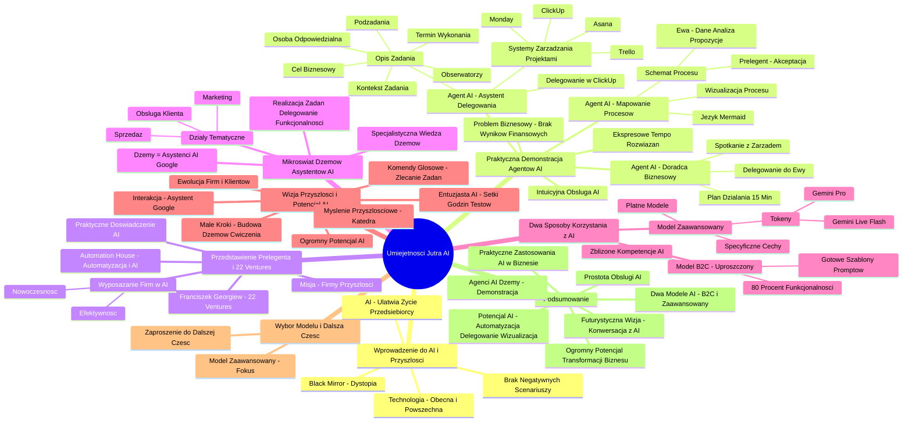

# Lekcje wideo - 1. Zarządzanie

# 💡 Diagram

___

# 🗒️ Notatka

# Notatki i Podsumowanie Wideo: "Umiejętności Jutra AI"

## Wprowadzenie do Tematu AI i Wizji Przyszłości (00:00:00 - 00:00:23)

*   Prelegent rozpoczyna wystąpienie, nawiązując do serialu **Black Mirror**, który przedstawia **dystopijną wizję przyszłości** w kontekście technologii i zagrożeń etycznych.
*   Zauważa, że wiele futurystycznych technologii, prezentowanych w serialu, jest już **obecnych i powszechnie stosowanych** w dzisiejszych czasach.
*   Z perspektywy przedsiębiorcy podkreśla, że technologie, w tym **AI**, **ułatwiają codzienne funkcjonowanie** i nie doświadczył dotychczas negatywnych scenariuszy znanych z serialu.

## Praktyczna Demonstracja Agentów AI (00:00:44 - 00:07:05)

*   Prelegent przedstawia **hipotetyczny problem biznesowy**: brak precyzyjnych wyników finansowych na koniec stycznia.
*   Demonstruje działanie **agenta AI** – **"doradcy biznesowego"**,  wyposażonego w wiedzę o firmie oraz styl komunikacji prelegenta.
    *   Agent proponuje **plan działania w 15 minut**: zorganizowanie pilnego spotkania online z zarządem firmy (wymienia konkretnych członków zarządu).
    *   Sugeruje **delegowanie zadania** do Ewy (odpowiedzialnej za operacje) z określonym terminem realizacji (do godziny 18:00) i niezbędnymi załącznikami.
*   Aby przyspieszyć proces, prelegent angażuje **drugiego agenta AI** – **"asystenta do delegowania zadań"**.
    *   Prosi o wsparcie w **delegowaniu zadania w systemie ClickUp**, zgodnie z firmowymi standardami.
    *   Agent generuje **szczegółowy opis zadania do ClickUp**:  osoba odpowiedzialna, obserwatorzy, termin wykonania, kontekst zadania, cel biznesowy, motywujące  słowa wsparcia, oraz listę podzadań.
    *   Prelegent wspomina o możliwości **wysyłania zadań do różnych systemów zarządzania projektami** (Asana, Trello, Monday), dzięki zdolności AI do rozpoznawania kluczowych elementów zadania.
*   Następnie, prelegent prezentuje **wizualizację procesu** za pomocą **agenta AI do mapowania procesów**.
    *   Wykorzystuje język **Mermaid** do wygenerowania diagramu przepływu pracy.
    *   Agent tworzy **kod Mermaid**, który po wklejeniu, przekształca się w **czytelny schemat procesu** krok po kroku (np. Ewa pozyskuje dane, analizuje rozbieżności, przedstawia propozycje rozwiązań, prelegent zatwierdza).
*   Prelegent podkreśla **ekspresowe tempo generowania rozwiązań** dzięki AI, co jest szczególnie istotne w kontekście **presji czasu** w dzisiejszym biznesie.
*   Zaznacza, że **obsługa AI jest intuicyjna** i to zagadnienie będzie kluczowym tematem prezentacji.

## Przedstawienie Prelegenta i Misji 22 Ventures (00:07:05 - 00:07:36)

*   Prelegent przedstawia się jako **Franciszek Georgiew**, właściciel holdingu **22 Ventures**, którego misją jest **tworzenie firm przyszłości**.
*   Wspomina o **Automation House**, firmie wchodzącej w skład holdingu, specjalizującej się we **wdrożeniach automatyzacji i AI**.
*   Akcentuje **praktyczne doświadczenie** w implementacji AI na poziomie biznesowym.
*   Misją holdingu jest **wyposażanie przedsiębiorstw w narzędzia AI**,  w celu podniesienia efektywności i unowocześnienia ich działalności.

## Zaproszenie do Mikroświata "Dżemów" / Asystentów AI (00:07:36 - 00:08:39)

*   Prelegent wprowadza pojęcie **"dżemy"**, definiując je jako **asystentów AI** (terminologia różni się w zależności od modelu LLM, w kursie stosowane jest nazewnictwo Google).
*   Asystenci AI są **tematycznie podzieleni na działy**: sprzedaż, marketing, obsługa klienta.
*   W każdym dziale funkcjonują **"dżemy" zasilone specjalistyczną wiedzą**,  które realizują zadania, delegują je i oferują zaawansowane funkcjonalności.

## Dwa Sposoby Korzystania z AI (00:08:39 - 00:09:07)

*   Prelegent prezentuje **dwa modele wykorzystania AI**:
    1.  **Model B2C (uproszczony)**:
        *   Umożliwia wdrożenie **80% omawianych funkcjonalności**.
        *   Wykorzystuje **gotowe szablony promptów** do zastosowania w "dżemach".
        *   Pozwala na uzyskanie **zbliżonych kompetencji asystentów AI**.
    2.  **Model Zaawansowany**:
        *   Opiera się na **płatnych modelach**, rozliczanych w systemie **tokenów** (np. **Gemini Live Flash, Gemini Pro**).
        *   Modele te charakteryzują się **specyficznymi cechami**, które zostaną szczegółowo omówione.

## Wizja Przyszłości i Potencjał AI (00:09:07 - 00:10:00)

*   Prelegent przedstawia **wizję przyszłości**: **interakcja z firmą na zasadzie rozmowy z Asystentem Google**,  zlecanie zadań za pomocą **komend głosowych**.
*   Podkreśla, że w tym kierunku ewoluują jego firmy i klienci, zachęcając słuchaczy do współtworzenia tej zmiany.
*   Apeluje o **wdrażanie małych kroków**:  budowanie "dżemów" i praktyczne ćwiczenie pracy z AI.
*   Prelegent określa siebie jako **entuzjastę AI**, który poświęcił **setki godzin** na testowanie i wdrażanie AI w rozwiązywaniu problemów biznesowych.
*   Podkreśla **ogromny potencjał AI** i zachęca do **myślenia przyszłościowego**:  "kładąc kamienie, musimy myśleć o katedrze". Budowanie małych asystentów stanowi fundament pod większe, kompleksowe rozwiązania.

## Wybór Modelu i Zaproszenie do Dalszej Części (00:10:00 - 00:10:14)

*   Prelegent zapowiada, że w dalszej części prezentacji skupi się na **bardziej zaawansowanym i złożonym modelu** wykorzystania LLM.
*   Zaprasza do kontynuowania oglądania.

## Podsumowanie

Prezentacja "Umiejętności Jutra AI" Franciszka Georgiewa wprowadza w świat praktycznych zastosowań sztucznej inteligencji w biznesie. Poprzez demonstrację agentów AI (**"dżemów"**) w kontekście rozwiązywania problemów biznesowych, prelegent ukazuje potencjał AI w obszarach automatyzacji zadań, delegowania i wizualizacji procesów. Wystąpienie omawia dwa modele korzystania z AI: uproszczony B2C, oparty na gotowych promptach, oraz zaawansowany, wykorzystujący płatne modele tokenowe. Prelegent kreśli futurystyczną wizję, w której interakcja z firmami przypomina konwersację z asystentem AI,  zachęcając do budowy "katedry" przyszłości poprzez stopniowe wdrażanie i eksplorację możliwości AI. Kluczowym przesłaniem jest **dostępność i prostota obsługi AI**,  a także jej **ogromny potencjał** w transformacji biznesu i zwiększaniu efektywności.

___

# 🔉 Transcript
File: Lekcje wideo - 1. Zarządzanie.mp4 
[00:00:00] (Biały ekran)
[00:00:01] (Ekran z napisem "Umiejętności Jutra AI". Pod spodem loga Google i SGH)
[00:00:05] Cześć wszystkim. Nie wiem czy pamiętacie serial Black Mirror. Co ciekawe on ma już chyba 13 albo 14 lat jak ostatnio sprawdzałem, więc czas szybko leci.
[00:00:14] Ale on roztacza przed nami taką dystopijną, złą wizję przyszłości, jakie technologia budzi poważne gdzieś zagrożenia i dylematy etyczne.
[00:00:23] I co ciekawe, wiele tych wdrożeń technologii już mamy. Korzystamy z nich dzisiaj i one dzisiaj nam, na przykład mnie w roli przedsiębiorcy, właściciela kilku firm, ułatwiają bardzo życie. No i powiem szczerze, że dotychczas nie spotkałem się jeszcze z żadnym tym wielkim zagrożeniem i całą tą bardzo mroczną wizją rzeczywistości.
[00:00:44] I chciałbym wam, zanim przejdziemy do całej warstwy teoretycznej i przykładów tego jak korzystać z AI w marketingu, w sprzedaży, w obsłudze klienta.
[00:00:52] Jakąś zajawkę agentów AI, chciałbym wam pokazać sytuację, która hipotetycznie mogłaby się stać nawet dzisiaj w drodze mojej tutaj na nagrania.
[01:02] I przygotowałem sobie do tego małą demonstrację.
[01:06] Wyobraźmy sobie, że rano dostałem informację, że nie mamy wyników finansowych w firmie, że nie są one jasno przedstawione i w sumie to nie wiemy dokąd zmierzamy, mimo tego, że jest sama końcówka stycznia.
[01:19] Co ogólnie rzecz biorąc zdarzyło się pierwszy raz od półtora roku i jest prawdopodobnie związane z przepinaniem źródeł danych na nowy rok, nowe kategorie budżetowania i inne nudne rzeczy, którymi nikt nie chce się zajmować.
[01:33] I teraz to co robię, to wybieram sobie mojego doradcy biznesowego, który to jest zasilony wiedzą o firmie, jest zasilony dobrymi praktykami i takim trochę moim stylem komunikacji.
[01:47] i proszę go, aby pomógł mi w tej sytuacji. Więc ja pytam go, czy masz może jakiś pomysł jak uruchomić pracę zespołu w trakcie w temacie naprawy tej sytuacji, bez obciążania mnie na dłużej niż 15 minut od przygotowań do materiału wideo, który jest dla mnie priorytetem?
[02:26] Mój doradca biznesowy używa jednego z moich ulubionych sformułowań.
[02:30] Albo są wymówki, albo są wyniki. Na pocieszenie powiem, że stosuję go głównie do siebie i staram się trzymać po prostu wysokie standardy.
[02:38] I sugeruje, że ewidentnie mamy do czynienia z wymówkami. Półtora roku stabilności i nagle taki klops. Zapachniało mi to trochę i tak dalej i tak dalej.
[02:47] No i teraz to jest plan, który zajmie maks 15 minut.
[02:51] zwołać natychmiastowe spotkanie kryzysowe online i zwróćcie uwagę, że on wymienia osoby, z którymi pracuje, to jest akurat zarząd mojej firmy.
[03:01] w którym sugeruje właśnie konkretne rozwiązania. Następnie delegowanie tego zadania i on wie, że powinno ono trafić do Ewy, która u nas odpowiada za operacje w firmie.
[03:13] właśnie jedną z tych osób wymienionych wcześniej. Dzisiaj do godziny 18:00.
[03:17] wskazuje jakie mają być załączniki i tak dalej.
[03:21] I teraz zwróćcie uwagę, że ja jestem w dosyć dużym pośpiechu i jakkolwiek to rozwiązanie jest szybkie, zastanawiam się co mogę zrobić, żeby było jeszcze szybciej.
[03:30] I tutaj wywołuję swojego drugiego dżema czy też asystenta, bo różne firmy różnie to nazywają i wybieram asystenta do delegowania zadań.
[03:41] I proszę go w takim razie, pomóż mi zatem delegować to zadanie w ClickUp zgodnie z naszymi dobrymi standardami. Zwięźle. Zwięźle napisałem zresztą z błędem ortograficznym, dlatego bo jest to komputer, który nie ma mojej klawiatury i nie chcę, żeby tutaj mi niechcący coś wyskoczyło na ekranie, ale AI jest na tyle sprytne, że sobie z tym poradzi.
[03:59] Nie mija chwila.
[04:00] Przełączam się na innego dżema i on
[04:05] dokładnie opisuje mi jak ma wyglądać to zadanie. Kto ma być przypisany do tego zadania?
[04:11] Kto ma być obserwatorem tego zadania?
[04:13] Jakie jest deadline? Jest kontekst tego zadania, cel biznesowy, słowa wsparcia, słowa zachęty i ewentualne podzadania rozpisane.
[04:22] Co ciekawe i tego nie będę już teraz demonstrował, będę o takich zastosowaniach mówić później. Ja mogę z tego miejsca wybrać sobie takie coś jak ClickUp Send i mogę wysłać to do ClickUp, na którym pracujemy z zadaniami. Jeżeli w waszej firmie korzysta się z czegoś innego, nie wiem Asana, Trello, tego soft Monday, tego softu jest bardzo dużo, to w każdy taki soft można się wpiąć i również wysłać tam to zadanie, bo AI już rozpozna co to znaczy przypisane, obserwatorzy, co ma z tym zrobić, kogo ma tam przypisać. To jest taki mini powiedzmy agent do zrobienia takich kwestii.
[04:54] Ale na razie tego nie będę robić, ponieważ to na czym zależy mi najbardziej, to przedstawienie tego procesu w formie wykresu.
[05:02] Niektórzy ludzie potrzebują wizualnych materiałów dużo bardziej, są wzrokowcami, ktoś inny woli słuchać, ktoś inny woli czytać. Równie dobrze możemy sobie wyobrazić, że wrzucam to do notebook LLM i przygotowuję rozmowę audio na ten temat, jeżeli ktoś woli, ale ja akurat skupię się na zastosowaniu dla wzrokowców i wywołuję tutaj mojego dżema, który służy do mapowania procesów.
[05:27] I wyciągam sobie prompt.
[05:31] I wiedząc, że czasem AI ma tendencję do umieszczania tam polskich znaków, a Mermaid, w którym chcę zrobić wykres nie akceptuje polskich znaków, proszę o wygenerowania kawałka kodu.
[05:46] (Ekran z kodem i wygenerowanym schematem)
[06:11] Wklejam ten kawałek kodu.
[06:14] I zobaczcie, mam wizualizację całego procesu, całego zadania. Czyli jest bardzo jasno powiedziane, że to Ewa ma znaleźć kompletne dane.
[06:24] dostaje to wsparcie i jeśli dane nie są kompletne, to to wraca do niej.
[06:31] Ewa analizuje rozbieżności.
[06:34] Ma jakieś propozycje jak to rozwiązać, daje do mnie do przeglądu. Jeżeli akceptuję, to to wraca i tak dalej. Mamy całą mapę krok po kroku co trzeba zrobić.
[06:41] Oczywiście ten przykład jest taki, no po prostu ciekawy, raczej nie tworzyłbym tu mapy procesu, ale chcę wam pokazać jak szybko można rzeczy generować z AI, szczególnie kiedy jesteśmy przyciśnięci z czasem. A nie oszukujmy się, dzisiejsza rzeczywistość czy rynkowa czy szybkość zmian na świecie powoduje, że coraz częściej musimy robić więcej z mniej i wreszcie żyjemy w czasach, w których dostaliśmy takie możliwości do naszych rąk.
[07:05] Obsługa tego jest niesamowicie prosta i o tym właśnie będzie moje wystąpienie dzisiaj. Ja się nazywam Franciszek Georgiew i jestem właścicielem holdingu 22 Ventures. Holdingu, którego misją jest budowanie firm przyszłości.
[07:22] Kiedyś ta misja wyglądała inaczej, stopniowo budując kolejne firmy, w tym Automation House, który zajmuje się właśnie wdrożeniami automatyzacji i AI, stąd czuję się w tym dosyć biegły na takim poziomie biznesowym.
[07:36] Stwierdziłem, że każda z tych firm powinna zostać wyposażona w tego typu narzędzia do tego, żeby być po prostu bardziej efektywna, lepsza, bardziej nowoczesna i takie te rzeczy też robimy dla naszych klientów z różnych branż.
[07:48] I to o czym dzisiaj porozmawiamy, gdzie postaram się podzielić częścią tej praktycznej wiedzy, którą zdobyłem przez ostatnie lata.
[07:57] To jest zaproszenie do mikroświata dżemów. Dżemów, czyli asystentów AI, projektów AI. One się bardzo różnie nazywają w różnych LLM-ach. Ja tu będę stosować to googlowe nazewnictwo w trakcie tego kursu. Nazwę je asystentami, ponieważ jest to też bardzo intuicyjne.
[08:14] I oni dzielą pewnego rodzaju zastosowania na konkretne działy i w tych działach będziemy działać, czyli będziemy działać w działach takich jak sprzedaż, marketing, obsługa klienta. Tam będą asystenci czy też dżemy zasileni w odpowiednią wiedzę, robiący za nas zadania, wysyłające je do realizacji i kilka magicznych sztuczek, które mogą wam się bardzo spodobać.
[08:39] Z drugiej strony pokażę wam dwa sposoby korzystania z AI. Jeden z nich jest taki bardziej B2C, bardzo prosty, w wyniku którego będziecie w stanie wdrożyć około 80% tego o czym dzisiaj mówię i po prostu dostaniecie konkretne system prompty, które trzeba tylko wkleić do dżema, to za chwilę pokażę jak zrobić i będziecie mogli uzyskiwać podobne zdolności tych waszych dżemów asystentów.
[09:07] A z drugiej strony pokażę wam trochę bardziej zaawansowany model, w którym płacimy za wykorzystywanie tokenów, na przykład w takich modelach jak Gemini Live Flash czy Gemini Pro, które cechują się pewnymi specjalnymi wyróżnikami, o których będę mówić i finalnie zakończymy dosyć ciekawą wizją przyszłości, wizją rozma rozmawiania z firmą jak z asystentem Google, z której w zasadzie możemy się dowiedzieć wszystkiego o działaniu tej firmy, jesteśmy w stanie zlecać zadania głosem i do tego zmierzają czy to moje firmy, czy nasi klienci, czy wy możecie budować tą zmianę, zaczynając od małych kroków takich jak budowanie konkretnych dżemów i ćwiczenie pracy z AI. Ja sam jestem freakiem AI. Spędziłem na tym setki godzin szczególnie w drugiej połowie zeszłego roku. Naprawdę kiedyś w aplikacji Timing, w której mierzę czas, miałem miesiąc, w którym przebiłem 180 godzin klikania z AI.
[10:00] Czyli de facto pełny etat, oprócz tego musiałem pracować, więc można powiedzieć, że pracowałem na dwa etaty, ale w tym miesiącu rozwiązałem większość problemów biznesowych, które ciągnęły się za mną przez ostatnie trzy lata, więc to pokazuje gigantyczny potencjał właśnie AI. Ja bym chciał tylko, żebyście właśnie złapali tą futurystyczną wizję, ponieważ mam takie powiedzenie, które bardzo lubię, że kładąc kamienie, musimy mieć przed oczami katedrę i tworząc tych małych asystencików, te małe dżemy, tak naprawdę budujemy podwaliny u siebie, w firmie, w której pracujemy, na własnej działalności gospodarczej pod coś dużo większego i właśnie dlatego na koniec pokażę wam do czego to zmierza, jak to wygląda i także gorąco zapraszam do oglądania, a tymczasem będziemy przechodzić do tego, jakie są dwa modele korzystania z LLM i dlaczego dzisiaj będę pokazywać ten drugi, czyli troszeczkę bardziej wyrafinowany i skomplikowany.

___
# 🏷️ Tags
#AI #sztuczna_inteligencja #umiejętności_jutra #Black_Mirror #dystopia #technologia #etyka #przedsiębiorca #ułatwianie_życia #agenci_AI #doradca_biznesowy #plan_działania #spotkanie_online #zarząd_firmy #delegowanie_zadań #asystent_AI #ClickUp #systemy_zarządzania_projektami #Asana #Trello #Monday #opis_zadania #obserwatorzy #termin_wykonania #kontekst_zadania #cel_biznesowy #motywacja #podzadania #wizualizacja_procesu #mapowanie_procesów #Mermaid #diagram_przepływu_pracy #kod_Mermaid #schemat_procesu #ekspresowe_tempo #presja_czasu #intuicyjna_obsługa #Franciszek_Georgiew #22_Ventures #firmy_przyszłości #Automation_House #wdrożenia_automatyzacji #doświadczenie_biznesowe #narzędzia_AI #efektywność #unowocześnienie #dżemy #asystenci_AI #LLM #Google #sprzedaż #marketing #obsługa_klienta #funkcjonalności #model_B2C #uproszczony_model #szablony_promptów #kompetencje_AI #model_zaawansowany #modele_płatne #tokeny #Gemini_Live_Flash #Gemini_Pro #wizja_przyszłości #Asystent_Google #komendy_głosowe #wdrażanie_AI #entuzjasta_AI #potencjał_AI #myślenie_przyszłościowe #budowanie_rozwiązań #wybór_modelu #podsumowanie #automatyzacja_zadań #transformacja_biznesu #zwiększanie_efektywności #źródła_danych #budżetowanie #wymówki #wyniki #standardy #pośpiech #błąd_ortograficzny #klawiatura #wizualizacja #wzrokowcy #notebook_LLM #rozmowa_audio #rynek #szybkość_zmian #praktyczna_wiedza #mikroświat_dżemów #projekty_AI #intuicyjne_nazewnictwo #działy #wiedza_specjalistyczna #system_promptów #zdolności_dżemów #rozwiązywanie_problemów_biznesowych #katedra #budowanie_podwalin #wyrafinowany_model #skomplikowany_model #bezpieczeństwo #prywatność #dane_osobowe
