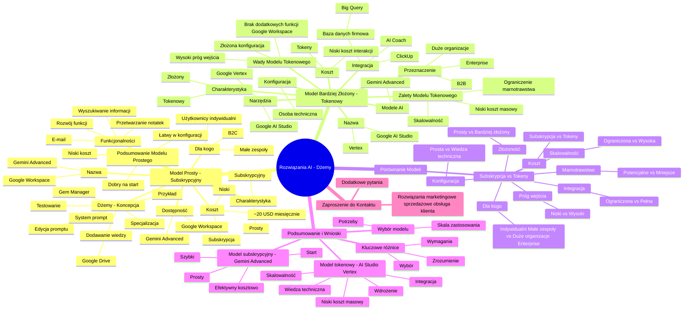

# Lekcje wideo - 2. Dwa modele korzystania z LLM

# 💡 Diagram

___

# 🗒️ Notatka

# Notatki i Podsumowanie Transkrypcji Wideo

## Wprowadzenie

Transkrypcja wideo dotyczy tworzenia rozwiązań opartych na **sztucznej inteligencji** (AI) – asystentów, określanych jako "`dżemy`" –  podobnych do wewnętrznego narzędzia firmy Automation House. Przedstawione są dwa główne podejścia do budowy tych rozwiązań, różniące się poziomem złożoności i przeznaczeniem.

## Dwa Sposoby Budowania Rozwiązań AI

Istnieją dwa podejścia do tworzenia rozwiązań AI, od prostszego do bardziej zaawansowanego:

1. **Model Prosty (Subskrypcyjny) - Gemini Advanced/Google Workspace:**

    - **Charakterystyka:** Niezwykle prosty w konfiguracji i obsłudze.
    - **Koszt:** Około 20 dolarów miesięcznie (mniej niż 100 zł) na użytkownika.
    - **Przeznaczenie:** Idealny dla **użytkowników indywidualnych** oraz małych zespołów (**B2C**).
    - **Dostępność:** Poprzez **Google Workspace** i **Gemini Advanced**.
    - **Funkcjonalności:**
        - Przetwarzanie notatek ze spotkań.
        - Wspomaganie pisania wiadomości e-mail.
        - Wyszukiwanie informacji w wiadomościach e-mail.
        - Dalsze funkcje rozwijane w **Google Workspace**.
    - **Koncepcja "`Dżemów`":**
        - Asystenci, persony, charaktery, narzędzia dedykowane do wykonywania konkretnych zadań.
        - **Kluczowa jest specjalizacja** –  bardziej efektywne jest stworzenie wielu mniejszych, wyspecjalizowanych `dżemów` niż jednego uniwersalnego.
        - Tworzenie `dżemów` odbywa się w **Gem Manager** w **Gemini Advanced**.
        - Nadawanie nazwy i definiowanie **system promptu** (instrukcji określającej przeznaczenie `dżema`).
        - **System prompt** – przykład: asystent delegowania zadań dla CEO 22 Ventures (dostępny w materiałach).
        - Możliwość **edycji system promptu** i dostosowania do indywidualnych potrzeb.
        - **Dodawanie wiedzy:**
            - Integracja z **Google Drive** (Google Sheets, pliki).
            - AI uzyskuje dostęp do aktualizowanych plików w chmurze.
            - Możliwość wgrywania danych finansowych, firmowych instrukcji procesów itp.
        - **Testowanie:** Funkcja testowania `dżema` po załadowaniu wiedzy.
        - **Przykład zastosowania:** Delegowanie zadania stażyście za pomocą `dżema` (przykład z Miliwojem CRO).
    - **Podsumowanie modelu prostego:**
        - Łatwy w konfiguracji i użytkowaniu.
        - Niski koszt dla pojedynczych użytkowników.
        - Dobre rozwiązanie na start.

2. **Model Bardziej Złożony (Tokenowy) - Google AI Studio/Vertex:**

    - **Charakterystyka:** Nieco bardziej skomplikowany w konfiguracji.
    - **Przeznaczenie:** Rozwiązanie dla **większych organizacji** (dziesiątki/setki użytkowników – **B2B**), **Enterprise**.
    - **Koszt:** Opłata naliczana za **zużyte tokeny** (przetwarzanie zapytań i informacji).
    - **Modele AI:** Wykorzystuje te same modele, co **Gemini Advanced**.
    - **Koszt użycia:** Bardzo niski koszt pojedynczej interakcji (przykład delegowania zadania – kilkanaście groszy).
    - **Konfiguracja:** Wymaga zaangażowania **osoby technicznej** do wdrożenia i konfiguracji.
    - **Narzędzia:** **Google AI Studio** i **Google Vertex** do testowania i rozwijania rozwiązań.
    - **Integracja z narzędziami firmowymi:**
        - Możliwość integracji z narzędziami takimi jak **ClickUp** (zarządzanie zadaniami).
        - Integracja z **firmową bazą danych** (**Big Query**) jako **jednym źródłem danych**.
        - **AI Coach** (przykład, nieprezentowany) –  zintegrowany z bazą danych pracowników, testami psychologicznymi, oferujący indywidualne wskazówki dotyczące komunikacji.
    - **Zalety modelu tokenowego:**
        - **Skalowalność** dla dużych organizacji.
        - **Niższy koszt** przy masowym wykorzystaniu (w dłuższej perspektywie).
        - **Ograniczenie marnotrawstwa** – płatność wyłącznie za realne użycie.
    - **Wady modelu tokenowego:**
        - **Wyższy próg wejścia** –  wymaga wiedzy technicznej.
        - **Bardziej złożona konfiguracja**.
        - Brak dodatkowych funkcji oferowanych przez **Google Workspace**.

## Porównanie Modeli - Subskrypcja vs. Tokeny

| Cecha                 | Model Subskrypcyjny (Gemini Advanced) | Model Tokenowy (AI Studio/Vertex)        |
| --------------------- | --------------------------------------- | ---------------------------------------- |
| Złożoność             | Prosty                                  | Bardziej złożony                           |
| Koszt                 | Stała subskrypcja miesięczna              | Płatność za zużycie tokenów              |
| Dla kogo              | Użytkownicy indywidualni, małe zespoły   | Duże organizacje, Enterprise              |
| Konfiguracja          | Prosta, samodzielna                      | Wymaga wiedzy technicznej                  |
| Skalowalność          | Ograniczona dla dużych organizacji       | Wysoka skalowalność                       |
| Integracja            | Początkowo ograniczona integracja z aplikacjami firmowymi | Potencjał pełnej integracji z aplikacjami firmowymi i bazami danych |
| Próg wejścia          | Niski                                   | Wyższy                                    |
| Marnotrawstwo         | Potencjalne (stała opłata niezależnie od użycia) | Mniejsze (płatność za faktyczne użycie)   |

## Podsumowanie i Wnioski

Wybór modelu budowy rozwiązań AI jest uzależniony od skali zastosowania i konkretnych potrzeb. Dla użytkowników indywidualnych i małych zespołów model subskrypcyjny (**Gemini Advanced**) jest prosty, szybki w konfiguracji i efektywny kosztowo na początek. Natomiast dla większych organizacji model tokenowy (**AI Studio/Vertex**) oferuje skalowalność, potencjalnie niższe koszty przy dużym wolumenie użycia oraz szersze możliwości integracji. Warto jednak pamiętać, że model tokenowy wymaga większej wiedzy technicznej i jest bardziej skomplikowany we wdrożeniu. Kluczowe jest zrozumienie różnic między tymi modelami, aby wybrać rozwiązanie najlepiej dopasowane do specyficznych wymagań.

## Zaproszenie do Kontaktu

W przypadku dodatkowych pytań, autor zachęca do kontaktu. Dalsza część wideo poświęcona jest prezentacji konkretnych rozwiązań marketingowych, sprzedażowych i obsługi klienta, które nie zostały uwzględnione w tej transkrypcji.

___

# 🔉 Transcript
File: Lekcje wideo - 2. Dwa modele korzystania z LLM.mp4 
[00:00:05] No dobrze, zatem pokazałem wam tajemniczy interfejs, który prawdopodobnie widzieliście pierwszy raz w życiu, bo jest to wewnętrzne narzędzie w Automation House, czyli jednej z moich firm, a teraz w jaki sposób wy możecie zbudować podobne rozwiązania.
[00:00:19] I tak jak wspominałem, są na to dwa sposoby.
[00:00:22] Jeden z nich jest trywialnie prosty, a drugi z nich odrobinę bardziej skomplikowany i teraz krótko omówię oba z nich i ich wady i zalety.
[00:00:31] Także żyjemy w niesamowitych czasach, w których w cenie i nawet ciężko to do czegoś przyrównać, tak?
[00:00:38] No bo mówimy o 20 dolarach, także można powiedzieć, no nie jest nawet solidny lunch w Warszawie przy obecnych cenach.
[00:00:45] Możemy dostać kogoś, kto jest odpowiednikiem nawet nie jednego asystenta czy asystentki, tylko pewnego rodzaju armii pomocników, którą możemy sobie stworzyć po to, żeby de facto łatwiej robić rzeczy w życiu z mniejszym wysiłkiem, a już szczególnie te rzeczy, których no po prostu nie lubimy.
[00:01:03] Oprócz tego w ramach tego planu macie szereg rzeczy, które zaczynają pojawiać się w waszym Google Workspace, czyli potrafią przetwarzać wasze notatki ze spotkań, potrafią pisać, pomóc wam pisać maile, możecie odpytywać, co tam na waszych mailach się stało i wiele różnych fajnych bajerów, które znając szybkość postępu technologicznego dosyć szybko będą się rozwijać.
[00:01:25] I to jest pierwsze bardzo prosty model, w ramach którego możemy właśnie takie dżemy tworzyć.
[00:01:32] Dżemy, czyli tych asystentów, jeszcze inne firmy nazywają to projektami, prawdopodobnie tych nazw jest jeszcze więcej.
[00:01:39] Mówimy po prostu o personach, o charakterach, o asystentach, o narzędziach, które mają wykonywać dla nas pojedyncze czynności.
[00:01:46] Siła tych rozwiązań, właśnie dżemów tkwi w specjalizacji.
[00:01:53] Ja kiedyś byłem zwolennikiem, próbowałem mimo tego, że Gemini ma bardzo szerokie okno kontekstowe, wpchać jak najwięcej zadań i zastosowań do jednego dżema.
[00:02:03] To nie jest dobre podejście, lepiej stworzyć szereg mniejszych i co najwyżej oprzeć ich na podobnej wiedzy, ale już odkodowuje te wszystkie pojęcia.
[00:02:11] Także po zwykłym logowaniu się do podstawowego interfejsu Gemini, możecie sobie wejść do Gem Managera, w ramach którego klikacie sobie w stworzenie nowego dżema i nadajecie mu czy jej imię.
[00:02:28] I jak widać tutaj wkleiłem system prompt i to jest pojęcie, które warto się z nim zapoznać, który jest taką instrukcją, do czego ten konkretny dżem ma służyć.
[00:02:39] Jak widać to jest asystent delegowania dla CEO 22 Ventures.
[00:02:45] I opisuję mu w jaki sposób ma zlecać zadania w moim imieniu, tworząc te opisy zadań, które widzieliście na samym początku tego nagrania.
[00:02:56] I teraz ten system prompt będzie oczywiście dostępny w materiałach, które są dla was dostępne i możecie przetestować go i podtunować pod swoje potrzeby, po prostu edytując to w tym oknie tekstowym.
[00:03:08] Następnie przechodzimy do dodawania wiedzy i tu wchodzi bardzo duża wygoda tego typu rozwiązań, no bo jeżeli korzystacie z Google Workspace, to nawet nie musicie aktualizować jakiś plików, trzymać je gdzieś na dysku i wgrywać ręcznie i potem usuwać, aktualizować.
[00:03:24] Możecie sobie podpiąć plik na Google Drive, na przykład Google Sheeta i aktualizować go sobie i AI będzie miał do niego dostęp i będzie mógł korzystać do niej z niego po to, żeby rozwiązywać dla was różnego rodzaju zadania, odpowiadać na pytania.
[00:03:39] Czyli możemy tu wgrać wyniki finansowe firmy.
[00:03:42] Możemy tu wgrać instrukcje jak robimy na przykład proces sprzedażowy w naszej firmie.
[00:03:48] W zależności od tego, w czym ten dżem ma nam pomóc.
[00:03:53] i po wgraniu tej wiedzy, możemy czy to w formie plików czy właśnie w wersji chmurowej, jesteśmy w stanie przetestować czy to działa poprawnie.
[00:04:06] I jak widzicie, ja proszę tutaj mojego dżema zleć nowemu stażyście, żeby zrobił dziś shadowing Miliwojowi i przygotował pierwszego dżema w Gemini Advanced, który pomoże mu i coś tam, coś tam, tam jest ukryta reszta tekstu.
[00:04:20] No i dostaję projekt zadania dla stażysty i zobaczcie, nie napisałem kim jest Miliwoj, ale jest napisane, jaki jest szerszy kontekst biznesowy.
[00:04:27] Miliwoj to CRO, kluczowa osoba w firmie, jego efektywność wpływa ogólnie na efektywność całej firmy.
[00:04:45] Więc podsumowując w skrócie ten przedstawiony model, który pewnie dla wielu z was jest doskonale znany, mamy prosty w konfiguracji i użyciu sposób działania z AI, który kosztuje nas niecałe 100 zł miesięcznie per użytkownik.
[00:05:01] W tej chwili jest to bardzo dobre rozwiązanie, jeśli planujecie korzystać z niego w sposób indywidualny, czyli na własne potrzeby.
[00:05:09] Troszeczkę większe schody zaczynają się, kiedy chcemy udostępnić te rozwiązania dziesiątkom czy setkom ludzi, a jako że tak jak wspominałem, ja skupiam się na budowaniu firm przyszłości, czyli rozwiązań, z których mogą korzystać dziesiątki czy setki ludzi.
[00:05:23] Musieliśmy przejść na drugi z tych modeli korzystania, gdzie płacimy Google'owi za tokeny.
[00:05:29] Czyli korzystamy z dokładnie tych samych modeli i za to, że wysyłamy do nich zapytania i różnego rodzaju informacje do przetwarzania, za przetwarzanie tych informacji płacimy.
[00:05:40] Jedna taka rozmowa, którą wam zasymulowałem na początku tego materiału, w której delegowałem pilnie zadanie, kosztowałaby pewnie około kilkunastu groszy maksimum.
[00:05:50] Także to są setki wykorzystań, żeby w ogóle dobić do tej ceny, którą mamy za pojedynczego użytkownika.
[00:05:58] Oczywiście nie mam tam wielu innych bajerów, które dostaję w Google Workspace i ogólnie jest to dużo trudniejsze w konfiguracji, ale warto wiedzieć, że w takich zastosowaniach bardziej Enterprise i tak będziecie skłaniać się ku właśnie temu modelowi.
[00:06:12] Tego rodzaju rozwiązania można testować i rozbudowywać na Google AI Studio czy na Google Vertex.
[00:06:20] To są rozwiązania, których ja osobiście nawet dobrze nie znam, ponieważ nie jestem programistą.
[00:06:24] Jestem przedsiębiorcą, właścicielem firmy i dla mnie jest ważne to, żeby dostać gotowy interfejs, na którym po prostu mogę konfigurować sobie tego rodzaju asystentów czy te właśnie dżemy, które pomogą mi w codziennych zadaniach i to właśnie robię na takim interfejsie, który u nas wewnętrznie w firmie nazywa się Aon, którego zresztą wdrażamy w różnego rodzaju firmach i na nim osadzam właśnie wiedzę firmową kolejnych dżemów i wpinam się w narzędzia firmowe.
[00:06:53] I tu wychodzi pewnego rodzaju różnica między zastosowaniami tymi, mówiąc w uproszczeniu B2C opartymi na subskrypcjach, a rozwiązaniami B2B, ponieważ jak za chwilę zobaczycie, jestem w stanie wpiąć się w różnego rodzaju narzędzia, czyli na przykład wysłać to zadanie, które zmapowałem na samym początku materiału prosto do ClickUp czy do innego narzędzia, w którym zarządzamy zadaniami.
[00:07:17] Jestem w stanie na przykład skorzystać z AI Coacha, którego nie będę pokazywać.
[00:07:21] Dlaczego?
[00:07:22] Bo jest wpięty w bazę ludzi, z którymi pracuję.
[00:07:25] Tam są opisane ich funkcje, testy psychologiczne i on daje mi indywidualne wskazówki, jak rozmawiać z daną osobą, żeby lepiej, skuteczniej przekazać jakieś informacje, coś nie wiem, negocjować, zadbać o tą osobę.
[00:07:39] Także żyjemy w naprawdę futurystycznym świecie.
[00:07:41] Więc w tle kończąc ten wywód, mam nadzieję, że jeżeli jesteście mniej techniczni, tak jak ja, to nie zgubiliście się w tym wszystkim.
[00:07:50] Chodzi o to, że w tle wszystko powinno trafiać do jednej bazy danych.
[00:07:54] W naszym przypadku jest to Big Query i z tej bazy danych odbywa się rozmowa z AI, czyli AI wpina się jakby w tę bazę danych, nawet jeżeli korzystamy z innych narzędzi, to dużo lepszym i bardziej skalowalnym rozwiązaniem jest to, żeby te dane jednak trafiały do jednego źródła prawdy o firmie.
[00:08:10] I tam macie wszystkie KPI, wszystkie informacje o ludziach, o klientach i to jest taka, ja bym to nazwał taką czarną skrzynką, której przetwarzanie będzie dla AI coraz łatwiejsze, coraz bardziej efektywne.
[00:08:20] No i jak tutaj widać, my stopniowo widząc, że wpinanie tylu różnych aplikacji jest uciążliwe, również po prostu zmniejszamy ich liczbę, czyli korzystamy coraz więcej z Google Workspace, zastępując inne rzeczy, korzystamy coraz więcej z ClickUp, który ma pewne funkcje, które wykraczają poza Google Workspace i staramy się ujednolicać te narzędzia, żeby coraz szybciej je ze sobą integrować.
[00:08:30] Tak to wygląda jakby na zapleczu pod maską, ale to co widzi finalny użytkownik, to ten prosty interfejs przypominający interfejs chociażby Gemini Advanced.
[00:08:39] No więc jeżeli wybieracie model, który opiera się na zużyciowym tokenów i płaceniu za zużycie tokenów, to macie do czynienia przede wszystkim z trochę mniejszym zakresem marnotrawstwa.
[00:08:50] Jest trochę wyższy próg wejścia, bo potrzebujecie osoby technicznej, która zbuduje czy wdroży tego rodzaju rozwiązanie u was w firmie, ale płacicie tylko i wyłącznie za realne wykorzystanie tych tokenów, a na początku jest bardzo duże prawdopodobieństwo, że ludzie będą długo obwąchiwać się, że tak powiem z rozwiązaniami AI i nie korzystać z nich masowo.
[00:09:09] Mi się jeszcze nie zdarzyło, żeby ktoś u mnie w firmie przekroczył równowartość 20 dolarów, więc jest to pewnego rodzaju zachęta do tego, żeby iść w kierunku bardziej zaawansowanych rozwiązań.
[00:09:17] Ale jeżeli jesteście indywidualnymi użytkownikami, to zdecydowanie ta wersja, nazwijmy to subscription based jest dużo lepszym rozwiązaniem, jest prostsza, szybsza w konfiguracji, możecie robić wszystko totalnie własnoręcznie.
[00:09:30] Musicie się pogodzić tylko z tym, że do momentu, kiedy będzie można wpiąć się z tego rodzaju rozwiązaniem w inne aplikacje u was w firmie, może minąć troszeczkę więcej czasu i to rozwiązanie nie będzie aż tak totalne.
[00:09:45] Dużo szczegółów tego i te różnice zobaczycie teraz na przykładach, które wam pokażę.
[00:09:50] Także mam nadzieję, że zrozumieliście różnicę między modelem opartym na subskrypcji, a modelem opartym o zużycie tokenów.
[00:09:57] Jeżeli macie jakiekolwiek pytania, to odzywajcie się do mnie gdziekolwiek mnie znajdziecie, a tymczasem zapraszam do prezentacji konkretnych rozwiązań marketingowych, sprzedażowych i w obsłudze klienta.

___
# 🏷️ Tags
#sztuczna_inteligencja #AI
#dżemy #asystent_AI
#Automation_House
#model_prosty #model_subskrypcyjny
#Gemini_Advanced #Google_Workspace
#użytkownicy_indywidualni #B2C
#małe_zespoły
#notatki_ze_spotkań
#pisanie_emaili
#wyszukiwanie_informacji
#Gem_Manager
#system_prompt
#CEO_22_Ventures
#edycja_system_promptu
#Google_Drive
#Google_Sheets
#dane_finansowe
#instrukcje_firmowe
#testowanie_dżema
#Miliwoj_CRO
#delegowanie_zadań
#model_złożony #model_tokenowy
#Google_AI_Studio #Google_Vertex
#duże_organizacje #B2B #Enterprise
#tokeny
#osoba_techniczna
#ClickUp
#zarządzanie_zadaniami
#firmowa_baza_danych #Big_Query
#AI_Coach
#skalowalność
#koszt_użycia
#marnotrawstwo
#subskrypcja_vs_tokeny
#próg_wejścia
#integracja_z_aplikacjami_firmowymi
#rozwiązania_marketingowe
#rozwiązania_sprzedażowe
#obsługa_klienta
#Aon
#KPI
#czarna_skrzynka
#subscription_based
