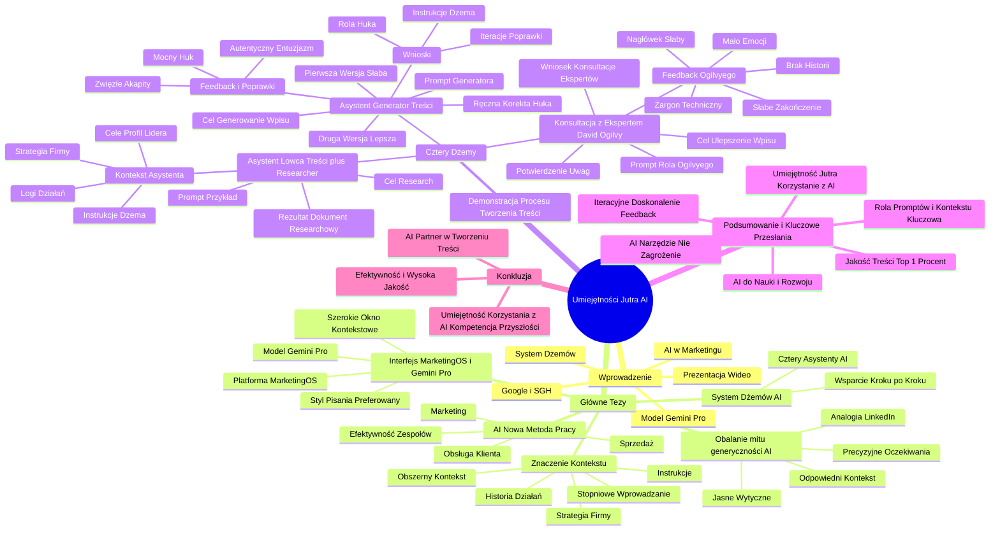

# Lekcje wideo - 3. Marketing

# 💡 Diagram

___

# 🗒️ Notatka

# Notatki i Podsumowanie Prezentacji Wideo: "Umiejętności Jutra"

## Wprowadzenie

Prezentacja wideo "Umiejętności Jutra", zorganizowana przez Google i SGH, prowadzona przez doświadczonego marketera, skupia się na wykorzystaniu sztucznej inteligencji (`AI`) w tworzeniu treści marketingowych. Prezentujący obala popularny mit o generyczności treści generowanych przez `AI`, demonstrując praktyczne podejście do tworzenia angażujących i wartościowych materiałów. Wykorzystuje do tego narzędzia `AI`, w szczególności model Gemini Pro oraz autorski system "dżemów" (asystentów).

## Główne Tezy i Argumenty

* **Obalanie mitu generyczności `AI`:** Treści generowane przez `AI` nie muszą być słabej jakości i generyczne. Kluczowe jest precyzyjne określenie oczekiwań, dostarczenie odpowiedniego kontekstu i jasnych wytycznych.
    * Analogia do przypadkowej osoby piszącej post na LinkedInie – bez odpowiednich instrukcji efekt będzie niezadowalający.
* **`AI` jako nowa metoda pracy, nie tylko technologia:** `AI` znacząco zwiększa efektywność zespołów, szczególnie w działach marketingu, sprzedaży i obsługi klienta.
* **System "dżemów" (asystentów) `AI`:** Prezentujący demonstruje autorski system czterech asystentów `AI`, którzy krok po kroku wspierają proces tworzenia treści.
* **Interfejs MarketingOS i model Gemini Pro:** Wykorzystanie platformy MarketingOS z modelem Gemini Pro, wybranym ze względu na szerokie okno kontekstowe i preferowany styl pisania.
    * Platforma umożliwia korzystanie z różnych modeli `AI` poprzez interfejsy, z płatnością tokenami.
* **Znaczenie kontekstu dla `AI`:** Dostarczenie `AI` obszernego kontekstu (strategia firmy, instrukcje, historia działań) jest fundamentalne dla uzyskania wartościowych rezultatów.
    * Rekomendacja stopniowego wprowadzania kontekstu, zaczynając od podstawowych informacji.

## Demonstracja Procesu Tworzenia Treści z `AI` - Cztery "Dżemy"

### 1. Asystent "Łowca treści plus researcher"

* **Cel:** Przygotowanie dokumentu researchowego na temat "Umiejętności Jutra `AI`" i roli `AI` w marketingu.
* **Przykładowy prompt:**
    * Informacja o udziale w programie "Umiejętności Jutra `AI`" Google w roli prelegenta.
    * Cel: przygotowanie wpisu.
    * Nagłówek ze strony programu wraz z misją.
    * Skrót najważniejszego przekazu: tworzenie "dżemów" na Gemini do generowania treści marketingowych.
    * Prośba o angażujący wpis zawierający praktyczne wskazówki z planu wystąpienia.
    * Załączony plan wystąpienia (przygotowany z pomocą `AI` - dyktowanie w drodze).
* **Kontekst dla asystenta:**
    * Strategia firmy.
    * Instrukcje dla "dżema".
    * Roczne logi działań z poprzedniego roku.
    * Bieżące cele, profil psychologiczny, wartości lidera, rutyny.
* **Rezultat:** Wygenerowanie dokumentu researchowego z główną tezą, filarami tekstu, strukturą i kluczowymi elementami narracyjnymi.

### 2. Asystent "Generator treści"

* **Cel:** Wygenerowanie wpisu na podstawie przeprowadzonego researchu i wytycznych.
* **Prompt:** Prośba o wygenerowanie wpisu w języku polskim, zgodnego z wytycznymi.
    * Wspomnienie o "mini agentach" (dżemach).
    * Wspomnienie o możliwości zlecenia zadań głosowo.
* **Pierwsza wersja wpisu:** Rozczarowująca, brak chwytliwego otwarcia ("huka"), zbyt długie akapity.
* **Feedback i poprawki:**
    * Uwaga 1: Stworzenie mocnego "huka", który przyciągnie uwagę.
    * Uwaga 2: Zwięzłe akapity, poprawiające czytelność.
    * Uwaga 3: Mniej reklamowe zakończenie, bardziej autentyczny entuzjazm.
* **Druga wersja wpisu:** Lepsza, ale wciąż bez wyraźnego "huka".
* **Ręczna korekta:** Oddzielenie pierwszego zdania (huka) akapitem.
* **Wnioski:**
    * Kluczowa rola "huka" na początku tekstu.
    * Iteracyjne poprawianie treści i instrukcji "dżema".
    * Wprowadzanie zmian do instrukcji po każdym feedbacku, aby kolejne wpisy były coraz lepsze.

### 3. Konsultacja z "ekspertem" - David Ogilvy

* **Cel:** Uzyskanie wskazówek dotyczących ulepszenia wpisu od legendarnego copywritera (symulowanego przez `AI`).
* **Prompt:** "Wciel się w rolę Davida Ogilvy'ego i wskaż obszary do poprawy, aby tekst był jeszcze lepszy."
* **Feedback od "Davida Ogilvy'ego":**
    * Nagłówek niewystarczająco chwytliwy.
    * Zbyt dużo technicznego żargonu.
    * Brak elementu historii (storytellingu).
    * Za mało emocji.
    * Zakończenie zbyt słabe.
* **Potwierdzenie:** Feedback `AI` pokrywa się z wcześniejszymi uwagami prezentującego.
* **Wniosek:** Możliwość konsultacji z "ekspertami" za pomocą `AI` w celu doskonalenia umiejętności i jakości treści.

## Podsumowanie i Kluczowe Przesłania

* **`AI` nie jest zagrożeniem, lecz potężnym narzędziem:** Umożliwia tworzenie wysokiej jakości treści marketingowych, pod warunkiem odpowiedniego podejścia i precyzyjnych instrukcji.
* **Kluczowa rola promptów i kontekstu:** Jakość treści generowanych przez `AI` jest bezpośrednio związana z jakością promptów i dostarczonego kontekstu.
* **Iteracyjne doskonalenie i feedback:** Proces tworzenia treści z wykorzystaniem `AI` powinien być iteracyjny, uwzględniający zbieranie feedbacku i ciągłe ulepszanie instrukcji.
* **Wykorzystanie `AI` do nauki i rozwoju:** `AI` umożliwia naukę różnorodnych umiejętności, w tym copywritingu, poprzez konsultacje z "ekspertami" i analizę otrzymanego feedbacku.
* **"Umiejętność Jutra" to efektywne korzystanie z `AI`:** W dzisiejszym świecie umiejętność efektywnego wykorzystania `AI` stanowi kluczową kompetencję.
* **W dobie przesytu treści, wygrywa jakość:** Należy dążyć do tworzenia treści z **top 1%**, które skutecznie angażują i przyciągają uwagę odbiorców.

## Konkluzja

Prezentacja "Umiejętności Jutra" efektywnie demonstruje praktyczne zastosowanie `AI` w marketingu, obalając mity i prezentując konkretne narzędzia oraz metody. Kluczowym przesłaniem jest fakt, że `AI`, przy właściwym wykorzystaniu, staje się nieocenionym partnerem w procesie tworzenia treści, zwiększając efektywność i umożliwiając osiąganie wysokiej jakości rezultatów. Umiejętność korzystania z `AI` jest przedstawiana jako kluczowa kompetencja przyszłości, otwierająca nowe możliwości w marketingu i wielu innych dziedzinach.

___

# 🔉 Transcript
File: Lekcje wideo - 3. Marketing.mp4 
[00:00:00] Ekran: Białe tło.
[00:00:01] Ekran: Na białym tle pojawia się napis "Umiejętności Jutra" a pod nim "Jutra" i logo AI. Pod spodem napis "Organizator Google" i "Partner edukacyjny SGH".
[00:00:05] Ekran: Mężczyzna siedzi za biurkiem, na którym stoi laptop. Za nim ściana z logiem Google i roślinami.
[00:00:05] Mężczyzna: No to słuchajcie, teraz jako rasowy marketer od 10 lat, odkąd założyłem agencję digitalową Tigers, wreszcie będę mógł odnieść się do najważniejszego zarzutu do AI, jeśli chodzi o tworzenie treści, które jest absolutną bzdurą.
[00:00:19] Ekran: Zbliżenie na twarz mężczyzny.
[00:00:19] Mężczyzna: Często słyszymy, że tworzenie treści z AI generuje generyczne, słabe treści.
[00:00:25] Mężczyzna: Tak, jeżeli nie sprecyzujemy oczekiwań, nie dostarczymy właściwego kontekstu i wytycznych, jak ten tekst ma wyglądać, to rzeczywiście ta treść będzie słaba.
[00:00:35] Mężczyzna: Ale to jest trochę tak, jakbyśmy podeszli do przypadkowego człowieka na ulicy i powiedzieli: napisz mi posta na LinkedIna.
[00:00:40] Mężczyzna: No umówmy się, jest raczej mała szansa, że trafi w nasz styl, że dobrze zrozumie o co nam chodziło.
[00:00:46] Ekran: Mężczyzna i po prawej stronie ekranu napis "Case 2: Marketing".
[00:00:47] Mężczyzna: I teraz pokażę wam, w jaki sposób stworzyłem taki system czterech dżemów, czy też asystentów, którzy pomagają mi w tworzeniu treści krok po kroku.
[00:00:55] Mężczyzna: Przy okazji pokażę wam dwa elementy interfejsów, w które będę was coraz bardziej głęboko wprowadzać.
[00:01:01] Ekran: Interfejs programu MarketingOS.
[00:01:01] Mężczyzna: Po pierwsze, jak widzicie, mam tutaj domyślnie wybrany model Gemini Pro.
[00:01:05] Mężczyzna: i
[00:01:06] Mężczyzna: tutaj tych modeli jest więcej.
[00:01:08] Mężczyzna: Jak widzicie, w tego rodzaju interfejsach można skorzystać też z dowolnych modeli, płacąc tokenami.
[00:01:14] Mężczyzna: Teraz w zależności od tego, jakie są ich mocne strony.
[00:01:18] Mężczyzna: Ja wybrałem Gemini, ponieważ on ma najszersze okno kontekstowe.
[00:01:21] Mężczyzna: Czyli te modele dzisiaj mają zbliżony poziom inteligencji, mają różny styl pisania.
[00:01:25] Mężczyzna: Mi ten styl od Gemini odpowiada.
[00:01:28] Mężczyzna: I to, co jest dla mnie ważne, to jest to, że jak zasilę go dużą ilością wiedzy firmowej, to on się w tym nie zgubi.
[00:01:33] Mężczyzna: Więc wybierzmy sobie pierwszego asystenta po to, żebym mógł przedstawić wam, w jaki sposób tworzę ten te treści w takim czterofazowym procesie.
[00:01:46] Mężczyzna: Wybieram tego asystenta małpką i wybieram sobie asystenta z numerem jeden, czyli Łowca treści plus researcher.
[00:01:54] Mężczyzna: No i ponownie, żeby oszczędzić was czas, przygotowałem sobie już gotowy prompt na ten temat, który
[00:02:00] Mężczyzna: i teraz wam go tylko krótko omówię.
[00:02:02] Mężczyzna: Struktura tego promptu jest taka.
[00:02:04] Mężczyzna: Po pierwsze, informuję go, że w chwili obecnej biorę udział w programie Umiejętności Jutra AI od Google jako prelegent i że moim celem jest przygotowanie wpisu.
[00:02:14] Mężczyzna: Wkleiłem tutaj nagłówek ze strony internetowej tego programu, który mówi jaka jest jego główna misja, przesłanie.
[00:02:22] Mężczyzna: Skróć, w skrócie powiedziałem, co moim zdaniem jest najważniejsze w tym, co mam dzisiaj do przekazania, czyli o tworzeniu różnego rodzaju dżemów na Gemini, którzy pomagają w tworzeniu treści marketingowych czy innych zastosowaniach, o których jeszcze wam dzisiaj powiem.
[00:02:36] Mężczyzna: No i proszę o przygotowanie angażującego wpisu na ten temat, z którym podzielę się praktycznymi wskazówkami z mojego planu wystąpienia poniżej.
[00:02:42] Mężczyzna: I tutaj mam plan wystąpienia.
[00:02:45] Mężczyzna: Nie będę go pokazywać dalej, żeby nie spoilerować, ale jak sami widzicie, on również był przygotowywany z AI.
[00:02:50] Mężczyzna: Jest to bardzo wygodne, bo kiedy musiałem wczoraj iść po kwiaty dla babci, w drodze mogłem dyktować o tym, co chcę powiedzieć, co chcę przekazać i razem z AI dokręcaliśmy plan tej wypowiedzi.
[00:03:02] Mężczyzna: Czyli ponownie oszczędzałem czas po to, żeby mieć miejsce na to, co jest ważne.
[00:03:06] Mężczyzna: W związku z tym wybrałem sobie ten prompt i naciskam wyślij.
[00:03:11] Mężczyzna: I zobaczmy, jaką treść on mi tutaj wygeneruje.
[00:03:15] Mężczyzna: Jak widać, w wiedzę, zanim się wygeneruje, ma on wgrane pliki ze strategią firmową, z instrukcjami tego tego konkretnego dżema i z różnego rodzaju weekly nawet logami tego, co robiłem w zeszłym roku, czyli tydzień po tygodniu ma udokumentowane, co robiłem w zeszłym roku, po to, żeby zrozumiał pewien kontekst.
[00:03:33] Mężczyzna: To jest akurat trudne i czasochłonne do zrobienia.
[00:03:36] Mężczyzna: Ja już pracuję z AI bardzo intensywnie od ponad roku, więc może dla mnie to już jest takie dosyć naturalne, że w zasadzie wszystko warto gdzieś przechować po to, żeby zwiększyć ten kontekst AI, szczególnie, że Gemini jest w stanie przetworzyć bardzo duży kontekst, ale tak na start to nie polecam zapychania go przypadkowymi informacjami.
[00:03:54] Mężczyzna: Więc do tego dojrzejecie wraz ze sprawą stopniowo.
[00:03:58] Mężczyzna: i tu mam różnego rodzaju swoje bieżące cele, mój profil psychologiczny i tego w jaki sposób jestem liderem w firmie, na jakie ja wartości stawiam, jakie są moje codzienne rutyny i nawyki, przy różne takie różnego rodzaju konteksty.
[00:04:12] Mężczyzna: No i zadaniem tego konkretnego dżema jest stworzenie dokumentu researchowego.
[00:04:17] Mężczyzna: Czyli tak jak mówiłem, jeżeli AI dostanie przypadkowy kontekst, to wygeneruje słabą treść, ale on z tych wszystkich kontekstów postarał się wydestylować to, co jest najważniejsze.
[00:04:28] Mężczyzna: No i teraz główna teza według AI, to, że AI to nie tylko technologia, ale nowa metoda pracy, która drastycznie zwiększa efektywność zespołów, szczególnie w marketingu, sprzedaży i obsłudze klienta.
[00:04:38] Mężczyzna: Myślę, że to dobra teza, to jest dokładnie to, co dzisiaj chciałbym przekazać.
[00:04:43] Mężczyzna: Tutaj są różnego rodzaju filary tego tekstu, konkretne przykłady, których nie będę recytować, możecie sobie zapauzować, jeśli tego słuchacie i spojrzeć na przykład na ekran.
[00:04:53] Mężczyzna: są to kluczowe elementy narracyjne, jak się zmienił mój sposób pracy.
[00:04:56] Mężczyzna: Jest konkretna struktura tekstu, którą proponuję.
[00:05:00] Mężczyzna: I ja tutaj zaufam AI, nawet nie będę tego specjalnie czytać, ponieważ wiem, że ten asystent jest dobrze skonfigurowany.
[00:05:05] Mężczyzna: Oczywiście, jak piszę swoje treści, to wygląda to bardziej starannie.
[00:05:09] Mężczyzna: I przechodzę do mojego drugiego dżema, czy też asystenta, który się nazywa generator treści.
[00:05:15] Mężczyzna: W ramach tego samego okna proszę go, żeby przygotował po prostu treść na ten temat.
[00:05:24] Mężczyzna: W ogóle często jest tak skonstruowane, że on mi zadaje pytania.
[00:05:27] Mężczyzna: być może tu nawet były te pytania.
[00:05:31] Mężczyzna: On czeka na mój feedback.
[00:05:32] Mężczyzna: A ja mówię: już nie chcę ci dawać feedbacku, wygeneruj proszę wpis w języku polskim, który odnosi się do wytycznych, które ja przekazałem.
[00:05:40] Mężczyzna: Jak widać, proszę go, żeby wspomniał o mini agentach, których pokazywałem, których jeszcze będę pokazywać.
[00:05:46] Mężczyzna: Wspomnij o zlecaniu tasków głosem i tego rodzaju bajerach.
[00:05:49] Mężczyzna: No i naciskam enter i
[00:05:52] Mężczyzna: i zobaczmy, co wygeneruje.
[00:06:07] Mężczyzna: Powiem wam szczerze, że jestem zawiedziony, nie jest to idealny wpis, jaki bym sobie wyobrażał, więc przekażę mu teraz swoje uwagi.
[00:06:13] Mężczyzna: Po pierwsze, bardzo nie podoba mi się brak wyraźnego huka, więc pierwszą moją uwagą jest to, żeby przygotował mocnego huka, który złapie uwagę odbiorców.
[00:06:34] Mężczyzna: Jak być może wiecie lub nie, ale nie piszę na swojej klawiaturze, więc piszę z błędami, nie wykorzystuję polskich znaków, ale wiem, że nie będzie to przeszkodą dla AI, żeby wygenerować wartościową treść.
[00:06:43] Mężczyzna: Druga moja uwaga jest taka, że uważam, że te akapity są nieco zbyt długie, czyli tutaj nie zastosował się idealnie do instrukcji.
[00:06:50] Mężczyzna: W związku z tym proszę o update.
[00:06:54] Mężczyzna: Uczyń te akapity bardziej zwięzłymi, by lepiej się je czytało.
[00:07:21] Mężczyzna: Zakończmy mniej reklamowo z realnym entuzjazmem do programu i zmian na świecie.
[00:07:30] Mężczyzna: Zobaczmy, czy wpis będzie lepszy.
[00:07:34] Mężczyzna: Jest ogólnie dużo lepiej.
[00:07:39] Mężczyzna: To, co mnie razi, to cały czas brak wyraźnego wydzielenia huka od reszty tekstu.
[00:07:44] Mężczyzna: Ja uważam, że teksty warto zaczynać mocnym otwarciem, krótkim, prostym zdaniem, które łapie uwagę.
[00:07:49] Mężczyzna: Tutaj od razu na twarz dostajemy dosyć skomplikowany akapit, ale umówmy się, korona nam z głowy nie spadnie, jak wkleimy sobie taki tekst i po prostu oddzielimy to zdanie enterem, a potem zastanowimy się, co w instrukcjach do tego dżema mogę zmienić, żeby na pewno wydzielał to pierwsze zdanie, żeby zawsze to było zdanie pojedyncze, żeby zawsze miało w sobie jakieś emocje, jakiś silny przekaz.
[00:08:10] Mężczyzna: I to, co jest ważne, to, że po każdym wpisie, jak dostajecie jakikolwiek feedback, macie przemyślenia, w jaki sposób to zrobić najlepiej, jak to możliwe, wprowadzajcie zmiany do instrukcji po to, żeby każdy kolejny wpis był coraz lepszy.
[00:08:25] Mężczyzna: W ten sposób za jakiś czas będziecie się w stanie stworzyć naprawdę jakościowe treści i pamiętajcie, że w dobie dzisiejszych czasów, kiedy treści jest więcej niż konsumentów praktycznie tych treści, wygrywa tylko 1% najlepszych treści.
[00:08:39] Mężczyzna: Dlatego nie zniechęcajcie się, jeśli wasza pierwsza treść się nie kliknie, jeśli ona nie jest wystarczająco angażująca, ciekawa, tylko zastanówcie się, co jeszcze w jakiejś nowej książce, którą przeczytaliście, w jakimś nowym poradniku, możecie wrzucić to do AI i zapytać, co mogę zrobić, żeby ta treść się jeszcze lepiej klikała.
[00:08:54] Mężczyzna: Możecie nawet zapytać jakiegoś legendarnego copywritera.
[00:08:57] Mężczyzna: Spójrzcie na to na przykład.
[00:09:00] Mężczyzna: Wróćmy na chwilę do mojego wpisu.
[00:09:03] Mężczyzna: Wciel się w rolę David chyba był Oglivy, by wskazać obszary do poprawy, tak by czytało się go jeszcze lepiej.
[00:09:10] Mężczyzna: Nawet nie odhaczyłem tego dżema, ponieważ dałem mu bardzo wyraźne instrukcje, aczkolwiek to było dosyć leniwe podejście do tematu.
[00:09:16] Mężczyzna: Dobrze było jednak zaznaczyć jakiś generator treści czy redaktor, który jest bliższy instrukcjami do tego, na czym mi zależy.
[00:09:25] Mężczyzna: No i drogi Franciszku, przeczytałem twój wpis z uwagą, godną ojca reklamy.
[00:09:29] Mężczyzna: Widzę potencjał, ale brakuje mu iskry geniuszu, która porywa tłumy.
[00:09:33] Mężczyzna: Oto moje uwagi, prosto z Madison Avenue.
[00:09:36] Mężczyzna: Nagłówek za mało chwytliwy.
[00:09:38] Mężczyzna: Mówiłem, że za mało chwytliwy.
[00:09:40] Mężczyzna: To jest dokładnie to, co mówi David Ogilvy.
[00:09:43] Mężczyzna: za dużo technicznego żargonu.
[00:09:45] Mężczyzna: Brak historii, za mało emocji, zakończenie za słabe.
[00:09:47] Mężczyzna: A co mówiłem?
[00:09:48] Mężczyzna: Dokładnie to, że zakończenie jest za słabe, że otwarcie jest za słabe i na tych elementach szczególnie fajnie, jakbyście się skupiali.
[00:09:57] Mężczyzna: Zwróćcie uwagę, że w tej chwili, nawet jeżeli nie macie na to pomysłu, możecie się skonsultować z największymi tego świata po to, żeby dali wam praktyczne wskazówki.
[00:10:05] Mężczyzna: W ten sposób, w tym nowym świecie możemy się nauczyć dowolnej umiejętności, posiadając tylko jedną umiejętność jutra, czyli korzystanie z AI.
[00:10:10] Ekran: Białe tło.
[00:10:11] Ekran: Na białym tle pojawia się napis "Umiejętności Jutra" a pod nim "Jutra" i logo AI. Pod spodem napis "Organizator Google" i "Partner edukacyjny SGH".
[00:10:11] Ekran: Białe tło.

___
# 🏷️ Tags
#Umiejętności_Jutra #AI #sztuczna_inteligencja #Google #SGH #marketing #treści_marketingowe #generowanie_treści #generyczność_AI #kontekst #wskazówki #efektywność #zespoły #sprzedaż #obsługa_klienta #system_dżemów #asystenci_AI #MarketingOS #Gemini_Pro #interfejs #tokeny #strategia_firmy #instrukcje #historia_działań #cele #Łowca_treści_plus_researcher #prompt #plan_wystąpienia #dokument_researchowy #narracja #Generator_treści #język_polski #mini_agenci #zadania_głosowe #huk #feedback #poprawki #autentyczność #ekspert #David_Ogilvy #copywriting #zagrożenie #narzędzie #iteracyjne_doskonalenie #rozwój #kompetencje #przyszłość #jakość #konkluzja #digitalowa_agencja_Tigers #LinkedIn #Madison_Avenue #storytelling #emocje #uczenie_się #umiejętność_jutra #efektywne_korzystanie_z_AI #top_1_procent #zaangażowanie #konsultacje
