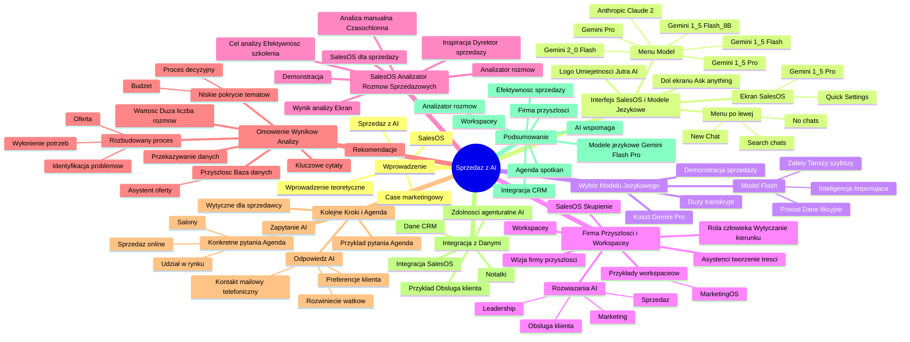

# Lekcje wideo - 4. Sprzedaż

# 💡 Diagram

___

# 🗒️ Notatka

# Notatki i Podsumowanie - Sprzedaż z AI

## Wprowadzenie (00:00:05 - 00:00:16)

* Case marketingowy został omówiony.
* Przejście do tematu sprzedaży z wykorzystaniem `AI`.
* Prezentacja interfejsu `SalesOS`.
* Krótkie wprowadzenie teoretyczne.

## Interfejs SalesOS i Modele Językowe (00:00:16 - 00:00:29)

* **Ekran:** `SalesOS`, `Quick Settings`, `Gemini 1.5 Pro`.
    * Menu po lewej stronie: `+ New Chat`, `Search chats`, `No chats`.
    * Logo Umiejętności Jutra AI po prawej stronie.
    * Dół ekranu: "Ask anything. Type "@" for assistants, "/" for prompts, "#" for files, and "!" for tools."
* Możliwość wyboru modelu językowego, nawet w ramach jednego dostawcy (Google).
* **Ekran:** Rozwijane menu `Model`: `Gemini 1.5 Pro`.
    * Dostępne opcje: `Gemini 2.0 Flash`, `Gemini 1.5 Flash`, `Gemini 1.5 Flash-8B`, `Gemini 1.5 Pro`, `Gemini Pro`, `Anthropic Claude 2`.

## Wybór Modelu Językowego - Flash vs. Pro (00:00:29 - 00:01:29)

* Demonstracja sprzedaży z `AI` wymagała przetworzenia obszernego transkryptu (godzinna rozmowa).
* Przetwarzanie dużych transkryptów przez **Gemini Pro** jest kosztowne (przykład: około 1 zł za godzinę rozmowy).
* **Użycie modelu Flash zamiast Pro:**
    * **Powód:** Zadanie polegało na zastąpieniu danych klientów danymi fikcyjnymi (Google, Sergiej Brin), co nie wymagało pełnej mocy obliczeniowej modelu Pro.
    * **Zalety Flash:** Jest tańszy, szybszy i efektywnie przetwarza duże ilości danych przy niskim koszcie.
    * **Inteligencja Flash:** Nadal imponująca, choć mniej zaawansowana niż Pro.

## Firma Przyszłości i Workspace'y (00:01:29 - 00:02:33)

* Wizja **firmy przyszłości**: `Workspace'y` dedykowane różnym procesom i funkcjom w przedsiębiorstwie.
* **Ekran:** `SalesOS` z menu po lewej stronie: `+ New Workspace`, `Search workspace`, `Home`, `Advanced Prompts`, `AI Journaling`, `BusinessOS`, `CustomerOS`, `Leadership Coach`, `MarketingOS`, `SalesOS`.
* Przykłady `workspace'ów`: `MarketingOS` (asystenci do tworzenia treści).
    * Asystenci wspomagają różne zadania: tworzenie informacji prasowej, scenariusza wideo.
    * Rola człowieka: wytyczanie kierunku, reakcja, wyrażanie opinii, wprowadzanie poprawek – `AI` ułatwia pracę, ale nie zastępuje ludzkiego wkładu.
* Rozwiązania `AI` dla marketingu, sprzedaży, obsługi klienta, leadershipu i innych obszarów działalności.
* Skupienie na **SalesOS** – rozwiązaniu dedykowanym sprzedaży.

## SalesOS - Analizator Rozmów Sprzedażowych (00:02:33 - 00:04:01)

* `SalesOS` dla sprzedaży to przestrzeń z dedykowanym asystentem: **Analizatorem rozmów sprzedażowych**.
* Inspiracją był dyrektor sprzedaży, który ręcznie analizował rozmowy handlowe.
    * Manualna analiza jest czasochłonna i pracochłonna (odsłuchiwanie godzin nagrań – "średniowiecze").
    * Analizator rozmów sprzedażowych stworzono z myślą o dyrektorach sprzedaży.
* **Demonstracja Analizatora:**
    * Wprowadzenie zmodyfikowanej rozmowy z klientem (dane fikcyjne: Google, Sergiej Brin – ochrona danych).
    * Cel analizy: podniesienie efektywności sprzedawców, dostarczenie materiałów szkoleniowych.
* **Ekran:** Wynik analizy rozmowy sprzedażowej.
    * **Analiza rozmowy sprzedażowej:**
        * Data: Brak (wniosek: przed 22.01.2025).
        * Uczestnicy: Sergey Brin (klient), Nikodem Czaja, Milivoj Puskar, Wojciech Burczyk (sprzedawcy).
    * **1. Pokrycie tematów:**
        * Cele biznesowe: 68%
        * Proces decyzyjny: 28%
        * Identyfikacja bólu: 70%
        * Budżet: 18%
    * **2. Mocne strony:**
        * Identyfikacja "bólów" klienta (brak zmapowanych procesów, potrzeba prezentacji rozwiązań AION, integracji, chatbotów).
        * Próba dopasowania rozwiązań (automatyzacja marketingu, chatbot dla obsługi klienta).
        * Dobre rozpoczęcie rozmowy (agenda, budowanie relacji).
    * **3. Obszary do poprawy:**
        * Zbyt mało konkretnych pytań o cele biznesowe (ekspansja to zbyt ogólne pojęcie).
        * Niewystarczające zgłębienie procesu decyzyjnego.
        * Powierzchowne omówienie kwestii budżetu.
        * Zbyt długie monologi sprzedawców (Wojtek). "Mniej mówienia, więcej słuchania!"
    * **4. Rekomendacje:**
        * "Dogłębniej zbadaj cele biznesowe:" (pytania o konkretne, mierzalne cele ekspansji).
        * "Skoncentruj się na procesie decyzyjnym:" (identyfikacja osób decyzyjnych).
        * "Zapytaj o `ROI`:" (oczekiwany zwrot z inwestycji).
        * "Prezentuj rozwiązania w kontekście korzyści biznesowych."
        * "Ogranicz monologi i zadawaj więcej pytań:" (aktywne słuchanie klienta).
    * **5. Kluczowe cytaty:**
        * "My jesteśmy na bardzo wstępnym etapie rozglądania się nawet i wahania tego..."
        * "My jesteśmy przykładem firmy, która nie ma tego kompletnie zmapowanego."
        * "Początkowo bym chciał skupić na marketingu, dlatego że to bym chciał potrakt..."
        * "Ja mam świadomość tego, jak wiele nie wiem, jeżeli chodzi o automatyzację, w..."
        * "Generalnie wy jesteście tutaj o wiele bardziej do przodu niż my."
        * "Zbierajmy te nisko wiszące owoce, na początku je domyjmy, później też jak b..."

## Omówienie Wyników Analizy (04:01 - 05:28)

* Analizator zwrócił uwagę na niskie pokrycie tematów procesu decyzyjnego i budżetu (10-20%).
* Przedstawiono rekomendacje dotyczące poprawy.
* **Kluczowe cytaty** – przydatne do weryfikacji oferty i potrzeb klienta.
* **Przyszłość**: Dane z rozmów (kluczowe cytaty) przechowywane w bazie danych.
    * Kolejny asystent może analizować ofertę pod kątem potrzeb zidentyfikowanych przez `AI`.
* Rozbudowany proces, oparty na naturalnym toku myślenia:
    * Identyfikacja problemów klienta -> Wyłonienie potrzeb -> Przygotowanie oferty.
* Przekazywanie danych między etapami procesu – szybsze i trafniejsze oferty, lepsze przygotowanie do spotkań, skuteczniejsze odpowiadanie na potrzeby klienta.
* Szczególnie wartościowe przy dużej liczbie rozmów sprzedażowych i trudnościach z zapamiętywaniem szczegółów.

## Kolejne Kroki i Agenda Następnego Spotkania (05:28 - 07:28)

* Możliwość zapytania `AI` o podsumowanie kluczowych punktów z poprzednich rozmów.
* **Przykład pytania do AI:** "Powiedz mi, jak zaplanować kolejne spotkanie i jaka powinna być jego agenda."
* **Odpowiedź AI:**
    * Sugestia kontaktu mailowego/telefonicznego z podziękowaniem i propozycją kolejnego spotkania.
    * Dostosowanie się do preferencji klienta.
    * Potwierdzenie zrozumienia potrzeb i rozwinięcie istotnych wątków (cele biznesowe, `KPI`).
* **Konkretne pytania do klienta (przykłady agendy):**
    * "Jaki jest wasz docelowy udział w rynku europejskim za cztery lata?"
    * "Ile nowych salonów planujecie otworzyć?"
    * "O ile chcecie zwiększyć sprzedaż online?"
* Szczegółowe wytyczne dla sprzedawcy dotyczące dalszych działań.

## Integracja z Danymi i Kolejny Przykład (07:28 - 07:35)

* Interfejs `SalesOS` można zintegrować z danymi z `CRM`, notatkami i innymi źródłami.
* Kolejny przykład (obsługa klienta) – zdolności agenturalne `AI` (zaprezentowano przykład z zachowaniem prywatności).

## Podsumowanie

Prezentacja `SalesOS` jako narzędzia wspierającego sprzedaż poprzez analizę rozmów handlowych z wykorzystaniem `AI`. Kluczowe elementy to:

* **Workspace'y** dla różnych działów firmy, w tym `SalesOS`.
* **Analizator rozmów sprzedażowych** – automatyzacja analizy rozmów, identyfikacja mocnych i słabych stron sprzedawców, generowanie rekomendacji.
* Wykorzystanie modeli językowych **Gemini Flash i Pro** w zależności od potrzeb (koszt, poziom inteligencji).
* Integracja z danymi z **CRM** i innych źródeł.
* Wizja **firmy przyszłości** opartej na `AI` wspomagającej procesy biznesowe.
* Zwiększenie efektywności sprzedaży poprzez lepsze zrozumienie potrzeb klienta i szybsze reagowanie na nie.
* `AI` jako narzędzie **wspomagające, a nie zastępujące** pracę człowieka.
* Możliwość generowania **agendy kolejnych spotkań** oraz **kluczowych pytań** na podstawie analizy rozmów.

___

# 🔉 Transcript
File: Lekcje wideo - 4. Sprzedaż.mp4 
[00:00:05] No dobrze moi drodzy, więc omówiliśmy sobie case marketingowy.
[00:00:09] (Ekran: Case 3: Sprzedaż)
[00:00:11] Teraz przejdziemy do sprzedaży, ale kolejna kapka elementów interfejsu, które mogą być dla was interesujące i trochę jeszcze przy okazji teoretycznej wiedzy.
[00:00:16] (Ekran: SalesOS, Quick Settings, Gemini 1.5 Pro. Po lewej stronie ekranu znajduje się menu z opcjami: + New Chat, Search chats, No chats. Po prawej stronie ekranu logo Umiejętności Jutra AI. Na dole ekranu: Ask anything. Type "@" for assistants, "/" for prompts, "#" for files, and "!" for tools.)
[00:00:19] Tak jak wspominałem, tutaj możecie wybrać sobie dowolny model językowy i zwróćcie uwagę, że nawet wewnątrz jednego dostawcy, takiego jak Google, możecie wybrać różnego rodzaju języki.
[00:00:28] (Ekran: Rozwija się menu Model: Gemini 1.5 Pro. Dostępne opcje: Gemini 2.0 Flash, Gemini 1.5 Flash, Gemini 1.5 Flash-8B, Gemini 1.5 Pro, Gemini Pro, Anthropic Claude 2.)
[00:00:29] I kiedy przygotowywałem się do demonstracji możliwości sprzedażowych AI, musiałem przetworzyć bardzo duży transkrypt tekstu.
[00:00:37] On naprawdę to był godzinna rozmowa i to przetwarza tysiące tych tokenów, czyli przetworzenie tej rozmowy przez Gemini Pro kosztowałoby tam powiedzmy, no nie wiem, niech będzie złotówkę.
[00:00:48] Nie mam tego kalkulatora w głowie.
[00:00:50] Tak jak wspominałem, jestem osobą nietechniczną, ale wiedząc, że mam do wykonania takie zadanie, nie ma sensu używać bardzo inteligentnego modelu, kiedy jedyne o co chciałem poprosić, to żeby podmienił realne dane naszych klientów, potencjalnych klientów na dane, w których, że niby rozmawiamy z Googlem i z Sergiejem Brinem.
[00:01:11] Więc wiedziałem, że żeby zrobić coś takiego, muszę użyć modelu Flash, modelu, który jest tańszy, szybszy i może przetworzyć bardzo duże ilości rzeczy bardzo tanio, bez jakiejś wielkiej inteligencji.
[00:01:22] Oczywiście ona i tak jest niesamowita, ale nie jest aż tak wysublimowana jak inteligencja modelu Pro.
[00:01:29] W związku z tym, pokażę wam jeszcze jedną rzecz, czyli powoli zaczynacie rozumieć jak wygląda firma przyszłości.
[00:01:36] Mówiłem, że misją, którą ja czuję jest budowanie firm przyszłości.
[00:01:40] I moim zdaniem zmierzamy trochę do miejsca, w którym ludzie będą mieli coś w rodzaju takich workspaceów, które tutaj pokazuję na lewym sidebarze.
[00:01:51] (Ekran: SalesOS, Quick Settings, Gemini 1.5 Pro. Po lewej stronie ekranu znajduje się menu z opcjami: + New Workspace, Search workspace, Home, Advanced Prompts, AI Journaling, BusinessOS, CustomerOS, Leadership Coach, MarketingOS, SalesOS. Po prawej stronie ekranu logo Umiejętności Jutra AI. Na dole ekranu: Ask anything. Type "@" for assistants, "/" for prompts, "#" for files, and "!" for tools.)
[00:01:51] I w tych miejscach będą osadzone rozwiązania konkretne dla danego procesu, czy dla dla danej funkcji w firmie.
[00:01:57] Czyli widzieliście przed chwilą Marketing OS, jak ja to nazywam, czyli miejsce, w którym jest szereg asystentów do tworzenia treści.
[00:02:04] Możemy sobie wyobrazić, że jestem asystent do tworzenia informacji prasowej, scenariusza wideo i oczywiście nadal tam na końcu jest potrzebna wykwalifikowana osoba, która znajdzie te wytyczne, będzie na to reagować, opiniować, poprawiać, ale jednak ułatwia nam to bardzo mocno pracę.
[00:02:22] No i z drugiej strony, przechodząc dalej, rozwiązania dla marketingu, sprzedaży, obsługi klienta, leadershipu, czy innych takich funkcji czy zastosowań w organizacji.
[00:02:33] Teraz skupimy się na tej sprzedażowej.
[00:02:35] I tutaj, z racji tego, że jest więcej danych wrażliwych, to stworzyłem taki takie miejsce, gdzie mamy tylko jednego dzema, jednego asystenta.
[00:02:43] I wybierzemy sobie analizatora rozmów sprzedażowych.
[00:02:49] Nasz dyrektor sprzedaży jest mega zaciętym gościem i on spędził naprawdę długie godziny na przesłuchiwaniu rozmów handlowych ludzi ze sprzedaży, z działu sprzedaży w naszych firmach.
[00:03:03] I no trzeba przyznać, że czapki z głów, że mu się chciało i przynosi to efekty taki trening, ale często, żeby zidentyfikować do której rozmowy warto zajrzeć, albo o jakiś powtarzających się problemach na tych rozmowach, powtarzających się pytaniach klientów, no robienie tego manualnie, odsłuchując godzinę nagrań, to jest dla mnie absolutne średniowiecze.
[00:03:21] I on niedawno stworzył dla samego siebie właśnie tego analizatora rozmów sprzedażowych.
[00:03:28] I teraz pozwólcie, że zademonstruję jego możliwości.
[00:03:32] Wklejam już mu tutaj tą gotową przerobioną rozmowę z klientem, gdzie udajemy, że rozmawiamy z Googlem, żeby chronić jego dane.
[00:03:40] Tutaj chodzi przede wszystkim o analizę performanceu naszych sprzedawców, po to, żeby byli jak najlepsi w tym co robią i żeby mogli dostać odpowiedni trening od naszego dyrektora sprzedaży.
[00:03:52] (Ekran: Pojawia się okno Analizator rozmów sprzedażowych. Analiza rozmowy sprzedażowej: Data: Brak (wnioskuję z kontekstu, że rozmowa odbyła się przed 22.01.2025). Uczestnicy: Sergey Brin (klient), Nikodem Czaja (sprzedawca), Milivoj Puskar (sprzedawca), Wojciech Burczyk (sprzedawca). 1. Pokrycie tematów: Cele biznesowe: 68%, Proces decyzyjny: 28%, Identyfikacja bólu: 70%, Budżet: 18%. 2. Mocne strony: Identyfikacja kilku "bólów" klienta, n.in. brak znapowanych procesów, potrzeba prezentacja szerokiego wachlarza rozwiązań oferowanych przez firmę (AION, integracje, chatboty). Próba dopasowania rozwiązań do potrzeb klienta (np. automatyzacja marketingu, chatbot dla obsługi klienta). Dobry początek rozmowy - ustalenie agendy i budowanie relacji. 3. Obszary do poprawy: Zbyt mało konkretnych pytań o cele biznesowe klienta (ekspansja to za mało). Niewystarczające zagłębienie się w proces decyzyjny. Brak informacji o tym, zbyt pobieżne omówienie aspektów budżetowych. Brak pytań o dostępne środki, zbyt długa monologi sprzedawców, zwłaszcza Wojtka. Mniej mówienia, więcej słuchania! 4. Rekomendacje: "Zbadaj dogłębniej cele biznesowe:" Zapytaj o konkretne, mierzalne cele związane z ekspansją. "Skup się na procesie decyzyjnym:" Zidentyfikuj osoby decyzyjne ("Kto oprócz "bocybay" o ROI:" Zapytaj o oczekiwany zwrot z inwestycji ("Jakie oszczędności "Przedstaw rozwiązania w kontekście korzyści biznesowych:" Zamiast wymi "Skróć monologi i zadawaj więcej pytań:" Aktywnie słuchaj klienta i 5. Kluczowe cytaty: "My jesteśmy na bardzo wstępnym etapie rozglądania się nawet i wahania tego "My jesteśmy przykładem firmy, która nie ma tego kompletnie zmapowanego." "Początkowo bym chciał skupić na marketingu, dlatego że to bym chciał potrakt "Ja mam świadomość tego, jak wiele nie wiem, jeżeli chodzi o automatyzację, w "Generalnie wy jesteście tutaj o wiele bardziej do przodu niż my." "Zbierajmy te nisko wiszące owoce, na początku je domyjmy, później też jak b")
[04:01] No i to jest bardzo ciekawe, ponieważ tutaj dostaliśmy takie wytyczne.
[04:07] Uczestnicy: Sergiej Brin klient, Nikodem i Milivoj sprzedawcy.
[04:14] I tak dalej.
[04:15] To zwróćcie uwagę, że on zwrócił już na wstępie, że pokrycie tematów takich jak proces decyzyjny i budżet klienta nie zostało w ogóle poruszone.
[04:24] Ocenia to na 10-20%.
[04:27] W związku z czym mogę się spodziewać, że za chwilę dostanę do tego konkretne rekomendacje.
[04:33] Jakie są mocne strony?
[04:34] Zidentyfikowaliśmy kilka painpointów klienta.
[04:37] Próbowaliśmy dopasować rozwiązania do jego potrzeb i ustaliliśmy agendę, zbudowaliśmy relacje małym, fajnym small talkiem.
[04:44] Jednak było za mało konkretnych pytań o cele biznesowe klienta i zbyt pobieżnie omówiliśmy aspekty biznesowe.
[04:52] I to są rekomendacje co do następnych kroków.
[04:58] Tu są bardzo fajne kluczowe cytaty, które można wykorzystać na przykład do później sprawdzania, czy oferta, którą przygotowaliśmy, odpowiada na potrzeby klienta.
[05:08] Bo w tym świecie przyszłości te wszystkie dane, jak kluczowe cytaty klienta, można przechowywać w bazie danych i później w kolejnym etapie procesu sprzedażowego, kolejny asystent może na przykład sprawdzić ofertę, czy odpowiada na potrzeby, które AI zidentyfikował w analizie transkryptów z rozmów z tym klientem.
[05:28] Jak widzicie, to się robi coraz bardziej rozbudowane, coraz bardziej skomplikowane, ale te wszystkie rzeczy to jest normalny proces myślowy i decyzyjny człowieka, w którym musimy zidentyfikować bolączki klienta, wyłonić je, odpowiedzieć na nie ofertą i jeśli w danych to idzie i jest przekazywane dalej z miejsca do miejsca, z punktu do punktu, to jesteśmy w stanie zaskoczyć klienta szybciej przygotowaną, bardziej trafioną ofertą, lepszym przygotowaniem do spotkań, lepszym odpowiadaniem na jego potrzeby i szczególnie, jeżeli mamy na przykład dużo rozmów sprzedażowych i nie pamiętamy tak dokładnie szczegółów każdej rozmowy, a też nie mamy czasu, żeby przeglądać te wszystkie rzeczy, więc możecie sobie wyobrazić, że równie dobrze sprzedawca i to wam pokażę w kolejnym przykładzie, może na przykład zapytać o czym, co było ważne dla klienta w ostatnich trzech rozmowach, bo nie pamiętam, wrócił po miesiącu i zapomniałem.
[06:20] I przez to, że mamy podpięte źródła danych, takich jak na przykład transkrypty rozmów sprzedażowych do naszego interfejsu, w którym sobie działamy, jestem w stanie taką informację uzyskać.
[06:32] No dobrze, to poprośmy go w takim razie, powiedz mi jak zsetupować kolejne spotkanie i jak powinna wyglądać jego agenda.
[06:51] No i trzeba tylko się odezwać do Sergeja mailowo lub telefonicznie, dziękując za poprzednią rozmowę i proponując kolejne spotkanie.
[07:02] Dostosować się do preferencji klienta i potwierdzić, że dobrze zrozumieliśmy ich potrzeby i rozwinąć te wątki takie jak cele biznesowe i KPI.
[07:15] I tu zobaczcie, mamy nawet konkretne pytania, które można zadać klientowi, czyli na przykład jaki jest wasz docelowy udział w rynku w Europie za cztery lata?
[07:21] Ile nowych salonów próbujecie otworzyć?
[07:24] O ile chcecie zwiększyć sprzedaż online?
[07:26] I tego typu rzeczy.
[07:28] Więc tutaj mamy bardzo dokładnie rozpisane, co taki sprzedawca może zrobić.
[07:35] Więc jak widzicie, ten interfejs można nakładać na dowolne dane z CRM-u, z notatek, z przeróżnych źródeł i już w następnym przykładzie dotyczącym obsługi klienta pokażę wam drobne zdolności agenturalne AI na jedynym przykładzie, który mogę pokazać bez łamania jakiś tam zasad prywatności.

___
# 🏷️ Tags
#sales #AI #SalesOS #modele_językowe #Gemini_1.5_Pro #Quick_Settings #New_Chat #Search_chats #Umiejętności_Jutra_AI #Gemini_2.0_Flash #Gemini_1.5_Flash #Gemini_1.5_Flash-8B #Gemini_Pro #Anthropic_Claude_2 #Flash_vs_Pro #transkrypt #tokeny #firma_przyszłości #Workspace #New_Workspace #Search_workspace #Home #Advanced_Prompts #AI_Journaling #BusinessOS #CustomerOS #Leadership_Coach #MarketingOS #asystenci #tworzenie_treści #informacja_prasowa #scenariusz_wideo #marketing #obsługa_klienta #leadership #Analizator_rozmów_sprzedażowych #dyrektor_sprzedaży #analiza_rozmów_handlowych #efektywność_sprzedawców #materiały_szkoleniowe #Sergey_Brin #Nikodem_Czaja #Milivoj_Puskar #Wojciech_Burczyk #pokrycie_tematów #cele_biznesowe #proces_decyzyjny #identyfikacja_bólu #budżet #mocne_strony #słabe_strony #rekomendacje #kluczowe_cytaty #ROI #baza_danych #oferta #potrzeby_klienta #agenda #KPI #CRM #dane #integracja #automatyzacja #wspomaganie_pracy #efektywność_sprzedaży #dalsze_działania #pytania_do_klienta #udział_w_rynku #sprzedaż_online #zdolności_agenturalne
