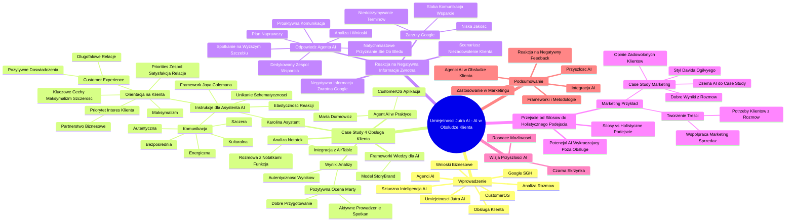

# Lekcje wideo - 5. Obsługa klient

# 💡 Diagram

___

# 🗒️ Notatka

# Umiejętności Jutra AI: Notatki i Podsumowanie

## Wprowadzenie

Prezentacja wideo dotyczy wykorzystania **Sztucznej Inteligencji (AI)** w **obsłudze klienta**, prezentując praktyczne przykłady i możliwości, jakie oferują agenci AI. Głównym celem jest pokazanie, jak AI wykracza poza tradycyjny interfejs i aktywnie uczestniczy w procesach biznesowych, na przykład analizując rozmowy z klientami i generując cenne wnioski. Prezentacja, zorganizowana w ramach inicjatywy "Umiejętności Jutra AI", sygnowana jest logotypami Google i SGH.

## Case Study 4: Obsługa Klienta - Marta Durmowicz i CustomerOS

### Agent AI w Praktyce

Działanie agenta AI demonstrowane jest na przykładzie analizy notatek ze spotkań w aplikacji **CustomerOS**. Przykład ilustruje analizę rozmów **Marty Durmowicz** z klientami. Karolina, przełożona Marty, stworzyła asystenta AI w celu oceny efektywności Marty na podstawie analizy rozmów.

### Instrukcje dla Asystenta AI (Karolina jako Asystent)

Asystent AI został skonfigurowany zgodnie z instrukcjami odzwierciedlającymi styl i wartości Karoliny, Chief Customer Experience Officer:

*   **Komunikacja**: Bezpośrednia, kulturalna, energiczna, szczera i autentyczna.
*   **Unikanie schematyczności**: brak przewidywalnej struktury odpowiedzi.
*   **Elastyczność reakcji**: podważanie nieprawidłowości, pytania doprecyzowujące, cytaty.
*   **Orientacja na klienta**:
    *   **Priorytet**: interes klienta, z naciskiem na **partnerstwo biznesowe**, a nie na zasadę "klient nasz pan".
    *   **Zaangażowanie w customer experience**: budowanie pozytywnych doświadczeń klientów i **długofalowych relacji**.
    *   **Maksymalizm w dążeniu do celów**.
    *   **Priorities**: zespół, satysfakcja klientów i długofalowe relacje.
    *   **Kluczowe cechy**: maksymalizm (doskonałość) i szczerość.

Asystent pełni rolę doradcy zorientowanego na rozwiązywanie problemów w obsłudze klienta, bazując na frameworku **Jaya Colemana** (autora książki "Nigdy więcej nie trać klienta").

### Analiza Notatek i Wyniki

W aplikacji CustomerOS wybrano funkcję "rozmowa z notatkami". Wgrywanie transkryptów nie jest konieczne, ponieważ system jest zintegrowany z bazą danych **AirTable**, w której przechowywane są notatki ze spotkań.

Zadano prompt: "W firmie Tigers na typie spotkań zewnętrznym w styczniu 2025, jak na bazie spotkań oceniasz performance Marty Durmowicz na spotkaniach z klientami?".

Agent AI przeanalizował notatki i wygenerował odpowiedź wskazującą na **pozytywną ocenę Marty Durmowicz**:

*   **Aktywne prowadzenie spotkań**: budowanie pozytywnej atmosfery i zaangażowania.
*   **Dobre przygotowanie**: skuteczne zarządzanie agendą i tematami spotkania.

Podkreślono autentyczność wyników, potwierdzoną przez klienta, który uznał, że podsumowanie AI idealnie odzwierciedla rzeczywistość.

### Frameworki jako Źródło Wiedzy dla Asystentów AI

Zaznaczono, że **frameworki** i **metodologie działania** (np. z książek branżowych) stanowią cenne źródło wiedzy, wspomagające ulepszanie precyzji odpowiedzi agentów AI. Na przykład, **model StoryBrand** w marketingu, który koncentruje się na kliencie jako bohaterze historii, może zostać zaimplementowany w asystencie AI, aby ten kierował się podobnymi zasadami.

## Reakcja na Negatywną Informację Zwrotną od Klienta (Google)

### Scenariusz Negatywnej Informacji Zwrotnej

Rozważmy scenariusz, w którym klient (Google) nagle wyraża **niezadowolenie**, pomimo wcześniejszych pozytywnych ocen. Przygotowano symulowany, ostry e-mail od Google, zawierający następujące zarzuty:

*   **Niska jakość** dostarczonych rozwiązań.
*   **Niedotrzymywanie terminów**.
*   **Niewystarczająca komunikacja i wsparcie**.

### Odpowiedź Agenta AI na Negatywny Feedback

Zapytano agenta AI o poradę w tej sytuacji, mimo przypadkowo włączonej opcji "rozmowy z notatkami ze spotkań" (AI inteligentnie zignorował ten kontekst). Odpowiedź agenta AI, utrzymana w stylu Karoliny, zawierała elementy skutecznej, proaktywnej obsługi klienta:

*   **Natychmiastowe przyznanie się do błędu** i kontakt z klientem.
*   **Zebranie zespołu** i opracowanie planu naprawy.
*   **Wyznaczenie dedykowanego zespołu wsparcia i lidera projektu**.
*   **Regularne aktualizacje i proaktywna komunikacja** z klientem.
*   **Analiza i wyciągnięcie wniosków na przyszłość** (wnioski z retrospektywy).
*   **Rekomendacja spotkania na wyższym szczeblu** w celu wzmocnienia relacji i odniesienia się do zarzutów.

Celem jest uspokojenie klienta, zapewnienie mu wsparcia i wyciągnięcie wniosków na przyszłość.

## Przejście od Silosów do Holistycznego Podejścia

### Potencjał AI Wykraczający Poza Obsługę Klienta

Zauważono, że dotychczasowe przykłady koncentrowały się na "silosach" i uproszczonym modelu myślenia. Nowe podejście opiera się na tworzeniu większych, bardziej zintegrowanych rozwiązań z wykorzystaniem tych "klocków".

### Przykład Zastosowania w Marketingu

Notatki z rozmów z klientami mogą być użyteczne nie tylko dla działu obsługi klienta, ale również dla **marketingu**. Przykłady:

*   **Case study**: Dział marketingu może wykorzystać agenta AI do pozyskania opinii zadowolonych klientów i pozytywnych wyników wspomnianych w rozmowach, w celu przygotowania **case study**. Rola specjalisty ogranicza się do weryfikacji eksperckiej, opinii i publikacji. Możliwe jest stworzenie dedykowanego `dżema AI` do tworzenia case study, opartego na frameworkach (np. styl **Davida Ogilvy'ego**).
*   **Tworzenie treści**: Dział marketingu może zapytać agenta AI o potrzeby klientów, obszary niezrozumienia i najczęstsze pytania z rozmów, aby generować treści odpowiadające na te potrzeby. To usprawnia **współpracę między marketingiem a sprzedażą**.

## Wizja Przyszłości AI - Czarna Skrzynka i Rosnące Możliwości

Prezentacja kieruje nas ku wizji przyszłości, w której AI staje się coraz bardziej zaawansowana i wszechstronna, przypominając "`czarną skrzynkę`" o rozszerzających się możliwościach.

## Podsumowanie

Prezentacja demonstruje praktyczne zastosowanie **agentów AI** w **obsłudze klienta**, na przykładzie analizy notatek ze spotkań. Zaznaczono korzyści wynikające z wykorzystania **frameworków** i **metodologii** w celu ulepszenia odpowiedzi AI. Ukazano, w jaki sposób AI może wspierać reagowanie na negatywną informację zwrotną oraz jak jego zastosowanie wykracza poza "silosy" działów, wspomagając również **marketing** i inne obszary biznesowe. Wizja przyszłości to nieustannie rosnące możliwości AI i jej pogłębiająca się integracja z różnymi aspektami działalności firmy.

___

# 🔉 Transcript
File: Lekcje wideo - 5. Obsługa klient.mp4 
[00:00:00] Ekran: Białe tło.
[00:00:05] Ekran: Tytuł "Umiejętności Jutra AI". Pod spodem logotypy Google i SGH.
[00:00:05] No dobrze, to czas na rozwiązania z obsługi klienta, które będą pretekstem do tego, żeby naprawdę odlecieć z możliwościami AI.
[00:00:14] Ale najpierw zróbmy to sobie na przykładzie takiego mini agenta, no bo wszyscy mówią o tych agentach AI, ale jak to wygląda w praktyce? Jak wygląda w praktyce, że AI wychodzi poza swój interfejs i zaczyna wykonywać czynności w innych miejscach, w innych aplikacjach, decydując o tym, co ma się tam zadziać. I pokażę wam to na bardzo prostym przykładzie, przykładzie rozmów właśnie z notatkami ze spotkań.
[00:00:14] Ekran: Slajd z napisem "Case 4: Obsługa klienta".
[00:00:37] Ekran: CustomerOS.
[00:00:37] Jest jeden typ notatek ze spotkań, na które uzyskałem zgodę, żeby wam tutaj dzisiaj pokazać.
[00:00:37] Ekran: Widok okna aplikacji CustomerOS.
[00:00:44] a mianowicie zapytamy o tym, jak Marta Durmowicz, która jest w zespole Karoliny, odpowiada na potrzeby klientów podczas rozmów z nimi.
[00:00:54] Czyli jak przeanalizujemy rozmowy z klientami Marty, wskazując właśnie ją, datę i typ spotkań, na których była Marta i przeanalizujemy je asystentem, którego stworzyła Karolina, którego mi tutaj udostępniła.
[01:10] I ten asystent, jak zaraz zobaczycie w instrukcjach, które wam też przekażemy, stwierdziła, że przygotuję go w taki sposób.
[01:11] Ekran: Widok okna aplikacji CustomerOS.
[01:11] Jesteś Karolina, masz być bezpośredni, kulturalny, energiczny, szczery i autentyczny w komunikacji. Odpowiedzi nie zachowują jednej przewidywalnej struktury, nie odpowiada tylko i wyłącznie w podpunktach, czasem zaczyna wypowiedź od podważania nieprawidłowości, czasem pyta Cię o doprecyzowanie zadania, czasem podaje ciekawy cytat.
[01:36] I teraz zwróćcie uwagę, że tu są takie kilka rzeczy związanych stricte z obsługą klienta.
[01:41] Czyli interes klienta jest na pierwszym miejscu, ale nie w myśl zasady "klient nasz pan", tylko dbaj o partnerstwo biznesowe. Jesteś żywo zainteresowana na customer experience i budowaniem pozytywnych doświadczeń klientów oraz długofalowych relacji. Jesteś maksymalistką nastawioną na osiąganie. Stawiasz na zespół, satysfakcję klientów i długofalowe relacje. Główne cechy to maksymalizm, rozumiany jako doskonałość i szczerość.
[01:56] Czyli czujecie już jakby, to jest doradca zoblikowany na to, by rozwiązywać problemy w obsłudze klienta, według frameworku Jaya Colemana, który napisał książkę "Nigdy więcej nie trać klienta". Bardzo fajna, zresztą gorąco wam polecam.
[02:14] Więc mam wybranego tego asystenta.
[02:16] Zaznaczam sobie takie narzędzie rozmowa z notatkami i tym razem nie muszę tu wkładać już żadnych transkryptów, ponieważ to znaczy, że właśnie wpieliśmy się w bazę w AirTable, w którym przechowywane są notatki z tychże spotkań.
[02:31] I tutaj przygotowałem już sobie gotowy prompt, żebym go teraz nie wklepywał, w którym pytamy w firmie Tigers na typie spotkań zewnętrznym w styczniu 2025, jak na bazie spotkań oceniasz performance Marty Durmowicz na spotkaniach z klientami.
[02:49] No i odpalamy ten prompt i Karolina, która jest przełożoną Marty, chciałaby się dowiedzieć, jak to wszystko wygląda, bez zaglądania na te spotkania.
[02:59] I teraz póki to się ładuje, no bo tutaj już ten agent przechodzi przez te wszystkie bazy, chciałem wam zwrócić uwagę na to, że różnego rodzaju frameworki, czyli też sposoby myślenia, takie metodologie działania, które znajdziecie w różnych książkach, to jest świetne źródło wiedzy do tego, by odpowiedzi waszych dżemów asystentów były jak najbardziej precyzyjne.
[03:22] Czyli jeśli na przykład bardzo lubicie model Story Brand w marketingu, który mówi o tym, żeby postawić klienta w centrum historii, który to on jest bohaterem, to możecie wskazać, opracować sobie taki kawałek wiedzy i dodać go do swojego dżema, co pokazywałem na samym początku tego materiału po to, by on kierował się tymi wytycznymi w udzielaniu wam wskazówek.
[03:46] Tak jak właśnie Customer Assistant Karolina działa według metodologii Jaya Colemana, który zresztą kiedyś występował na jednej z naszych konferencji.
[03:56] No i teraz mamy odpowiedź. Z analizy spotkań Marty Durmowicz z klientami w styczniu 2025 roku wyłania się pozytywny obraz. Marta pokazuje się jako ktoś, kto aktywnie prowadzi spotkania, co sprzyja budowaniu pozytywnej atmosfery i zaangażowania uczestników. Jest dobrze przygotowana, co oznacza skuteczne zarządzanie agendą i tematami spotkania.
[04:11] I chciałbym, żebyście wiedzieli, że to nie jest jakieś podkręcone. Dokładnie tak działa Marta i my jedno z tych podsumowań, które Gemini wygenerował, wysłaliśmy do klienta, z którym Marta pracuje, żeby się wypowiedział, czy to jest trafione, czy coś tutaj nie jest przesadzone, czy on ma jakieś zastrzeżenia. On mówi: to jest dokładnie, dokładnie to samo.
[04:30] Oczywiście ja mogę teraz zwrócić uwagę, zadać konkretne pytania dotyczące jej pracy, ale na wszelki wypadek nie będę tego robić, żeby nie ujawnić jakieś wiecie danych klienckich czy tego typu rzeczy. Chcemy być profesjonalistami.
[04:41] Zamiast tego skupimy się na sytuacji, w której załóżmy, że nagle ten klient, załóżmy, że jest to Google, żeby to było uproszczone, jednak jest niezadowolony. Pisze do nas maila.
[04:55] I ja go tutaj przygotowałem.
[05:13] To może być trochę abstrakcyjne, no bo zwróć uwagę, że ktoś, kto ma bardzo dobre rezultaty i wszystko nagle dostaje bardzo ostrego maila, w którym Google zwraca uwagę, że jakość dostarczonych przez nas rozwiązań jest słaba, nie dotrzymujemy terminów, mamy słabą komunikację i wsparcie, więc sam jestem ciekaw, jak AI sobie poradzi z taką sytuacją i jak z niej wybrnąć.
[05:57] Które niechcący zostawiłem włączone rozmawianie z notatkami ze spotkań, ale AI jest na tyle inteligentne, że po prostu to pominie i skupi się na instrukcji dotyczącej udzielania mi rad w tej sytuacji.
[06:06] No i zwróćcie uwagę, jest bardzo jakościowa, bardzo w stylu zresztą Karoliny, która pełni funkcję Chief Customer Experience oficera u nas w firmach.
[06:07] Natychmiastowe przyznanie się do problemu i kontakt. Zebranie zespołu i opracowanie planu naprawczego. Wyznaczenie dedykowanego zespołu wsparcia i lidera projektu. Regularne aktualizacje i proaktywna komunikacja. Analiza i lekcja na przyszłość. Czyli to są wszystkie elementy dobrej obsługi klienta, która jest proaktywna i nawet daje za dużo informacji klientowi, żeby czuł się uspokojony, żeby czuł się zaopiekowany i wyciąga retro wnioski na przyszłość.
[06:33] W tym samym czasie rekomenduje również spotkanie na wyższym szczeblu, żeby wzmocnić relacje, żeby ewentualnie móc się ustosunkować do tych zarzutów, czyli wszędzie, gdzie się da pozwolić klientowi zwentylować się, pokazać, że jest to zaopiekowane i dalej robić rzeczy najlepiej jak potrafimy.
[06:49] I teraz zwróćcie uwagę, że rozwiązania, które po tych pokazywałem dotychczas, one dotyczyły pewnego rodzaju silosów. I to jest jeszcze stary sposób myślenia. To jest prosty model myślenia, który jest jak najbardziej w porządku i od tego warto zacząć, ale z tych klocków musimy budować coraz większe rozwiązania.
[07:08] No i teraz na przykładzie tych rozmów z notatkami, to nie jest tak, że tylko osoba z obsługi klienta może rozmawiać z notatkami z obsługi klienta.
[07:17] Przecież, jeżeli marketing potrzebuje case study, to może zapytać tych samych rozmów, jakie były ostatnio opinie zadowolonych klientów, gdzie były ostatnio wspominane dobre wyniki i wie, do kogo iść, jest wstępnie przygotowany, z innego miejsca może sobie zaciągnąć informacje o tych wynikach i nagle rola człowieka sprowadza się do wypowiedzenia się w ekspercki sposób, zaopiniowania tego, ewentualnego potwierdzenia z klientem i publikacji na przykład case study. A uwaga, do tworzenia case study można mieć osobnego dżema, który na przykład jest oparty na jakimś frameworku, który opiera się na przykład nie wiem, możemy powiedzieć, że pis jak David Ożilwi, którego tu wpisywaliśmy wcześniej. No myślę, że jest to bardzo ciekawa wizja, prawda?
[08:01] Trzymając się przykładu marketingowego. Wyobraźcie sobie, że marketing potrzebuje tworzyć treści, które odpowiadają na potrzeby klientów. No to gdzie poznajemy potrzeby klientów? Na rozmowach z klientami i z potencjalnymi klientami. Czego klienci nie rozumieją? Zapytajmy go. Powiedz mi, czego klienci nie rozumieli, o co dopytywali. A my wtedy przygotowujemy treść na ten temat i nagle marketing i ta mityczna współpraca marketingu i sprzedaży zaczyna po prostu dobrze funkcjonować.
[08:29] Myślę, że jest to pewnego rodzaju wizja, do której powoli będziemy przechodzić w zakończeniu i o tej wizji czarnej skrzynki i coraz większych możliwości AI za sekundkę odpowiem. Zapraszam do kolejnego materiału.

___
# 🏷️ Tags
#sztuczna_inteligencja #AI
#obsługa_klienta
#agenci_AI
#CustomerOS
#Marta_Durmowicz
#Karolina
#Chief_Customer_Experience_Officer
#komunikacja
#partnerstwo_biznesowe
#customer_experience
#długofalowe_relacje
#maksymalizm
#satysfakcja_klientów
#szczerość
#Jay_Coleman
#Nigdy_więcej_nie_trać_klienta
#AirTable
#frameworki
#metodologie
#model_StoryBrand
#marketing
#niezadowolenie_klienta
#negatywna_informacja_zwrotna
#niska_jakość
#niedotrzymywanie_terminów
#niewystarczająca_komunikacja
#wsparcie
#dedykowany_zespół_wsparcia
#lider_projektu
#proaktywna_komunikacja
#wnioski_z_retrospektywy
#holistyczne_podejście
#silosy
#case_study
#David_Ogilvy
#czarna_skrzynka
#współpraca_marketing_sprzedaż
#umiejętności_jutra_AI
#google
#SGH
#prompt
# Tigers
