# Lekcje wideo - 6. Wizja przyszłości

# 💡 Diagram

```mermaid
mindmap
  root((Przyszlosc AI i Biznesu))
    Przyszlosc_AI
      Optymistyczna_Wizja
      Workspace_y
        Platformy_Dzemow
        Przykłady_Workspace_ow
          Home
          Advanced_Prompts
          AI_Journaling
          BusinessOS
          CustomerOS
          Leadership_Coach
          MarketingOS
          SalesOS
      Plan_Premium
        97_99_PLN_miesiac
        Zaawansowane_Funkcje
        Pierwszy_Miesiac_0_PLN
    Modele_Wykorzystania_AI
      Model_Platnosci_za_Tokeny
        Enterprise
        Srednie_Firmy
        Redukcja_Kosztow
        Integracja_z_Narzedziami
        Zdolnosci_Agenturalne
      Plan_Premium_Advanced_Gemini
        Uproszczony_Model
        Google_Docs_Zrodla_Wiedzy
    Baza_Danych_i_Wikipedia_Firmowa
      Interfejs_AI_LLM
      Baza_Danych
        Dane_Liczbowe
        Dane_Bazodanowe
      Wikipedia_Firmowa
        Google_Sheets_Podstawowy_Model
        Zaawansowana_Wikipedia
          Poziomy_Dostepu
    Prawo_Moorea_i_Moc_Obliczeniowa
      Prawo_Moorea
        Wzrost_Mocy_Obliczeniowej
      Przyspieszenie_Wzrostu
      Komputery_Kwantowe
      Moc_Obliczeniowa_Fundament_AI
    AI_to_nie_Banka_Spekulacyjna
      Uproszczone_Opinie
      Zaawansowanie_Modeli_AI
      Brak_Fosy_Konkurencyjnej
      Wzrost_IQ_Modeli
        Przekracza_Inteligencje_Czlowieka
      Efektywne_Przetwarzanie_Danych
    Inteligencja_Modeli_AI_i_Ograniczenia
      Asystent_AI_w_Smartfonie
        Przewyzsza_Ludzka_Inteligencje_Wasko
      Mylace_Okreslenie_AI
      AI_Model_Statystyczny
        Brak_Prawdziwej_Inteligencji
      Nie_Przeceniac_Inteligencji_Gemini
      AI_nie_Generuje_Innowacji_Samoistnie
      AI_nie_Projektuje_Sieci_Agentow_Samoistnie
        Nadzor_Czlowieka
    Trendy_i_Wizja_Przyszlosci
      Doskonalsze_Modele_AI
      Gemini
        Najszersze_Okno_Kontekstowe
        Ekonomiczne_Przetwarzanie_Tokeny
      Kluczowe_Trendy
        Rozlegle_Konteksty
        Spadek_Kosztow_Przetwarzania
      Wizja_Przedsiebiorstwa_Przyszlosci
    Integracja_Dzemow
      Dedykowane_Dzemy
        Procesy_Biznesowe_HR_Marketing
      Selekcja_Optymalizacja_Wspoldzielenie_Dzemow
        Efektywnosc
      Integracja_Dzemow
        Polaczenie_Danych
          Doradztwo_Klienta
          Notatki_ze_Spotkan
          Strategia_Marketingowa
          Wyniki_Raporty
      Gemini_Analiza_Danych_Rekomendacje
      Stopniowe_Wdrażanie_AI
        Od_Prostego_Dzema_do_Sieci_Agentow
      Swiat_Agentow_AI
        Tasma_Produkcyjna_Dzemow
          Automatyzacja_Zadan
            LinkedIn_Promocja_Budzet
    Kolejne_Kroki_we_Wdrażaniu_AI
      Prostota_Tworzenia_Dzemow
      Brak_Kompleksowej_Wizji_w_Polskich_Firmach
      Kompetencje_AI
        Atrakcyjna_Umiejetnosc
          Rynek_Pracy
          Freelancerzy
    Firma_jako_Asystent_AI
      Docelowy_Model_End_Goal
        Brak_Tradycyjnego_Interfejsu
        Konwersacja_z_Asystentem_Google
      AI_Odpowiedzi_Akcje_Mozliwosci
      Kluczowy_Etap_Tworzenie_Dzemow
    Podsumowanie
      Obiecujaca_Przyszlosc_AI
      AI_Uzyteczne_Narzedzie_Biznesowe
        Brak_Autonomicznej_Inteligencji
      Wdrażanie_AI_Dżemy_Ewolucja
      Wizja_Firmy_Zarzadzanej_przez_AI
      Przewaga_Konkurencyjna_Wczesne_Wdrozenia
      Rozpoczecie_od_Prostych_Dzemow
    Kontakt
      Franciszek_Georgiew
        Instagram
        LinkedIn
        Email
      Zaproszenie_do_Kontaktu
        Pytania_Przemyslenia
```

___

# 🗒️ Notatka

# Szczegółowe Notatki i Podsumowanie Prezentacji Wideo o AI

## Wprowadzenie

Prezentacja stanowi podsumowanie potencjału sztucznej inteligencji (AI) oraz prognozę rozwoju tej technologii, ze szczególnym uwzględnieniem zastosowań biznesowych. Mówca dzieli się swoimi przemyśleniami i wizją przyszłości AI, opierając się na eksperckiej wiedzy, intuicji oraz bieżącym śledzeniu trendów branżowych.

## Przyszłość AI i Workspace'y

*   Przyszłość AI prezentuje się niezwykle optymistycznie.
*   **Workspace'y** to platformy, w obrębie których tworzone są `dżemy` (asystenci AI), zdolne do realizacji zadań, doradztwa i utrwalania wiedzy.
*   `Dżemy` mogą wspierać użytkownika na każdym etapie pracy, wykonując drobne zadania i dostarczając wskazówek.
*   Przykładowe **workspace'y**: Home, Advanced Prompts, AI Journaling, BusinessOS, CustomerOS, Leadership Coach, MarketingOS, SalesOS.
*   **Plan Premium (97,99 zł/miesiąc, pierwszy miesiąc za 0 zł)** – oferuje dostęp do zaawansowanych funkcji.

### Modele wykorzystania AI

*   Dwa modele wykorzystania AI:
    1.  **Model płatności za tokeny:**
        *   Korzyści dla przedsiębiorstw (Enterprise) i średnich firm.
        *   Redukcja kosztów licencji.
        *   Integracja z narzędziami firmowymi.
        *   Budowanie `zdolności agenturalnych` – delegowanie AI do firmowych narzędzi w celu podejmowania decyzji i realizacji działań.
    2.  **Plan Premium (Advanced Gemini):**
        *   Uproszczony model.
        *   Możliwość podłączania plików (Google Docs) jako źródeł wiedzy dla `dżemów`.

### Baza danych i `Wikipedia firmowa`

*   Interfejs AI (typu LLM) integruje się z bazą danych.
*   Baza danych obejmuje:
    *   Dane liczbowe i bazodanowe.
    *   `Wikipedia firmowa`:
        *   Opcja przechowywania danych w Google Sheets (dostępna nawet w podstawowym modelu).
        *   Zaawansowana `Wikipedia` z poziomami dostępu, analogiczna do wdrożonej w firmie prelegenta.

## `Prawo Moore'a` i moc obliczeniowa

*   `Prawo Moore'a`: Moc obliczeniowa mikroprocesorów wzrasta w szybkim i przewidywalnym tempie.
*   W ostatnim czasie obserwuje się przyspieszenie wzrostu mocy obliczeniowej.
*   Komputery kwantowe w przyszłości mogą jeszcze bardziej zwielokrotnić moc obliczeniową maszyn.
*   Wzrost mocy obliczeniowej stanowi fundament rozwoju AI, ponieważ wszelkie działania AI opierają się na operacjach obliczeniowych.

## AI to nie bańka spekulacyjna

*   Opinie postrzegające AI jako bańkę spekulacyjną są **uproszczone**.
*   Modele AI z roku na rok stają się **coraz bardziej zaawansowane**.
*   W sektorze AI brakuje trwałej przewagi konkurencyjnej – firmy technologiczne dynamicznie adaptują innowacje konkurencji, niwelując tzw. "fosę".
*   Średni poziom IQ modeli językowych systematycznie rośnie, **przekraczając inteligencję przeciętnego człowieka**.
*   Trend wzrostu inteligencji modeli AI ilustruje wykres (choć prezentowane dane mogą być nieco starsze, sam trend pozostaje aktualny).
*   Modele AI stają się coraz efektywniejsze w **przetwarzaniu danych**.

## Inteligencja modeli AI i jej ograniczenia

*   Już wkrótce osobisty asystent AI w smartfonie może przewyższyć ludzką inteligencję w wąsko zdefiniowanej dziedzinie.
*   Określenie "**Artificial Intelligence**" jest **mylące**.
*   AI w rzeczywistości **nie posiada prawdziwej inteligencji** – to zaawansowany `model statystyczny`.
*   Nie należy ulegać **przecenieniu "inteligencji"** modeli takich jak Gemini.
*   AI **nie generuje innowacji samoistnie** – realizuje zadania zdefiniowane przez ludzi.
*   AI nie jest zdolne do samodzielnego projektowania sieci agentów – niezbędny jest nadzór i interwencja człowieka.

## Trendy i wizja przyszłości

*   Modele AI stają się coraz doskonalsze i łatwiejsze w implementacji.
*   **Gemini** wyróżnia się **najszerszym `oknem kontekstowym`** i ekonomicznym przetwarzaniem dużych wolumenów danych (rozliczenie za tokeny).
*   Kluczowe trendy:
    *   Przetwarzanie coraz rozleglejszych kontekstów.
    *   Spadek kosztów przetwarzania danych.
*   Te tendencje kształtują konkretną wizję przedsiębiorstwa przyszłości.

### Integracja `Dżemów`

*   Dedykowane `dżemy` dla poszczególnych procesów biznesowych (HR, marketing, etc.).
*   Selekcja, optymalizacja i współdzielenie `dżemów` w zespole podnosi efektywność organizacji.
*   **Integracja `dżemów`:**
    *   Połączenie doradztwa dla klienta z notatkami ze spotkań.
    *   Integracja ze strategią marketingową klienta, wynikami i raportami.
    *   Gemini, dzięki rozbudowanemu `oknu kontekstowemu`, może inteligentnie analizować te dane i formułować rekomendacje.
*   Wdrażanie AI rozpoczyna się od prostego `dżema`, a następnie firma stopniowo rozbudowuje sieć powiązań między asystentami AI.
*   **Świat agentów AI: `Taśma produkcyjna dżemów`**, gdzie zadania automatycznie przechodzą między kolejnymi agentami.
    *   Przykład: Automatyczna publikacja posta na LinkedIn, uruchomienie promocji i alokacja budżetu przez AI.

### Kolejne kroki we wdrażaniu AI

*   Stworzenie pojedynczych `dżemów` jest stosunkowo proste, jednak **niewiele polskich firm realizuje kompleksową wizję integracji AI**.
*   Kompetencje w zakresie wdrażania AI stanowią **atrakcyjną umiejętność na rynku pracy**, również dla freelancerów.

### Firma jako Asystent AI

*   **Docelowy model (End goal):** Eliminacja tradycyjnego interfejsu – interakcja z firmą na zasadzie konwersacji z Asystentem Google.
*   AI udziela odpowiedzi, realizuje polecenia w aplikacjach, dysponując stale rosnącymi możliwościami.
*   **Kluczowy etap na drodze do tego celu:** Tworzenie różnorodnych `dżemów`.

## Podsumowanie

Przyszłość AI rysuje się obiecująco, napędzana coraz potężniejszymi modelami i rosnącą mocą obliczeniową. Kluczowe jest zrozumienie, że AI, pomimo braku autonomicznej inteligencji, staje się niezwykle użytecznym narzędziem, zwłaszcza w biznesie. Wdrażanie AI poprzez kreowanie i integrację `dżemów` (asystentów AI) to ewolucyjny proces, prowadzący do wizji firmy zarządzanej przez AI, dostępnej na każde żądanie, niczym asystent głosowy. Przedsiębiorstwa, które wcześnie rozpoznają i zaczną wdrażać te technologie, zdobędą znaczącą przewagę konkurencyjną. Warto rozpocząć od prostych inicjatyw, tworząc pojedyncze `dżemy` i stopniowo rozwijając bardziej złożone systemy agenturalne.

**Kontakt:** Franciszek Georgiew - Instagram, LinkedIn, email. Zapraszam do kontaktu z pytaniami i dzielenia się swoimi przemyśleniami.

___

# 🔉 Transcript
File: Lekcje wideo - 6. Wizja przyszłości.mp4 
[00:00:05] No dobrze, po tej małej próbce możliwości AI, czas na podsumowanie i troszeczkę taki wgląd w przyszłość.
[00:00:13] Na tyle na ile moja intuicja, wiedza i śledzenie tych newsów na co dzień pozwalają mi cokolwiek wróżyć, wieszczyć.
[00:00:22] Ale powiem wam, że moim zdaniem ta przyszłość wygląda bardzo fajnie i starałem się wam to zarysować w takich kolejnych krokach.
[00:00:31] Czyli z jednej strony pokazałem wam workspace'y, w ramach których powstał szereg dżemów, którzy mogą realizować za was części zadań, doradzać wam i ogólnie utrwalać wiedzę, którą zdobędziecie w formie wytycznych dla tych asystentów AI dżemów, żeby robili za was małe rzeczy.
[00:00:49] Więc jest to pewnego rodzaju zapowiedź tego, jak ta praca może wyglądać, że na każdym kroku takie wsparcie dostajemy.
[00:00:55] (Ekran: Po lewej stronie ekranu widać okno z napisem "WITH A PREMIUM PLAN 97,99 zł/month 0 zł for the first month" i listą punktów. Po prawej stronie ekranu widać listę: "Home", "Advanced Prompts...", "AI Journaling", "BusinessOS", "CustomerOS", "Leadership Coach", "MarketingOS", "SalesOS".)
[00:00:55] Z drugiej strony pokazałem wam dwa modele korzystania z AI, skupiając się na tym, w którym płacimy za tokeny i na jego przewagach, jeśli chodzi o zastosowania stricte Enterprise, czy chociażby dla średniego biznesu, ponieważ tam będziemy w stanie już oszczędzić na większej liczbie licencji, wpinać się w narzędzia, które macie w firmie i powoli zacząć budować drobne zdolności agenturalne, czyli takie, które AI wysyłamy do jednego z naszych narzędzi i mówimy mu, żeby podejmował pewne decyzje i wykonywał w nich pewne drobne działania.
[01:28] No i finalnie właśnie starałem się zarysować, że za tym interfejsem, który jest bardzo prosty i przypomina interfejs dowolnego narzędzia typu LLM, kryje się właśnie baza danych.
[01:40] Baza danych, która dzieli się z jednej strony na dane liczbowe i takie typowo bazodanowe rzeczy, ale też Wikipedia firmowa, którą możecie na przykład trzymać w Google Sheetsach i nawet w tym prostszym modelu, w którym korzystacie po prostu z planu Advanced Gemini, po prostu podpinacie różnego rodzaju pliki w właśnie w Google Docsach jako źródło wiedzy do waszych dżemów.
[02:03] Albo tak jak my tworzycie dużą Wikipedię firmową, w której już są poziomy dostępów dla odpowiednich ludzi i tak dalej.
[02:09] Więc jeśli mniej więcej rozumiecie te różnice, a mam nadzieję, że udało się to przekazać, to skupmy się na tym dokąd to prowadzi.
[02:17] (Ekran: Wykres zatytułowany "Moore's Law".)
[02:17] Zwróćcie uwagę, że istnieje coś takiego jak prawo Moore'a, które mówi o mocy obliczeniowej tak naprawdę chipów, mikroprocesorów, która no w niesamowitym tempie rośnie i w dosyć przewidywalnym tempie.
[02:31] Co więcej, ostatnio ona zaczęła się zaginać do góry, więc wszelkiego rodzaju przewidywania, szczególnie jeżeli weźmiemy pod uwagę, że na horyzoncie są komputery kwantowe i to czy to będzie blisko czy nie blisko, uwierzcie mi, moc maszyn będzie coraz większa do wykonywania coraz potężniejszych operacji.
[02:49] A przecież wszystko to co robimy, to są swego rodzaju operacje i to możemy dosyć intuicyjnie czuć.
[02:54] W związku z tym wszystkie osoby, które twierdzą, że AI to bańka, że to jest kolejne tam te kluby różne NFT, że to jest jedna wielka spekulacja, no to są bardzo powierzchowne opinie, ponieważ weźmy też pod uwagę kolejną rzecz.
[03:10] Te modele z roku na rok stają się coraz bardziej inteligentne.
[03:14] (Ekran: Wykres z zaznaczonymi modelami AI i ich poziomem IQ.)
[03:14] Co więcej, w samym świecie AI mamy do czynienia z takim zjawiskiem, że firmy technologiczne takie jak Google i wszystkie inne, które produkują tego rodzaju modele i w nie inwestują, nie mają fosy, czyli jeśli któraś, tak fosa to jest takie coś, co utrudnia konkurentom wejścia na ten rynek.
[03:33] I to co jest ciekawe, że nawet jeżeli któryś model przez chwilę jest lepszy, to każdy z tych dużych konkurentów dosyć szybko go kopiuje.
[03:41] W związku z tym te modele, to jest bardzo stary wykres, na którym nie udało mi się niestety znaleźć nowszego, który pokazuje średnie IQ modeli językowych i dzisiaj zarówno modele tam Gemini czy nie wiem szybki Grok, który już się chyba nazywa XAI czy czy czy innego rodzaju modele, które mają jakieś tam swoje unikalne drobne odchylenia do czego są najlepsze, przesuwają się z tą inteligencją powyżej inteligencji średniego człowieka.
[04:08] W związku z tym, jeśli każdy kolejny model jest coraz bardziej inteligentny i coraz sprawniej przetwarza dane, już niedługo w kieszeni będziemy mieli asystenta czy dżema, który przynajmniej w tym wąskim obszarze, który mu wskażemy, będzie inteligentniejszy od nas.
[04:24] To jest bardzo trudne do przetworzenia, bardzo trudne do zaakceptowania, ale tak wygląda nasza przyszłość, że w wielu obszarach będziemy mieli coś, co przynajmniej na papierze ma wyższe IQ.
[04:35] I jeszcze jeden ważny koncept, powiedziałbym taki trochę do zrozumienia czym jest, a czym nie jest AI.
[04:41] Nazwa AI jest bardzo myląca.
[04:44] Artificial intelligence tak naprawdę nie ma inteligencji.
[04:49] Szukamy jej oznak, ale tak naprawdę to jest model statystyczny i ważne, żebyście zrozumieli, że nie czuli się przytłoczeni tym, że nowy Gemini półtora Pro być może już jest inteligentniejszy ode mnie czy od was, nie?
[05:02] To to jest jakby to brzmi strasznie, brzmi trudno, ale tak naprawdę on na ten moment nie tworzy nic.
[05:07] On tylko wysyłamy go tam, gdzie my jako ludzie widzimy dla niego zadanie.
[05:12] On nie jest w stanie dzisiaj sam zdecydować co zrobi, do tego potrzebne jest stworzenie sieci takich małych asystentów agentów AI, którą też tworzy człowiek, ponieważ AI sam tego na ten moment nie jest w stanie zaprojektować.
[05:26] I teraz te modele są coraz lepsze, coraz łatwiej je kopiować, więc nie ma tego ryzyka, że nagle któryś z nich stanie się jakiś strasznie drogi i możecie sobie korzystać na przykład z Gemini, które dzisiaj omawialiśmy, bo on dzisiaj ma na przykład taką przewagę, że ma najszersze okno kontekstowe, czyli najsprawniej radzi sobie z przetwarzaniem ogromnej ilości danych i robi to tanio, jeśli płacimy za tokeny, co już rozumiecie.
[05:51] I to jest właśnie o to chodzi, że z jednej strony będziemy przetwarzać coraz większe konteksty, coraz które za które płacimy tymi tokenami, a z drugiej strony przetwarzanie tego będzie coraz tańsze.
[06:02] Więc to jest trend, który jest absolutnie nie do zatrzymania i prowadzi do pewnej konkretnej wizji firmy.
[06:09] I teraz gdybym miał was zostawić z takim krokiem, jak zrobić następne właśnie kroki w stronę wdrożenia AI u was w firmie czy u was w waszej codziennej działalności.
[06:21] Tu mówimy o zastosowaniach biznesowych, ale oczywiście możecie również podlewać sobie ogród, że tak powiem z AI i pytać jak ta roślinka się podlewa, jak się nazywa i tak dalej, to też jest w porządku, ale skupmy się na zastosowaniach firmowych.
[06:35] Pokazaliśmy kilka procesów, w ramach których można tworzyć tych pojedyncze te dżemy i wyobraźmy sobie, że te kropki to są właśnie dżemy.
[06:43] Załóżmy, że niebieskie są HR-owe, różowe są marketingowe.
[06:47] Ich będzie coraz więcej, trzeba selekcjonować te, które są najlepsze, optymalizować je, udostępniać je innym członkom zespołu, dzięki czemu cała firma staje się coraz bardziej wydajna.
[06:59] W drugiej kolejności zaczynamy je ze sobą łączyć.
[07:03] Czyli mamy sytuację, gdzie z jednej strony dostajemy poradę jak rozmawiać z klientem, ale na przykład łączymy się z notatkami ze spotkań z tym klientem.
[07:12] A w dalszej kolejności połączymy to jeszcze z nie tylko notatkami z bazy klienta, ale na przykład strategią marketingową tego klienta, aktualnymi wynikami tego klienta, ostatnimi raportami tego klienta i na przykład taki Gemini, który ma szerokie okno kontekstowe, będzie w stanie wszystkie te dane inteligentnie przetworzyć i naprawdę rozumieć, chociaż on go tak naprawdę nie rozumie, ale bo nie ma tej inteligencji, ale jest w stanie nam wypluć bardzo dobre rekomendacje czy bardzo dobre rozwiązania na podstawie coraz bardziej zintegrowanych ze sobą rozwiązań.
[07:46] I właśnie zaczynając od tych prostych rzeczy, wasz pierwszy dżem, wasz pierwszy asystent, on będzie krokiem w stronę tego, że później zaczynacie widzieć coraz bardziej te połączenia i w momencie kiedy zaczynacie je widzieć, zaczynacie cały proces, tak jak te kropeczki, coraz bardziej łączyć ze sobą, podawać sobie to z ręki do ręki, tak jak u mnie kolejne kolejne dżemy, kolejni asystenci podawali sobie z ręki do ręki to co wytworzyłem z poprzednim, dokręcając to w jakiś taki sposób.
[08:13] I tak właśnie będzie świat agentów również wyglądać, że w pewnym momencie na tej taśmie produkcyjnej, którą zbudujecie, powiecie no dobrze, to teraz opublikuj ten post na LinkedInie za mnie, bo nie chce mi się logować i tam wchodzić, nie?
[08:25] No dobrze, to skoro już go opublikowałeś, to teraz włącz promocję.
[08:28] A jaką promocję?
[08:29] To już ustal budżet na podstawie, przecież wiesz jaki mam jaki mam miesięczny budżet, jakie mam cele, to wybierz takie, które jest odpowiednie i będziemy takie rzeczy stopniowo budować.
[08:37] O ile tworzenie pojedynczych dżemów wydaje się być bardzo proste i logiczne, to ja dzisiaj rozmawiając z wieloma polskimi firmami, gdzie robimy różnego rodzaju wdrożenia, widzę, że to jest dosyć odjechana wizja i szczerze mówiąc niewiele firm ją naprawdę realizuje.
[08:51] I to jest pewnego rodzaju szansa dla was, że dzisiaj posiadając te umiejętności, będziecie bardzo solidnymi partnerami do biznesu, do rozmowy o tym jak uczynić te firmy bardziej nowoczesnymi, albo po prostu mieć lepszą pozycję, czy to na rynku pracy, czy więcej zarabiać jako freelancerzy i do tego was gorąco zachęcam.
[09:10] Takim end golem, który może być bardzo wizualny, wyobraźcie sobie, że na tą waszą bazę danych, na którą nałożony jest ten interfejs, taki jak ten nasz Ion, który dzisiaj cały czas pokazywałem, wyobraźcie sobie, że docelowo nawet nie ma tego interfejsu.
[09:25] On jest tylko tam, gdzie jest przydatny, a możecie po prostu rozmawiać z firmą jak z asystentem, jak z Google asystentem.
[09:31] Mówicie do niego, on zwraca wam jakieś odpowiedzi, wykonuje za was akcje w różnych małych aplikacjach i ma stopniowo coraz większe możliwości.
[09:40] Tak to niechybnie będzie wkrótce wyglądać, a tym niewidzialnym małym krokiem do tego jest właśnie tworzenie różnego rodzaju dżemów.
[09:49] Tak jak wspominałem, ja się nazywam Franciszek Georgiew.
[09:52] Jeżeli będziecie mieli jakiekolwiek pytania, śmiało odzywajcie się do mnie, gdziekolwiek mnie znajdziecie, Instagram, LinkedIn, adres email.
[10:00] Jestem bardzo otwarty na pomóc wam, a jeżeli materiał wam się podobał, to śmiało dzielcie się tą informacją w mediach społecznościowych, to mi naprawdę bardzo pomoże.
[10:07] Dzięki serdeczne i do usłyszenia.

___
# 🏷️ Tags
#AI #sztuczna_inteligencja #AI_Journaling #BusinessOS #CustomerOS #Leadership_Coach #MarketingOS #SalesOS #workspace #dżem #asystent_AI #model_płatności_za_tokeny #Enterprise #zdolności_agenturalne #plan_premium #Advanced_Gemini #Google_Docs #baza_danych #Wikipedia_firmowa #Google_Sheets #poziomy_dostępu #prawo_Moore'a #moc_obliczeniowa #mikroprocesory #komputery_kwantowe #bańka_spekulacyjna #przewaga_konkurencyjna #IQ #modele_językowe #przetwarzanie_danych #Artificial_Intelligence #model_statystyczny #Gemini #okno_kontekstowe #przetwarzanie_rozległych_kontekstów #koszty_przetwarzania_danych #integracja_dżemów #HR #marketing #efektywność_organizacji #rekomendacje #świat_agentów_AI #taśma_produkcyjna_dżemów #LinkedIn #wdrażanie_AI #rynek_pracy #freelancer #firma_jako_asystent_AI #asystent_Google #Franciszek_Georgiew #integracja_AI
