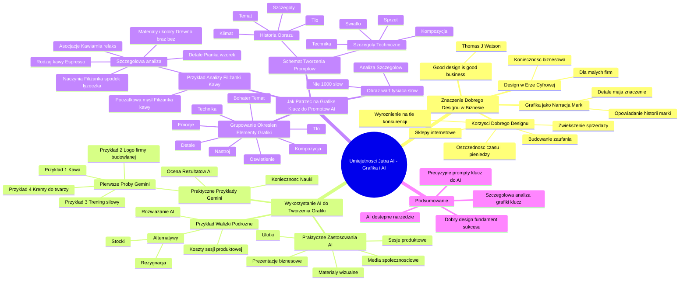

# Lekcje wideo - 1. Tworzenie grafik

# 💡 Diagram

___

# 🗒️ Notatka

# Notatki i Podsumowanie Transkrypcji Wideo: Umiejętności Jutra AI - Grafika i AI 🤖

## Wprowadzenie

Prezentacja \"Umiejętności Jutra AI\" koncentruje się na kluczowym znaczeniu **dobrego designu** w biznesie, zwłaszcza w erze cyfrowej, oraz na wykorzystaniu **sztucznej inteligencji (AI)** do tworzenia profesjonalnych materiałów graficznych. Krystian Wydro z AI Creative Director + OtterMind omawia, w jaki sposób AI może wspierać firmy, szczególnie te mniejsze, w generowaniu atrakcyjnych wizualnie materiałów marketingowych i produktowych.

## Znaczenie Dobrego Designu w Biznesie

### \"Good design is good business\" - Thomas J. Watson 🗣️

* **Podstawowa zasada:** Dobry design bezpośrednio przekłada się na wymierne korzyści biznesowe.
* **Nie tylko estetyka:** Design stanowi strategiczne narzędzie biznesowe, wykraczające poza kwestie czysto wizualne.

### Przykłady i Korzyści Dobrego Designu ✅

* **Sklepy internetowe 🛒:** Porównanie sklepu z chaotycznym i przejrzystym interfejsem – intuicyjny design skutecznie zachęca do zakupów.
* **Budowanie zaufania 🤝:** Profesjonalny wygląd materiałów znacząco wzmacnia wiarygodność firmy.
    *  Analogia do garnituru na spotkaniu biznesowym – pierwsze wrażenie ma fundamentalne znaczenie.
* **Oszczędność czasu ⏱️ i pieniędzy 💰:** Efektywny design procesów i materiałów graficznych.
    * Czytelna faktura = mniej zapytań od klientów.
    * Intuicyjna aplikacja = redukcja kosztów obsługi klienta.
* **Zwiększenie sprzedaży 📈:** Atrakcyjne wizualnie produkty i marketing skutecznie przyciągają uwagę i motywują do zakupu.
    * Porównanie do wystawy sklepowej, która zatrzymuje przechodniów.
* **Wyróżnienie na tle konkurencji 🏆:** Design jako kluczowy element odróżniający ofertę w konkurencyjnym środowisku.

### Design w Erze Cyfrowej 🌐

* **Słowa Watsona nabierają jeszcze większej wagi:** W epoce cyfrowej, gdzie uwaga klienta jest niezwykle ulotna, dobry design to **konieczność biznesowa**, a nie opcjonalny luksus.
* **Szczególnie istotne dla małych firm 🏢:** AI wyrównuje szanse, umożliwiając małym przedsiębiorstwom tworzenie profesjonalnych materiałów graficznych, które wcześniej były domeną dużych korporacji.

### Grafika jako Narracja Marki 📢

* **Nie tylko estetyczny obrazek:** Grafika to przede wszystkim sposób na opowiadanie historii marki.
* **Każdy detal ma znaczenie 🔍:** Kolory, kompozycja i drobne elementy wzmacniają lub osłabiają przekaz marki.

## Wykorzystanie AI do Tworzenia Grafiki 🎨

### Praktyczne Zastosowania AI w Grafice 🚀

* **Tworzenie spójnych i profesjonalnych materiałów wizualnych.**
* **Grafiki do mediów społecznościowych 📱.**
* **Prezentacje biznesowe 📊.**
* **Sesje produktowe 📸.**
* **Ulotki i inne materiały marketingowe 📄.**

### Przykład z Walizkami Podróżnymi 🧳

* **Problem kosztów sesji produktowej:** Wysokie wydatki związane z sesją zdjęciową na całym świecie stanowią wyzwanie dla nowej firmy.
* **Alternatywy:** Rezygnacja z sesji lub korzystanie ze zdjęć stockowych (ryzyko powielania).
* **Rozwiązanie AI:** Sztuczna inteligencja jako efektywne narzędzie do generowania wizualizacji produktów.

## Praktyczne Przykłady Generowania Obrazów w Gemini 🤖

### Pierwsze Próby z Gemini – Przykłady Promptów i Rezultatów 🧪

1. **Prompt:** \"Zrób zdjęcie filiżanki kawy ☕ na stole, profesjonalne, z ładnym rozmytym tłem\".
    * **Rezultat:** Dobre zdjęcie filiżanki kawy z rozmytym tłem, zgodne z oczekiwaniami.

2. **Prompt:** \"Przygotuj logo firmy budowlanej z wywrotką 🚚\".
    * **Rezultat:** Rysunek logo firmy budowlanej z wywrotką, ale bez nazwy firmy – tekst w logo jest losowy.
    * **Poprawa Promptu:** \"Przygotuj logo firmy budowlanej z wywrotką – nazwa firmy TruckPol\".
    * **Rezultat:** Logo z nazwą firmy TruckPol, ale z dodatkowym, niechcianym tekstem w drugiej linii – wciąż wyzwania z tekstem.

3. **Prompt:** \"Przygotuj grafikę z opisem trzech kroków potrzebnych do skutecznego treningu siłowego 💪\".
    * **Rezultat:** Grafika z opisem kroków, ale napisy są słabej jakości, litery rozmyte, teksty niedopasowane. Problemy z tekstem w grafikach AI.

4. **Prompt:** \"Chcę ładne zdjęcie kremów do twarzy 🧴. Najlepiej na ciemnym tle i żeby było widać cień\".
    * **Rezultat:** Zdjęcie kremów do twarzy na ciemnym tle z cieniem, ale nie przedstawiające konkretnych produktów firmy – generuje ogólne obrazy.

### Ocena Pierwszych Rezultatów AI 🤔

* **Profesjonalna ocena grafika:** Rezultaty, choć obiecujące, nie są w pełni satysfakcjonujące dla profesjonalistów.
* **Konieczność nauki 📚:** Należy nauczyć się, jak skutecznie **naprowadzać AI** do tworzenia pożądanych grafik.

## Jak Patrzeć na Grafikę – Klucz do Skutecznych Promptów AI 🔑

### \"Obraz jest wart tysiąca słów\" – Ale nie dosłownie w Promptach AI 😉

* **Nie 1000 słów:** Zazwyczaj wystarcza około 20-30 słów w prompcie.
* **Analiza Szczegółów 🔎:** Kluczowe jest zwracanie uwagi na **detale** w grafice, a nie tylko na ogólny temat.

### Przykład Analizy Zdjęcia Filiżanki Kawy ☕

* **Początkowa myśl:** \"Filiżanka kawy\".
* **Szczegółowa analiza:**
    * **Rodzaj kawy:** Espresso
    * **Naczynia:** Filiżanka, biała, spodek, łyżeczka
    * **Materiały i kolory:** Drewno, stół, blat, ciepło, brąz, beż
    * **Detale:** Pianka, wzorek
    * **Asocjacje:** Ciasto 🍰, cukier, menu, kawiarnia ☕, restauracja 🍽️, przerwa, relaks 🧘, samotność, cisza 🤫, spokój, minimalistyczny, naturalny, codzienność.

### Grupowanie Określeń – Elementy Grafiki 🖼️

* **Dla profesjonalisty zdjęcie to znacznie więcej niż tylko \"kawa na stole\".**
* **Elementy dostrzegane przez profesjonalistę:**
    * **Bohater/Temat**
    * **Kompozycja**
    * **Detale**
    * **Tło**
    * **Nastrój**
    * **Emocje**
    * **Technika**
    * **Oświetlenie**

### Schemat Tworzenia Fotorealistycznych Promptów 📝

* **Dwie główne kategorie elementów promptu:**

    1. **Historia Obrazu:**
        * **Temat:** Co ma przedstawiać obraz.
        * **Klimat:** Nastrój, atmosfera.
        * **Tło:** Kontekst, otoczenie.
        * **Szczegóły:** Dodatkowe elementy w obrazie.

    2. **Szczegóły Techniczne:**
        * **Technika:** Styl artystyczny (fotografia 📸, ilustracja 🎨, 3D).
        * **Sprzęt:** Typ aparatu, obiektywu (jeśli dotyczy).
        * **Światło:** Rodzaj oświetlenia (naturalne ☀️, studyjne, pora dnia).
        * **Kompozycja:** Kadrowanie, perspektywa.

* **Te elementy fundamentalnie wpływają na jakość generowanego obrazu przez AI.**

## Podsumowanie

Prezentacja podkreśla, że **dobry design jest fundamentem sukcesu biznesowego** w dzisiejszych czasach, a **AI staje się powszechnie dostępnym narzędziem** do tworzenia profesjonalnej grafiki dla firm każdej wielkości. Kluczem do efektywnego wykorzystania AI w grafice jest **precyzyjne formułowanie promptów**, uwzględniających nie tylko temat, ale również **szczegóły dotyczące historii obrazu i techniczne aspekty** kompozycji. Zrozumienie tych elementów umożliwia lepsze \"naprowadzenie\" AI, takiego jak Gemini, do generowania grafik idealnie dopasowanych do oczekiwań i potrzeb biznesowych. Zamiast ogólnikowych poleceń, **szczegółowa analiza i opis pożądanej grafiki**, z uwzględnieniem perspektywy profesjonalnego grafika, stanowi klucz do osiągnięcia satysfakcjonujących rezultatów z narzędzi AI do generowania obrazów.

___

# 🔉 Transcript
File: Lekcje wideo - 1. Tworzenie grafik.mp4 
[00:00:00] Ekran: Białe tło.
[00:00:01] Ekran: Czarny napis "Umiejętności" pod spodem "Jutra". Po prawej stronie napis "AI" w kolorach niebieskim, fioletowym i różowym.
[00:00:03] Ekran: Pod napisem "Umiejętności Jutra AI" na dole po lewej stronie napis "Organizator Google" po prawej "Partner edukacyjny SGH".
[00:00:05] Ekran: Mężczyzna w bordowej bluzie siedzi za biurkiem, na którym stoi laptop. W tle po lewej stronie widać logo Google, rośliny doniczkowe i szafkę. Na dole ekranu biały pasek z fioletową linią i gwiazdką.
[00:00:06] Ekran: Pod mężczyzną pojawia się napis "Krystian Wydro AI Creative Director + OtterMind".
[00:00:06] Obraz szybciej niż słowa potrafi wywołać pewne skojarzenia.
[00:00:09] Dlatego dobrze przygotowana grafika będzie kluczem do sukcesu w twoich działaniach marketingowych.
[00:00:15] Ekran: Po prawej stronie pojawia się slajd z napisem "Good design is good business." Pod spodem "Thomas J. Watson".
[00:00:16] Jak powiedział Thomas Watson, "Good design is good business".
[00:00:20] Na najbardziej podstawowym poziomie oznacza to, że dobre projektowanie przekłada się na konkretne korzyści biznesowe.
[00:00:30] Nie jest to tylko kwestia estetyki czy ładnego wyglądu.
[00:00:34] To strategiczne narzędzie biznesowe.
[00:00:37] Wyobraź sobie dwa sklepy internetowe.
[00:00:40] Jeden z chaotycznym, nieczytelnym interfejsem, a drugi z czystym, przejrzystym i intuicyjnym designem.
[00:00:49] W którym chętniej i szybciej zrobisz zakupy?
[00:00:52] Myślę, że nie mamy tutaj żadnych wątpliwości.
[00:00:56] A jak już mówimy o dobrym designie, to warto podkreślić, że buduje on też zaufanie.
[00:01:03] W tej lekcji popracujemy nad grafiką i jej tworzeniem z wykorzystaniem narzędzi AI.
[00:01:11] Profesjonalnie wyglądające materiały sprawiają, że firma jest postrzegana jako bardziej wiarygodna.
[00:01:18] To jak garnitur na ważnym spotkaniu biznesowym.
[00:01:22] Pierwsze wrażenie ma znaczenie.
[00:01:24] Oszczędza czas i pieniądze.
[00:01:27] Dobrze zaprojektowane procesy i materiały graficzne są efektywniejsze.
[00:01:33] Przykładowo, czytelna faktura zmniejsza liczbę pytań od klientów, a intuicyjna aplikacja redukuje koszty obsługi klienta.
[00:01:44] Zwiększa też sprzedaż.
[00:01:46] Atrakcyjnie wizualne produkty i materiały marketingowe przyciągają uwagę i zachęcają do zakupu.
[00:01:53] To jak wystawa sklepowa, która zatrzymuje przechodniów.
[00:01:56] Wyróżnia na tle konkurencji.
[00:01:58] W świecie, gdzie większość produktów ma podobne cechy, to design może być tym, co przekonuje klienta do wyboru właśnie twojej oferty.
[00:02:10] Jak widzisz, w dzisiejszych czasach znaczenie tych słów jest jeszcze większe niż gdy Watson je wypowiadał.
[00:02:17] W epoce cyfrowej, gdzie mamy milisekundy na przykucie uwagi potencjalnego klienta, dobry projekt nie jest już luksusem, jest koniecznością biznesową.
[00:02:29] To szczególnie ważne dla małych firm.
[00:02:32] Kiedyś profesjonalny design był zarezerwowany dla dużych korporacji z ogromnymi budżetami.
[00:02:39] Dziś dzięki narzędziom AI każda firma może sobie stworzyć materiały na profesjonalnym poziomie.
[00:02:45] To wyrównuje szansę w konkurowaniu o uwagę klientów.
[00:02:50] Dobra grafika to nie jest po prostu ładny obrazek.
[00:02:53] To kolejny sposób opowiadania historii waszej marki.
[00:02:58] Każdy kolor, każda kompozycja, każdy detal może wzmocnić wasz przekaz lub go osłabić.
[00:03:06] Pokażę wam dzisiaj, jak wykorzystać AI do tworzenia spójnych, profesjonalnych materiałów wizualnych dla waszego biznesu.
[00:03:15] Zobaczymy jak tworzyć grafiki do social mediów, prezentacji biznesowych czy sesji produktowych.
[00:03:25] Ale co najważniejsze, nauczycie się robić to w sposób przemyślany i celowy.
[00:03:31] Materiały graficzne nie tylko możecie wykorzystywać w tworzeniu swoich ulotek, ale też w social mediach, prezentacjach biznesowych czy uatrakcyjnić własne sesje produktowe.
[00:03:44] Miałem okazję pracować przy kilku tego typu projektach.
[00:03:48] Na przykład firma wprowadzała walizki podróżne na rynek.
[00:03:52] Kiedy dopiero zaczynasz taki biznes, koszty sesji produktowej na całym świecie mogłyby zagarnąć budżet z innych ważnych obszarów, na przykład z reklamy.
[00:04:04] W praktyce albo by nie powstały, albo byłyby z użyciem zdjęć stokowych, gdzie mogłoby się okazać, że ktoś inny lub inna firma korzysta z takiego samego zdjęcia.
[00:04:17] Na szczęście sztuczna inteligencja w tym przypadku okazała się niezwykle skuteczna.
[00:04:23] Przejdźmy jednak do praktyki, jak już pewnie wiesz, w Gemini możemy generować obrazy.
[00:04:30] Zobaczmy jak to działa wpisując przykładowe prompty.
[00:04:30] Ekran: Użytkownik wpisuje w Gemini "Zrób zdjęcie filiżanki kawy na stole, żeby było profesjonalne i ładne rozmyte tło".
[00:04:36] Ekran: Gemini wygenerował zdjęcie filiżanki kawy na stole.
[00:04:42] Mamy pierwszy obraz.
[00:04:46] Dostaliśmy dokładnie to, co chcieliśmy uzyskać.
[00:04:49] Jest rozmyte tło, wszystko się zgadza.
[00:04:53] Ekran: Użytkownik wpisuje w Gemini "Przygotuj mi logo firmy budowlanej z wywrotką".
[00:05:00] Ekran: Gemini wygenerował logo firmy budowlanej z wywrotką.
[00:05:01] No i jak możecie tutaj zauważyć, no jest rysunek.
[00:05:06] Jednak nie podaliśmy nawet nazwy, więc ten tekst w tym wypadku jest dość dziwny, ale możemy spróbować zmienić i dodać nazwę.
[00:05:16] Ekran: Użytkownik wpisuje w Gemini "Przygotuj mi logo firmy budowlanej z wywrotką - nazwa firmy TruckPol".
[00:05:26] Ekran: Gemini wygenerował logo firmy budowlanej z wywrotką o nazwie TruckPol.
[00:05:31] Ale już w drugiej linijce dopisał jakiś tekst, którego nawet nie chcieliśmy, więc tutaj jeszcze, jeszcze jest z tym trochę wyzwań.
[00:05:44] Spróbujemy może teraz zrobić jakiś post na social media.
[00:05:50] Ekran: Użytkownik wpisuje w Gemini "Przygotuj mi grafikę z opisem trzech kroków potrzebnych do skutecznego treningu siłowego".
[00:05:52] Ekran: Gemini wygenerował grafikę z opisem trzech kroków potrzebnych do skutecznego treningu siłowego.
[00:06:00] No i tu już widzicie, że z tymi napisami jest coraz gorzej, bo niektóre nawet litery zaczęły się rozpadać, teksty nie są odpowiednio dobrane.
[00:06:13] Ekran: Użytkownik wpisuje w Gemini "Chcę zrobić ładne zdjęcie kremów do twarzy. Najlepiej na ciemnym tle i żeby było widać cień".
[00:06:23] Ekran: Gemini wygenerował zdjęcie kremów do twarzy na ciemnym tle.
[00:06:27] Super, tylko znów to nie są nasze produkty.
[00:06:32] Zobacz, to są rezultaty jakie otrzymaliśmy.
[00:06:34] Co o nich sądzisz?
[00:06:36] Według mnie, a jestem profesjonalnym grafikiem, nie do końca jest to to, czego bym oczekiwał.
[00:06:44] Ale możemy sobie z tym poradzić.
[00:06:46] Musimy tylko nauczyć się, jak naprowadzić AI do tworzenia tego, co chcemy.
[00:06:54] Zaczniemy od zrozumienia, jak patrzeć na grafikę.
[00:06:59] Znacie powiedzenie obraz jest wart tysiąca słów?
[00:07:03] Czy zatem powinniśmy do Gemini wpisać 1000 słów, aby lepiej nas zrozumiał?
[00:07:10] Nie.
[00:07:11] Myślę, że około 20-30 wystarczy.
[00:07:15] Weźmy prosty przykład, zdjęcie filiżanki kawy.
[00:07:19] Co widzisz?
[00:07:21] Być może pierwsze co ci przyszło do głowy, no widzę filiżankę kawy.
[00:07:29] Nie.
[00:07:30] Musisz zwrócić uwagę na szczegóły.
[00:07:32] Ekran: Po prawej stronie pojawia się slajd z napisem "Opisz co widzisz". Pod spodem zdjęcie filiżanki kawy na drewnianym stole i lista słów: "kawa, espresso, filiżanka, biały, spodek, łyżeczka, drewno, stół, blat, ciepło, brąz, beż, pianka, wzorek, ciasto, cukier, menu, kawiarnia, restauracja, przerwa, relaks, samotność, cisza, spokojny, minimalistyczny, naturalny, codzienność".
[00:07:33] Ja tutaj na przykład widzę, poza oczywiście kawą, że to jest espresso.
[00:07:40] Jest też tam filiżanka.
[00:07:41] Filiżanka jest biała.
[00:07:43] Stoi na spodeczku.
[00:07:45] Jest łyżeczka.
[00:07:47] Drewno, stół, blat, ciepło, brąz, beż, pianka, wzorek, ciasto, cukier.
[00:07:54] Menu, kawiarnia, restauracja i tak dalej i tak dalej możemy wymieniać.
[00:08:03] Także widzisz różnicę?
[00:08:05] To zdjęcie to coś więcej niż tylko filiżanka kawy.
[00:08:09] Ekran: Po prawej stronie pojawia się slajd z napisem "Teraz grupujemy określenia". Pod spodem zdjęcie filiżanki kawy na drewnianym stole i lista słów: "bohater-ka, temat, kompozycja, detale, tło, nastrój, emocje, technika, oświetlenie" w różnych kolorach.
[00:08:09] Teraz ty spróbuj wziąć własne zdjęcie i wypisać podobne szczegóły dotyczące tego, co tam jest.
[00:08:17] To co widzimy na zdjęciu lub jakie emocje się z nim wiążą, to jedno.
[00:08:23] Dla niewprawnego oka to po prostu kawa na stole, ale profesjonalista dostrzeże znacznie więcej.
[00:08:30] Dostrzeże kompozycję, oświetlenie, kolor, nastrój czy też detale, które są w tle.
[00:08:39] Ekran: Po prawej stronie pojawia się slajd z napisem "Schemat tworzenia fotorealistycznych promptów". Pod spodem dwie kolumny: "Historia obrazu" i "Szczegóły techniczne".
[00:08:40] Uwaga, to właśnie te elementy decydują o tym, czy AI prawidłowo wygeneruje nasze zdjęcie.
[00:08:40] Kategoria Historia obrazu: temat, klimat, tło, szczegóły. Kategoria Szczegóły techniczne: technika, sprzęt, światło, kompozycja.
[00:08:40] Przejdźmy jednak do praktyki, jak już pewnie wiesz, w Gemini.
[00:08:40] Ekran: Po prawej stronie pojawia się slajd z napisem "Schemat tworzenia fotorealistycznych promptów". Pod spodem dwie kolumny: "Historia obrazu" i "Szczegóły techniczne".
[00:08:40] Kategoria Historia obrazu: temat, klimat, tło, szczegóły. Kategoria Szczegóły techniczne: technika, sprzęt, światło, kompozycja.
[00:08:40] Przejdźmy jednak do praktyki, jak już pewnie wiesz, w Gemini.
[00:08:40] Ekran: Po prawej stronie pojawia się slajd z napisem "Schemat tworzenia fotorealistycznych promptów". Pod spodem dwie kolumny: "Historia obrazu" i "Szczegóły techniczne".
[00:08:40] Kategoria Historia obrazu: temat, klimat, tło, szczegóły. Kategoria Szczegóły techniczne: technika, sprzęt, światło, kompozycja.
[00:08:40] Przejdźmy jednak do praktyki, jak już pewnie wiesz, w Gemini.
[00:08:40] Ekran: Po prawej stronie pojawia się slajd z napisem "Schemat tworzenia fotorealistycznych promptów". Pod spodem dwie kolumny: "Historia obrazu" i "Szczegóły techniczne".
[00:08:40] Kategoria Historia obrazu: temat, klimat, tło, szczegóły. Kategoria Szczegóły techniczne: technika, sprzęt, światło, kompozycja.
[00:08:40] Przejdźmy jednak do praktyki, jak już pewnie wiesz, w Gemini możemy generować obrazy.
[00:08:40] Ekran: Po prawej stronie pojawia się slajd z napisem "Schemat tworzenia fotorealistycznych promptów". Pod spodem dwie kolumny: "Historia obrazu" i "Szczegóły techniczne".
[00:08:40] Kategoria Historia obrazu: temat, klimat, tło, szczegóły. Kategoria Szczegóły techniczne: technika, sprzęt, światło, kompozycja.
[00:08:40] Przejdźmy jednak do praktyki, jak już pewnie wiesz, w Gemini możemy generować obrazy.
[00:08:40] Ekran: Po prawej stronie pojawia się slajd z napisem "Schemat tworzenia fotorealistycznych promptów". Pod spodem dwie kolumny: "Historia obrazu" i "Szczegóły techniczne".
[00:08:40] Kategoria Historia obrazu: temat, klimat, tło, szczegóły. Kategoria Szczegóły techniczne: technika, sprzęt, światło, kompozycja.
[00:08:40] Przejdźmy jednak do praktyki, jak już pewnie wiesz, w Gemini możemy generować obrazy.
[00:08:40] Ekran: Po prawej stronie pojawia się slajd z napisem "Schemat tworzenia fotorealistycznych promptów". Pod spodem dwie kolumny: "Historia obrazu" i "Szczegóły techniczne".
[00:08:40] Kategoria Historia obrazu: temat, klimat, tło, szczegóły. Kategoria Szczegóły techniczne: technika, sprzęt, światło, kompozycja.
[00:08:40] Przejdźmy jednak do praktyki, jak już pewnie wiesz, w Gemini możemy generować obrazy.
[00:08:40] Ekran: Po prawej stronie pojawia się slajd z napisem "Schemat tworzenia fotorealistycznych promptów". Pod spodem dwie kolumny: "Historia obrazu" i "Szczegóły techniczne".
[00:08:40] Kategoria Historia obrazu: temat, klimat, tło, szczegóły. Kategoria Szczegóły techniczne: technika, sprzęt, światło, kompozycja.
[00:08:40] Przejdźmy jednak do praktyki, jak już pewnie wiesz, w Gemini możemy generować obrazy.
[00:08:40] Ekran: Po prawej stronie pojawia się slajd z napisem "Schemat tworzenia fotorealistycznych promptów". Pod spodem dwie kolumny: "Historia obrazu" i "Szczegóły techniczne".
[00:08:40] Kategoria Historia obrazu: temat, klimat, tło, szczegóły. Kategoria Szczegóły techniczne: technika, sprzęt, światło, kompozycja.
[00:08:40] Przejdźmy jednak do praktyki, jak już pewnie wiesz, w Gemini możemy generować obrazy.
[00:08:40] Ekran: Po prawej stronie pojawia się slajd z napisem "Schemat tworzenia fotorealistycznych promptów". Pod spodem dwie kolumny: "Historia obrazu" i "Szczegóły techniczne".
[00:08:40] Kategoria Historia obrazu: temat, klimat, tło, szczegóły. Kategoria Szczegóły techniczne: technika, sprzęt, światło, kompozycja.
[00:08:40] Przejdźmy jednak do praktyki, jak już pewnie wiesz, w Gemini możemy generować obrazy.
[00:08:40] Ekran: Po prawej stronie pojawia się slajd z napisem "Schemat tworzenia fotorealistycznych promptów". Pod spodem dwie kolumny: "Historia obrazu" i "Szczegóły techniczne".
[00:08:40] Kategoria Historia obrazu: temat, klimat, tło, szczegóły. Kategoria Szczegóły techniczne: technika, sprzęt, światło, kompozycja.
[00:08:40] Przejdźmy jednak do praktyki, jak już pewnie wiesz, w Gemini możemy generować obrazy.
[00:08:40] Ekran: Po prawej stronie pojawia się slajd z napisem "Schemat tworzenia fotorealistycznych promptów". Pod spodem dwie kolumny: "Historia obrazu" i "Szczegóły techniczne".
[00:08:40] Kategoria Historia obrazu: temat, klimat, tło, szczegóły. Kategoria Szczegóły techniczne: technika, sprzęt, światło, kompozycja.
[00:08:40] Przejdźmy jednak do praktyki, jak już pewnie wiesz, w Gemini możemy generować obrazy.
[00:08:40] Ekran: Po prawej stronie pojawia się slajd z napisem "Schemat tworzenia fotorealistycznych promptów". Pod spodem dwie kolumny: "Historia obrazu" i "Szczegóły techniczne".
[00:08:40] Kategoria Historia obrazu: temat, klimat, tło, szczegóły. Kategoria Szczegóły techniczne: technika, sprzęt, światło, kompozycja.
[00:08:40] Przejdźmy jednak do praktyki, jak już pewnie wiesz, w Gemini możemy generować obrazy.
[00:08:40] Ekran: Po prawej stronie pojawia się slajd z napisem "Schemat tworzenia fotorealistycznych promptów". Pod spodem dwie kolumny: "Historia obrazu" i "Szczegóły techniczne".
[00:08:40] Kategoria Historia obrazu: temat, klimat, tło, szczegóły. Kategoria Szczegóły techniczne: technika, sprzęt, światło, kompozycja.
[00:08:40] Przejdźmy jednak do praktyki, jak już pewnie wiesz, w Gemini możemy generować obrazy.
[00:08:40] Ekran: Po prawej stronie pojawia się slajd z napisem "Schemat tworzenia fotorealistycznych promptów". Pod spodem dwie kolumny: "Historia obrazu" i "Szczegóły techniczne".
[00:08:40] Kategoria Historia obrazu: temat, klimat, tło, szczegóły. Kategoria Szczegóły techniczne: technika, sprzęt, światło, kompozycja.
[00:08:40] Przejdźmy jednak do praktyki, jak już pewnie wiesz, w Gemini możemy generować obrazy.
[00:08:40] Ekran: Po prawej stronie pojawia się slajd z napisem "Schemat tworzenia fotorealistycznych promptów". Pod spodem dwie kolumny: "Historia obrazu" i "Szczegóły techniczne".
[00:08:40] Kategoria Historia obrazu: temat, klimat, tło, szczegóły. Kategoria Szczegóły techniczne: technika, sprzęt, światło, kompozycja.
[00:08:40] Przejdźmy jednak do praktyki, jak już pewnie wiesz, w Gemini możemy generować obrazy.
[00:08:40] Ekran: Po prawej stronie pojawia się slajd z napisem "Schemat tworzenia fotorealistycznych promptów". Pod spodem dwie kolumny: "Historia obrazu" i "Szczegóły techniczne".
[00:08:40] Kategoria Historia obrazu: temat, klimat, tło, szczegóły. Kategoria Szczegóły techniczne: technika, sprzęt, światło, kompozycja.
[00:08:40] Przejdźmy jednak do praktyki, jak już pewnie wiesz, w Gemini możemy generować obrazy.
[00:08:40] Ekran: Po prawej stronie pojawia się slajd z napisem "Schemat tworzenia fotorealistycznych promptów". Pod spodem dwie kolumny: "Historia obrazu" i "Szczegóły techniczne".
[00:08:40] Kategoria Historia obrazu: temat, klimat, tło, szczegóły. Kategoria Szczegóły techniczne: technika, sprzęt, światło, kompozycja.
[00:08:40] Przejdźmy jednak do praktyki, jak już pewnie wiesz, w Gemini możemy generować obrazy.
[00:08:40] Ekran: Po prawej stronie pojawia się slajd z napisem "Schemat tworzenia fotorealistycznych promptów". Pod spodem dwie kolumny: "Historia obrazu" i "Szczegóły techniczne".
[00:08:40] Kategoria Historia obrazu: temat, klimat, tło, szczegóły. Kategoria Szczegóły techniczne: technika, sprzęt, światło, kompozycja.
[00:08:40] Przejdźmy jednak do praktyki, jak już pewnie wiesz, w Gemini możemy generować obrazy.
[00:08:40] Ekran: Po prawej stronie pojawia się slajd z napisem "Schemat tworzenia fotorealistycznych promptów". Pod spodem dwie kolumny: "Historia obrazu" i "Szczegóły techniczne".
[00:08:40] Kategoria Historia obrazu: temat, klimat, tło, szczegóły. Kategoria Szczegóły techniczne: technika, sprzęt, światło, kompozycja.
[00:08:40] Przejdźmy jednak do praktyki, jak już pewnie wiesz, w Gemini możemy generować obrazy.
[00:08:40] Ekran: Po prawej stronie pojawia się slajd z napisem "Schemat tworzenia fotorealistycznych promptów". Pod spodem dwie kolumny: "Historia obrazu" i "Szczegóły techniczne".
[00:08:40] Kategoria Historia obrazu: temat, klimat, tło, szczegóły. Kategoria Szczegóły techniczne: technika, sprzęt, światło, kompozycja.
[00:08:40] Przejdźmy jednak do praktyki, jak już pewnie wiesz, w Gemini możemy generować obrazy.
[00:08:40] Ekran: Po prawej stronie pojawia się slajd z napisem "Schemat tworzenia fotorealistycznych promptów". Pod spodem dwie kolumny: "Historia obrazu" i "Szczegóły techniczne".
[00:08:40] Kategoria Historia obrazu: temat, klimat, tło, szczegóły. Kategoria Szczegóły techniczne: technika, sprzęt, światło, kompozycja.
[00:08:40] Przejdźmy jednak do praktyki, jak już pewnie wiesz, w Gemini możemy generować obrazy.
[00:08:40] Ekran: Po prawej stronie pojawia się slajd z napisem "Schemat tworzenia fotorealistycznych promptów". Pod spodem dwie kolumny: "Historia obrazu" i "Szczegóły techniczne".
[00:08:40] Kategoria Historia obrazu: temat, klimat, tło, szczegóły. Kategoria Szczegóły techniczne: technika, sprzęt, światło, kompozycja.
[00:08:40] Przejdźmy jednak do praktyki, jak już pewnie wiesz, w Gemini możemy generować obrazy.
[00:08:40] Ekran: Po prawej stronie pojawia się slajd z napisem "Schemat tworzenia fotorealistycznych promptów". Pod spodem dwie kolumny: "Historia obrazu" i "Szczegóły techniczne".
[00:08:40] Kategoria Historia obrazu: temat, klimat, tło, szczegóły. Kategoria Szczegóły techniczne: technika, sprzęt, światło, kompozycja.
[00:08:40] Przejdźmy jednak do praktyki, jak już pewnie wiesz, w Gemini możemy generować obrazy.
[00:08:40] Ekran: Po prawej stronie pojawia się slajd z napisem "Schemat tworzenia fotorealistycznych promptów". Pod spodem dwie kolumny: "Historia obrazu" i "Szczegóły techniczne".
[00:08:40] Kategoria Historia obrazu: temat, klimat, tło, szczegóły. Kategoria Szczegóły techniczne: technika, sprzęt, światło, kompozycja.
[00:08:40] Przejdźmy jednak do praktyki, jak już pewnie wiesz, w Gemini możemy generować obrazy.
[00:08:40] Ekran: Po prawej stronie pojawia się slajd z napisem "Schemat tworzenia fotorealistycznych promptów". Pod spodem dwie kolumny: "Historia obrazu" i "Szczegóły techniczne".
[00:08:40] Kategoria Historia obrazu: temat, klimat, tło, szczegóły. Kategoria Szczegóły techniczne: technika, sprzęt, światło, kompozycja.
[00:08:40] Przejdźmy jednak do praktyki, jak już pewnie wiesz, w Gemini możemy generować obrazy.
[00:08:40] Ekran: Po prawej stronie pojawia się slajd z napisem "Schemat tworzenia fotorealistycznych promptów". Pod spodem dwie kolumny: "Historia obrazu" i "Szczegóły techniczne".
[00:08:40] Kategoria Historia obrazu: temat, klimat, tło, szczegóły. Kategoria Szczegóły techniczne: technika, sprzęt, światło, kompozycja.
[00:08:40] Przejdźmy jednak do praktyki, jak już pewnie wiesz, w Gemini możemy generować obrazy.
[00:08:40] Ekran: Po prawej stronie pojawia się slajd z napisem "Schemat tworzenia fotorealistycznych promptów". Pod spodem dwie kolumny: "Historia obrazu" i "Szczegóły techniczne".
[00:08:40] Kategoria Historia obrazu: temat, klimat, tło, szczegóły. Kategoria Szczegóły techniczne: technika, sprzęt, światło, kompozycja.
[00:08:40] Przejdźmy jednak do praktyki, jak już pewnie wiesz, w Gemini możemy generować obrazy.
[00:08:40] Ekran: Po prawej stronie pojawia się slajd z napisem "Schemat tworzenia fotorealistycznych promptów". Pod spodem dwie kolumny: "Historia obrazu" i "Szczegóły techniczne".
[00:08:40] Kategoria Historia obrazu: temat, klimat, tło, szczegóły. Kategoria Szczegóły techniczne: technika, sprzęt, światło, kompozycja.
[00:08:40] Przejdźmy jednak do praktyki, jak już pewnie wiesz, w Gemini możemy generować obrazy.
[00:08:40] Ekran: Po prawej stronie pojawia się slajd z napisem "Schemat tworzenia fotorealistycznych promptów". Pod spodem dwie kolumny: "Historia obrazu" i "Szczegóły techniczne".
[00:08:40] Kategoria Historia obrazu: temat, klimat, tło, szczegóły. Kategoria Szczegóły techniczne: technika, sprzęt, światło, kompozycja.
[00:08:40] Przejdźmy jednak do praktyki, jak już pewnie wiesz, w Gemini możemy generować obrazy.
[00:08:40] Ekran: Po prawej stronie pojawia się slajd z napisem "Schemat tworzenia fotorealistycznych promptów". Pod spodem dwie kolumny: "Historia obrazu" i "Szczegóły techniczne".
[00:08:40] Kategoria Historia obrazu: temat, klimat, tło, szczegóły. Kategoria Szczegóły techniczne: technika, sprzęt, światło, kompozycja.
[00:08:40] Przejdźmy jednak do praktyki, jak już pewnie wiesz, w Gemini możemy generować obrazy.
[00:08:40] Ekran: Po prawej stronie pojawia się slajd z napisem "Schemat tworzenia fotorealistycznych promptów". Pod spodem dwie kolumny: "Historia obrazu" i "Szczegóły techniczne".
[00:08:40] Kategoria Historia obrazu: temat, klimat, tło, szczegóły. Kategoria Szczegóły techniczne: technika, sprzęt, światło, kompozycja.
[00:08:40] Przejdźmy jednak do praktyki, jak już pewnie wiesz, w Gemini możemy generować obrazy.
[00:08:40] Ekran: Po prawej stronie pojawia się slajd z napisem "Schemat tworzenia fotorealistycznych promptów". Pod spodem dwie kolumny: "Historia obrazu" i "Szczegóły techniczne".
[00:08:40] Kategoria Historia obrazu: temat, klimat, tło, szczegóły. Kategoria Szczegóły techniczne: technika, sprzęt, światło, kompozycja.
[00:08:40] Przejdźmy jednak do praktyki, jak już pewnie wiesz, w Gemini możemy generować obrazy.
[00:08:40] Ekran: Po prawej stronie

___
# 🏷️ Tags
#good_design #AI #sztuczna_inteligencja #grafika #biznes #digital #materiały_marketingowe #materiały_produktowe #Thomas_J_Watson #sklepy_internetowe #interfejs #zakupy #zaufanie #wiarygodność #pierwsze_wrażenie #oszczędność_czasu #oszczędność_pieniędzy #faktura #aplikacja #obsługa_klienta #zwiększenie_sprzedaży #wystawa_sklepowa #konkurencja #era_cyfrowa #małe_firmy #korporacje #narracja_marki #kolory #kompozycja #media_społecznościowe #prezentacje_biznesowe #sesje_produktowe #ulotki #walizki_podróżne #zdjęcia_stockowe #wizualizacja_produktów #Gemini #prompt #filiżanka_kawy #logo_firmy_budowlanej #TruckPol #trening_siłowy #kremy_do_twarzy #profesjonalny_grafik #naprowadzanie_AI #szczegóły #espresso #naczynia #materiały #asocjacje #kawiarnia #restauracja #relaks #samotność #cisza #spokój #minimalistyczny #naturalny #codzienność #bohater #temat #tło #nastrój #emocje #technika #oświetlenie #fotorealistyczne_prompty #historia_obrazu #klimat #szczegóły_techniczne #sprzęt #kompozycja #sukces_biznesowy #narzędzie #formułowanie_promptów #analiza #generowanie_obrazów #umiejętności_Jutra_AI #AI_Creative_Director #OtterMind #SGH #Google #Krystian_Wydro
