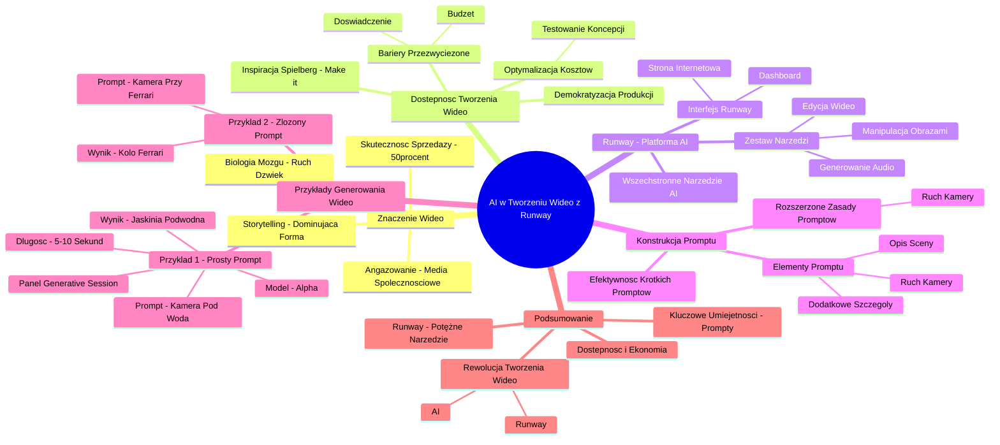

# Lekcje wideo - 2. Tworzenie wideo

# 💡 Diagram

___

# 🗒️ Notatka

# Notatki i Podsumowanie Wideo: AI w Tworzeniu Wideo z Runway

## Wstęp

Niniejsze notatki podsumowują wideo transkrypcję omawiającą wykorzystanie sztucznej inteligencji (`AI`) w tworzeniu materiałów wideo, ze szczególnym uwzględnieniem platformy **Runway**. Prezentacja podkreśla kluczową rolę wideo w sprzedaży i marketingu, wskazuje na zwiększoną dostępność tworzenia wideo dzięki `AI`, oraz demonstruje praktyczne zastosowanie narzędzi `AI` w **Runway** do generowania animacji wideo na podstawie promptów tekstowych.

## Znaczenie Wideo w Sprzedaży i Storytellingu

- **Wysoka skuteczność sprzedaży:** Kreacja odpowiada za blisko 50% skuteczności sprzedażowej.
- **Wideo jako dominująca forma narracji:** Wideo jest obecnie najefektywniejszym medium storytellingu.
- **Angażujące treści w mediach społecznościowych:** Materiały wideo przyciągają najwięcej uwagi użytkowników mediów społecznościowych.
- **Biologiczne podstawy:** Ludzki mózg jest naturalnie nastawiony na ruch, dźwięk i dynamiczną narrację, co czyni wideo tak angażującym formatem.

## Dostępność Tworzenia Wideo Dzięki AI

- **Przezwyciężanie barier:** `AI` eliminuje tradycyjne przeszkody w tworzeniu wideo, takie jak ograniczenia budżetowe na profesjonalną produkcję i brak doświadczenia przed kamerą.
- **Demokratyzacja produkcji wideo:** `AI` sprawia, że tworzenie wideo staje się dostępne dla każdego, niezależnie od zasobów finansowych czy wiedzy technicznej.
- **Optymalizacja kosztów produkcji:** `AI` umożliwia testowanie koncepcji wideo na wczesnym etapie, co pozwala zredukować koszty i skoncentrować się na najważniejszych elementach podczas realizacji projektu.
- **Inspiracja Spielbergiem:** Parafrazując słynny cytat Stevena Spielberga: "Nie śnij o filmie, nakręć go!", prezentacja zachęca do aktywnego działania i realizacji wizji filmowych.

## Runway - Platforma AI do Kreacji Wideo

- **Runway jako wszechstronne narzędzie AI:** Prezentacja koncentruje się na platformie **Runway**, oferującej szeroki wachlarz funkcji `AI` do tworzenia treści wizualnych i dźwiękowych.
- **Bogaty zestaw narzędzi:** **Runway** udostępnia narzędzia do edycji wideo, manipulacji obrazami, generowania audio i wielu innych kreatywnych oraz technicznych zastosowań.
- **Interfejs Runway:** Wideo prezentuje intuicyjny interfejs strony internetowej i dashboard **Runway**, demonstrując łatwy dostęp do narzędzi `AI`.

## Konstrukcja Promptu dla Generowania Wideo w Runway

- **Rozszerzone zasady promptów:** Tworzenie promptów dla wideo w **Runway** opiera się na zasadach projektowania promptów dla obrazów, wzbogaconych o element ruchu kamery.
- **Trzy kluczowe elementy promptu:** Prawidłowo skonstruowany prompt składa się z:
    - **[ruch kamery]**: Definicja sposobu poruszania się kamery.
    - **[opis sceny]**: Szczegółowy opis nagrywanej sceny.
    - **[dodatkowe szczegóły]**: Dodatkowe informacje doprecyzowujące zamierzony efekt, np. ruch obiektów w scenie.
- **Efektywność zwięzłych promptów:** W przeciwieństwie do generowania obrazów, krótkie prompty w **Runway** mogą generować imponujące rezultaty wideo, z opcją późniejszego rozwijania promptów dla uzyskania jeszcze lepszych efektów.

## Przykłady Generowania Wideo w Runway

### Przykład 1: Prosty Prompt - Kamera Pod Wodą w Jaskini

- **Prompt:** Kamera poruszająca się pod wodą.
- **Model:** Alpha (rekomendowany model dla promptów tekstowych w **Runway**).
- **Długość animacji:** 5 lub 10 sekund (dostępne opcje długości materiałów wideo).
- **Panel Generative Session:** Prezentacja panelu **Generative Session** w **Runway**, służącego do wprowadzania promptów, wgrywania obrazów i wyboru modelu.
- **Wynik:** Wygenerowany materiał wideo przedstawiający kamerę poruszającą się pod wodą w jaskini.

### Przykład 2: Bardziej Złożony Prompt - Kamera Przy Kole Ferrari

- **Prompt:** Kamera jadąca przy kole Ferrari.
- **Wynik:** Wygenerowany materiał wideo ukazujący kamerę jadącą przy kole samochodu Ferrari. (Demonstracja procesu generowania i wyświetlania wyniku w interfejsie **Runway**).

## Podsumowanie

To podsumowanie wideo skutecznie ilustruje, jak sztuczna inteligencja, a w szczególności platforma **Runway**, dokonuje rewolucji w procesie tworzenia wideo. Dzięki `AI`, produkcja wideo staje się bardziej dostępna, ekonomiczna i szybsza, otwierając nowe perspektywy dla twórców treści, marketerów i przedsiębiorców. Kluczową kompetencją staje się umiejętność formułowania efektywnych promptów, które pozwalają `AI` generować pożądane materiały wideo. **Runway** jawi się jako potężne narzędzie, umożliwiające realizację wizji filmowych bez konieczności posiadania specjalistycznej wiedzy technicznej czy dużego budżetu.

___

# 🔉 Transcript
File: Lekcje wideo - 2. Tworzenie wideo.mp4 
[00:00:05] Czy wiesz, że aż prawie 50% skuteczności sprzedażowej zależy właśnie od kreacji?
[00:00:18] A tak się składa, że obecnie najlepszym sposobem na opowiedzenie historii jest wideo.
[00:00:20] Pomyślcie o własnych doświadczeniach z mediami społecznościowymi.
[00:00:25] Kiedy ostatnio zatrzymaliście się na dłużej przy jakimś poście?
[00:00:30] Duża szansa, że był to właśnie materiał wideo.
[00:00:34] Nie jest to przypadek.
[00:00:35] Nasze mózgi są zaprogramowane, aby zwracać szczególną uwagę na ruch, dźwięk i dynamiczną narrację.
[00:00:45] To wszystko właśnie łączy się w materiale wideo.
[00:00:50] Ale wiem co teraz myślicie.
[00:00:52] Przecież ja nie mam budżetu na profesjonalną produkcję wideo, nie jestem dobry w występowaniu przed kamerą.
[00:00:59] I właśnie dlatego jesteśmy tutaj, bo dzięki AI tworzenie materiałów wideo stało się bardziej dostępne dla każdego.
[00:01:09] Dziś pokażę wam jak wykorzystać tę technologię, by wasze historie ożyły w formie wideo bez potrzeby wielkich budżetów czy specjalistycznej wiedzy technicznej.
[00:01:21] Dzięki temu jesteśmy też w stanie obniżyć koszty produkcji filmowych, bo możemy przetestować jak cały film będzie wyglądał dużo wcześniej i na planie filmowym skupić się na produkcji właściwych ujęć.
[00:01:35] To co, idziemy za głosem Stevena Spielberga i jesteście gotowi przestać marzyć i zacząć tworzyć?
[00:01:36] (Ekran: Prezentacja ze slajdem z napisem "You shouldn't dream your film, you should make it! Steven Spielberg")
[00:01:42] Pokażę wam jak w kilku prostych krokach zamienić pomysły w materiały wideo.
[00:01:48] Zaczynajmy.
[00:01:49] (Ekran: Strona internetowa Runway)
[00:01:51] (Ekran: Strona internetowa Runway)
[00:01:53] (Ekran: Strona internetowa Runway)
[00:01:56] (Ekran: Strona internetowa Runway)
[00:01:58] (Ekran: Strona internetowa Runway)
[00:02:00] (Ekran: Dashboard Runway)
[00:02:01] (Ekran: Dashboard Runway)
[00:02:02] (Ekran: Dashboard Runway)
[00:02:03] (Ekran: Dashboard Runway)
[00:02:04] (Ekran: Dashboard Runway)
[00:02:05] (Ekran: Dashboard Runway)
[00:02:06] (Ekran: Dashboard Runway)
[00:02:06] który umożliwia dostęp do różnorodnych funkcji AI służących do kreacji treści wizualnych i dźwiękowych.
[00:02:17] Mamy dostęp do narzędzi, które dają różne możliwości, takie jak edycja wideo, manipulacja obrazami, generowanie audio i wiele, wiele innych, co pozwala na szerokie spektrum zastosowań w różnych projektach kreatywnych i technicznych.
[00:02:36] Pamiętacie zasady dotyczące tworzenia obrazów?
[00:02:40] To tutaj one są rozbudowane o w sumie jeden dodatkowy element, a mianowicie sam ruch kamery.
[00:02:50] Poprawny prompt będzie się składał z trzech elementów.
[00:02:53] (Ekran: Prezentacja ze slajdem z napisem "Konstrukcja promptu" i "[ruch kamery] : [opis sceny] : [dodatkowe szczegóły]")
[00:02:53] Tego jak ma się poruszać kamera, jak ma wyglądać sama nagrywana scena oraz dodatkowych szczegółów, jak mają się poruszać i doprecyzowują dla AI co chcemy osiągnąć.
[00:03:10] Jednak w odróżnieniu od obrazów, tu już krótkie prompty dają nam niesamowite efekty, a z czasem możemy je rozbudować, aby osiągnąć jeszcze lepsze efekty.
[00:03:23] Zaczniemy od czegoś prostego, od promptu, w którym kamera będzie się poruszała pod wodą.
[00:03:32] (Ekran: Dashboard Runway)
[00:03:34] (Ekran: Dashboard Runway)
[00:03:35] (Ekran: Dashboard Runway)
[00:03:37] (Ekran: Dashboard Runway)
[00:03:38] (Ekran: Dashboard Runway)
[00:03:40] (Ekran: Dashboard Runway)
[00:03:41] (Ekran: Dashboard Runway)
[00:03:42] (Ekran: Generative Session - Runway)
[00:03:43] (Ekran: Generative Session - Runway)
[00:03:43] i dostajemy panel z możliwością wpisania naszego promptu, wgrania obrazu, wybrania modelu z którego chcemy korzystać.
[00:03:57] Najnowszym jest Alpha Turbo, jednak przy samych promptach tekstowych trzeba korzystać z modelu Alpha.
[00:04:09] Następnie możemy wybrać jak długa ma być animacja.
[00:04:13] W przypadku materiałów wideo mamy do dyspozycji 5 lub 10 sekund.
[00:04:20] Później będziemy to wszystko składać już w naszą całą długą animację.
[00:04:22] Sprawdźmy prompt z kamerą, która przejeżdża pod wodą w jaskini.
[00:04:45] (Ekran: Generative Session - Runway)
[00:04:46] i proszę, mamy już pierwszy nasz wygenerowany materiał.
[00:04:56] (Ekran: Generative Session - Runway)
[00:04:57] Kilka słów i dostajemy kilkusekundową animację.
[00:05:03] Spróbujmy coś bardziej złożonego.
[00:05:11] (Ekran: Generative Session - Runway)
[00:05:12] Weźmiemy sobie może teraz kamerę, która jedzie przy kole Ferrari.
[00:05:20] Zobaczymy jak sobie z tym poradzi.
[00:05:31] (Ekran: Generative Session - Runway)
[00:05:32] (Ekran: Generative Session - Runway)
[00:05:33] (Ekran: Generative Session - Runway)
[00:05:34] (Ekran: Generative Session - Runway)
[00:05:35] (Ekran: Generative Session - Runway)
[00:05:36] (Ekran: Generative Session - Runway)
[00:05:37] (Ekran: Generative Session - Runway)
[00:05:38] (Ekran: Generative Session - Runway)
[00:05:39] (Ekran: Generative Session - Runway)
[00:05:40] (Ekran: Generative Session - Runway)
[00:05:41] (Ekran: Generative Session - Runway)
[00:05:42] (Ekran: Generative Session - Runway)
[00:05:43] (Ekran: Generative Session - Runway)
[00:05:44] (Ekran: Generative Session - Runway)
[00:05:45] (Ekran: Generative Session - Runway)
[00:05:46] (Ekran: Generative Session - Runway)
[00:05:47] (Ekran: Generative Session - Runway)
[00:05:48] (Ekran: Generative Session - Runway)
[00:05:49] (Ekran: Generative Session - Runway)
[00:05:50] (Ekran: Generative Session - Runway)
[00:05:51] (Ekran: Generative Session - Runway)
[00:05:52] (Ekran: Generative Session - Runway)
[00:05:53] (Ekran: Generative Session - Runway)
[00:05:54] (Ekran: Generative Session - Runway)
[00:05:55] (Ekran: Generative Session - Runway)
[00:05:56] (Ekran: Generative Session - Runway)
[00:05:57] (Ekran: Generative Session - Runway)
[00:05:58] (Ekran: Generative Session - Runway)
[00:05:59] (Ekran: Generative Session - Runway)
[00:06:00] (Ekran: Generative Session - Runway)
[00:06:01] (Ekran: Generative Session - Runway)
[00:06:02] (Ekran: Generative Session - Runway)
[00:06:03] (Ekran: Generative Session - Runway)
[00:06:04] (Ekran: Generative Session - Runway)
[00:06:05] (Ekran: Generative Session - Runway)
[00:06:06] (Ekran: Generative Session - Runway)
[00:06:07] (Ekran: Generative Session - Runway)
[00:06:08] (Ekran: Generative Session - Runway)
[00:06:09] (Ekran: Generative Session - Runway)
[00:06:10] (Ekran: Generative Session - Runway)
[00:06:11] (Ekran: Generative Session - Runway)
[00:06:12] (Ekran: Generative Session - Runway)
[00:06:13] (Ekran: Generative Session - Runway)
[00:06:14] (Ekran: Generative Session - Runway)
[00:06:15] (Ekran: Generative Session - Runway)
[00:06:16] (Ekran: Generative Session - Runway)
[00:06:17] (Ekran: Generative Session - Runway)
[00:06:18] (Ekran: Generative Session - Runway)
[00:06:19] (Ekran: Generative Session - Runway)
[00:06:20] (Ekran: Generative Session - Runway)
[00:06:21] (Ekran: Generative Session - Runway)
[00:06:22] (Ekran: Generative Session - Runway)
[00:06:23] (Ekran: Generative Session - Runway)
[00:06:24] (Ekran: Generative Session - Runway)
[00:06:25] (Ekran: Generative Session - Runway)
[00:06:26] (Ekran: Generative Session - Runway)
[00:06:27] (Ekran: Generative Session - Runway)
[00:06:28] (Ekran: Generative Session - Runway)
[00:06:29] (Ekran: Generative Session - Runway)
[00:06:30] (Ekran: Generative Session - Runway)
[00:06:31] (Ekran: Generative Session - Runway)
[00:06:32] (Ekran: Generative Session - Runway)
[00:06:33] (Ekran: Generative Session - Runway)
[00:06:34] (Ekran: Generative Session - Runway)
[00:06:35] (Ekran: Generative Session - Runway)
[00:06:36] (Ekran: Generative Session - Runway)
[00:06:37] (Ekran: Generative Session - Runway)
[00:06:38] (Ekran: Generative Session - Runway)
[00:06:39] (Ekran: Generative Session - Runway)
[00:06:40] (Ekran: Generative Session - Runway)
[00:06:41] (Ekran: Generative Session - Runway)
[00:06:42] (Ekran: Generative Session - Runway)
[00:06:43] (Ekran: Generative Session - Runway)
[00:06:44] (Ekran: Generative Session - Runway)
[00:06:45] (Ekran: Generative Session - Runway)
[00:06:46] (Ekran: Generative Session - Runway)
[00:06:47] (Ekran: Generative Session - Runway)
[00:06:48] (Ekran: Generative Session - Runway)
[00:06:49] (Ekran: Generative Session - Runway)
[00:06:50] (Ekran: Generative Session - Runway)
[00:06:51] (Ekran: Generative Session - Runway)
[00:06:52] (Ekran: Generative Session - Runway)
[00:06:53] (Ekran: Generative Session - Runway)
[00:06:54] (Ekran: Generative Session - Runway)
[00:06:55] (Ekran: Generative Session - Runway)
[00:06:56] (Ekran: Generative Session - Runway)
[00:06:57] (Ekran: Generative Session - Runway)
[00:06:58] (Ekran: Generative Session - Runway)
[00:06:59] (Ekran: Generative Session - Runway)
[00:07:00] (Ekran: Generative Session - Runway)
[00:07:01] (Ekran: Generative Session - Runway)
[00:07:02] (Ekran: Generative Session - Runway)
[00:07:03] (Ekran: Generative Session - Runway)
[00:07:04] (Ekran: Generative Session - Runway)
[00:07:05] (Ekran: Generative Session - Runway)
[00:07:06] (Ekran: Generative Session - Runway)
[00:07:07] (Ekran: Generative Session - Runway)
[00:07:08] (Ekran: Generative Session - Runway)
[00:07:09] (Ekran: Generative Session - Runway)
[00:07:10] (Ekran: Generative Session - Runway)
[00:07:11] (Ekran: Generative Session - Runway)
[00:07:12] (Ekran: Generative Session - Runway)
[00:07:13] (Ekran: Generative Session - Runway)
[00:07:14] (Ekran: Generative Session - Runway)
[00:07:15] (Ekran: Generative Session - Runway)
[00:07:16] (Ekran: Generative Session - Runway)
[00:07:17] (Ekran: Generative Session - Runway)
[00:07:18] (Ekran: Generative Session - Runway)
[00:07:19] (Ekran: Generative Session - Runway)
[00:07:20] (Ekran: Generative Session - Runway)
[00:07:21] (Ekran: Generative Session - Runway)
[00:07:22] (Ekran: Generative Session - Runway)
[00:07:23] (Ekran: Generative Session - Runway)
[00:07:24] (Ekran: Generative Session - Runway)
[00:07:25] (Ekran: Generative Session - Runway)
[00:07:26] (Ekran: Generative Session - Runway)
[00:07:27] (Ekran: Generative Session - Runway)
[00:07:28] (Ekran: Generative Session - Runway)
[00:07:29] (Ekran: Generative Session - Runway)
[00:07:30] (Ekran: Generative Session - Runway)
[00:07:31] (Ekran: Generative Session - Runway)
[00:07:32] (Ekran: Generative Session - Runway)
[00:07:33] (Ekran: Generative Session - Runway)
[00:07:34] (Ekran: Generative Session - Runway)
[00:07:35] (Ekran: Generative Session - Runway)
[00:07:36] (Ekran: Generative Session - Runway)
[00:07:37] (Ekran: Generative Session - Runway)
[00:07:38] (Ekran: Generative Session - Runway)
[00:07:39] (Ekran: Generative Session - Runway)
[00:07:40] (Ekran: Generative Session - Runway)
[00:07:41] (Ekran: Generative Session - Runway)
[00:07:42] (Ekran: Generative Session - Runway)
[00:07:43] (Ekran: Generative Session - Runway)
[00:07:44] (Ekran: Generative Session - Runway)
[00:07:45] (Ekran: Generative Session - Runway)
[00:07:46] (Ekran: Generative Session - Runway)
[00:07:47] (Ekran: Generative Session - Runway)
[00:07:48] (Ekran: Generative Session - Runway)
[00:07:49] (Ekran: Generative Session - Runway)
[00:07:50] (Ekran: Generative Session - Runway)
[00:07:51] (Ekran: Generative Session - Runway)
[00:07:52] (Ekran: Generative Session - Runway)
[00:07:53] (Ekran: Generative Session - Runway)
[00:07:54] (Ekran: Generative Session - Runway)
[00:07:55] (Ekran: Generative Session - Runway)
[00:07:56] (Ekran: Generative Session - Runway)
[00:07:57] (Ekran: Generative Session - Runway)
[00:07:58] (Ekran: Generative Session - Runway)
[00:07:59] (Ekran: Generative Session - Runway)
[00:08:00] (Ekran: Generative Session - Runway)
[00:08:01] (Ekran: Generative Session - Runway)
[00:08:02] (Ekran: Generative Session - Runway)
[00:08:03] (Ekran: Generative Session - Runway)
[00:08:04] (Ekran: Generative Session - Runway)
[00:08:05] (Ekran: Generative Session - Runway)
[00:08:06] (Ekran: Generative Session - Runway)
[00:08:07] (Ekran: Generative Session - Runway)
[00:08:08] (Ekran: Generative Session - Runway)
[00:08:09] (Ekran: Generative Session - Runway)
[00:08:10] (Ekran: Generative Session - Runway)
[00:08:11] (Ekran: Generative Session - Runway)
[00:08:12] (Ekran: Generative Session - Runway)
[00:08:13] (Ekran: Generative Session - Runway)
[00:08:14] (Ekran: Generative Session - Runway)
[00:08:15] (Ekran: Generative Session - Runway)
[00:08:16] (Ekran: Generative Session - Runway)
[00:08:17] (Ekran: Generative Session - Runway)
[00:08:18] (Ekran: Generative Session - Runway)
[00:08:19] (Ekran: Generative Session - Runway)
[00:08:20] (Ekran: Generative Session - Runway)
[00:08:21] (Ekran: Generative Session - Runway)
[00:08:22] (Ekran: Generative Session - Runway)
[00:08:23] (Ekran: Generative Session - Runway)
[00:08:24] (Ekran: Generative Session - Runway)
[00:08:25] (Ekran: Generative Session - Runway)
[00:08:26] (Ekran: Generative Session - Runway)
[00:08:27] (Ekran: Generative Session - Runway)
[00:08:28] (Ekran: Generative Session - Runway)
[00:08:29] (Ekran: Generative Session - Runway)
[00:08:30] (Ekran: Generative Session - Runway)
[00:08:31] (Ekran: Generative Session - Runway)
[00:08:32] (Ekran: Generative Session - Runway)
[00:08:33] (Ekran: Generative Session - Runway)
[00:08:34] (Ekran: Generative Session - Runway)
[00:08:35] (Ekran: Generative Session - Runway)
[00:08:36] (Ekran: Generative Session - Runway)
[00:08:37] (Ekran: Generative Session - Runway)
[00:08:38] (Ekran: Generative Session - Runway)
[00:08:39] (Ekran: Generative Session - Runway)
[00:08:40] (Ekran: Generative Session - Runway)
[00:08:41] (Ekran: Generative Session - Runway)
[00:08:42] (Ekran: Generative Session - Runway)
[00:08:43] (Ekran: Generative Session - Runway)
[00:08:44] (Ekran: Generative Session - Runway)
[00:08:45] (Ekran: Generative Session - Runway)
[00:08:46] (Ekran: Generative Session - Runway)
[00:08:47] (Ekran: Generative Session - Runway)
[00:08:48] (Ekran: Generative Session - Runway)
[00:08:49] (Ekran: Generative Session - Runway)
[00:08:50] (Ekran: Generative Session - Runway)
[00:08:51] (Ekran: Generative Session - Runway)
[00:08:52] (Ekran: Generative Session - Runway)
[00:08:53] (Ekran: Generative Session - Runway)
[00:08:54] (Ekran: Generative Session - Runway)
[00:08:55] (Ekran: Generative Session - Runway)
[00:08:56] (Ekran: Generative Session - Runway)
[00:08:57] (Ekran: Generative Session - Runway)
[00:08:58] (Ekran: Generative Session - Runway)
[00:08:59] (Ekran: Generative Session - Runway)
[00:09:00] (Ekran: Generative Session - Runway)
[00:09:01] (Ekran: Generative Session - Runway)
[00:09:02] (Ekran: Generative Session - Runway)
[00:09:03] (Ekran: Generative Session - Runway)
[00:09:04] (Ekran: Generative Session - Runway)
[00:09:05] (Ekran: Generative Session - Runway)
[00:09:06] (Ekran: Generative Session - Runway)
[00:09:07] (Ekran: Generative Session - Runway)
[00:09:08] (Ekran: Generative Session - Runway)
[00:09:09] (Ekran: Generative Session - Runway)
[00:09:10] (Ekran: Generative Session - Runway)
[00:09:11] (Ekran: Generative Session - Runway)
[00:09:12] (Ekran: Generative Session - Runway)
[00:09:13] (Ekran: Generative Session - Runway)
[00:09:14] (Ekran: Generative Session - Runway)
[00:09:15] (Ekran: Generative Session - Runway)
[00:09:16] (Ekran: Generative Session - Runway)
[00:09:17] (Ekran: Generative Session - Runway)
[00:09:18] (Ekran: Generative Session - Runway)
[00:09:19] (Ekran: Generative Session - Runway)
[00:09:20] (Ekran: Generative Session - Runway)
[00:09:21] (Ekran: Generative Session - Runway)
[00:09:22] (Ekran: Generative Session - Runway)
[00:09:23] (Ekran: Generative Session - Runway)
[00:09:24] (Ekran: Generative Session - Runway)
[00:09:25] (Ekran: Generative Session - Runway)
[00:09:26] (Ekran: Generative Session - Runway)
[00:09:27] (Ekran: Generative Session - Runway)
[00:09:28] (Ekran: Generative Session - Runway)
[00:09:29] (Ekran: Generative Session - Runway)
[00:09:30] (Ekran: Generative Session - Runway)
[00:09:31] (Ekran: Generative Session - Runway)
[00:09:32] (Ekran: Generative Session - Runway)
[00:09:33] (Ekran: Generative Session - Runway)
[00:09:34] (Ekran: Generative Session - Runway)
[00:09:35] (Ekran: Generative Session - Runway)
[00:09:36] (Ekran: Generative Session - Runway)
[00:09:37] (Ekran: Generative Session - Runway)
[00:09:38] (Ekran: Generative Session - Runway)
[00:09:39] (Ekran: Generative Session - Runway)
[00:09:40] (Ekran: Generative Session - Runway)
[00:09:41] (Ekran: Generative Session - Runway)
[00:09:42] (Ekran: Generative Session - Runway)
[00:09:43] (Ekran: Generative Session - Runway)
[00:09:44] (Ekran: Generative Session - Runway)
[00:09:45] (Ekran: Generative Session - Runway)
[00:09:46] (Ekran: Generative Session - Runway)
[00:09:47] (Ekran: Generative Session - Runway)
[00:09:48] (Ekran: Generative Session - Runway)
[00:09:49] (Ekran: Generative Session - Runway)
[00:09:50] (Ekran: Generative Session - Runway)
[00:09:51] (Ekran: Generative Session - Runway)
[00:09:52] (Ekran: Generative Session - Runway)
[00:09:53] (Ekran: Generative Session - Runway)
[00:09:54] (Ekran: Generative Session - Runway)
[00:09:55] (Ekran: Generative Session - Runway)
[00:09:56] (Ekran: Generative Session - Runway)
[00:09:57] (Ekran: Generative Session - Runway)
[00:09:58] (Ekran: Generative Session - Runway)
[00:09:59] (Ekran: Generative Session - Runway)
[00:10:00] (Ekran: Generative Session - Runway)
[00:10:01] (Ekran: Generative Session - Runway)
[00:10:02] (Ekran: Generative Session - Runway)
[00:10:03] (Ekran: Generative Session - Runway)
[00:10:04] (Ekran: Generative Session - Runway)
[00:10:05] (Ekran: Generative Session - Runway)
[00:10:06] (Ekran: Generative Session - Runway)
[00:10:07] (Ekran: Generative Session - Runway)
[00:10:08] (Ekran: Generative Session - Runway)
[00:10:09] (Ekran: Generative Session - Runway)
[00:10:10] (Ekran: Generative Session - Runway)
[00:10:11] (Ekran: Generative Session - Runway)
[00:10:12] (Ekran: Generative Session - Runway)
[00:10:13] (Ekran: Generative Session - Runway)
[00:10:14] (Ekran: Generative Session - Runway)
[00:10:15] (Ekran: Generative Session - Runway)
[00:10:16] (Ekran: Generative Session - Runway)
[00:10:17] (Ekran: Generative Session - Runway)
[00:10:18] (Ekran: Generative Session - Runway)
[00:10:19] (Ekran: Generative Session - Runway)
[00:10:20] (Ekran: Generative Session - Runway)
[00:10:21] (Ekran: Generative Session - Runway)
[00:10:22] (Ekran: Generative Session - Runway)
[00:10:23] (Ekran: Generative Session - Runway)
[00:10:24] (Ekran: Generative Session - Runway)
[00:10:25] (Ekran: Generative Session - Runway)
[00:10:26] (Ekran: Generative Session - Runway)
[00:10:27] (Ekran: Generative Session - Runway)
[00:10:28] (Ekran: Generative Session - Runway)
[00:10:29] (Ekran: Generative Session - Runway)
[00:10:30] (Ekran: Generative Session - Runway)
[00:10:31] (Ekran: Generative Session - Runway)
[00:10:32] (Ekran: Generative Session - Runway)
[00:10:33] (Ekran: Generative Session - Runway)
[00:10:34] (Ekran: Generative Session - Runway)
[00:10:35] (Ekran: Generative Session - Runway)
[00:10:36] (Ekran: Generative Session - Runway)
[00:10:37] (Ekran: Generative Session - Runway)
[00:10:38]

___
# 🏷️ Tags
#AI #sztuczna_inteligencja #wideo #tworzenie_wideo #generowanie_wideo #Runway #platforma_AI #prompt #prompty #generowanie_obrazów #animacja #sprzedaż #marketing #storytelling #media_społecznościowe #zaangażowanie_użytkowników #dostępność #budżet #koszty_produkcji #interfejs #ruch_kamery #opis_sceny #szczegóły #model_Alpha #Generative_Session #edycja_wideo #manipulacja_obrazami #generowanie_audio #AI-w-wideo #AI_w_tworzeniu_wideo #demokratyzacja_wideo #efektywność_sprzedaży #zaangażowanie_treści #bariery_tworzenia_wideo #optymalizacja_kosztów #narzędzia_AI #kreatywne_zastosowania #techniczne_zastosowania #konstrukcja_promptu #przykłady_generowania_wideo #kamera_pod_wodą #kamera_przy_kole_Ferrari #wizja_filmowa #Steven_Spielberg #You_shouldnt_dream_your_film #you_should_make_it #Alpha_Turbo
