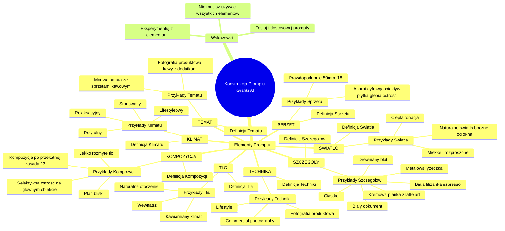

# video_prompt_1

# 💡 Diagram

___

# 🗒️ Notatka

# Notatki i Podsumowanie: Konstrukcja Promptu do Tworzenia Grafiki AI

## Wprowadzenie

Niniejsze notatki przedstawiają kluczowe wskazówki dotyczące tworzenia skutecznych promptów do generowania grafiki za pomocą sztucznej inteligencji (AI). Podkreślono, że nie wszystkie elementy muszą być wykorzystane w każdym promtcie, zachęcając do eksperymentowania w celu znalezienia optymalnej konstrukcji.

## Kluczowe Elementy Promptu

### 1. TEMAT

*   **Definicja:** Określa główny przedmiot lub motyw grafiki.
*   **Przykłady:**
    *   fotografia produktowa kawy z dodatkami
    *   martwa natura ze sprzętami kawowymi
*   **Wskazówki:** Jasno zdefiniowany temat stanowi fundament skutecznego promptu.

### 2. KLIMAT

*   **Definicja:** Opisuje atmosferę i nastrój, jaki ma oddawać grafika.
*   **Przykłady:**
    *   stonowany
    *   przytulny
    *   relaksacyjny
    *   lifestyle'owy
*   **Wskazówki:** Klimat pomaga nadać grafice pożądany charakter emocjonalny.

### 3. SZCZEGÓŁY

*   **Definicja:** Wyszczególnia konkretne obiekty, elementy i detale, które mają pojawić się na grafice.
*   **Przykłady:**
    *   biała filiżanka espresso
    *   drewniany blat
    *   ciastko
    *   metalowa łyżeczka
    *   kremowa pianka z latte art
    *   biały dokument
*   **Wskazówki:** Im więcej szczegółów, tym bardziej precyzyjna i dopasowana do wizji będzie grafika.

### 4. TŁO

*   **Definicja:** Określa kontekst przestrzenny i otoczenie tematu.
*   **Przykłady:**
    *   wewnątrz
    *   kawiarniany klimat
    *   naturalne otoczenie
*   **Wskazówki:** Tło pomaga umiejscowić temat i wzmocnić ogólny przekaz grafiki.

### 5. TECHNIKA

*   **Definicja:** Wskazuje na styl artystyczny lub rodzaj fotografii, który ma być naśladowany.
*   **Przykłady:**
    *   fotografia produktowa
    *   lifestyle
    *   commercial photography
*   **Wskazówki:** Wybór techniki wpływa na estetykę i charakter generowanej grafiki.

### 6. SPRZĘT

*   **Definicja:** Sugestie dotyczące sprzętu fotograficznego, który mógłby być użyty do uzyskania pożądanego efektu.
*   **Przykłady:**
    *   aparat cyfrowy z obiektywem pozwalającym na płytką głębię ostrości
    *   prawdopodobnie 50mm f/1.8
*   **Wskazówki:** Określenie sprzętu pomaga AI w generowaniu obrazów o specyficznych parametrach technicznych, np. głębia ostrości.

### 7. ŚWIATŁO

*   **Definicja:** Opisuje rodzaj i charakter oświetlenia na grafice.
*   **Przykłady:**
    *   naturalne światło boczne (od okna)
    *   miękkie i rozproszone
    *   ciepła tonacja
*   **Wskazówki:** Światło jest kluczowe dla atmosfery i wizualnego odbioru grafiki.

### 8. KOMPOZYCJA

*   **Definicja:** Wskazówki dotyczące układu elementów na grafice i zasad kompozycyjnych.
*   **Przykłady:**
    *   plan bliski
    *   kompozycja po przekątnej (zasada 1/3)
    *   selektywna ostrość na głównym obiekcie
    *   lekko rozmyte tło
*   **Wskazówki:** Kompozycja ma ogromny wpływ na estetykę i czytelność grafiki.

## Podsumowanie

Konstrukcja skutecznego promptu do tworzenia grafiki AI opiera się na precyzyjnym określeniu kluczowych elementów, takich jak **TEMAT**, **KLIMAT**, **SZCZEGÓŁY**, **TŁO**, **TECHNIKA**, **SPRZĘT**, **ŚWIATŁO** i **KOMPOZYCJA**. Eksperymentowanie z różnymi kombinacjami tych elementów pozwala na uzyskanie grafik dopasowanych do indywidualnych potrzeb i wizji. Ważne jest, aby pamiętać, że nie wszystkie elementy muszą być użyte w każdym promtcie, a kluczem do sukcesu jest iteracyjne testowanie i dostosowywanie promptów.

___

# 🔉 Transcript
File: video_prompt_1.png 
Konstrukcja promptu do tworzenia grafiki z pomocą AI:
Poniżej znajdziesz kluczowe wskazówki jak stworzyć grafikę za pomocą AI dopasowaną do Twoich potrzeb. Nie zawsze musisz używać wszystkich wymienionych elementów. Eksperymentuj i szukaj konskturkcji promptu, która będzie dla Ciebie najlepsza.

TEMAT
np. fotografia produktowa kawy z dodatkami, martwa natura ze sprzętami kawowymi

KLIMAT
np. stonowany, przytulny, relaksacyjny, lifestyle'owy

SZCZEGÓŁY
np. biała filiżanka espresso, drewniany blat, ciastko, metalowa łyżeczka, kremowa pianka z latte art, biały dokument

TŁO
np. wewnątrz, kawiarniany klimat, naturalne otoczenie

TECHNIKA
np. fotografia produktowa, lifestyle, commercial photography

SPRZĘT
np. aparat cyfrowy z obiektywem pozwalającym na płytką głębię ostrości, prawdopodobnie 50mm f/1.8

ŚWIATŁO
np. naturalne światło boczne (od okna), miękkie i rozproszone, ciepła tonacja

KOMPOZYCJA
np. plan bliski, kompozycja po przekątnej (zasada 1/3), selektywna ostrość na głównym obiekcie, lekko rozmyte tło

___
# 🏷️ Tags
#AI #sztuczna_inteligencja #generowanie_grafiki #prompt #konstrukcja_promptu #TEMAT #KLIMAT #SZCZEGÓŁY #TŁO #TECHNIKA #SPRZĘT #ŚWIATŁO #KOMPOZYCJA #fotografia_produktowa #martwa_natura #kawa #espresso #latte_art #filiżanka #drewniany_blat #kawiarniany_klimat #naturalne_otoczenie #lifestyle #commercial_photography #aparat_cyfrowy #głębia_ostrości #obiektyw_50mm #światło_naturalne #kompozycja_po_przekątnej #zasada_1/3 #selektywna_ostrość #rozmyte_tło #eksperymentowanie #iteracyjne_testowanie #dostosowywanie_promptów
