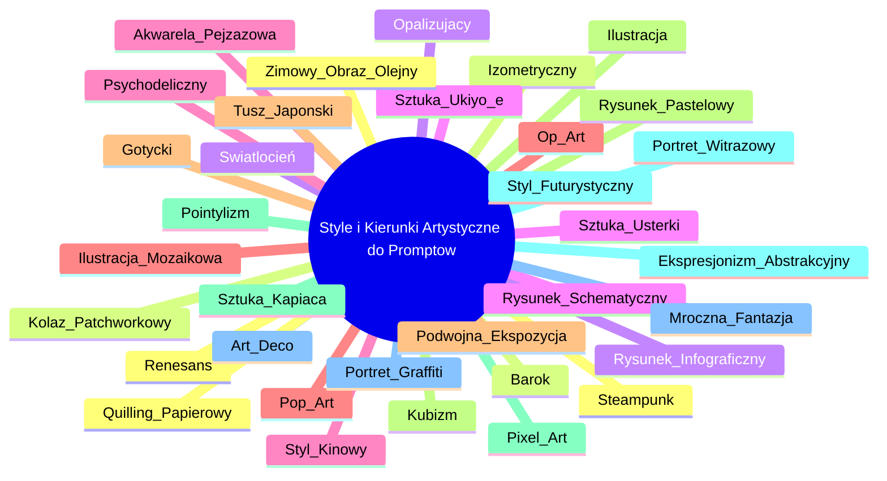

# video_prompt_2

# 💡 Diagram

___

# 🗒️ Notatka

# Notatki ze Stylami i Kierunkami Artystycznymi do Promptów

## Wprowadzenie

Poniższe notatki przedstawiają listę stylów i kierunków artystycznych, które mogą stanowić inspirację oraz elementy składowe **promptów**, szczególnie w kontekście generowania obrazów za pomocą sztucznej inteligencji. Ta lista oferuje szeroki zakres możliwości, od klasycznych technik malarskich po nowoczesne style cyfrowe, umożliwiając tworzenie różnorodnych i unikalnych dzieł.

## Style i Kierunki Artystyczne

Poniżej znajduje się szczegółowa lista stylów i kierunków artystycznych, które można wykorzystać w **promptach**:

*   **Renesans** - Styl charakteryzujący się harmonią, proporcjami, perspektywą i nawiązaniami do antyku.
*   **Barok** - Styl pełen dynamiki, przepychu, dramatyzmu i bogactwa detali.
*   **Światłocień** - Technika malarska operująca kontrastami światła i cienia, nadająca głębię i dramatyzm.
*   **Sztuka Usterki** (`Glitch Art`) - Styl wizualny wykorzystujący cyfrowe błędy i zakłócenia jako element estetyczny.
*   **Psychodeliczny** - Styl charakteryzujący się intensywnymi kolorami, zniekształceniami i motywami inspirowanymi stanami zmienionej świadomości.
*   **Pop-Art** - Styl artystyczny czerpiący inspirację z kultury popularnej, reklam, komiksów i przedmiotów codziennego użytku.
*   **Gotycki** - Styl charakteryzujący się strzelistością, wertykalizmem, mrocznym klimatem i religijną symboliką.
*   **Kubizm** - Awangardowy kierunek w sztuce, który rozkłada obiekty na geometryczne formy i prezentuje je z różnych perspektyw jednocześnie.
*   **Pointylizm** - Technika malarska polegająca na tworzeniu obrazu za pomocą drobnych, różnobarwnych punktów.
*   **Ekspresjonizm Abstrakcyjny** - Kierunek w malarstwie abstrakcyjnym, który kładzie nacisk na emocje, gest i spontaniczność.
*   **Art-Deco** - Styl dekoracyjny z lat 20. i 30. XX wieku, charakteryzujący się elegancją, geometrycznymi wzorami i luksusem.
*   **Steampunk** - Styl łączący estetykę epoki wiktoriańskiej z elementami `science fiction` i technologią parową.
*   **Izometryczny** - Rodzaj rzutu aksonometrycznego, w którym wszystkie trzy osie są skrócone w równym stopniu, co daje wrażenie trójwymiarowości bez perspektywy.
*   **Rysunek Infograficzny** - Styl graficzny wykorzystywany do prezentacji danych i informacji w sposób wizualny i zrozumiały.
*   **Rysunek Schematyczny** - Uproszczony rysunek przedstawiający strukturę lub funkcję obiektu, często wykorzystywany w celach edukacyjnych i technicznych.
*   **Styl Kinowy** (`Cinematic Style`) - Styl wizualny nawiązujący do estetyki filmowej, charakteryzujący się kadrowaniem, oświetleniem i kolorystyką typową dla filmu.
*   **Ilustracja Mozaikowa** (`Mosaic Illustration`) - Styl ilustracji naśladujący technikę mozaiki, składający się z małych elementów tworzących większy obraz.
*   **Podwójna Ekspozycja** (`Double Exposure`) - Technika fotograficzna polegająca na nałożeniu na siebie dwóch lub więcej ekspozycji, tworząc surrealistyczny efekt.
*   **Ilustracja** - Ogólny styl graficzny, obejmujący różnorodne techniki i tematy, służący wizualnemu przedstawieniu idei lub historii.
*   **Pixel Art** - Styl graficzny, w którym obrazy tworzone są z pikseli, charakterystyczny dla wczesnych gier komputerowych i grafiki cyfrowej.
*   **Styl Futurystyczny** (`Futuristic Style`) - Styl wizualny przedstawiający wizje przyszłości, często charakteryzujący się nowoczesną technologią, dynamicznymi liniami i elementami `science fiction`.
*   **Mroczna Fantazja** (`Dark Fantasy`) - Podgatunek `fantasy`, charakteryzujący się mrocznym, gotyckim klimatem, często z elementami horroru i pesymizmu.
*   **Quilling Papierowy** (`Paper Quilling`) - Technika ozdabiania papierem, polegająca na zwijaniu wąskich pasków papieru i formowaniu z nich dekoracyjnych elementów.
*   **Kolaż Patchworkowy** (`Patchwork Collage`) - Technika artystyczna polegająca na łączeniu różnych materiałów i tekstur w formie kolażu, przypominającego patchwork.
*   **Opalizujący** (`Opalescent`) - Efekt wizualny przypominający opal, charakteryzujący się zmieniającymi się kolorami i perłowym połyskiem.
*   **Sztuka Ukiyo-e** - Japońska sztuka drzeworytu, popularna w okresie Edo, przedstawiająca sceny z życia codziennego, krajobrazy i portrety.
*   **Akwarela Pejzażowa** (`Landscape Watercolor`) - Technika malarska wykorzystująca farby akwarelowe do przedstawiania pejzaży, charakteryzująca się delikatnością i transparentnością.
*   **Op-Art** - Kierunek w sztuce abstrakcyjnej, który wykorzystuje iluzje optyczne i geometryczne wzory, aby wywołać wrażenie ruchu i wibracji.
*   **Tusz Japoński** (`Japanese Ink`) - Technika malarska wykorzystująca tusz do kaligrafii, charakteryzująca się prostotą, minimalizmem i ekspresją linii.
*   **Rysunek Pastelowy** (`Pastel Drawing`) - Technika rysunkowa wykorzystująca pastele, charakteryzująca się miękkością, delikatnością i bogactwem kolorów.
*   **Sztuka Kapiąca** (`Drip Art`) - Technika malarska polegająca na nanoszeniu farby poprzez kapanie lub rozlewanie jej na płótno, spopularyzowana przez Jacksona Pollocka.
*   **Portret Witrażowy** (`Stained Glass Portrait`) - Styl portretu naśladujący technikę witrażu, charakteryzujący się intensywnymi kolorami i podziałem na segmenty.
*   **Portret Graffiti** (`Graffiti Portrait`) - Styl portretu nawiązujący do estetyki graffiti, charakteryzujący się ekspresją, dynamiką i często niekonwencjonalnymi technikami.
*   **Zimowy Obraz Olejny** (`Winter Oil Painting`) - Obraz olejny przedstawiający motywy zimowe, charakteryzujący się chłodną kolorystyką, śniegiem i zimowym krajobrazem.

## Podsumowanie

Lista stylów i kierunków artystycznych przedstawiona powyżej stanowi bogate źródło inspiracji do tworzenia **promptów**. Wykorzystanie tych różnorodnych stylów pozwala na generowanie obrazów o unikalnym charakterze, nawiązujących do różnych epok, technik i estetyk artystycznych. Zrozumienie i zastosowanie tych stylów może znacząco wzbogacić proces tworzenia wizualizacji za pomocą sztucznej inteligencji, otwierając nowe możliwości dla kreatywności i ekspresji artystycznej.

___

# 🔉 Transcript
File: video_prompt_2.png 
Przykładowe style i kierunki artystyczne do wykorzystania do promptów

*   Renesans
*   Barok
*   Światłocień
*   Sztuka Usterki
*   Psychodeliczny
*   Pop-Art
*   Gotycki
*   Kubizm
*   Pointylizm
*   Ekspresjonizm Abstrakcyjny
*   Art-Deco
*   Steampunk
*   Izometryczny
*   Rysunek Infograficzny
*   Rysunek Schematyczny
*   Styl Kinowy
*   Ilustracja Mozaikowa
*   Podwójna Ekspozycja
*   Ilustracja
*   Pixel Art
*   Styl Futurystyczny
*   Mroczna Fantazja
*   Quilling Papierowy
*   Kolaż Patchworkowy
*   Opalizujący
*   Sztuka Ukiyo-e
*   Akwarela Pejzażowa
*   Op-Art
*   Tusz Japoński
*   Rysunek Pastelowy
*   Sztuka Kapiąca
*   Portret Witrażowy
*   Portret Graffiti
*   Zimowy Obraz Olejny

___
# 🏷️ Tags
#prompt #style #kierunek_artystyczny #generowanie_obrazów #sztuczna_inteligencja #inspiracja #technika_malarska #styl_cyfrowy #renesans #barok #światłocień #glitch_art #sztuka_usterki #psychodeliczny #pop_art #gotycki #kubizm #pointylizm #ekspresjonizm_abstrakcyjny #art_deco #steampunk #izometryczny #rysunek_infograficzny #rysunek_schematyczny #styl_kinowy #cinematic_style #ilustracja_mozaikowa #podwójna_ekspozycja #double_exposure #ilustracja #pixel_art #styl_futurystyczny #mroczna_fantazja #dark_fantasy #quilling_papierowy #kolaż_patchworkowy #opalizujący #sztuka_ukiyo_e #akwarela_pejzażowa #op_art #tusz_japoński #rysunek_pastelowy #sztuka_kapiąca #drip_art #portret_witrażowy #portret_graffiti #zimowy_obraz_olejny
