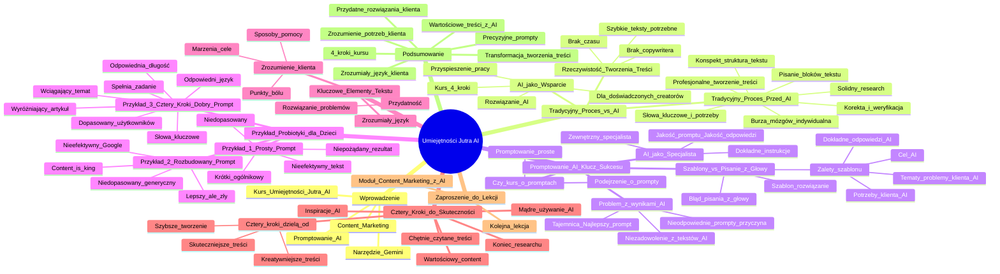

# Lekcje wideo - 1. Wstęp

# 💡 Diagram

___

# 🗒️ Notatka

# Notatki i Podsumowanie Transkrypcji Wideo: Umiejętności Jutra AI

## Wprowadzenie

Wideo wprowadza do tematu wykorzystania sztucznej inteligencji (AI), a konkretnie narzędzia Gemini, w procesie tworzenia treści. Prezentacja porównuje tradycyjne metody tworzenia tekstów z nowymi możliwościami, jakie oferuje AI, podkreślając, że kluczem do skutecznego wykorzystania AI jest umiejętność tworzenia odpowiednich `promptów`. Kurs "Umiejętności Jutra AI" ma na celu nauczyć, jak efektywnie korzystać z AI w content marketingu, niezależnie od poziomu doświadczenia uczestnika.

## Tradycyjny Proces Tworzenia Treści vs. AI

### Tradycyjny Proces Tworzenia Tekstu (Przed AI)

*   **Solidny research:** Zrozumienie potrzeb klienta poprzez fora internetowe, opinie o produktach i usługach.
*   **Poszukiwanie słów kluczowych i potrzeb odbiorców.**
*   **Burza mózgów:** Często indywidualna, w celu znalezienia dobrego tematu.
*   **Tworzenie konspektu:** Planowanie struktury tekstu po zrozumieniu problemów grupy docelowej.
*   **Pisanie bloków tekstu:** Czasochłonny proces.
*   **Korekta i weryfikacja:** Sprawdzanie faktów, czytanie i poprawianie.
*   **Profesjonalne tworzenie treści:** Długi i wymagający proces.

### Rzeczywistość Tworzenia Treści

*   Nie każdy jest zawodowym copywriterem.
*   Brak czasu 🕰️ na pełny, tradycyjny proces.
*   Potrzeba szybkiego tworzenia tekstów.

### AI jako Wsparcie w Tworzeniu Treści

*   **AI jako rozwiązanie:** Każdy może skorzystać ze wsparcia AI.
*   **Kurs "Umiejętności Jutra AI":** Nauka tworzenia skutecznych treści z AI w 4 krokach.
    *   Treści dopasowane do odbiorców i ich potrzeb.
    *   Unikalne i konwertujące treści.
    *   Wykorzystanie 8-letniego doświadczenia prowadzącej i technik.
*   **Dla doświadczonych content creatorów:** Gemini przyspiesza i ułatwia pracę.

## Promptowanie AI - Klucz do Sukcesu

### Czy to Kurs o Promptach?

*   Podejrzenie, że kurs skupi się na pisaniu `promptów` do AI (np. dla bloga, social media).
*   Przekonanie, że pisanie `promptów` jest proste i znane.

### Problem z Wynikami AI

*   Często niezadowolenie z tekstów generowanych przez AI.
*   **Przyczyna:** Użycie nieodpowiednich `promptów`.
*   **Tajemnica:** Sukces pracy z Gemini zależy od stworzenia **najlepszego `promptu`**.

### AI jako Zewnętrzny Specjalista

*   **Analogia:** AI jest jak zewnętrzny specjalista lub wynajęta firma.
*   **Dokładne instrukcje:** Im dokładniej opiszemy zadanie i wymagania, tym lepszy wynik.
*   **Jakość `promptu` = Jakość odpowiedzi.**

### Szablony Promptów vs. Pisanie z Głowy

*   **Błąd pisania `promptów` z głowy:** Ludzka natura, brak schematu, brak istotnych informacji.
*   **Rozwiązanie:** Wykorzystanie **wypracowanego szablonu**.
*   **Zalety szablonu:**
    *   Pomaga AI zrozumieć cel.
    *   Pomaga AI zrozumieć potrzeby klienta.
    *   Pomaga AI znaleźć tematy odpowiadające na problemy klienta.
    *   Umożliwia dokładne odpowiedzenie na potrzeby klienta.

## Przykład: Probiotyki dla Dzieci - Artykuł z AI

### Przykład 1: Prosty Prompt

*   **Krótkie polecenie, brak szczegółów.**
*   **Wynik:**
    *   Nieefektowny i nieefektywny tekst.
    *   Krótki, ogólnikowy, brak informacji.
    *   Niedopasowany do grupy docelowej.
    *   **Niepożądany rezultat.**

### Przykład 2: Rozbudowany Prompt

*   **Bardziej szczegółowy `prompt`.**
*   **Wynik:**
    *   Lepszy, ale nadal niezadowalający.
    *   Niedopasowany i generyczny.
    *   **Nieefektywny dla użytkowników i algorytmów Google.**
    *   "`Content is the king`" w Google.

### Przykład 3: Cztery Kroki - Dobry Prompt

*   **Zastosowanie czterech kroków (metody kursu).**
*   **Wynik:**
    *   **Wyróżniający się artykuł.**
    *   Wciągający temat.
    *   Odpowiedni język.
    *   Odpowiednia długość i nasycenie słowami kluczowymi.
    *   **Dopasowany do konkretnej grupy użytkowników.**
    *   **Artykuł spełniający swoje zadanie.**

## Kluczowe Elementy Skutecznego Tekstu

*   **Zrozumienie klienta:** Marzenia, cele, punkty bólu, sposoby pomocy.
*   **Zrozumiały język:** Pisanie językiem odbiorców.
*   **Przydatność:** Rozwiązywanie problemów odbiorców.

## Cztery Kroki do Skuteczniejszych Treści z AI

*   **Cztery kroki dzielą od:**
    *   Szybszego tworzenia treści.
    *   Skuteczniejszych treści.
    *   Bardziej kreatywnych treści.
*   **Koniec z wielogodzinnym researchem:** AI pomaga w poszukiwaniu inspiracji, problemów i języka odbiorców.
*   **Nauka mądrego używania AI:** Tworzenie wartościowego contentu.
*   **Pamiętać o chętnym czytaniu treści przez klientów.**

## Zaproszenie do Kolejnej Lekcji

*   **Moduł "Content Marketing z AI" - kolejna lekcja.**
*   Dalsza nauka efektywnego wykorzystania AI w content marketingu.

## Podsumowanie

Prezentacja wprowadza do kursu "Umiejętności Jutra AI", skupiając się na transformacji procesu tworzenia treści dzięki sztucznej inteligencji. Podkreśla, że skuteczne wykorzystanie AI, szczególnie narzędzia Gemini, nie polega na prostym generowaniu tekstów, lecz na umiejętności tworzenia precyzyjnych i dobrze skonstruowanych `promptów`. Kurs ma nauczyć, jak w czterech krokach tworzyć wartościowe, skuteczne i dopasowane do odbiorców treści, wykorzystując AI jako wsparcie. Kluczowe jest zrozumienie potrzeb klienta, pisanie zrozumiałym językiem i dostarczanie przydatnych rozwiązań. Następna lekcja modułu "Content Marketing z AI" ma rozwinąć te zagadnienia i pokazać praktyczne zastosowanie tych zasad.

___

# 🔉 Transcript
File: Lekcje wideo - 1. Wstęp.mp4 
[00:00:00] (Biały ekran)
[00:00:01] (Na ekranie pojawia się napis "Umiejętności Jutra AI". Poniżej napis "Organizator Google" oraz "Partner edukacyjny SGH")
[00:00:05] (Kobieta siedzi przy biurku, za nią półka z logo Google i roślinami doniczkowymi, na biurku laptop i roślina)
[00:00:06] (Na dole ekranu pojawia się napis "Małgorzata Banach, Content Creator | SEO Copywriter + Mobile Video & Reels")
[00:00:06] Jeszcze niedawno napisanie dobrego tekstu zaczynało się od solidnego researchu.
[00:00:11] Chcąc zrozumieć potrzeby i ból klienta, siadaliśmy do komputerów, przeszukiwaliśmy fora internetowe, czytaliśmy opinie produktów i usług.
[00:00:20] Szukaliśmy słów kluczowych i potrzeb odbiorców.
[00:00:24] Często, żeby znaleźć dobry temat, trzeba było zrobić burzę mózgów.
[00:00:28] I to w sumie sami z sobą, bo przecież tworzenie treści to zazwyczaj zadanie dla jednej osoby.
[00:00:35] Po kilku godzinach poznawania problemów grupy docelowej, ich bólu i pytań, mogliśmy zacząć pisanie konspektu.
[00:00:43] Musimy mieć przecież plan, zanim przejdziemy już do samego pisania.
[00:00:46] A to pisanie to tworzenie bloków tekstu, też zajmuje sporo czasu.
[00:00:52] Ale nawet skończony materiał nie oznaczał końca pracy.
[00:00:55] Jeszcze korekta, dodatkowa weryfikacja faktów, kolejne czytanie i poprawianie.
[00:01:01] Tak przecież powinno wyglądać profesjonalne tworzenie treści, prawda?
[00:01:05] Okej, zdaję sobie sprawę z tego, że rzeczywistość wygląda inaczej.
[00:01:10] Niestety.
[00:01:10] Nie każdy jest przecież zawodowym copywriterem.
[00:01:13] Nie każdy ma też czas na przechodzenie takiego procesu, kiedy na szybko potrzebujemy jakiegoś tekstu.
[00:01:19] Ale wiesz co?
[00:01:21] Jest na to sposób.
[00:01:22] Każdy z was już teraz może skorzystać z odpowiedniego wsparcia, jakie może nam zaoferować AI.
[00:01:30] I tego będziemy się uczyć podczas kolejnych lekcji.
[00:01:33] Jeżeli nie masz doświadczenia w copywritingu, to pokażę ci, jak w czterech krokach tworzyć treści, które są dopasowane do twoich odbiorców i odpowiadają na ich potrzeby, ale też są unikalne i konwertujące.
[00:01:48] Podzielę się z tobą moim ponad ośmioletnim doświadczeniem i najważniejszymi technikami, z których na co dzień korzystam.
[00:01:55] Jeżeli jednak jesteś content creatorem i rozumiesz o czym mówię, to dla ciebie też mam coś interesującego.
[00:02:02] Pokażę ci, jak Gemini przyspieszy cały ten proces i znacznie ułatwi ci twoją pracę.
[00:02:08] Ale zaraz, zaraz.
[00:02:10] Czy przypadkiem nie pojawiła ci się w głowie taka myśl?
[00:02:13] Czy przypadkiem nie będzie to kurs o tym, jak pisać prompty?
[00:02:18] W sensie, jak rozmawiać z AI, żeby otrzymać tekst, na przykład bloga lub posta na social media?
[00:02:25] Przecież ja to wiem, czego tu się uczyć?
[00:02:28] No właśnie, to mam małą prośbę.
[00:02:31] Przypomnij sobie, czy już kiedyś korzystałeś ze sztucznej inteligencji, by stworzyć tekst.
[00:02:37] I co?
[00:02:38] Byłeś zadowolony z wyników?
[00:02:41] Mogę podejrzewać, że nie do końca.
[00:02:44] Ale to prawdopodobnie dlatego, że po prostu użyłeś nieodpowiednich promptów.
[00:02:48] Może zdradzę ci tajemnicę, ale tak naprawdę cała praca z Gemini sprowadza się do stworzenia jak najlepszego promptu, który pozwoli ci uzyskać najlepsze odpowiedzi, z których będziesz zadowolony.
[00:03:02] AI jest jak zewnętrzny specjalista.
[00:03:04] Im dokładniej opowiemy mu, czym się zajmujemy i czego od niego wymagamy, tym lepiej będzie mógł wykonać swoją pracę.
[00:03:13] Dokładnie tak, jakbyśmy pracowali z wynajętą firmą.
[00:03:16] Jaki prompt stworzymy, takiej odpowiedzi będziemy mogli się spodziewać.
[00:03:21] I teraz kolejna ważna rzecz.
[00:03:23] Pisanie promptów z głowy nie jest dobrym pomysłem.
[00:03:27] Dlaczego?
[00:03:29] Jesteśmy tylko ludźmi i nie zawsze będziemy w stanie zachować prawidłowy schemat.
[00:03:33] Nie zawsze zawrzemy wszystkie informacje.
[00:03:36] Lepiej wykorzystać w tym celu raz wypracowany dobry szablon, który pomoże sztucznej inteligencji w poznaniu naszego celu, zrozumieniu potrzeb naszego klienta, znalezieniu tematów, które odpowiedzą na jego problemy i dokładnym odpowiedzeniu na jego potrzeby.
[00:03:53] Ale zobaczmy to na przykładzie.
[00:03:55] (Na ekranie pojawia się artykuł "Probiotyki dla dzieci - klucz do zdrowych jelit i mocnej odporności")
[00:03:55] Za pierwszym razem skorzystaliśmy z bardzo prostego i krótkiego polecenia, bez podawania praktycznie żadnych szczegółów.
[00:04:02] Co możemy powiedzieć o wyniku?
[00:04:05] Jak widzisz, tekst nie jest zbyt efektowny, efektywny prawdopodobnie tym bardziej.
[00:04:10] Jest krótki, nie zawiera wielu informacji, jest ogólny, brak tutaj dopasowania do konkretnej grupy docelowej.
[00:04:17] Czegoś takiego nie chcemy.
[00:04:20] To spróbujmy inaczej, z bardziej rozbudowanym promptem.
[00:04:24] Co teraz możemy powiedzieć?
[00:04:26] Ja nie jestem zadowolona.
[00:04:27] Zwróciłabym uwagę przede wszystkim ponownie na jego niedopasowanie, ale też generyczność.
[00:04:33] Nie zadziała to ani na użytkowników, ani też na algorytmy wyszukiwarki, bo przecież w Google content is the king, ale można podejść do tego inaczej.
[00:04:43] Spójrzmy teraz na artykuł wygenerowany z zastosowaniem czterech kroków.
[00:04:47] Czy nie wyróżnia się on na tle tej konkurencji?
[00:04:51] Temat jest wciągający.
[00:04:53] Treść jest napisana odpowiednim językiem.
[00:04:55] Długość i nasycenie słowami kluczowymi jest takie, jak chciałam.
[00:05:00] I co najważniejsze, pasuje on do konkretnej grupy użytkowników.
[00:05:04] Jest to artykuł, który spełni swoje zadanie.
[00:05:08] Jak widzisz, dobrze napisany tekst, niezależnie od tego, czy to artykuł blogowy, opis produktu, czy mail sprzedażowy, musi po pierwsze opierać się na tym, co wiemy o naszym kliencie.
[00:05:20] Jakie są jego marzenia, cele, punkty bólu i w jaki sposób możemy mu pomóc.
[00:05:26] Po drugie, skuteczne treści to te, które są zrozumiałe dla odbiorców, pisane ich językiem.
[00:05:33] I po trzecie, są dla nich przydatne, czyli mówią o rozwiązaniu ich problemów.
[00:05:38] I chciałabym ci pokazać, że tylko cztery kroki dzielą nas od tego, żeby szybciej tworzyć treści, które są i skuteczniejsze i bardziej kreatywne.
[00:05:49] Zapomnij o wielogodzinnym przeszukiwaniu internetu w poszukiwaniu inspiracji, problemów, a nawet zwrotów, jakich używają twoi odbiorcy.
[00:05:59] Nauczę cię, jak mądrze używać AI do tworzenia contentu, który jest wartościowy i o czym warto pamiętać, by nasze treści były chętnie czytane przez klientów.
[00:06:09] Ale to już w kolejnej lekcji.
[00:06:11] Zapraszam cię do obejrzenia modułu Content Marketing z AI.
[00:06:16] (Na ekranie pojawia się napis "Umiejętności Jutra AI". Poniżej napis "Organizator Google" oraz "Partner edukacyjny SGH")

___
# 🏷️ Tags
#AI #sztuczna_inteligencja #Gemini #content_marketing #prompt #promptowanie #umiejętności_jutra_ai #research #słowa_kluczowe #odbiorcy #burza_mózgów #konspekt #copywriting #content_creator #tekst #tworzenie_treści #tradycyjny_proces_tworzenia_treści #AI_w_tworzeniu_treści #szablon_promptu #probiotyki_dla_dzieci #artykuł_z_AI #content_is_the_king #google #algorytmy_google #język_odbiorców #potrzeby_klienta #cele_klienta #punkty_bólu_klienta #rozwiązywanie_problemów #skuteczne_treści #kreatywne_treści #content #wartościowy_content #moduł_content_marketing_z_ai #seo #mobile_video #reels #małgorzata_banach #sgh #edukacja #kurs_ai #wsparcie_ai #doświadczenie #techniki #unikalne_treści #konwertujące_treści #dopasowanie_do_odbiorców #efektywność #inspiracja #weryfikacja_faktów #korekta #pisanie_tekstu #pisanie_z_głowy #cztery_kroki #szybkie_tworzenie_tekstów #przydatne_treści #zrozumiały_język #specjalista_ai #instrukcje_ai #jakość_promptu #wyniki_ai #niezadowolenie_z_ai #błąd_promptu #cel_ai #problemy_klienta #potrzeby_klienta #artykuł_blogowy #opis_produktu #mail_sprzedażowy #marzenia_klienta #pomoc_klientowi #wciągający_temat #odpowiedni_język #nasycenie_słowami_kluczowymi #grupa_użytkowników #zadanie_artykułu #wsparcie_w_pracy #automatyzacja_treści
