# Lekcje wideo - 2. Jak sprawdzić o czym i dla kogo piszę

# 💡 Diagram

```mermaid
mindmap
  root((Analiza Grupy Docelowej))
    Problem Nieskutecznych Tresci
      Czasochlonne tworzenie
      Burza mozgow koncepcje teksty publikacja
      Niskie statystyki brak konwersji
      Kluczowe pytanie Dlaczego
    Przyczyna Niedopasowanie do Grupy Docelowej
      Nie trafia do grupy docelowej
      Nie odpowiada na potrzeby
      Niedostatecznie dopasowane
      Okreslenie grupy docelowej fundamentalne
    Rozwiazanie Wykorzystanie Gemini do Profilowania Klienta
      Cel Profil klienta Gemini
      Dopasowanie jezyka
      Zlozony prompt konieczny
    Cwiczenia
      Cwiczenie 1 Sklep z aparatami sluchowymi
        Poczatkowe zalozenie 60 plus
        Rzeczywistosc Inicjatywa dzieci wnukow
        Wniosek Komunikacja do mlodszych
        Efekt Wzrost ruchu i sprzedazy
        Lekcja Dokladne poznanie grupy docelowej
      Cwiczenie 2 Twoj idealny klient
        Zadanie Przemysl cechy
        Cel Przygotowanie do Gemini
        Rekomendacja Zatrzymaj nagranie
    Klatwa Wiedzy
      Ogólnikowe wyobrazenia
      Pomijanie oczywistych szczegolow
      Utrudnianie pracy Gemini
      Rozwiazanie Gemini poznanie klientow
    Wywiad z Gemini
      Cel Profil klienta Gemini
      Przyklad Catering Wroclaw
      Prompt 20 pytan
      Kategorie pytan
        Podsumowanie profilu grupy docelowej
        Profil klienta
        Demografia
        Styl zycia
        Potrzeby i oczekiwania
        Wyzwania
        Cele
        Produkty uslugi
        Marketing i sprzedaz
        Decyzje zakupowe
        Lojalnosc
        Konkurencja
    Dalsze Kroki i Wskazowki
      Pytania punkt wyjscia
      Fundament strategii marketingowej
      Badania jakosciowe
      Gemini materialy marketingowe
    Kolejny Prompt Jezyk Grupy Docelowej
      Charakterystyczne zwroty
      Dopasowanie komunikacji
    Podsumowanie
      Znaczenie grupy docelowej
      Gemini profilowanie i jezyk
      Przezwyciezenie klatwy wiedzy
      Efektywniejsze strategie
      Lepsze rezultaty
```

___

# 🗒️ Notatka

# Notatki i Podsumowanie Transkrypcji Wideo

## Wprowadzenie

Transkrypcja wideo analizuje problem tworzenia treści, które nie angażują **grupy docelowej**, co skutkuje niskimi statystykami i brakiem konwersji. Głównym zagadnieniem jest **określenie i zrozumienie grupy docelowej** oraz wykorzystanie narzędzia **Gemini** do precyzyjnego profilowania klienta i dostosowania języka komunikacji.

## Problem Nieskutecznych Treści

- Tworzenie treści jest czasochłonne i wymaga dużego wysiłku zespołu.
- Burza mózgów, opracowywanie koncepcji, pisanie tekstów, publikacja.
- **Efekt:** Niskie statystyki, słabe zainteresowanie, brak konwersji.
- **Kluczowe pytanie:** Dlaczego treści nie przynoszą oczekiwanych rezultatów?

## Przyczyna: Niedopasowanie do Grupy Docelowej

- Materiały **nie trafiają do właściwej grupy docelowej**.
- Nie odpowiadają na **potrzeby odbiorców**.
- Są **niedostatecznie dopasowane**.
- **Określenie grupy docelowej jest fundamentalne, lecz często pomijane lub niedoceniane.**

## Rozwiązanie: Wykorzystanie Gemini do Profilowania Klienta

- Celem tej lekcji jest demonstracja wykorzystania narzędzia **Gemini** do stworzenia szczegółowego profilu klienta.
- Dopasowanie języka komunikacji do zdefiniowanego profilu klienta.
- **Ważna uwaga:** Nie wystarczy krótkie, jednozdaniowe zapytanie (ang. `prompt`). Konieczne jest bardziej złożone podejście.

## Ćwiczenie 1: Sklep z Aparatami Słuchowymi

- **Zadanie:** Zastanów się, kim jest klient sklepu z aparatami słuchowymi.
- **Początkowe założenie:** Klientami są osoby powyżej 60 roku życia.
- **Rzeczywistość:** Osoby starsze często przychodzą z inicjatywy dzieci i wnuków.
- **Wniosek:** Komunikacja skierowana do młodszych odbiorców (edukująca o badaniach słuchu i wykluczeniu społecznym osób starszych) **znacząco zwiększyła ruch i sprzedaż.**
- **Lekcja:** **Dokładne poznanie grupy docelowej** jest kluczowe, choć może stanowić wyzwanie.

## Dopasowanie Tekstu do Odbiorców: Kolejne Wyzwanie

- Samo poznanie grupy docelowej to jedno.
- **Dopasowanie języka tekstu do odbiorców jest zadaniem jeszcze trudniejszym, żmudnym i pracochłonnym.**
- **Rozwiązanie:** **Gemini** może usprawnić ten proces.

## Ćwiczenie 2: Twój Idealny Klient

- **Zadanie:** Przemyśl i zapisz cechy swojego idealnego klienta.
- **Cel:** Lepsze przygotowanie do efektywnej pracy z **Gemini**.
- **Rekomendacja:** Zatrzymaj nagranie i wykonaj ćwiczenie, aby w pełni skorzystać z wartości lekcji.

## Klątwa Wiedzy: Ograniczenia w Postrzeganiu Klienta

- Nawet jeśli wydaje nam się, że dobrze znamy naszych klientów, nasze wyobrażenia często okazują się **zbyt ogólnikowe**.
- **Klątwa wiedzy** polega na pomijaniu oczywistych dla nas szczegółów, które umykają naszej uwadze.
- **Konsekwencja:** Utrudniamy pracę narzędziom takim jak **Gemini**, nie dostarczając im istotnych informacji.
- **Rozwiązanie:** Zlecenie **Gemini** zadania **lepszego poznania klientów** pomaga przełamać **klątwę wiedzy**.

## Wywiad z Gemini: Krok po Kroku

- **Cel:** Stworzenie profilu klienta przy użyciu **Gemini**.
- **Przykład:** Firma cateringowa z Wrocławia (model uniwersalny, do zastosowania w każdej branży).
- **Przykładowy prompt dla Gemini:**
    > Gemini, proszę wygeneruj minimum 20 szczegółowych i wartościowych pytań dotyczących mojej grupy docelowej. Te pytania mają na celu dogłębne zrozumienie moich odbiorców: kim są, jakie są ich potrzeby, wyzwania i cele, oraz w jaki sposób mój produkt lub usługa może im pomóc. Chcę wykorzystać tę wiedzę w przyszłych zadaniach, takich jak tworzenie treści, strategia marketingowa i planowanie rozwoju oferty. Poniżej opisuję moją działalność, abyś mógł dostosować pytania do kontekstu. Moja działalność: [tu wpisz rodzaj działalności, np.: "jestem właścicielką firmy cateringowej we Wrocławiu, specjalizującej się w daniach dla rodzin z dziećmi"].

## Wynik Zapytania: Lista Pytań od Gemini

- **Gemini** generuje **listę pytań, uporządkowaną tematycznie** w kategoriach:
    - Podsumowanie profilu Twojej grupy docelowej
    - Profil klienta
    - Demografia
    - Styl życia
    - Potrzeby i oczekiwania
    - Wyzwania
    - Cele
    - Produkty/usługi
    - Marketing i sprzedaż
    - Decyzje zakupowe
    - Lojalność
    - Konkurencja

## Dlaczego 20 Pytań?

- **Doświadczenie:** Minimum 20 pytań pozwala **Gemini** na zadawanie **bardziej szczegółowych pytań**.
- Mniejsza liczba pytań skutkuje generowaniem ogólników (wiek, płeć, wykształcenie).
- **Zachęta do eksperymentowania:** Sprawdź różnicę, prosząc o 5, 10 i 20 pytań.

## Przykładowe Pytania Wygenerowane przez Gemini (Catering dla Rodzin z Dziećmi we Wrocławiu)

- **Demografia:**
    - Jaki jest średni wiek klientów?
    - Jaki jest skład typowej rodziny (liczba i wiek dzieci)?
    - Jakie jest wykształcenie i status zawodowy osób decyzyjnych?
    - Gdzie dokładnie mieszkają klienci (dzielnice Wrocławia)?
- **Styl życia:**
    - Jakie są priorytety życiowe klientów (rodzina, kariera, zdrowie, hobby)?
    - Jak często korzystają z gotowych posiłków?
    - Jakie są ich nawyki żywieniowe (zdrowa żywność, kuchnia tradycyjna, międzynarodowa)?
    - Jakie mają zainteresowania poza życiem rodzinnym (sport, kultura, podróże)?
- **Potrzeby i oczekiwania:**
    - Z jakich powodów korzystają z cateringu (brak czasu, wygoda, zdrowe odżywianie, chęć różnorodności)?
    - Jakie są ich oczekiwania względem jakości posiłków (świeżość, smak, wygląd, składniki)?
    - Czego oczekują w zakresie obsługi klienta (szybkość, elastyczność, komunikacja)?
    - Jakie są ich oczekiwania cenowe?
- **Wyzwania:**
    - Jakie wyzwania wiążą się dla nich z przygotowaniem posiłków dla dzieci (brak czasu, różnorodność diet, wybredność dzieci)?
    - Jakie obawy budzi w nich korzystanie z cateringu (cena, jakość, bezpieczeństwo)?
- **Cele:**
    - Jakie cele chcą osiągnąć, korzystając z cateringu (zdrowe odżywianie, oszczędność czasu, poznawanie nowych smaków)?
    - Jakie są ich długoterminowe cele związane z żywieniem dzieci (prawidłowy rozwój, kształtowanie zdrowych nawyków żywieniowych)?
- **Produkty/usługi:**
    - Jakie dania zamawiają najczęściej?
    - Jakie diety są popularne (wegetariańska, wegańska, bezglutenowa)?
    - Jakie formy dostawy są dostępne?
    - Jakie usługi dodatkowe oferujecie (catering na imprezy, śniadania, menu sezonowe)?
    - Jakie nowe dania/diety warto wprowadzić do oferty?
    - Czy personalizacja oferty jest istotna (menu dla dzieci w różnym wieku, możliwość wyboru składników)?
- **Marketing i sprzedaż:**
    - Gdzie klienci poszukują informacji o firmach cateringowych (media społecznościowe, strony internetowe, rekomendacje)?
    - Jakie formy promocji są dla nich najbardziej atrakcyjne (rabaty, konkursy, degustacje)?
- **Decyzje zakupowe:**
    - Jakie czynniki wpływają na ich decyzje zakupowe (cena, jakość, opinie)?
    - Jak długo trwa proces decyzyjny?
- **Lojalność:**
    - Jakie działania mogą zwiększyć lojalność klientów (program lojalnościowy, indywidualne podejście)?
- **Konkurencja:**
    - Kim są główni konkurenci?
    - Jakie są mocne i słabe strony konkurencji?
    - Czym oferta firmy różni się od konkurencji?

## Dalsze Kroki i Wskazówki

- Pytania wygenerowane przez **Gemini** stanowią **punkt wyjścia** i mogą być modyfikowane.
- Zebrane informacje są fundamentem **skutecznej strategii marketingowej**.
- **Badania jakościowe** (wywiady, grupy fokusowe) mogą dostarczyć jeszcze głębszego wglądu w grupę docelową.
- **Gemini** może również wspomóc tworzenie **konkretnych materiałów marketingowych** (postów, newsletterów, stron docelowych).

## Kolejny Prompt: Język Grupy Docelowej

- **Następny etap:** Zapytanie **Gemini** o **charakterystyczne zwroty i język**, jakim posługuje się grupa docelowa.
- **Cel:** Jeszcze precyzyjniejsze dopasowanie komunikacji.

## Podsumowanie

Lekcja podkreśla **fundamentalne znaczenie dokładnego określenia i zrozumienia grupy docelowej** w procesie tworzenia skutecznych treści. Narzędzie **Gemini** prezentowane jest jako wsparcie w **profilowaniu klientów** i **dostosowaniu języka komunikacji**. Poprzez zadawanie **Gemini** szczegółowych pytań, możemy **przezwyciężyć \"klątwę wiedzy\"** i uzyskać dogłębny wgląd w potrzeby, wyzwania i oczekiwania odbiorców. Ten iteracyjny proces, choć wymagający zaangażowania, prowadzi do tworzenia efektywniejszych strategii marketingowych i treści, które rezonują z **grupą docelową**, co przekłada się na lepsze rezultaty.

___

# 🔉 Transcript
File: Lekcje wideo - 2. Jak sprawdzić o czym i dla kogo piszę.mp4 
[00:00:05] Znasz to uczucie, kiedy spędzasz godziny na tworzeniu treści.
[00:00:10] Wraz z zespołem robicie burzę mózgów, przygotowujecie kilka koncepcji, a gdy już jedna z nich jest zaakceptowana, tekst napisany i z radością go publikujecie, okazuje się, że statystyki nie zachwycają.
[00:00:25] Mało kogo interesuje ten temat, tekst przeczytało tylko kilka osób, a z tych, którzy to zrobili, nikt nie skonwertował.
[00:00:33] Dlaczego tak się dzieje?
[00:00:35] Jednym z powodów może być to, że materiał nie trafił do twojej grupy docelowej.
[00:00:40] Nie odpowiadał na ich potrzeby i nie był dobrze dopasowany.
[00:00:44] Określenie grupy docelowej to naprawdę ciężka praca, bardzo często zaniedbywana, nie traktowana poważnie i niedoceniana.
[00:00:53] W tej lekcji pokażę ci, jak wykorzystać Gemini do stworzenia dokładnego profilu twojego klienta i jak dopasować do niego język całej komunikacji.
[01:03] Uwaga, nie będzie to jednozdaniowy prompt.
[01:06] Więc jeżeli chcesz poznać najlepsze praktyki i kilka tipów, to zapraszam do oglądania.
[01:13] Rozruszajmy się trochę małym zadaniem.
[01:15] Zastanów się, kto jest klientem sklepu z aparatami słuchowymi.
[01:20] Pomyśl o kilku najważniejszych cechach.
[01:23] Jak to już masz, to posłuchaj tego.
[01:26] Kiedyś prowadziłam warsztaty właśnie dla właścicielki sklepu z aparatami słuchowymi.
[01:32] Była przekonana, że jej klienci to osoby powyżej 60 roku życia.
[01:37] Okazało się jednak, że osoby te przychodzą głównie dlatego, że namawiały je do tego dzieci i wnuki.
[01:46] Czy też na to wpadłeś?
[01:46] W momencie, gdy właścicielka salonu zaczęła swoje komunikaty kierować do młodszych odbiorców, edukować i mówić, jak ważne jest badanie słuchu oraz, że utrata słuchu może prowadzić do wykluczenia społecznego osób starszych, ruch w jej salonie protetycznym znacznie wzrósł, a wraz z nim wzrosła ilość przebadanych osób, co przełożyło się na ilość zakupionych aparatów.
[02:10] Jak widzisz, jedna sprawa to poznanie grupy docelowej i co może być faktycznie trudne, a druga to dopasowanie tekstu do odbiorców, co jest jeszcze bardziej skomplikowane, żmudne i ciężkie.
[02:24] Ale na szczęście da się prościej z Gemini.
[02:27] Mam nadzieję, że poprzednie ćwiczenie ci się podobało, bo teraz czas na coś trudniejszego.
[02:33] Zanim przejdziemy do pracy z Gemini, spróbuj odpowiedzieć na pytanie, kim jest twój idealny klient.
[02:40] Zapisz na kartce lub w dokumencie kilka cech, które go charakteryzują.
[02:45] Napisz to, co według ciebie wyróżnia go spośród innych użytkowników.
[02:50] Tylko naprawdę, jeżeli chcesz skorzystać w pełni z tej lekcji, zatrzymaj to nagranie i zapisz to, o co prosiłam.
[02:58] Mam nadzieję, że mogę na ciebie liczyć.
[03:01] To teraz czas na ciekawostkę.
[03:03] Wiesz, że nawet jeśli wydaje ci się, że dobrze znasz swoich klientów, często nasze wyobrażenia są zbyt ogólne.
[03:11] Nazywamy to klątwą wiedzy.
[03:13] Nie myślimy na co dzień o rzeczach dla nas zupełnie oczywistych i przez to często o nich zapominamy.
[03:20] W konsekwencji, jeśli nie wspomnimy o nich specjaliście, któremu zlecamy tworzenie treści, w naszym przypadku jest to Gemini, to utrudniamy mu pracę.
[03:29] Dlatego warto zacząć od zlecenia sztucznej inteligencji lepszego poznania naszych klientów.
[03:36] Pokonaj klątwę wiedzy, Gemini ci w tym pomoże.
[03:40] Pokażę ci teraz, jak przeprowadzić wywiad z Gemini w celu stworzenia profilu naszego klienta.
[03:47] Dla przykładu, wyobraź sobie, że prowadzisz firmę cateringową z Wrocławia, ale tak naprawdę możesz wstawić tutaj swoją firmę, czy to budowlaną, czy marketingową lub e-commerce lub jakikolwiek inny przykład.
[04:03] Napiszmy taki prompt do Gemini.
[04:06] (Ekran przedstawia okno przeglądarki z otwartą stroną Gemini Advanced. W polu tekstowym widnieje napis: Cześć, Małgorzata. Poniżej znajduje się pole do wpisywania zapytań.)
[04:09] Gemini, stwórz dla mnie minimum 20 szczegółowych i wartościowych pytań dotyczących mojej grupy docelowej, które pozwolą ci dokładnie zrozumieć, kim są moi odbiorcy, jakie mają potrzeby, wyzwania, cele i w jaki sposób mój produkt lub usługa może im pomóc.
[04:28] Chcę, aby ta wiedza pomogła mi w przyszłych zadaniach, takich jak tworzenie treści, strategii marketingowej lub planowania rozwoju oferty.
[04:37] Podam ci poniżej, czym zajmuje się moja działalność, abyś mógł dostosować pytania do mojego kontekstu.
[04:44] Moja działalność: [tu wpisz rodzaj działalności, np.: "jestem właścicielką firmy cateringowej we Wrocławiu, która specjalizuje się w daniach dla rodzin z dziećmi"].
[05:02] (Po wysłaniu promptu, Gemini generuje listę pytań podzielonych na kategorie: Profil klienta, Demografia, Styl życia, Potrzeby i oczekiwania, Wyzwania, Cele, Produkty/usługi, Marketing i sprzedaż, Decyzje zakupowe, Lojalność, Konkurencja. Na dole ekranu znajduje się pole do wpisywania zapytań.)
[05:04] Możesz zastanawiać się, dlaczego akurat 20 pytań?
[05:08] Z doświadczenia wiem, że 20 to minimalna liczba, by Gemini zadało bardziej szczegółowe pytania.
[05:16] Jeśli w prompcie prosimy o mniejszą liczbę pytań, zapyta nas o bardzo ogólne cechy, o płeć, wiek, informacje o wykształceniu czy miejscu pracy.
[05:25] 20 pytań i więcej sprawia, że sztuczna inteligencja musi zadać nam jeszcze bardziej szczegółowe pytania.
[05:33] Zresztą możesz samodzielnie to sprawdzić i wykorzystać ten sam prompt, tylko w jednym przykładzie poproś o pięć pytań, w innym o 10, a jeszcze w kolejnym o 20.
[05:43] Dobra, wracając do pracy, zobaczmy, co Gemini nam wygenerowało.
[05:47] (Ekran przedstawia okno przeglądarki z otwartą stroną Gemini Advanced. Wyświetlona jest lista pytań podzielonych na kategorie: Podsumowanie profilu Twojej grupy docelowej, Profil klienta, Demografia, Styl życia, Potrzeby i oczekiwania, Wyzwania, Cele, Produkty/usługi, Marketing i sprzedaż, Decyzje zakupowe, Lojalność, Konkurencja. Na dole ekranu znajduje się pole do wpisywania zapytań.)
[05:50] Pytania do zrozumienia grupy docelowej, catering dla rodzin z dziećmi we Wrocławiu.
[05:55] Profil klienta.
[05:55] Demografia.
[05:56] Jaki jest średni wiek twoich klientów?
[05:57] Jaki jest skład typowej rodziny korzystającej z twoich usług (liczba dzieci, wiek dzieci)?
[06:00] Jakie jest wykształcenie i status zawodowy głównych decydentów w procesie zakupu?
[06:03] Jaka jest lokalizacja twoich klientów (dzielnice Wrocławia)?
[06:06] Styl życia.
[06:07] Jakie są priorytety życiowe twoich klientów (rodzina, kariera, zdrowie, hobby)?
[06:10] Jak często korzystają z gotowych posiłków?
[06:12] Jakie są ich nawyki żywieniowe (zdrowa żywność, kuchnia tradycyjna, kuchnia międzynarodowa)?
[06:17] Jakie są ich zainteresowania poza rodziną (sport, kultura, podróże)?
[06:20] Potrzeby i oczekiwania.
[06:23] Jakie są główne powody, dla których decydują się na skorzystanie z usług cateringu (brak czasu, wygoda, zdrowe odżywianie, różnorodność menu)?
[06:29] Jakie są ich oczekiwania co do jakości posiłków (świeżość, smak, wygląd, składniki)?
[06:34] Jakie są ich oczekiwania co do obsługi klienta (szybkość realizacji zamówień, elastyczność, komunikacja)?
[06:39] Jakie są ich oczekiwania co do ceny?
[06:41] Wyzwania.
[06:42] Jakie są największe wyzwania związane z przygotowaniem posiłków dla dzieci (brak czasu, różnorodność diet, wybredność dzieci)?
[06:49] Jakie są ich obawy związane z korzystaniem z usług cateringu (cena, jakość, bezpieczeństwo żywności)?
[06:52] Cele.
[06:52] Jakie cele chcą osiągnąć korzystając z twoich usług (zdrowe odżywianie rodziny, oszczędzanie czasu, odkrywanie nowych smaków)?
[06:57] Jakie są ich długoterminowe cele związane z żywieniem dzieci (prawidłowy rozwój, zdrowe nawyki żywieniowe)?
[07:04] Produkty/usługi.
[07:04] Obecna oferta.
[07:05] Jakie dania są najczęściej zamawiane?
[07:09] Jakie są najpopularniejsze diety (wegetariańska, wegańska, bezglutenowa)?
[07:13] Jakie są dostępne formy dostawy (dowóz, odbiór osobisty)?
[07:17] Potencjalne ulepszenia.
[07:20] Jakie dodatkowe usługi mogłyby zainteresować twoich klientów (catering na imprezy, zestawy śniadaniowe, menu sezonowe)?
[07:26] Jakie nowe dania lub diety moglibyśmy wprowadzić do oferty?
[07:30] Jakie są twoje pomysły na personalizację oferty (menu dla dzieci w różnym wieku, możliwości wyboru składników)?
[07:35] Marketing i sprzedaż.
[07:35] Kanały komunikacji.
[07:36] Gdzie twoi klienci szukają informacji o cateringach (social media, strony internetowe, polecenia znajomych)?
[07:41] Jakie są ich ulubione formy promocji (rabaty, konkursy, degustacje)?
[07:45] Decyzje zakupowe.
[07:46] Jakie czynniki mają największy wpływ na ich decyzję o zakupie (cena, jakość, opinie innych klientów)?
[07:51] Jak długo trwa proces decyzyjny?
[07:54] Lojalność.
[07:55] Jakie działania podjęłabyś, aby zwiększyć lojalność klientów (program lojalnościowy, indywidualne podejście)?
[08:00] Konkurencja.
[08:00] Rynek.
[08:01] Jacy są twoi główni konkurenci?
[08:04] Jakie są ich mocne i słabe strony?
[08:07] Jakie są główne różnice między twoją ofertą a ofertą konkurencji?
[08:10] Powyższe pytania są punktem wyjścia i mogą być dostosowane do twojej specyficznej sytuacji.
[08:15] Dzięki zebranym informacjom będziesz mogła lepiej zrozumieć potrzeby swoich klientów i stworzyć bardziej skuteczną strategię marketingową.
[08:20] Dodatkowo możesz rozważyć przeprowadzenie badań jakościowych, takich jak wywiady lub grupy fokusowe, aby uzyskać jeszcze głębsze zrozumienie swojej grupy docelowej.
[08:26] Czy chciałabyś, żebym pomógł ci stworzyć konkretne materiały marketingowe, takie jak posty na social media, newslettery czy landing page?
[08:40] (Ekran przedstawia okno przeglądarki z otwartą stroną Gemini Advanced. Wyświetlona jest lista pytań podzielonych na kategorie. Na dole ekranu znajduje się pole do wpisywania zapytań.)
[15:00] Ale taki wywiad z Gemini to jeszcze nie koniec.
[15:02] Zapytajmy teraz, czy istnieją jakieś specyficzne zwroty dla twojej grupy docelowej i jakiego języka używają nasi klienci.
[15:11] Skorzystajmy z takiego promptu.
[15:13] (Po wysłaniu promptu, Gemini generuje listę pytań podzielonych na kategorie. Na dole ekranu znajduje się pole do wpisywania zapytań.)

___
# 🏷️ Tags
#grupa_docelowa #określenie_grupy_docelowej #zrozumienie_grupy_docelowej #profilowanie_klienta #język_komunikacji #Gemini #nieskuteczne_treści #niskie_statystyki #brak_konwersji #potrzeby_odbiorców #niedopasowanie #prompt #sklep_z_aparatami_słuchowymi #badania_słuchu #wykluczenie_społeczne #ruch_w_salonie #sprzedaż #dopasowanie_tekstu #idealny_klient #klątwa_wiedzy #firma_cateringowa #Wrocław #strategia_marketingowa #badania_jakościowe #grupy_fokusowe #materiały_marketingowe #posty #newslettery #strony_docelowe #charakterystyczne_zwroty #język_grupy_docelowej
