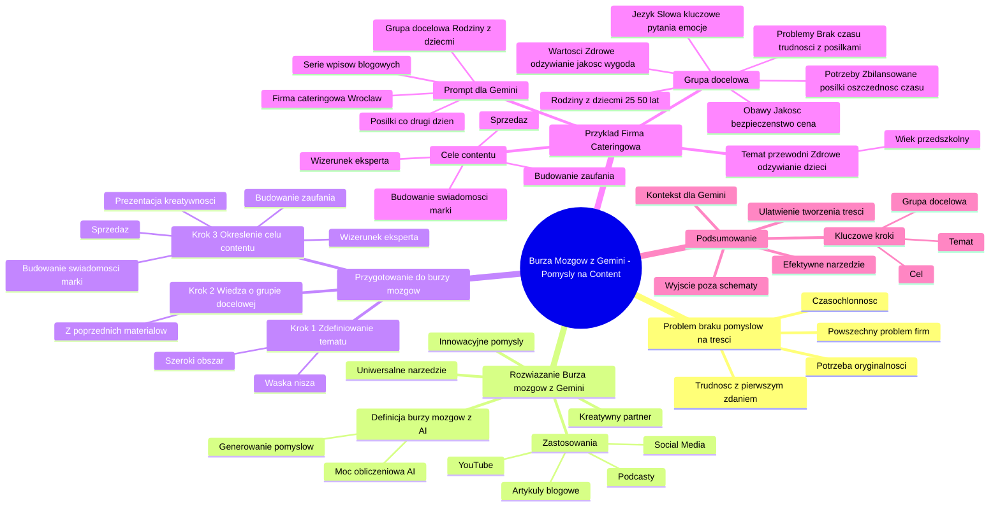

# Lekcje wideo - 3. Burza mózgów z AI

# 💡 Diagram

___

# 🗒️ Notatka

# Notatki i Podsumowanie Burzy Mózgów z Gemini dla Pomysłów na Content

## Wstęp

Niniejsze notatki podsumowują transkrypcję wideo, która porusza problem braku pomysłów na treści, w szczególności artykuły blogowe.  Jako rozwiązanie przedstawiono burzę mózgów z wykorzystaniem sztucznej inteligencji Gemini. Materiał ilustruje, jak efektywnie użyć Gemini do generowania kreatywnych tematów na bloga, postów w mediach społecznościowych, podcastów czy filmów na YouTube, na przykładzie firmy cateringowej.

## Szczegółowe Notatki

### Problem Klienta i Potencjał na Content ([00:00:05] - [00:00:18])

- **Problem:** Czasochłonność procesu znajdowania tematu i napisania pierwszego zdania artykułu blogowego.
- **Cel:** Tworzenie oryginalnych i angażujących tekstów dla użytkowników.
- **Rozwiązanie:** Burza mózgów z Gemini.

### Gemini jako Uniwersalne Narzędzie do Burzy Mózgów ([00:00:27] - [00:00:53])

- **Burza mózgów z Gemini:** Narzędzie wspomagające generowanie pomysłów na content.
- **Zastosowania:**
    - Artykuły blogowe
    - Posty w mediach społecznościowych
    - Konspekty podcastów
    - Scenariusze filmów na YouTube
- **Kluczowe przesłanie:** Gemini jest pomocne wszędzie tam, gdzie potrzebne są świeże pomysły.

### Powszechny Problem Firm - Brak Inspiracji na Treści ([00:00:57] - [01:06])

- **Częsty problem firm:**  „Nie wiem, o czym pisać, brakuje mi pomysłów na treści.”
- **Rozwiązanie:** Krótka sesja z Gemini rozwiązuje ten problem.

### Burza Mózgów z AI - Generowanie Innowacyjnych Pomysłów ([01:01:11] - [01:28])

- **Rozwiązanie problemu braku pomysłów:** Burza mózgów z AI (Gemini).
- **Definicja burzy mózgów (w kontekście AI):** Wykorzystanie mocy obliczeniowej AI do wygenerowania maksymalnej liczby pomysłów na dany temat.
- **Gemini jako kreatywny partner:** Pomaga wyjść poza utarte schematy myślowe i odkryć unikalne perspektywy.

### Przygotowanie do Burzy Mózgów ([01:47] - [01:50])

- **Krok 1:** Zdefiniowanie ogólnego tematu.

### Przykład Planowania Wpisów Blogowych ([01:50] - [02:24])

- **Przykład:** Tworzenie planu wpisów blogowych dla firmy networkingowej.
- **Tematyka bloga:** Biznes, motywacja, samotność przedsiębiorców.
- **Rezultat burzy mózgów:** Wygenerowanie ponad 100 pomysłów na wpisy blogowe w krótkim czasie.
- **Charakterystyka wygenerowanych tematów:**
    - Lekko kontrowersyjne
    - Wzbudzające emocje
    - Dotykające problemów przedsiębiorców i dyrektorów
    - Edukujące w zakresie automatyzacji biznesu

### Przygotowanie do Burzy Mózgów - Kroki 1 i 2 ([02:39] - [02:57])

- **Powtórzenie Kroku 1:** Określenie ogólnego tematu (wąska nisza lub szeroki obszar).
- **Kontynuacja przykładu:** Firma cateringowa.
- **Krok 2:** Wykorzystanie wiedzy o grupie docelowej (z poprzednich materiałów).

### Cel Tworzenia Contentu - Klucz do Efektywnej Burzy Mózgów ([02:57] - [03:26])

- **Krok 3:** Określenie celu tworzenia contentu.
- **Znaczenie celu:** Gemini lepiej dopasuje język i zakres tematyczny do zamierzonego celu.
- **Przykładowe cele contentu:**
    - Budowanie świadomości marki
    - Budowanie zaufania klientów
    - Sprzedaż
    - Prezentacja kreatywności
    - Budowanie wizerunku eksperta
- **Ważna wskazówka:** Należy poinformować Gemini o celu tworzenia treści.

### Przykład Tematu Przewodniego i Prompt dla Gemini ([03:29] - [03:42])

- **Temat przewodni (przykład cateringowy):** Zdrowe odżywianie dzieci w wieku przedszkolnym.
- **Przykładowy Prompt dla Gemini:**
    > Gemini, prowadzę firmę cateringową we Wrocławiu, która dostarcza posiłki co drugi dzień i chcę stworzyć serię wpisów blogowych atrakcyjnych dla mojej grupy docelowej. Uwzględniając ich potrzeby, wyzwania i zainteresowania oraz moje produkty, wygeneruj kreatywne i wartościowe propozycje tematów na bloga. Chciałabym, aby wpisy skupiały się na zdrowej diecie dla dzieci w wieku przedszkolnym. Oto kluczowe informacje o mojej grupie docelowej:
    >
    > **Podsumowanie profilu Twojej grupy docelowej:**
    >
    > *Kim są Twoi klienci?* Rodziny z dziećmi. Przeważnie pary w wieku 25-50 lat z małymi dziećmi.
    > *Wartości:* Cenią sobie zdrowe odżywianie, jakość produktów, wygodę i oszczędność czasu.
    > *Potrzeby:* Zdrowe i zbilansowane posiłki dla całej rodziny, dostosowane do różnych preferencji (w tym diet specjalnych). Oszczędność czasu na przygotowywaniu posiłków. Różnorodność w menu, aby uniknąć monotonii. Wysoka jakość produktów i profesjonalna obsługa.
    > *Problemy:* Brak czasu na gotowanie. Trudności w przygotowywaniu zdrowych posiłków dla dzieci. Znajdowanie odpowiednich rozwiązań dla rodzin z alergiami lub innymi ograniczeniami żywieniowymi.
    > *Cele:* Zapewnienie zdrowego odżywiania dla rodziny. Ułatwienie codziennego życia. Znajdowanie zaufanego dostawcy posiłków.
    > *Jakie są ich największe obawy lub wyzwania?* Obawy: Jakość produktów, zwłaszcza świeżość i składniki. Bezpieczeństwo żywności, szczelność w przypadku alergii. Cena: Chcą znaleźć korzystny stosunek jakości do ceny. Elastyczność oferty, możliwość dostosowania do indywidualnych potrzeb.
    > *Jaki język używają?* Słowa kluczowe: zdrowe, zbilansowany, naturalny, ekologiczny, dzieci, porcje, smaki, urozmaicenie, szybko, łatwo, wygodnie, dostawa, gotowe dania, oszczędność czasu, cena, koszt, promocje, rabaty, świeże, smaczne, różnorodne, domowe, alergie, dieta. Pytania: Jakie są składniki? Czy posiłki są odpowiednie dla dzieci? Jak długo można przechowywać? Czy możecie przygotować posiłki dla dzieci z alergiami? Ile kosztuje dostawa? Czy posiłki są zdrowe? Czy produkty są lokalne? Jak często mogę zamawiać?
    > *Emocje:* Chęć zapewnienia zdrowego odżywiania dla rodziny, obawa o brak czasu, potrzeba zaufania do dostawcy.
    > *Jak dostosować ofertę i komunikację?* Używaj prostego języka. Unikaj skomplikowanych terminów i długich opisów. Bądź transparentny: Informuj o składnikach, procesie produkcji i spełnianiu norm higienicznych. Oferuj elastyczność: Pozwól klientom dostosować zamówienia do swoich potrzeb. Buduj zaufanie: Dziel się pozytywnymi opiniami klientów i historiami sukcesu. Używaj języka korzyści: Zamiast mówić o produktach, mów o tym, co one dają klientowi (np. „Zdrowe posiłki dla całej rodziny”, „Oszczędź czas na gotowaniu”).
    > *Dodatkowe wskazówki:* Personalizacja: Dostosuj komunikację do różnych segmentów klientów (np. rodziny z niemowlakami, rodziny z alergiami). Wizualizacja: Używaj atrakcyjnych zdjęć i filmów prezentujących Twoje dania. Promocje i rabaty: Oferuj specjalne promocje dla nowych klientów lub przy większych zamówieniach. Współpracuj z influencerami: Zbuduj relacje z mamami-blogerkami, które mogą polecić Twoją usługę.
    > *Nie jestem przekonana co do tych tematów. Czy uwzględniają one trendy panujące w tej niszy? Czy możesz zaproponować mi więcej tematów?*

### Podsumowanie

Podsumowując, materiał przedstawia burzę mózgów z Gemini jako efektywne narzędzie do generowania pomysłów na różnorodne formy contentu. Kluczowe kroki przygotowania do burzy mózgów to zdefiniowanie tematu, grupy docelowej i celu contentu. Przykład firmy cateringowej i prompt dla Gemini ilustrują praktyczne zastosowanie tej metody. Prezentacja podkreśla, że Gemini może znacząco ułatwić proces tworzenia treści, pomagając wyjść poza schematy i generować świeże, angażujące pomysły. Istotne jest, aby dostarczyć Gemini jak najwięcej kontekstu dotyczącego grupy docelowej i celów contentu, aby uzyskać jak najlepsze rezultaty.

___

# 🔉 Transcript
File: Lekcje wideo - 3. Burza mózgów z AI.mp4 
[00:00:05] Problem klienta to twoja szansa, ale też problem, no bo o czym by tu napisać?
[00:00:12] Napisanie pierwszego zdania, czy nawet wybranie pomysłu zabiera za dużo cennego czasu.
[00:00:18] A przecież chcemy nie tylko napisać dobry artykuł, ale również sprawić, żeby ten tekst był oryginalny i przyciągał użytkowników.
[00:00:27] Na pomoc przychodzi burza mózgów z Gemini.
[00:00:30] Zanim sprawdzimy jak to przeprowadzić, chciałabym, żebyśmy zwrócili uwagę na jeden aspekt.
[00:00:36] Mówimy tu o tworzeniu burzy mózgów, a także o tworzeniu contentu w kontekście artykułów blogowych.
[00:00:44] Jednak cały ten moduł możemy wykorzystać do stworzenia nowego postu na social media lub stworzeniu konspektu odcinka podcastu czy filmu na YouTubie.
[00:00:53] Wszędzie tam, gdzie przydadzą ci się dodatkowe pomysły.
[00:00:57] Bardzo często zgłaszają się do mnie firmy z tym samym problemem.
[00:01:01] Nie wiem o czym pisać, nie mam pojęcia na jaki temat tworzyć treści.
[00:01:06] Pokażę ci dzisiaj, że wystarczy krótka rozmowa z Gemini i ten problem znika.
[00:01:11] Jeśli też miewasz podobne problemy i zastanawiasz się co napisać, sprawdź czy nie warto przeprowadzić burzy mózgów z AI, aby generować ciekawe pomysły na tematy różnorodnych form contentu.
[00:01:24] Zacznijmy od wyjaśnienia czym jest burza mózgów.
[00:01:28] Burza mózgu jest to proces, w którym wykorzystujemy moc obliczeniową sztucznej inteligencji, aby generować jak największą liczbę pomysłów na dany temat.
[00:01:37] Gemini może służyć jako nasz kreatywny partner, który pomoże nam wyjść poza nasze utarte już schematy i znaleźć unikalne perspektywy.
[00:01:47] Dobra, to jak przygotować się do burzy mózgów?
[00:01:50] Po pierwsze, zdefiniujmy ogólny temat, jaki nas interesuje.
[00:01:55] Z moich własnych historii to w minionym roku tworzyłam plan wpisów blogowych dla firmy zajmującej się organizacją networkingów dla przedsiębiorców.
[00:02:06] Na swoim blogu tworzyli ogólne wpisy na temat biznesu, motywacji i problemów związanych z samotnością przedsiębiorców.
[00:02:15] Jednak już wtedy dzięki burzy mózgu wygenerowaliśmy ponad 100 pomysłów na wpisy blogowe w ciągu zaledwie kilku chwil.
[00:02:24] Wszystkie, zgodne z zaleceniami, były lekko kontrowersyjne i wzbudzały różne emocje, dotykały problemów przedsiębiorców i dyrektorów zarządzających, a także edukowały w obszarach związanych z automatyzacją biznesu.
[00:02:39] To teraz my.
[00:02:41] Zacznijmy od określenia ogólnego tematu, który nas interesuje.
[00:02:45] Może to być na przykład wąska nisza, jak i szerszy obszar.
[00:02:49] Ja będę kontynuowała przykład naszego cateringu.
[00:02:52] Grupę docelową już przygotowaliśmy w poprzedniej lekcji i teraz ją wykorzystamy.
[00:02:57] Oprócz tego warto jeszcze dać znać naszemu prywatnemu specjaliście, jaki jest nasz cel tworzenia contentu.
[00:03:05] Jeśli Gemini zrozumie po co tworzysz content, lepiej dopasuje język i konspekt do celu, jakie chcesz osiągnąć.
[00:03:13] Zastanówmy się, czy tekst ma budować świadomość marki, zaufanie potencjalnych klientów, czy może sprzedawać.
[00:03:22] Ma pokazać naszą kreatywność, czy budować wizerunek eksperta.
[00:03:26] Dajmy znać Gemini po co tworzymy treści.
[00:03:29] Skoro zajmujemy się cateringiem, to niech teraz naszym tematem przewodnim będzie zdrowe odżywianie dzieci w wieku przedszkolnym.
[00:03:37] (Na ekranie widoczna jest przeglądarka z otwartą stroną Gemini Advanced. W oknie czatu widoczna jest treść: "Gemini, prowadzę firmę cateringową na terenie Wrocławia, która dostarcza posiłki co drugi dzień i chcę stworzyć serię wpisów blogowych, które będą atrakcyjne dla mojej grupy docelowej. Mając na uwadze ich potrzeby, wyzwania i zainteresowania oraz moje produkty, wygeneruj kreatywne i wartościowe propozycje tematów na bloga. Chciałabym, aby wpisy skupiały się na temacie zdrowej diety dla dzieci w wieku przedszkolnym. Oto najważniejsze informacje o mojej grupie docelowej: Podsumowanie profilu Twojej grupy docelowej: Kim są Twoi klienci? Rodziny z dziećmi. Przeważnie pary w wieku 25-50 lat z małymi dziećmi. Wartości: Cenią sobie zdrowe odżywianie, jakość produktów, wygodę i oszczędność czasu. Potrzeby: Zdrowe i zbilansowane posiłki dla całej rodziny, dostosowane do różnych preferencji (w tym diet specjalnych). Oszczędność czasu na przygotowywaniu posiłków. Różnorodność w menu, aby uniknąć monotonii. Wysoka jakość produktów i profesjonalna obsługa. Problemy: Brak czasu na gotowanie. Trudności w przygotowywaniu zdrowych posiłków dla dzieci. Znajdowanie odpowiednich rozwiązań dla rodzin z alergiami lub innymi ograniczeniami żywieniowymi. Cele: Zapewnienie zdrowego odżywiania dla rodziny. Ułatwienie codziennego życia. Znajdowanie zaufanego dostawcy posiłków. Jakie są ich największe obawy lub wyzwania? Obawy: Jakość produktów, zwłaszcza jeśli chodzi o świeżość i składniki. Bezpieczeństwo żywności, szczelność w przypadku alergii. Cena: Chcą znaleźć korzystną relację jakości do ceny. Elastyczność oferty, możliwość dostosowania do indywidualnych potrzeb. Jaki język używają? Słowa kluczowe: zdrowe, zbilansowany, naturalny, ekologiczny, dzieci, porcje, smaki, urozmaicenie, szybko, łatwo, wygodnie, dostawa, gotowe dania, oszczędność czasu, cena, koszt, promocje, rabaty, świeże, smaczne, różnorodne, domowe, alergie, dieta. Pytania: Jakie są składniki? Czy posiłki są odpowiednie dla dzieci? Jak długo można przechowywać? Czy możecie przygotować posiłki dla dzieci z alergiami? Ile kosztuje dostawa? Czy posiłki są zdrowe? Czy produkty są lokalne? Jak często mogę zamawiać? Emocje: Chęć zapewnienia zdrowego odżywiania dla rodziny, obawa o brak czasu, potrzeba zaufania do dostawcy. Jak dostosować ofertę i komunikację? Używaj prostego języka. Unikaj skomplikowanych terminów i długich opisów. Bądź transparentny: Informuj o składnikach, procesie produkcji i spełnianiu norm higienicznych. Oferuj elastyczność: Pozwól klientom dostosować zamówienia do swoich potrzeb. Buduj zaufanie: Dziel się pozytywnymi opiniami klientów i historiami sukcesu. Używaj języka korzyści: Zamiast mówić o produktach, mów o tym, co one dają klientowi (np. "Zdrowe posiłki dla całej rodziny"). "Oszczędź czas na gotowaniu"). Dodatkowe wskazówki: Personalizacja: Dostosuj komunikację do różnych segmentów klientów (np. rodziny z niemowlakami, rodziny z alergiami). Wizualizacja: Używaj atrakcyjnych zdjęć i filmów prezentujących Twoje dania. Promocje i rabaty: Oferuj specjalne promocje dla nowych klientów lub przy większych zamówieniach. Współpracuj z influencerami: Zbuduj relacje z mamami-blogerkami, które mogą polecić Twoją usługę. Czy chciałabyś, żebym stworzył dla Ciebie przykładowy post na social media lub opis oferty, który uwzględnia te informacje?").
[00:03:41] (Na ekranie widoczna jest przeglądarka z otwartą stroną Gemini Advanced. W oknie czatu widoczna jest treść: "Gemini, prowadzę firmę cateringową na terenie Wrocławia, która dostarcza posiłki co drugi dzień i chcę stworzyć serię wpisów blogowych, które będą atrakcyjne dla mojej grupy docelowej. Mając na uwadze ich potrzeby, wyzwania i zainteresowania oraz moje produkty, wygeneruj kreatywne i wartościowe propozycje tematów na bloga. Chciałabym, aby wpisy skupiały się na temacie zdrowej diety dla dzieci w wieku przedszkolnym. Oto najważniejsze informacje o mojej grupie docelowej: Podsumowanie profilu Twojej grupy docelowej: Kim są Twoi klienci? Rodziny z dziećmi. Przeważnie pary w wieku 25-50 lat z małymi dziećmi. Wartości: Cenią sobie zdrowe odżywianie, jakość produktów, wygodę i oszczędność czasu. Potrzeby: Zdrowe i zbilansowane posiłki dla całej rodziny, dostosowane do różnych preferencji (w tym diet specjalnych). Oszczędność czasu na przygotowywaniu posiłków. Różnorodność w menu, aby uniknąć monotonii. Wysoka jakość produktów i profesjonalna obsługa. Problemy: Brak czasu na gotowanie. Trudności w przygotowywaniu zdrowych posiłków dla dzieci. Znajdowanie odpowiednich rozwiązań dla rodzin z alergiami lub innymi ograniczeniami żywieniowymi. Cele: Zapewnienie zdrowego odżywiania dla rodziny. Ułatwienie codziennego życia. Znajdowanie zaufanego dostawcy posiłków. Jakie są ich największe obawy lub wyzwania? Obawy: Jakość produktów, zwłaszcza jeśli chodzi o świeżość i składniki. Bezpieczeństwo żywności, szczelność w przypadku alergii. Cena: Chcą znaleźć korzystną relację jakości do ceny. Elastyczność oferty, możliwość dostosowania do indywidualnych potrzeb. Jaki język używają? Słowa kluczowe: zdrowe, zbilansowany, naturalny, ekologiczny, dzieci, porcje, smaki, urozmaicenie, szybko, łatwo, wygodnie, dostawa, gotowe dania, oszczędność czasu, cena, koszt, promocje, rabaty, świeże, smaczne, różnorodne, domowe, alergie, dieta. Pytania: Jakie są składniki? Czy posiłki są odpowiednie dla dzieci? Jak długo można przechowywać? Czy możecie przygotować posiłki dla dzieci z alergiami? Ile kosztuje dostawa? Czy posiłki są zdrowe? Czy produkty są lokalne? Jak często mogę zamawiać? Emocje: Chęć zapewnienia zdrowego odżywiania dla rodziny, obawa o brak czasu, potrzeba zaufania do dostawcy. Jak dostosować ofertę i komunikację? Używaj prostego języka. Unikaj skomplikowanych terminów i długich opisów. Bądź transparentny: Informuj o składnikach, procesie produkcji i spełnianiu norm higienicznych. Oferuj elastyczność: Pozwól klientom dostosować zamówienia do swoich potrzeb. Buduj zaufanie: Dziel się pozytywnymi opiniami klientów i historiami sukcesu. Używaj języka korzyści: Zamiast mówić o produktach, mów o tym, co one dają klientowi (np. "Zdrowe posiłki dla całej rodziny"). "Oszczędź czas na gotowaniu"). Dodatkowe wskazówki: Personalizacja: Dostosuj komunikację do różnych segmentów klientów (np. rodziny z niemowlakami, rodziny z alergiami). Wizualizacja: Używaj atrakcyjnych zdjęć i filmów prezentujących Twoje dania. Promocje i rabaty: Oferuj specjalne promocje dla nowych klientów lub przy większych zamówieniach. Współpracuj z influencerami: Zbuduj relacje z mamami-blogerkami, które mogą polecić Twoją usługę.").
[00:03:41] (Na ekranie widoczna jest przeglądarka z otwartą stroną Gemini Advanced. W oknie czatu widoczna jest treść: "Gemini, prowadzę firmę cateringową na terenie Wrocławia, która dostarcza posiłki co drugi dzień i chcę stworzyć serię wpisów blogowych, które będą atrakcyjne dla mojej grupy docelowej. Mając na uwadze ich potrzeby, wyzwania i zainteresowania oraz moje produkty, wygeneruj kreatywne i wartościowe propozycje tematów na bloga. Chciałabym, aby wpisy skupiały się na temacie zdrowej diety dla dzieci w wieku przedszkolnym. Oto najważniejsze informacje o mojej grupie docelowej: Podsumowanie profilu Twojej grupy docelowej: Kim są Twoi klienci? Rodziny z dziećmi. Przeważnie pary w wieku 25-50 lat z małymi dziećmi. Wartości: Cenią sobie zdrowe odżywianie, jakość produktów, wygodę i oszczędność czasu. Potrzeby: Zdrowe i zbilansowane posiłki dla całej rodziny, dostosowane do różnych preferencji (w tym diet specjalnych). Oszczędność czasu na przygotowywaniu posiłków. Różnorodność w menu, aby uniknąć monotonii. Wysoka jakość produktów i profesjonalna obsługa. Problemy: Brak czasu na gotowanie. Trudności w przygotowywaniu zdrowych posiłków dla dzieci. Znajdowanie odpowiednich rozwiązań dla rodzin z alergiami lub innymi ograniczeniami żywieniowymi. Cele: Zapewnienie zdrowego odżywiania dla rodziny. Ułatwienie codziennego życia. Znajdowanie zaufanego dostawcy posiłków. Jakie są ich największe obawy lub wyzwania? Obawy: Jakość produktów, zwłaszcza jeśli chodzi o świeżość i składniki. Bezpieczeństwo żywności, szczelność w przypadku alergii. Cena: Chcą znaleźć korzystną relację jakości do ceny. Elastyczność oferty, możliwość dostosowania do indywidualnych potrzeb. Jaki język używają? Słowa kluczowe: zdrowe, zbilansowany, naturalny, ekologiczny, dzieci, porcje, smaki, urozmaicenie, szybko, łatwo, wygodnie, dostawa, gotowe dania, oszczędność czasu, cena, koszt, promocje, rabaty, świeże, smaczne, różnorodne, domowe, alergie, dieta. Pytania: Jakie są składniki? Czy posiłki są odpowiednie dla dzieci? Jak długo można przechowywać? Czy możecie przygotować posiłki dla dzieci z alergiami? Ile kosztuje dostawa? Czy posiłki są zdrowe? Czy produkty są lokalne? Jak często mogę zamawiać? Emocje: Chęć zapewnienia zdrowego odżywiania dla rodziny, obawa o brak czasu, potrzeba zaufania do dostawcy. Jak dostosować ofertę i komunikację? Używaj prostego języka. Unikaj skomplikowanych terminów i długich opisów. Bądź transparentny: Informuj o składnikach, procesie produkcji i spełnianiu norm higienicznych. Oferuj elastyczność: Pozwól klientom dostosować zamówienia do swoich potrzeb. Buduj zaufanie: Dziel się pozytywnymi opiniami klientów i historiami sukcesu. Używaj języka korzyści: Zamiast mówić o produktach, mów o tym, co one dają klientowi (np. "Zdrowe posiłki dla całej rodziny"). "Oszczędź czas na gotowaniu"). Dodatkowe wskazówki: Personalizacja: Dostosuj komunikację do różnych segmentów klientów (np. rodziny z niemowlakami, rodziny z alergiami). Wizualizacja: Używaj atrakcyjnych zdjęć i filmów prezentujących Twoje dania. Promocje i rabaty: Oferuj specjalne promocje dla nowych klientów lub przy większych zamówieniach. Współpracuj z influencerami: Zbuduj relacje z mamami-blogerkami, które mogą polecić Twoją usługę. Nie jestem przekonana co do tych tematów. Czy uwzględniają one trendy panujące w tej niszy? Czy możesz zaproponować mi więcej tematów?").
[00:03:41] (Na ekranie widoczna jest przeglądarka z otwartą stroną Gemini Advanced. W oknie czatu widoczna jest treść: "Gemini, prowadzę firmę cateringową na terenie Wrocławia, która dostarcza posiłki co drugi dzień i chcę stworzyć serię wpisów blogowych, które będą atrakcyjne dla mojej grupy docelowej. Mając na uwadze ich potrzeby, wyzwania i zainteresowania oraz moje produkty, wygeneruj kreatywne i wartościowe propozycje tematów na bloga. Chciałabym, aby wpisy skupiały się na temacie zdrowej diety dla dzieci w wieku przedszkolnym. Oto najważniejsze informacje o mojej grupie docelowej: Podsumowanie profilu Twojej grupy docelowej: Kim są Twoi klienci? Rodziny z dziećmi. Przeważnie pary w wieku 25-50 lat z małymi dziećmi. Wartości: Cenią sobie zdrowe odżywianie, jakość produktów, wygodę i oszczędność czasu. Potrzeby: Zdrowe i zbilansowane posiłki dla całej rodziny, dostosowane do różnych preferencji (w tym diet specjalnych). Oszczędność czasu na przygotowywaniu posiłków. Różnorodność w menu, aby uniknąć monotonii. Wysoka jakość produktów i profesjonalna obsługa. Problemy: Brak czasu na gotowanie. Trudności w przygotowywaniu zdrowych posiłków dla dzieci. Znajdowanie odpowiednich rozwiązań dla rodzin z alergiami lub innymi ograniczeniami żywieniowymi. Cele: Zapewnienie zdrowego odżywiania dla rodziny. Ułatwienie codziennego życia. Znajdowanie zaufanego dostawcy posiłków. Jakie są ich największe obawy lub wyzwania? Obawy: Jakość produktów, zwłaszcza jeśli chodzi o świeżość i składniki. Bezpieczeństwo żywności, szczelność w przypadku alergii. Cena: Chcą znaleźć korzystną relację jakości do ceny. Elastyczność oferty, możliwość dostosowania do indywidualnych potrzeb. Jaki język używają? Słowa kluczowe: zdrowe, zbilansowany, naturalny, ekologiczny, dzieci, porcje, smaki, urozmaicenie, szybko, łatwo, wygodnie, dostawa, gotowe dania, oszczędność czasu, cena, koszt, promocje, rabaty, świeże, smaczne, różnorodne, domowe, alergie, dieta. Pytania: Jakie są składniki? Czy posiłki są odpowiednie dla dzieci? Jak długo można przechowywać? Czy możecie przygotować posiłki dla dzieci z alergiami? Ile kosztuje dostawa? Czy posiłki są zdrowe? Czy produkty są lokalne? Jak często mogę zamawiać? Emocje: Chęć zapewnienia zdrowego odżywiania dla rodziny, obawa o brak czasu, potrzeba zaufania do dostawcy. Jak dostosować ofertę i komunikację? Używaj prostego języka. Unikaj skomplikowanych terminów i długich opisów. Bądź transparentny: Informuj o składnikach, procesie produkcji i spełnianiu norm higienicznych. Oferuj elastyczność: Pozwól klientom dostosować zamówienia do swoich potrzeb. Buduj zaufanie: Dziel się pozytywnymi opiniami klientów i historiami sukcesu. Używaj języka korzyści: Zamiast mówić o produktach, mów o tym, co one dają klientowi (np. "Zdrowe posiłki dla całej rodziny"). "Oszczędź czas na gotowaniu"). Dodatkowe wskazówki: Personalizacja: Dostosuj komunikację do różnych segmentów klientów (np. rodziny z niemowlakami, rodziny z alergiami). Wizualizacja: Używaj atrakcyjnych zdjęć i filmów prezentujących Twoje dania. Promocje i rabaty: Oferuj specjalne promocje dla nowych klientów lub przy większych zamówieniach. Współpracuj z influencerami: Zbuduj relacje z mamami-blogerkami, które mogą polecić Twoją usługę. Nie jestem przekonana co do tych tematów. Czy uwzględniają one trendy panujące w tej niszy? Czy możesz zaproponować mi więcej tematów?").
[00:03:42] (Na ekranie widoczna jest przeglądarka z otwartą stroną Gemini Advanced. W oknie czatu widoczna jest treść: "Gemini, prowadzę firmę cateringową na terenie Wrocławia, która dostarcza posiłki co drugi dzień i chcę stworzyć serię wpisów blogowych, które będą atrakcyjne dla mojej grupy docelowej. Mając na uwadze ich potrzeby, wyzwania i zainteresowania oraz moje produkty, wygeneruj kreatywne i wartościowe propozycje tematów na bloga. Chciałabym, aby wpisy skupiały się na temacie zdrowej diety dla dzieci w wieku przedszkolnym. Oto najważniejsze informacje o mojej grupie docelowej: Podsumowanie profilu Twojej grupy docelowej: Kim są Twoi klienci? Rodziny z dziećmi. Przeważnie pary w wieku 25-50 lat z małymi dziećmi. Wartości: Cenią sobie zdrowe odżywianie, jakość produktów, wygodę i oszczędność czasu. Potrzeby: Zdrowe i zbilansowane posiłki dla całej rodziny, dostosowane do różnych preferencji (w tym diet specjalnych). Oszczędność czasu na przygotowywaniu posiłków. Różnorodność w menu, aby uniknąć monotonii. Wysoka jakość produktów i profesjonalna obsługa. Problemy: Brak czasu na gotowanie. Trudności w przygotowywaniu zdrowych posiłków dla dzieci. Znajdowanie odpowiednich rozwiązań dla rodzin z alergiami lub innymi ograniczeniami żywieniowymi. Cele: Zapewnienie zdrowego odżywiania dla rodziny. Ułatwienie codziennego życia. Znajdowanie zaufanego dostawcy posiłków. Jakie są ich największe obawy lub wyzwania? Obawy: Jakość produktów, zwłaszcza jeśli chodzi o świeżość i składniki. Bezpieczeństwo żywności, szczelność w przypadku alergii. Cena: Chcą znaleźć korzystną relację jakości do ceny. Elastyczność oferty, możliwość dostosowania do indywidualnych potrzeb. Jaki język używają? Słowa kluczowe: zdrowe, zbilansowany, naturalny, ekologiczny, dzieci, porcje, smaki, urozmaicenie, szybko, łatwo, wygodnie, dostawa, gotowe dania, oszczędność czasu, cena, koszt, promocje, rabaty, świeże, smaczne, różnorodne, domowe, alergie, dieta. Pytania: Jakie są składniki? Czy posiłki są odpowiednie dla dzieci? Jak długo można przechowywać? Czy możecie przygotować posiłki dla dzieci z alergiami? Ile kosztuje dostawa? Czy posiłki są zdrowe? Czy produkty są lokalne? Jak często mogę zamawiać? Emocje: Chęć zapewnienia zdrowego odżywiania dla rodziny, obawa o brak czasu, potrzeba zaufania do dostawcy. Jak dostosować ofertę i komunikację? Używaj prostego języka. Unikaj skomplikowanych terminów i długich opisów. Bądź transparentny: Informuj o składnikach, procesie produkcji i spełnianiu norm higienicznych. Oferuj elastyczność: Pozwól klientom dostosować zamówienia do swoich potrzeb. Buduj zaufanie: Dziel się pozytywnymi opiniami klientów i historiami sukcesu. Używaj języka korzyści: Zamiast mówić o produktach, mów o tym, co one dają klientowi (np. "Zdrowe posiłki dla całej rodziny"). "Oszczędź czas na gotowaniu"). Dodatkowe wskazówki: Personalizacja: Dostosuj komunikację do różnych segmentów klientów (np. rodziny z niemowlakami, rodziny z alergiami). Wizualizacja: Używaj atrakcyjnych zdjęć i filmów prezentujących Twoje dania. Promocje i rabaty: Oferuj specjalne promocje dla nowych klientów lub przy większych zamówieniach. Współpracuj z influencerami: Zbuduj relacje z mamami-blogerkami, które mogą polecić Twoją usługę. Nie jestem przekonana co do tych tematów. Czy uwzględniają one trendy panujące w tej niszy? Czy możesz zaproponować mi więcej tematów?").
[00:03:42] (Na ekranie widoczna jest przeglądarka z otwartą stroną Gemini Advanced. W oknie czatu widoczna jest treść: "Gemini, prowadzę firmę cateringową na terenie Wrocławia, która dostarcza posiłki co drugi dzień i chcę stworzyć serię wpisów blogowych, które będą atrakcyjne dla mojej grupy docelowej. Mając na uwadze ich potrzeby, wyzwania i zainteresowania oraz moje produkty, wygeneruj kreatywne i wartościowe propozycje tematów na bloga. Chciałabym, aby wpisy skupiały się na temacie zdrowej diety dla dzieci w wieku przedszkolnym. Oto najważniejsze informacje o mojej grupie docelowej: Podsumowanie profilu Twojej grupy docelowej: Kim są Twoi klienci? Rodziny z dziećmi. Przeważnie pary w wieku 25-50 lat z małymi dziećmi. Wartości: Cenią sobie zdrowe odżywianie, jakość produktów, wygodę i oszczędność czasu. Potrzeby: Zdrowe i zbilansowane posiłki dla całej rodziny, dostosowane do różnych preferencji (w tym diet specjalnych). Oszczędność czasu na przygotowywaniu posiłków. Różnorodność w menu, aby uniknąć monotonii. Wysoka jakość produktów i profesjonalna obsługa. Problemy: Brak czasu na gotowanie. Trudności w przygotowywaniu zdrowych posiłków dla dzieci. Znajdowanie odpowiednich rozwiązań dla rodzin z alergiami lub innymi ograniczeniami żywieniowymi. Cele: Zapewnienie zdrowego odżywiania dla rodziny. Ułatwienie codziennego życia. Znajdowanie zaufanego dostawcy posiłków. Jakie są ich największe obawy lub wyzwania? Obawy: Jakość produktów, zwłaszcza jeśli chodzi o świeżość i składniki. Bezpieczeństwo żywności, szczelność w przypadku alergii. Cena: Chcą znaleźć korzystną relację jakości do ceny. Elastyczność oferty, możliwość dostosowania do indywidualnych potrzeb. Jaki język używają? Słowa kluczowe: zdrowe, zbilansowany, naturalny, ekologiczny, dzieci, porcje, smaki, urozmaicenie, szybko, łatwo, wygodnie, dostawa, gotowe dania, oszczędność czasu, cena, koszt, promocje, rabaty, świeże, smaczne, różnorodne, domowe, alergie, dieta. Pytania: Jakie są składniki? Czy posiłki są odpowiednie dla dzieci? Jak długo można przechowywać? Czy możecie przygotować posiłki dla dzieci z alergiami? Ile kosztuje dostawa? Czy posiłki są zdrowe? Czy produkty są lokalne? Jak często mogę zamawiać? Emocje: Chęć zapewnienia zdrowego odżywiania dla rodziny, obawa o brak czasu, potrzeba zaufania do dostawcy. Jak dostosować ofertę i komunikację? Używaj prostego języka. Unikaj skomplikowanych terminów i długich opisów. Bądź transparentny: Informuj o składnikach, procesie produkcji i spełnianiu norm higienicznych. Oferuj elastyczność: Pozwól klientom dostosować zamówienia do swoich potrzeb. Buduj zaufanie: Dziel się pozytywnymi opiniami klientów i historiami sukcesu. Używaj języka korzyści: Zamiast mówić o produktach, mów o tym, co one dają klientowi (np. "Zdrowe posiłki dla całej rodziny"). "Oszczędź czas na gotowaniu"). Dodatkowe wskazówki: Personalizacja: Dostosuj komunikację do różnych segmentów klientów (np. rodziny z niemowlakami, rodziny z alergiami). Wizualizacja: Używaj atrakcyjnych zdjęć i filmów prezentujących Twoje dania. Promocje i rabaty: Oferuj specjalne promocje dla nowych klientów lub przy większych zamówieniach. Współpracuj z influencerami: Zbuduj relacje z mamami-blogerkami, które mogą polecić Twoją usługę. Nie jestem przekonana co do tych tematów. Czy uwzględniają one trendy panujące w tej niszy? Czy możesz zaproponować mi więcej tematów?").
[00:03:42] (Na ekranie widoczna jest przeglądarka z otwartą stroną Gemini Advanced. W oknie czatu widoczna jest treść: "Gemini, prowadzę firmę cateringową na terenie Wrocławia, która dostarcza posiłki co drugi dzień i chcę stworzyć serię wpisów blogowych, które będą atrakcyjne dla mojej grupy docelowej. Mając na uwadze ich potrzeby, wyzwania i zainteresowania oraz moje produkty, wygeneruj kreatywne i wartościowe propozycje tematów na bloga. Chciałabym, aby wpisy skupiały się na temacie zdrowej diety dla dzieci w wieku przedszkolnym. Oto najważniejsze informacje o mojej grupie docelowej: Podsumowanie profilu Twojej grupy docelowej: Kim są Twoi klienci? Rodziny z dziećmi. Przeważnie pary w wieku 25-50 lat z małymi dziećmi. Wartości: Cenią sobie zdrowe odżywianie, jakość produktów, wygodę i oszczędność czasu. Potrzeby: Zdrowe i zbilansowane posiłki dla całej rodziny, dostosowane do różnych preferencji (w tym diet specjalnych). Oszczędność czasu na przygotowywaniu posiłków. Różnorodność w menu, aby uniknąć monotonii. Wysoka jakość produktów i profesjonalna obsługa. Problemy: Brak czasu na gotowanie. Trudności w przygotowywaniu zdrowych posiłków dla dzieci. Znajdowanie odpowiednich rozwiązań dla rodzin z alergiami lub innymi ograniczeniami żywieniowymi. Cele: Zapewnienie zdrowego odżywiania dla rodziny. Ułatwienie codziennego życia. Znajdowanie zaufanego dostawcy posiłków. Jakie są ich największe obawy lub wyzwania? Obawy: Jakość produktów, zwłaszcza jeśli chodzi o świeżość i składniki. Bezpieczeństwo żywności, szczelność w przypadku alergii. Cena: Chcą znaleźć korzystną relację jakości do ceny. Elastyczność oferty, możliwość dostosowania do indywidualnych potrzeb. Jaki język używają? Słowa kluczowe: zdrowe, zbilansowany, naturalny, ekologiczny, dzieci, porcje, smaki, urozmaicenie, szybko, łatwo, wygodnie, dostawa, gotowe dania, oszczędność czasu, cena, koszt, promocje, rabaty, świeże, smaczne, różnorodne, domowe, alergie, dieta. Pytania: Jakie są składniki? Czy posiłki są odpowiednie dla dzieci? Jak długo można przechowywać? Czy możecie przygotować posiłki dla dzieci z alergiami? Ile kosztuje dostawa? Czy posiłki są zdrowe? Czy produkty są lokalne? Jak często mogę zamawiać? Emocje: Chęć zapewnienia zdrowego odżywiania dla rodziny, obawa o brak czasu, potrzeba zaufania do dostawcy. Jak dostosować ofertę i komunikację? Używaj prostego języka. Unikaj skomplikowanych terminów i długich opisów. Bądź transparentny: Informuj o składnikach, procesie produkcji i spełnianiu norm higienicznych. Oferuj elastyczność: Pozwól klientom dostosować zamówienia do swoich potrzeb. Buduj zaufanie: Dziel się pozytywnymi opiniami klientów i historiami sukcesu. Używaj języka korzyści: Zamiast mówić o produktach, mów o tym, co one dają klientowi (np. "Zdrowe posiłki dla całej rodziny"). "Oszczędź czas na gotowaniu"). Dodatkowe wskazówki: Personalizacja: Dostosuj komunikację do różnych segmentów klientów (np. rodziny z niemowlakami, rodziny z alergiami). Wizualizacja: Używaj atrakcyjnych zdjęć i filmów prezentujących Twoje dania. Promocje i rabaty: Oferuj specjalne promocje dla nowych klientów lub przy większych zamówieniach. Współpracuj z influencerami: Zbuduj relacje z mamami-blogerkami, które mogą polecić Twoją usługę. Nie jestem przekonana co do tych tematów. Czy uwzględniają one trendy panujące w tej niszy? Czy możesz zaproponować mi więcej tematów?").
[00:03:42] (Na ekranie widoczna jest przeglądarka z otwartą stroną Gemini Advanced. W oknie czatu widoczna jest treść: "Gemini, prowadzę firmę cateringową na terenie Wrocławia, która dostarcza posiłki co drugi dzień i chcę stworzyć serię wpisów blogowych, które będą atrakcyjne dla mojej grupy docelowej. Mając na uwadze ich potrzeby, wyzwania i zainteresowania oraz moje produkty, wygeneruj kreatywne i wartościowe propozycje tematów na bloga. Chciałabym, aby wpisy skupiały się na temacie zdrowej diety dla dzieci w wieku przedszkolnym. Oto najważniejsze informacje o mojej grupie docelowej: Podsumowanie profilu Twojej grupy docelowej: Kim są Twoi klienci? Rodziny z dziećmi. Przeważnie pary w wieku 25-50 lat z małymi dziećmi. Wartości: Cenią sobie zdrowe odżywianie, jakość produktów, wygodę i oszczędność czasu. Potrzeby

___
# 🏷️ Tags
#content_creation #artykuły_blogowe #posty_w_mediach_społecznościowych #podcasty #YouTube #burza_mózgów #Gemini #sztuczna_inteligencja #AI #generowanie_pomysłów #tematy_na_bloga #inspiracja #firma_cateringowa #problem_klienta #oryginalne_teksty #angażujące_teksty #świeże_pomysły #brak_pomysłów #kreatywny_partner #utarte_schematy #unikalne_perspektywy #planowanie_wpisów_blogowych #firma_networkingowa #biznes #motywacja #samotność_przedsiębiorców #automatyzacja_biznesu #grupa_docelowa #cel_contentu #świadomość_marki #zaufanie_klientów #sprzedaż #prezentacja_kreatywności #wizerunek_eksperta #temat_przewodni #prompt #zdrowe_odżywianie_dzieci #wiek_przedszkolny #Wrocław #potrzeby_klientów #wyzwania_klientów #zainteresowania_klientów #produkty #kreatywne_propozycje #wartościowe_propozycje #rodziny_z_dziećmi #pary_25-50_lat #małe_dzieci #jakość_produktów #wygoda #oszczędność_czasu #zbilansowane_posiłki #diety_specjalne #różnorodność_menu #wysoka_jakość #profesjonalna_obsługa #brak_czasu_na_gotowanie #trudności_w_przygotowywaniu_posiłków #alergie #ograniczenia_żywieniowe #zaufany_dostawca_posiłków #obawy_klientów #świeżość_składników #bezpieczeństwo_żywności #szczelność_alergii #cena #stosunek_jakości_do_ceny #elastyczność_oferty #indywidualne_potrzeby #język_klientów #słowa_kluczowe #naturalny #ekologiczny #porcje #smaki #urozmaicenie #szybko #łatwo #wygodnie #dostawa #gotowe_dania #koszt #promocje #rabaty #świeże #smaczne #różnorodne #domowe #pytania_klientów #składniki #przechowywanie #lokalne_produkty #częstotliwość_zamawiania #emocje_klientów #transparentność #proces_produkcji #normy_higieniczne #pozytywne_opinie #historie_sukcesu #język_korzyści #personalizacja #segmenty_klientów #niemowlaki #wizualizacja #atrakcyjne_zdjęcia #filmy #współpraca_z_influencerami #mamy-blogerki #trendy_w_niszy #content_marketing #social_media #inspiracje #kreatywność #efektywność #plan_contentu
