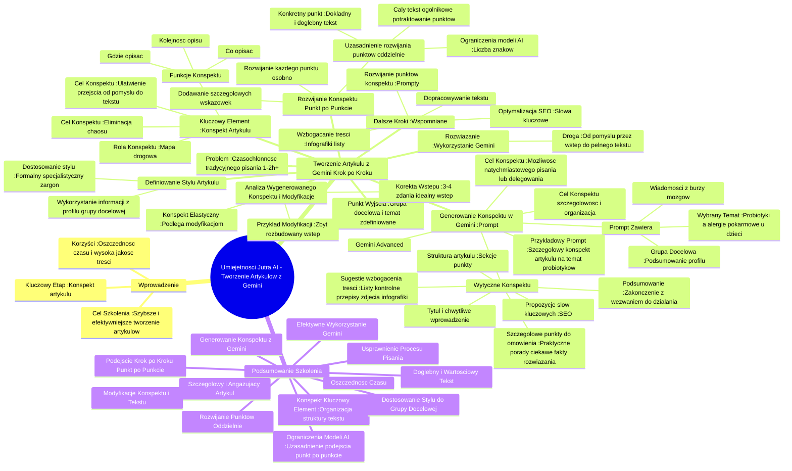

# Lekcje wideo - 4. Tworzenie artykułu

# 💡 Diagram

___

# 🗒️ Notatka

# Notatki i Podsumowanie Wideo: Umiejętności Jutra AI - Tworzenie Artykułów z `Gemini`

## Wprowadzenie

Niniejsze notatki podsumowują szkolenie wideo dotyczące wykorzystania narzędzia **Gemini** do szybszego i efektywniejszego tworzenia artykułów. Szkolenie koncentruje się na generowaniu **konspektu artykułu** jako kluczowym etapie organizacji pracy i zapewnienia wysokiej jakości tekstu. Prezentowane kroki mają na celu pokazanie, jak z pomocą AI przejść od pomysłu do gotowego, angażującego artykułu, oszczędzając czas i zachowując wysoki poziom treści.

## Tworzenie Artykułu z `Gemini`: Krok po Kroku

### 1. Punkt Wyjścia: Grupa Docelowa i Temat

- Szkolenie rozpoczyna się od założenia, że **grupa docelowa** i **temat artykułu** są już zdefiniowane (zgodnie z poprzednią lekcją).
- Aktualnym celem jest przekształcenie tych elementów w wciągający artykuł.

### 2. Problem: Czasochłonność Tradycyjnego Pisania

- Samodzielne napisanie artykułu może zająć od **1 do 2 godzin**, a nawet więcej osobom bez doświadczenia.
- Pojawia się więc pytanie: jak **przyspieszyć ten proces** bez obniżania jakości?

### 3. Rozwiązanie: Wykorzystanie `Gemini`

- Szkolenie przedstawia **Gemini** jako narzędzie do **sprawniejszego tworzenia artykułów**.
- Proces ten obejmuje drogę:\
    - Od pomysłu,\
    - Poprzez wstęp,\
    - Aż do pełnego tekstu, który przyciągnie uwagę czytelników.

### 4. Kluczowy Element: Konspekt Artykułu

- Pierwszym i najważniejszym krokiem jest stworzenie **konspektu**, czyli **struktury artykułu**.
- **Konspekt** pełni rolę **mapy drogowej**, która wskazuje:
    - Co należy opisać,
    - Gdzie to opisać,
    - I w jakiej kolejności.
- Celem konspektu jest **ułatwienie płynnego przejścia od pomysłu do gotowego tekstu, eliminując chaos** w procesie twórczym.

### 5. Generowanie Konspektu w `Gemini` - `Prompt`

- Użytkownik przechodzi do **Gemini Advanced** (widoczne na ekranie laptopa).
- Następnie wprowadza **`prompt`** (komendę) dla Gemini, zawierający:
    - Informacje o **grupie docelowej** (wklejone podsumowanie profilu z poprzedniej lekcji).
    - **Wiadomości z burzy mózgów** dotyczących tematów blogowych.
    - **Wybrany temat artykułu**: "Probiotyki a alergie pokarmowe u dzieci".
- **`Prompt`**: "Gemini, na podstawie informacji o mojej grupie docelowej (podsumowanie profilu wklejam poniżej, jest to to samo, które opracowaliśmy na pierwszej lekcji) oraz wiadomości z burzy mózgów dotyczącej tematów blogowych, przygotuj szczegółowy konspekt artykułu na wybrany temat. Zależy mi, aby rozwinięcie było wartościowe, interesujące i angażujące dla mojej grupy docelowej. Temat artykułu: Probiotyki a alergie pokarmowe u dzieci – proszę o rozwinięcie tematu."
- Dodatkowo, użytkownik precyzuje **konkretne wytyczne** dotyczące konspektu:
    - **Tytuł i chwytliwe wprowadzenie**.
    - **Struktura artykułu**: podział na sekcje/punkty.
    - **Szczegółowe punkty do omówienia**: praktyczne porady, ciekawe fakty, rozwiązania problemów grupy docelowej.
    - **Sugestie dotyczące wzbogacenia treści**: listy kontrolne, przepisy, zdjęcia, infografiki.
    - **Podsumowanie**: zakończenie z wezwaniem do działania lub inspirującą myślą.
    - **Propozycje słów kluczowych**: pod kątem **SEO**.
- Użytkownik podkreśla, że konspekt ma być **dokładny i dobrze zorganizowany**, aby umożliwić natychmiastowe rozpoczęcie pisania lub zlecenie tekstu copywriterowi.

### 6. Analiza Wygenerowanego Konspektu i Modyfikacje

- **Gemini** generuje **konspekt** zgodnie z zadanym `promptem`, dzieląc artykuł na wstęp, podpunkty i zakończenie, a także proponując dodatkowe elementy.
- **Konspekt jest elastyczny** i **podlega modyfikacjom**.
- W zaprezentowanym przykładzie zauważono, że **wstęp jest zbyt rozbudowany** (trzy podpunkty, podczas gdy idealnie powinien składać się z 3-4 zdań).
- Użytkownik zapowiada, że pokaże, jak to **skorygować** w dalszej części szkolenia.

### 7. Rozwijanie Konspektu Punkt po Punkcie

- Po akceptacji konspektu, następuje etap **rozwijania każdego punktu konspektu** osobno.
- Użytkownik rekomenduje, aby prosić **Gemini** o rozwinięcie **każdego punktu po kolei**, dodając szczegółowe wskazówki.
- **Uzasadnienie rozwijania punktów oddzielnie**:
    - **Ograniczenia modeli AI** dotyczące liczby znaków w pojedynczej odpowiedzi.
    - Prośba o wygenerowanie całego tekstu na podstawie rozbudowanego konspektu skutkowałaby **ogólnikowym potraktowaniem podpunktów**.
    - Skoncentrowanie się na **konkretnym punkcie** pozwala **Gemini** stworzyć **dokładny i dogłębny tekst**.

### 8. Definiowanie Stylu Artykułu

- Niezbędne jest zdefiniowanie **stylu artykułu**, wykorzystując informacje zgromadzone w poprzedniej lekcji (profil grupy docelowej).
- Istnieje możliwość **dostosowania stylu** na bardziej formalny lub specjalistyczny, z użyciem żargonu branżowego.

### 9. Dalsze Kroki (Wspomniane, ale nie omówione szczegółowo)

- Transkrypcja urywa się w momencie przygotowywania `promptu` do rozwinięcia punktów konspektu.
- Można przypuszczać, że kolejne kroki będą obejmowały:
    - Wprowadzanie `promptów` dla **Gemini**, aby rozwinąć każdy punkt konspektu.
    - Dopracowywanie wygenerowanego tekstu.
    - Dodawanie elementów wzbogacających treść (infografiki, listy, itp.).
    - Optymalizację **SEO** (słowa kluczowe).

## Podsumowanie

Szkolenie \"Umiejętności Jutra AI\" demonstruje, jak efektywnie wykorzystać **Gemini** do tworzenia artykułów. **Konspekt** stanowi kluczowy element, pomagając zorganizować strukturę tekstu i usprawniając proces pisania. Generowanie konspektu z pomocą **Gemini**, a następnie rozwijanie poszczególnych punktów oddzielnie, umożliwia uzyskanie **szczegółowego i angażującego artykułu**, przy jednoczesnej **oszczędności czasu**.  Kluczowe jest dostosowanie **stylu** artykułu do grupy docelowej oraz wykorzystanie opcji modyfikacji konspektu i wygenerowanego tekstu. Podejście krok po kroku, punkt po punkcie, jest rekomendowane ze względu na **ograniczenia modeli AI** i dążenie do uzyskania jak najbardziej **dogłębnego i wartościowego tekstu** dla każdego segmentu artykułu.

___

# 🔉 Transcript
File: Lekcje wideo - 4. Tworzenie artykułu.mp4 
[00:00:00] (Biały ekran)
[00:00:05] (Ekran tytułowy z napisem "Umiejętności Jutra AI". Pod spodem logotypy organizatorów: Google i SGH)
[00:00:05] Mamy już grupę docelową, mamy temat.
[00:00:08] Teraz czas przekuć to w angażujący artykuł.
[00:00:12] Możesz to zrobić samodzielnie, co zajmie ci pewnie jedną, może dwie godziny, a jeśli nie masz doświadczenia, to może nawet dłużej.
[00:00:20] Ale co jeśli istnieje sposób, by zrobić to szybciej, a jednocześnie nie tracić na jakości?
[00:00:26] Właśnie dlatego dziś pokażę ci, jak wykorzystać Gemini do tworzenia artykułów.
[00:00:32] Od pomysłu, przez wstęp, aż po pełny tekst, który rzeczywiście przyciągnie uwagę odbiorców.
[00:00:38] Zaczniemy od stworzenia konspektu, czyli podstawowej struktury artykułu, która pomoże ci przejść od pomysłu do gotowego tekstu, bez chaosu.
[00:00:47] Pamiętasz ze szkoły, czym jest konspekt?
[00:00:50] To taka mapa, która wskazuje, co, gdzie i w jakiej kolejności opisać.
[00:00:55] Pokażę ci, jak poprosić Gemini o jego wygenerowanie w kilku prostych krokach.
[00:01:00] A potem wspólnie przeanalizujemy, jak go doprowadzić, by faktycznie ułatwiał pisanie.
[00:01:06] Gotowy?
[00:01:07] No to zaczynamy.
[00:01:08] Przejdźmy do pisania promptu.
[00:01:10] (Ekran laptopa pokazuje stronę Gemini Advanced)
[00:01:11] Gemini, na podstawie informacji o mojej grupie docelowej, podsumowanie profilu mojej grupy docelowej wkleiłam tutaj, to samo, które robiliśmy na pierwszej lekcji.
[00:01:33] oraz wiadomości z burzy mózgów dotyczącej tematów blogowych, przygotuj szczegółowy konspekt artykułu na wybrany temat.
[00:01:41] Chcę, aby rozwinięcie było wartościowe, ciekawe i angażujące dla mojej grupy docelowej.
[00:01:47] Oto wybrany temat.
[00:01:48] Probiotyki a alergie pokarmowe u dzieci, rozwinięcie tematu.
[00:01:53] Pamiętasz?
[00:01:54] Ten prompt, tą odpowiedź również wygenerowało nam Gemini w poprzedniej lekcji.
[00:02:02] Dokładnie opisało, czym, co powinniśmy zawrzeć w artykule.
[00:02:07] Możliwe, wypisało nam możliwe tytuły wpisu i dodatkowe pomysły.
[00:02:19] Podaj konspekt, który zawiera: tytuł i chwytliwe wprowadzenie, jak zacząć artykuł, by przyciągnąć uwagę czytelnika.
[00:02:27] Struktura artykułu: podział na sekcje lub punkty, które logicznie prowadzą czytelnika przez temat.
[00:02:35] Szczegółowe punkty do omówienia: co powinno się znaleźć w każdej sekcji z naciskiem na praktyczne porady, ciekawe fakty i rozwiązania problemów grupy docelowej.
[00:02:45] Sugestie na wzbogacenie treści: pomysły na wstawki, takie jak listy kontrolne, przepisy, zdjęcia czy infografiki.
[00:02:53] Podsumowanie: propozycje zakończenia artykułu z wezwaniem do działania lub inspirującą myślą dla czytelników.
[00:03:01] Propozycje słów kluczowych: pod kątem SEO, aby artykuł miał szansę dotrzeć do jak największej liczby osób.
[00:03:08] Proszę, aby konspekt był szczegółowy i dobrze zorganizowany, tak abym mogła od razu przystąpić do pisania lub delegować rozwinięcie tekstu.
[00:03:17] Jak widzisz, Gemini wygenerowało nam dokładnie to, o co prosiliśmy, czyli konspekt.
[00:03:23] Podzieliło cały artykuł na wstęp, podpunkty i zakończenie, oraz zaproponowało dodatkowe elementy.
[00:03:31] Pamiętajmy, że konspekt jest elastyczny i możemy go dowolnie modyfikować.
[00:03:36] Zwróć uwagę na to, że w naszym przykładzie wstęp jest bardzo długi.
[00:03:41] Trzy podpunkty to dużo, ponieważ wstęp artykułu powinien mieć trzy do czterech zdań.
[00:03:47] Ale spokojnie, w dalszej części pokażę ci, jak to poprawić.
[00:03:52] Gdy mamy już gotowy i zaakceptowany przez nas konspekt, to przejdziemy do najbardziej kreatywnej części.
[00:03:58] Poprośmy Gemini, by rozwinęło każdy punkt naszego konspektu, ale uwaga, po kolei.
[00:04:05] Dodatkowo, jak zwykle, poprośmy też o dodatkowe wskazówki.
[00:04:09] Dlaczego nie prosimy o cały tekst, tylko o konkretne punkty?
[00:04:14] Każdy model AI ma ograniczoną liczbę znaków, którą może dla ciebie wygenerować w jednej wiadomości.
[00:04:20] Jeśli konspekt jest rozbudowany, a ty prosisz o cały tekst w jednym prompcie, każdy podpunkt będzie opisany bardzo ogólnikowo.
[00:04:29] Z kolei, gdy poprosisz o konkretny punkt, Gemini będzie mogło stworzyć tekst dokładny i wnikliwy.
[00:04:35] Zdefiniujmy również styl, w jakim chcemy napisać nasz artykuł, wykorzystując to, co otrzymaliśmy w pierwszej lekcji.
[00:04:43] Możemy też to zmienić i poprosić o styl bardziej formalny albo używanie żargonu branżowego.
[00:04:50] (Ekran laptopa pokazuje stronę Gemini Advanced)
[00:05:23] (Ekran laptopa pokazuje stronę Gemini Advanced)
[00:24] (Ekran laptopa pokazuje stronę Gemini Advanced)

___
# 🏷️ Tags
#Gemini
#AI
#artykuł
#konspekt
#struktura_artykułu
#grupa_docelowa
#temat_artykułu
#czasochłonność
#przyspieszenie_procesu
#jakość_artykułu
#mapa_drogowa
#chaos
#Gemini_Advanced
#prompt
#burza_mózgów
#probiotyki
#alergie_pokarmowe
#dzieci
#tytuł
#wprowadzenie
#sekcje
#punkty
#praktyczne_porady
#ciekawe_fakty
#rozwiązania_problemów
#listy_kontrolne
#przepisy
#zdjęcia
#infografiki
#podsumowanie
#wezwanie_do_działania
#inspirująca_myśl
#słowa_kluczowe
#SEO
#dokładność
#organizacja
#copywriter
#modyfikacje
#rozwijanie_konspektu
#ograniczenia_AI
#liczba_znaków
#ogólnikowość
#dogłębność
#styl_artykułu
#formalny_styl
#żargon_branżowy
#optymalizacja_SEO
#oszczędność_czasu
#wartościowy_tekst
