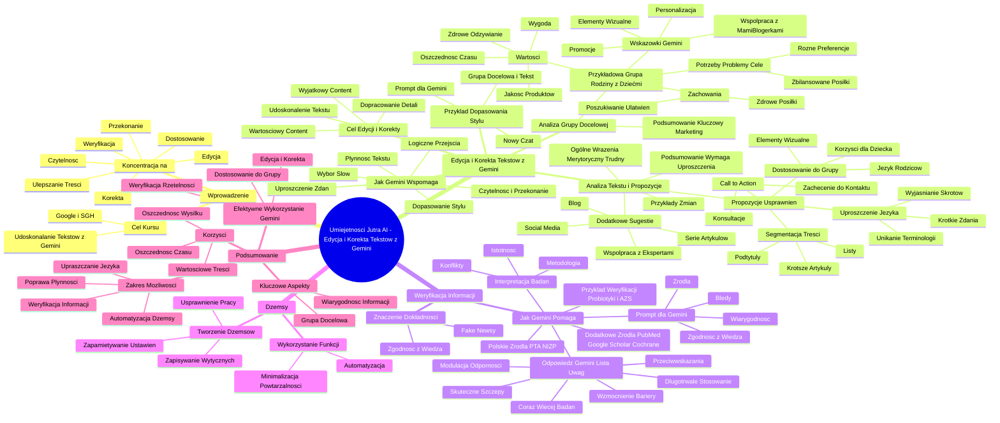

# Lekcje wideo - 5. Poprawianie artykułu i Gemy

# 💡 Diagram

___

# 🗒️ Notatka

# Notatki i Podsumowanie Transkrypcji Wideo: Umiejętności Jutra AI - Edycja i Korekta Tekstów z Gemini

## Wprowadzenie

Film instruktażowy \"Umiejętności Jutra AI\", zorganizowany przez Google we współpracy z SGH, koncentruje się na wykorzystaniu sztucznej inteligencji `Gemini` do udoskonalania tekstów. Prezentacja pokazuje, jak za pomocą `Gemini` można edytować, korygować i ulepszać treści, aby stały się bardziej czytelne, przekonujące i dostosowane do konkretnej grupy docelowej. Kurs podkreśla również istotę weryfikacji informacji w procesie tworzenia wiarygodnych treści.

## Edycja i Korekta Tekstów z Wykorzystaniem AI (`Gemini`)

### Cel Edycji i Korekty

- Udoskonalenie gotowego tekstu, który nie w pełni spełnia oczekiwania.
- Zagwarantowanie, że treści są **wartościowe** dla odbiorcy.
- Dopracowanie każdego detalu tekstu.
- Stworzenie **wyjątkowego contentu**.

### Jak `Gemini` Wspomaga Edycję i Korektę?

- **Czytelność i Przekonanie:** Nadanie treściom większej czytelności, perswazyjności i efektywności.
- **Uproszczenie Zdań:** `Gemini` pomaga w upraszczaniu złożonych zdań i stosowaniu bardziej zrozumiałego słownictwa.
- **Płynność Tekstu:** Weryfikacja, czy myśli spójnie przechodzą między akapitami.
- **Logiczne Przejścia:** Wskazywanie miejsc, w których brakuje logicznych powiązań.
- **Dopasowanie Stylu do Grupy Docelowej:** Dostosowanie stylu tekstu (formalny/nieformalny) do charakterystyki odbiorców.
- **Wybór Słów i Zwrotów:** Asysta w doborze adekwatnych słów i wyrażeń.

### Praktyczny Przykład Dopasowania Stylu Tekstu

1. **Rozpoczęcie Nowego Czatu:** Inicjalizacja nowej konwersacji w `Gemini`.
2. **Wprowadzenie Charakterystyki Grupy Docelowej i Tekstu:** Wprowadzenie opisu grupy docelowej oraz tekstu przeznaczonego do edycji.
3. **Prompt dla `Gemini`:** Sformułowanie prośby o sprawdzenie tekstu pod kątem:
    - Jasności przekazu dla grupy docelowej.
    - Płynności przejść pomiędzy akapitami.
    - Języka dostosowanego do grupy docelowej.

### Analiza Grupy Docelowej przez `Gemini`

- **Przykładowa Grupa Docelowa:** Rodziny z dziećmi (pary w wieku 25-50 lat z małymi dziećmi).
    - **Wartości:** Zdrowe odżywianie 🍎, wysoka jakość produktów, wygoda, oszczędność czasu ⏱️.
    - **Zachowania:** Poszukiwanie rozwiązań ułatwiających codzienne życie i zdrowych posiłków.
    - **Potrzeby, Problemy, Cele:** Zdrowe i zbilansowane posiłki dla całej rodziny 👨‍👩‍👧‍👦, uwzględniające różnorodne preferencje i diety.
    - **Dodatkowe Wskazówki `Gemini`:** Personalizacja komunikacji, elementy wizualne, promocje, współpraca z mami-blogerkami.
- **Podsumowanie `Gemini`:** Zrozumienie grupy docelowej jest kluczowe dla efektywnego marketingu. Regularna analiza opinii klientów i dostosowywanie oferty do zmieniających się potrzeb.

### Analiza Tekstu i Propozycje Usprawnień (Przykład Tekstu o Probiotykach)

- **Ogólne Wrażenia `Gemini`:** Tekst merytoryczny i szczegółowy, jednak potencjalnie trudny w odbiorze dla przeciętnego czytelnika.
- **Propozycje Usprawnień:**
    1. **Segmentacja Treści:**
        - Podział na krótsze artykuły tematyczne (np. \"Probiotyki dla dzieci z alergiami\").
        - Zastosowanie podtytułów.
        - Wykorzystanie list (np. \"Zalety probiotyków\").
    2. **Uproszczenie Języka:**
        - Unikanie terminologii medycznej (np. \"mikrobiota jelitowa\" -> \"dobre bakterie w jelitach\").
        - Krótkie, klarowne zdania.
        - Wyjaśnianie skrótów (np. CFU).
    3. **Dostosowanie do Grupy Docelowej:**
        - Skoncentrowanie się na korzyściach dla dziecka (np. \"Zdrowe jelita, silna odporność\").
        - Język zrozumiały dla rodziców.
        - Elementy wizualne (infografiki, zdjęcia 🖼️).
    4. **Call to Action:**
        - Zachęcenie do kontaktu (np. \"Masz pytania? Skontaktuj się z dietetykiem\").
        - Propozycja konsultacji.
- **Przykłady Zmian:** Uproszczenie zdań z terminologii medycznej na język potoczny.
- **Dodatkowe Sugestie:** Stworzenie serii artykułów, nawiązanie współpracy z ekspertami, prowadzenie bloga ✍️, promocja w mediach społecznościowych.
- **Podsumowanie `Gemini`:** Tekst wartościowy, lecz wymagający uproszczenia i adaptacji do potrzeb odbiorców.

## Weryfikacja Informacji w Tekstach

### Znaczenie Dokładności Informacji

- Kluczowe w kontekście zjawiska fake newsów 📰.
- Treść musi być zrozumiała i **zgodna z aktualnym stanem wiedzy**.

### Jak `Gemini` Pomaga w Weryfikacji Informacji?

- **Prompt dla `Gemini`:** Prośba o weryfikację informacji zawartych w tekście pod kątem:
    - Zgodności z aktualną wiedzą naukową lub branżową.
    - Identyfikacji twierdzeń wymagających źródeł.
    - Propozycji wiarygodnych i aktualnych źródeł.
    - Wskazywania błędów, nieścisłości, przestarzałych danych.

### Przykład Weryfikacji Informacji (Tekst o Probiotykach i AZS)

- **Tekst do Analizy:** Artykuł o probiotykach i atopowym zapaleniu skóry (AZS).
- **Odpowiedź `Gemini` w Formie Listy:**
    1. **\"Coraz więcej badań wskazuje...\"**: Wymaga wskazania konkretnych metaanaliz lub badań klinicznych.
    2. **\"Modulacja układu odpornościowego\"**: Potrzebuje szczegółowego wyjaśnienia mechanizmów immunologicznych (np. regulacja Th1/Th2).
    3. **\"Wzmocnienie bariery skórnej\"**: Mechanizmy powiązania mikrobioty jelitowej ze skórą nie są w pełni poznane; warto wspomnieć o potencjalnych mechanizmach.
    4. **\"Które szczepy probiotyków są najbardziej skuteczne\"**: Skuteczność jest zależna od indywidualnych predyspozycji i stopnia zaawansowania choroby.
    5. **Długotrwałe stosowanie**: Optymalny czas trwania kuracji nie jest jednoznacznie określony, wymaga indywidualizacji.
    6. **\"Czy istnieją przeciwwskazania?\"**: Warto wymienić dodatkowe potencjalne przeciwwskazania.
- **Polskie Źródła Informacji o AZS:** Sugestia zapoznania się z informacjami na stronach Polskiego Towarzystwa Alergologicznego i Narodowego Instytutu Zdrowia Publicznego.
- **Dodatkowe Źródła Informacji:** Propozycja wiarygodnych baz danych naukowych (`PubMed`, `Google Scholar`, `Cochrane Library`) do samodzielnego wyszukiwania badań.
- **Wskazówki Jak Interpretować Wyniki Badań:** Metodologia, istotność statystyczna i kliniczna, potencjalne konflikty interesów.

## \"Dżemsy\" (`Gems`) - Automatyzacja Pracy z `Gemini`

### Wykorzystanie Zaawansowanych Funkcji `Gemini`

- Minimalizacja powtarzalnych czynności.
- Automatyzacja procesu tworzenia treści dedykowanych konkretnemu odbiorcy.

### Tworzenie \"Dżemsów\"

- Zapisywanie wytycznych i preferencji dotyczących grupy docelowej oraz stylu tworzenia treści.
- `Gemini` zapamiętuje te ustawienia, eliminując potrzebę ponownego wprowadzania promptów.
- Usprawnienie i przyspieszenie pracy z `Gemini`.

## Podsumowanie

Prezentacja \"Umiejętności Jutra AI\" demonstruje, jak efektywnie wykorzystać `Gemini` do edycji i korekty tekstów, dostosowując je do grupy docelowej i weryfikując ich rzetelność merytoryczną. Narzędzie `Gemini` oferuje szeroki zakres możliwości usprawnienia procesu tworzenia treści, począwszy od upraszczania języka i poprawy płynności, aż po weryfikację informacji i automatyzację zadań za pomocą \"Dżemsów\". Kluczowe aspekty to zrozumienie grupy docelowej i dbałość o wiarygodność prezentowanych informacji. Wykorzystanie `Gemini` umożliwia tworzenie wartościowych i skutecznych treści, oszczędzając jednocześnie czas i wysiłek.

___

# 🔉 Transcript
File: Lekcje wideo - 5. Poprawianie artykułu i Gemy.mp4 
[00:00:00] (Biały ekran)
[00:00:01] (Czarny napis na białym tle: Umiejętności Jutra AI. Pod spodem mniejszym drukiem: Organizator Google, Partner edukacyjny SGH)
[00:00:05] (Kobieta siedzi za biurkiem, na którym stoi laptop. Za nią na półce logo Google, rośliny w doniczkach)
[00:00:05] Nigdy nie jest tak dobrze, by nie trzeba było nic poprawiać.
[00:00:09] Czy zdarzyło ci się mieć już gotowy tekst, ale coś ci nie pasowało?
[00:00:13] (Zbliżenie na twarz kobiety, za nią roślina)
[00:00:14] A może chcesz mieć pewność, że twoje treści są wartościowe?
[00:00:18] Podobnie jak w poprzednich krokach i tym razem Gemini pomoże ci dopracować każdy szczegół i stworzyć naprawdę wyjątkowy content.
[00:00:26] (Kobieta siedzi za biurkiem, na którym stoi laptop. Za nią na półce logo Google, rośliny w doniczkach)
[00:00:26] Spójrzmy, jak możemy wykorzystać AI do edycji i korekty naszych tekstów.
[00:00:32] Chodzi o to, żeby nasze treści były bardziej czytelne, przekonujące i efektywne.
[00:00:38] Ale to nie wszystko, czym się zajmiemy.
[00:00:40] (Zbliżenie na twarz kobiety, za nią roślina)
[00:00:40] Pokażę ci jeszcze, jak nie pracować ciężko, a mądrze, czyli jak nie wpisywać 20 razy tego samego promptu i grupy docelowej.
[00:00:49] (Kobieta siedzi za biurkiem, na którym stoi laptop. Za nią na półce logo Google, rośliny w doniczkach)
[00:00:49] Pomogą nam w tym Dżemsy, ale o tym za chwilę.
[00:00:53] (Zbliżenie na twarz kobiety, za nią roślina)
[00:00:53] Gemini może pomóc nam uprościć skomplikowane zdania i upewnić się, że używamy bardziej zrozumiałego słownictwa.
[01:01] Sprawdzimy też, czy nasze myśli płynnie przechodzą z jednego akapitu do drugiego.
[01:06] (Kobieta siedzi za biurkiem, na którym stoi laptop. Za nią na półce logo Google, rośliny w doniczkach)
[01:06] Dodatkowo Gemini może wskazać miejsca, w którym brakuje nam logicznych przejść.
[01:10] Na koniec dopasujemy również styl naszego tekstu do naszej grupy docelowej.
[01:15] (Zbliżenie na twarz kobiety, za nią roślina)
[01:16] Poprawiając treści z AI, możemy ustalić, czy chcemy być formalni, czy używać bardziej luźnego tonu.
[01:22] Gemini pomoże nam znaleźć odpowiednie słowa i zwroty.
[01:26] (Kobieta siedzi za biurkiem, na którym stoi laptop. Za nią na półce logo Google, rośliny w doniczkach)
[01:26] Do tego otwieramy nowy czat, wklejamy naszą grupę docelową oraz tekst, który wygenerowaliśmy na poprzedniej lekcji.
[01:34] Prosimy, by Gemini ten tekst dla nas sprawdziło.
[01:38] (Ekran laptopa. Strona Gemini Advanced. Napis: Cześć, Małgorzata. Pod spodem puste pole do wpisywania tekstu)
[01:47] (Kobieta siedzi za biurkiem, na którym stoi laptop. Za nią na półce logo Google, rośliny w doniczkach)
[01:48] Tu jest nasz tekst.
[01:49] (Ekran laptopa. Strona Gemini Advanced. Napis: Cześć, Małgorzata. Pod spodem puste pole do wpisywania tekstu)
[01:53] Czy ten tekst jest jasny dla naszej grupy docelowej?
[02:02] Czy myśli płynnie przechodzą przez wszystkie akapity są napisane językiem grupy docelowej?
[02:19] Grupa docelowa.
[02:20] I dopisujemy jeszcze naszą grupę docelową.
[02:24] (Ekran laptopa. Nowa karta Google)
[02:25] (Ekran laptopa. Strona Gemini Advanced. Napis: Cześć, Małgorzata. Pod spodem puste pole do wpisywania tekstu)
[02:26] (Ekran laptopa. Strona Gemini Advanced. Tekst: Gemini, proszę, podsumuj wszystkie najważniejsze informacje, które zawarliśmy w tej konwersacji na temat mojej grupy docelowej. Uwzględnij takie aspekty, jak: Podsumowanie profilu Twojej grupy docelowej. Kim są Twoi klienci? Rodziny z dziećmi: Przeważnie pary w wieku 25-50 lat z małymi dziećmi. Wartości: Cenią sobie zdrowe odżywianie, jakość produktów, wygodę i oszczędność czasu. Zachowania: Regularnie poszukują rozwiązań, które ułatwią im codzienność i zapewnią zdrowe posiłki dla całej rodziny. Jakie mają potrzeby, problemy i cele? Potrzeby: Zdrowe i zbilansowane posiłki dla całej rodziny, dostosowane do różnych preferencji (w tym diet specjalnych). Dodatkowe wskazówki: Personalizacja: Dostosuj komunikację do różnych segmentów klientów (np. rodzin z niemowlakami, rodziny z alergikami). Wizualizacja: Używaj atrakcyjnych zdjęć i filmów prezentujących Twoje dania. Promocje i rabaty: Oferuj specjalne promocje dla nowych klientów lub przy większych zamówieniach. Współpraca z influencerami: Zbuduj relacje z mami-blogerkami, które mogą polecić Twoje usługi. Czy chciałybyś, żebym stworzył dla Ciebie przykładowy post na social media lub opis oferty, który uwzględnia powyższe wskazówki? Czy są jakieś inne aspekty, które chciałbyś poruszyć? Pamiętaj: Zrozumienie Twojej grupy docelowej jest kluczem do skutecznego marketingu. Regularnie analizuj opinie klientów i dostosowuj swoją ofertę do zmieniających się potrzeb. Gemini może popełniać błędy, także co do treści, dlatego sprawdzaj odpowiedzi. Twoja prywatność. Gemini)
[03:03] (Ekran laptopa. Strona Gemini Advanced. Tekst: Analiza tekstu i propozycje usprawnień. Ogólne wrażenia: Tekst jest bardzo szczegółowy i merytoryczny, co jest niewątpliwie jego dużą zaletą. Zawiera wiele informacji na temat probiotyków, alergii pokarmowych i ich związku z dietą dziecka. Jednak ze względu na swoją długość i złożoność może być trudny do przyswojenia przez przeciętnego odbiorcę, zwłaszcza jeśli nie posiada on specjalistycznej wiedzy z zakresu żywienia i zdrowia. Propozycje usprawnień: 1. Segmentacja treści: Podziel tekst na krótsze artykuły: Każdy artykuł mógłby skupiać się na jednym konkretnym temacie, np. "Probiotyki dla dzieci z alergiami". Jak wybrać odpowiedni probiotyk?". "Dieta dla dzieci z alergiami". Używaj podtytułów: Podziel każdy artykuł na mniejsze sekcje za pomocą podtytułów, aby ułatwić czytelnikowi orientację w treści. Wykorzystaj listy: Wylistuj najważniejsze informacje, np. "Zalety probiotyków", "Objawy alergii pokarmowych". 2. Sproszenie języka: Unikaj terminów medycznych: Zamień skomplikowane terminy na proste odpowiedniki, np. zamiast "mikrobiota jelitowa" można napisać "dobre bakterie w jelitach". Używaj krótkich zdań: Zdania powinny być krótkie i klarowne, aby uniknąć nieporozumień. Tłumacz skróty: Jeśli używasz skrótów (np. CFU), wyjaśnij je przy pierwszym użyciu. 3. Dostosowanie do grupy docelowej: Skup się na korzyściach: Zamiast skupiać się na szczegółowych mechanizmach działania probiotyków, podkreślaj korzyści dla dziecka, np. "Zdrowe jelita, silna odporność, więcej energii". Używaj języka zrozumiałego dla rodziców: Unikaj zbyt naukowego języka i skup się na tym, co jest ważne dla rodziców, np. "Jak pomóc mojemu dziecku z alergią?", "Jakie probiotyki wybrać?". Dodaj elementy wizualne: Infografiki, zdjęcia i krótkie filmy mogą uatrakcyjnić tekst i ułatwić zrozumienie informacji. 4. Call to action: Zachęć do kontaktu: Pod każdym artykułem dodaj zachętę do kontaktu, np. "Masz pytania? Skontaktuj się z naszym dietetykiem". Zaproponuj konsultację: Zaoferuj bezpłatną konsultację dla rodziców, którzy chcą dowiedzieć się więcej o diecie swojego dziecka. Przykładowe zmiany: Zamiast: "Mikrobiota jelitowa to nasz wewnętrzny ekosystem, który wpływa na odporność, samopoczucie i ogólne zdrowie". Można napisać: "W naszych jelitach mieszkają miliardy dobrych bakterii, które pomagają nam być zdrowym i szczęśliwym". Zamiast: "Probiotyki mogą wpływać na układ odpornościowy, zmniejszając nadmierną reakcję na alergeny". Można napisać: "Probiotyki pomagają wzmocnić odporność dziecka i zmniejszyć ryzyko alergii". Dodatkowe sugestie: Stwórz serię artykułów: Przygotuj cykl artykułów, które będą poruszać różne aspekty związane z żywieniem dzieci i probiotykami. Współpracuj z ekspertami: Poproś lekarza lub dietetyka o konsultację i sprawdzenie merytorycznej poprawności tekstów. Prowadź bloga: Blog pozwoli Ci regularnie publikować nowe treści i budować relacje z czytelnikami. Wykorzystaj social media: Promuj swoje artykuły w mediach społecznościowych, aby dotrzeć do większej liczby rodziców. Podsumowanie: Tekst, który przekazałeś, zawiera wiele wartościowych informacji. Jednak aby był bardziej przystępny dla przeciętnego odbiorcy, warto go uprościć i dostosować do potrzeb rodziców. Pamiętaj, że najważniejsze jest, aby przekaz był jasny, zrozumiały i przekonujący. Chętnie pomogę Ci w dalszej pracy nad tym tekstem. Jeśli masz jakieś pytania lub potrzebujesz dodatkowych wskazówek, śmiało pytaj! Możemy również wspólnie opracować konkretne przykłady tekstów, które będą lepiej dopasowane do Twojej grupy docelowej. Jakie tematy chciałbyś poruszyć w kolejnych artykułach? Czy chciałbyś, żebym przygotował dla Ciebie przykładowy artykuł na wybrany temat?)
[03:54] (Kobieta siedzi za biurkiem, na którym stoi laptop. Za nią na półce logo Google, rośliny w doniczkach)
[03:55] Oprócz tego, w dobie fake newsów, dokładność informacji jest kluczowa.
[04:00] (Zbliżenie na twarz kobiety, za nią roślina)
[04:00] Nie tylko to, by tekst był zrozumiały przez naszego klienta, ale również to, by informacje zawarte w nim pokrywały się z naszą aktualną wiedzą.
[04:04] (Kobieta siedzi za biurkiem, na którym stoi laptop. Za nią na półce logo Google, rośliny w doniczkach)
[04:10] Gemini, proszę o weryfikację informacji zawartych w poniższym tekście.
[04:15] Chcę, abyś sprawdziło, czy informacje są zgodne z aktualną wiedzą naukową lub branżową.
[04:21] Zidentyfikowało, które stwierdzenia wymagają potwierdzenia źródłami.
[04:25] Zaproponowało wiarygodne i aktualne źródła, które mogą potwierdzić lub uzupełnić te informacje.
[04:32] Wskazało ewentualne błędy, nieścisłości lub przestarzałe dane.
[04:37] Oto tekst do analizy.
[04:38] (Ekran laptopa. Strona Gemini Advanced. Tekst: Gemini, proszę o weryfikację informacji zawartych w poniższym tekście. Chcę, abyś: Sprawdziło, czy informacje są zgodne z aktualną wiedzą naukową lub branżową. Zidentyfikowało, które stwierdzenia wymagają potwierdzenia źródłami. Zaproponowało wiarygodne i aktualne źródła, które mogą potwierdzić lub uzupełnić te informacje. Wskazało ewentualne błędy, nieścisłości lub przestarzałe dane. Oto tekst do analizy: Probiotyki i atopowe zapalenie skóry (AZS). Atopowe zapalenie skóry jest przewlekłą chorobą skóry, często związaną z alergiami. Coraz więcej badań wskazuje na to, że probiotyki mogą odgrywać istotną rolę w łagodzeniu objawów AZS i zapobieganiu jego nawrotom. Jak probiotyki pomagają w przypadku AZS? Modulacja układu odpornościowego: Probiotyki pomagają regulować układ odpornościowy, zmniejszając nadmierną reakcję na alergeny, która jest charakterystyczna dla AZS. Zmniejszenie stanu zapalnego: Wiele szczepów probiotycznych wykazuje działanie przeciwzapalne, co przyczynia się do złagodzenia świądu i zaczerwienienia skóry. Wzmocnienie bariery skórnej: Zdrowa mikrobiota jelitowa przyczynia się do prawidłowego funkcjonowania bariery skórnej, co jest kluczowe w przypadku AZS. Zmniejszenie ryzyka infekcji: Probiotyki mogą zmniejszać ryzyko infekcji skóry, które często towarzyszą AZS. Które szczepy probiotyków są najbardziej skuteczne? Lactobacillus rhamnosus GG: Jeden z najczęściej badanych szczepów, który wykazuje korzystny wpływ na wiele schorzeń, w tym AZS. Bifidobacterium animalis subsp. lactis: Inny popularny szczep, który może pomóc wzmocnić układ odpornościowy i zmniejszyć nasilenie objawów AZS. Inne szczepy: Badania wskazują również na korzystne działanie innych szczepów probiotycznych, takich jak Lactobacillus casei czy Lactobacillus acidophilus. Jak stosować probiotyki w przypadku AZS? Doustnie: Probiotyki są najczęściej przyjmowane doustnie, w postaci kapsułek, tabletek lub proszku. Zewnętrznie: Istnieją również kosmetyki zawierające probiotyki, które mogą być stosowane bezpośrednio na skórę. Długotrwałe stosowanie: Aby uzyskać najlepsze efekty, probiotyki należy stosować przez dłuższy czas, nawet jeśli objawy AZS już ustąpią. Czy istnieją przeciwwskazania? Chociaż probiotyki są zazwyczaj dobrze tolerowane, przed rozpoczęciem suplementacji warto skonsultować się z lekarzem, zwłaszcza w przypadku noworodków, niemowląt i osób z osłabioną odpornością. Probiotyki mogą być wartościowym uzupełnieniem leczenia atopowego zapalenia skóry. Jednak nie są one panaceum i ich skuteczność może różnić się w zależności od indywidualnych predyspozycji. Proszę, abyś weryfikację i swoje uwagi przedstawił w formie listy, z podaniem konkretnej informacji, która wymaga poprawy lub potwierdzenia, oraz sugestią, jakie źródła warto sprawdzić. Jeśli coś wymaga dodatkowego wyjaśnienia, również to wskaż. Gemini może popełniać błędy, także co do treści, dlatego sprawdzaj odpowiedzi. Twoja prywatność. Gemini)
[04:10] (Ekran laptopa. Strona Gemini Advanced. Tekst: Weryfikacja informacji o probiotykach w kontekście AZS. Informacja ogólna: Tekst przedstawia aktualny stan wiedzy na temat stosowania probiotyków w leczeniu atopowego zapalenia skóry. Zawiera wiele istotnych informacji, jednak wymaga doprecyzowania w kilku punktach. Lista szczegółowych uwag: 1. "Coraz więcej badań wskazuje...": Chociaż istnieje wiele badań potwierdzających korzystny wpływ probiotyków na AZS, warto podać konkretne metaanalizy lub duże badania kliniczne, które podsumowują dotychczasowe wyniki. 2. "Modulacja układu odpornościowego": To ogólne stwierdzenie wymaga bardziej szczegółowego wyjaśnienia. Jakie konkretne mechanizmy immunologiczne są zaangażowane? Można wspomnieć o regulacji odpowiedzi Th1/Th2, zwiększeniu produkcji cytokin przeciwzapalnych itp. 3. "Wzmocnienie bariery skórnej": Chociaż istnieje związek między mikrobiotą jelitową a stanem skóry, mechanizmy tego związku nie są jeszcze w pełni poznane. Warto wspomnieć o potencjalnych mechanizmach, takich jak wpływ na produkcję peptydów przeciwdrobnoustrojowych czy regulację ekspresji genów związanych z barierą skórną. 4. "Które szczepy probiotyków są najbardziej skuteczne": Lista wymienionych szczepów jest poprawna, jednak warto dodać, że skuteczność może zależeć od indywidualnych predyspozycji pacjenta oraz ciężkości choroby. Nie wszystkie szczepy są skuteczne u wszystkich osób. 5. Długotrwałe stosowanie: Chociaż długotrwałe stosowanie probiotyków może być korzystne, warto wspomnieć, że optymalna długość kuracji nie jest dokładnie określona i może wymagać indywidualnego dostosowania. 6. "Czy istnieją przeciwwskazania?": Oprócz wymienionych grup (noworodki, niemowlęta, osoby z osłabioną odpornością), warto wspomnieć o innych potencjalnych przeciwwskazaniach. Polskie źródła informacji o AZS: Warto również zapoznać się z informacjami na temat AZS dostępnymi na stronach polskich organizacji medycznych i instytucji zajmujących się tą chorobą. Choć strony te mogą nie omawiać szczegółowo probiotyków i AZS, są cennym źródłem wiedzy na temat AZS w ogóle. Polskie Towarzystwo Alergologiczne. Narodowy Instytut Zdrowia Publicznego - Państwowy Zakład Higieny. Dodatkowe źródła informacji: Poniżej znajdziesz listę wiarygodnych źródeł, które możesz wykorzystać w swoim artykule blogowym: Autorzy, Rok publikacji, Tytuł, Nazwa czasopisma, Link. Wzywanie w znalezieniu konkretnych badań: Niestety, nie mogę podać Ci dokładnych badań i publikacji, które potwierdziłyby każdą pojedynczą informację zawartą w tekście o probiotykach i AZS. Powodów jest kilka: Dynamiczny charakter badań: Nauka jest dziedziną, która stale się rozwija. Nowe badania są publikowane regularnie, a wyniki wcześniejszych mogą być modyfikowane lub uzupełniane. Złożoność tematu: Związek między probiotykami a AZS jest tematem złożonym, obejmującym wiele różnych szczepów probiotycznych, różne grupy wiekowe, a także różne mechanizmy działania. Różnorodność badań: Badania na ten temat są prowadzone na całym świecie i publikowane w różnych czasopismach naukowych. Zgromadzenie kompletnej bibliografii byłoby bardzo czasochłonne. Jak samodzielnie znaleźć badania: Jeśli chcesz zgłębić ten temat bardziej szczegółowo, polecam skorzystać z następujących baz danych naukowych: PubMed: Jest to największa na świecie baza danych bibliograficznych z dziedziny biomedycyny. Możesz wyszukiwać artykuły naukowe, korzystając z takich słów kluczowych jak "probiotics", "atopic dermatitis", "Lactobacillus rhamnosus GG" itp. Google Scholar: Jest to wyszukiwarka naukowa, która umożliwia wyszukiwanie zarówno artykułów naukowych, jak i książek, rozdziałów w książkach i prac konferencyjnych. Cochrane Library: Zawiera przeglądy systematyczne badań, które podsumowują najlepsze dostępne dowody naukowe na temat określonych zagadnień. Co możesz znaleźć w tych bazach danych? Artykuły naukowe: Opisują wyniki konkretnych badań, w tym badania kliniczne, które oceniają skuteczność probiotyków w leczeniu AZS. Metaanalizy: Są to badania, które łączą łącza wyniki wielu badań na ten sam temat, co pozwala na uzyskanie bardziej wiarygodnych wniosków. Przeglądy systematyczne: Podobnie jak metaanalizy, podsumowują wyniki wielu badań, ale dodatkowo oceniają jakość tych badań. Jak interpretować wyniki badań? Zwróć uwagę na metodologię badań: Czy badanie było dobrze zaprojektowane? Czy grupa kontrolna była odpowiednio dobrana? Czy liczba uczestników była wystarczająca? Sprawdź, czy wyniki są statystycznie istotne: Oznacza to, że różnice między grupą otrzymującą probiotyki a grupą kontrolną nie są przypadkowe. Zastanów się, czy wyniki są istotne klinicznie: Czy obserwowane efekty są na tyle duże, aby miały znaczenie dla pacjentów? Weź pod uwagę potencjalne konflikty interesów: Autorzy badań mogą mieć powiązania z firmami produkującymi probiotyki, co może wpływać na wyniki badań. Chcę, byś wyszukało dokładne badania i publikacje, które potwierdzają poprawność tej wypowiedzi. Gemini może popełniać błędy, także co do treści, dlatego sprawdzaj odpowiedzi. Twoja prywatność. Gemini)
[03:54] (Kobieta siedzi za biurkiem, na którym stoi laptop. Za nią na półce logo Google, rośliny w doniczkach)
[03:55] Wiesz, że nie musimy za każdym razem powtarzać Gemini dla kogo piszemy, czym się zajmujemy i w jaki sposób ma tworzyć treści dla naszych odbiorców?
[03:55] (Ekran laptopa. Strona Gemini Advanced. Tekst: Gemini, proszę o weryfikację informacji zawartych w poniższym tekście. Chcę, abyś: Sprawdziło, czy informacje są zgodne z aktualną wiedzą naukową lub branżową. Zidentyfikowało, które stwierdzenia wymagają potwierdzenia źródłami. Zaproponowało wiarygodne i aktualne źródła, które mogą potwierdzić lub uzupełnić te informacje. Wskazało ewentualne błędy, nieścisłości lub przestarzałe dane. Oto tekst do analizy: Probiotyki i atopowe zapalenie skóry (AZS). Atopowe zapalenie skóry jest przewlekłą chorobą skóry, często związaną z alergiami. Coraz więcej badań wskazuje na to, że probiotyki mogą odgrywać istotną rolę w łagodzeniu objawów AZS i zapobieganiu jego nawrotom. Jak probiotyki pomagają w przypadku AZS? Modulacja układu odpornościowego: Probiotyki pomagają regulować układ odpornościowy, zmniejszając nadmierną reakcję na alergeny, która jest charakterystyczna dla AZS. Zmniejszenie stanu zapalnego: Wiele szczepów probiotycznych wykazuje działanie przeciwzapalne, co przyczynia się do złagodzenia świądu i zaczerwienienia skóry. Wzmocnienie bariery skórnej: Zdrowa mikrobiota jelitowa przyczynia się do prawidłowego funkcjonowania bariery skórnej, co jest kluczowe w przypadku AZS. Zmniejszenie ryzyka infekcji: Probiotyki mogą zmniejszać ryzyko infekcji skóry, które często towarzyszą AZS. Które szczepy probiotyków są najbardziej skuteczne? Lactobacillus rhamnosus GG: Jeden z najczęściej badanych szczepów, który wykazuje korzystny wpływ na wiele schorzeń, w tym AZS. Bifidobacterium animalis subsp. lactis: Inny popularny szczep, który może pomóc wzmocnić układ odpornościowy i zmniejszyć nasilenie objawów AZS. Inne szczepy: Badania wskazują również na korzystne działanie innych szczepów probiotycznych, takich jak Lactobacillus casei czy Lactobacillus acidophilus. Jak stosować probiotyki w przypadku AZS? Doustnie: Probiotyki są najczęściej przyjmowane doustnie, w postaci kapsułek, tabletek lub proszku. Zewnętrznie: Istnieją również kosmetyki zawierające probiotyki, które mogą być stosowane bezpośrednio na skórę. Długotrwałe stosowanie: Aby uzyskać najlepsze efekty, probiotyki należy stosować przez dłuższy czas, nawet jeśli objawy AZS już ustąpią. Czy istnieją przeciwwskazania? Chociaż probiotyki są zazwyczaj dobrze tolerowane, przed rozpoczęciem suplementacji warto skonsultować się z lekarzem, zwłaszcza w przypadku noworodków, niemowląt i osób z osłabioną odpornością. Probiotyki mogą być wartościowym uzupełnieniem leczenia atopowego zapalenia skóry. Jednak nie są one panaceum i ich skuteczność może różnić się w zależności od indywidualnych predyspozycji. Proszę, abyś weryfikację i swoje uwagi przedstawił w formie listy, z podaniem konkretnej informacji, która wymaga poprawy lub potwierdzenia, oraz sugestią, jakie źródła warto sprawdzić. Jeśli coś wymaga dodatkowego wyjaśnienia, również to wskaż. Gemini może popełniać błędy, także co do treści, dlatego sprawdzaj odpowiedzi. Twoja prywatność. Gemini)
[04:10] (Ekran laptopa. Strona Gemini Advanced. Tekst: Weryfikacja informacji o probiotykach w kontekście AZS. Informacja ogólna: Tekst przedstawia aktualny stan wiedzy na temat stosowania probiotyków w leczeniu atopowego zapalenia skóry. Zawiera wiele istotnych informacji, jednak wymaga doprecyzowania w kilku punktach. Lista szczegółowych uwag: 1. "Coraz więcej badań wskazuje...": Chociaż istnieje wiele badań potwierdzających korzystny wpływ probiotyków na AZS, warto podać konkretne metaanalizy lub duże badania kliniczne, które podsumowują dotychczasowe wyniki. 2. "Modulacja układu odpornościowego": To ogólne stwierdzenie wymaga bardziej szczegółowego wyjaśnienia. Jakie konkretne mechanizmy immunologiczne są zaangażowane? Można wspomnieć o regulacji odpowiedzi Th1/Th2, zwiększeniu produkcji cytokin przeciwzapalnych itp. 3. "Wzmocnienie bariery skórnej": Chociaż istnieje związek między mikrobiotą jelitową a stanem skóry, mechanizmy tego związku nie są jeszcze w pełni poznane. Warto wspomnieć o potencjalnych mechanizmach, takich jak wpływ na produkcję peptydów przeciwdrobnoustrojowych czy regulację ekspresji genów związanych z barierą skórną. 4. "Które szczepy probiotyków są najbardziej skuteczne": Lista wymienionych szczepów jest poprawna, jednak warto dodać, że skuteczność może zależeć od indywidualnych predyspozycji pacjenta oraz ciężkości choroby. Nie wszystkie szczepy są skuteczne u wszystkich osób. 5. Długotrwałe stosowanie: Chociaż długotrwałe stosowanie probiotyków może być korzystne, warto wspomnieć, że optymalna długość kuracji nie jest dokładnie określona i może wymagać indywidualnego dostosowania. 6. "Czy istnieją przeciwwskazania?": Oprócz wymienionych grup (noworodki, niemowlęta, osoby z osłabioną odpornością), warto wspomnieć o innych potencjalnych przeciwwskazaniach. Polskie źródła informacji o AZS: Warto również zapoznać się z informacjami na temat AZS dostępnymi na stronach polskich organizacji medycznych i instytucji zajmujących się tą chorobą. Choć strony te mogą nie omawiać szczegółowo probiotyków i AZS, są cennym źródłem wiedzy na temat AZS w ogóle. Polskie Towarzystwo Alergologiczne. Narodowy Instytut Zdrowia Publicznego - Państwowy Zakład Higieny. Dodatkowe źródła informacji: Poniżej znajdziesz listę wiarygodnych źródeł, które możesz wykorzystać w swoim artykule blogowym: Autorzy, Rok publikacji, Tytuł, Nazwa czasopisma, Link. Wzywanie w znalezieniu konkretnych badań: Niestety, nie mogę podać Ci dokładnych badań i publikacji, które potwierdziłyby każdą pojedynczą informację zawartą w tekście o probiotykach i AZS. Powodów jest kilka: Dynamiczny charakter badań: Nauka jest dziedziną, która stale się rozwija. Nowe badania są publikowane regularnie, a wyniki wcześniejszych mogą być modyfikowane lub uzupełniane. Złożoność tematu: Związek między probiotykami a AZS jest tematem złożonym, obejmującym wiele różnych szczepów probiotycznych, różne grupy wiekowe, a także różne mechanizmy działania. Różnorodność badań: Badania na ten temat są prowadzone na całym świecie i publikowane w różnych czasopismach naukowych. Zgromadzenie kompletnej bibliografii byłoby bardzo czasochłonne. Jak samodzielnie znaleźć badania: Jeśli chcesz zgłębić ten temat bardziej szczegółowo, polecam skorzystać z następujących baz danych naukowych: PubMed: Jest to największa na świecie baza danych bibliograficznych z dziedziny biomedycyny. Możesz wyszukiwać artykuły naukowe, korzystając z takich słów kluczowych jak "probiotics", "atopic dermatitis", "Lactobacillus rhamnosus GG" itp. Google Scholar: Jest to wyszukiwarka naukowa, która umożliwia wyszukiwanie zarówno artykułów naukowych, jak i książek, rozdziałów w książkach i prac konferencyjnych. Cochrane Library: Zawiera przeglądy systematyczne badań, które podsumowują najlepsze dostępne dowody naukowe na temat określonych zagadnień. Co możesz znaleźć w tych bazach danych? Artykuły naukowe: Opisują wyniki konkretnych badań, w tym badania kliniczne, które oceniają skuteczność probiotyków w leczeniu AZS. Metaanalizy: Są to badania, które łączą łącza wyniki wielu badań na ten sam temat, co pozwala na uzyskanie bardziej wiarygodnych wniosków. Przeglądy systematyczne: Podobnie jak metaanalizy, podsumowują wyniki wielu badań, ale dodatkowo oceniają jakość tych badań. Jak interpretować wyniki badań? Zwróć uwagę na metodologię badań: Czy badanie było dobrze zaprojektowane? Czy grupa kontrolna była odpowiednio dobrana? Czy liczba uczestników była wystarczająca? Sprawdź, czy wyniki są statystycznie istotne: Oznacza to, że różnice między grupą otrzymującą probiotyki a grupą kontrolną nie są przypadkowe. Zastanów się, czy wyniki są istotne klinicznie: Czy obserwowane efekty są na tyle duże, aby miały znaczenie dla pacjentów? Weź pod uwagę potencjalne konflikty interesów: Autorzy badań mogą mieć powiązania z firmami produkującymi probiotyki, co może wpływać na wyniki badań. Chcę, byś wyszukało dokładne badania i publikacje, które potwierdzają poprawność tej wypowiedzi. Gemini może popełniać błędy, także co do treści, dlatego sprawdzaj odpowiedzi. Twoja prywatność. Gemini)
[03:55] (Kobieta siedzi za biurkiem, na którym stoi laptop. Za nią na półce logo Google, rośliny w doniczkach)
[03:55] Możemy wykorzystać zaawansowane funkcje Gemini, by zminimalizować ilość naszej pracy i zautomatyzować powtarzalne działania.
[03:59] By Gemini stworzył wartościowy dla twojego odbiorcy wpis, musi za każdym razem wiedzieć dla kogo tworzysz.
[04:03] Dlatego wykorzystując to, co stworzyliśmy w poprzednich lekcjach, stworzymy dżemy.
[04:09] Dzięki temu Gemini zapamięta wszystkie wskazówki i nie będziesz musiał za każdym razem przechodzić całego tego procesu.
[04:10] (Ekran laptopa. Strona Gemini Advanced. Tekst: Gemini, proszę o weryfikację informacji zawartych w poniższym tekście. Chcę, abyś: Sprawdziło, czy informacje są zgodne z aktualną wiedzą naukową lub branżową. Zidentyfikowało, które stwierdzenia wymagają potwierdzenia źródłami. Zaproponowało wiarygodne i aktualne źródła, które mogą potwierdzić lub uzupełnić te informacje. Wskazało ewentualne błędy, nieścisłości lub przestarzałe dane. Oto tekst do analizy: Probiotyki i atopowe zapalenie skóry (AZS). Atopowe zapalenie skóry jest przewlekłą chorobą skóry, często związaną z alergiami. Coraz więcej badań wskazuje na to, że probiotyki mogą odgrywać istotną rolę w łagodzeniu objawów AZS i zapobieganiu jego nawrotom. Jak probiotyki pomagają w przypadku AZS? Modulacja układu odpornościowego: Probiotyki pomagają regulować układ odpornościowy, zmniejszając nadmierną reakcję na alergeny, która jest charakterystyczna dla AZS. Zmniejszenie stanu zapalnego: Wiele szczepów probiotycznych wykazuje działanie przeciwzapalne, co przyczynia się do złagodzenia świądu i zaczerwienienia skóry. Wzmocnienie bariery skórnej: Zdrowa mikrobiota jelitowa przyczynia się do prawidłowego funkcjonowania bariery skórnej, co jest kluczowe w przypadku AZS. Zmniejszenie ryzyka infekcji: Probiotyki mogą zmniejszać ryzyko infekcji skóry, które często towarzyszą AZS. Które szczepy probiotyków są najbardziej skuteczne? Lactobacillus rhamnosus GG: Jeden z najczęściej badanych szczepów, który wykazuje korzystny wpływ na wiele schorzeń, w tym AZS. Bifidobacterium animalis subsp. lactis: Inny popularny szczep, który może pomóc wzmocnić układ odpornościowy i zmniejszyć nasilenie objawów AZS. Inne szczepy: Badania wskazują

___
# 🏷️ Tags
#Umiejętności_Jutra_AI #Google #SGH #Gemini #AI #sztuczna_inteligencja #edycja_tekstów #korekta_tekstów #udoskonalanie_tekstów #czytelność #przekonanie #grupa_docelowa #weryfikacja_informacji #wiarygodność_treści #content #content_marketing #upraszczanie_zdań #płynność_tekstu #logiczne_przejścia #dopasowanie_stylu #formalny_styl #nieformalny_styl #dobór_słów #dobór_zwrotów #nowy_czat #prompt #jasność_przekazu #język_dostosowany #analiza_grupy_docelowej #rodziny_z_dziećmi #zdrowe_odżywianie #wysoka_jakość_produktów #wygoda #oszczędność_czasu #personalizacja_komunikacji #elementy_wizualne #promocje #współpraca_z_mami_blogerkami #efektywny_marketing #analiza_opinii_klientów #dostosowywanie_oferty #probiotyki #tekst_o_probiotykach #segmentacja_treści #krótsze_artykuły #podtytuły #listy #unikanie_terminologii_medycznej #mikrobiota_jelitowa #dobre_bakterie_w_jelitach #krótkie_zdania #klarowne_zdania #wyjaśnianie_skrótów #CFU #korzyści_dla_dziecka #język_zrozumiały_dla_rodziców #infografiki #zdjęcia #call_to_action #zachęcenie_do_kontaktu #konsultacja #seria_artykułów #współpraca_z_ekspertami #prowadzenie_bloga #promocja_w_mediach_społecznościowych #adaptacja_do_potrzeb_odbiorców #dokładność_informacji #fake_news #aktualny_stan_wiedzy #zgodność_z_wiedzą_naukową #wiedza_branżowa #identyfikacja_twierdzeń #wiarygodne_źródła #aktualne_źródła #błędy #nieścisłości #przestarzałe_dane #tekst_o_probiotykach_i_AZS #atopowe_zapalenie_skóry #metaanalizy #badania_kliniczne #mechanizmy_immunologiczne #regulacja_Th1/Th2 #wzmocnienie_bariery_skórnej #mikrobiota_jelitowa_a_skóra #szczepy_probiotyków #Lactobacillus_rhamnosus_GG #Bifidobacterium_animalis_subsp_lactis #Lactobacillus_casei #Lactobacillus_acidophilus #długotrwałe_stosowanie #przeciwwskazania #Polskie_Towarzystwo_Alergologiczne #Narodowy_Instytut_Zdrowia_Publicznego #PubMed #Google_Scholar #Cochrane_Library #metodologia_badań #istotność_statystyczna #istotność_kliniczna #konflikty_interesów #Dżemsy #Gems #automatyzacja_pracy #minimalizacja_czynności #powtarzalne_czynności #automatyzacja_procesu_tworzenia_treści #zapisywanie_wytycznych #preferencje_dotyczące_grupy_docelowej #styl_tworzenia_treści #usprawnienie_pracy #przyspieszenie_pracy
