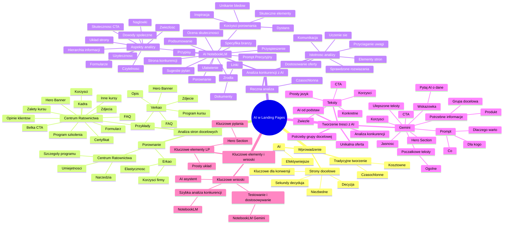

# Lekcje wideo - 1. Wstęp

# 💡 Diagram

___

# 🗒️ Notatka

# Notatki z transkrypcji wideo: AI w tworzeniu stron docelowych w Performance Marketingu

## Wprowadzenie

- **Strony docelowe (landing pages)** są kluczowe dla konwersji w marketingu efektywnościowym.
- Strona docelowa to punkt, w którym odwiedzający podejmuje **decyzję** o zakupie lub rezygnacji.
- **Sekundy** decydują – pierwsze wrażenie ma zasadnicze znaczenie. ⏱️
- Dobra strona docelowa jest **niezbędna** do sukcesu kampanii, nawet przy optymalnych reklamach i analityce. 📈
- Tradycyjne tworzenie landing pages jest **czasochłonne** i **kosztowne**, angażując duże zespoły. 🧑‍💻
- **AI** umożliwia **efektywniejsze** tworzenie lepszych stron docelowych. 🤖

## Analiza przykładowych stron docelowych

- Przykład 1: **Centrum Ratownictwa**
    - **Hero Banner (Nagłówek)**: jasno komunikuje temat strony.
    - Sekcja zachęcająca do dalszego zapoznania się z ofertą, prezentująca **konkretne korzyści**. ✅
    - **Formularz** kontaktowy umieszczony po prawej stronie. 📝
    - **Belka z CTA (Call To Action)**,  np. \"Szukasz profesjonalnego kursu? Sprawdź terminy,\"  widoczna podczas przewijania strony. 🖱️
    - Sekcja przedstawiająca **główne zalety kursu z perspektywy pracodawcy** (m.in. przygotowanie pracowników, odpowiedzialność zespołu, bezpieczeństwo BHP). 🧑‍💼
    - Informacje o **programie szkolenia**, metodach nauczania, sprzęcie i przykładowy plan kursu. 📚
    - Sekcja o **certyfikacie** jako dodatkowym atucie. 🏆
    - **Zdjęcia** z szkoleń przyciągające uwagę. 📸
    - Sekcja prezentująca **inne kursy**. ➕
    - **Prezentacja kadry trenerskiej**. 🧑‍🏫
    - **Opinie klientów i loga firm** stanowiące społeczny dowód słuszności. 🗣️
    - Sekcja **FAQ (Najczęściej zadawane pytania)**. ❓
    - **Formularz kontaktowy** na końcu strony. 📝
- Przykład 2: **Verkao**
    - **Hero Banner** z podobnym nagłówkiem, ale **odmiennym opisem** i **zdjęciem** zamiast formularza. 🖼️
    - Przewijając stronę: **nagłówek i opis po lewej stronie**. ⬅️
    - Sekcja **FAQ**. ❓
    - **Szczegółowy program kursu** przedstawiony punkt po punkcie. 🔢
- **Porównanie stron**:
    - **Erkao**: koncentruje się na **korzyściach dla firmy i elastyczności oferty**. 🏢
    - **Centrum Ratownictwa**:  akcentuje **szczegóły programu, umiejętności ratownicze i dodatkowe narzędzia**. 🧰

## Analiza konkurencji z wykorzystaniem AI (NotebookLM)

- **Analiza stron konkurencji jest istotna** – pozwala zrozumieć stosowane elementy, komunikację i metody przyciągania uwagi. 👀
- Umożliwia **dostosowanie oferty** oraz **uczenie się na błędach** i **implementację sprawdzonych rozwiązań**. 💡
- **Ręczna analiza jest czasochłonna** –  wymaga żmudnego przeglądania, notowania i porównywania. ⏳
- **AI (NotebookLM)** może **ułatwić i przyspieszyć** ten proces. 🚀
- **NotebookLM** to narzędzie do pracy z różnorodnymi źródłami (dokumenty, linki, prezentacje). 🗂️
- Dodanie **linku do landing page'a jako źródła** w NotebookLM. 🔗
- Narzędzie **przetwarza zawartość strony** za pomocą AI. ⚙️
- NotebookLM generuje **krótkie podsumowanie** i **sugestie pytań**. 📝
- Możliwość zlecenia **oceny landing page'a pod kątem skuteczności w kampanii performance marketingowej**. ✅
- **Precyzyjny prompt** jest kluczem do uzyskania wartościowych wyników. 🔑
- Aspekty analizy: **zwięzłość, czytelność, hierarchia informacji, jakość nagłówków, skuteczność CTA, rozmieszczenie i forma CTA, układ strony, dowody społeczne, formularze, użyteczność**. 🧐
- **NotebookLM dostarcza analizę z precyzyjnymi odniesieniami (przypisami)** do fragmentów strony, co ułatwia weryfikację. 🔍
- Możliwość **wzmocnienia analizy** poprzez uwzględnienie **specyfiki branży**. 🏢
- Dodanie **strony konkurencji** do NotebookLM  pozwala uzyskać **pełniejszy obraz i bardziej szczegółowe wnioski**. 🖼️
- **Prompt** powinien dokładnie określać cele analizy (skuteczność w kontekście performance marketingu). 🎯
- **Porównanie landing page'y w NotebookLM** –  generuje podsumowanie mocnych i słabych stron oraz rekomendacje usprawnień. 📊
- **Korzyści z porównania**: identyfikacja skutecznych elementów konkurencji, unikanie błędów, spojrzenie z dystansu, inspiracja do ulepszeń. ✨

## Tworzenie treści strony docelowej z AI (Gemini)

- AI wspiera tworzenie **landing page od podstaw**. 🏗️
- Kluczowa jest **analiza konkurencji i zrozumienie potrzeb grupy docelowej**. 🎯
- **Unikalna oferta** wyróżniająca na tle konkurencji. 🌟
- Wykorzystanie **Gemini** do generowania tekstów do **Hero Section**. ✍️
- **Prompt dla Gemini**: tekst na Hero Section dla kampanii performance. 💬
- Tekst powinien odpowiadać na pytania: **dla kogo, co, dlaczego warto**. 🤔
- Treść **jasna, prosta, skoncentrowana na korzyściach**, wzbudzająca zainteresowanie i kierująca do CTA. ✅
- **Początkowe teksty Gemini były zbyt ogólne** z powodu braku szczegółowych informacji. ⚠️
- Zapytanie **Gemini o potrzebne informacje** w celu uzyskania lepszych tekstów. ❓
- **Gemini potrzebuje danych o produkcie i grupie docelowej** (unikalne cechy, problemy, funkcje, cennik, case study, opis idealnego klienta, potrzeby, cele, język komunikacji). ℹ️
- **Ulepszone teksty Gemini są bardziej precyzyjne i efektywne** dzięki dostarczeniu szczegółowych informacji. 👍
- **Wskazówka**: pytaj AI bezpośrednio o dane potrzebne do uzyskania lepszych rezultatów. 💡
- Teksty powinny być **zwięzłe, konkretne, napisane prostym językiem**, skupione na **korzyściach** i zawierać **jasne CTA**. 🎯

## Kluczowe elementy i wnioski

- **Kluczowe elementy landing page**:\
    - **Prosty, przejrzysty układ**. 📐
    - **Hero Section** odpowiadający na kluczowe pytania (dla kogo, co, dlaczego). ❓
- **Kluczowe wnioski**:\
    - **AI jako asystent, a nie zastępca** – przyspiesza proces, ale nie zastąpi strategicznego myślenia. 🤖🤝
    - **Szybka analiza konkurencji (NotebookLM)** – oszczędność czasu i identyfikacja obszarów do optymalizacji. ⏱️🔍
    - **Testowanie i dostosowywanie (NotebookLM & Gemini)** – eksperymentowanie pozwala lepiej wykorzystać potencjał narzędzi AI. 🧪

## Podsumowanie

Wideo omawia zastosowanie sztucznej inteligencji, konkretnie narzędzi NotebookLM i Gemini, w procesie tworzenia i optymalizacji stron docelowych dla kampanii performance marketingowych. Podkreślono istotę stron docelowych dla konwersji oraz zaprezentowano, w jaki sposób AI może usprawnić analizę konkurencji i generowanie treści. Kluczowe jest precyzyjne formułowanie `promptów` i dostarczanie AI szczegółowych informacji o produkcie i grupie docelowej, aby osiągnąć efektywne rezultaty. Należy traktować AI jako asystenta, który przyspiesza i ułatwia pracę, lecz nie zastępuje strategicznego myślenia i zrozumienia potrzeb klienta.

___

# 🔉 Transcript
File: Lekcje wideo - 1. Wstęp.mp4 
[00:00:05] Cześć. Witajcie w kolejnej lekcji.
[00:00:08] W tych poprzednich lekcjach poznaliśmy jak AI może wspierać nas w tworzeniu treści do kampanii performance marketingowych.
[00:00:15] Oraz jak pomoże nam usprawniać proces analizy wyników i optymalizacji kampanii.
[00:00:22] Teraz przejdziemy do kluczowego elementu, bez którego nawet najlepiej napisane reklamy nie przyniosą oczekiwanych efektów.
[00:00:30] (Ekran: Tworzenie treści do landing pages)
[00:00:30] To właśnie na landing page odwiedzający podejmują decyzję.
[00:00:35] Kupuję lub dziękuję, nie interesuje mnie to.
[00:00:39] Tutaj liczą się sekundy.
[00:00:42] Jeśli landing page nie zachęci do zakupu, to nawet najlepsza kampania, świetne kreacje i zaawansowana analityka nie przyniosą efektów.
[00:00:52] Przygotowanie dobrej strony docelowej wymaga odpowiedniego przygotowania.
[00:00:58] Tradycyjne podejście często angażuje całe zespoły i wymaga mnóstwo roboczogodzin, co wydłuża proces i zwiększa koszty.
[01:08] W tej lekcji pokażę, że możemy zrobić to samo, a może nawet lepiej z wykorzystaniem AI.
[01:15] Zaczniemy od przeanalizowania przykładowego landing page'a, który jest już wykorzystywany w kampanii dotyczącej szkolenia z pierwszej pomocy dla firm.
[01:25] Wyszukiwarce wpisuje frazę szkolenie z pierwszej pomocy dla firm.
[01:31] (Ekran: Wyniki wyszukiwania Google dla frazy "szkolenie z pierwszej pomocy dla firm")
[01:31] Spójrzmy na to jak wygląda ten landing page.
[01:34] (Ekran: Landing page Centrum Ratownictwa)
[01:34] Nagłówek, czyli tak zwane Hero Banner, jasno wskazuje o czym jest strona.
[01:40] Kolejna sekcja zachęca do dalszego czytania, oferując konkretne korzyści.
[01:45] Po prawej stronie znajduje się formularz, który zachęca do kontaktu.
[01:49] Podczas przewijania strony cały czas jest widoczna belka z CTA. Szukasz profesjonalnego kursu dla siebie? Sprawdź terminy.
[01:57] Następna sekcja przedstawia główne zalety kursu z perspektywy pracodawcy.
[02:04] Na przykład pracownicy przygotowani do natychmiastowego i profesjonalnego przeprowadzenia akcji ratunkowej w obliczu zagrożenia.
[02:13] Kolejny przykład.
[02:14] Odpowiedzialność zespołu za siebie nawzajem i większy komfort pracy.
[02:20] Jeszcze kolejny przykład.
[02:22] Zwiększenie bezpieczeństwa w miejscu pracy dzięki praktycznemu spełnianiu wymogów BHP.
[02:28] Kolejna część zawiera informacje o programie szkolenia, metodach nauczania oraz wykorzystywanym sprzęcie, a także przykładowy program kursu.
[02:39] Dalej jest sekcja o zdobyciu certyfikatu, co może być dodatkowym atutem.
[02:44] Są też zdjęcia pokazujące jak wygląda samo szkolenie.
[02:48] Trzeba przyznać, że przyciągają wzrok.
[02:50] Potem widzimy sekcję z innymi kursami.
[02:53] Przedstawienie kadry trenerskiej, a następnie bardzo ważna część.
[02:57] Opinie klientów oraz loga firm, które korzystały z tych usług.
[03:03] Jest to tak zwany społeczny dowód słuszności.
[03:05] Przedostatnia sekcja to najczęściej zadawane pytania.
[03:10] A na samym końcu znajduje się formularz kontaktowy.
[03:13] Jak widać, na tej stronie znajduje się sporo treści, które mają na celu przekonać potencjalnego klienta do kontaktu.
[03:22] Ale spójrzmy teraz na inny przykład landing page'a, który również wyświetlił się jako reklama po wpisaniu w wyszukiwarce szkolenie z pierwszej pomocy dla firm.
[03:33] (Ekran: Landing page firmy Verkao)
[03:33] W nagłówku Hero Banner widzimy ten sam tekst, co na poprzednim landing page'u, ale poniżej znajduje się już inny opis, a zamiast formularza po prawej stronie pojawia się zdjęcie.
[03:45] Przewijając stronę w dół, zauważamy kolejny nagłówek i opis po lewej stronie.
[03:50] Jest tu też sekcja odpowiadająca na najczęściej zadawane pytania oraz szczegółowy program kursu przedstawiony punkt po punkcie.
[03:59] Obie te strony oferują szkolenia z pierwszej pomocy dla firm, ale landing page firmy Erkao skupia się na korzyściach dla firmy i elastyczności oferty, a Centrum Ratownictwa na szczegółach programu, umiejętnościach ratowniczych i dodatkowych narzędziach dla uczestników.
[04:17] Oczywiście analiza stron konkurencji jest ważna.
[04:21] Pozwala nam zrozumieć jakie elementy stosują na swoich stronach, jak komunikują się ze swoimi klientami i co może przyciągnąć uwagę potencjalnych klientów.
[04:33] Dzięki niej możemy lepiej dostosować własną ofertę, a przede wszystkim uczyć się na cudzych błędach, ale także wykorzystywać sprawdzone rozwiązania.
[04:43] Problem jednak w tym, że ręczna analiza stron konkurencji jest bardzo czasochłonna.
[04:49] Oznacza to żmudne przeglądanie każdej strony, notowanie obserwacji, porównywanie elementów.
[04:56] Każdy element strony od nagłówków po treści w sekcjach ma znaczenie.
[05:02] Przy dużej liczbie konkurencyjnych stron taka praca może stać się męcząca i trudna do utrzymania na dłuższą metę.
[05:10] Na szczęście jest na to inny sposób.
[05:13] AI może znacznie ułatwić i przyspieszyć ten proces.
[05:17] Ale w jaki sposób?
[05:19] (Ekran: Strona NotebookLM)
[05:20] Świetnym narzędziem, które możemy wykorzystać do analizy stron konkurencji jest NotebookLM.
[05:26] Został on zaprojektowany do pracy z różnymi źródłami.
[05:29] Dokumentami, prezentacjami, linkami, filmami, notatkami.
[05:35] Dzięki sztucznej inteligencji NotebookLM szybko wyodrębnia kluczowe informacje i usprawnia analizę.
[05:43] Mamy możliwość dodania za jednym razem aż 50 różnych źródeł.
[05:48] Ale jak zacząć?
[05:50] (Ekran: Okno dodawania źródeł w NotebookLM)
[05:50] Wystarczy dodać link do landing page'a jako źródło w NotebookLM.
[05:55] Narzędzie przetworzy zawartość strony za pomocą sztucznej inteligencji.
[05:59] (Ekran: Przewodnik po notatniku w NotebookLM)
[05:59] W pierwszej kolejności, tak jak widzimy, przygotuje krótkie podsumowanie.
[06:05] Dodatkowo zasugeruje kilka pytań, które znajdują się po prawej stronie.
[06:10] Co możemy analizować?
[06:12] Na przykład możemy zlecić ocenę landing page'a pod kątem skuteczności w kampanii performance marketingowej.
[06:20] (Ekran: Analiza landing page'a w NotebookLM)
[06:20] Podobnie jak w przypadku Gemini, kluczem do sukcesu jest precyzyjny prompt.
[06:26] Im więcej szczegółów podamy, tym lepsze i bardziej trafne wyniki uzyskamy.
[06:31] Chcemy więc uzyskać szczegółową analizę treści landing page'a pod kątem jego skuteczności i wpływu na konwersję.
[06:39] W tym przypadku interesuje nas zwięzłość, czytelność, hierarchia informacji, jakość nagłówków, skuteczność CTA, rozmieszczenie i forma CTA, układ strony.
[06:53] Chcemy wiedzieć czy strona zawiera dowody społeczne takie jak referencje, opinie lub inne elementy budowania zaufania.
[07:01] Chcemy wiedzieć czy formularze są proste i zawierają minimalną liczbę pól wymaganych do konwersji.
[07:08] Ostatecznie chcemy dowiedzieć się czy treści na landing page'u są zoptymalizowane pod kątem użyteczności.
[07:15] (Ekran: Wyniki analizy landing page'a w NotebookLM)
[07:15] NotebookLM dostarcza nam analizę z precyzyjnymi odniesieniami.
[07:20] Każda informacja w analizie jest opatrzona przypisem, który odsyła do konkretnego fragmentu strony.
[07:26] To pozwala na łatwą weryfikację i precyzyjne odniesienie się do analizowanego elementu.
[07:33] Taka analiza już dostarcza wartościowych wskazówek do optymalizacji strony pod kątem kampanii performance.
[07:39] Ale można ją jeszcze wzmocnić.
[07:43] Świetnym dodatkiem byłoby uwzględnienie specyfiki branży, co pozwoliłoby lepiej dostosować treści i elementy strony do oczekiwań potencjalnych klientów.
[07:52] (Ekran: Prompt do NotebookLM)
[07:53] Spróbujmy zatem dodać stronę konkurencji, którą wcześniej już analizowaliśmy, aby uzyskać pełniejszy obraz i wyciągnąć bardziej szczegółowe wnioski z analizy.
[08:16] Kluczowe w tym momencie jest precyzyjne określenie celów w prompcie.
[08:20] W tym przypadku skupiamy się na ich skuteczności w kontekście kampanii performance marketingowej.
[08:26] (Ekran: Porównanie landing page'y w NotebookLM)
[08:26] W krótkim czasie otrzymujemy podsumowanie dwóch stron konkurencji pod kątem mocnych stron i słabych stron, a także od razu rekomendacje co poprawić na tych stronach, aby zwiększyć liczbę leadów.
[08:39] Co zyskujemy dzięki porównaniu?
[08:42] Możemy zobaczyć, które elementy na stronach konkurencji są szczególnie skuteczne i zastosować je u siebie.
[08:50] Analiza pozwala wykryć błędy i słabe punkty na stronach konkurencji, dzięki czemu możemy ich uniknąć na własnej stronie.
[08:58] AI pomaga nam spojrzeć na naszą stronę z dystansu i ocenić ją w kontekście rynku.
[09:05] Porównanie stron konkurencji może nas zainspirować do wprowadzenia nowych rozwiązań i ulepszenia naszej strategii marketingowej.
[09:15] Do tej pory skupialiśmy się na już istniejących stronach.
[09:18] A co jeśli tworzymy landing page zupełnie od podstaw?
[09:22] Wtedy potrzebne jest przemyślane podejście już na etapie planowania.
[09:26] Analiza konkurencji to ważny krok, ale nie jedyny.
[09:30] Równie istotne jest zrozumienie potrzeb i oczekiwań naszej grupy docelowej.
[09:35] Bez tego nawet najpiękniejsza strona może nie przynieść efektów.
[09:40] Aby nasza strona odniosła sukces, musimy opracować unikalną ofertę, która wyróżni nas na tle konkurencji.
[09:48] Zastanówmy się co sprawia, że nasz produkt lub usługa jest wyjątkowa.
[09:53] Dlaczego klienci powinni wybrać właśnie nas?
[09:57] Odpowiedzi na te pytania powinny być widoczne w treści i układzie strony.
[10:01] A teraz stwórzmy teksty do Hero Section za pomocą AI.
[10:05] Gemini pomoże nam wygenerować kreatywne i angażujące treści, które przyciągną uwagę odwiedzających.
[10:12] (Ekran: Prompt do Gemini Advanced)
[10:12] Zacznijmy od opisania w prompcie czego potrzebujemy.
[10:17] Czyli potrzebujemy tekstu na landing page, a konkretnie na tą pierwszą część, którą widzimy zaraz po wejściu, czyli sekcją Hero.
[10:25] Wskazujemy konkretnie, że będziemy to wykorzystywać w kampanii performance.
[10:30] Podkreślmy, że tekst musi odpowiadać na pytania kluczowe z perspektywy użytkownika.
[10:35] Dla kogo jest to rozwiązanie?
[10:36] Co robi to rozwiązanie?
[10:37] Dlaczego warto się tym zainteresować?
[10:41] Treść powinna być jasna, prosta i skoncentrowana na korzyściach.
[10:47] Kluczowe jest wzbudzenie zainteresowania od pierwszych sekund i przeprowadzenie użytkownika do kliknięcia CTA.
[10:54] Na koniec dodajmy, że produkt to narzędzie do zarządzania projektami dla właścicieli małych i średnich firm.
[11:01] Trzeba przyznać, że teksty wyszły trochę generyczne.
[11:05] To częsty błąd, gdy współpracujemy z AI.
[11:08] Efekt ten wynika z niedostarczenia wystarczających informacji.
[11:13] W naszym przypadku zabrakło szczegółów o ofercie i jej wyróżnikach, które pozwoliłoby AI stworzyć bardziej unikalne i dopasowane treści.
[11:17] I tutaj pojawia się pytanie.
[11:25] Jak skąd wiedzieć ile informacji będzie wystarczające i które są najważniejsze?
[11:30] Zamiast zgadywać, spróbujmy zapytać Gemini, aby pomógł nam zrozumieć jak dobrze nakarmić AI, by uzyskać bardziej precyzyjne i dopasowane wyniki.
[11:41] (Ekran: Pytanie do Gemini Advanced)
[11:41] Zapytajmy jakich informacji potrzebujesz, aby napisać jeszcze lepsze teksty do landing page?
[11:47] (Ekran: Odpowiedź Gemini Advanced)
[11:47] Gemini podpowiada, że potrzebuje informacji o produkcie i grupie docelowej.
[11:53] Im więcej konkretów tym lepiej.
[11:55] Podajmy mu unikalne cechy produktu, problemy, które rozwiązuje, funkcje, integracje, cennik, case study, opinie klientów.
[12:02] Określmy jasno cel landing page'a.
[12:05] Podajmy opis naszego idealnego klienta.
[12:14] Jego potrzeby, wyzwania, cele biznesowe, źródła informacji, preferowany język komunikacji.
[12:23] (Ekran: Propozycje tekstów od Gemini Advanced)
[12:23] Efekt?
[12:24] Teraz Gemini ma lepszy obraz produktu i grupy docelowej i może przygotować teksty, które będą bardziej precyzyjne i skuteczne.
[12:32] Wskazówka na przyszłość.
[12:34] Zawsze, gdy współpracujecie z AI i nie wiecie jakich danych potrzebujecie, po prostu zapytajcie wprost o to w prompcie.
[12:41] To prosty sposób na uzyskanie lepszych rezultatów.
[12:45] Pamiętajcie, aby teksty były zwięzłe, konkretne i napisane prostym językiem.
[12:49] Skup się na korzyściach dla użytkownika i wyraźnie zachęć go do działania.
[12:53] (Ekran: Kluczowe elementy landing page)
[12:53] Kluczowe elementy landing page.
[12:53] Prosty, przejrzysty układ.
[12:53] Sekcja Hero.
[12:53] Kluczowe pytania, na które Hero musi odpowiedzieć.
[13:00] Tylko wtedy uzyskamy zadowalający efekt końcowy.
[13:05] (Ekran: Kluczowe wnioski)
[13:05] AI jako asystent, a nie zastępca.
[13:05] AI nie stworzy idealnego tekstu za nas, ale może znacząco przyspieszyć proces tworzenia i optymalizacji landing pages, jeśli nauczymy się z niego efektywnie korzystać.
[13:10] Szybka analiza konkurencji.
[13:10] Narzędzia takie jak NotebookLM pozwalają na błyskawiczną analizę stron konkurencji, oszczędzając czas i wyszukując co należy poprawić, aby optymalizować własne projekty.
[13:15] Testowanie i dostosowywanie.
[13:15] Testowanie narzędzi takich jak NotebookLM i Gemini pozwala lepiej zrozumieć jak dostosować AI do swoich potrzeb, im więcej eksperymentów, tym skuteczniej wykorzystamy potencjał tych narzędzi.
[17:28]

___
# 🏷️ Tags
#landing_page #strona_docelowa #performance_marketing #AI #sztuczna_inteligencja #konwersja #hero_banner #nagłówek #CTA #call_to_action #formularz_kontaktowy #zalety_kursu #program_szkolenia #certyfikat #zdjęcia #kadra_trenerska #opinie_klientów #FAQ #najczęściej_zadawane_pytania #analiza_konkurencji #NotebookLM #Gemini #prompt #efektywność #skuteczność #użyteczność #korzyści #grupa_docelowa #unikalna_oferta #teksty #układ_strony #testowanie #optymalizacja #decyzja #zakup #rezygnacja #czasochłonne #kosztowne #efektywne #centrum_ratownictwa #verkao #elastyczność_oferty #umiejętności_ratownicze #narzędzia #dostosowanie_oferty #błędy #rozwiązania #podsumowanie #sugestie_pytań #zwięzłość #czytelność #hierarchia_informacji #jakość_nagłówków #rozmieszczenie_CTA #dowody_społeczne #referencje #opinie #budowanie_zaufania #formularze #użyteczność #specyfika_branży #mocne_strony #słabe_strony #rekomendacje #ulepszenia #inspiracja #planowanie #oczekiwania #produkt #usługa #wyjątkowość #właściciele_firm #małe_i_średnie_firmy #zarządzanie_projektami #asystent #strategiczne_myślenie #oszczędność_czasu #eksperymentowanie #potencjał #kampania_performance #szkolenie_z_pierwszej_pomocy #bezpieczeństwo_BHP #społeczny_dowód_słuszności #kursy #szkolenia #trenerzy #klienci #firmy #pytania #wskazówki #informacje #dane #rezultaty #język #komunikacja #prosty_język #konkretne #działanie #przejrzysty_układ #efekt_końcowy #wiedza #doświadczenie #proces #prosty #przejrzysty #układ #sekcja_hero #pytania_kluczowe #efekt_końcowy #wnioski #szybka_analiza #dostosowywanie #potrzeby_klienta
