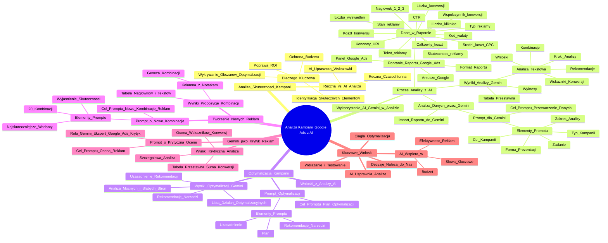

# Lekcje wideo - 2. Tworzenie treści do kampanii performance marketing

# 💡 Diagram

___

# 🗒️ Notatka

# Analiza Skuteczności Kampanii Google Ads z Wykorzystaniem AI - Notatki i Podsumowanie Lekcji

## Wprowadzenie

Lekcja koncentruje się na wykorzystaniu sztucznej inteligencji (AI), a konkretnie narzędzia Gemini, do analizy wyników kampanii marketingowych w Google Ads i ich optymalizacji.  Podkreślono kluczową rolę analizy skuteczności kampanii oraz to, jak AI może usprawnić ten proces, oszczędzając czas ⏱️ i podnosząc efektywność działań.

## Dlaczego Analiza Skuteczności Jest Kluczowa?

- **Identyfikacja skutecznych elementów:** Pozwala zrozumieć, które aspekty kampanii przynoszą najlepsze rezultaty.
- **Wykrywanie obszarów do optymalizacji:** Umożliwia wskazanie elementów wymagających modyfikacji lub eliminacji.
- **Ochrona budżetu przed przepaleniem:** Zapobiega marnotrawstwu środków na nieskuteczne reklamy.
- **Poprawa ROI (Zwrotu z Inwestycji):**  Przekłada się na lepsze wyniki i wyższy zwrot z inwestycji.
- **Przykład:** Inwestowanie w rozwijanie dobrze prosperujących reklam i wycofywanie tych, które nie generują konwersji.

> Bez analizy efektywności ryzykujemy utratę budżetu na reklamy, które nie przynoszą oczekiwanych rezultatów.

## Ręczna Analiza vs. Analiza z Wykorzystaniem AI

- **Ręczna analiza:** Jest czasochłonna i złożona, szczególnie dla osób bez doświadczenia w Google Ads. Może to zniechęcać do regularnej analizy.
- **Analiza z wykorzystaniem AI:** Upraszcza proces, dostarcza wartościowych wskazówek i ułatwia zrozumienie danych. Pozwala na maksymalizację korzyści z prowadzonych kampanii.

## Proces Analizy Kampanii Google Ads z AI (Gemini)

1. **Pobranie Raportu z Google Ads:**
    - Panel Google Ads umożliwia analizę danych, jednak pobranie raportów zwiększa wygodę pracy.
    - Dostępne są różne formaty raportów, a Arkusze Google są najczęściej wybierane ze względu na łatwą integrację z Gemini.
    - Raport skuteczności zawiera dane dotyczące kampanii, słów kluczowych, reklam itp.
    - Instrukcja pobierania raportu jest dostępna w materiałach do lekcji.
    - **Przykładowe dane w raporcie:**
        - Stan reklamy
        - Końcowy URL
        - Nagłówek 1, 2, 3 (i ich pozycja)
        - Tekst reklamy
        - Skuteczność reklamy
        - Typ reklamy
        - Liczba kliknięć
        - Liczba wyświetleń
        - CTR (Click-Through Rate)
        - Kod waluty
        - Średni koszt kliknięcia (CPC)
        - Całkowity koszt
        - Współczynnik konwersji
        - Liczba konwersji
        - Koszt konwersji

2. **Analiza Danych za Pomocą AI (Gemini):**
    - Import raportu do Gemini:
        - Kliknij ikonę plusa (+) -> \"Dodaj z Dysku\" lub \"Prześlij pliki\" z komputera.
        - Gemini uzyskuje dostęp do danych zawartych w raporcie.
    - Stworzenie **promptu** dla Gemini:
        - **Cel promptu:** Przetworzenie danych i uzyskanie szczegółowych informacji o efektywności poszczególnych elementów reklamy.
        - **Przykładowe elementy promptu:**
            - **Zadanie:** Dogłębna analiza raportu Google Ads kampanii promującej oprogramowanie do faktur.
            - **Cel kampanii:** Pozyskanie leadów z sektora MŚP w Polsce (osoby decyzyjne - właściciele firm).
            - **Typ kampanii:** Sieć wyszukiwania Google.
            - **Zakres analizy:**
                - Najskuteczniejsze nagłówki i teksty reklamowe.
                - Porównanie efektywności różnych wariantów reklam.
                - Identyfikacja czynników sukcesu.
            - **Preferowana forma prezentacji wyników:** Wykresy słupkowe.

3. **Wyniki Analizy w Gemini:**
    - Gemini analizuje dane i generuje:
        - **Wykresy:** Na przykład, \"Top 10 Ads with the Most Conversions\" (10 najlepiej konwertujących reklam).
        - **Tabelę przestawną:** Ułatwiającą porównanie wyników.
        - **Analizę tekstową:**
            - Szczegółowe rozpisanie kroków analizy.
            - Obliczenie wskaźników konwersji dla nagłówków.
            - Analiza kombinacji nagłówków i tekstów reklamowych.
            - **Szczegółowa analiza tekstowa obejmuje:**
                - Identyfikację najskuteczniejszych kombinacji nagłówków.
                - Porównanie wariantów reklam i uzasadnienie różnic w ich efektywności.
                - Określenie elementów, które przyczyniają się do sukcesu.
                - Sformułowanie wniosków i rekomendacji.

## Optymalizacja Kampanii na Podstawie Wyników Analizy AI

1. **Wykorzystanie wniosków z analizy:**  Analiza jest wartościowa, gdy prowadzi do realnych usprawnień.
2. **Prompt dla Gemini dotyczący optymalizacji:**
    - **Cel promptu:** Uzyskanie konkretnego planu optymalizacji kampanii.
    - **Przykładowe elementy promptu:**
        - Szczegółowy plan optymalizacji kampanii (z uwzględnieniem konkretnych elementów).
        - Rekomendacje dotyczące narzędzi i metod wspierających optymalizację.
        - Uzasadnienie proponowanych rekomendacji.
3. **Wyniki Optymalizacji w Gemini:**
    - **Analiza:** Identyfikacja mocnych i słabych stron kampanii.
    - **Lista konkretnych działań optymalizacyjnych.**
    - **Rekomendacje narzędzi i metod (często o charakterze ogólnym).**
    - **Uzasadnienie rekomendacji (czasami mniej szczegółowe).**

## Tworzenie Nowych Kombinacji Reklam

1. **Prompt o nowe kombinacje:**
    - **Cel promptu:** Stworzenie nowych kombinacji nagłówków i tekstów reklamowych w oparciu o wyniki analizy.
    - **Przykładowe elementy promptu:**
        - Prośba o wygenerowanie 20 nowych kombinacji nagłówków i tekstów.
        - Wykorzystanie najskuteczniejszych wariantów z przeprowadzonej analizy jako punktu wyjścia.
        - Wyjaśnienie, dlaczego proponowane kombinacje mają potencjał być skuteczne.
2. **Wyniki - Propozycje Kombinacji:**
    - **Tabela:** Przejrzysta tabela prezentująca nagłówki i teksty.
    - **Kolumna z notatkami:** Wyjaśnienie genezy poszczególnych kombinacji (bazowanie na wcześniejszych wersjach, nowe pomysły, np. elastyczność i brak ryzyka).

## Gemini jako Krytyk Reklam

1. **Prompt o krytyczną ocenę:**
    - **Cel promptu:** Ocena nagłówków i tekstów reklamowych pod kątem jasności przekazu, atrakcyjności i zgodności z wytycznymi Google Ads.
    - **Rola Gemini:** Wcielenie się w rolę eksperta Google Ads i krytyka reklam.
2. **Wyniki - Krytyczna Analiza:**
    - Szczegółowa analiza.
    - Ocena wskaźników konwersji.
    - Analiza kombinacji nagłówków i treści reklamowych.
    - Tabela przestawna (np. suma konwersji dla różnych kombinacji nagłówków).

## Kluczowe Wnioski z Lekcji

- **AI usprawnia i przyspiesza proces analizy danych Google Ads.**
- **AI wspiera w:**
    - Identyfikacji słów kluczowych.
    - Ocenie efektywności reklam.
    - Optymalizacji budżetu.
- **Skupienie się na wdrażaniu rekomendacji i testowaniu:** Przesunięcie akcentu z czasochłonnej analizy manualnej na realne działania.
- **Optymalizacja kampanii Google Ads to proces ciągły.**
- **AI wspomaga monitorowanie i sugeruje zmiany, ale ostateczne decyzje należą do nas.**

## Podsumowanie

Lekcja pokazuje, jak wykorzystanie AI, w tym konkretnym przypadku Gemini, rewolucjonizuje analizę kampanii Google Ads. Proces staje się szybszy, prostszy i bardziej efektywny. Od pobrania raportu, poprzez analizę danych za pomocą promptów, aż po optymalizację kampanii i tworzenie nowych reklam - AI staje się nieocenionym wsparciem dla specjalistów marketingu. Należy jednak pamiętać, że AI jest narzędziem wspomagającym, a finalne decyzje i ich wdrożenie leżą po stronie człowieka. Ciągła optymalizacja i testowanie stanowią fundament sukcesu kampanii Google Ads, a AI znacząco ułatwia realizację tego procesu.

___

# 🔉 Transcript
File: Lekcje wideo - 2. Tworzenie treści do kampanii performance marketing.mp4 
[00:00:00] Ekran: Białe tło z pionową czarną kreską po lewej stronie.
[00:00:01] Ekran: Napis "Umiejętności Jutra" w kolorze czarnym, a obok napis "AI" w kolorach niebieskim, fioletowym i różowym. Poniżej napisy "Organizator Google" i "Partner edukacyjny SGH".
[00:00:05] Patrycja Kaczor: Cześć.
[00:00:06] Patrycja Kaczor: Witajcie w drugiej lekcji, w której zajmiemy się jednym z najważniejszych aspektów każdej kampanii marketingowej.
[00:00:12] Ekran: Napis "Wykorzystanie AI do analizy wyników i optymalizacji kampanii performance".
[00:00:12] Patrycja Kaczor: Czyli analizą skuteczności.
[00:00:15] Patrycja Kaczor: Dlaczego to takie istotne?
[00:00:17] Patrycja Kaczor: Analiza skuteczności pozwala nam wyłapać, które elementy kampanii działają najlepiej,
[00:00:24] Patrycja Kaczor: a które wymagają poprawy lub całkowitej zmiany.
[00:00:27] Patrycja Kaczor: Bez tej wiedzy ryzykujemy przepalenie budżetu na reklamy, które nie przynoszą rezultatów,
[00:00:34] Patrycja Kaczor: tracąc szansę na lepsze wyniki i wyższy zwrot z inwestycji.
[00:00:39] Patrycja Kaczor: Przykład?
[00:00:40] Patrycja Kaczor: Jeśli zauważycie, że jedna reklama generuje znacznie więcej konwersji niż pozostałe, możecie zainwestować w jej rozwój lub zastosować jej elementy w kolejnych kampaniach.
[00:00:52] Patrycja Kaczor: A te mniej skuteczne po prostu wyeliminować, by nie obciążały budżetu.
[00:00:58] Patrycja Kaczor: Ręczne przeglądanie raportów i analizowanie wyników kampanii to często czasochłonne i skomplikowane zadanie.
[00:01:07] Patrycja Kaczor: Nic dziwnego, że wiele osób, zwłaszcza bez wsparcia specjalistów od Google Ads, po prostu rezygnuje z takiej analizy.
[00:01:15] Patrycja Kaczor: Na szczęście mamy AI i możemy znacznie uprościć ten proces.
[00:01:19] Patrycja Kaczor: W tej lekcji przejdziemy przez to, jak AI może nam pomóc w analizie danych z Google Ads,
[00:01:25] Patrycja Kaczor: dostarczając cenne wskazówki, które pozwolą nam lepiej zrozumieć kampanię i wyciągnąć z nich maksimum korzyści dla rozwoju biznesu.
[00:01:35] Patrycja Kaczor: W poprzedniej lekcji skupiliśmy się na tworzeniu nowych tekstów reklamowych i nagłówków dopasowanych do naszej grupy docelowej.
[00:01:43] Patrycja Kaczor: Ale co zrobić, gdy kampania już działa od jakiegoś czasu i zastanawiamy się, czy warto wprowadzić jakieś zmiany?
[00:01:51] Patrycja Kaczor: Jak rozpoznać, co wymaga poprawy?
[00:01:55] Patrycja Kaczor: A może chcemy sprawdzić, czy specjalista od Google Ads, któremu powierzyliśmy kampanię, rzeczywiście wykonuje swoją pracę dobrze?
[00:02:04] Patrycja Kaczor: A może po prostu czujemy się zagubieni w zawiłościach panelu Google Ads?
[00:02:10] Ekran: Napis "Pobranie raportu z Google Ads".
[00:02:11] Patrycja Kaczor: W panelu Google Ads możemy analizować skuteczność kampanii, słów kluczowych i innych elementów.
[00:02:18] Patrycja Kaczor: Jednak dla wygody warto pobrać raporty do innych narzędzi.
[00:02:23] Patrycja Kaczor: Te raporty są dostępne do pobrania w różnych formatach.
[00:02:26] Patrycja Kaczor: Najczęściej wybierany to arkusze Google, które łatwo można zintegrować z innymi narzędziami AI, na przykład Gemini.
[00:02:34] Ekran: Napis "Raport skuteczności - przykład". Poniżej tabela z danymi.
[00:02:35] Patrycja Kaczor: Na potrzeby tej lekcji przygotowałam dla was przykładowy raport skuteczności opracowany na podstawie losowych danych i tekstów.
[00:02:43] Patrycja Kaczor: Raport ten posłuży jako przykład i pomoże nam lepiej zrozumieć, jak analizować wyniki kampanii.
[00:02:50] Ekran: Tabela z danymi.
[00:02:50] Patrycja Kaczor: Jeśli chcecie samodzielnie pobrać raport ze swojego panelu Google Ads, wystarczy, że przejdziecie do zakładki reklamy, klikniecie przycisk pobierz, znajdujący się po prawej stronie.
[00:03:01] Patrycja Kaczor: W materiałach do lekcji będzie również dostępna instrukcja, jak taki raport pobrać ze swojego panelu Google Ads krok po kroku.
[00:03:09] Ekran: Tabela z danymi.
[00:03:09] Patrycja Kaczor: Przygotowany raport zawiera informacje o skuteczności kampanii w Google Ads, w tym następujące dane:
[00:03:15] Patrycja Kaczor: stan reklamy, końcowy URL, nagłówek 1 oraz jego pozycja,
[00:03:20] Patrycja Kaczor: kolejno nagłówek 2 oraz jego pozycja, nagłówek 3 oraz jego pozycja, tekst reklamy, skuteczność reklamy, typ reklam, liczba kliknięć, liczba wyświetleń, CTR, kod waluty,
[00:03:35] Patrycja Kaczor: średni koszt kliknięcia, czyli CPC, całkowity koszt, współczynnik konwersji, liczba konwersji i na sam koniec koszt konwersji.
[00:03:45] Ekran: Napis "Pobranie raportu z Google Ads" i "Analiza danych za pomocą AI" i "Optymalizacja kampanii na podstawie wyników".
[00:03:45] Patrycja Kaczor: Aby rozpocząć analizę danych z tego arkusza, potrzebujemy dodać go do Gemini.
[00:03:51] Ekran: Napis "Gemini Advanced" i "Prześlij obraz" i "Prześlij pliki" i "Dodaj z Dysku".
[00:03:51] Patrycja Kaczor: Aby to zrobić, w pierwszej kolejności klikamy ikonę plusa, która pozwala na dodanie nowych plików.
[00:03:59] Patrycja Kaczor: Następnie wybieramy opcję dodaj z dysku.
[00:04:02] Patrycja Kaczor: Jeśli raporty zostały zapisane lokalnie na naszych komputerach, wystarczy kliknąć prześlij pliki, a potem wybrać odpowiedni plik z naszej lokalnej biblioteki.
[00:04:13] Patrycja Kaczor: Po załadowaniu pliku Gemini automatycznie uzyska dostęp do raportu, co umożliwi nam rozpoczęcie analizy.
[00:04:20] Ekran: Napis "Twoje zadanie to dokładna analiza raportu pochodzącego z Google Ads dotyczącego kampanii promującej oprogramowanie do faktur. Celem kampanii było pozyskanie jak największej liczby leadów z małych i średnich firm w Polsce, a decydującą osobą w tych firmach jest właściciel. Kampania była przeprowadzona w wyszukiwarce, dlatego chcielibyśmy, abyś ocenił, które wersje reklam (nagłówki, opisy, CTA) były najbardziej skuteczne w przyciąganiu kliknięć i generowaniu leadów. Proszę o szczegółową analizę danych, która wskaże: Najskuteczniejsze nagłówki i teksty reklam, które przyniosły najlepsze wyniki. Porównanie efektywności różnych wersji reklam. Identyfikację elementów, które przyczyniły się do sukcesu kampanii. Zakończ analizę wizualizacją danych w formie wykresów słupkowych, aby lepiej zobrazować wyniki."
[00:04:21] Patrycja Kaczor: Zaczynamy od promptu, który będzie instrukcją dla Gemini.
[00:04:25] Patrycja Kaczor: Celem jest, aby Gemini przetworzył dane z raportu kampanii promującej oprogramowanie do faktur i dostarczył nam szczegółowych informacji na temat efektywności poszczególnych elementów reklamy.
[00:04:38] Patrycja Kaczor: Na początku musimy jasno określić cel kampanii, czyli pozyskanie jak największej liczby leadów z małych i średnich firm w Polsce.
[00:04:47] Patrycja Kaczor: Warto wspomnieć, że reklamy były wyświetlane w wyszukiwarce Google, co daje wskazówki co do formatu danych: kliknięcia, konwersje, koszty i tak dalej.
[00:04:57] Patrycja Kaczor: W następnej kolejności zakres analizy.
[00:05:01] Patrycja Kaczor: To na czym nam zależy to:
[00:05:03] Patrycja Kaczor: poznanie najskuteczniejszych nagłówków i tekstów reklam, porównanie efektywności różnych wersji reklam oraz identyfikacji skutecznych elementów.
[00:05:13] Patrycja Kaczor: Na samym końcu prosimy o przedstawienie wyników w formie wykresów słupkowych.
[00:05:19] Ekran: Wykres słupkowy "Top 10 Ads with the Most Conversions".
[00:05:20] Patrycja Kaczor: W odpowiedzi uzyskujemy szczegółowe rozpisanie kolejnych kroków analizy.
[00:05:25] Patrycja Kaczor: Gemini rozpoczyna od obliczenia wskaźnika konwersji dla każdego nagłówka, a następnie przeprowadza analizę różnych kombinacji nagłówków i treści reklam.
[00:05:35] Patrycja Kaczor: Na podstawie tych danych przygotowana jest tabela przestawna, która umożliwia łatwe porównanie wyników.
[00:05:42] Patrycja Kaczor: Dodatkowo do raportu dołączany jest wykres przedstawiający 10 najlepiej konwertujących reklam, co pozwala nam na szybkie zidentyfikowanie najbardziej efektywnych wersji.
[00:05:54] Ekran: Napis "Analiza Raportu Google Ads - Kampania Oprogramowania do Faktur" i tekst.
[00:05:54] Patrycja Kaczor: W dalszej kolejności otrzymujemy dalszą część analizy w formie tekstowej.
[00:06:01] Patrycja Kaczor: Mamy wymienione najskuteczniejsze kombinacje nagłówków i następnie porównanie różnych wersji reklam wraz z uzasadnieniem różnic efektywności.
[00:06:11] Patrycja Kaczor: Na sam koniec otrzymujemy identyfikację elementów, które przyczyniły się do sukcesu kampanii, wnioski oraz rekomendacje, które trzeba przyznać, że są nawet sensowne.
[00:06:22] Patrycja Kaczor: Mamy już teraz obraz tego, jak nam poszło do tej pory z kampanią.
[00:06:27] Patrycja Kaczor: Nasze AI przekopało się przez te wszystkie dane, sprawdziło co działa, a co nie.
[00:06:32] Patrycja Kaczor: Mamy również wykresy.
[00:06:34] Patrycja Kaczor: Od razu widzimy, które reklamy dały radę, a które trzeba trochę podrasować.
[00:06:39] Patrycja Kaczor: To jednak dopiero początek naszej przygody z analizą.
[00:06:43] Ekran: Napis "Pobranie raportu z Google Ads" i "Analiza danych za pomocą AI" i "Optymalizacja kampanii na podstawie wyników" i "Tworzenie nowych kombinacji reklam".
[00:06:44] Patrycja Kaczor: Teraz dysponując tymi cennymi informacjami, możemy przejść do optymalizacji kampanii i zwiększania jej efektywności.
[00:06:51] Patrycja Kaczor: Analiza ma sens tylko wtedy, gdy prowadzi do konkretnych usprawnień i lepszych rezultatów.
[00:06:58] Patrycja Kaczor: Zobaczmy teraz, jaką optymalizację zaproponuje nam Gemini, aby zwiększyć skuteczność naszej kampanii.
[00:07:04] Patrycja Kaczor: Zaczynamy od zdefiniowania czego oczekujemy.
[00:07:08] Patrycja Kaczor: Czyli piszemy o szczegółowym planie optymalizacji, który będzie zawierał konkretne elementy.
[00:07:14] Patrycja Kaczor: Dodatkowo możemy poprosić o rekomendacje innych narzędzi lub metod, które mogą nas wspomóc.
[00:07:20] Patrycja Kaczor: Bardzo ważne, prosimy o uzasadnienie rekomendacji.
[00:07:24] Ekran: Napis "Plan Optymalizacji Kampanii Reklamowej" i tekst.
[00:07:24] Patrycja Kaczor: Otrzymujemy analizę, która zawiera zarówno mocne, jak i słabe strony naszej kampanii.
[00:07:30] Patrycja Kaczor: A także listę działań optymalizacyjnych.
[00:07:33] Ekran: Napis "Narzędzia i metody" i tekst.
[00:07:33] Patrycja Kaczor: Zaproponowane narzędzia są jednak trochę ogólne.
[00:07:37] Ekran: Napis "Uzasadnienie rekomendacji" i tekst.
[00:07:37] Patrycja Kaczor: W odpowiedzi pojawiła się sugestia analizy konkurencji, ale zabrakło konkretnych nazw programów czy metod, które mogłyby nam pomóc w dalszej pracy.
[00:07:52] Patrycja Kaczor: Uzasadnienie rekomendacji jest w porządku, ale mogłoby zostać bardziej szczegółowo rozpisane.
[00:07:55] Patrycja Kaczor: Mamy już diagnozę, więc teraz czas na leczenie.
[00:07:59] Ekran: Napis "Prośba o stworzenie 20 nowych kombinacji nagłówków i tekstów reklamowych..." i tabela.
[00:07:59] Patrycja Kaczor: Tworzymy nowy prompt, który będzie zawierał prośbę o stworzenie 20 nowych kombinacji nagłówków i tekstów reklamowych bazujących na najskuteczniejszych wersjach z analizy.
[00:08:11] Patrycja Kaczor: Ponownie prosimy o dodanie wyjaśnienia, żeby uniknąć sytuacji, w której nie będziemy rozumieć dlaczego dane kombinacje mają być skuteczne.
[00:08:21] Patrycja Kaczor: Wyjaśnienie pozwoli nam ocenić logikę stojącą za tymi propozycjami i podjąć świadomą decyzję o ich wykorzystaniu.
[00:08:29] Ekran: Tabela z nagłówkami i tekstami.
[00:08:29] Patrycja Kaczor: Co otrzymujemy?
[00:08:35] Patrycja Kaczor: Przejrzystą tabelę z propozycjami nagłówków i tekstów reklamowych wzbogaconą o kolumnę z notatkami, która wyjaśnia genezę poszczególnych kombinacji.
[00:08:46] Patrycja Kaczor: Niektóre z nich, jak widzimy, bazują na wcześniejszych wersjach, a inne są zupełnie nowe.
[00:08:51] Patrycja Kaczor: Jak na przykład ta, która skupia się na potrzebie elastyczności i braku ryzyka, ważnych aspektach dla właścicieli małych firm.
[00:09:00] Ekran: Napis "Jesteś ekspertem w dziedzinie Google Ads..." i tekst.
[00:09:00] Patrycja Kaczor: Zamieńmy teraz Gemini w krytyka.
[00:09:02] Patrycja Kaczor: Chcemy, aby AI wcieliło się w rolę krytyka i oceniło nasze nagłówki i teksty reklamowe pod kątem jasności, atrakcyjności i zgodności z zasadami Google Ads.
[00:09:16] Patrycja Kaczor: Otrzymujemy analizę, która zawiera szczegółowe rozpisanie kolejnych kroków analizy.
[00:09:24] Patrycja Kaczor: Gemini rozpoczyna od obliczenia wskaźnika konwersji dla każdego nagłówka, a następnie przeprowadza analizę różnych kombinacji nagłówków i treści reklam.
[00:09:34] Patrycja Kaczor: Na podstawie tych danych przygotowana jest tabela przestawna, która pokazuje sumę konwersji dla każdej kombinacji nagłówków.
[00:09:40] Patrycja Kaczor: Przejdźmy teraz przez trzy kluczowe wnioski z tej lekcji.
[00:09:47] Ekran: Napis "Kluczowe wnioski" i tekst.
[00:09:47] Patrycja Kaczor: AI ułatwia i przyspiesza analizę danych, pomaga w identyfikacji słów kluczowych, ocenie skuteczności reklam i optymalizacji budżetu.
[00:09:53] Patrycja Kaczor: Zamiast tracić czas na ręczną analizę, możemy skoncentrować się na wdrożeniu rekomendacji.
[00:09:58] Patrycja Kaczor: AI i testowaniu nowych rozwiązań.
[01:00:03] Patrycja Kaczor: Optymalizacja kampanii Google Ads to proces ciągły, w którym AI wspiera nas w monitorowaniu wyników i sugerowaniu zmian, ale to my decydujemy, które rekomendacje wdrożyć.

___
# 🏷️ Tags
#analiza_skuteczności #AI #Gemini #Google_Ads #kampanie_marketingowe #optymalizacja #efektywność #ROI #budżet #raport_skuteczności #słowa_kluczowe #reklamy #CTR #CPC #współczynnik_konwersji #liczba_konwersji #koszt_konwersji #prompt #nagłówki_reklamowe #teksty_reklamowe #sieć_wyszukiwania_Google #MŚP #lead #wykresy_słupkowe #tabela_przestawna #optymalizacja_kampanii #narzędzia_AI #metody_optymalizacji #kombinacje_reklam #krytyka_reklam #jasność_przekazu #atrakcyjność_reklam #wdrażanie_rekomendacji #testowanie #decyzje #monitorowanie #sgh #umiejętności_jutra #ręczna_analiza #automatyzacja
