# Lekcje wideo - 3. Wykorzystanie AI do analizy wyników i optymalizacji kampanii performance

# 💡 Diagram

```mermaid
mindmap
  root((Umiejętności Jutra AI - Tworzenie Treści Reklamowych z Gemini))
    Wprowadzenie
      Sumaryzacja Transkrypcji Wideo
      Kampanie Google Ads
    Wyzwania Tradycyjnego Tworzenia Reklam
      Czasochłonność i Trudność
      Złożoność Kampanii
      Koszty Copywritingu
    Gemini Wirtualny Copywriter AI
      Dostępność 24/7
      Szybkość Generowania Treści
      Wszechstronność Modeli AI
    Kampanie Google Ads Search i AI
      Wymogi Kampanii Search
        Nagłówki Do 15
        Teksty Reklamowe Do 4
      Automatyzacja z AI
      Oszczędność Czasu
    Ograniczenia AI i Weryfikacja
      AI Nie Zastąpi Intuicji
      Konieczność Ludzkiej Korekty
    Rola Promptów Instrukcji dla AI
      Kluczowe Znaczenie Promptów
      Precyzyjne Instrukcje Lepsze Rezultaty
    Kampanie Search Najpopularniejsze Google Ads
      Najczęściej Wybierany Typ
      Idealne do Promocji
    Przykłady Kampanii Search i CRM
      Przykład 1 System CRM dla Małych Firm
        Fraza Kluczowa system CRM dla małych firm
        Reklamy Berg System Livespace Pipedrive Monday CRM
        Wspólny Przekaz Łatwość Obsługi Efektywność
        Analiza Reklamy Berg System
          Jasny Komunikat CRM dla małych firm
          Wyróżnik Polski Program CRM
          Wezwania do Działania Call to Action
        Analiza Reklamy Livespace
          Skuteczność Dla Małych Firm
          Prostota Interfejsu
      Przykład 2 System CRM dla Agencji Marketingowej
        Fraza Kluczowa system CRM dla agencji marketingowej
        Wyniki Wyszukiwania Różne
        Brak Dopasowania Reklam
        Analiza Reklamy CRM dla Agencji Reklamowej
          Najbliższa Intencji
          Koncentracja na Funkcjach dla Agencji
    Kreatywność i AI w Reklamach
      Wysoki Poziom Kreatywności
      Unikalność i Spójność
      AI Wsparcie Kreatywne
    Praktyczne Zastosowanie Gemini
      Prompt Przykład 1
        Generowanie Nagłówków i Tekstów
        CRM dla Agencji Marketingowych
        Grupa Docelowa Średnie Agencje
        Język Korzyści
        Google Ads Kampania Search
        Cel Pozyskiwanie Leadów
      Wynik Gemini
        15 Nagłówków
        4 Teksty Reklamowe
      Iteracja Kluczem do Sukcesu
      Dynamiczna Współpraca z AI
      Analogia Nauka Jazdy na Rowerze
    Gemini Jako Krytyk
      Prompt Przykład 2 Rola Eksperta
        Krytyczna Ocena Nagłówków i Tekstów
        Propozycje Ulepszeń
        Jasność Przekazu Atrakcyjność Zgodność Google Ads
      Krytyczna Ocena Gemini
        Solidna Baza Potencjał Ulepszeń
      Analiza Nagłówków
        Zbyt Ogólnikowe
        Brak Unikalnej Propozycji
        Propozycje Zmian
          Wykorzystanie Liczb
          Podkreślenie Unikalnych Funkcji
          Zadawanie Pytań
        Przykładowe Nagłówki Po Modyfikacjach
      Analiza Tekstów Reklamowych
        Brak Konkretnych Korzyści
        Nadmiar Ogólników
        Propozycje Zmian
          Koncentracja na Problemach
          Język Korzyści
          Dowód Społeczny
        Przykładowy Tekst Po Modyfikacjach
    Decyzja o Implementacji Sugestii
      Decyzja Należy do Ciebie
      Zgodność z Celami i Grupą Docelową
    Szczegółowość Promptów
      Precyzyjny Prompt Lepsze Wyniki
    Zmiana Grupy Docelowej Elastyczność AI
      Szybka Adaptacja Gemini
      Elastyczność AI
    Podsumowanie
      Korzyści AI Oszczędność Czasu
      Kluczowe Precyzyjne Prompty Weryfikacja
      Iteracyjny Proces Doskonalenie Promptów
```

___

# 🗒️ Notatka

# Notatki i Sumaryzacja Transkrypcji Wideo: Umiejętności Jutra AI - Tworzenie Treści Reklamowych z Gemini

## Wprowadzenie

Niniejsze opracowanie skupia się na wykorzystaniu sztucznej inteligencji, a konkretnie modelu **Gemini**, w procesie tworzenia treści reklamowych, ze szczególnym uwzględnieniem kampanii **Google Ads**. Przedstawiono w nim wyzwania związane z tradycyjnym podejściem do tworzenia tekstów reklamowych oraz zademonstrowano, w jaki sposób AI może usprawnić ten proces, oszczędzając czas i zwiększając efektywność.

## Wyzwania w Tradycyjnym Tworzeniu Tekstów Reklamowych

- **Czasochłonność i trudność**: Stworzenie skutecznych tekstów reklamowych wymaga znacznego nakładu czasu, kreatywności i wiedzy z zakresu marketingu.
- **Złożoność zarządzania wieloma kampaniami**: Obsługa dużej liczby kampanii reklamowych i konieczność dostosowywania tekstów do każdej z nich bywa przytłaczająca.
- **Koszty copywritingu**: Regularne zlecanie tworzenia tekstów reklamowych copywriterom generuje dodatkowe wydatki.

## Gemini jako Wirtualny Copywriter AI

- **Dostępność całodobowa 24/7 🕰️**: Gemini oferuje wsparcie w tworzeniu tekstów reklamowych o każdej porze.
- **Szybkość generowania treści**: Model AI jest w stanie wygenerować kreatywne i przekonujące treści reklamowe w zaledwie kilka sekund ⏱️.
- **Wszechstronność modeli AI**: Dostępne są różne modele AI wspomagające tworzenie treści, jednak to opracowanie koncentruje się na możliwościach modelu Gemini.

## Kampanie Google Ads typu Search i Rola AI

- **Wymogi kampanii Search**: Kampanie Google Ads w sieci wyszukiwania (search) wymagają zastosowania:
    - **Do 15 nagłówków** (maks. 30 znaków każdy)
    - **Do 4 tekstów reklamowych** (maks. 90 znaków każdy)
- **Automatyzacja z AI**: Gemini automatycznie dostosowuje proporcje tekstów i kontroluje liczbę znaków, zapewniając zgodność z wytycznymi Google.
- **Oszczędność czasu**: AI znacząco skraca czas potrzebny na dostosowanie tekstów do wymogów platformy.

## Ograniczenia AI i Istotność Weryfikacji

- **AI nie zastąpi intuicji i wiedzy eksperckiej**: Treści generowane przez AI stanowią punkt wyjścia, lecz wymagają weryfikacji przez człowieka.
- **Konieczność ludzkiej korekty**: Niezbędne jest dostosowanie i poprawienie tekstów AI, aby precyzyjnie odpowiadały założonym celom i potrzebom.

## Rola Promptów (Instrukcji) dla AI

- **Kluczowe znaczenie promptów**: Jakość i użyteczność wyników AI bezpośrednio zależą od precyzji i jasności sformułowanych poleceń (promptów).
- **Precyzyjne instrukcje = lepsze rezultaty**: Im bardziej szczegółowy i zrozumiały prompt, tym trafniejsze odpowiedzi generuje AI.

## Kampanie Search - Najpopularniejszy Typ Kampanii Google Ads

- **Kampanie Search**: To najczęściej wybierany typ kampanii w Google Ads.
- **Idealne do promocji**: Są idealne do promowania produktów lub usług cieszących się popytem, lub gdy użytkownicy aktywnie poszukują konkretnych rozwiązań.

## Przykłady Kampanii Search i Analiza Reklam CRM

### Przykład 1: "system CRM dla małych firm"

- **Fraza kluczowa**: "system CRM dla małych firm".
- **Wyniki wyszukiwania**: Reklamy systemów CRM, m.in. Berg System, Livespace, Pipedrive, Monday CRM.
- **Wspólny przekaz**: Łatwość obsługi i efektywność w zarządzaniu relacjami z klientami.

#### Analiza Reklamy Berg System

- **Czynniki wyróżniające reklamę Berg System (pierwsza pozycja):**
    - **Jasny i zrozumiały komunikat**: "CRM dla małych firm".
    - **Wyróżnik "polski program CRM"**: Wzmacnia poczucie lokalnej dostępności i zaufania.
    - **Wezwania do działania (Call to Action)**: "Sprawdź cennik", "Przeczytaj Case Study", "Testuj bezpłatnie", "Zapytaj o wdrożenie" – angażują odbiorcę i zwiększają prawdopodobieństwo konwersji.

#### Analiza Reklamy Livespace

- **Skuteczność reklamy Livespace**: Podobnie, reklama kierowana do małych firm poszukujących CRM.
- **Dodatkowe atuty**: Prostota i intuicyjny interfejs systemu.

### Przykład 2: "system CRM dla agencji marketingowej"

- **Fraza kluczowa**: "system CRM dla agencji marketingowej".
- **Wyniki wyszukiwania**: Różnią się od tych dla małych firm.
- **Brak precyzyjnego dopasowania w reklamach**: Większość reklam nie zawiera frazy "dla agencji marketingowej" w nagłówku.
- **Potencjalne przyczyny**: Niedostateczne dostosowanie kampanii lub założenie, że ogólny przekaz CRM jest wystarczający.

#### Analiza Reklamy "CRM dla Agencji Reklamowej"

- **Najbliższa intencji**: Reklama "CRM dla Agencji Reklamowej" najlepiej odpowiada intencji wyszukiwania.
- **Koncentracja na funkcjach dla agencji**: Akcent na szybkie planowanie działań, elastyczność, generowanie ofert i faktur.

## Kreatywność w Tworzeniu Tekstów Reklamowych i Rola AI

- **Wysoki poziom kreatywności**: Niezbędny, zwłaszcza przy tworzeniu wielu wariantów tekstów dla różnych grup docelowych.
- **Unikalność i spójność**: Teksty powinny być unikalne dla każdej grupy docelowej, zachowując jednocześnie spójność z identyfikacją marki.
- **AI jako wsparcie kreatywne**: Gemini (i inne narzędzia AI) stanowią nieocenione wsparcie w generowaniu licznych propozycji tekstów.

## Praktyczne Zastosowanie Gemini - Generowanie Nagłówków i Tekstów Reklamowych

### Prompt dla Gemini (Przykład 1)

> Twoim zadaniem jest wygenerowanie 15 wariantów nagłówków reklamowych oraz 4 tekstów reklamowych promujących system CRM dedykowany agencjom marketingowym. Grupą docelową są średnie agencje (11-50 pracowników) obsługujące klientów zagranicznych.  Wykorzystaj język korzyści, koncentrując się na wartości, jaką CRM oferuje agencjom. Zadbaj o klarowny i zwięzły przekaz, dostosowany do specyfiki agencji marketingowych. Szczegóły kampanii: Platforma reklamowa: Google Ads, kampania Search. Cel: Pozyskiwanie leadów poprzez zachęcenie do skorzystania z darmowej wersji testowej. Nagłówki: Maksymalnie 30 znaków (ze spacjami). Użyj słów kluczowych: CRM dla NGO, organizacja non-profit, zarządzanie darczyńcami, relacje z wolontariuszami, testuj za darmo. Teksty reklamowe: Limit znaków: 90 (ze spacjami). Każdy wariant tekstu powinien charakteryzować się innym tonem: formalnym, przyjaznym, dynamicznym, profesjonalnym.

- **Wynik Gemini**: 15 propozycji nagłówków i 4 warianty tekstów reklamowych.
- **Iteracja kluczem do sukcesu**: Kolejne iteracje i udoskonalanie promptów prowadzą do lepszych rezultatów.
- **Dynamiczna współpraca z AI**: Ciągłe doskonalenie promptów i reagowanie na generowane wyniki.
- **Analogia do nauki jazdy na rowerze 🚲**: Nauka efektywnej współpracy z AI wymaga praktyki i ciągłego doskonalenia umiejętności.

## Gemini jako Krytyk - Analiza i Ulepszanie Tekstów

### Prompt dla Gemini (Przykład 2) - Rola Eksperta

> Wciel się w rolę eksperta Google Ads. Dokonaj krytycznej oceny zaproponowanych nagłówków i tekstów reklamowych. Zaproponuj zmiany, które mogą podnieść ich efektywność. Skup się na aspektach takich jak jasność przekazu, atrakcyjność dla odbiorcy oraz zgodność z najlepszymi praktykami reklam Google.

### Krytyczna Ocena Gemini i Propozycje Ulepszeń

- **Ogólna ocena**: Solidna baza, lecz zawsze istnieje potencjał do udoskonaleń.
- **Analiza Nagłówków**:
    - **Zbyt ogólnikowe**: Niektóre nagłówki są mało wyróżniające.
    - **Brak unikalnej propozycji wartości**: Nie podkreślają, co wyróżnia dany CRM na tle konkurencji.
    - **Propozycje zmian**:
        - **Wykorzystanie liczb**: Dodaje wiarygodności (np. "2x szybsza obsługa klientów").
        - **Podkreślenie unikalnych funkcji**: Eksponowanie specyficznych cech (np. "CRM z wbudowaną analityką").
        - **Zadawanie pytań**: Angażuje użytkownika (np. "Masz trudności z obsługą klientów zagranicznych?").
    - **Przykładowe nagłówki po modyfikacjach**:
        - "Zwiększ zyski o 20% dzięki automatyzacji CRM."
        - "CRM dla agencji: Globalni klienci, lokalne wsparcie."
        - "Testuj za darmo: CRM, który rozumie Twoją agencję."
- **Analiza Tekstów Reklamowych**:
    - **Brak konkretnych korzyści**: Korzyści mogłyby być bardziej szczegółowe i wymierne.
    - **Nadmiar ogólników**: Określenia typu "kompleksowe rozwiązanie" są mało przekonujące.
    - **Propozycje zmian**:
        - **Koncentracja na konkretnych problemach**: Odniesienie do realnych wyzwań agencji (np. "Zredukuj koszty obsługi klienta o 40%").
        - **Język korzyści**: Akcentowanie korzyści, nie tylko funkcji.
        - **Dodanie dowodu społecznego**: Wzmocnienie przekazu (np. "Dołącz do tysięcy agencji...").
    - **Przykładowy tekst po modyfikacjach**:
        - Nagłówek: "Zwiększ zyski o 20% dzięki automatyzacji CRM."
        - Tekst: "Masz dość ręcznego wprowadzania danych i żmudnego śledzenia projektów? Nasz CRM automatyzuje powtarzalne zadania, generuje profesjonalne raporty i integruje się z Twoimi ulubionymi narzędziami. Wypróbuj za darmo i przekonaj się, jak łatwo możesz zarządzać swoimi międzynarodowymi klientami."

## Decyzja o Implementacji Sugestii i Dostosowanie do Celów

- **Decyzja należy do Ciebie**: Ostateczna decyzja o wdrożeniu sugestii Gemini i dalszym kierunku pracy nad tekstami należy do użytkownika.
- **Zgodność z celami i grupą docelową**: Wybór propozycji powinien być podyktowany ich adekwatnością do celów kampanii i zdolnością do przyciągnięcia uwagi docelowych odbiorców.

## Szczegółowość Promptów - Recepta na Lepsze Wyniki

- **Im bardziej precyzyjny prompt, tym lepsze rezultaty**: Dokładne określenie oczekiwań i dostarczenie kontekstu to klucz do efektywnej współpracy z AI.

## Zmiana Grupy Docelowej i Elastyczność AI

- **Szybka adaptacja Gemini**: Model AI sprawnie dostosowuje się do zmian grupy docelowej i modyfikacji promptów.
- **Elastyczność AI**: Umożliwia łatwe i szybkie dopasowanie treści reklamowych do różnorodnych segmentów odbiorców.

## Podsumowanie

Wykorzystanie AI, takiego jak Gemini, w procesie tworzenia treści reklamowych przynosi wymierne korzyści, w tym oszczędność czasu ⏱️, generowanie wielu wariantów tekstów i możliwość szybkiego dostosowania do różnych grup docelowych. Kluczowe jest jednak precyzyjne formułowanie promptów i weryfikacja wyników generowanych przez AI, aby zapewnić ich skuteczność i zgodność z założonymi celami marketingowymi. Współpraca z AI to proces iteracyjny, który poprzez ciągłe doskonalenie promptów i analizę efektów, prowadzi do coraz lepszych rezultatów w tworzeniu efektywnych kampanii reklamowych.

___

# 🔉 Transcript
File: Lekcje wideo - 3. Wykorzystanie AI do analizy wyników i optymalizacji kampanii performance.mp4 
[00:00:01] Ekran: (Na białym tle pojawia się napis "Umiejętności Jutra AI" w kolorze czarnym i fioletowo-niebieskim. Poniżej napisu widnieją loga "Google" i "SGH".)
[00:00:05] Patrycja Kaczor: Tworzenie tekstów do reklam może być czasochłonne i trudne.
[00:00:05] Ekran: (Po prawej stronie ekranu pojawia się napis "Tworzenie treści do kampanii performance marketing".)
[00:00:10] Patrycja Kaczor: Wymaga zarówno kreatywności, jak i znajomości zasad, a przy dużej liczbie kampanii łatwo można się zagubić.
[00:00:19] Patrycja Kaczor: Zatrudnienie copywritera to dodatkowy koszt.
[00:00:23] Patrycja Kaczor: I w wielu przypadkach, jeśli potrzebujemy tekstów regularnie, jest to dość kosztowne rozwiązanie.
[00:00:30] Patrycja Kaczor: Wyobraźcie sobie jednak, że macie osobistego copywritera, dostępnego 24 godziny na dobę, który w kilka sekund generuje kreatywne i przekonujące treści reklamowe.
[00:00:45] Patrycja Kaczor: Brzmi jak marzenie?
[00:00:47] Patrycja Kaczor: Dzięki Gemini to marzenie staje się rzeczywistością.
[00:00:51] Patrycja Kaczor: Możemy też korzystać z innych modeli AI, które wspierają tworzenie treści reklamowych.
[00:00:58] Patrycja Kaczor: Jednak w tej lekcji skupimy się tylko na Gemini.
[00:01:02] Patrycja Kaczor: Napisanie kilkunastu nagłówków lub treści do reklam to jedno, ale gdy kampanii jest dużo i zależy nam na personalizacji, to zadanie staje się znacznie bardziej wymagające.
[00:01:14] Patrycja Kaczor: Do tego dochodzą zasady ustalane przez Google.
[00:01:18] Patrycja Kaczor: Dla kampanii typu search, czyli kampanii w wyszukiwarce, najlepiej, aby każdy zestaw reklam zawierał aż 15 nagłówków po maksymalnie 30 znaków oraz cztery warianty tekstów reklamowych z limitem do 90 znaków każdy.
[00:01:35] Patrycja Kaczor: Nie ma takiej potrzeby, aby człowiek ręcznie liczył znaki i dopasowywał treści.
[00:01:42] Patrycja Kaczor: AI zrobi to za nas.
[00:01:44] Patrycja Kaczor: Gemini może automatycznie dostosować proporcje tekstów, tak aby spełniały wytyczne Google, co oszczędza mnóstwo czasu.
[00:01:55] Patrycja Kaczor: Warto na początku podkreślić, że chociaż AI może wygenerować różnorodne treści, nie zastąpi w pełni naszej intuicji i wiedzy branżowej.
[00:02:06] Patrycja Kaczor: Nadal potrzebna jest nasza weryfikacja i poprawki, aby te treści były precyzyjnie dopasowane do naszych potrzeb i celów.
[00:02:17] Patrycja Kaczor: Nie można również pominąć roli promptów, czyli instrukcji, które przekazujemy AI.
[00:02:23] Patrycja Kaczor: To jak precyzyjnie i jasno sformułujemy nasze polecenia, bezpośrednio wpływa na jakość i użyteczność otrzymanych wyników.
[00:02:32] Patrycja Kaczor: W tej lekcji skupimy się na kampanii typu search, najczęściej stosowanym typie kampanii w Google Ads.
[00:02:38] Patrycja Kaczor: Idealnym do promocji produktów lub usług, na które jest już wysokie zapotrzebowanie lub gdy użytkownicy aktywnie poszukują rozwiązań w danej kategorii.
[00:02:50] Ekran: (Na ekranie wyświetla się strona wyszukiwarki Google z wynikami wyszukiwania dla frazy "system CRM dla małych firm". Wyniki wyszukiwania zawierają reklamy sponsorowane różnych firm oferujących systemy CRM.)
[00:02:50] Patrycja Kaczor: Spójrzmy na przykład.
[00:02:51] Patrycja Kaczor: W wyszukiwarce, po wpisaniu frazy "system CRM dla małych firm", otrzymujemy różne wyniki, które prezentują oferty systemów CRM.
[00:03:01] Patrycja Kaczor: Wśród nich znajdują się takie programy jak Berg System, Livespace, Pipedrive oraz CRM od Monday.
[00:03:09] Patrycja Kaczor: Wszystkie te programy reklamują się jako łatwe w użyciu i efektywne w zarządzaniu relacjami z klientami, co może być cenne dla małych przedsiębiorstw poszukujących narzędzi do usprawnienia swoich działań.
[00:03:22] Patrycja Kaczor: Która reklama najbardziej przyciągnie uwagę właściciela małej firmy?
[00:03:27] Patrycja Kaczor: W pierwszej kolejności ta, która wyświetli się na samej górze, ale do tego przejdziemy później.
[00:03:33] Patrycja Kaczor: Jeśli chodzi o tekst reklamy, to to, co wydaje się najbardziej atrakcyjne, będzie subiektywne.
[00:03:40] Patrycja Kaczor: Jednak patrząc na typowe potrzeby małych firm, reklama "CRM dla małych firm - Nowoczesny system CRM" może być najbardziej odpowiednia.
[00:03:49] Patrycja Kaczor: Reklama od firmy Berg System wyświetla się jako pierwsza.
[00:03:53] Patrycja Kaczor: Spójrzmy na to, co ją wyróżnia.
[00:03:55] Ekran: (Na ekranie powiększa się reklama firmy Berg System, która wyświetla się na samej górze wyników wyszukiwania.)
[00:03:55] Patrycja Kaczor: Jasne i zrozumiałe przesłanie.
[00:03:59] Patrycja Kaczor: Reklama od razu informuje, że narzędzie jest skierowane do małych firm, co sprawia, że użytkownik szybko rozumie, czy oferta jest dla niego.
[00:04:08] Patrycja Kaczor: Wyróżniki.
[00:04:09] Patrycja Kaczor: Reklama podkreśla, że jest to polski program CRM, co może być istotnym czynnikiem dla właścicieli małych firm w Polsce.
[00:04:18] Patrycja Kaczor: Taki komunikat buduje poczucie lokalnej dostępności.
[00:04:23] Patrycja Kaczor: W następnej kolejności zachęta do działania.
[00:04:27] Patrycja Kaczor: Reklama zawiera wyraźne wezwanie do działania.
[00:04:30] Patrycja Kaczor: Przykładowo: "Sprawdź cennik", "Przeczytaj Case Study", "Testuj bezpłatnie" czy "Zapytaj o wdrożenie".
[00:04:38] Patrycja Kaczor: Takie komunikaty angażują odbiorcę i zachęcają go do podjęcia kolejnych kroków, co zwiększa szansę na konwersję.
[00:04:47] Patrycja Kaczor: Druga reklama firmy Livespace również skutecznie wskazuje, że jej CRM przeznaczony jest dla małych firm, co doskonale odpowiada intencji zawartej w wyszukiwanej frazie.
[00:05:01] Patrycja Kaczor: Reklama podkreśla dodatkowo prostotę i przyjazny interfejs systemu, co może być kluczowym atutem dla małych przedsiębiorstw szukających intuicyjnych narzędzi do zarządzania relacjami z klientami.
[00:05:14] Patrycja Kaczor: Przejdźmy teraz do kolejnego przykładu.
[00:05:17] Ekran: (Na ekranie wyświetla się strona wyszukiwarki Google z wynikami wyszukiwania dla frazy "system CRM dla agencji marketingowej". Wyniki wyszukiwania zawierają reklamy sponsorowane różnych firm oferujących systemy CRM.)
[00:05:17] Patrycja Kaczor: Tym razem w wyszukiwarce wpisujemy frazę "system CRM dla agencji marketingowych".
[00:05:23] Patrycja Kaczor: W tym przypadku wyniki wyszukiwania są zupełnie inne niż wcześniej.
[00:05:29] Patrycja Kaczor: Oprócz wyników organicznych, które odpowiadają frazie "system CRM dla agencji marketingowych", żadna z reklam nie zawiera tego hasła w nagłówku.
[00:05:40] Patrycja Kaczor: Może to sugerować, że reklamodawcy nie dostosowali swoich kampanii do tej grupy docelowej lub uznali, że przekaz CRM jest wystarczający, aby przyciągnąć uwagę potencjalnych klientów z agencji marketingowej.
[00:05:55] Patrycja Kaczor: Najbliższa intencji w wpisywanej wyszukiwarce jest reklama "CRM dla Agencji Reklamowej", która koncentruje się na kluczowych funkcjach przydatnych dla agencji, takich jak szybkie planowanie działań, elastyczność czy możliwość generowania ofert i faktur.
[00:06:13] Patrycja Kaczor: Tworzenie tekstów reklamowych często wymaga dużej dawki kreatywności.
[00:06:18] Patrycja Kaczor: Szczególnie gdy chodzi o przygotowanie wielu wariantów dostosowanych do różnych grup docelowych.
[00:06:25] Patrycja Kaczor: W kampaniach, które obejmują różne segmenty odbiorców, każdy tekst musi być na tyle unikalny, by przyciągnąć uwagę konkretnej grupy docelowej, jednocześnie zachowując spójność z przekazem marki.
[00:06:40] Patrycja Kaczor: Przy takim nakładzie pracy kreatywnej AI staje się nieocenionym wsparciem, pozwalającym generować wiele propozycji tekstów reklamowych.
[00:06:50] Patrycja Kaczor: Warto na ekranie pojawia się napis "Gemini Advanced" i tekst: "Twoim zadaniem jest napisanie 15 wariantów nagłówków reklam promujących CRM dedykowany agencjom marketingowym oraz 4 nagłówki. Grupa docelowa są średnie agencje (11-50 osób), które obsługują klientów zagranicznych. Użyj języka korzyści, skupiając się na tym, co CRM oferuje agencjom. Zadbaj o klarowny i zwięzły przekaz. Dostosuj język do specyfiki grupy docelowej (agencje marketingowe). Szczegóły kampanii: Platforma reklamowa: Google Ads kampania Search. Cel: Generowanie leadów poprzez zachęcenie do skorzystania z darmowej wersji testowej. Nagłówki: Maksymalnie 30 znaków (w tym spacje). Użyj słów kluczowych: CRM dla NGO, organizacja non-profit, zarządzanie darczyńcami, relacje z wolontariuszami, testuj za darmo. Teksty reklamowe: Limit znaków: 90 (w tym spacje). Każdy wariant tekstu powinien mieć inny ton: formalny, przyjazny, dynamiczny, profesjonalny."
[00:06:50] Ekran: (Po lewej stronie ekranu widoczna jest Patrycja Kaczor, a po prawej stronie pojawia się białe tło z tekstem dotyczącym tworzenia nagłówków reklamowych.)
[00:07:01] Patrycja Kaczor: Spójrzmy teraz na wyniki.
[00:07:09] Ekran: (Na ekranie pojawia się lista 15 wariantów nagłówków reklamowych, które wygenerował Gemini.)
[00:07:09] Patrycja Kaczor: Mamy gotowe 15 propozycji nagłówków i cztery warianty tekstów reklamowych.
[00:07:15] Patrycja Kaczor: Z doświadczenia wiem, że im więcej iteracji wykonamy, tym lepszy efekt osiągniemy.
[00:07:21] Patrycja Kaczor: AI może dostarczać coraz trafniejsze odpowiedzi, ale wymaga to od nas ciągłej pracy nad precyzyjnym sformułowaniem zapytań oraz reagowania na wyniki, aby cały czas ten proces udoskonalać.
[00:07:35] Patrycja Kaczor: Lubię myśleć o współpracy z AI jak o dynamicznym procesie, który możemy ciągle doskonalić.
[00:07:40] Patrycja Kaczor: Trochę tak jak jazda na rowerze.
[00:07:43] Patrycja Kaczor: Na początku może być trudno utrzymać równowagę, ale z czasem stajesz się coraz lepszy, jedziesz coraz szybciej i pewniej.
[00:07:53] Patrycja Kaczor: Podobnie jest ze sztuczną inteligencją.
[00:07:56] Patrycja Kaczor: Im więcej z nią pracujesz, tym lepiej rozumiesz, w jaki sposób ona działa i efektywniej ją wykorzystujesz.
[00:08:01] Patrycja Kaczor: Zmieńmy teraz Gemini w krytyka, który przyjrzy się zaproponowanym nagłówkom i tekstom reklamowym.
[00:08:10] Ekran: (Na ekranie pojawia się tekst: "Jesteś ekspertem od Google Ads. Poddaj krytycznie do zaproponowanych nagłówków i tekstów reklam. Zaproponuj zmiany, które mogą zwiększyć ich efektywność. Skup się na elementach takich jak jasność przekazu, atrakcyjność dla odbiorcy, a także zgodność z najlepszymi praktykami w reklamach Google.")
[00:08:10] Patrycja Kaczor: Ma je dokładnie przeanalizować i odpowiedzieć nam, co jest dobre, a co można poprawić.
[00:08:16] Patrycja Kaczor: Poprośmy Gemini, żeby zwróciło uwagę na jasność przekazu, atrakcyjność dla odbiorcy oraz zgodność z najlepszymi praktykami Google Ads.
[00:08:27] Ekran: (Na ekranie pojawia się tekst: "Krytyczna ocena i propozycje zmian: Świetny początek! Zaproponowane przez Ciebie nagłówki i teksty reklamowe są solidną podstawą dla kampanii Google Ads. Zawierają kluczowe słowa kluczowe, podkreślają korzyści dla klienta i zachęcają do działania. Jednak zawsze jest miejsce na udoskonalenia. Analiza i propozycje zmian: Nagłówki: Zbyt ogólne: Niektóre nagłówki (np. "CRM dla agencji: Automatyzuj, integruj, skaluj.") są zbyt ogólne i mogą nie wyróżniać się na tle konkurencji. Brak unikalnej propozycji: Brakuje wyraźnego podkreślenia, czym Twój CRM różni się od innych rozwiązań na rynku. Propozycje: Użyj liczb: Użyj "2x szybsza obsługa klientów dzięki CRM" lub "Zwiększ efektywność o 30%". Liczby dodają wiarygodności i przyciągają uwagę. Podkreśl unikalną funkcjonalność: "CRM z wbudowaną analityką dla kampanii międzynarodowych" lub "Jedyna platforma, która łączy CRM z narzędziami do zarządzania projektami". Zapytaj: "Zmagasz się z obsługą klientów zagranicznych? Mamy rozwiązanie!" - pytania angażują użytkownika. Przykładowe nagłówki po zmianach: Zwiększ zyski o 20% dzięki automatyzacji w CRM. CRM dla agencji: Globalni klienci, lokalne wsparcie. Testuj za darmo: CRM, który rozumie Twoją agencję. Teksty reklamowe: Brak konkretnych korzyści: Chociaż wymienione są korzyści, mogłyby być bardziej szczegółowe i skoncentrowane na konkretnych problemach agencji. Zbyt dużo ogólników: Słowa jak "kompleksowe rozwiązanie" czy "łatwiejsza obsługa" są zbyt ogólne i nie przemawiają do konkretnych potrzeb klienta. Propozycje: Skup się na konkretnych problemach: "Zmniejsz koszty obsługi klienta o 40% dzięki automatyzacji fakturowania." lub "Zarządzaj projektami międzynarodowymi bez stresu dzięki centralnej bazie danych klientów." Używaj języka korzyści: Zamiast mówić o funkcjach, mów o tym, co klient zyska dzięki nim. Dodaj elementy społecznego dowodu: "Połącz się z tysiącami agencji, które już zaufały naszemu CRM." Przykładowy tekst po zmianach: Nagłówek: Zwiększ zyski o 20% dzięki automatyzacji w CRM. Tekst: Masz dość ręcznego wprowadzania danych i śledzenia projektów? Nasz CRM automatyzuje powtarzalne zadania, generuje profesjonalne raporty i integruje się z Twoimi ulubionymi narzędziami. Wypróbuj za darmo i zobacz, jak łatwo możesz zarządzać swoimi międzynarodowymi klientami.")
[00:08:27] Patrycja Kaczor: Gemini świetnie poradził sobie ze wskazaniem słabych stron naszych tekstów i podał propozycje zmian zarówno dla nagłówków i tekstów reklamowych.
[00:08:40] Patrycja Kaczor: Teraz to do nas należy decyzja, czy zastosujemy te sugestie, czy będziemy dalej pracować nad tekstami.
[00:08:49] Patrycja Kaczor: Warto teraz zastanowić się też, które z tych propozycji są najbardziej zgodne z naszymi celami i które mogą rzeczywiście przyciągnąć uwagę naszej grupy docelowej.
[00:09:54] Patrycja Kaczor: Im bardziej szczegółowy będzie prompt, tym lepsze wyniki otrzymamy.
[01:00:00] Patrycja Kaczor: Bardzo ważne jest precyzyjne określenie, czego oczekujemy i dostarczenie AI wystarczającej ilości kontekstu.
[01:00:07] Patrycja Kaczor: W tym zadaniu jest napisanie 15 wariantów nagłówków reklam promujących CRM dedykowany agencjom marketingowym oraz 4 nagłówki. Grupa docelowa są średnie agencje (11-50 osób), które obsługują klientów zagranicznych. Użyj języka korzyści, skupiając się na tym, co CRM oferuje agencjom. Zadbaj o klarowny i zwięzły przekaz. Dostosuj język do specyfiki grupy docelowej (agencje marketingowe). Szczegóły kampanii: Platforma reklamowa: Google Ads kampania Search. Cel: Generowanie leadów poprzez zachęcenie do skorzystania z darmowej wersji testowej. Nagłówki: Maksymalnie 30 znaków (w tym spacje). Użyj słów kluczowych: CRM dla NGO, organizacja non-profit, zarządzanie darczyńcami, relacje z wolontariuszami, testuj za darmo. Teksty reklamowe: Limit znaków: 90 (w tym spacje). Każdy wariant tekstu powinien mieć inny ton: formalny, przyjazny, dynamiczny, profesjonalny.
[01:00:07] Ekran: (Po lewej stronie ekranu widoczna jest Patrycja Kaczor, a po prawej stronie pojawia się białe tło z tekstem dotyczącym tworzenia nagłówków reklamowych.)
[01:00:10] Patrycja Kaczor: Zobaczmy teraz, jak szybko Gemini poradzi sobie ze zmianą grupy docelowej i dostosowaniem nagłówków oraz tekstów reklamowych do tych nowych odbiorców.
[01:00:10] Ekran: (Po lewej stronie ekranu widoczna jest Patrycja Kaczor, a po prawej stronie pojawia się białe tło z tekstem dotyczącym tworzenia nagłówków reklamowych.)
[01:00:10] Ekran: (Po lewej stronie ekranu widoczna jest Patrycja Kaczor, a po prawej stronie pojawia się białe tło z tekstem dotyczącym tworzenia nagłówków reklamowych.)
[01:00:10] Ekran: (Po lewej stronie ekranu widoczna jest Patrycja Kaczor, a po prawej stronie pojawia się białe tło z tekstem dotyczącym tworzenia nagłówków reklamowych.)
[01:00:10] Ekran: (Po lewej stronie ekranu widoczna jest Patrycja Kaczor, a po prawej stronie pojawia się białe tło z tekstem dotyczącym tworzenia nagłówków reklamowych.)
[01:00:10] Ekran: (Po lewej stronie ekranu widoczna jest Patrycja Kaczor, a po prawej stronie pojawia się białe tło z tekstem dotyczącym tworzenia nagłówków reklamowych.)
[01:00:10] Ekran: (Po lewej stronie ekranu widoczna jest Patrycja Kaczor, a po prawej stronie pojawia się białe tło z tekstem dotyczącym tworzenia nagłówków reklamowych.)
[01:00:10] Ekran: (Po lewej stronie ekranu widoczna jest Patrycja Kaczor, a po prawej stronie pojawia się białe tło z tekstem dotyczącym tworzenia nagłówków reklamowych.)
[01:00:10] Ekran: (Po lewej stronie ekranu widoczna jest Patrycja Kaczor, a po prawej stronie pojawia się białe tło z tekstem dotyczącym tworzenia nagłówków reklamowych.)
[01:00:10] Ekran: (Po lewej stronie ekranu widoczna jest Patrycja Kaczor, a po prawej stronie pojawia się białe tło z tekstem dotyczącym tworzenia nagłówków reklamowych.)
[01:00:10] Ekran: (Po lewej stronie ekranu widoczna jest Patrycja Kaczor, a po prawej stronie pojawia się białe tło z tekstem dotyczącym tworzenia nagłówków reklamowych.)
[01:00:10] Ekran: (Po lewej stronie ekranu widoczna jest Patrycja Kaczor, a po prawej stronie pojawia się białe tło z tekstem dotyczącym tworzenia nagłówków reklamowych.)
[01:00:10] Ekran: (Po lewej stronie ekranu widoczna jest Patrycja Kaczor, a po prawej stronie pojawia się białe tło z tekstem dotyczącym tworzenia nagłówków reklamowych.)
[01:00:10] Ekran: (Po lewej stronie ekranu widoczna jest Patrycja Kaczor, a po prawej stronie pojawia się białe tło z tekstem dotyczącym tworzenia nagłówków reklamowych.)
[01:00:10] Ekran: (Po lewej stronie ekranu widoczna jest Patrycja Kaczor, a po prawej stronie pojawia się białe tło z tekstem dotyczącym tworzenia nagłówków reklamowych.)
[01:00:10] Ekran: (Po lewej stronie ekranu widoczna jest Patrycja Kaczor, a po prawej stronie pojawia się białe tło z tekstem dotyczącym tworzenia nagłówków reklamowych.)
[01:00:10] Ekran: (Po lewej stronie ekranu widoczna jest Patrycja Kaczor, a po prawej stronie pojawia się białe tło z tekstem dotyczącym tworzenia nagłówków reklamowych.)
[01:00:10] Ekran: (Po lewej stronie ekranu widoczna jest Patrycja Kaczor, a po prawej stronie pojawia się białe tło z tekstem dotyczącym tworzenia nagłówków reklamowych.)
[01:00:10] Ekran: (Po lewej stronie ekranu widoczna jest Patrycja Kaczor, a po prawej stronie pojawia się białe tło z tekstem dotyczącym tworzenia nagłówków reklamowych.)
[01:00:10] Ekran: (Po lewej stronie ekranu widoczna jest Patrycja Kaczor, a po prawej stronie pojawia się białe tło z tekstem dotyczącym tworzenia nagłówków reklamowych.)
[01:00:10] Ekran: (Po lewej stronie ekranu widoczna jest Patrycja Kaczor, a po prawej stronie pojawia się białe tło z tekstem dotyczącym tworzenia nagłówków reklamowych.)
[01:00:10] Ekran: (Po lewej stronie ekranu widoczna jest Patrycja Kaczor, a po prawej stronie pojawia się białe tło z tekstem dotyczącym tworzenia nagłówków reklamowych.)
[01:00:10] Ekran: (Po lewej stronie ekranu widoczna jest Patrycja Kaczor, a po prawej stronie pojawia się białe tło z tekstem dotyczącym tworzenia nagłówków reklamowych.)
[01:00:10] Ekran: (Po lewej stronie ekranu widoczna jest Patrycja Kaczor, a po prawej stronie pojawia się białe tło z tekstem dotyczącym tworzenia nagłówków reklamowych.)
[01:00:10] Ekran: (Po lewej stronie ekranu widoczna jest Patrycja Kaczor, a po prawej stronie pojawia się białe tło z tekstem dotyczącym tworzenia nagłówków reklamowych.)
[01:00:10] Ekran: (Po lewej stronie ekranu widoczna jest Patrycja Kaczor, a po prawej stronie pojawia się białe tło z tekstem dotyczącym tworzenia nagłówków reklamowych.)
[01:00:10] Ekran: (Po lewej stronie ekranu widoczna jest Patrycja Kaczor, a po prawej stronie pojawia się białe tło z tekstem dotyczącym tworzenia nagłówków reklamowych.)
[01:00:10] Ekran: (Po lewej stronie ekranu widoczna jest Patrycja Kaczor, a po prawej stronie pojawia się białe tło z tekstem dotyczącym tworzenia nagłówków reklamowych.)
[01:00:10] Ekran: (Po lewej stronie ekranu widoczna jest Patrycja Kaczor, a po prawej stronie pojawia się białe tło z tekstem dotyczącym tworzenia nagłówków reklamowych.)
[01:00:10] Ekran: (Po lewej stronie ekranu widoczna jest Patrycja Kaczor, a po prawej stronie pojawia się białe tło z tekstem dotyczącym tworzenia nagłówków reklamowych.)
[01:00:10] Ekran: (Po lewej stronie ekranu widoczna jest Patrycja Kaczor, a po prawej stronie pojawia się białe tło z tekstem dotyczącym tworzenia nagłówków reklamowych.)
[01:00:10] Ekran: (Po lewej stronie ekranu widoczna jest Patrycja Kaczor, a po prawej stronie pojawia się białe tło z tekstem dotyczącym tworzenia nagłówków reklamowych.)
[01:00:10] Ekran: (Po lewej stronie ekranu widoczna jest Patrycja Kaczor, a po prawej stronie pojawia się białe tło z tekstem dotyczącym tworzenia nagłówków reklamowych.)
[01:00:10] Ekran: (Po lewej stronie ekranu widoczna jest Patrycja Kaczor, a po prawej stronie pojawia się białe tło z tekstem dotyczącym tworzenia nagłówków reklamowych.)
[01:00:10] Ekran: (Po lewej stronie ekranu widoczna jest Patrycja Kaczor, a po prawej stronie pojawia się białe tło z tekstem dotyczącym tworzenia nagłówków reklamowych.)
[01:00:10] Ekran: (Po lewej stronie ekranu widoczna jest Patrycja Kaczor, a po prawej stronie pojawia się białe tło z tekstem dotyczącym tworzenia nagłówków reklamowych.)
[01:00:10] Ekran: (Po lewej stronie ekranu widoczna jest Patrycja Kaczor, a po prawej stronie pojawia się białe tło z tekstem dotyczącym tworzenia nagłówków reklamowych.)
[01:00:10] Ekran: (Po lewej stronie ekranu widoczna jest Patrycja Kaczor, a po prawej stronie pojawia się białe tło z tekstem dotyczącym tworzenia nagłówków reklamowych.)
[01:00:10] Ekran: (Po lewej stronie ekranu widoczna jest Patrycja Kaczor, a po prawej stronie pojawia się białe tło z tekstem dotyczącym tworzenia nagłówków reklamowych.)
[01:00:10] Ekran: (Po lewej stronie ekranu widoczna jest Patrycja Kaczor, a po prawej stronie pojawia się białe tło z tekstem dotyczącym tworzenia nagłówków reklamowych.)
[01:00:10] Ekran: (Po lewej stronie ekranu widoczna jest Patrycja Kaczor, a po prawej stronie pojawia się białe tło z tekstem dotyczącym tworzenia nagłówków reklamowych.)
[01:00:10] Ekran: (Po lewej stronie ekranu widoczna jest Patrycja Kaczor, a po prawej stronie pojawia się białe tło z tekstem dotyczącym tworzenia nagłówków reklamowych.)
[01:00:10] Ekran: (Po lewej stronie ekranu widoczna jest Patrycja Kaczor, a po prawej stronie pojawia się białe tło z tekstem dotyczącym tworzenia nagłówków reklamowych.)
[01:00:10] Ekran: (Po lewej stronie ekranu widoczna jest Patrycja Kaczor, a po prawej stronie pojawia się białe tło z tekstem dotyczącym tworzenia nagłówków reklamowych.)
[01:00:10] Ekran: (Po lewej stronie ekranu widoczna jest Patrycja Kaczor, a po prawej stronie pojawia się białe tło z tekstem dotyczącym tworzenia nagłówków reklamowych.)
[01:00:10] Ekran: (Po lewej stronie ekranu widoczna jest Patrycja Kaczor, a po prawej stronie pojawia się białe tło z tekstem dotyczącym tworzenia nagłówków reklamowych.)
[01:00:10] Ekran: (Po lewej stronie ekranu widoczna jest Patrycja Kaczor, a po prawej stronie pojawia się białe tło z tekstem dotyczącym tworzenia nagłówków reklamowych.)
[01:00:10] Ekran: (Po lewej stronie ekranu widoczna jest Patrycja Kaczor, a po prawej stronie pojawia się białe tło z tekstem dotyczącym tworzenia nagłówków reklamowych.)
[01:00:10] Ekran: (Po lewej stronie ekranu widoczna jest Patrycja Kaczor, a po prawej stronie pojawia się białe tło z tekstem dotyczącym tworzenia nagłówków reklamowych.)
[01:00:10] Ekran: (Po lewej stronie ekranu widoczna jest Patrycja Kaczor, a po prawej stronie pojawia się białe tło z tekstem dotyczącym tworzenia nagłówków reklamowych.)
[01:00:10] Ekran: (Po lewej stronie ekranu widoczna jest Patrycja Kaczor, a po prawej stronie pojawia się białe tło z tekstem dotyczącym tworzenia nagłówków reklamowych.)
[01:00:10] Ekran: (Po lewej stronie ekranu widoczna jest Patrycja Kaczor, a po prawej stronie pojawia się białe tło z tekstem dotyczącym tworzenia nagłówków reklamowych.)
[01:00:10] Ekran: (Po lewej stronie ekranu widoczna jest Patrycja Kaczor, a po prawej stronie pojawia się białe tło z tekstem dotyczącym tworzenia nagłówków reklamowych.)
[01:00:10] Ekran: (Po lewej stronie ekranu widoczna jest Patrycja Kaczor, a po prawej stronie pojawia się białe tło z tekstem dotyczącym tworzenia nagłówków reklamowych.)
[01:00:10] Ekran: (Po lewej stronie ekranu widoczna jest Patrycja Kaczor, a po prawej stronie pojawia się białe tło z tekstem dotyczącym tworzenia nagłówków reklamowych.)
[01:00:10] Ekran: (Po lewej stronie ekranu widoczna jest Patrycja Kaczor, a po prawej stronie pojawia się białe tło z tekstem dotyczącym tworzenia nagłówków reklamowych.)
[01:00:10] Ekran: (Po lewej stronie ekranu widoczna jest Patrycja Kaczor, a po prawej stronie pojawia się białe tło z tekstem dotyczącym tworzenia nagłówków reklamowych.)

___
# 🏷️ Tags
#AI #sztuczna_inteligencja #Gemini #Google_Ads #kampanie_reklamowe #performance_marketing #copywriting #wirtualny_copywriter #kampanie_search #sieć_wyszukiwania #nagłówki_reklamowe #teksty_reklamowe #automatyzacja #oszczędność_czasu #intuicja #wiedza_ekspercka #weryfikacja #prompt #instrukcje #fraza_kluczowa #system_CRM #małe_firmy #agencja_marketingowa #kreatywność #grupa_docelowa #język_korzyści #iteracja #ulepszanie_tekstów #ekspert_Google_Ads #jasność_przekazu #atrakcyjność_dla_odbiorcy #najlepsze_praktyki_Google #unikalna_propozycja_wartości #liczby #wiarygodność #funkcjonalność #zaangażowanie_użytkownika #konkretne_korzyści #język_korzyści #dowód_społeczny #cele_kampanii #szczegółowość_promptów #elastyczność_AI #adaptacja_AI #zarządzanie_relacjami_z_klientami #CRM_dla_małych_firm #CRM_dla_agencji_marketingowej #polski_program_CRM #wezwanie_do_działania #call_to_action #testuj_bezpłatnie #zarządzanie_darczyńcami #relacje_z_wolontariuszami #organizacja_non_profit #CRM_dla_NGO #personalizacja_reklam #skuteczne_reklamy #efektywne_kampanie_reklamowe #umiejętności_jutra_AI
