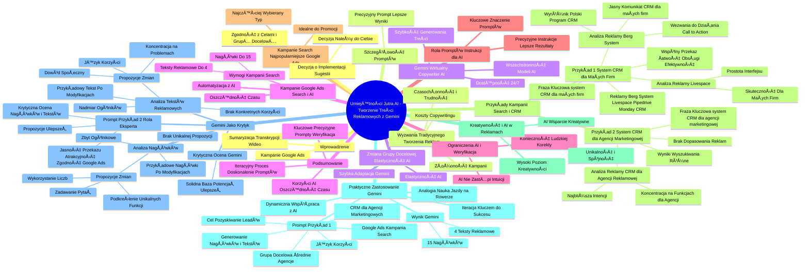

# Lekcje wideo - 3. Wykorzystanie AI do analizy wyników i optymalizacji kampanii performance

# 💡 Diagram

___

# ğŸ—’ï¸ Notatka

# Notatki i Sumaryzacja Transkrypcji Wideo: Umiejętności Jutra AI - Tworzenie Treści Reklamowych z Gemini

## Wprowadzenie

Niniejsze opracowanie skupia się na wykorzystaniu sztucznej inteligencji, a konkretnie modelu **Gemini**, w procesie tworzenia treści reklamowych, ze szczególnym uwzględnieniem kampanii **Google Ads**. Przedstawiono w nim wyzwania związane z tradycyjnym podejściem do tworzenia tekstów reklamowych oraz zademonstrowano, w jaki sposób AI może usprawnić ten proces, oszczędzając czas i zwiększając efektywność.

## Wyzwania w Tradycyjnym Tworzeniu Tekstów Reklamowych

- **Czasochłonność i trudność**: Stworzenie skutecznych tekstów reklamowych wymaga znacznego nakładu czasu, kreatywności i wiedzy z zakresu marketingu.
- **Złożoność zarządzania wieloma kampaniami**: Obsługa dużej liczby kampanii reklamowych i konieczność dostosowywania tekstów do każdej z nich bywa przytłaczająca.
- **Koszty copywritingu**: Regularne zlecanie tworzenia tekstów reklamowych copywriterom generuje dodatkowe wydatki.

## Gemini jako Wirtualny Copywriter AI

- **DostÄ™pność caÅ‚odobowa 24/7 🕰ï¸**: Gemini oferuje wsparcie w tworzeniu tekstów reklamowych o każdej porze.
- **Szybkość generowania treÅ›ci**: Model AI jest w stanie wygenerować kreatywne i przekonujÄ…ce treÅ›ci reklamowe w zaledwie kilka sekund â±ï¸.
- **Wszechstronność modeli AI**: Dostępne są różne modele AI wspomagające tworzenie treści, jednak to opracowanie koncentruje się na możliwościach modelu Gemini.

## Kampanie Google Ads typu Search i Rola AI

- **Wymogi kampanii Search**: Kampanie Google Ads w sieci wyszukiwania (search) wymagajÄ… zastosowania:
    - **Do 15 nagłówków** (maks. 30 znaków każdy)
    - **Do 4 tekstów reklamowych** (maks. 90 znaków każdy)
- **Automatyzacja z AI**: Gemini automatycznie dostosowuje proporcje tekstów i kontroluje liczbę znaków, zapewniając zgodność z wytycznymi Google.
- **Oszczędność czasu**: AI znacząco skraca czas potrzebny na dostosowanie tekstów do wymogów platformy.

## Ograniczenia AI i Istotność Weryfikacji

- **AI nie zastąpi intuicji i wiedzy eksperckiej**: Treści generowane przez AI stanowią punkt wyjścia, lecz wymagają weryfikacji przez człowieka.
- **Konieczność ludzkiej korekty**: Niezbędne jest dostosowanie i poprawienie tekstów AI, aby precyzyjnie odpowiadały założonym celom i potrzebom.

## Rola Promptów (Instrukcji) dla AI

- **Kluczowe znaczenie promptów**: Jakość i użyteczność wyników AI bezpośrednio zależą od precyzji i jasności sformułowanych poleceń (promptów).
- **Precyzyjne instrukcje = lepsze rezultaty**: Im bardziej szczegółowy i zrozumiały prompt, tym trafniejsze odpowiedzi generuje AI.

## Kampanie Search - Najpopularniejszy Typ Kampanii Google Ads

- **Kampanie Search**: To najczęściej wybierany typ kampanii w Google Ads.
- **Idealne do promocji**: Są idealne do promowania produktów lub usług cieszących się popytem, lub gdy użytkownicy aktywnie poszukują konkretnych rozwiązań.

## Przykłady Kampanii Search i Analiza Reklam CRM

### Przykład 1: "system CRM dla małych firm"

- **Fraza kluczowa**: "system CRM dla małych firm".
- **Wyniki wyszukiwania**: Reklamy systemów CRM, m.in. Berg System, Livespace, Pipedrive, Monday CRM.
- **Wspólny przekaz**: Åatwość obsÅ‚ugi i efektywność w zarzÄ…dzaniu relacjami z klientami.

#### Analiza Reklamy Berg System

- **Czynniki wyróżniające reklamę Berg System (pierwsza pozycja):**
    - **Jasny i zrozumiały komunikat**: "CRM dla małych firm".
    - **Wyróżnik "polski program CRM"**: Wzmacnia poczucie lokalnej dostępności i zaufania.
    - **Wezwania do działania (Call to Action)**: "Sprawdź cennik", "Przeczytaj Case Study", "Testuj bezpłatnie", "Zapytaj o wdrożenie" – angażują odbiorcę i zwiększają prawdopodobieństwo konwersji.

#### Analiza Reklamy Livespace

- **Skuteczność reklamy Livespace**: Podobnie, reklama kierowana do małych firm poszukujących CRM.
- **Dodatkowe atuty**: Prostota i intuicyjny interfejs systemu.

### Przykład 2: "system CRM dla agencji marketingowej"

- **Fraza kluczowa**: "system CRM dla agencji marketingowej".
- **Wyniki wyszukiwania**: Różnią się od tych dla małych firm.
- **Brak precyzyjnego dopasowania w reklamach**: Większość reklam nie zawiera frazy "dla agencji marketingowej" w nagłówku.
- **Potencjalne przyczyny**: Niedostateczne dostosowanie kampanii lub założenie, że ogólny przekaz CRM jest wystarczający.

#### Analiza Reklamy "CRM dla Agencji Reklamowej"

- **Najbliższa intencji**: Reklama "CRM dla Agencji Reklamowej" najlepiej odpowiada intencji wyszukiwania.
- **Koncentracja na funkcjach dla agencji**: Akcent na szybkie planowanie działań, elastyczność, generowanie ofert i faktur.

## Kreatywność w Tworzeniu Tekstów Reklamowych i Rola AI

- **Wysoki poziom kreatywności**: Niezbędny, zwłaszcza przy tworzeniu wielu wariantów tekstów dla różnych grup docelowych.
- **Unikalność i spójność**: Teksty powinny być unikalne dla każdej grupy docelowej, zachowując jednocześnie spójność z identyfikacją marki.
- **AI jako wsparcie kreatywne**: Gemini (i inne narzędzia AI) stanowią nieocenione wsparcie w generowaniu licznych propozycji tekstów.

## Praktyczne Zastosowanie Gemini - Generowanie Nagłówków i Tekstów Reklamowych

### Prompt dla Gemini (Przykład 1)

> Twoim zadaniem jest wygenerowanie 15 wariantów nagłówków reklamowych oraz 4 tekstów reklamowych promujących system CRM dedykowany agencjom marketingowym. Grupą docelową są średnie agencje (11-50 pracowników) obsługujące klientów zagranicznych.  Wykorzystaj język korzyści, koncentrując się na wartości, jaką CRM oferuje agencjom. Zadbaj o klarowny i zwięzły przekaz, dostosowany do specyfiki agencji marketingowych. Szczegóły kampanii: Platforma reklamowa: Google Ads, kampania Search. Cel: Pozyskiwanie leadów poprzez zachęcenie do skorzystania z darmowej wersji testowej. Nagłówki: Maksymalnie 30 znaków (ze spacjami). Użyj słów kluczowych: CRM dla NGO, organizacja non-profit, zarządzanie darczyńcami, relacje z wolontariuszami, testuj za darmo. Teksty reklamowe: Limit znaków: 90 (ze spacjami). Każdy wariant tekstu powinien charakteryzować się innym tonem: formalnym, przyjaznym, dynamicznym, profesjonalnym.

- **Wynik Gemini**: 15 propozycji nagłówków i 4 warianty tekstów reklamowych.
- **Iteracja kluczem do sukcesu**: Kolejne iteracje i udoskonalanie promptów prowadzą do lepszych rezultatów.
- **Dynamiczna współpraca z AI**: Ciągłe doskonalenie promptów i reagowanie na generowane wyniki.
- **Analogia do nauki jazdy na rowerze 🚲**: Nauka efektywnej współpracy z AI wymaga praktyki i ciągłego doskonalenia umiejętności.

## Gemini jako Krytyk - Analiza i Ulepszanie Tekstów

### Prompt dla Gemini (Przykład 2) - Rola Eksperta

> Wciel się w rolę eksperta Google Ads. Dokonaj krytycznej oceny zaproponowanych nagłówków i tekstów reklamowych. Zaproponuj zmiany, które mogą podnieść ich efektywność. Skup się na aspektach takich jak jasność przekazu, atrakcyjność dla odbiorcy oraz zgodność z najlepszymi praktykami reklam Google.

### Krytyczna Ocena Gemini i Propozycje Ulepszeń

- **Ogólna ocena**: Solidna baza, lecz zawsze istnieje potencjał do udoskonaleń.
- **Analiza Nagłówków**:
    - **Zbyt ogólnikowe**: Niektóre nagłówki są mało wyróżniające.
    - **Brak unikalnej propozycji wartości**: Nie podkreślają, co wyróżnia dany CRM na tle konkurencji.
    - **Propozycje zmian**:
        - **Wykorzystanie liczb**: Dodaje wiarygodności (np. "2x szybsza obsługa klientów").
        - **Podkreślenie unikalnych funkcji**: Eksponowanie specyficznych cech (np. "CRM z wbudowaną analityką").
        - **Zadawanie pytań**: Angażuje użytkownika (np. "Masz trudności z obsługą klientów zagranicznych?").
    - **Przykładowe nagłówki po modyfikacjach**:
        - "Zwiększ zyski o 20% dzięki automatyzacji CRM."
        - "CRM dla agencji: Globalni klienci, lokalne wsparcie."
        - "Testuj za darmo: CRM, który rozumie Twoją agencję."
- **Analiza Tekstów Reklamowych**:
    - **Brak konkretnych korzyści**: Korzyści mogłyby być bardziej szczegółowe i wymierne.
    - **Nadmiar ogólników**: Określenia typu "kompleksowe rozwiązanie" są mało przekonujące.
    - **Propozycje zmian**:
        - **Koncentracja na konkretnych problemach**: Odniesienie do realnych wyzwań agencji (np. "Zredukuj koszty obsługi klienta o 40%").
        - **Język korzyści**: Akcentowanie korzyści, nie tylko funkcji.
        - **Dodanie dowodu społecznego**: Wzmocnienie przekazu (np. "Dołącz do tysięcy agencji...").
    - **Przykładowy tekst po modyfikacjach**:
        - Nagłówek: "Zwiększ zyski o 20% dzięki automatyzacji CRM."
        - Tekst: "Masz dość ręcznego wprowadzania danych i żmudnego śledzenia projektów? Nasz CRM automatyzuje powtarzalne zadania, generuje profesjonalne raporty i integruje się z Twoimi ulubionymi narzędziami. Wypróbuj za darmo i przekonaj się, jak łatwo możesz zarządzać swoimi międzynarodowymi klientami."

## Decyzja o Implementacji Sugestii i Dostosowanie do Celów

- **Decyzja należy do Ciebie**: Ostateczna decyzja o wdrożeniu sugestii Gemini i dalszym kierunku pracy nad tekstami należy do użytkownika.
- **Zgodność z celami i grupą docelową**: Wybór propozycji powinien być podyktowany ich adekwatnością do celów kampanii i zdolnością do przyciągnięcia uwagi docelowych odbiorców.

## Szczegółowość Promptów - Recepta na Lepsze Wyniki

- **Im bardziej precyzyjny prompt, tym lepsze rezultaty**: Dokładne określenie oczekiwań i dostarczenie kontekstu to klucz do efektywnej współpracy z AI.

## Zmiana Grupy Docelowej i Elastyczność AI

- **Szybka adaptacja Gemini**: Model AI sprawnie dostosowuje się do zmian grupy docelowej i modyfikacji promptów.
- **Elastyczność AI**: Umożliwia łatwe i szybkie dopasowanie treści reklamowych do różnorodnych segmentów odbiorców.

## Podsumowanie

Wykorzystanie AI, takiego jak Gemini, w procesie tworzenia treÅ›ci reklamowych przynosi wymierne korzyÅ›ci, w tym oszczÄ™dność czasu â±ï¸, generowanie wielu wariantów tekstów i możliwość szybkiego dostosowania do różnych grup docelowych. Kluczowe jest jednak precyzyjne formuÅ‚owanie promptów i weryfikacja wyników generowanych przez AI, aby zapewnić ich skuteczność i zgodność z zaÅ‚ożonymi celami marketingowymi. Współpraca z AI to proces iteracyjny, który poprzez ciÄ…gÅ‚e doskonalenie promptów i analizÄ™ efektów, prowadzi do coraz lepszych rezultatów w tworzeniu efektywnych kampanii reklamowych.

___

# 🔉 Transcript
File: Lekcje wideo - 3. Wykorzystanie AI do analizy wyników i optymalizacji kampanii performance.mp4 
[00:00:01] Ekran: (Na białym tle pojawia się napis "Umiejętności Jutra AI" w kolorze czarnym i fioletowo-niebieskim. Poniżej napisu widnieją loga "Google" i "SGH".)
[00:00:05] Patrycja Kaczor: Tworzenie tekstów do reklam może być czasochłonne i trudne.
[00:00:05] Ekran: (Po prawej stronie ekranu pojawia się napis "Tworzenie treści do kampanii performance marketing".)
[00:00:10] Patrycja Kaczor: Wymaga zarówno kreatywności, jak i znajomości zasad, a przy dużej liczbie kampanii łatwo można się zagubić.
[00:00:19] Patrycja Kaczor: Zatrudnienie copywritera to dodatkowy koszt.
[00:00:23] Patrycja Kaczor: I w wielu przypadkach, jeśli potrzebujemy tekstów regularnie, jest to dość kosztowne rozwiązanie.
[00:00:30] Patrycja Kaczor: Wyobraźcie sobie jednak, że macie osobistego copywritera, dostępnego 24 godziny na dobę, który w kilka sekund generuje kreatywne i przekonujące treści reklamowe.
[00:00:45] Patrycja Kaczor: Brzmi jak marzenie?
[00:00:47] Patrycja Kaczor: Dzięki Gemini to marzenie staje się rzeczywistością.
[00:00:51] Patrycja Kaczor: Możemy też korzystać z innych modeli AI, które wspierają tworzenie treści reklamowych.
[00:00:58] Patrycja Kaczor: Jednak w tej lekcji skupimy siÄ™ tylko na Gemini.
[00:01:02] Patrycja Kaczor: Napisanie kilkunastu nagłówków lub treści do reklam to jedno, ale gdy kampanii jest dużo i zależy nam na personalizacji, to zadanie staje się znacznie bardziej wymagające.
[00:01:14] Patrycja Kaczor: Do tego dochodzÄ… zasady ustalane przez Google.
[00:01:18] Patrycja Kaczor: Dla kampanii typu search, czyli kampanii w wyszukiwarce, najlepiej, aby każdy zestaw reklam zawierał aż 15 nagłówków po maksymalnie 30 znaków oraz cztery warianty tekstów reklamowych z limitem do 90 znaków każdy.
[00:01:35] Patrycja Kaczor: Nie ma takiej potrzeby, aby człowiek ręcznie liczył znaki i dopasowywał treści.
[00:01:42] Patrycja Kaczor: AI zrobi to za nas.
[00:01:44] Patrycja Kaczor: Gemini może automatycznie dostosować proporcje tekstów, tak aby spełniały wytyczne Google, co oszczędza mnóstwo czasu.
[00:01:55] Patrycja Kaczor: Warto na początku podkreślić, że chociaż AI może wygenerować różnorodne treści, nie zastąpi w pełni naszej intuicji i wiedzy branżowej.
[00:02:06] Patrycja Kaczor: Nadal potrzebna jest nasza weryfikacja i poprawki, aby te treści były precyzyjnie dopasowane do naszych potrzeb i celów.
[00:02:17] Patrycja Kaczor: Nie można również pominąć roli promptów, czyli instrukcji, które przekazujemy AI.
[00:02:23] Patrycja Kaczor: To jak precyzyjnie i jasno sformułujemy nasze polecenia, bezpośrednio wpływa na jakość i użyteczność otrzymanych wyników.
[00:02:32] Patrycja Kaczor: W tej lekcji skupimy się na kampanii typu search, najczęściej stosowanym typie kampanii w Google Ads.
[00:02:38] Patrycja Kaczor: Idealnym do promocji produktów lub usług, na które jest już wysokie zapotrzebowanie lub gdy użytkownicy aktywnie poszukują rozwiązań w danej kategorii.
[00:02:50] Ekran: (Na ekranie wyświetla się strona wyszukiwarki Google z wynikami wyszukiwania dla frazy "system CRM dla małych firm". Wyniki wyszukiwania zawierają reklamy sponsorowane różnych firm oferujących systemy CRM.)
[00:02:50] Patrycja Kaczor: Spójrzmy na przykład.
[00:02:51] Patrycja Kaczor: W wyszukiwarce, po wpisaniu frazy "system CRM dla małych firm", otrzymujemy różne wyniki, które prezentują oferty systemów CRM.
[00:03:01] Patrycja Kaczor: Wśród nich znajdują się takie programy jak Berg System, Livespace, Pipedrive oraz CRM od Monday.
[00:03:09] Patrycja Kaczor: Wszystkie te programy reklamują się jako łatwe w użyciu i efektywne w zarządzaniu relacjami z klientami, co może być cenne dla małych przedsiębiorstw poszukujących narzędzi do usprawnienia swoich działań.
[00:03:22] Patrycja Kaczor: Która reklama najbardziej przyciągnie uwagę właściciela małej firmy?
[00:03:27] Patrycja Kaczor: W pierwszej kolejności ta, która wyświetli się na samej górze, ale do tego przejdziemy później.
[00:03:33] Patrycja Kaczor: Jeśli chodzi o tekst reklamy, to to, co wydaje się najbardziej atrakcyjne, będzie subiektywne.
[00:03:40] Patrycja Kaczor: Jednak patrząc na typowe potrzeby małych firm, reklama "CRM dla małych firm - Nowoczesny system CRM" może być najbardziej odpowiednia.
[00:03:49] Patrycja Kaczor: Reklama od firmy Berg System wyświetla się jako pierwsza.
[00:03:53] Patrycja Kaczor: Spójrzmy na to, co ją wyróżnia.
[00:03:55] Ekran: (Na ekranie powiększa się reklama firmy Berg System, która wyświetla się na samej górze wyników wyszukiwania.)
[00:03:55] Patrycja Kaczor: Jasne i zrozumiałe przesłanie.
[00:03:59] Patrycja Kaczor: Reklama od razu informuje, że narzędzie jest skierowane do małych firm, co sprawia, że użytkownik szybko rozumie, czy oferta jest dla niego.
[00:04:08] Patrycja Kaczor: Wyróżniki.
[00:04:09] Patrycja Kaczor: Reklama podkreśla, że jest to polski program CRM, co może być istotnym czynnikiem dla właścicieli małych firm w Polsce.
[00:04:18] Patrycja Kaczor: Taki komunikat buduje poczucie lokalnej dostępności.
[00:04:23] Patrycja Kaczor: W następnej kolejności zachęta do działania.
[00:04:27] Patrycja Kaczor: Reklama zawiera wyraźne wezwanie do działania.
[00:04:30] Patrycja Kaczor: Przykładowo: "Sprawdź cennik", "Przeczytaj Case Study", "Testuj bezpłatnie" czy "Zapytaj o wdrożenie".
[00:04:38] Patrycja Kaczor: Takie komunikaty angażują odbiorcę i zachęcają go do podjęcia kolejnych kroków, co zwiększa szansę na konwersję.
[00:04:47] Patrycja Kaczor: Druga reklama firmy Livespace również skutecznie wskazuje, że jej CRM przeznaczony jest dla małych firm, co doskonale odpowiada intencji zawartej w wyszukiwanej frazie.
[00:05:01] Patrycja Kaczor: Reklama podkreśla dodatkowo prostotę i przyjazny interfejs systemu, co może być kluczowym atutem dla małych przedsiębiorstw szukających intuicyjnych narzędzi do zarządzania relacjami z klientami.
[00:05:14] Patrycja Kaczor: Przejdźmy teraz do kolejnego przykładu.
[00:05:17] Ekran: (Na ekranie wyświetla się strona wyszukiwarki Google z wynikami wyszukiwania dla frazy "system CRM dla agencji marketingowej". Wyniki wyszukiwania zawierają reklamy sponsorowane różnych firm oferujących systemy CRM.)
[00:05:17] Patrycja Kaczor: Tym razem w wyszukiwarce wpisujemy frazÄ™ "system CRM dla agencji marketingowych".
[00:05:23] Patrycja Kaczor: W tym przypadku wyniki wyszukiwania są zupełnie inne niż wcześniej.
[00:05:29] Patrycja Kaczor: Oprócz wyników organicznych, które odpowiadają frazie "system CRM dla agencji marketingowych", żadna z reklam nie zawiera tego hasła w nagłówku.
[00:05:40] Patrycja Kaczor: Może to sugerować, że reklamodawcy nie dostosowali swoich kampanii do tej grupy docelowej lub uznali, że przekaz CRM jest wystarczający, aby przyciągnąć uwagę potencjalnych klientów z agencji marketingowej.
[00:05:55] Patrycja Kaczor: Najbliższa intencji w wpisywanej wyszukiwarce jest reklama "CRM dla Agencji Reklamowej", która koncentruje się na kluczowych funkcjach przydatnych dla agencji, takich jak szybkie planowanie działań, elastyczność czy możliwość generowania ofert i faktur.
[00:06:13] Patrycja Kaczor: Tworzenie tekstów reklamowych często wymaga dużej dawki kreatywności.
[00:06:18] Patrycja Kaczor: Szczególnie gdy chodzi o przygotowanie wielu wariantów dostosowanych do różnych grup docelowych.
[00:06:25] Patrycja Kaczor: W kampaniach, które obejmują różne segmenty odbiorców, każdy tekst musi być na tyle unikalny, by przyciągnąć uwagę konkretnej grupy docelowej, jednocześnie zachowując spójność z przekazem marki.
[00:06:40] Patrycja Kaczor: Przy takim nakładzie pracy kreatywnej AI staje się nieocenionym wsparciem, pozwalającym generować wiele propozycji tekstów reklamowych.
[00:06:50] Patrycja Kaczor: Warto na ekranie pojawia się napis "Gemini Advanced" i tekst: "Twoim zadaniem jest napisanie 15 wariantów nagłówków reklam promujących CRM dedykowany agencjom marketingowym oraz 4 nagłówki. Grupa docelowa są średnie agencje (11-50 osób), które obsługują klientów zagranicznych. Użyj języka korzyści, skupiając się na tym, co CRM oferuje agencjom. Zadbaj o klarowny i zwięzły przekaz. Dostosuj język do specyfiki grupy docelowej (agencje marketingowe). Szczegóły kampanii: Platforma reklamowa: Google Ads kampania Search. Cel: Generowanie leadów poprzez zachęcenie do skorzystania z darmowej wersji testowej. Nagłówki: Maksymalnie 30 znaków (w tym spacje). Użyj słów kluczowych: CRM dla NGO, organizacja non-profit, zarządzanie darczyńcami, relacje z wolontariuszami, testuj za darmo. Teksty reklamowe: Limit znaków: 90 (w tym spacje). Każdy wariant tekstu powinien mieć inny ton: formalny, przyjazny, dynamiczny, profesjonalny."
[00:06:50] Ekran: (Po lewej stronie ekranu widoczna jest Patrycja Kaczor, a po prawej stronie pojawia się białe tło z tekstem dotyczącym tworzenia nagłówków reklamowych.)
[00:07:01] Patrycja Kaczor: Spójrzmy teraz na wyniki.
[00:07:09] Ekran: (Na ekranie pojawia się lista 15 wariantów nagłówków reklamowych, które wygenerował Gemini.)
[00:07:09] Patrycja Kaczor: Mamy gotowe 15 propozycji nagłówków i cztery warianty tekstów reklamowych.
[00:07:15] Patrycja Kaczor: Z doświadczenia wiem, że im więcej iteracji wykonamy, tym lepszy efekt osiągniemy.
[00:07:21] Patrycja Kaczor: AI może dostarczać coraz trafniejsze odpowiedzi, ale wymaga to od nas ciągłej pracy nad precyzyjnym sformułowaniem zapytań oraz reagowania na wyniki, aby cały czas ten proces udoskonalać.
[00:07:35] Patrycja Kaczor: Lubię myśleć o współpracy z AI jak o dynamicznym procesie, który możemy ciągle doskonalić.
[00:07:40] Patrycja Kaczor: TrochÄ™ tak jak jazda na rowerze.
[00:07:43] Patrycja Kaczor: Na początku może być trudno utrzymać równowagę, ale z czasem stajesz się coraz lepszy, jedziesz coraz szybciej i pewniej.
[00:07:53] Patrycja Kaczor: Podobnie jest ze sztucznÄ… inteligencjÄ….
[00:07:56] Patrycja Kaczor: Im więcej z nią pracujesz, tym lepiej rozumiesz, w jaki sposób ona działa i efektywniej ją wykorzystujesz.
[00:08:01] Patrycja Kaczor: Zmieńmy teraz Gemini w krytyka, który przyjrzy się zaproponowanym nagłówkom i tekstom reklamowym.
[00:08:10] Ekran: (Na ekranie pojawia się tekst: "Jesteś ekspertem od Google Ads. Poddaj krytycznie do zaproponowanych nagłówków i tekstów reklam. Zaproponuj zmiany, które mogą zwiększyć ich efektywność. Skup się na elementach takich jak jasność przekazu, atrakcyjność dla odbiorcy, a także zgodność z najlepszymi praktykami w reklamach Google.")
[00:08:10] Patrycja Kaczor: Ma je dokładnie przeanalizować i odpowiedzieć nam, co jest dobre, a co można poprawić.
[00:08:16] Patrycja Kaczor: Poprośmy Gemini, żeby zwróciło uwagę na jasność przekazu, atrakcyjność dla odbiorcy oraz zgodność z najlepszymi praktykami Google Ads.
[00:08:27] Ekran: (Na ekranie pojawia się tekst: "Krytyczna ocena i propozycje zmian: Świetny początek! Zaproponowane przez Ciebie nagłówki i teksty reklamowe są solidną podstawą dla kampanii Google Ads. Zawierają kluczowe słowa kluczowe, podkreślają korzyści dla klienta i zachęcają do działania. Jednak zawsze jest miejsce na udoskonalenia. Analiza i propozycje zmian: Nagłówki: Zbyt ogólne: Niektóre nagłówki (np. "CRM dla agencji: Automatyzuj, integruj, skaluj.") są zbyt ogólne i mogą nie wyróżniać się na tle konkurencji. Brak unikalnej propozycji: Brakuje wyraźnego podkreślenia, czym Twój CRM różni się od innych rozwiązań na rynku. Propozycje: Użyj liczb: Użyj "2x szybsza obsługa klientów dzięki CRM" lub "Zwiększ efektywność o 30%". Liczby dodają wiarygodności i przyciągają uwagę. Podkreśl unikalną funkcjonalność: "CRM z wbudowaną analityką dla kampanii międzynarodowych" lub "Jedyna platforma, która łączy CRM z narzędziami do zarządzania projektami". Zapytaj: "Zmagasz się z obsługą klientów zagranicznych? Mamy rozwiązanie!" - pytania angażują użytkownika. Przykładowe nagłówki po zmianach: Zwiększ zyski o 20% dzięki automatyzacji w CRM. CRM dla agencji: Globalni klienci, lokalne wsparcie. Testuj za darmo: CRM, który rozumie Twoją agencję. Teksty reklamowe: Brak konkretnych korzyści: Chociaż wymienione są korzyści, mogłyby być bardziej szczegółowe i skoncentrowane na konkretnych problemach agencji. Zbyt dużo ogólników: Słowa jak "kompleksowe rozwiązanie" czy "łatwiejsza obsługa" są zbyt ogólne i nie przemawiają do konkretnych potrzeb klienta. Propozycje: Skup się na konkretnych problemach: "Zmniejsz koszty obsługi klienta o 40% dzięki automatyzacji fakturowania." lub "Zarządzaj projektami międzynarodowymi bez stresu dzięki centralnej bazie danych klientów." Używaj języka korzyści: Zamiast mówić o funkcjach, mów o tym, co klient zyska dzięki nim. Dodaj elementy społecznego dowodu: "Połącz się z tysiącami agencji, które już zaufały naszemu CRM." Przykładowy tekst po zmianach: Nagłówek: Zwiększ zyski o 20% dzięki automatyzacji w CRM. Tekst: Masz dość ręcznego wprowadzania danych i śledzenia projektów? Nasz CRM automatyzuje powtarzalne zadania, generuje profesjonalne raporty i integruje się z Twoimi ulubionymi narzędziami. Wypróbuj za darmo i zobacz, jak łatwo możesz zarządzać swoimi międzynarodowymi klientami.")
[00:08:27] Patrycja Kaczor: Gemini świetnie poradził sobie ze wskazaniem słabych stron naszych tekstów i podał propozycje zmian zarówno dla nagłówków i tekstów reklamowych.
[00:08:40] Patrycja Kaczor: Teraz to do nas należy decyzja, czy zastosujemy te sugestie, czy będziemy dalej pracować nad tekstami.
[00:08:49] Patrycja Kaczor: Warto teraz zastanowić się też, które z tych propozycji są najbardziej zgodne z naszymi celami i które mogą rzeczywiście przyciągnąć uwagę naszej grupy docelowej.
[00:09:54] Patrycja Kaczor: Im bardziej szczegółowy będzie prompt, tym lepsze wyniki otrzymamy.
[01:00:00] Patrycja Kaczor: Bardzo ważne jest precyzyjne określenie, czego oczekujemy i dostarczenie AI wystarczającej ilości kontekstu.
[01:00:07] Patrycja Kaczor: W tym zadaniu jest napisanie 15 wariantów nagłówków reklam promujących CRM dedykowany agencjom marketingowym oraz 4 nagłówki. Grupa docelowa są średnie agencje (11-50 osób), które obsługują klientów zagranicznych. Użyj języka korzyści, skupiając się na tym, co CRM oferuje agencjom. Zadbaj o klarowny i zwięzły przekaz. Dostosuj język do specyfiki grupy docelowej (agencje marketingowe). Szczegóły kampanii: Platforma reklamowa: Google Ads kampania Search. Cel: Generowanie leadów poprzez zachęcenie do skorzystania z darmowej wersji testowej. Nagłówki: Maksymalnie 30 znaków (w tym spacje). Użyj słów kluczowych: CRM dla NGO, organizacja non-profit, zarządzanie darczyńcami, relacje z wolontariuszami, testuj za darmo. Teksty reklamowe: Limit znaków: 90 (w tym spacje). Każdy wariant tekstu powinien mieć inny ton: formalny, przyjazny, dynamiczny, profesjonalny.
[01:00:07] Ekran: (Po lewej stronie ekranu widoczna jest Patrycja Kaczor, a po prawej stronie pojawia się białe tło z tekstem dotyczącym tworzenia nagłówków reklamowych.)
[01:00:10] Patrycja Kaczor: Zobaczmy teraz, jak szybko Gemini poradzi sobie ze zmianą grupy docelowej i dostosowaniem nagłówków oraz tekstów reklamowych do tych nowych odbiorców.
[01:00:10] Ekran: (Po lewej stronie ekranu widoczna jest Patrycja Kaczor, a po prawej stronie pojawia się białe tło z tekstem dotyczącym tworzenia nagłówków reklamowych.)
[01:00:10] Ekran: (Po lewej stronie ekranu widoczna jest Patrycja Kaczor, a po prawej stronie pojawia się białe tło z tekstem dotyczącym tworzenia nagłówków reklamowych.)
[01:00:10] Ekran: (Po lewej stronie ekranu widoczna jest Patrycja Kaczor, a po prawej stronie pojawia się białe tło z tekstem dotyczącym tworzenia nagłówków reklamowych.)
[01:00:10] Ekran: (Po lewej stronie ekranu widoczna jest Patrycja Kaczor, a po prawej stronie pojawia się białe tło z tekstem dotyczącym tworzenia nagłówków reklamowych.)
[01:00:10] Ekran: (Po lewej stronie ekranu widoczna jest Patrycja Kaczor, a po prawej stronie pojawia się białe tło z tekstem dotyczącym tworzenia nagłówków reklamowych.)
[01:00:10] Ekran: (Po lewej stronie ekranu widoczna jest Patrycja Kaczor, a po prawej stronie pojawia się białe tło z tekstem dotyczącym tworzenia nagłówków reklamowych.)
[01:00:10] Ekran: (Po lewej stronie ekranu widoczna jest Patrycja Kaczor, a po prawej stronie pojawia się białe tło z tekstem dotyczącym tworzenia nagłówków reklamowych.)
[01:00:10] Ekran: (Po lewej stronie ekranu widoczna jest Patrycja Kaczor, a po prawej stronie pojawia się białe tło z tekstem dotyczącym tworzenia nagłówków reklamowych.)
[01:00:10] Ekran: (Po lewej stronie ekranu widoczna jest Patrycja Kaczor, a po prawej stronie pojawia się białe tło z tekstem dotyczącym tworzenia nagłówków reklamowych.)
[01:00:10] Ekran: (Po lewej stronie ekranu widoczna jest Patrycja Kaczor, a po prawej stronie pojawia się białe tło z tekstem dotyczącym tworzenia nagłówków reklamowych.)
[01:00:10] Ekran: (Po lewej stronie ekranu widoczna jest Patrycja Kaczor, a po prawej stronie pojawia się białe tło z tekstem dotyczącym tworzenia nagłówków reklamowych.)
[01:00:10] Ekran: (Po lewej stronie ekranu widoczna jest Patrycja Kaczor, a po prawej stronie pojawia się białe tło z tekstem dotyczącym tworzenia nagłówków reklamowych.)
[01:00:10] Ekran: (Po lewej stronie ekranu widoczna jest Patrycja Kaczor, a po prawej stronie pojawia się białe tło z tekstem dotyczącym tworzenia nagłówków reklamowych.)
[01:00:10] Ekran: (Po lewej stronie ekranu widoczna jest Patrycja Kaczor, a po prawej stronie pojawia się białe tło z tekstem dotyczącym tworzenia nagłówków reklamowych.)
[01:00:10] Ekran: (Po lewej stronie ekranu widoczna jest Patrycja Kaczor, a po prawej stronie pojawia się białe tło z tekstem dotyczącym tworzenia nagłówków reklamowych.)
[01:00:10] Ekran: (Po lewej stronie ekranu widoczna jest Patrycja Kaczor, a po prawej stronie pojawia się białe tło z tekstem dotyczącym tworzenia nagłówków reklamowych.)
[01:00:10] Ekran: (Po lewej stronie ekranu widoczna jest Patrycja Kaczor, a po prawej stronie pojawia się białe tło z tekstem dotyczącym tworzenia nagłówków reklamowych.)
[01:00:10] Ekran: (Po lewej stronie ekranu widoczna jest Patrycja Kaczor, a po prawej stronie pojawia się białe tło z tekstem dotyczącym tworzenia nagłówków reklamowych.)
[01:00:10] Ekran: (Po lewej stronie ekranu widoczna jest Patrycja Kaczor, a po prawej stronie pojawia się białe tło z tekstem dotyczącym tworzenia nagłówków reklamowych.)
[01:00:10] Ekran: (Po lewej stronie ekranu widoczna jest Patrycja Kaczor, a po prawej stronie pojawia się białe tło z tekstem dotyczącym tworzenia nagłówków reklamowych.)
[01:00:10] Ekran: (Po lewej stronie ekranu widoczna jest Patrycja Kaczor, a po prawej stronie pojawia się białe tło z tekstem dotyczącym tworzenia nagłówków reklamowych.)
[01:00:10] Ekran: (Po lewej stronie ekranu widoczna jest Patrycja Kaczor, a po prawej stronie pojawia się białe tło z tekstem dotyczącym tworzenia nagłówków reklamowych.)
[01:00:10] Ekran: (Po lewej stronie ekranu widoczna jest Patrycja Kaczor, a po prawej stronie pojawia się białe tło z tekstem dotyczącym tworzenia nagłówków reklamowych.)
[01:00:10] Ekran: (Po lewej stronie ekranu widoczna jest Patrycja Kaczor, a po prawej stronie pojawia się białe tło z tekstem dotyczącym tworzenia nagłówków reklamowych.)
[01:00:10] Ekran: (Po lewej stronie ekranu widoczna jest Patrycja Kaczor, a po prawej stronie pojawia się białe tło z tekstem dotyczącym tworzenia nagłówków reklamowych.)
[01:00:10] Ekran: (Po lewej stronie ekranu widoczna jest Patrycja Kaczor, a po prawej stronie pojawia się białe tło z tekstem dotyczącym tworzenia nagłówków reklamowych.)
[01:00:10] Ekran: (Po lewej stronie ekranu widoczna jest Patrycja Kaczor, a po prawej stronie pojawia się białe tło z tekstem dotyczącym tworzenia nagłówków reklamowych.)
[01:00:10] Ekran: (Po lewej stronie ekranu widoczna jest Patrycja Kaczor, a po prawej stronie pojawia się białe tło z tekstem dotyczącym tworzenia nagłówków reklamowych.)
[01:00:10] Ekran: (Po lewej stronie ekranu widoczna jest Patrycja Kaczor, a po prawej stronie pojawia się białe tło z tekstem dotyczącym tworzenia nagłówków reklamowych.)
[01:00:10] Ekran: (Po lewej stronie ekranu widoczna jest Patrycja Kaczor, a po prawej stronie pojawia się białe tło z tekstem dotyczącym tworzenia nagłówków reklamowych.)
[01:00:10] Ekran: (Po lewej stronie ekranu widoczna jest Patrycja Kaczor, a po prawej stronie pojawia się białe tło z tekstem dotyczącym tworzenia nagłówków reklamowych.)
[01:00:10] Ekran: (Po lewej stronie ekranu widoczna jest Patrycja Kaczor, a po prawej stronie pojawia się białe tło z tekstem dotyczącym tworzenia nagłówków reklamowych.)
[01:00:10] Ekran: (Po lewej stronie ekranu widoczna jest Patrycja Kaczor, a po prawej stronie pojawia się białe tło z tekstem dotyczącym tworzenia nagłówków reklamowych.)
[01:00:10] Ekran: (Po lewej stronie ekranu widoczna jest Patrycja Kaczor, a po prawej stronie pojawia się białe tło z tekstem dotyczącym tworzenia nagłówków reklamowych.)
[01:00:10] Ekran: (Po lewej stronie ekranu widoczna jest Patrycja Kaczor, a po prawej stronie pojawia się białe tło z tekstem dotyczącym tworzenia nagłówków reklamowych.)
[01:00:10] Ekran: (Po lewej stronie ekranu widoczna jest Patrycja Kaczor, a po prawej stronie pojawia się białe tło z tekstem dotyczącym tworzenia nagłówków reklamowych.)
[01:00:10] Ekran: (Po lewej stronie ekranu widoczna jest Patrycja Kaczor, a po prawej stronie pojawia się białe tło z tekstem dotyczącym tworzenia nagłówków reklamowych.)
[01:00:10] Ekran: (Po lewej stronie ekranu widoczna jest Patrycja Kaczor, a po prawej stronie pojawia się białe tło z tekstem dotyczącym tworzenia nagłówków reklamowych.)
[01:00:10] Ekran: (Po lewej stronie ekranu widoczna jest Patrycja Kaczor, a po prawej stronie pojawia się białe tło z tekstem dotyczącym tworzenia nagłówków reklamowych.)
[01:00:10] Ekran: (Po lewej stronie ekranu widoczna jest Patrycja Kaczor, a po prawej stronie pojawia się białe tło z tekstem dotyczącym tworzenia nagłówków reklamowych.)
[01:00:10] Ekran: (Po lewej stronie ekranu widoczna jest Patrycja Kaczor, a po prawej stronie pojawia się białe tło z tekstem dotyczącym tworzenia nagłówków reklamowych.)
[01:00:10] Ekran: (Po lewej stronie ekranu widoczna jest Patrycja Kaczor, a po prawej stronie pojawia się białe tło z tekstem dotyczącym tworzenia nagłówków reklamowych.)
[01:00:10] Ekran: (Po lewej stronie ekranu widoczna jest Patrycja Kaczor, a po prawej stronie pojawia się białe tło z tekstem dotyczącym tworzenia nagłówków reklamowych.)
[01:00:10] Ekran: (Po lewej stronie ekranu widoczna jest Patrycja Kaczor, a po prawej stronie pojawia się białe tło z tekstem dotyczącym tworzenia nagłówków reklamowych.)
[01:00:10] Ekran: (Po lewej stronie ekranu widoczna jest Patrycja Kaczor, a po prawej stronie pojawia się białe tło z tekstem dotyczącym tworzenia nagłówków reklamowych.)
[01:00:10] Ekran: (Po lewej stronie ekranu widoczna jest Patrycja Kaczor, a po prawej stronie pojawia się białe tło z tekstem dotyczącym tworzenia nagłówków reklamowych.)
[01:00:10] Ekran: (Po lewej stronie ekranu widoczna jest Patrycja Kaczor, a po prawej stronie pojawia się białe tło z tekstem dotyczącym tworzenia nagłówków reklamowych.)
[01:00:10] Ekran: (Po lewej stronie ekranu widoczna jest Patrycja Kaczor, a po prawej stronie pojawia się białe tło z tekstem dotyczącym tworzenia nagłówków reklamowych.)
[01:00:10] Ekran: (Po lewej stronie ekranu widoczna jest Patrycja Kaczor, a po prawej stronie pojawia się białe tło z tekstem dotyczącym tworzenia nagłówków reklamowych.)
[01:00:10] Ekran: (Po lewej stronie ekranu widoczna jest Patrycja Kaczor, a po prawej stronie pojawia się białe tło z tekstem dotyczącym tworzenia nagłówków reklamowych.)
[01:00:10] Ekran: (Po lewej stronie ekranu widoczna jest Patrycja Kaczor, a po prawej stronie pojawia się białe tło z tekstem dotyczącym tworzenia nagłówków reklamowych.)
[01:00:10] Ekran: (Po lewej stronie ekranu widoczna jest Patrycja Kaczor, a po prawej stronie pojawia się białe tło z tekstem dotyczącym tworzenia nagłówków reklamowych.)
[01:00:10] Ekran: (Po lewej stronie ekranu widoczna jest Patrycja Kaczor, a po prawej stronie pojawia się białe tło z tekstem dotyczącym tworzenia nagłówków reklamowych.)
[01:00:10] Ekran: (Po lewej stronie ekranu widoczna jest Patrycja Kaczor, a po prawej stronie pojawia się białe tło z tekstem dotyczącym tworzenia nagłówków reklamowych.)
[01:00:10] Ekran: (Po lewej stronie ekranu widoczna jest Patrycja Kaczor, a po prawej stronie pojawia się białe tło z tekstem dotyczącym tworzenia nagłówków reklamowych.)
[01:00:10] Ekran: (Po lewej stronie ekranu widoczna jest Patrycja Kaczor, a po prawej stronie pojawia się białe tło z tekstem dotyczącym tworzenia nagłówków reklamowych.)

___
# ğŸ·ï¸ Tags
#AI #sztuczna_inteligencja #Gemini #Google_Ads #kampanie_reklamowe #performance_marketing #copywriting #wirtualny_copywriter #kampanie_search #sieć_wyszukiwania #nagłówki_reklamowe #teksty_reklamowe #automatyzacja #oszczędność_czasu #intuicja #wiedza_ekspercka #weryfikacja #prompt #instrukcje #fraza_kluczowa #system_CRM #małe_firmy #agencja_marketingowa #kreatywność #grupa_docelowa #język_korzyści #iteracja #ulepszanie_tekstów #ekspert_Google_Ads #jasność_przekazu #atrakcyjność_dla_odbiorcy #najlepsze_praktyki_Google #unikalna_propozycja_wartości #liczby #wiarygodność #funkcjonalność #zaangażowanie_użytkownika #konkretne_korzyści #język_korzyści #dowód_społeczny #cele_kampanii #szczegółowość_promptów #elastyczność_AI #adaptacja_AI #zarządzanie_relacjami_z_klientami #CRM_dla_małych_firm #CRM_dla_agencji_marketingowej #polski_program_CRM #wezwanie_do_działania #call_to_action #testuj_bezpłatnie #zarządzanie_darczyńcami #relacje_z_wolontariuszami #organizacja_non_profit #CRM_dla_NGO #personalizacja_reklam #skuteczne_reklamy #efektywne_kampanie_reklamowe #umiejętności_jutra_AI
