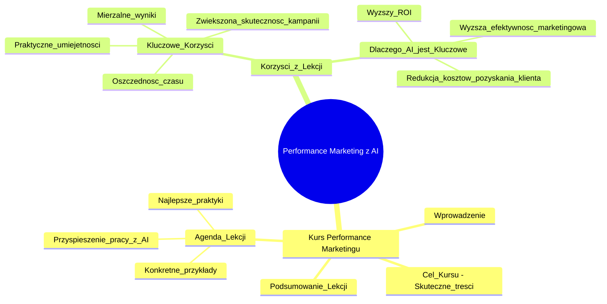

# Lekcje wideo - 4. Tworzenie treści do landing pages

# 💡 Diagram

___

# 🗒️ Notatka

# Notatki i Podsumowanie Lekcji: Performance Marketing z AI 🤖

## Wprowadzenie do Kursu Performance Marketingu

Ta lekcja stanowi wprowadzenie do kursu **Performance Marketingu**.  Jej głównym celem jest nauczenie Cię, jak tworzyć **skuteczne treści** reklamowe. Co więcej, kurs pokazuje, w jaki sposób wykorzystać **sztuczną inteligencję (AI)**, aby usprawnić i przyspieszyć ten proces.

### Kluczowe Korzyści z Lekcji

- **Oszczędność czasu 🕰️:** Nauczysz się tworzyć teksty z pomocą AI, co znacząco przyspieszy Twoją pracę.
- **Zwiększona skuteczność kampanii:** Dzięki wsparciu AI, Twoje treści staną się bardziej angażujące i efektywne.
- **Praktyczne umiejętności:** Zdobędziesz konkretne umiejętności tworzenia treści, które od razu możesz wdrożyć i testować w praktyce.
- **Mierzalne wyniki:** Testowanie różnych wariantów treści pozwoli Ci na optymalizację kampanii i osiągnięcie lepszych, realnych rezultatów.

### Dlaczego Treści Wspomagane przez AI są Kluczowe?

- **Wyższa efektywność działań marketingowych:**  Dobrze napisane treści, tworzone przy użyciu AI, mogą znacząco poprawić wyniki Twoich kampanii marketingowych.
- **Redukcja kosztów pozyskania klienta:** Skuteczniejsze treści bezpośrednio przekładają się na obniżenie kosztów akwizycji klientów.
- **Wyższy Zwrot z Inwestycji (ROI) 📈:** Inwestycja w tworzenie treści wspomaganych AI przynosi wymierny i satysfakcjonujący zwrot.

## Agenda Lekcji

Lekcja koncentruje się na trzech kluczowych aspektach:

- **Najlepsze praktyki:** Omówienie sprawdzonych i skutecznych metod tworzenia treści w `Performance Marketingu`.
- **Konkretne przykłady:**  Analiza praktycznych przykładów efektywnych treści reklamowych.
- **Optymalizacja czasu pracy:**  Nauka efektywnego wykorzystania AI w celu szybszego i wydajniejszego tworzenia treści do kampanii marketingowych.

## Podsumowanie Lekcji

Ta inauguracyjna lekcja kursu `Performance Marketing` wprowadza Cię w świat tworzenia skutecznych treści reklamowych z wykorzystaniem potencjału **sztucznej inteligencji**. Kurs ma na celu wyposażyć Cię w praktyczne umiejętności, które pozwolą Ci zaoszczędzić cenny czas, zwiększyć efektywność prowadzonych kampanii i w rezultacie –  poprawić `ROI`.  Lekcja skupia się na prezentacji najlepszych praktyk, analizie konkretnych przykładów oraz metodach przyspieszenia pracy dzięki narzędziom AI.  Głównym założeniem jest przekazanie uczestnikom wiedzy i narzędzi niezbędnych do tworzenia angażujących i wysoce skutecznych treści w `Performance Marketingu`.

___

# 🔉 Transcript
File: Lekcje wideo - 4. Tworzenie treści do landing pages.mp4 
[00:00:05] Cześć. Witajcie w pierwszej lekcji kursu,
[00:00:08] (Ekran: Prelegentka siedzi przy biurku na tle regału z książkami. Po prawej stronie pojawia się okrągła ramka, w której wyświetla się slajd z napisem "Performance Marketing" oraz imieniem i nazwiskiem prelegentki "Patrycja Kaczor".)
[00:00:08] w którym nie tylko zgłębimy, jak stworzyć skuteczne treści do kampanii Performance,
[00:00:13] ale też nauczymy się, jak wykorzystać AI, by osiągnąć to szybciej i efektywniej.
[00:00:20] Dzięki tej lekcji poznacie konkretne sposoby, jak pisać tekstu przy wsparciu AI, które zaoszczędzą wasz czas i jednocześnie pozwolą na zwiększenie skuteczności kampanii.
[00:00:34] Zyskacie umiejętność tworzenia angażujących treści, które od razu możecie wdrożyć i testować najlepsze wersje, by zobaczyć realne wyniki.
[00:00:45] Dlaczego to tak ważne?
[00:00:47] Dobrze napisane treści, stworzone przy pomocy AI, mogą znacząco zwiększyć efektywność waszych działań, obniżyć koszty pozyskania klienta i docelowo przynieść zwrot z inwestycji.
[01:00:03] (Ekran: Prelegentka siedzi przy biurku na tle regału z książkami. Po prawej stronie pojawia się slajd z napisem "Agenda" oraz trzema punktami: "Najlepsze praktyki", "Konkretne przykłady", "Przyspieszenie pracy".)
[01:00:03] Na czym skupimy się w tej lekcji?
[01:00:03] Przejdziemy przez najlepsze praktyki. Przyjrzymy się konkretnym przykładom oraz nauczymy się, jak wykorzystać AI, by treści były gotowe szybciej i działały efektywniej w waszych kampaniach marketingowych.

___
# 🏷️ Tags
#performance_marketing #AI #sztuczna_inteligencja #skuteczne_tresci #tresci_reklamowe #oszczednosc_czasu #efektywnosc_kampanii #praktyczne_umiejetnosci #mierzalne_wyniki #optymalizacja_kampanii #efektywnosc_marketingowa #redukcja_kosztow #pozyskanie_klienta #ROI #zwrot_z_inwestycji #najlepsze_praktyki #konkretne_przyklady #optymalizacja_czasu_pracy #narzedzia_AI #angazujace_tresci #akwizycja_klientow #kurs_performance_marketingu #Patrycja_Kaczor
