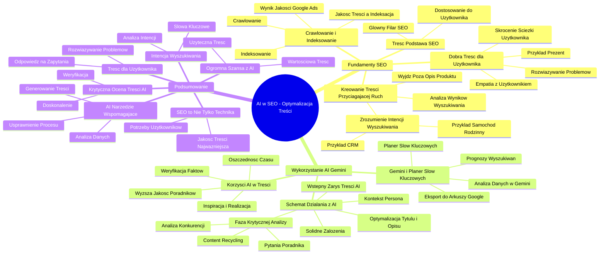

# Lekcje wideo - 1. Wstęp do optymalizacji treści pod SEO z wykorzystaniem AI

# 💡 Diagram

___

# 🗒️ Notatka

# Notatki i Podsumowanie Prezentacji Wideo: "Umiejętności Jutra - AI w SEO"

## Wprowadzenie

Prezentacja Krzysztofa Marca, CEO DevaGroup, z cyklu "Umiejętności Jutra" (organizowanego przez Google 🔍, we współpracy edukacyjnej z SGH). Temat: **zastosowanie AI w SEO**, z naciskiem na **optymalizację treści** w celu poprawy widoczności w organicznych wynikach wyszukiwania Google 🔍. Głównym celem jest wyjaśnienie, jak efektywnie wykorzystać narzędzia AI do tworzenia treści, które nie tylko podniosą pozycję w wyszukiwarce, ale przede wszystkim **zwiększą ruch na stronie i przełożą się na wzrost sprzedaży 📈** .

## Optymalizacja Treści pod SEO - Fundament Sukcesu

### Treść jako Podstawa SEO

- **Treść stanowi główny filar SEO.** Aby osiągnąć wysokie pozycje w Google 🔍, należy na to **zasłużyć**, dostarczając użytkownikom wartościowe treści.
- **Dostosowanie treści do potrzeb użytkownika** jest kluczowe. Google 🔍  premiuje strony, które najlepiej odpowiadają na zapytania i potrzeby odbiorców.

### Co Definiuje "Dobrą Treść dla Użytkownika"?

- **Empatia z użytkownikiem:** Wczuj się w sytuację użytkownika, aby zrozumieć jego intencje i czego poszukuje.
- **Rozwiązywanie problemów:** Dobra treść **rozwiązuje problem użytkownika** lub wyczerpująco odpowiada na jego pytania.
- **Przykład z zakupem prezentu 🎁:** Użytkownik poszukuje dodatkowych informacji o produkcie (np. kategorii wiekowej PEGI dla gier 🎮), które wykraczają poza standardowy opis w sklepie. Interesują go recenzje i opinie innych użytkowników.
- **Skrócenie ścieżki użytkownika:**  Dąż do dostarczenia **kompletnej i satysfakcjonującej treści** bezpośrednio na Twojej stronie, minimalizując potrzebę dalszego poszukiwania informacji przez użytkownika.

### Crawlowanie i Indeksowanie - Czy Google 🔍 Dostrzega Twoją Treść?

- **Crawlowanie:**  Roboty Google 🔍  przeszukują internet w celu identyfikacji nowych stron.
- **Indeksowanie:**  To decyzja Google 🔍 o włączeniu danej strony do indeksu (bazy danych), która jest przeszukiwana przez użytkowników.
- **Jakość treści a indeksacja:**  **Wysoka jakość treści** jest decydującym czynnikiem wpływającym na decyzję o indeksacji. Google 🔍 ocenia, czy treść jest **użyteczna** i wnosi wartość dla użytkowników.
- **Wynik Jakości w Google Ads:**  Można to porównać do Wyniku Jakości w reklamach Google Ads, który ocenia jakość strony docelowej z perspektywy użytkownika.

### Jak Kreować Treści Przyciągające Ruch?

- **Wyjdź poza ramy opisu produktu/usługi:**  Twórz **treści poradnikowe**, które odpowiadają na szersze pytania i problemy użytkowników związane z daną kategorią produktów lub usług.
- **Zrozum intencję wyszukiwania:**  Zastanów się, **jak użytkownik może szukać** Twoich produktów/usług. Nie ograniczaj się do nazwy produktu, ale pomyśl o problemie, który Twój produkt rozwiązuje.
    - Przykład systemu CRM: Użytkownik może szukać informacji o tym, \"jak zarządzać leadami\" lub \"jak monitorować pracę pracowników\", a system CRM jest odpowiedzią na te potrzeby.
- **Przykład "samochód rodzinny" 🚗:**
    - Sprawdzenie za pomocą komendy `site:toyotakrakow.pl samochód rodzinny`, czy strona dealera Toyoty odpowiada na to zapytanie. Wynik: odpowiedź nie jest w pełni satysfakcjonująca.
    - Analiza wyników Google 🔍 dla zapytania "samochód rodzinny": dominują **poradniki, rankingi i porównania**. To wskazuje na **intencję wyszukiwania** - użytkownik poszukuje **porad i pomocy w wyborze**, a nie tylko ofert sprzedaży.
- **Analiza wyników wyszukiwania:**  Google 🔍, analizując dane o interakcjach użytkowników, prezentuje **treści, które są pomocne i chętnie wybierane**. To cenna wskazówka, jaki rodzaj treści warto tworzyć.

## Wykorzystanie AI (Gemini) w Optymalizacji Treści

### Gemini Advanced i Planer Słów Kluczowych

- **Powrót do Planera Słów Kluczowych:**  Analiza **prognoz wyszukiwań** słów kluczowych w poszczególnych miesiącach. Trendy popularności słów kluczowych mogą podlegać sezonowym wahaniom (np. żakiety, systemy ERP).
- **Eksport danych z Planera do Arkuszy Google:** Ułatwia analizę dużych zbiorów danych.
- **Wykorzystanie Gemini do analizy danych:**  Przeklej dane z arkusza do Gemini i zadawaj pytania, np. \"Jakie cele wyznaczyć we wrześniu?\", \"Co zyska na popularności w listopadzie?\". Gemini może sugerować tematy treści na podstawie analizy trendów wyszukiwań.

### Korzyści z Implementacji AI w Tworzeniu Treści

- **Oszczędność czasu ⏱️:** Automatyzacja procesu tworzenia treści.
- **Wyższa jakość poradników:**  AI potrafi generować **wstępne wersje poradników o wysokiej jakości**, nawet w specjalistycznych branżach.
- **Inspiracja i realizacja:** AI wspiera zarówno proces inspiracji, jak i **konkretne tworzenie treści**.
- **Weryfikacja faktów:**  **Konieczność weryfikacji** treści generowanych przez AI przez człowieka.

### Schemat Działania - Jak Efektywnie Wykorzystać AI w SEO Content

1. **Solidne założenia:** Oparcie działań na **dobrze przemyślanych założeniach**, aby zwiększyć szanse treści na sukces.
2. **Wstępny zarys treści:** Wygenerowanie **wstępnej wersji treści** przy użyciu AI (np. Gemini). To dobry punkt startowy, lecz **nie należy poprzestawać na tym etapie**.
3. **Kontekst:** Nadanie treści odpowiedniego **kontekstu**, na przykład poprzez stworzenie **persony** użytkownika.
4. **Faza krytycznej analizy:**  **Analiza i udoskonalanie** treści. Sprawdzenie, jakie treści generuje konkurencja w wynikach wyszukiwania.
    - **Analiza tekstów konkurencji:**  Dogłębna analiza treści konkurencji, które pojawiają się w wynikach wyszukiwania.
    - **Content recycling:**  Innowacyjne wykorzystanie istniejących treści.
    - **Pytania napędzające poradnik:**  Wykorzystanie pytań użytkowników do strukturyzacji poradnika, czyniąc go bardziej użytecznym.
5. **Optymalizacja tytułu i opisu:**  Skopiuj tytuły i opisy z wyników wyszukiwania i poproś Gemini o **ulepszenie tytułu i opisu** dla Twojej treści, aby były bardziej atrakcyjne i skuteczne.

## Podsumowanie

Prezentacja podkreśla **fundamentalną rolę treści w SEO** i demonstruje, jak **AI, w szczególności Gemini**, może wspomóc **optymalizację procesu tworzenia treści**.  Kluczowe wnioski to:

- **Treść skoncentrowana na użytkowniku:**  Twórz treści, które **rozwiązują problemy użytkowników** i precyzyjnie odpowiadają na ich zapytania.
- **Zrozumienie intencji wyszukiwania:**  Analizuj **intencje użytkowników** ukryte za konkretnymi słowami kluczowymi.
- **AI jako narzędzie wspomagające:**  Gemini może **usprawnić i przyspieszyć proces tworzenia treści**, generować wstępne wersje poradników i wspierać analizę danych.
- **Krytyczna ocena i doskonalenie treści:**  Treści generowane przez AI wymagają **weryfikacji i dalszego udoskonalania** przez specjalistę.
- **SEO to nie tylko aspekty techniczne:**  **Jakość treści** i **reakcja na potrzeby użytkowników** są najważniejsze dla efektywnego SEO.

Wykorzystanie AI w SEO to **ogromna szansa** na osiągnięcie lepszych rezultatów, pod warunkiem, że priorytetem pozostanie tworzenie **wartościowej i użytecznej treści dla użytkowników 🧑‍💻** .

___

# 🔉 Transcript
File: Lekcje wideo - 1. Wstęp do optymalizacji treści pod SEO z wykorzystaniem AI.mp4 
[00:00:00] Ekran: Białe tło.
[00:00:01] Ekran: Napis "Umiejętności Jutra" z logiem AI. Pod spodem "Organizator: Google" i "Partner edukacyjny: SGH".
[00:00:05] Cześć, bardzo miło mi was tu widzieć.
[00:00:07] Ekran: Krzysztof Marzec, CEO + DevaGroup.
[00:00:07] Będziemy dzisiaj rozmawiali o czymś, co jest bardzo bliskie mojemu sercu, czyli zastosowaniu AI w SEO, w pozycjonowaniu, w działaniach organicznych, które mają na celu to, żebyśmy jak najwyżej pojawiali się w Google.
[00:00:21] Ale żeby pojawiać się wyżej w Google, trzeba po prostu sobie na to zasłużyć.
[00:00:26] Jak?
[00:00:26] Jak najlepiej dostosowując treści pod użytkownika.
[00:00:30] Właśnie na tym dzisiaj skupię się, opowiadając wam jak wykorzystać te świetne narzędzia, jakie dysponują ogromną ilością danych i możliwościami kreowania dla nas pewnych treści, właśnie po to, aby otrzymać efekt końcowy w postaci widoczności, która przekłada się na ruch na naszej stronie, która znowu ten ruch przekłada się na sprzedaż.
[00:00:55] Na pewno najbardziej nam zależy na tym ostatnim, więc cała ta linia optymalizacji musi być spójna.
[00:01:01] Ekran: Napis "Optymalizacja treści pod SEO".
[00:01:01] Ja nazywam się Krzysiek Marzec.
[00:01:03] Moim SEO zajmuję się od 2005 roku i widziałem już różne rewolucje, ale wydaje mi się, że największe możliwości i takie największe zmiany i potężne narzędzia, które trafiają w ręce specjalistów SEO, właśnie obserwujemy teraz i masz szansę być na bieżąco z nimi, masz szansę rozwiązywać pewne problemy, które wcześniej zajmowały nam wiele godzin pracy, momentalnie masz szansę zastosować automatyzację, które pozwolą ci się skupić na rzeczach, na które może wcześniej nie było czasu.
[00:01:36] Jednym z takich problemów jest to, jak chcemy przygotować treści dla użytkownika.
[00:01:41] Bardzo często czytając jakieś poradniki na temat pozycjonowania, dowiesz się, że treść to jeden z bardzo ważnych elementów całego procesu pozycjonowania, ale te opisy są dosyć ogólne.
[00:01:53] Dowiesz się na przykład, że trzeba tworzyć dobre treści pod użytkowników.
[00:01:58] Dzisiaj zadamy sobie pytanie, co to właściwie znaczy?
[00:02:01] Co to jest dobra treść dla użytkownika?
[00:02:04] Myślę, że łatwo pomyśleć, żeby postawić się w takiej sytuacji tego użytkownika.
[00:02:09] Ja niedawno musiałem dokonać wielu zakupów prezentów i często nie wiedziałem nic na temat danego produktu, który był wymarzonym produktem dla innej osoby.
[00:02:20] Aby nie popełnić błędów, szukam informacji na temat tego produktu.
[00:02:24] Zastanawiam się oczywiście też różnymi rzeczami, czy to dotrze na czas, czy to jest na pewno dobry produkt dla danej grupy wiekowej, czy ta gra jest na pewno okej dla 12latka.
[00:02:35] I poszukuję takich informacji.
[00:02:38] Teraz wyobraź sobie, że wpisujesz słowo kluczowe w Google, dostajesz stronę internetową i tam jest tylko produkt, jest jego opis i nie ma tych informacji, szukasz informacji o tak zwanym PEGI, czyli dla kogo jest ta gra, dostajesz ogólną informację 16 plus.
[00:02:55] Skończy się płaczem dziecka, bo to jednak nie dla niego.
[00:02:58] A może jest tam opcja, która pozwoli na obniżenie tych wymagań wiekowych.
[00:03:04] Być może chodzi o mikrotransakcje, które da się wyłączyć, a być może chodzi o to, że jest tam przemoc, na którą takie dziecko nie powinno być w ogóle wystawione.
[00:03:13] Masz dodatkowe pytania.
[00:03:15] I teraz pytanie, czy ten opis danej gry, który jest w sklepie internetowym, był wystarczającym poradnikiem.
[00:03:23] Pewnie pójdziesz dalej.
[00:03:25] Będziesz chciała, chciał sprawdzić opis tej gry na YouTubie, jakieś recenzje.
[00:03:31] Być może inny rodzic wypowie się, czy ta gra jest odpowiednia dla dziecka i to jest nasze poszukiwanie.
[00:03:36] My teraz chcemy trochę skrócić tą podróż dla użytkownika i od razu powitać go na naszej stronie jak najlepszą treścią, taką, która i tu uwaga, rozwiązuje po prostu jego czy jej problem.
[00:03:50] Ale żeby od tego zacząć, my musimy w ogóle mieć te treści, bo trzeba zadać sobie pytanie, czy treści, które posiadasz, Google w ogóle widzi.
[00:03:59] Ten proces odkrywania treści przez Google nazywamy crawlowaniem i indeksowaniem.
[00:04:04] Crawlowanie to po prostu przemierzanie przez roboty Google internetu, znajdywanie stron i właśnie pojawia się pewna decyzja, czy wrzucamy to do bazy danych, którą mogą przeglądać użytkownicy, czyli indeksujemy te wyniki, czy jednak dana strona na to nie zasługuje.
[00:04:21] Powodów braku indeksacji może być bardzo dużo, ale właśnie jednym z najważniejszych powodów jest coś, co mówi o jakości tej treści.
[00:04:30] Czy ona coś faktycznie wnosi do tego indeksu Google, do tej bazy danych, czy ona będzie później pomagała użytkownikom.
[00:04:37] Google ma wiele sposobów w swoim algorytmie, żeby oceniać przydatność tej treści i wiemy na przykład o tym, że nawet w reklamach Google Ads mamy taki składnik wyniku jakości, który nam podpowiada, czy dana strona jako strona docelowa w kampanii, w reklamie jest dobra pod kątem jakości dla naszych użytkowników.
[00:04:56] Idąc dalej tym tropem, możemy pomyśleć, okej, ale ja nawet nie wiem na jaki temat pisać treści.
[00:05:02] Mam kategorię, mam produkty, czego właściwie jeszcze ode mnie wymaga Google?
[00:05:07] No właśnie niczego, ale możesz zyskać znacznie więcej ruchu i widoczności, stosując te pewne drobne zabiegi SEO, czyli tworząc treści poradnikowe, tworząc treści, które oprócz tego, że mają coś pokazać, dany produkt, tak jak jest to w kategorii sklepu, czy na przykład w jakimś opisie i to dotyczy wszystkich stron, bo przecież na stronie B2B też jest opisana dana usługa.
[00:05:30] Musimy pomyśleć o krok dalej.
[00:05:33] Jak nasz użytkownik może poszukiwać naszych produktów?
[00:05:37] Co wpisuje w Google?
[00:05:38] Może nie tylko nazwę tego produktu, na przykład system CRM, ale ma jakiś problem.
[00:05:43] Na przykład, jak zarządzać przychodzącymi leadami, albo jak monitorować jakość wykonywanej pracy przez moich pracowników, czy jak zarządzać kontaktami w mojej firmie.
[00:05:56] I na te wszystkie pytania odpowiedzią jest konkretny system CRM.
[00:06:01] Ekran: Wyniki wyszukiwania w Google.
[00:06:01] Gdybym stworzył stronę i powiedział cześć, mam system CRM do sprzedaży, działa tak, to nie osiągnę takiego samego efektu, kiedy opiszę te wszystkie funkcje i uwaga, odpowiem na pytania moich użytkowników.
[00:06:12] Zobaczmy ten prosty przykład.
[00:06:13] Tu w Google wpisałem słowo samochód rodzinny, a później dodałem takie polecenie site dwukropek i podałem jedną z wielu domen, które znalazłem w internecie.
[00:06:24] W ten sposób szukam słowa samochód rodzinny tylko i wyłącznie w obrębie tej domeny.
[00:06:31] Zobaczmy, czy Toyota jest producentem, który ma w swojej ofercie samochody rodzinne?
[00:06:36] Jak najbardziej.
[00:06:37] Czy ten konkretny dealer samochodów pod adresem Toyota Kraków.pl odpowiedział w swojej treści idealnie na to zapotrzebowanie?
[00:06:46] No niestety nie do końca.
[00:06:47] Słowa w różnym kontekście pojawiają się na tej stronie, ale ten sposób wyszukiwania pokazuje, że nie ma tam jednej konkretnej oferty, jednego konkretnego miejsca, które odpowiadałoby nam tak, tu jest strona, na której znajdziesz samochody rodzinne.
[00:07:04] Wpiszmy to słowo po prostu w Google i zobaczmy czego może spodziewać się użytkownik.
[00:07:09] W ten sposób zbadamy coś, co jeszcze do nas zaraz wróci, czyli pewną intencję wyszukiwania, zaraz to wyjaśnię.
[00:07:15] Ekran: Wyniki wyszukiwania w Google.
[00:07:15] Zobaczmy, jest tu poradnik 10 modeli na lata.
[00:07:19] To bardzo ważne, bo w przypadku posiadania rodziny, większej rodziny, będziemy bardzo ekonomicznie patrzyli na wiele aspektów naszego życia.
[00:07:27] Dwa ranking samochód dla rodziny, najciekawsze propozycje.
[00:07:31] Czyli mam poradniki, które nam mówią, że mogę coś porównać, mogę coś wybrać i dostarczają mi informacji na ten temat.
[00:07:39] I dzisiaj zadamy sobie pytanie, co to właściwie znaczy?
[00:07:41] Co to jest dobra treść dla użytkownika?
[00:07:44] Myślę, że łatwo pomyśleć, żeby postawić się w takiej sytuacji tego użytkownika.
[00:07:50] Ekran: Wyniki wyszukiwania w Google.
[00:07:50] Ja niedawno musiałem dokonać wielu zakupów prezentów i często nie wiedziałem nic na temat danego produktu, który był wymarzonym produktem dla innej osoby.
[00:08:00] Aby nie popełnić błędów, szukam informacji na temat tego produktu.
[00:08:03] Zastanawiam się oczywiście też różnymi rzeczami, czy to dotrze na czas, czy to jest na pewno dobry produkt dla danej grupy wiekowej, czy ta gra jest na pewno okej dla 12latka.
[00:08:16] I poszukuję takich informacji.
[00:08:19] Teraz wyobraź sobie, że wpisujesz słowo kluczowe w Google, dostajesz stronę internetową i tam jest tylko produkt, jest jego opis i nie ma tych informacji, szukasz informacji o tak zwanym PEGI, czyli dla kogo jest ta gra, dostajesz ogólną informację 16 plus.
[00:08:55] Skończy się płaczem dziecka, bo to jednak nie dla niego.
[00:08:58] A może jest tam opcja, która pozwoli na obniżenie tych wymagań wiekowych.
[00:09:04] Być może chodzi o mikrotransakcje, które da się wyłączyć, a być może chodzi o to, że jest tam przemoc, na którą takie dziecko nie powinno być w ogóle wystawione.
[00:09:10] Masz dodatkowe pytania.
[00:09:13] I teraz pytanie, czy ten opis danej gry, który jest w sklepie internetowym, był wystarczającym poradnikiem.
[00:09:23] Pewnie pójdziesz dalej.
[00:09:25] Będziesz chciała, chciał sprawdzić opis tej gry na YouTubie, jakieś recenzje.
[00:09:31] Być może inny rodzic wypowie się, czy ta gra jest odpowiednia dla dziecka.
[00:09:35] I to jest nasze poszukiwanie.
[00:09:36] My teraz chcemy trochę skrócić tą podróż dla użytkownika i od razu powitać go na naszej stronie jak najlepszą treścią, taką, która i tu uwaga, rozwiązuje po prostu jego czy jej problem.
[00:09:50] Ale żeby od tego zacząć, my musimy w ogóle mieć te treści, bo trzeba zadać sobie pytanie, czy treści, które posiadasz, Google w ogóle widzi.
[00:09:59] Ten proces odkrywania treści przez Google nazywamy crawlowaniem i indeksowaniem.
[00:10:04] Crawlowanie to po prostu przemierzanie przez roboty Google internetu, znajdywanie stron i właśnie pojawia się pewna decyzja, czy wrzucamy to do bazy danych, którą mogą przeglądać użytkownicy, czyli indeksujemy te wyniki, czy jednak dana strona na to nie zasługuje.
[00:10:21] Powodów braku indeksacji może być bardzo dużo, ale właśnie jednym z najważniejszych powodów jest coś, co mówi o jakości tej treści.
[00:10:30] Czy ona coś faktycznie wnosi do tego indeksu Google, do tej bazy danych, czy ona będzie później pomagała użytkownikom.
[00:10:37] Google ma wiele sposobów w swoim algorytmie, żeby oceniać przydatność tej treści i wiemy na przykład o tym, że nawet w reklamach Google Ads mamy taki składnik wyniku jakości, który nam podpowiada, czy dana strona jako strona docelowa w kampanii, w reklamie jest dobra pod kątem jakości dla naszych użytkowników.
[00:10:51] Ekran: Slajd z napisem "Optymalizacja treści pod SEO".
[00:10:51] Idąc dalej tym tropem, możemy pomyśleć, okej, ale ja nawet nie wiem na jaki temat pisać treści.
[00:10:57] Mam kategorię, mam produkty, czego właściwie jeszcze ode mnie wymaga Google?
[00:11:03] No właśnie niczego, ale możesz zyskać znacznie więcej ruchu i widoczności, stosując pewne drobne zabiegi SEO, czyli tworząc treści poradnikowe, tworząc treści, które oprócz tego, że mają coś pokazać, dany produkt, tak jak jest to w kategorii sklepu, czy na przykład w jakimś opisie i to dotyczy wszystkich stron, bo przecież na stronie B2B też jest opisana dana usługa.
[00:11:35] Ekran: Slajd z napisem "Dlaczego o tym mówimy?". Pod spodem: "Treść to główny filar SEO".
[00:11:35] Musimy pomyśleć o krok dalej.
[00:11:38] Jak nasz użytkownik może poszukiwać naszych produktów?
[00:11:41] Co wpisuje w Google?
[00:11:42] Może nie tylko nazwę tego produktu, na przykład system CRM, ale ma jakiś problem.
[00:11:47] Na przykład, jak zarządzać przychodzącymi leadami, albo jak monitorować jakość wykonywanej pracy przez moich pracowników, czy jak zarządzać kontaktami w mojej firmie.
[00:11:56] I na te wszystkie pytania odpowiedzią jest konkretny system CRM.
[00:12:01] Ekran: Wyniki wyszukiwania w Google.
[00:12:01] Gdybym stworzył stronę i powiedział cześć, mam system CRM do sprzedaży, działa tak, to nie osiągnę takiego samego efektu, kiedy opiszę te wszystkie funkcje i uwaga, odpowiem na pytania moich użytkowników.
[00:12:12] Zobaczmy ten prosty przykład.
[00:12:13] Tu w Google wpisałem słowo samochód rodzinny, a później dodałem takie polecenie site dwukropek i podałem jedną z wielu domen, które znalazłem w internecie.
[00:12:24] W ten sposób szukam słowa samochód rodzinny tylko i wyłącznie w obrębie tej domeny.
[00:12:31] Zobaczmy, czy Toyota jest producentem, który ma w swojej ofercie samochody rodzinne?
[00:12:36] Jak najbardziej.
[00:12:37] Czy ten konkretny dealer samochodów pod adresem Toyota Kraków.pl odpowiedział w swojej treści idealnie na to zapotrzebowanie?
[00:12:46] No niestety nie do końca.
[00:12:47] Słowa w różnym kontekście pojawiają się na tej stronie, ale ten sposób wyszukiwania pokazuje, że nie ma tam jednej konkretnej oferty, jednego konkretnego miejsca, które odpowiadałoby nam tak, tu jest strona, na której znajdziesz samochody rodzinne.
[00:13:04] Wpiszmy to słowo po prostu w Google i zobaczmy czego może spodziewać się użytkownik.
[00:13:10] W ten sposób zbadamy coś, co jeszcze do nas zaraz wróci, czyli pewną intencję wyszukiwania, zaraz to wyjaśnię.
[00:13:16] Ekran: Wyniki wyszukiwania w Google.
[00:13:16] Zobaczmy, jest tu poradnik 10 modeli na lata.
[00:13:19] To bardzo ważne, bo w przypadku posiadania rodziny, większej rodziny, będziemy bardzo ekonomicznie patrzyli na wiele aspektów naszego życia.
[00:13:27] Dwa ranking samochód dla rodziny, najciekawsze propozycje.
[00:13:31] Czyli mam poradniki, które nam mówią, że mogę coś porównać, mogę coś wybrać i dostarczają mi informacji na ten temat i właściwie dają mi do myślenia, co ja powinienem w tych samochodach do siebie porównywać, co powinienem analizować i odpowiadają na wiele pytań, których jeszcze nie zdążyłem zadać.
[00:13:50] Ekran: Slajd z napisem "Co jeszcze?". Pod spodem trzy punkty: "Dodaj i sprawdź teksty swojej konkurencji", "Content recycling", "Daj mi pytania, które pozwolą Ci napisać poradnik".
[00:13:50] To jest super ważne, bo w tym momencie Google wyświetlając takie wyniki wyszukiwania ma ogromną ilość danych na podstawie wcześniejszych interakcji użytkowników z wynikami wyszukiwania i wie czego szukaliśmy.
[00:14:05] Można by bardzo, bardzo uprościć algorytm, który ma setki różnych zasad, parametrów i różnych funkcji, którymi możemy wpływać na to, kto jest wyżej, niżej, ale najważniejsze jest to, że koniec końców pojawiają się tutaj treści, które były wybierane przez użytkowników i uwaga, w pewien sposób były pomocne.
[00:14:20] Czyli jeśli Google pokazuje mi, że coś tak ma wyglądać wyniki wyszukiwania na samochód rodzinny, powinien być takim poradnikiem, to jest to dla mnie bardzo duża podpowiedź, że teraz na mojej stronie powinienem stworzyć taką podstronę, która również na te problemy, pytania, czy nawet nie zadane pytania użytkowników odpowiada.
[00:14:47] Ekran: Gemini Advanced.
[00:14:47] I tu mamy bardzo dużo możliwości, a podpowiem ci również, że powrót do planera słów kluczowych może być świetnym pomysłem w tym kontekście, ponieważ ta druga opcja, która pozwala nam poznać liczbę wyszukiwań i prognozy, pozwoli mi przeanalizować konkretne słowa kluczowe, na które trendy mogą się zmieniać bardzo mocno w konkretnych miesiącach, odkrywamy kiedy najbardziej popularne są żakiety, czy czy systemy ERP mają lepszą lub gorszą popularność w danych miesiącach i możemy do tego zastosować pewien prosty trik.
[00:15:26] Pobieramy dane o tych konkretnych prognozach i ja pobieram te dane do arkusza Google i za pomocą tego prostego eksportu mam dane i ogromną tabelkę z podziałem wyszukiwań dla moich słów kluczowych na konkretne miesiące.
[00:15:57] Teraz tą samą tabelkę możesz przekleić i opisać do Gemini, kiedy masz do przeanalizowania setki słów kluczowych.
[00:16:05] Można również zrobić bardzo proste porównanie konkretnych kolumn, ale ja bardzo lubię dodawać te słowa kluczowe i dane o ich wyszukiwaniu właśnie do Gemini po to, aby podpowiadał mi cześć.
[00:16:23] Jest wrzesień, jakie powinienem przyjąć cele.
[00:16:27] Jeśli chodzi o tworzenie nowych treści, co może być dużo bardziej popularne w listopadzie.
[00:16:34] Jak widzisz, jest mnóstwo aspektów, przez które prosta treść może być ulepszana.
[00:16:39] Być może nie jest dla ciebie oczywiste od razu, że jest to optymalizacja pod SEO, przecież nie padało za dużo H1, title, czy jakiś przekierowań 301, ale uwaga, to jest to, co w SEO działa najmocniej i najlepiej, a w powiązaniu z AI możemy wyjść naprawdę na dużo wyższy poziom, niż gdyby to tworzył tylko i wyłącznie człowiek.
[00:17:10] Nie tylko inspiracje, ale również konkretne wykonanie tej treści, oczywiście ze sprawdzeniem i weryfikacją faktów, będzie nam automatyzowało i znacznie przyspieszało pracę.
[00:17:20] Na takich działaniach potrafię oszczędzać wiele, wiele godzin, ale to nie tylko sama oszczędność czasu.
[00:17:27] Nie potrafiłbym w wielu kategoriach i branżach stworzyć tak dobrych poradników, jakie już po pierwszym zapytaniu do Gemini system generuje dla mnie automatycznie.
[00:17:40] Ekran: Slajd z napisem "Schemat działania". Pod spodem cztery punkty: "Dobre założenia", "Wstępna treść", "Kontekst", "Faza krytyki".
[00:17:40] I na tym slajdzie pojawia się schemat działania.
[00:17:43] Po pierwsze, znajdź swoje słowa kluczowe.
[00:17:46] Oprzyj wszystko o dobre założenia o to, żeby treść, którą tworzysz, była skazana na sukces.
[00:17:51] Taka wstępna treść, którą wygenerujemy, będzie dobrym początkiem, nigdy na niej nie kończ.
[00:17:57] Przepuść ją przez analizę, nadaj pewien kontekst, możemy stworzyć personę, musimy sprawdzić co jest w wynikach wyszukiwania.
[00:18:09] Dobrym trikiem będzie również przeklejenie tego, co znaleźliśmy, skopiowanie z wyników wyszukiwania tytułów i opisów i na przykład zapytanie Gemini ulepsz mój poradnik i napisz mi tytuł i opis do niego.
[00:18:20] Ekran: Wyniki wyszukiwania w Google.
[00:18:20] W ten sposób szukam słowa samochód rodzinny tylko i wyłącznie w obrębie tej domeny.
[00:18:24] Zobaczmy, czy Toyota jest producentem, który ma w swojej ofercie samochody rodzinne?
[00:18:29] Jak najbardziej.
[00:18:30] Czy ten konkretny dealer samochodów pod adresem Toyota Kraków.pl odpowiedział w swojej treści idealnie na to zapotrzebowanie?
[00:18:39] No niestety nie do końca.
[00:18:40] Słowa w różnym kontekście pojawiają się na tej stronie, ale ten sposób wyszukiwania pokazuje, że nie ma tam jednej konkretnej oferty, jednego konkretnego miejsca, które odpowiadałoby nam tak, tu jest strona, na której znajdziesz samochody rodzinne.
[00:18:55] Wpiszmy to słowo po prostu w Google i zobaczmy czego może spodziewać się użytkownik.
[00:19:01] W ten sposób zbadamy coś, co jeszcze do nas zaraz wróci, czyli pewną intencję wyszukiwania, zaraz to wyjaśnię.
[00:19:07] Ekran: Wyniki wyszukiwania w Google.
[00:19:07] Zobaczmy, jest tu poradnik 10 modeli na lata.
[00:19:11] To bardzo ważne, bo w przypadku posiadania rodziny, większej rodziny, będziemy bardzo ekonomicznie patrzyli na wiele aspektów naszego życia.
[00:19:18] Dwa ranking samochód dla rodziny, najciekawsze propozycje.
[00:19:22] Czyli mam poradniki, które nam mówią, że mogę coś porównać, mogę coś wybrać i dostarczają mi informacji na ten temat.
[00:19:29] I dzisiaj zadamy sobie pytanie, co to właściwie znaczy?
[00:19:33] Co to jest dobra treść dla użytkownika?
[00:19:36] Myślę, że łatwo pomyśleć, żeby postawić się w takiej sytuacji tego użytkownika.
[00:19:41] Ekran: Gemini Advanced.
[00:19:41] Ja niedawno musiałem dokonać wielu zakupów prezentów i często nie wiedziałem nic na temat danego produktu, który był wymarzonym produktem dla innej osoby.
[00:19:51] Aby nie popełnić błędów, szukam informacji na temat tego produktu.
[00:19:55] Zastanawiam się oczywiście też różnymi rzeczami, czy to dotrze na czas, czy to jest na pewno dobry produkt dla danej grupy wiekowej, czy ta gra jest na pewno okej dla 12latka.
[00:20:09] I poszukuję takich informacji.
[00:20:13] Teraz wyobraź sobie, że wpisujesz słowo kluczowe w Google, dostajesz stronę internetową i tam jest tylko produkt, jest jego opis i nie ma tych informacji, szukasz informacji o tak zwanym PEGI, czyli dla kogo jest ta gra, dostajesz ogólną informację 16 plus.
[00:20:45] Skończy się płaczem dziecka, bo to jednak nie dla niego.
[00:20:48] A może jest tam opcja, która pozwoli na obniżenie tych wymagań wiekowych.
[00:20:54] Być może chodzi o mikrotransakcje, które da się wyłączyć, a być może chodzi o to, że jest tam przemoc, na którą takie dziecko nie powinno być w ogóle wystawione.
[00:21:00] Masz dodatkowe pytania.
[00:21:03] I teraz pytanie, czy ten opis danej gry, który jest w sklepie internetowym, był wystarczającym poradnikiem.
[00:21:12] Pewnie pójdziesz dalej.
[00:21:14] Będziesz chciała, chciał sprawdzić opis tej gry na YouTubie, jakieś recenzje.
[00:21:20] Być może inny rodzic wypowie się, czy ta gra jest odpowiednia dla dziecka i to jest nasze poszukiwanie.
[00:21:30] My teraz chcemy trochę skrócić tą podróż dla użytkownika i od razu powitać go na naszej stronie jak najlepszą treścią, taką, która i tu uwaga, rozwiązuje po prostu jego czy jej problem.
[00:21:40] Ekran: Slajd z napisem "Optymalizacja treści pod SEO".
[00:21:40] Ja nazywam się Krzysiek Marzec.
[00:21:42] Moim SEO zajmuję się od 2005 roku i widziałem już różne rewolucje, ale wydaje mi się, że największe możliwości i takie największe zmiany i potężne narzędzia, które trafiają w ręce specjalistów SEO, właśnie obserwujemy teraz i masz szansę być na bieżąco z nimi, masz szansę rozwiązywać pewne problemy, które wcześniej zajmowały nam wiele godzin pracy, momentalnie masz szansę zastosować automatyzację, które pozwolą ci się skupić na rzeczach, na które może wcześniej nie było czasu.
[00:22:55] Ekran: Slajd z napisem "Dlaczego o tym mówimy?". Pod spodem: "Treść to główny filar SEO".
[00:22:55] Jednym z takich problemów jest to, jak chcemy przygotować treści dla użytkownika.
[00:23:00] Bardzo często czytając jakieś poradniki na temat pozycjonowania, dowiesz się, że treść to jeden z bardzo ważnych elementów całego procesu pozycjonowania, ale te opisy są dosyć ogólne.
[00:23:13] Dowiesz się na przykład, że trzeba tworzyć dobre treści pod użytkowników.
[00:23:18] Dzisiaj zadamy sobie pytanie, co to właściwie znaczy?
[00:23:20] Co to jest dobra treść dla użytkownika?
[00:23:23] Myślę, że łatwo pomyśleć, żeby postawić się w takiej sytuacji tego użytkownika.
[00:23:29] Ja niedawno musiałem dokonać wielu zakupów prezentów i często nie wiedziałem nic na temat danego produktu, który był wymarzonym produktem dla innej osoby.
[00:23:40] Aby nie popełnić błędów, szukam informacji na temat tego produktu.
[00:23:46] Zastanawiam się oczywiście też różnymi rzeczami, czy to dotrze na czas, czy to jest na pewno dobry produkt dla danej grupy wiekowej, czy ta gra jest na pewno okej dla 12latka.
[00:23:57] I poszukuję takich informacji.
[00:23:59] Teraz wyobraź sobie, że wpisujesz słowo kluczowe w Google, dostajesz stronę internetową i tam jest tylko produkt, jest jego opis i nie ma tych informacji, szukasz informacji o tak zwanym PEGI, czyli dla kogo jest ta gra, dostajesz ogólną informację 16 plus.
[00:24:21] Skończy się płaczem dziecka, bo to jednak nie dla niego.
[00:24:24] A może jest tam opcja, która pozwoli na obniżenie tych wymagań wiekowych.
[00:24:30] Być może chodzi o mikrotransakcje, które da się wyłączyć, a być może chodzi o to, że jest tam przemoc, na którą takie dziecko nie powinno być w ogóle wystawione.
[00:24:38] Ekran: Slajd z napisem "Umiejętności AI Jutra". Pod spodem logo Google i SGH.
[00:24:38] Masz dodatkowe pytania.
[00:24:39] Ekran: Slajd z napisem "Optymalizacja treści pod SEO".
[00:24:39] I teraz pytanie, czy ten opis danej gry, który jest w sklepie internetowym, był wystarczającym poradnikiem.
[00:24:50] Ekran: Slajd z napisem "Dlaczego o tym mówimy?". Pod spodem: "Treść to główny filar SEO".
[00:24:50] Pewnie pójdziesz dalej.
[00:24:52] Będziesz chciała, chciał sprawdzić opis tej gry na YouTubie, jakieś recenzje.
[00:24:58] Być może inny rodzic wypowie się, czy ta gra jest odpowiednia dla dziecka i to jest nasze poszukiwanie.
[00:25:08] Ekran: Gemini Advanced.
[00:25:08] My teraz chcemy trochę skrócić tą podróż dla użytkownika i od razu powitać go na naszej stronie jak najlepszą treścią, taką, która i tu uwaga, rozwiązuje po prostu jego czy jej problem.
[00:25:20] Ale żeby od tego zacząć, my musimy w ogóle mieć te treści, bo trzeba zadać sobie pytanie, czy treści, które posiadasz, Google w ogóle widzi.
[00:25:29

___
# 🏷️ Tags
#umiejętności_jutra #AI #SEO #DevaGroup #Google #SGH #optymalizacja_treści #widoczność #wyniki_wyszukiwania #ruch_na_stronie #wzrost_sprzedaży #treść #wartościowe_treści #potrzeby_użytkownika #empatia #rozwiązywanie_problemów #recenzje #opinie #crawlowanie #indeksowanie #jakość_treści #użyteczna_treść #Google_Ads #treści_poradnikowe #intencja_wyszukiwania #system_CRM #samochód_rodzinny #Planer_Słów_Kluczowych #prognozy_wyszukiwań #trendy_wyszukiwań #Gemini #oszczędność_czasu #weryfikacja_faktów #założenia #kontekst #persona #analiza_konkurencji #content_recycling #tytuł #opis #wartościowa_treść #użyteczna_treść #Krzysztof_Marzec #automatyzacja #pozycjonowanie #PEGI #mikrotransakcje #przemoc #roboty_Google #indeks_Google #baza_danych #wynik_jakości #strona_docelowa #B2B #site #Toyota_Kraków #modele_na_lata #ranking #modele #żakiety #systemy_ERP #arkusze_Google #cele #inspiracja #schemat_działania #faza_krytyki #ulepszanie_treści
