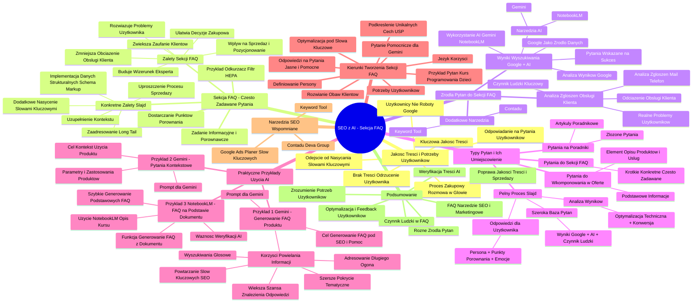

# Lekcje wideo - 2. Sekcja FAQ wspierana AI

# 💡 Diagram

___

# 🗒️ Notatka

# Notatki i Podsumowanie Lekcji: "Umiejętności Jutra AI: SEO z AI - Sekcja FAQ"

## Wprowadzenie

Lekcja prowadzona przez Krzysztofa Marca omawia wykorzystanie sztucznej inteligencji (AI) w SEO, koncentrując się na tworzeniu sekcji FAQ (Frequently Asked Questions - Często Zadawane Pytania) na stronach internetowych. Celem lekcji jest poprawa jakości treści, lepsze odpowiadanie na potrzeby użytkowników oraz wzmocnienie pozycji strony w wyszukiwarce Google 🔍.

## Jakość Treści i Potrzeby Użytkowników

* **Jakość treści jest kluczowa** 🔑 dla przyciągnięcia i utrzymania użytkowników na stronie.
* Treść powinna być tworzona z myślą o **użytkownikach**, a nie tylko o robotach Google.
* Należy odejść od **nasycania treści słowami kluczowymi** na rzecz dostarczania wartościowych informacji.
* **Proces zakupowy** to często rozmowa w głowie użytkownika. Strona powinna odpowiadać na pytania, które użytkownik sobie zadaje, aby uniknąć sytuacji, w której poszukuje on odpowiedzi u konkurencji.
* **Brak treści** lub treść nieadekwatna do potrzeb użytkownika może go **odrzucić** ❌.
* Strona powinna **odpowiadać na pytania użytkowników** i pomagać im w procesie decyzyjnym.

## Sekcja FAQ - Często Zadawane Pytania

* Sekcja FAQ ma za zadanie **dostarczyć użytkownikom punktów porównania** produktów lub usług, pomagając im w wyborze.
* Przykład z odkurzaczem 🧽: użytkownik może nie znać różnic w mocy ssącej, ale opis i sekcja FAQ mogą wprowadzić pojęcie filtra HEPA, które staje się kluczowe dla alergików.
* **Sekcja FAQ spełnia zadanie informacyjne i porównawcze**, dostarczając ważnych informacji, które wpływają na decyzję zakupową.

### Zalety Sekcji FAQ

* **Wpływ na sprzedaż i pozycjonowanie.**
* **Rozwiązuje potencjalne problemy użytkownika.**
* **Buduje wizerunek eksperta.**
* **Zwiększa zaufanie klientów.**
* **Zmniejsza obciążenie działu obsługi klienta.**
* **Ułatwia podjęcie decyzji zakupowej.**

**Konkretne Zalety (Slajd):**

* **Dodatkowe nasycenie słowami kluczowymi:** Naturalne wplatanie słów kluczowych w pytania i odpowiedzi.
* **Zaadresowanie `long tail`:** Odpowiadanie na szczegółowe, długie zapytania użytkowników.
* **Implementacja danych strukturalnych:** Możliwość zastosowania `schema markup` dla FAQ, co poprawia widoczność w wynikach wyszukiwania.
* **Uzupełnienie kontekstu:** Dostarczenie dodatkowego kontekstu wokół produktu lub usługi.
* **Uproszczenie procesu sprzedaży:** Odpowiedzi na typowe pytania przyspieszają proces decyzyjny i zakupowy.

## Źródła Pytań do Sekcji FAQ

### 1. Wyniki Wyszukiwania Google + AI

* **Analiza wyników wyszukiwania Google:** Pytania pojawiające się w wynikach wyszukiwania (np. "People Also Ask") są cennym źródłem inspiracji.
* **Wykorzystanie AI:** Narzędzia AI, takie jak Gemini i NotebookLM, mogą pomóc w generowaniu pytań.
* **Google jako źródło danych:** Google przetwarza ogromne ilości danych, aby wyświetlać najlepsze odpowiedzi na zapytania. Pytania w wynikach wyszukiwania są już **"wskazane na sukces"** i powiązane z danym słowem kluczowym.
* Pytania te są często zadawane przez użytkowników szukających informacji w kontekście produktu lub usługi.
* **Nie bój się analizować wyników wyszukiwania** i brać pod uwagę tego, co tam się znajduje.
* **Narzędzia AI:**
    * **Gemini:** Do generowania pytań i odpowiedzi FAQ.
    * **NotebookLM:** Do analizy dokumentów (np. opisów produktów) i generowania FAQ na ich podstawie.

### 2. Dodatkowe Narzędzia

* **Podstawowe narzędzia:** Keyword Tool - do wyszukiwania słów kluczowych i powiązanych pytań.
* **Zaawansowane narzędzia:** Contadu - bardziej rozbudowane narzędzie SEO, które może pomóc w analizie konkurencji i generowaniu pytań.

### 3. Analiza Zgłoszeń Obsługi Klienta

* **Czynnik ludzki jest kluczowy.** Osoby odpowiedzialne za sprzedaż powinny zbierać pytania od klientów.
* Pytania od działu obsługi klienta odzwierciedlają **realne problemy i wątpliwości użytkowników**.
* Analiza maili 📧, telefonów 📞 i innych zgłoszeń do działu obsługi klienta to cenne źródło pytań do FAQ.
* Sekcja FAQ powinna **odciążać dział obsługi klienta**, automatycznie odpowiadając na często zadawane pytania.

## Typy Pytań i Ich Umiejscowienie (Pełen Proces)

1. **Pytania do wkomponowania w ofertę:**
    * Powinny być elementem **opisów produktów lub usług**.
    * Dotyczą podstawowych informacji, które powinny być łatwo dostępne.

2. **Pytania na poradniki:**
    * Bardziej złożone pytania, które wymagają **szerszego wyjaśnienia**.
    * Mogą prowadzić do stworzenia **artykułów poradnikowych** lub rozbudowanych sekcji w ofercie.

3. **Pytania do sekcji FAQ:**
    * Pytania **krótkie, konkretne i często zadawane**.
    * Idealne do sekcji FAQ, gdzie odpowiedzi są zwięzłe i na temat.

**Pełen Proces (Slajd):**

* **Szeroka baza pytań:** Wyniki wyszukiwania Google + AI + czynnik ludzki.
* **Odpowiedzi dla użytkownika:** Persona + punkty porównania + emocje (język korzyści).
* **Analiza wyników:** Optymalizacja techniczna + współczynnik konwersji.

## Praktyczne Przykłady Użycia AI (Gemini i NotebookLM)

### Przykład 1: Gemini - Generowanie FAQ dla Produktu

* **Prompt dla Gemini:** "Utwórz proszę listę 10 potencjalnych pytań FAQ związanych z zakupem online produktu, którego opis wklejam poniżej. Do pytań od razu udziel wyczerpujących odpowiedzi, sugeruję się zasadami jasności pod SEO oraz pod kątem pomocy..."
* **Cel:** Wygenerowanie pytań FAQ zoptymalizowanych pod SEO i pomocnych dla użytkowników.
* **Korzyści z powielania informacji z opisu w FAQ:**
    * Użytkownik ma większą szansę znaleźć odpowiedź na swoje pytanie.
    * **Powtarzanie słów kluczowych** wzmacnia SEO.
    * Adresowanie **`długiego ogona`** słów kluczowych (bardziej precyzyjnych zapytań).
    * Odpowiadanie na **wyszukiwania głosowe** 🗣️.
    * Szersze **pokrycie tematyczne** wokół produktu.

### Przykład 2: Gemini - Pytania Kontekstowe

* **Prompt dla Gemini:** "Wygeneruj dodatkowe 3 pytania w kontekście zastosowania tego laptopa 💻 np.: do nauki czy grania."
* **Cel:** Generowanie pytań uwzględniających **kontekst użycia produktu**.
* Ważne jest, aby zastanowić się nad **parametrami i zastosowaniami produktów/kategorii produktów**.

### Przykład 3: NotebookLM - FAQ na Podstawie Dokumentu

* **Użycie NotebookLM:** Przesłanie opisu kursu programowania dla dzieci do NotebookLM.
* **Funkcja NotebookLM:** Generowanie najczęściej zadawanych pytań na podstawie przesłanego dokumentu.
* **Szybkie generowanie podstawowych FAQ:** Lepiej mieć proste FAQ wygenerowane przez AI, niż nie mieć ich wcale, szczególnie przy dużej ilości danych.
* **Ważność weryfikacji:** Zawsze **sprawdzaj i weryfikuj** odpowiedzi generowane przez AI.

## Kierunki Tworzenia Sekcji FAQ

* **Potrzeby użytkowników:** Pytania powinny odpowiadać na realne potrzeby i wątpliwości użytkowników.
* **Odpowiedzi na pytania:** Jasne, wyczerpujące i pomocne odpowiedzi.
* **Optymalizacja pod słowa kluczowe:** Wplatanie słów kluczowych w sposób naturalny.
* **Rozwianie obaw:** FAQ może pomóc w rozwianiu obaw i wątpliwości potencjalnych klientów.
* **Podkreślenie unikalnych cech (USP - Unique Selling Proposition):** Wykorzystanie FAQ do podkreślenia unikalnych zalet oferty.
* **Język korzyści:** Formułowanie pytań i odpowiedzi w języku korzyści dla użytkownika.
* **Definiowanie persony:** Dostosowanie pytań i odpowiedzi do konkretnej grupy docelowej (np. rodziców dzieci w wieku 7-12 lat).

### Przykład Pytań Skierowanych na Potrzeby Użytkowników (Kurs Programowania dla Dzieci)

* **Pytania zorientowane na korzyści dla rodziców** wybierających kurs dla dziecka.
* **Określenie persony:** Rodzice dzieci w wieku 7-12 lat.
* Różne wyniki w zależności od persony (kurs dla młodzieży, dorosłych).

### Pytanie Pomocnicze dla Gemini

* **Prompt dla Gemini:** "Napisz mi konkretne pytania, na które powinienem odpowiedzieć aby opisać Ci organizowany przeze mnie kurs programowania dla dzieci. Chciałbym, abyś na podstawie moich odpowiedzi wygenerował sekcję FAQ."
* **Cel:** Uzyskanie od Gemini listy pytań, na które należy odpowiedzieć, aby AI mogło wygenerować skuteczną sekcję FAQ.
* **Gemini generuje listę pytań** dotyczących informacji ogólnych, szczegółów organizacyjnych, metodyki kursu i opinii.
* **Im więcej szczegółowych informacji zostanie przekazanych Gemini, tym lepsza będzie sekcja FAQ.**

## Narzędzia SEO Wspomniane w Lekcji

* **Keyword Tool:** Podstawowe narzędzie do wyszukiwania słów kluczowych i powiązanych pytań.
* **Google Ads (Planer słów kluczowych):** Do analizy popularności słów kluczowych i prognoz.
* **Contadu (Deva Group):** Zaawansowane narzędzie do analizy konkurencji, `content marketingu` i generowania pytań.

## Podsumowanie

Sekcja FAQ jest potężnym narzędziem SEO i marketingowym, które, wspomagane przez AI, może znacząco poprawić jakość treści na stronie, zadowolenie użytkowników i wyniki sprzedaży 📈. Kluczowe jest zrozumienie potrzeb użytkowników, wykorzystanie różnych źródeł pytań (wyszukiwarki, AI, obsługa klienta) oraz ciągła optymalizacja sekcji FAQ w oparciu o analizę danych i `feedback` użytkowników. Pamiętaj o weryfikacji treści generowanej przez AI i dodaniu czynnika ludzkiego w procesie tworzenia FAQ.

___

# 🔉 Transcript
File: Lekcje wideo - 2. Sekcja FAQ wspierana AI.mp4 
[00:00:00] (Biały ekran)
[00:00:05] (Na białym tle pojawia się napis "Umiejętności Jutra AI", pod spodem "Organizator Google", "Partner edukacyjny SGH")
[00:00:05] Cześć. Witajcie w kolejnej lekcji, gdzie zgłębiamy zagadnienia z zakresu SEO, ale z użyciem AI.
[00:00:11] Dziś będziemy dalej pozostawać w obszarze treści, tworzenia treści lepszej pod Google, ale trochę inny sposób niż ostatnio.
[00:00:19] Dla tych, z którymi widzę się pierwszy raz, nazywam się Krzysiek Marzec.
[00:00:23] Mam przyjemność zajmować się działaniami w Google, jeżeli chodzi o pozycjonowanie i reklamy od 2005 roku i uwielbiam dzielić się swoją wiedzą z innymi, tak żebyśmy wszyscy mogli korzystać z lepszych wyników naszych kampanii.
[00:00:37] O czym będę dzisiaj mówił?
[00:00:39] Będę mówił o jakości treści na stronach i będziemy w pewien sposób próbowali tą jakość jeszcze bardziej podnieść.
[00:00:46] Tworzyliśmy już poradnik, tworzyliśmy już treści i wiemy jak używać promptów po to, żeby treść była bardziej przyjazna, zarówno pod użytkownika, ale też trochę trzeba dać się najeść robotom Google, czyli miała więcej nasycenia odpowiednich kontekstowo dobranych słów kluczowych.
[00:01:02] Dziś odpowiemy sobie na pytanie, w którym właściwie będziemy cały czas odpowiadać na pewne pytania.
[00:01:08] Chodzi o to, żeby zrozumieć, że proces zakupowy to bardzo często pewna rozmowa w głowie naszego użytkownika, lub najgorzej, kiedy przeniesie się właśnie na inne strony naszej konkurencji, gdzie szuka informacji o produktach czy usługach, lub zadzwoni do nas, ponieważ wtedy bardzo często nasza sprzedaż nie mogłaby się skalować.
[00:01:28] Wyobraźcie sobie, że każdy zakup na Allegro musiałby być potwierdzony w jakimiś pytaniami telefonicznie.
[00:01:35] Nie ma szans osiągnięcia dużej skali.
[00:01:37] Kiedy to się odbywa automatycznie bez nas, jest znacznie, znacznie lepiej.
[00:01:42] I uwaga, treść na stronie może tego użytkownika przyciągnąć lub go odrzucić, szczególnie wtedy, kiedy tej treści brakuje.
[00:01:48] Czyli nasza strona musi odpowiadać na pytania użytkownika, ale również będzie pojawiało się coś jeszcze, coś ciekawego z punktu widzenia psychologii marketingu.
[00:01:58] My możemy użytkownikowi dać punkty, w których ten użytkownik będzie porównywał produkty od tej chwili i będzie na podstawie tych punktów wybierał odpowiednią dla siebie ofertę.
[00:02:10] Kiedy szukam na przykład odkurzacza, mogę nie mieć zupełnie pojęcia o tym, jaka jest różnica w mocy ssącej odkurzacza.
[00:02:18] Mogę poznać to przy czytaniu opisów produktów, ale uwaga, za chwilę dowiem się, że istnieje coś takiego jak filtr HEPA, następnie szybko kojarząc fakty, na przykład posiadania alergika w domu, zacznę szukać odkurzaczy tylko i wyłącznie z filtrami HEPA.
[00:02:34] Ten opis dostarczył mi informację albo porównanie dwóch odkurzaczy albo wyróżnienie tej cechy dostarczyło mi informację, która od teraz będzie bardzo ważna dla mnie przy wyborze tego konkretnego produktu.
[00:02:47] I właśnie to zadanie może spełniać sekcja FAQ, Frequently Asked Questions, często zadawane pytania.
[00:02:56] Dlatego na tym etapie warto zadać sobie pytanie i poszukamy na nie odpowiedzi.
[00:03:01] Jak szukać pytań dookoła naszych produktów, zagadnień, na które my musimy odpowiedzieć jako twórcy strony, jako osoby, które próbują sprzedać daną usługę czy produkt.
[00:03:11] (Mówiący mężczyzna na tle prezentacji. Na slajdzie tytuł "Sekcja FAQ", pod spodem "Frequently Asked Questions Często Zadawane Pytania", "Sekcja ma wpływ zarówno na sprzedaż jak i pozycjonowanie. Działamy rozwiązać potencjalne problemy użytkownika.", "Pamiętaj, że sekcja FAQ może zbudować Twój obraz jako eksperta, zwiększyć zaufanie klientów, zmniejszyć obciążenie działu obsługi, ale przede wszystkim ma ułatwić decyzję.", po prawej stronie "Zalety", pod spodem lista: "dodatkowe nasycenie słowami kluczowymi", "zaadresowanie long tail", "implementacja danych strukturalnych", "uzupełnienie kontekstu", "uproszczenie procesu sprzedaży")
[00:03:11] Sekcja, o której będę dzisiaj mówił, czyli FAQ jest bardzo różnie skomponowana na stronach internetowych, ale jest super ważna.
[00:03:20] Niektórzy dochodzą do takich majstersztyków, posiadając dużą społeczność, że pytania i odpowiedzi są udzielane właśnie przez tą społeczność.
[00:03:28] Tak by było najlepiej, ale bardzo często nie mamy możliwości wpuścić użytkowników, żeby odpowiadali o naszych produktach, albo mamy ich za mało.
[00:03:37] Dlatego sami będziemy musieli stworzyć własną sekcję.
[00:03:41] Bardzo ważne, żeby rozumieć, że te pytania będą rozwiązywały wiele problemów użytkownika, na przykład o wymiary, wagę, o elementy dodatkowe, które no niekoniecznie są dobrze opisane na stronie.
[00:03:53] Chociaż tutaj bardzo często polecam krok wstecz i zastanowić się, czy właśnie opis nie powinien zawierać tych parametrów, które są dla użytkownika najważniejsze.
[04:03] Żyjemy w czasach, w których większość opisów produktów dostarczana jest bardzo szeroko przez producenta ze wszystkimi parametrami, wymiarami i tak dalej.
[04:12] Pamiętajmy, że tworząc jakąś usługę, niekoniecznie tak samo od razu odpowiadamy na te pytania.
[04:17] Warto to rozwijać.
[04:19] Warto się mocno zastanowić, czego w tym opisie naszej usługi brakuje i co nam też podpowie trochę AI, zaraz do tego wrócimy.
[04:27] Natomiast jeśli chodzi o całą sekcję FAQ, rozwiązuje ona szereg problemów.
[04:32] Od tych, o których najbardziej nam gdzieś zależy, czyli optymalizacji pod kątem wyszukiwarki, po takie, które będą ułatwiały życie całej firmie, czyli wpływ i uproszczenie procesu sprzedaży.
[04:44] Może się okazać, że dobrze zadane i odpowiedziane pytanie będzie powodowało wzrost konwersji.
[04:50] To jest super ważne, żebyśmy wiedzieli po co to robimy, że nie tylko chcemy mieć większą widoczność, odpowiadać na więcej słów kluczowych w Google, ale również rozwiązać problem użytkownika i prowadzić częściej do zakupu tego co oferujemy.
[05:03] (Na ekranie pojawia się slajd z tytułem "Źródła pytań?" i trzema kolumnami: "Wyniki wyszukiwania Google + AI", "Dodatkowe narzędzia", "Analiza zgłoszeń obsługi klienta". Pod spodem listy punktów w każdej z kolumn)
[05:04] Pierwsze co będziemy chcieli zrobić, to będziemy analizowali wyniki wyszukiwania Google i będziemy używać do tego również AI.
[05:11] Dlaczego?
[05:12] Przede wszystkim Google to ogromna ilość danych i te dane są przetwarzane w taki sposób, żeby wyświetlać nam jak najlepsze odpowiedzi na nasze pytanie.
[05:22] Dlatego pytania, które znajdziesz w wynikach wyszukiwania Google na konkretne słowo kluczowe już są w nie jakiś sposób wskazane na sukces, bo są mocno z tym słowem powiązane.
[05:33] Być może są zadawane przez użytkowników, którzy również takiego słowa szukają w kontekście twojego produktu i twojej usługi.
[05:40] Pamiętaj, że wyniki wyszukiwania Google odpowiadają na wszystkie pytania wszystkich użytkowników, a twoja strona powinna skupiać się właśnie na twoim produkcie.
[05:50] Ale nie bój się analizować i brać pod uwagę tego co jest w wynikach wyszukiwania.
[05:54] Potem będziemy wspierać się Gemini i jeszcze NotebookLM.
[05:59] Dodatkowe narzędzia mogą nam pomóc w poszukiwaniu pytań.
[06:02] Są tu dwa poziomy narzędzi, bardzo podstawowe, takie jak Keyword Tool i dużo bardziej zaawansowane, takie jak na przykład Contadu.
[06:10] Pokażę konkretne przykłady, z których skorzystamy i z tych narzędzi również korzystają specjaliści SEO.
[06:16] (Na ekranie ponownie pojawia się mówiący mężczyzna na tle slajdu)
[06:16] Na koniec pamiętajmy o czynniku ludzkim.
[06:20] Wydaje mi się, że ten proces nie jest dobrym procesem, jeśli zapomnimy o tym, że osoba odpowiedzialna za sprzedaż danego produktu powinna zbierać te pytania i wypowiedzieć się koniecznie, jak same pytania i odpowiedzi powinny być na przykład na stronie uszeregowane, co powinny obejmować i właśnie odejmować powinny tej osobie pracy, czyli powinny automatycznie załatwiać wiele problemów, które wcześniej były mailem, telefonem, czymś co musiało doprecyzować ofertę.
[07:07] (Na ekranie pojawia się slajd z wynikami wyszukiwania Google dla frazy "laptop do nauki")
[07:08] Jeśli popatrzymy na pytania, zauważymy, że są to różne typy pytań.
[07:10] Zwróćmy uwagę na przykład na te.
[07:13] Po poszukiwaniu laptopa do nauki, zauważę bardzo ogólne pytania i na te pytania na przykład Komputronik czy Eurocom.pl odpowiadają konkretnym poradnikiem lub rankingiem.
[07:17] (Na ekranie pojawia się slajd z wynikami wyszukiwania Google dla frazy "dell vostro 3530")
[07:17] Jeśli chcę zrobić analizę do konkretnego produktu, w tym przypadku konkretny laptop, pytania będą zupełnie inne.
[07:17] Powinniśmy teraz to rozumieć, bo pytań będzie kilka różnych poziomów czy typów, ale wyróżnijmy sobie trzy najważniejsze.
[07:21] (Na ekranie pojawia się slajd z tytułem "Pełen proces" i trzema punktami: "Szeroka baza pytań wyniki wyszukiwania + czynnik ludzki", "Odpowiedzi dla użytkownika persona + punkty porównania + emocje", "Analiza wyników optymalizacja techniczna + współczynnik konwersji")
[07:21] Pierwszy z nich to będą pytania, które wymagają wkomponowania w ofertę.
[07:27] Będą po prostu elementem opisów produktu czy konkretnej usługi i powinny znaleźć się koniecznie tam.
[07:34] Drugi typ pytań to właśnie poradniki.
[07:37] Bardzo często pytanie jest tak mocne, że trzeba napisać cały artykuł na ten temat lub całą sekcję w ofercie.
[07:44] Trzeci typ to właśnie te pytania, które będą idealnie nadawały się do naszej sekcji FAQ.
[07:50] (Na ekranie pojawia się okno przeglądarki z otwartym Gemini Advanced. Mężczyzna wpisuje zapytanie: "Utwórz proszę listę 10 potencjalnych pytań FAQ związanych z zakupem online produktu, którego opis wklejam poniżej. Do pytań od razu udziel wyczerpujących odpowiedzi, sugeruję się zasadami jasności pod SEO oraz pod kątem pomocy...")
[07:50] Zacznijmy od tego prostego przykładu.
[07:52] Tutaj zapytałem Gemini o wygenerowanie 10 pytań do mojego działu FAQ na temat konkretnego produktu.
[08:00] Zwróć uwagę, że poprosiłem, żeby nastąpiła optymalizacja pod kątem SEO, ale również chcę udzielać wyczerpujących odpowiedzi i pomagać użytkownikowi.
[08:14] Dostaję konkretne pytania o cechy tego produktu.
[08:14] Możesz pomyśleć, że odpowiedzi na niektóre pytania są kompletnie bez sensu, ponieważ będziemy poruszać się w obrębie tego, że już jest to w opisie, już jest tam tabelka w opisie tego konkretnego produktu, która mówi o tych cechach, które tu widzimy.
[08:31] Natomiast powielanie tego w sekcji FAQ powoduje, że użytkownik, który ma czas zapoznać się z opisem, ma większą szansę, żeby znaleźć to czego szuka w postaci odpowiedzi na jego pytanie oraz uwaga powtarzamy słowa kluczowe.
[08:47] Zwróć uwagę, że wielu użytkowników może poszukiwać tego modelu przez pryzmat konkretnego elementu, konkretnej cechy, na przykład wpisywać w Google ten model i gwarancja.
[09:00] Wyobraź sobie, jaką przewagę ma twoja strona, opisując dodatkowo gwarancję na ten model versus strony, które w ogóle nie poruszają tego zagadnienia, mają napisane tylko gwarancja obok 24 miesiące.
[09:12] Być może kontekst kolejnych słów długiego ogona, czyli bardziej precyzyjnych zapytań będzie jeszcze bardziej zaadresowany.
[09:20] Pamiętaj, że odpowiadamy tutaj również na słowa kluczowe, które mogą być pytaniami albo nawet wyszukiwaniami głosowymi.
[09:28] Adresujemy znacznie szerszą chmurę słów dookoła danego produktu niż wcześniej konkretna tabelka, którą wkleiłem tutaj do wygenerowania tego działu FAQ.
[09:40] Spróbujmy zadać drugie pytanie do Gemini.
[09:43] Pójdziemy troszkę dalej z naszym zagadnieniem.
[09:46] Poprosiłem Gemini o wygenerowanie trzech dodatkowych pytań, ale uwaga, w kontekście zastosowania tego laptopa, do nauki czy do grania.
[10:00] (Na ekranie pojawia się okno przeglądarki z otwartym Gemini Advanced. Mężczyzna wpisuje zapytanie: "Wygeneruj dodatkowe 3 pytania w kontekście zastosowania tego laptopa np.: do nauki czy grania.")
[10:00] Bardzo często tworząc bazę swoich produktów, warto zastanowić się nad tym, jakie parametry stale będą obsługiwać nasze produkty lub konkretne kategorie produktów.
[10:10] (Na ekranie pojawia się okno przeglądarki z otwartym Gemini Advanced. Mężczyzna wpisuje zapytanie: "Napisz mi konkretne pytania, na które powinienem odpowiedzieć aby opisać Ci organizowany przeze mnie kurs programowania dla dzieci. Chciałbym, abyś na podstawie moich odpowiedzi wygenerował sekcję FAQ.")
[10:10] Zwróć uwagę na to, że doskonałym narzędziem do wygenerowania takiego FAQ w takiej podstawowej postaci jest NotebookLM.
[10:52] Tutaj przesłałem konkretny plik, który stanowi opis mojego kursu programowania dla dzieci i na podstawie tego generuje notatkę i wybieram opcję generowanie najczęściej zadawanych pytań.
[11:01] Mam informację od razu.
[11:07] W przypadku dużej ilości danych na wstępie lepiej jest wygenerować proste odpowiedzi i posiadać je na stronie, niż ich nie mieć wcale.
[11:16] Ale uwaga, będę podkreślał to kilkukrotnie, zawsze staraj się sprawdzić to co system podpowiedział.
[11:22] Pamiętaj, musisz zawsze weryfikować to co zwracają ci wyniki ze sztucznej inteligencji.
[11:28] (Na ekranie pojawia się slajd z tytułem "Sekcja FAQ" i podtytułami: "Potrzeby użytkowników", "Odpowiedzi na pytania", "Optymalizacja pod słowa kluczowe", "Rozwianie obaw", "Podkreślenie unikalnych cech")
[11:28] Pomyślmy o tym jeszcze jak możemy zadać te pytania, aby nasza sekcja FAQ była skierowana w odpowiednim kierunku.
[11:38] Na przykład może odpowiadać na potrzeby użytkowników.
[11:41] Mogę zadać takie pytania.
[11:42] Zwróć uwagę, że mówię o korzyściach, czyli posługuję się czy chciałbym, aby AI posługiwało się językiem korzyści i definiuje personę, czyli kto jest odbiorcą.
[11:53] Rodzice mogą zadać te pytania podczas wyboru takiego kursu.
[11:57] Kurs jest przeznaczony dla dzieci w wieku 7-12 lat.
[12:02] Wyniki będą inne, jeżeli poprosimy o kurs dla młodzieży czy opis FAQ dla kursu dla dorosłych.
[12:09] Możemy zastanowić się nad tym, że chcemy odpowiedzieć na pytania, które będą pojawiały się w procesie zapisu dziecka na taki kurs albo optymalizować to pod słowa kluczowe.
[12:21] Te przykłady są napisane w trochę inny sposób, dlatego będą zwracać inne efekty.
[12:27] Możemy też podkreślić unikalne cechy.
[12:32] Pamiętaj, że USP Unique Selling Proposition to super ważny element w budowaniu reklamy, oferty, także warto odnosić się do niego, jeśli mamy taki USP wypracowany właśnie w tej sekcji FAQ.
[12:50] Idąc tym tropem, po prostu zastanów się i zadaj takie pytanie, co musisz wiedzieć Gemini, żeby lepiej odpowiadać na moje pytania.
[13:05] Śmiało możesz zadać takie pytanie do Gemini po to, żeby uzupełnić dane i dzięki temu zrozumieć również na tym etapie.
[13:15] (Na ekranie pojawia się okno przeglądarki z otwartym Gemini Advanced. Mężczyzna wpisuje zapytanie: "Napisz mi konkretne pytania, na które powinienem odpowiedzieć aby opisać Ci organizowany przeze mnie kurs programowania przez dzieci. Chciałbym, abyś na podstawie moich odpowiedzi wygenerował sekcję FAQ.")
[13:15] (Na ekranie pojawia się slajd z trzema kolumnami: "Wyniki wyszukiwania Google + AI", "Dodatkowe narzędzia", "Analiza zgłoszeń obsługi klienta". Pod spodem listy punktów w każdej z kolumn)
[13:15] Zwróć uwagę, że sekcja FAQ jest bardzo pomocna dla rodziców zainteresowanych kursem programowania dla dzieci.
[13:20] Abym mógł wygenerować dla ciebie FAQ, potrzebuję informacji o kilku kluczowych aspektach kursu.
[13:22] Poniżej znajdziesz listę pytań, na które warto odpowiedzieć.
[13:23] Informacje ogólne: dla kogo jest ten kurs?
[13:25] Czego dzieci nauczą się na tym kursie?
[13:27] Jaki jest cel kursu?
[13:29] Jakie są korzyści z udziału w kursie?
[13:31] Gdzie i kiedy odbywają się zajęcia?
[13:33] Jaka jest liczebność grupy?
[13:35] Kim są prowadzący?
[13:37] Czy dzieci potrzebują własnego sprzętu?
[13:39] Czy po kursie dzieci otrzymają certyfikat?
[13:40] Szczegóły organizacyjne: ile kosztuje kurs?
[13:41] Jakie są zniżki, raty?
[13:42] Jak można się zapisać na kurs?
[13:43] Jaki jest termin zapisów?
[13:44] Co w przypadku nieobecności dziecka na zajęciach?
[13:45] Czy organizator zapewnia materiały dydaktyczne?
[13:46] W jakiej konkretnej metodyki jest prowadzony kurs?
[13:47] Czy są przewidziane przerwy w trakcie zajęć?
[13:48] Co po ukończeniu kursu jest możliwość kontynuowania nauki?
[13:50] Czy organizator oferuje inne kursy programowania?
[13:51] Gdzie można znaleźć opinie o kursie?
[13:51] (Na ekranie pojawia się okno przeglądarki z otwartą stroną Keyword Tool. Mężczyzna wpisuje zapytanie "laptop" i wybiera język polski)
[13:51] W tym więcej szczegółowych informacji mi przekażesz, tym lepsza i bardziej kompletna sekcja FAQ będzie mogła dla ciebie stworzyć.
[13:58] (Na ekranie pojawia się okno przeglądarki z otwartą stroną Keyword Tool. Mężczyzna wpisuje zapytanie "laptop" i wybiera język polski. Następnie klika przycisk "Copy All Data")
[14:08] (Na ekranie pojawia się okno przeglądarki z otwartą stroną Google Ads. Mężczyzna klika "Planer słów kluczowych", następnie "Poznaj liczbę wyszukiwań i prognozy". Wkleja skopiowane wcześniej słowa kluczowe i klika "Rozpocznij")
[14:08] (Na ekranie pojawia się okno przeglądarki z otwartą stroną Google Ads. Mężczyzna klika "Planer słów kluczowych", następnie "Poznaj liczbę wyszukiwań i prognozy". Wkleja skopiowane wcześniej słowa kluczowe i klika "Rozpocznij")
[14:16] (Na ekranie pojawia się okno przeglądarki z otwartą stroną Google Ads. Mężczyzna klika "Planer słów kluczowych", następnie "Poznaj liczbę wyszukiwań i prognozy". Wkleja skopiowane wcześniej słowa kluczowe i klika "Rozpocznij")
[14:57] (Na ekranie pojawia się okno przeglądarki z otwartą stroną devagroup.pl. Mężczyzna klika "Content editor", następnie "Competition". Zaznacza 10 pierwszych wyników wyszukiwania i klika "Update competitors selection and continue")
[14:57] (Na ekranie pojawia się okno przeglądarki z otwartą stroną devagroup.pl. Mężczyzna klika "Content editor", następnie "Competition". Zaznacza 10 pierwszych wyników wyszukiwania i klika "Update competitors selection and continue")
[15:10] (Na ekranie pojawia się okno przeglądarki z otwartą stroną devagroup.pl. Mężczyzna klika "Content editor", następnie "Outline", następnie "Questions")
[15:10] (Na ekranie pojawia się okno przeglądarki z otwartą stroną devagroup.pl. Mężczyzna klika "Content editor", następnie "Outline", następnie "Questions")
[15:10] (Na ekranie pojawia się okno przeglądarki z otwartą stroną devagroup.pl. Mężczyzna klika "Content editor", następnie "Outline", następnie "Questions")
[15:10] (Na ekranie pojawia się okno przeglądarki z otwartą stroną devagroup.pl. Mężczyzna klika "Content editor", następnie "Outline", następnie "Questions")
[15:10] (Na ekranie pojawia się okno przeglądarki z otwartą stroną devagroup.pl. Mężczyzna klika "Content editor", następnie "Outline", następnie "Questions")
[15:10] (Na ekranie pojawia się okno przeglądarki z otwartą stroną devagroup.pl. Mężczyzna klika "Content editor", następnie "Outline", następnie "Questions")
[15:10] (Na ekranie pojawia się okno przeglądarki z otwartą stroną devagroup.pl. Mężczyzna klika "Content editor", następnie "Outline", następnie "Questions")
[15:10] (Na ekranie pojawia się okno przeglądarki z otwartą stroną devagroup.pl. Mężczyzna klika "Content editor", następnie "Outline", następnie "Questions")
[15:10] (Na ekranie pojawia się okno przeglądarki z otwartą stroną devagroup.pl. Mężczyzna klika "Content editor", następnie "Outline", następnie "Questions")
[15:10] (Na ekranie pojawia się okno przeglądarki z otwartą stroną devagroup.pl. Mężczyzna klika "Content editor", następnie "Outline", następnie "Questions")
[15:10] (Na ekranie pojawia się okno przeglądarki z otwartą stroną devagroup.pl. Mężczyzna klika "Content editor", następnie "Outline", następnie "Questions")
[15:10] (Na ekranie pojawia się okno przeglądarki z otwartą stroną devagroup.pl. Mężczyzna klika "Content editor", następnie "Outline", następnie "Questions")
[15:10] (Na ekranie pojawia się okno przeglądarki z otwartą stroną devagroup.pl. Mężczyzna klika "Content editor", następnie "Outline", następnie "Questions")
[15:10] (Na ekranie pojawia się okno przeglądarki z otwartą stroną devagroup.pl. Mężczyzna klika "Content editor", następnie "Outline", następnie "Questions")
[15:10] (Na ekranie pojawia się okno przeglądarki z otwartą stroną devagroup.pl. Mężczyzna klika "Content editor", następnie "Outline", następnie "Questions")
[15:10] (Na ekranie pojawia się okno przeglądarki z otwartą stroną devagroup.pl. Mężczyzna klika "Content editor", następnie "Outline", następnie "Questions")
[15:10] (Na ekranie pojawia się okno przeglądarki z otwartą stroną devagroup.pl. Mężczyzna klika "Content editor", następnie "Outline", następnie "Questions")
[15:10] (Na ekranie pojawia się okno przeglądarki z otwartą stroną devagroup.pl. Mężczyzna klika "Content editor", następnie "Outline", następnie "Questions")
[15:10] (Na ekranie pojawia się okno przeglądarki z otwartą stroną devagroup.pl. Mężczyzna klika "Content editor", następnie "Outline", następnie "Questions")
[15:10] (Na ekranie pojawia się okno przeglądarki z otwartą stroną devagroup.pl. Mężczyzna klika "Content editor", następnie "Outline", następnie "Questions")
[15:10] (Na ekranie pojawia się okno przeglądarki z otwartą stroną devagroup.pl. Mężczyzna klika "Content editor", następnie "Outline", następnie "Questions")
[15:10] (Na ekranie pojawia się okno przeglądarki z otwartą stroną devagroup.pl. Mężczyzna klika "Content editor", następnie "Outline", następnie "Questions")
[15:10] (Na ekranie pojawia się okno przeglądarki z otwartą stroną devagroup.pl. Mężczyzna klika "Content editor", następnie "Outline", następnie "Questions")
[15:10] (Na ekranie pojawia się okno przeglądarki z otwartą stroną devagroup.pl. Mężczyzna klika "Content editor", następnie "Outline", następnie "Questions")
[15:10] (Na ekranie pojawia się okno przeglądarki z otwartą stroną devagroup.pl. Mężczyzna klika "Content editor", następnie "Outline", następnie "Questions")
[15:10] (Na ekranie pojawia się okno przeglądarki z otwartą stroną devagroup.pl. Mężczyzna klika "Content editor", następnie "Outline", następnie "Questions")
[15:10] (Na ekranie pojawia się okno przeglądarki z otwartą stroną devagroup.pl. Mężczyzna klika "Content editor", następnie "Outline", następnie "Questions")
[15:10] (Na ekranie pojawia się okno przeglądarki z otwartą stroną devagroup.pl. Mężczyzna klika "Content editor", następnie "Outline", następnie "Questions")
[15:10] (Na ekranie pojawia się okno przeglądarki z otwartą stroną devagroup.pl. Mężczyzna klika "Content editor", następnie "Outline", następnie "Questions")
[15:10] (Na ekranie pojawia się okno przeglądarki z otwartą stroną devagroup.pl. Mężczyzna klika "Content editor", następnie "Outline", następnie "Questions")
[15:10] (Na ekranie pojawia się okno przeglądarki z otwartą stroną devagroup.pl. Mężczyzna klika "Content editor", następnie "Outline", następnie "Questions")
[15:10] (Na ekranie pojawia się okno przeglądarki z otwartą stroną devagroup.pl. Mężczyzna klika "Content editor", następnie "Outline", następnie "Questions")
[15:10] (Na ekranie pojawia się okno przeglądarki z otwartą stroną devagroup.pl. Mężczyzna klika "Content editor", następnie "Outline", następnie "Questions")
[15:10] (Na ekranie pojawia się okno przeglądarki z otwartą stroną devagroup.pl. Mężczyzna klika "Content editor", następnie "Outline", następnie "Questions")
[15:10] (Na ekranie pojawia się okno przeglądarki z otwartą stroną devagroup.pl. Mężczyzna klika "Content editor", następnie "Outline", następnie "Questions")
[15:10] (Na ekranie pojawia się okno przeglądarki z otwartą stroną devagroup.pl. Mężczyzna klika "Content editor", następnie "Outline", następnie "Questions")
[15:10] (Na ekranie pojawia się okno przeglądarki z otwartą stroną devagroup.pl. Mężczyzna klika "Content editor", następnie "Outline", następnie "Questions")
[15:10] (Na ekranie pojawia się okno przeglądarki z otwartą stroną devagroup.pl. Mężczyzna klika "Content editor", następnie "Outline", następnie "Questions")
[15:10] (Na ekranie pojawia się okno przeglądarki z otwartą stroną devagroup.pl. Mężczyzna klika "Content editor", następnie "Outline", następnie "Questions")
[15:10] (Na ekranie pojawia się okno przeglądarki z otwartą stroną devagroup.pl. Mężczyzna klika "Content editor", następnie "Outline", następnie "Questions")
[15:10] (Na ekranie pojawia się okno przeglądarki z otwartą stroną devagroup.pl. Mężczyzna klika "Content editor", następnie "Outline", następnie "Questions")
[15:10] (Na ekranie pojawia się okno przeglądarki z otwartą stroną devagroup.pl. Mężczyzna klika "Content editor", następnie "Outline", następnie "Questions")
[15:10] (Na ekranie pojawia się okno przeglądarki z otwartą stroną devagroup.pl. Mężczyzna klika "Content editor", następnie "Outline", następnie "Questions")
[15:10] (Na ekranie pojawia się okno przeglądarki z otwartą stroną devagroup.pl. Mężczyzna klika "Content editor", następnie "Outline", następnie "Questions")
[15:10] (Na ekranie pojawia się okno przeglądarki z otwartą stroną devagroup.pl. Mężczyzna klika "Content editor", następnie "Outline", następnie "Questions")
[15:10] (Na ekranie pojawia się okno przeglądarki z otwartą stroną devagroup.pl. Mężczyzna klika "Content editor", następnie "Outline", następnie "Questions")
[15:10] (Na ekranie pojawia się okno przeglądarki z otwartą stroną devagroup.pl. Mężczyzna klika "Content editor", następnie "Outline", następnie "Questions")
[15:10] (Na ekranie pojawia się okno przeglądarki z otwartą stroną devagroup.pl. Mężczyzna klika "Content editor", następnie "Outline", następnie "Questions")
[15:10] (Na ekranie pojawia się okno przeglądarki z otwartą stroną devagroup.pl. Mężczyzna klika "Content editor", następnie "Outline", następnie "Questions")
[15

___
# 🏷️ Tags
#AI #SEO #FAQ #często_zadawane_pytania #jakość_treści #potrzeby_użytkowników #google #proces_zakupowy #słowa_kluczowe #pozycjonowanie #wyszukiwarka_google #gemini #notebookLM #keyword_tool #contadu #obsługa_klienta #zgłoszenia #wyniki_wyszukiwania #long_tail #dane_strukturalne #schema_markup #kontekst #proces_sprzedaży #optymalizacja #współczynnik_konwersji #opis_produktu #wyszukiwanie_głosowe #parametry_produktu #kategoria_produktu #kurs_programowania #unikalne_cechy #USP #unique_selling_proposition #język_korzyści #persona #grupa_docelowa #google_ads #planer_słów_kluczowych #content_marketing #analiza_konkurencji #feedback #filtry_HEPA #alergicy #wizerunek_eksperta #zaufanie_klientów #współczynnik_konwersji #automatyzacja #poradniki #artykuły_poradnikowe #weryfikacja_treści #opis_usługi #wyszukiwania_głosowe #wyszukiwania_lokalne #wyszukiwania_mobilne #wyszukiwania_obrazem #wyszukiwania_wideo #wyszukiwania_produktów #wyszukiwania_opinii #wyszukiwania_porównań #wyszukiwania_cen #wyszukiwania_promocji #wyszukiwania_recenzji #wyszukiwania_rankingów #wyszukiwania_porad #wyszukiwania_instrukcji #wyszukiwania_definicji #wyszukiwania_znaczeń #wyszukiwania_synonimów #wyszukiwania_antonimów #wyszukiwania_tłumaczeń #wyszukiwania_map #wyszukiwania_adresów #wyszukiwania_numerów_telefonów #wyszukiwania_godzin_otwarcia #wyszukiwania_wydarzeń #wyszukiwania_pogody #wyszukiwania_sportowe #wyszukiwania_finansowe #wyszukiwania_zdrowotne #wyszukiwania_prawne #wyszukiwania_edukacyjne #wyszukiwania_turystyczne #wyszukiwania_kulinarne #wyszukiwania_rozrywkowe #wyszukiwania_muzyczne #wyszukiwania_filmowe #wyszukiwania_książkowe #wyszukiwania_artystyczne #wyszukiwania_modowe #wyszukiwania_motoryzacyjne #wyszukiwania_nieruchomości #wyszukiwania_pracy #wyszukiwania_ogłoszeń #wyszukiwania_społecznościowe #wyszukiwania_lokalne #wyszukiwania_mobilne #wyszukiwania_obrazem #wyszukiwania_wideo #wyszukiwania_produktów #wyszukiwania_opinii #wyszukiwania_porównań #wyszukiwania_cen #wyszukiwania_promocji #wyszukiwania_recenzji #wyszukiwania_rankingów #wyszukiwania_porad #wyszukiwania_instrukcji #wyszukiwania_definicji #wyszukiwania_znaczeń #wyszukiwania_synonimów #wyszukiwania_antonimów #wyszukiwania_tłumaczeń #wyszukiwania_map #wyszukiwania_adresów #wyszukiwania_numerów_telefonów #wyszukiwania_godzin_otwarcia #wyszukiwania_wydarzeń #wyszukiwania_pogody #wyszukiwania_sportowe #wyszukiwania_finansowe #wyszukiwania_zdrowotne #wyszukiwania_prawne #wyszukiwania_edukacyjne #wyszukiwania_turystyczne #wyszukiwania_kulinarne #wyszukiwania_rozrywkowe #wyszukiwania_muzyczne #wyszukiwania_filmowe #wyszukiwania_książkowe #wyszukiwania_artystyczne #wyszukiwania_modowe #wyszukiwania_motoryzacyjne #wyszukiwania_nieruchomości #wyszukiwania_pracy #wyszukiwania_ogłoszeń #wyszukiwania_społecznościowe
