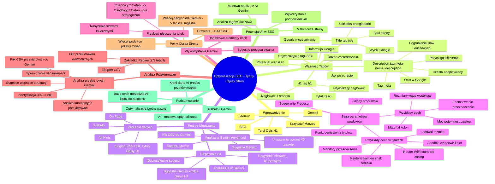

# Lekcje wideo - 3. Ulepszanie tytułów i opisów stron z AI

# 💡 Diagram

___

# 🗒️ Notatka

# Optymalizacja SEO: Ulepszanie Tytułów i Opisów Stron - Notatki i Podsumowanie 📝

## Wprowadzenie
Ta lekcja koncentruje się na optymalizacji **SEO**, łącząc aspekty treści z optymalizacją techniczną. Głównym celem jest ulepszenie strony internetowej poprzez optymalizację kluczowych tagów **SEO**: `<title>`, `<description>`, i `<h1>`. Krzysztof Marzec, ekspert **SEO** od 2005 roku, dzieli się swoją wiedzą na temat wpływu tych tagów na widoczność strony w wyszukiwarkach oraz metod ich ulepszania za pomocą narzędzi takich jak **Sitebulb** i **Gemini**.

## Dlaczego Te Tagi Są Ważne? 🤔
- **Najważniejsze tagi z punktu widzenia optymalizacji pod wyszukiwarki.**
- Informują **Google**, o czym jest strona.
- Chociaż treść, linki i aspekty techniczne są istotne, tagi `<title>`, `<description>`, i `<h1>` mają kluczowe znaczenie, aby szybko zakomunikować **Google** tematykę strony.
- **Różnią się zastosowaniem.**
- **Gdzie szukać potencjału ulepszeń?** 🔍
- **Jak pisać je lepiej?** ✍️

### Title (`<title>`) 🏷️
- **Tytuł strony:**
    - Widoczny w kodzie strony.
    - Nazwa zakładki w przeglądarce 🌐.
    - Tytuł wyniku wyszukiwania w **Google**.
- **Google** może **zmienić tytuł** w wynikach wyszukiwania, ale algorytmicznie słowa kluczowe i ich kolejność w tytule są brane pod uwagę.

### Description (`<meta name="description">`) 📜
- **Tag meta:**
    - Ukryty na stronie.
    - Często wyświetla się jako opis pod tytułem w wynikach wyszukiwania.
- **Częściej nadpisywany** przez **Google** niż `<title>`.
    - **Google** może wyświetlić fragment treści strony, który najlepiej odpowiada zapytaniu użytkownika.
- Dobrze przygotowany `<description>` **najczęściej** wyświetla się w wynikach wyszukiwania.
- **Nie jest brany pod uwagę algorytmicznie** w kontekście słów kluczowych i ich powielania (w przeciwieństwie do `<title>`).
- Słowa kluczowe w `<description>` mogą być **pogrubione** w wynikach wyszukiwania, co zwiększa klikalność.
- Główna rola `<description>` to **przyciąganie kliknięć użytkowników** 🖱️.

### H1 (`<h1>`) 📌
- **Nagłówek pierwszego stopnia (Heading One):**
    - Pierwszy z serii nagłówków (H2, H3, itd.).
    - Określa, co jest najważniejsze na stronie, stanowiąc tytuł treści.
    - Pojawia się w treści strony i jest wizualnie największym nagłówkiem.

## Proces Ulepszania Tagów SEO 🛠️
1. **Zebranie danych:** 📊
    - Użycie narzędzia **Sitebulb** - crawlera analizującego stronę pod kątem **SEO**.
    - Przejście do zakładki **All Hints** w **Sitebulb**, aby zobaczyć sugestie ulepszeń i priorytety błędów.
    - Skupienie się na zakładce **On Page** w **Sitebulb** do analizy tagów `<title>`, `<description>`, i `<h1>`.
    - Eksport danych z zakładki **URL** do pliku CSV (tytuły, opisy, H1).

2. **Analiza danych w Gemini Advanced:** 🤖
    - Załadowanie pliku CSV do **Gemini Advanced**.
    - Zapytanie **Gemini** o **przeanalizowanie tytułów** i ulepszenie tych, które mają **mniej niż 40 znaków**.
    - **Gemini** potrafi zidentyfikować kolumnę z tytułami w pliku CSV.
    - **Gemini** sugeruje ulepszenia, dodając słowa kluczowe, kontekst, markę (np. "Era Innowacji gra planszowa Portal Games").
    - **Gemini** wyjaśnia, w jaki sposób ulepszył tytuły.

3. **Ulepszanie Nagłówków H1:** ⬆️
    - Analiza nagłówków H1 w **Gemini**.
    - **Gemini** sugeruje ulepszenia H1, szczególnie tych **zbyt krótkich (1-2 wyrazy)** lub **zbyt długich (np. 11 wyrazów)**.
    - System sugeruje parametry do budowania H1 i konkretne ulepszenia.
    - Należy **przemyśleć sugestie Gemini** i dostosować je do wyglądu i kontekstu strony.
    - Sugestie **Gemini** mają na celu nasycenie H1 słowami kluczowymi.

## Budowanie Własnego Procesu Tworzenia Tytułów i Opisów 🏗️
- **Stworzenie bazy parametrów produktów:** 🗄️
    - Najczęstsze elementy tytułów i opisów produktów to baza ich cech.
    - Przykłady cech:
        - Rozmiary, wysokość, waga
        - Materiał, kolor
        - Moc, pojemność, zasięg
        - Zastosowanie i przeznaczenie
- Baza cech jako punkt odniesienia przy pisaniu tytułów.
- **Przykłady cech w tytułach:** 💡
    - **Lodówki:** podkreślenie wysokości, szerokości, wagi.
    - **Spodnie dżinsowe:** dodanie koloru (czarne, niebieskie, zielone).
    - **Biżuteria:** opisanie kamienia, ewentualnie znaku zodiaku, cech przypisywanych kamieniom.
    - **Router WiFi:** standard WiFi, zasięg.
    - **Monitory:** przeznaczenie (dla grafików, do grania, do nauki).

## Wykorzystanie Gemini do Rozwoju Procesu 🚀
- Zapytanie **Gemini** o **sugestie dotyczące procesu pisania tytułów i H1**.
- **Gemini** podpowiada dodatkowe elementy do listy cech i ich zastosowanie.
- **Przykład ulepszenia tytułu:** ✨
    - Zamiast "Osadnicy z Catanu" -> "Osadnicy z Catanu gra strategiczna dla trzech czterech graczy".
    - Dodanie "gra strategiczna" i "dla trzech czterech graczy" nasyca tytuł słowami kluczowymi, które użytkownicy mogą wyszukiwać.

## Analiza Przekierowań (Redirects) 🔄
1. **Zakładka Redirects w Sitebulb:** 📍
    - Użycie filtra pokazującego przekierowania **wewnątrz strony**.
    - Eksport listy przekierowań do pliku CSV.

2. **Analiza przekierowań w Gemini:** 🔍
    - Załadowanie pliku CSV z przekierowaniami do **Gemini** (wraz z wcześniejszym plikiem struktury strony).
    - Zapytanie **Gemini** o **sprawdzenie sensowności przekierowań**.
    - **Gemini** identyfikuje **przekierowania 302 (tymczasowe)**, które powinny być **przekierowaniami 301 (stałe)** dla ważnych stron.
    - Zapytanie o konkretne przekierowanie, np. "kategoria gry planszowe przekierowuje do strony głównej" i prośba o sugestie ulepszeń.
    - **Gemini** analizuje strukturę strony i sugeruje przekierowanie starej kategorii "gry planszowe" do nowej, właściwej kategorii.

## Pełny Obraz Strony i Dodatkowe Dane 🌐
- Crawlery (**Sitebulb**, **Screaming Frog**) mogą być łączone z **Google Analytics 4** lub **Google Search Console**.
- Pozwala to na wykrycie **większej liczby podstron i przekierowań**, szczególnie po migracjach strony.
- Więcej danych dla **Gemini** oznacza **więcej i lepszych sugestii** dotyczących optymalizacji przekierowań.

## Potencjał Analizy SEO ze Wsparciem AI 🧠
- Analiza tagów `<title>`, `<description>`, i `<h1>` jest kluczowa dla optymalizacji **SEO**.
- Potencjał masowej analizy i ulepszeń ze wsparciem **AI** (**Gemini**) jest ogromny, zarówno dla małych stron, jak i dużych systemów.
- Warto wykorzystać podpowiedzi crawlerów i narzędzi **AI** do dalszej optymalizacji **SEO**.

## Podsumowanie 🎯
Lekcja podkreśla znaczenie optymalizacji tagów `<title>`, `<description>`, i `<h1>` dla **SEO**. Prezentuje praktyczne podejście do ulepszania tych tagów za pomocą narzędzi **Sitebulb** i **Gemini Advanced**. Kluczowe kroki obejmują zbieranie danych o stronie, analizę tagów za pomocą **AI**, budowanie procesu tworzenia lepszych tytułów i opisów na bazie cech produktów, oraz analizę przekierowań. Wykorzystanie **AI** w procesie **SEO** pozwala na masową optymalizację i identyfikację obszarów do poprawy, co przekłada się na lepszą widoczność strony w wyszukiwarkach i większy ruch organiczny. Stworzenie bazy cech produktów i regularne korzystanie z narzędzi analitycznych i **AI** to klucz do sukcesu w optymalizacji **SEO**.

___

# 🔉 Transcript
File: Lekcje wideo - 3. Ulepszanie tytułów i opisów stron z AI.mp4 
[00:00:00] Ekran: Białe tło.
[00:00:05] Ekran: Logo "Umiejętności Jutra AI". Pod spodem "Organizator: Google" oraz "Partner edukacyjny: SGH".
[00:00:05] Cześć, witaj w kolejnej lekcji, w której będziemy skupiać się na optymalizacji SEO.
[00:00:10] Tym razem łączymy mocno treści z techniczną optymalizacją.
[00:00:14] Ekran: Krzysztof Marzec w garniturze przed mikrofonem. Po prawej stronie pojawia się okno z napisem "Ulepszanie tytułów i opisów stron".
[00:00:15] Ja nazywam się Krzysztof Marzec, SEO zajmuję się od 2005 roku i będę dzisiaj starał się podzielić z tobą wiedzą, która pozwoli ci znacznie ulepszyć stronę.
[00:00:25] To wiedza, która może się skalować, ponieważ im większa jest twoja strona i więcej posiadasz treści, tym ważniejsze będą tagi, takie jak title, description czy H1 w kontekście tego, jaką widoczność możesz osiągnąć.
[00:00:40] Ekran: Krzysztof Marzec w garniturze przed mikrofonem. Po prawej stronie pojawia się okno z napisem "Dlaczego o tym mówimy? Najważniejsze tagi z punktu widzenia optymalizacji pod wyszukiwarki. Uwaga: różnią się zastosowaniem. Gdzie szukać potencjału? Jak pisać je lepiej? Title Description H1".
[00:00:40] Te trzy tagi to najważniejsze elementy, które wskazują o tym, o czym jest strona.
[00:00:47] Oczywiście wiemy, że treść na stronie jest super ważna, ktoś inny powie, że linki są ważne, inna osoba powie o przygotowaniu technicznym i braku błędów, ale pod kątem tego, jaki element treści jest najważniejszy, żeby szybko Google'owi powiedzieć, o czym jest dana strona, tagi nie mają sobie równych.
[00:01:04] Title to tytuł strony, który jest widoczny w kodzie strony, na nazwie zakładki w przeglądarce, ale w samej wyszukiwarce jest właśnie tytułem wyniku wyszukiwania.
[00:01:17] Czasem Google potrafi ten tytuł dla nas zmienić, zoptymalizować go w inny sposób, więc nie będzie w wynikach wyszukiwania jeden do jeden ten, który mamy ustawiony na stronie, ale uwaga, mimo tego algorytmicznie to, co jest w tym tytule wpisane przez nas, słowa kluczowe i ich kolejność, będzie brana pod uwagę właśnie tak, jak to jest w źródle strony.
[00:01:39] Description to zupełnie inny tag.
[00:01:42] Jest elementem meta, czyli ukrytym na stronie i uwaga, będzie wyświetlał się w wynikach wyszukiwania często jako opis, czyli pod wspomnianym wcześniej tytułem.
[00:01:54] Ale tu znacznie częściej będzie nadpisywany, czyli w Google w wynikach wyszukiwania będzie się pojawiało coś, co jest najlepszym otoczeniem treści dookoła naszego poszukiwanego słowa kluczowego.
[00:02:07] Czyli zamiast opisu może się pokazać coś, co jest bardziej precyzyjnie dobrane.
[00:02:12] Ale uwaga, w przypadku słów kluczowych, dla których opis jest dobrze przygotowany, najczęściej właśnie będzie pojawiał się opis, tak, description.
[00:02:20] I tu mała podpowiedź, w przeciwieństwie do title, description nie jest brany pod uwagę w samym algorytmicznym w kontekście występowania słów kluczowych czy ich powielania.
[00:02:31] Będzie to dla nas ważne troszkę, dlatego że jeśli dane słowo kluczowe, którego szukamy występuje w opisie, to mamy szansę na to, żeby było pogrubione w wynikach wyszukiwania, czyli znowu podkreślamy rolę opisu jako to, co przyciąga kliknięcia użytkowników.
[00:02:47] No i na koniec tag H1.
[00:02:49] H1, czyli skrócenie od heading one, nagłówek pierwszego stopnia, on będzie pierwszym z serii nagłówków, potem jest H2, H3 i tak dalej, które mówią o tym, treść to jest tytuł tej strony, to jest coś, co jest najważniejsze, ale uwaga, H1 już na stronie pojawia się w treści i najczęściej wizualnie to po prostu największy nagłówek, który możemy spotkać.
[00:03:13] W tej lekcji skupimy się na tym, gdzie szukać potencjału rozwoju, ulepszania tych tagów oraz jak pisać je lepiej z Gemini.
[00:03:22] Pierwsze, co będziemy musieli zrobić, to zebrać dużą ilość danych.
[00:03:26] Użyjemy do tego celu narzędzia Sitebulb.
[00:03:28] Ekran: Krzysztof Marzec w garniturze przed mikrofonem. Po prawej stronie znika okno z napisem "Proces".
[00:03:29] Ekran: Aplikacja Sitebulb.
[00:03:29] Sitebulb to prosty crawler, czyli narzędzie, które pozwala przemierzać całą stronę, poruszać się po niej tak jak roboty Google po konkretnych linkach wewnątrz tej strony i pozwala nam przeanalizować tą stronę pod kątem ogromnej ilości danych, analizy parametrów SEO i tu w tym trochę przyspieszonym procesie znajdziemy odpowiedzi na wiele pytań, jak daną stronę ulepszyć.
[00:03:53] Ja wybrałem jedną z przykładowych stron, polecam ci zaglądnięcie na samym początku tej analizy do zakładki All Hints i sprawdzenie, co system podpowiada nam do ulepszania.
[00:04:05] Zakładka All Hints również zawiera priorytety, czyli podkreśla coś, co jest dużym błędem, albo na przykład jest okazją do ulepszeń.
[00:04:14] Dziś będziemy skupiać się na zakładce On Page i tam będziemy analizować nasze tagi.
[00:04:20] Najważniejsze tagi, czyli title, description, H1.
[00:04:24] W tej zakładce możesz przejść również do podpowiedzi, hints, ale również do parametrów URL i wyeksportować je wszystkie do dalszej analizy.
[00:04:34] Dowiesz się, które tytuły są za krótkie, za długie, gdzie są powielone lub na przykład jest wiele nagłówków H1 na stronie, albo na przykład brakuje ich zupełnie.
[00:04:46] Ja wyeksportowałem w pliku CSV całą listę wszystkich podstron, które zostały wykryte w tym skanie i będę je teraz starał się przetwarzać w Gemini.
[00:04:57] Ekran: Aplikacja Gemini Advanced.
[00:04:58] Za każdym razem kiedy zadajesz pytanie w Gemini, możesz dodać tam również konkretny plik, jakieś zdjęcie, a tak jak mój przypadek pokazuje, możesz dodać również całą bazę danych.
[00:05:10] Tutaj w prostym formacie CSV.
[00:05:12] Na podstawie tego pliku poprosiłem Gemini o przeanalizowanie wszystkich tytułów.
[00:05:17] On sam sobie, zauważ, poradzi ze znalezieniem informacji, gdzie ten tytuł jest.
[00:05:22] Mogę to oczywiście opisywać lepiej, kiedy ten plik ma gorszą strukturę i poprosiłem go o ulepszenie tych, które mają mniej niż 40 znaków.
[00:05:31] To jest też podpowiedź, którą daje Sitebulb, że jeśli masz tytuł na mniej niż 40 znaków, to być może da się go napisać lepiej.
[00:05:41] Lepiej pod kątem dodania kolejnych słów kluczowych, dodania kontekstu, który spowoduje lepszą klikalność tego wyniku albo lepszą widoczność, czyli nasycenie słów kluczowych w tym wyniku wyszukiwania.
[00:06:00] Zwróć uwagę na propozycje, jakie daje Gemini.
[00:06:05] Są one świetne.
[00:06:07] Załóżmy nazwa Era Innowacji wnosi tylko konkretną informację o tytule tej gry.
[00:06:11] Ale jeżeli ktoś szuka Era Innowacji, może czasem dopisać planszówka, gra planszowa, możemy uzupełnić kontekst i powiedzieć dokładnie, o czym jest nasza strona dopisując go do tytułu.
[00:06:20] System zaproponował nam wiele różnych ulepszeń.
[00:06:24] W niektórych przypadkach dopisał nazwę tego, co znalazł, a w innych przypadkach dopisał markę, czyli tutaj Portal Games po to, aby wyróżnić się tą marką na tle innych wyników wyszukiwania.
[00:06:30] Zresztą na sam koniec Gemini dokładnie tłumaczy, w jaki sposób ulepszał wspomniane tytuły.
[00:06:42] Zróbmy teraz podobny eksperyment, ale z nagłówkami H1.
[00:06:47] Z nagłówkami H1 bardzo często większe okazje mamy wtedy, kiedy w samej H1 jest coś, co ma tylko jeden lub dwa wyrazy, tam jest szansa do ulepszania.
[00:06:57] Natomiast jeżeli jest tych wyrazów za dużo, w moim przypadku 11, również to podpowiedź z narzędzia Sitebulb, wtedy bardzo często coś nie tak.
[00:07:06] Ten tytuł będzie zbyt długi i być może część tego, co jest w tytule powinno trafiać do treści.
[00:07:12] System podpowiedział mi konkretne parametry, którymi powinienem sugerować się przy budowaniu H1 i podpowiedział mi, jak te H1 mogę ulepszyć.
[00:07:23] I tu uwaga, ze względu na to, jak twoja strona wygląda, możesz zgodzić się lub nie zgodzić się zupełnie z tymi sugestiami.
[00:07:33] Warto to dobrze przemyśleć.
[00:07:35] Jeżeli na twojej stronie ładnie wygląda to, że pojawia się nazwa produktu, zostaw tak jak jest.
[00:07:40] System, który podpowiada, że powinna tam być dopisana gra planszowa, sugeruje się tym, że może w ten sposób jeszcze bardziej nasycić tym kontekstem słowem kluczowym swoje wyniki.
[00:07:50] Ekran: Krzysztof Marzec w garniturze przed mikrofonem. Po prawej stronie znika okno z napisem "Proces".
[00:08:14] Kiedy mówimy o procesie, to zastanów się, jak wykorzystać to, co podpowiada nam Gemini do tego, żeby zrobić swój idealny proces tworzenia właśnie nagłówków i tytułów.
[00:08:23] Ekran: Krzysztof Marzec w garniturze przed mikrofonem. Po prawej stronie pojawia się okno z napisem "Proces. Zbuduj własny proces. Najczęstsze elementy tytułów czy opisów produktów to baza ich cech. Idealny proces tworzenia nowych opisów korzysta z tej bazy i stara się stale ją rozwijać. Przykłady: rozmiary, wysokość, waga; materiał, kolor; moc, pojemność, zasięg; zastosowanie i przeznaczenie".
[00:08:23] Jeżeli będziemy cały czas próbowali je generować, to będzie to bardzo czasochłonne.
[00:08:29] Za każdym razem zadawanie pytania, musimy mieć jakąś swoją podstawę.
[00:08:33] Warto stworzyć taką bazę parametrów, które najczęściej opisują twoje produkty, bo to one w kontekście nazwy tego produktu będą powodowały lepszą widoczność na kolejne słowa kluczowe.
[00:08:53] Ta baza cech będzie stanowiła znakomite, znakomity punkt odniesienia podczas pisania kolejnych tytułów.
[00:09:01] Zwróć uwagę, że jeśli opisujesz lodówki, to musisz odnieść się do ich wysokości, bo lodówek szukamy po tym, jak wpasują się w naszą już gotową kuchnię albo w jakiś projekt kuchni.
[00:09:10] I teraz jest to podpowiedź, którą możesz zastosować na podstawie opisu, ale również budowania samych kategorii i filtrów tych kategorii.
[00:09:17] Możesz nasycić jeszcze lepiej sam opis lodówki, wyróżniając właśnie jej wysokość, szerokość, wagę i tak dalej.
[00:09:26] Bardzo często w tytułach podkreślamy takie cechy jak materiał, z jakiego wykonany jest produkt czy jego kolor.
[00:09:33] Zamiast opisu spodnie dżinsowe, dodajmy czarne spodnie dżinsowe albo spodnie dżinsowe niebieskie, zielone i tak dalej, ułatwimy ich wyszukiwanie.
[00:09:42] Ktoś powie, można wyszukiwać po obrazach, ale jednak większość wyszukiwań będzie odbywała się w formie tekstowej.
[00:09:50] Pamiętajmy również o tym, że ten nasz materiał czy kolor może oznaczać wiele dodatkowych cech.
[00:09:55] Na przykład, kiedy sprzedajesz biżuterię, analiza tytułów powinna obejmować takie parametry jak kamień, który znajduje się w biżuterii, powinien być opisany, ale również kamień może mieć dla niektórych jeszcze inne znaczenie.
[01:00:09] Widziałem sklepy, które zyskiwały dodatkową widoczność przypisując kamienie do konkretnych znaków zodiaku albo do konkretnych cech, które chcemy, żeby dana biżuteria podkreślała.
[01:00:21] Możemy iść dalej, analizując całą niszę, analizując materiały, nagle odkryjemy, że powinniśmy bardzo mocno podkreślać cechy takie jak pojemność, zasięg.
[01:00:30] Wyobraź sobie, że opisujesz router WiFi.
[01:00:35] Podkreślmy, który standard WiFi obejmuje ten router, nawet jeśli tego nie ma w jego nazwie, albo podkreślmy jego zasięg, jeżeli to jest router, który wyróżnia się właśnie jakimś bardzo dużym zasięgiem i może pokryć całe mieszkanie albo działać w trudnych warunkach w biznesie.
[01:00:52] Na koniec przemyśl pisanie tytułów pod kątem zastosowania czy przeznaczenia danego produktu.
[01:00:58] Na przykład wrzucamy nazwę, krótką nazwę danego monitora, dopisujemy doskonały dla grafików albo dla profesjonalistów, do nauki, do grania i tak dalej.
[01:01:10] Dzięki takiemu podejściu, takiej liście cech, którą zbudujesz tworząc kolejne tytuły, za każdym razem budując nowy będziesz miał, miała łatwiejsze zadanie.
[01:01:13] Ekran: Krzysztof Marzec w garniturze przed mikrofonem. Po prawej stronie znika okno z napisem "Proces. Zbuduj własny proces. Najczęstsze elementy tytułów czy opisów produktów to baza ich cech. Idealny proces tworzenia nowych opisów korzysta z tej bazy i stara się stale ją rozwijać. Przykłady: rozmiary, wysokość, waga; materiał, kolor; moc, pojemność, zasięg; zastosowanie i przeznaczenie".
[01:01:13] Ekran: Aplikacja Gemini Advanced.
[01:01:13] Ale spokojnie, w tym procesie znowu nie jesteśmy sami.
[01:01:13] Możemy po prostu zapytać Gemini, co powinniśmy jeszcze uwzględnić w procesie pisania tytułów i tych ukrytych tytułów title i nagłówków na stronie H1, żeby były bardziej nasycone.
[01:01:35] System nie tylko podpowie nam przykłady rzeczy, które dorzucimy do naszej listy, ale również pokaże nam zastosowanie.
[01:01:46] Na przykład opisując grę Osadnicy z Catanu trzech czterech graczy, użyjemy szerszej formy.
[01:01:53] Osadnicy z Catanu gra strategiczna dla trzech czterech graczy.
[01:01:59] Wyobraź sobie teraz użytkownika, który szuka gry strategiczne planszowe dla czterech graczy, znajduje idealną odpowiedź.
[01:02:10] Wcześniej to słowo gra strategiczna czy nawet gra planszowa mogło nie istnieć zupełnie ani w tytule, ani w innych parametrach opisu tego produktu.
[01:02:20] Niestety bardzo często oczywiste rzeczy pomijamy.
[01:02:24] A tu w procesie optymalizacji pod kątem wyszukiwarek musimy koniecznie je uwzględniać w treści.
[01:02:47] Ekran: Krzysztof Marzec w garniturze przed mikrofonem. Po prawej stronie znika okno z aplikacją Gemini Advanced.
[01:02:47] Ekran: Aplikacja Sitebulb.
[01:02:47] Ja na tapet wziąłem zakładkę przekierowania, redirects.
[01:03:00] Użyłem specjalnego filtra, które pokazuje tylko przekierowania wewnątrz tej strony, czyli nie mówi o linkach wychodzących, które zostały przekierowane.
[01:03:10] Wyeksportowałem całą tą listę, wrzuciłem do Gemini i poprosiłem, aby sprawdził, czy te przekierowania, które tam są mają sens.
[01:03:21] Ekran: Krzysztof Marzec w garniturze przed mikrofonem. Po prawej stronie znika okno z aplikacją Sitebulb.
[01:03:21] Ekran: Aplikacja Gemini Advanced.
[01:03:21] Na podstawie dwóch plików, czyli pierwszego, który obejmuje całą strukturę wcześniej wyeksportowanych adresów URL razem z tytułami, H1 i opisami description, czyli takimi, które będą mówiły o tym, co na tej stronie jest, system dodatkowo dostaje listę tych przekierowań, czyli na jaki adres ktoś trafił i gdzie zostało to przekierowane i podpowiada mi od razu bardzo ciekawe rzeczy.
[01:03:53] Osoba początkująca w SEO mogłaby przeoczyć, że pojawia się tam przekierowanie 302.
[01:04:00] To jest przekierowaniem tymczasowym.
[01:04:04] Jeżeli jest to jakaś ważna strona, która miała wcześniej linki, powinna być przekierowana w nowe miejsce za pomocą przekierowania 301.
[01:04:10] Gemini świetnie mi to podpowiedział tutaj.
[01:04:16] Mogę zapytać też o konkret.
[01:04:20] Mam dziwne przekierowanie kategoria gry planszowe przekierowuje do strony głównej.
[01:04:24] To jest okej pod kątem SEO, ale zapytam Gemini, czy da się to zrobić lepiej.
[01:04:29] System znowu przeanalizuje całą strukturę strony, bo dostał ode mnie ją wcześniej w tym pliku i zaproponuje mi konkretne rozwiązanie.
[01:04:40] Mamy teraz nową kategorię gry planszowe i faktycznie przy dobrym przekierowaniu tam powinienem przekierować starą kategorię.
[01:04:51] Być może tych miejsc jest więcej.
[01:04:53] Zwróć uwagę, że przekierowania, o których mówię tutaj pochodzą z analizy struktury strony.
[01:05:00] Kiedy tworzymy przekierowanie na przykład nazwę adresu URL konkretnej kategorii zmieniamy na inną, ono już nie powinno występować w samym przekierowaniu, czyli jest jak gdyby poza systemem, nie będzie wykryte przy skanie strony.
[01:05:10] Dlatego podpowiadam ci, że jeśli chcesz mieć pełen obraz swojej strony, to w narzędziach w crawlerach, takich jak Screaming Frog czy Sitebulb, używaj dodatkowych danych.
[01:05:20] Na przykład łącz je z Google Analytics 4 czy z Google Search Console.
[01:05:28] Gwarantuję ci, jeśli twoja strona ma już za sobą miesiące czy lata istnienia, to wykryjesz znacznie więcej podstron, szczególnie jeśli za tobą były jakieś migracje, czyli zmiana konkretnego systemu, na którym ta strona działa.
[01:05:50] Wtedy wykryjesz jeszcze więcej przekierowań, a system Gemini będzie miał jeszcze większe pole do popisu w podpowiedziach dla ciebie, jak te przekierowania poprawić.
[01:06:00] Mam nadzieję, że widzisz teraz znacznie większy potencjał w analizie tych niezwykle ważnych parametrów jak title, description czy H1 w kontekście optymalizacji swojej strony czy bardzo dużego systemu czy mniejszej strony wizytówki, ale nawet sklepów internetowych i widzisz również potencjał, że po tej analizie, kiedy tylko znajdziesz czas, warto zabrać się za inne podpowiedzi, które mogą dawać tobie crawlery czy inne narzędzia SEO właśnie przy masowej analizie ze wsparciem AI.
[01:07:47] Życzę samych sukcesów i pierwszych pozycji.
[01:07:52] Cześć.
[01:08:00] Ekran: Logo "Umiejętności Jutra AI". Pod spodem "Organizator: Google" oraz "Partner edukacyjny: SGH".

___
# 🏷️ Tags
#SEO
#tytuł_strony
#title
#description
#H1
#tagi_SEO
#optymalizacja_SEO
#Sitebulb
#Gemini
#Gemini_Advanced
#crawler
#słowa_kluczowe
#wyniki_wyszukiwania
#nagłówek_pierwszego_stopnia
#heading_one
#All_Hints
#On_Page
#URL
#CSV
#analiza_danych
#ulepszanie_tytułów
#ulepszanie_H1
#parametry_produktów
#baza_cech
#przekierowania
#redirects
#Google
#Google_Analytics_4
#Google_Search_Console
#Screaming_Frog
#AI
#ruch_organiczny
#Krzysztof_Marzec
#widoczność_strony
#optymalizacja_techniczna
#treść_strony
#linki
#algorytm_Google
#meta_tag
#kliknięcia_użytkowników
#nagłówki
#błędy_SEO
#priorytety
#eksport_danych
#analiza_tytułów
#analiza_opisów
#marka
#proces_tworzenia_tytułów
#proces_tworzenia_opisów
#rozmiary
#wysokość
#waga
#materiał
#kolor
#moc
#pojemność
#zasięg
#zastosowanie
#przeznaczenie
#standard_WiFi
#gra_strategiczna
#przekierowania_302
#przekierowania_301
#migracje_strony
