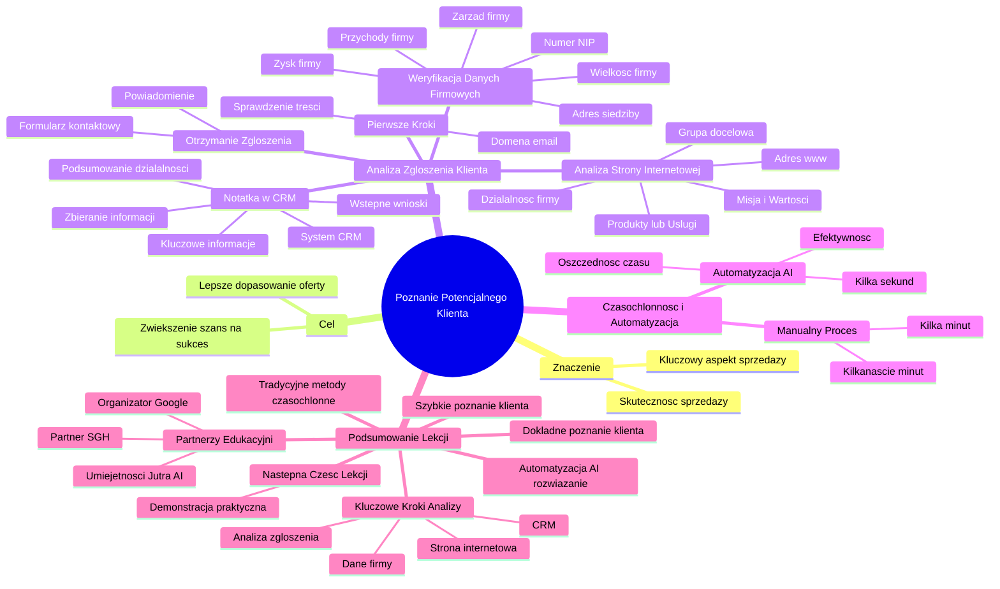

# Lekcje wideo - 1. Kim jest Twój przyszły klient - wstęp

# 💡 Diagram

___

# 🗒️ Notatka

# Notatki i Podsumowanie Lekcji: Poznanie Potencjalnego Klienta 🤝

## Wprowadzenie

Ta lekcja koncentruje się na kluczowym aspekcie sprzedaży: **poznaniu potencjalnego klienta**. Zrozumienie profilu firmy, która wysyła zapytanie o współpracę, jest absolutnie niezbędne dla skutecznych działań sprzedażowych. Szybka i efektywna analiza profilu klienta umożliwia lepsze dopasowanie oferty i zwiększa szanse na sukces.

## Analiza Zgłoszenia Klienta - Krok po Kroku 👣

### Otrzymanie Zgłoszenia i Pierwsze Kroki

- **Scenariusz:** Otrzymujesz powiadomienie o wypełnieniu formularza kontaktowego na stronie internetowej.
- **Pierwsza czynność:** Sprawdzenie treści zgłoszenia.
- **Kluczowy element:** Domena w adresie e-mail klienta. Na jej podstawie wstępnie określa się, z jaką firmą mamy do czynienia.

### Analiza Strony Internetowej Klienta 🌐

- **Działanie:** Skopiowanie adresu strony internetowej (www) z domeny do przeglądarki.
- **Cel:** Wejście na stronę i dogłębna analiza działalności firmy.
- **Co analizować?**
    - Czym dokładnie zajmuje się firma?
    - Oferowane produkty lub usługi.
    - Misja i wartości firmy (jeśli są dostępne).
    - Grupę docelową klienta (jeśli można określić).

### Przygotowanie Notatki w Systemie CRM 🗂️

- **Znaczenie notatek:** Zbieranie wszystkich istotnych informacji o nowych leadach jest kluczowe.
- **Proces:** Na podstawie analizy strony internetowej przygotowuje się notatkę.
- **Miejsce zapisu:** System `CRM` (Customer Relationship Management).
- **Zawartość notatki:**
    - Podsumowanie działalności firmy.
    - Kluczowe informacje o ofercie.
    - Wstępne wnioski dotyczące potencjalnej współpracy.

### Weryfikacja Wielkości Firmy i Danych Firmowych 📊

- **Kryterium wielkości:** Preferowana jest współpraca z firmami o odpowiedniej wielkości.
- **Działanie:** Znalezienie numeru NIP firmy na stronie internetowej klienta.
- **Wykorzystanie NIP:** Sprawdzenie w sieci danych firmy, takich jak:
    - **Przychody** firmy.
    - **Zysk** firmy.
    - **Adres siedziby**.
    - **Zarząd firmy** (informacje o osobach zarządzających).

### Czasochłonność Procesu i Automatyzacja ⏱️

- **Czasochłonność manualna:** Wszystkie opisane czynności mogą zająć **od kilku do kilkunastu cennych minut**.
- **Rozwiązanie:** **`AI` i automatyzacja**.
- **Korzyści z `AI` i Automatyzacji:**
    - Możliwość wykonania tych samych czynności **w kilka sekund**.
    - Znaczna oszczędność czasu.
    - Zwiększenie efektywności procesu pozyskiwania informacji o klientach.

### Zaproszenie do Kolejnej Części 🚀

- **Cel:** Praktyczne pokazanie działania automatyzacji z wykorzystaniem `AI`.
- **Zapowiedź:** Kolejna część lekcji będzie poświęcona demonstracji praktycznej.
- **Informacje na ekranie:** "Umiejętności Jutra AI", "Organizator Google", "Partner edukacyjny SGH" - wskazanie partnerów edukacyjnych i tematyki szkolenia.

## Podsumowanie

Lekcja podkreśla **znaczenie szybkiego i dokładnego poznania potencjalnego klienta** w procesie sprzedaży. Tradycyjne, manualne metody zbierania informacji o firmie mogą być czasochłonne. **Automatyzacja z wykorzystaniem `AI`** stanowi rozwiązanie, które pozwala na znaczne przyspieszenie tego procesu, oszczędzając cenny czas 🕰️ i zwiększając efektywność działań sprzedażowych. Kluczowe kroki to analiza zgłoszenia, strony internetowej klienta, zapisywanie notatek w `CRM` oraz weryfikacja danych firmy. Wszystkie te etapy można zoptymalizować dzięki nowoczesnym technologiom. Następna część lekcji ma na celu zademonstrowanie, jak te procesy mogą być zautomatyzowane w praktyce.

___

# 🔉 Transcript
File: Lekcje wideo - 1. Kim jest Twój przyszły klient - wstęp.mp4 
[00:00:05] Witaj w pierwszej lekcji.
[00:00:07] W tej części skupimy się na poznaniu twojego nowego potencjalnego klienta.
[00:00:11] Szybkie zrozumienie tego kim jest i czym zajmuje się firma, która właśnie zgłosiła się do nas z zapytaniem o współpracę jest absolutnie kluczowe dla skuteczności naszej sprzedaży.
[00:00:23] Wyobraź sobie ten moment, w którym otrzymujesz powiadomienie, że ktoś wypełnił formularz na twojej stronie.
[00:00:29] Musisz zobaczyć treść zgłoszenia i najczęściej na podstawie domeny zawartej w adresie email określić z kim w ogóle masz do czynienia.
[00:00:37] Kopiujesz adres www do przeglądarki, wchodzisz na daną stronę internetową i analizujesz czym zajmuje się firma, która właśnie postanowiła się do ciebie zgłosić.
[00:00:47] Wiesz jak istotne jest zbieranie wszystkich informacji o nowych leadach, więc na podstawie treści strony przygotowujesz notatkę, w której zapisujesz w systemie CRM.
[00:00:58] Dodatkowo wiesz, że najlepiej współpracujecie się z firmami odpowiedniej wielkości.
[00:01:04] Na stronie znajdujesz więc numer NIP i postanawiasz sprawdzić w sieci jakie przychody ma dana firma i ile wynosi jej zysk, a także przy okazji poznać adres siedziby oraz być może sprawdzić kto jest w zarządzie.
[00:01:17] Te wszystkie czynności z powodzeniem mogą zabrać ci kilka lub kilkanaście cennych minut, a dzięki AI i automatyzacji mogą zadziać się same w kilka sekund.
[00:01:27] Jeśli chcesz zobaczyć jak to wygląda w praktyce, zapraszam do kolejnej części.
[01:32:00] (Na ekranie wyświetla się napis "Umiejętności Jutra AI" pod spodem "Organizator Google" i "Partner edukacyjny SGH")

___
# 🏷️ Tags
#poznanie_klienta #potencjalny_klient #analiza_klienta #profil_klienta #działania_sprzedażowe #zgłoszenie_klienta #formularz_kontaktowy #domena_email #strona_internetowa #analiza_strony_internetowej #działalność_firmy #produkty_usługi #misja_firmy #wartości_firmy #grupa_docelowa #system_CRM #notatki_CRM #lead #dane_firmowe #numer_NIP #przychody_firmy #zysk_firmy #adres_siedziby #zarząd_firmy #czasochłonność #automatyzacja #AI #sztuczna_inteligencja #efektywność #optymalizacja_procesu #Umiejętności_Jutra_AI #Organizator_Google #Partner_edukacyjny_SGH
