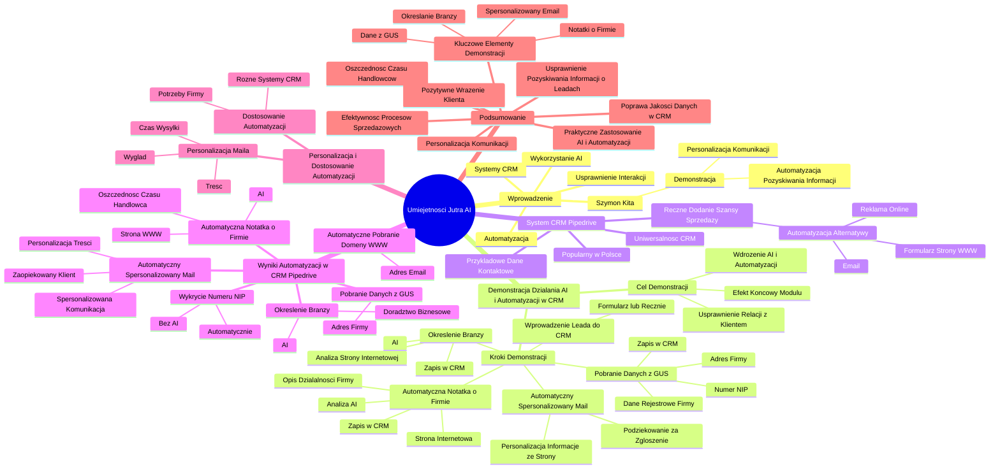

# Lekcje wideo - 2. Kim jest Twój przyszły klient - przygotowanie narzędzia

# 💡 Diagram

___

# 🗒️ Notatka

# Umiejętności Jutra AI: Notatki i Podsumowanie

## Wprowadzenie

Wprowadzenie omawia wykorzystanie **sztucznej inteligencji (AI) 🤖** i **automatyzacji ⚙️** w systemach **CRM (Customer Relationship Management) 💼**, koncentrując się na usprawnieniu pierwszych interakcji z potencjalnymi klientami. Szymon Kita prezentuje praktyczną demonstrację automatyzacji procesu pozyskiwania informacji o leadach 👤 i personalizacji komunikacji.

## Demonstracja Działania Sztucznej Inteligencji i Automatyzacji w CRM

### Cel Demonstracji

* Prezentacja efektu końcowego modułu `Umiejętności Jutra AI`.
* Demonstracja wdrożenia **sztucznej inteligencji 🤖** i **automatyzacji ⚙️**.
* Usprawnienie pierwszych etapów nawiązywania relacji z nowym potencjalnym klientem.

### Kroki Demonstracji

1. **Wprowadzenie Leada 👤 do Systemu CRM 💼:**
    * Dane mogą pochodzić z formularza lub być wprowadzone ręcznie (demonstracja ręcznego wprowadzania).
2. **Automatyczne Przygotowanie Notatki o Firmie na Podstawie Strony Internetowej 🌐:**
    * Pobranie adresu strony internetowej 🌐 z adresu e-mail 📧 osoby zgłaszającej się.
    * Wykorzystanie **AI 🤖** do analizy treści strony internetowej 🌐 i stworzenia notatki opisującej działalność firmy.
    * Zapisanie notatki w systemie CRM 💼.
3. **Pobranie Danych z GUS 🏢 na Podstawie Numeru NIP:**
    * Wykrycie numeru NIP na stronie internetowej 🌐 (bezpośrednio, bez użycia **AI 🤖**).
    * Pobranie danych rejestrowych firmy z **GUS** 🏢 (Głównego Urzędu Statystycznego).
    * Zapisanie danych z GUS 🏢 (w tym adresu firmy) w systemie CRM 💼.
4. **Określenie Branży:**
    * Określenie branży firmy na podstawie analizy treści strony internetowej 🌐 (**AI 🤖**).
    * Zapisanie branży w systemie CRM 💼.
5. **Automatyczne Wysyłanie Spersonalizowanego Maila 📧 z Podziękowaniem:**
    * Wysyłka automatycznego maila 📧 z podziękowaniem za zgłoszenie.
    * Mail 📧 jest spersonalizowany na podstawie informacji ze strony internetowej 🌐 firmy.

### Demonstracja w Systemie CRM Pipedrive 💼

* System CRM **Pipedrive** 💼 użyty w demonstracji (popularny w Polsce).
* Zasady działania systemów CRM 💼 są podobne, co czyni demonstrację uniwersalną.
* Ręczne dodanie szansy sprzedaży (w praktyce proces ten może być zautomatyzowany poprzez integrację z e-mailem 📧, formularzem na stronie internetowej 🌐, reklamą online).
* Wprowadzenie przykładowych danych kontaktowych (imię, nazwisko, adres e-mail 📧 z domeną `selwise.pl`).

### Wyniki Automatyzacji w CRM Pipedrive 💼

* **Automatyczne pobranie domeny strony www 🌐** z adresu e-mail 📧.
* **Automatyczne przygotowanie notatki** opisującej działalność firmy (przy użyciu **AI 🤖**) na podstawie treści strony www 🌐.
    > Dzięki temu handlowiec nie musi ręcznie tworzyć notatek.
* **Wykrycie numeru NIP** na stronie www 🌐 (automatycznie, bez **AI 🤖**).
* **Pobranie danych z GUS 🏢** na podstawie NIP (adres firmy).
* **Określenie branży** (doradztwo biznesowe) na podstawie notatki (**AI 🤖**).
* **Automatyczne wysłanie spersonalizowanego maila 📧** z podziękowaniem.
    * Mail 📧 zawiera spersonalizowaną treść nawiązującą do działalności firmy (np. "Selwise wspomaga firmom w rozwoju sprzedaży B2B").
    > Klient od pierwszych chwil czuje się zaopiekowany i otrzymuje spersonalizowaną komunikację.

### Personalizacja i Dostosowanie Automatyzacji

* **Personalizacja maila 📧:** Treść, wygląd maila 📧, czas wysyłki (możliwość opóźnienia wysyłki, aby mail 📧 wyglądał bardziej naturalnie).
* Możliwość dostosowania **automatyzacji ⚙️** do różnych systemów CRM 💼 i potrzeb firmy.

## Podsumowanie

Prezentacja Szymona Kity demonstruje praktyczne zastosowanie **sztucznej inteligencji 🤖** i **automatyzacji ⚙️** w systemie CRM Pipedrive 💼. Pokazano, jak **automatyzacja ⚙️** może usprawnić proces pozyskiwania informacji o nowych leadach 👤 i personalizacji komunikacji już na wstępnym etapie kontaktu. Kluczowe elementy demonstracji to automatyczne generowanie notatek o firmie na podstawie strony internetowej 🌐, pobieranie danych z GUS 🏢, określanie branży oraz wysyłanie spersonalizowanych wiadomości e-mail 📧. Dzięki tym rozwiązaniom firmy mogą zaoszczędzić czas handlowców, poprawić jakość danych w CRM 💼 i zwiększyć pozytywne wrażenie u potencjalnych klientów od pierwszego kontaktu. Demonstracja podkreśla, że nawet proste wdrożenia **AI 🤖** i **automatyzacji ⚙️** mogą znacząco wpłynąć na efektywność procesów sprzedażowych.

___

# 🔉 Transcript
File: Lekcje wideo - 2. Kim jest Twój przyszły klient - przygotowanie narzędzia.mp4 
[00:00:00] (Biały ekran z pionową kreską po lewej stronie.)
[00:00:01] (Napis "Umiejętności Jutra AI" z logo AI po prawej stronie. Poniżej napisy "Organizator Google" i "Partner edukacyjny SGH".)
[00:00:05] Szymon Kita: Teraz pokażę ci efekt końcowy naszej wspólnej pracy w kolejnym module, czyli zobaczysz jak działa wdrożona sztuczna inteligencja i automatyzacja,
[00:00:14] Szymon Kita: która pomoże usprawnić pierwsze kroki w nawiązywaniu relacji z nowym potencjalnym klientem.
[00:00:21] Szymon Kita: Oto co pokażę za chwilę.
[00:00:23] Szymon Kita: Na początku wprowadzę do systemu CRM informacje o nowym lidzie.
[00:00:27] Szymon Kita: One mogą tam dotrzeć oczywiście również bezpośrednio z formularza, ja wprowadzę je ręcznie.
[00:00:32] Szymon Kita: Na początku zobaczysz przygotowanie automatycznej notatki opisującej działalność firmy na podstawie strony internetowej, którą pobierzemy z adresu email osoby zgłaszającej się,
[00:00:43] Szymon Kita: a następnie zapiszemy w systemie CRM.
[00:00:46] Szymon Kita: Następnie przejdziemy do pobrania danych z GUS na podstawie numeru NIP wykrytego na stronie internetowej i zapiszemy go wraz z dodatkowymi informacjami o firmie również ponownie w systemie CRM.
[00:00:59] Szymon Kita: Później określimy branżę, również zapiszemy ją w systemie CRM, a na koniec wyślemy maila takiego automatycznego z podziękowaniem za zgłoszenie wzbogaconego i spersonalizowanego właśnie na podstawie informacji znalezionych na stronie internetowej i to również zobaczysz.
[00:01:17] Szymon Kita: Uznałem, że wszystko o czym mówię najłatwiej będzie mi pokazać po prostu w ramach demonstracji, w związku z tym przejdźmy dalej.
[00:01:25] (Ekran systemu CRM Pipedrive. Na górze napis "Pipeline - Szanse sprzedaży".)
[00:01:25] Szymon Kita: To co widzisz teraz na ekranie, to jest system CRM Pipedrive.
[00:01:29] Szymon Kita: Tak jak wspomniałem na początku wykorzystujemy go, ponieważ jest to jeden z najpopularniejszych systemów CRM wykorzystywanych w Polsce.
[00:01:36] Szymon Kita: Natomiast w twojej firmie oczywiście możesz wykorzystywać inny system CRM lub nie wykorzystywać go w ogóle, natomiast zasady działania tego typu systemów są ogólnie rzecz ujmując dosyć podobne, więc mam nadzieję, że odnajdziesz się i to co dzisiaj będę pokazywał przeniesiesz na system z którego aktualnie ty korzystasz.
[00:01:55] Szymon Kita: Ja teraz dodam ręcznie szansę sprzedaży, natomiast musisz wiedzieć, że to co teraz wykonam ręcznie w praktyce mogłoby zadziać się również automatycznie, ponieważ ktoś mógłby wysłać maila na twoją skrzynkę mailową zsynchronizowaną z systemem CRM, ktoś mógłby wypełnić formularz na twojej stronie internetowej i prostą automatyzacją przenieślibyśmy te dane właśnie do systemu CRM albo być może nawet ktoś mógłby zobaczyć twoją reklamę internetową reklamę w internecie, uzupełnić te swoje dane i to również mogłoby bezpośrednio tutaj trafić.
[00:02:30] Szymon Kita: Te wszystkie opcje, dla wszystkich opcji działa to identycznie, ja natomiast na potrzeby tej prezentacji dodam tą szansę sprzedaży ręcznie.
[00:02:39] (Otwiera się okno "Dodaj szansę sprzedaży".)
[00:02:39] Szymon Kita: Wrzucę jakieś przykładowe informacje oczywiście o osobie kontaktowej z jakiejś tam organizacji przykład XYZ.
[00:02:48] Szymon Kita: No i właściwie dodam tylko i wyłącznie telefon, a właściwie mail, przepraszam, uzupełniając to jakąś prawdziwą domenę.
[00:02:57] Szymon Kita: Niech to będzie testowy adres @selwise.pl.
[00:03:04] Szymon Kita: Dobrze, zapiszemy sobie teraz i dodaliśmy właśnie szansę sprzedaży.
[00:03:08] Szymon Kita: Wejdziemy sobie ją w nią teraz i zobaczymy co właściwie się tutaj nam dzieje.
[00:03:14] Szymon Kita: Po pierwsze zobaczyliśmy, że mamy już określoną domenę strony www.
[00:03:19] Szymon Kita: Wszystko to zostało automatycznie pobrane z tego adresu mailowego, który zostawiliśmy, czyli wycięliśmy sobie te informacje po małpie i wstawiliśmy sobie to na tutaj do odrębnego pola strona www.
[00:03:33] Szymon Kita: Po tym, gdy ta strona www została uzupełniona, nasza automatyzacja wykonała jakby pobrała wszystkie informacje zawarte na stronie internetowej i właśnie przy pomocy modelu sztucznej inteligencji przygotowała taką notatkę.
[00:03:50] Szymon Kita: Czyli dzięki temu nie musimy już zastanawiać się i jakby wpisywać te notatki ręcznie dla naszego handlowca lub handlowiec nie musi tego robić.
[00:03:59] Szymon Kita: To się stało zupełnie automatycznie.
[00:04:03] Szymon Kita: Poza tym na stronie internetowej wykryliśmy numer NIP.
[00:04:07] Szymon Kita: To również zrobiliśmy właśnie akurat w tym przypadku bez wykorzystania sztucznej inteligencji, ale również w pełni automatycznie i taki numer NIP pozwolił nam pobrać dane z GUS-u, czyli instytucji, która przechowuje dane rejestrowe spółki.
[00:04:21] Szymon Kita: Tutaj pobraliśmy również dodatkowo jej adres.
[00:04:24] Szymon Kita: Tych danych można tutaj pobrać więcej, ale o tym powiem troszeczkę później.
[00:04:29] Szymon Kita: No i co się stało jeszcze, to tutaj akurat muszę przyznać, że ustawiłem tą wartość na sztywno na mój adres mailowy stały na potrzeby tego nagrania, ale wysłaliśmy również maila z który jest jakby spersonalizowany, czyli jakby sztuczna inteligencja odwiedziła stronę internetową i przygotowała takiego krótkiego maila z podziękowaniem za zgłoszenie i właśnie go wysłała.
[00:04:56] Szymon Kita: Możecie go tutaj zobaczyć, oczywiście można było gdyby wypełniać inaczej rozplanować tak, żeby on wyglądał ładnie i tak dalej, natomiast chciałem tutaj przekazać, że to również może się wydarzyć w pełni automatycznie.
[00:05:10] Szymon Kita: Czyli mamy szansę sprzedaży, pobieramy z adresu mailowego stronę internetową, odwiedzamy ją, razem z AI wykorzystujemy treści zawarte na stronie internetowej po to, aby przygotować notatkę, później również znajdujemy na tej stronie internetowej NIP, a na podstawie samej notatki określamy również branżę.
[00:05:34] Szymon Kita: W tym wypadku jest to doradztwo biznesowe, a później na podstawie jakby NIP-u pobieramy dodatkowe informacje, na przykład pełną nazwę firmy czy jej adres i na końcu wysyłamy tego maila, który został spersonalizowany tutaj Selwise wspomaga firmom w rozwoju sprzedaży B2B i jakby to wszystko zostało tutaj objęte, zostało to przez AI jakby napisane, w związku z tym osoba, która do nas się zgłasza już od pierwszych chwil i to dosłownie nawet sekundy po kontakcie czuje się w pełni zaopiekowana i ma tą spersonalizowaną komunikację.
[00:06:08] Szymon Kita: Oczywiście w ramach automatyzacji można ustawić to, żeby ten mail pojawił się na przykład po kilku minutach, tak żeby sprawiał wrażenie bardziej naturalnego, być może napisanego przez człowieka, a tak samo to jak on wygląda oczywiście też podlega pełnej personalizacji.
[00:06:24] Szymon Kita: Przejdźmy do kolejnego modułu.
[00:06:27] (Napis "Umiejętności Jutra AI" z logo AI po prawej stronie. Poniżej napisy "Organizator Google" i "Partner edukacyjny SGH".)

___
# 🏷️ Tags
#sztuczna_inteligencja #AI #automatyzacja #CRM #Customer_Relationship_Management #lead #Szymon_Kita #Umiejętności_Jutra_AI #Pipedrive #GUS #Główny_Urząd_Statystyczny #NIP #strona_internetowa #e-mail #personalizacja #dane_rejestrowe #branża #szansa_sprzedaży #doradztwo_biznesowe #B2B #integracja #formularz #reklama_online #domena #notatka #działalność_firmy #proces_sprzedażowy #efektywność #system_CRM
