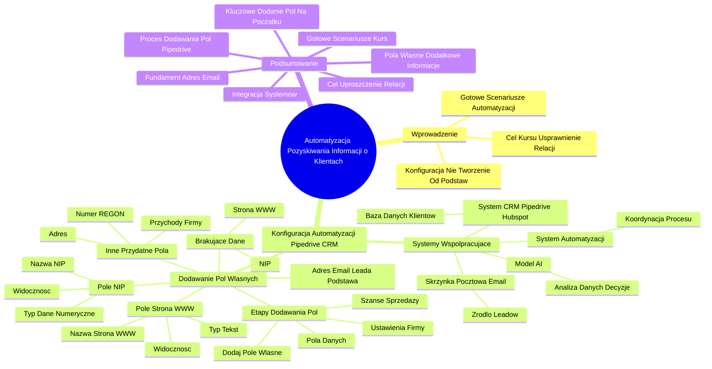

# Lekcje wideo - 3. Kim jest Twój przyszły klient - praktyka - część 1

# 💡 Diagram

___

# 🗒️ Notatka

# Notatki i Podsumowanie: Automatyzacja Pozyskiwania Informacji o Potencjalnych Klientach 🤖

## Wprowadzenie

Prezentacja wideo Szymona Kity (CEO i co-founder Let's automate) koncentruje się na praktycznym zastosowaniu automatyzacji w procesie pozyskiwania kluczowych informacji o potencjalnych klientach.  Celem kursu jest szczegółowe przedstawienie konfiguracji automatyzacji, która usprawni nawiązywanie relacji z klientami. Szymon Kita zapowiada wykorzystanie gotowych scenariuszy automatyzacji, dostępnych jako materiały dodatkowe do lekcji, co ma na celu przyspieszenie wdrożenia efektywnego rozwiązania. Kurs nie obejmuje konfiguracji automatyzacji od podstaw, lecz skupia się na omówieniu niezbędnych kroków do jej ustawienia.

## Konfiguracja Automatyzacji w Pipedrive CRM 💼

### Systemy Współpracujące w Automatyzacji

Podczas tworzenia automatyzacji, kluczowe jest uwzględnienie **współpracy wielu systemów**:

- **System CRM (np. Pipedrive, Hubspot):** Pełni rolę bazy danych klientów, umożliwiając wymianę informacji.
- **System Automatyzacji:** Odpowiada za koordynację całego procesu automatyzacji.
- **Model Sztucznej Inteligencji (AI):** Może być wykorzystany do analizy danych i podejmowania decyzji.
- **Skrzynka Pocztowa (Adres E-mail 📧):** Stanowi źródło informacji o leadach i potencjalnych klientach.

Sprawne działanie automatyzacji zależy od logicznego powiązania tych systemów.

### Dodawanie Pól Własnych w Pipedrive CRM ⚙️

Podstawą procesu jest posiadanie adresu e-mail lead'a w systemie CRM. Często jednak brakuje dodatkowych danych, takich jak strona internetowa firmy 🌐 czy numer NIP. Szymon Kita demonstruje, jak dodać te pola w systemie Pipedrive CRM.  Sposób dodawania pól może różnić się w zależności od używanego systemu CRM (np. Hubspot), lecz funkcja dodawania pól własnych jest zazwyczaj dostępna.

**Etapy dodawania pól własnych w Pipedrive CRM:**

1. **Przejdź do Ustawień Firmy:** W Pipedrive, ustawienia firmy znajdują się w prawym górnym rogu ekranu.
2. **Sekcja "Pola Danych":** W ustawieniach firmy, w sekcji "Przegląd firmy", wybierz opcję "Pola danych".
3. **Wybór sekcji "Szanse sprzedaży":** Dla uproszczenia demonstracji, pola zostaną dodane dla "Szanse sprzedaży", choć pola takie jak NIP zazwyczaj przypisuje się do "Organizacji/Firmy".
4. **Dodanie Pola Własnego:** Kliknij przycisk "Dodaj pole własne".

#### Pole NIP

- **Nazwa pola:** NIP
- **Typ pola:** Dane numeryczne (lub Liczba, jeśli dostępna)
- **Widoczność:** Zaznacz opcję widoczności pola w różnych miejscach systemu.
- **Dodaj pole.**

#### Pole Strona WWW 🌐

- **Nazwa pola:** Strona WWW
- **Typ pola:** Tekst
- **Widoczność:** Zaznacz opcję widoczności pola w różnych miejscach systemu.
- **Dodaj pole.**

#### Inne Przydatne Pola

Oprócz NIP i strony WWW 🌐, warto rozważyć dodanie innych pól, które mogą być użyteczne w procesie automatyzacji i gromadzenia informacji o klientach, na przykład:

- Przychody firmy
- Numer REGON
- Adres (choć adres może być już dostępny w Pipedrive)

Szymon Kita podkreśla, że dodanie wszystkich potrzebnych pól na tym etapie konfiguracji jest istotne, aby móc je wykorzystać w dalszej automatyzacji.

## Podsumowanie

Prezentacja stanowi wprowadzenie do praktycznego aspektu automatyzacji pozyskiwania informacji o klientach, z naciskiem na konfigurację systemu CRM Pipedrive 💼. Kluczowe wnioski to:

- Automatyzacja integruje różne systemy (CRM 💼, system automatyzacji, AI 🤖, skrzynka e-mail 📧).
- Adres e-mail lead'a w CRM 💼 jest fundamentem automatyzacji.
- Dodanie pól własnych w CRM 💼, takich jak NIP i strona WWW 🌐, umożliwia gromadzenie dodatkowych informacji o klientach.
- Zaprezentowano proces dodawania pól własnych w Pipedrive CRM 💼, z możliwością adaptacji do innych systemów CRM.
- Kluczowe jest dodanie wszystkich niezbędnych pól na początku konfiguracji ⚙️.
- Kurs wykorzystuje gotowe scenariusze automatyzacji, dostępne w materiałach dodatkowych.
- Celem jest uproszczenie i przyspieszenie procesu nawiązywania relacji z klientem poprzez automatyzację 🤖.

___

# 🔉 Transcript
File: Lekcje wideo - 3. Kim jest Twój przyszły klient - praktyka - część 1.mp4 
[00:00:04] (Ekran: Logo "Umiejętności Jutra AI". Poniżej napisy "Organizator: Google", "Partner edukacyjny: SGH")
[00:00:05] (Ekran: Szymon Kita, CEO i co-founder Let's automate)
[00:00:05] Szymon Kita: Teraz, gdy już wiesz jakie cele chcemy osiągnąć, przejdźmy do części praktycznej.
[00:00:10] W tej części pokażę ci krok po kroku jak skonfigurować cały proces automatyzacji, aby pozyskać kluczowe informacje o potencjalnym kliencie i zautomatyzować pierwsze działania.
[00:00:21] Zacznijmy od wyodrębnienia strony internetowej z adresu email, a następnie przejdziemy do kolejnych kroków.
[00:00:27] Dzięki temu zobaczysz jak te elementy współpracują w praktyce, aby uprościć i przyśpieszyć proces nawiązywania relacji z klientem.
[00:00:36] Dla uproszczenia przygotowałem gotowe scenariusze automatyzacji, które możesz wykorzystać i zastosować u siebie, a które pozwolą nam szybciej zbudować działające rozwiązanie.
[00:00:47] Znajdziesz je w materiałach dodatkowych do tej lekcji.
[00:00:50] Ja w tym nagraniu, w tym kursie, będę wykorzystywał właśnie te gotowe już scenariusze i zachęcam do zrobienia tego samego.
[00:00:59] Nie będę konfigurował tutaj całej automatyzacji od podstaw, ale przejdziemy krok po kroku przez wszystkie kroki, które będziesz musiał lub musiała wykonać te ustawiając tą automatyzację u siebie.
[00:01:12] W związku z tym zaczynajmy.
[00:01:14] (Ekran: Okno przeglądarki z otwartą stroną "Pipeline - Szanse sprzedaży" w serwisie Pipedrive. Widoczny podział na kolumny: "Zakwalifikowani", "Nawiązano kontakt", "Zaplanowano demo", "Złożono ofertę", "Rozpoczęto negocjacje". Na środku plansza z napisem "Nie dodano jeszcze żadnych szans sprzedaży")
[00:01:14] Budując automatyzację musimy wziąć pod uwagę fakt, że mamy tutaj wiele połączonych ze sobą systemów.
[00:01:21] No bo mamy system CRM, który musi nam wysyłać gdzieś jakieś informacje, zapisywać ponownie jakieś informacje.
[00:01:29] Mamy system zajmujący się tą całą automatyzacją, mamy model sztucznej inteligencji i możemy mieć jeszcze jakieś inne dodatkowe narzędzia.
[00:01:38] W tym przypadku na przykład jakby adres mailowy, a właściwie skrzynkę pocztową.
[00:01:44] Przejdźmy sobie po kolei tak żeby powiązać to wszystko logicznie ze sobą.
[00:01:50] Jeżeli pojawia nam się nowy lead i mamy zapisany jego adres mailowy to z takiej informacji wiadomo, że w systemie CRM są jakby podstawą, więc te pola powinny być tam dostępne.
[00:02:04] Natomiast już niekoniecznie możemy powiedzieć to samo w kontekście chociażby strony internetowej czy na przykład numeru NIP.
[00:02:13] Nie wiem z jakiego systemu CRM korzystasz i czy w ogóle korzystasz z systemu CRM, natomiast pokażę tutaj jak przykładowo dodać takie pole w systemie Pipedrive.
[00:02:23] Natomiast w twoim systemie, czy to będzie Hubspot czy czy jeszcze jakiś inny system CRM to może wyglądać trochę inaczej.
[00:02:31] Natomiast taka funkcja no myślę, że że jest dostępna.
[00:02:35] Jeśli chodzi o system CRM Pipedrive, musimy przejść sobie do ustawień firmy, tutaj w prawym górnym rogu.
[00:02:43] Następnie tutaj w w sekcji przegląd firmy, firmy przechodzimy w pola danych.
[00:02:50] I tutaj właściwie możemy już zacząć dodawać te pola.
[00:02:54] Ja je będę dodawał dla uproszczenia na jakby szansie sprzedaży, no bo w systemach CRM mamy osobę, firmę oraz szansę sprzedaży.
[00:03:04] Te pola powinny być dostosowane, to znaczy pole NIP powinno być zgodnie ze sztuką przypisane do organizacji, do firmy.
[00:03:12] Natomiast ja dla uproszczenia tego całego procesu przypiszę to do szansy sprzedaży.
[00:03:18] Dodaję sobie tutaj pole własne i wprowadzam sobie nazwę pola, pole na przykład NIP i mogę sobie wybrać jaki to jest typ pola, powiedzmy, że to powinno być mogę sobie poszukać.
[00:03:34] Chyba nie mam nawet liczby, ale dane numeryczne.
[00:03:37] No i co?
[00:03:39] Mogę sobie tutaj jeszcze zaznaczyć, żebym to wszędzie widział, gdzie gdzie chcę widzieć i dodaję sobie takie pole.
[00:03:48] Dodaję też inne pola, które nam będą potrzebne, no bo przechowujemy NIP, ale chcemy też przechować strona WWW.
[00:03:57] W tym wypadku dodajemy sobie tutaj tekst.
[00:04:01] Też sobie tutaj zaznaczymy, że to będzie widoczne w tych wszystkich miejscach.
[00:04:05] I potrzebujemy wszystkie te dodatkowe pola dotyczące na przykład przychodów, które chcemy przechowywać, numeru Regon, adresu, chociaż adres możemy prawdopodobnie tutaj wykorzystać, ale przez to sobie będziemy jeszcze tutaj przechodzić.
[00:04:22] Ja nie będę ci tym zanudzał.
[00:04:24] Ważne, żeby pododawać te wszystkie pola w tym momencie.
[00:01:06] (Ekran: Okno przeglądarki z otwartą stroną "Pipeline - Szanse sprzedaży" w serwisie Pipedrive. Widoczny podział na kolumny: "Zakwalifikowani", "Nawiązano kontakt", "Zaplanowano demo", "Złożono ofertę", "Rozpoczęto negocjacje". Na środku plansza z napisem "Nie dodano jeszcze żadnych szans sprzedaży")
[00:04:29] (Ekran: Okno przeglądarki z otwartą stroną "Ustawienia firmy" w serwisie Pipedrive. Widoczny podział na kolumny: "Ogólne", "Działania", "Waluty", "Powody straty". Po prawej stronie: "Nazwa firmy: Umiejętności Jutra", "Domena firmy: umiejetnoscijutra.pl", "Preferowany czas korporacyjny: UTC: Brak preferencji")
[00:04:41] (Ekran: Okno przeglądarki z otwartą stroną "Pola danych" w serwisie Pipedrive. Widoczny podział na kolumny: "Podsumowanie", "Osoba kontaktowa", "Organizacja", "Projekt". Po lewej stronie: "Pola własne", "Organizuj pola")
[00:04:41] (Ekran: Okno przeglądarki z otwartą stroną "Szanse sprzedaży" w serwisie Pipedrive. Widoczny podział na kolumny: "Zakwalifikowani", "Nawiązano kontakt", "Zaplanowano demo", "Złożono ofertę", "Rozpoczęto negocjacje". Na środku plansza z napisem "Nie dodano jeszcze żadnych szans sprzedaży")
[00:04:41] (Ekran: Okno przeglądarki z otwartą stroną "Pola danych" w serwisie Pipedrive. Widoczny podział na kolumny: "Podsumowanie", "Osoba kontaktowa", "Organizacja", "Projekt". Po lewej stronie: "Pola własne", "Organizuj pola")
[00:04:41] (Ekran: Okno przeglądarki z otwartą stroną "Szanse sprzedaży" w serwisie Pipedrive. Widoczny podział na kolumny: "Zakwalifikowani", "Nawiązano kontakt", "Zaplanowano demo", "Złożono ofertę", "Rozpoczęto negocjacje". Na środku plansza z napisem "Nie dodano jeszcze żadnych szans sprzedaży")
[00:04:41] (Ekran: Okno przeglądarki z otwartą stroną "Pola danych" w serwisie Pipedrive. Widoczny podział na kolumny: "Podsumowanie", "Osoba kontaktowa", "Organizacja", "Projekt". Po lewej stronie: "Pola własne", "Organizuj pola")
[00:04:41] (Ekran: Okno przeglądarki z otwartą stroną "Szanse sprzedaży" w serwisie Pipedrive. Widoczny podział na kolumny: "Zakwalifikowani", "Nawiązano kontakt", "Zaplanowano demo", "Złożono ofertę", "Rozpoczęto negocjacje". Na środku plansza z napisem "Nie dodano jeszcze żadnych szans sprzedaży")
[00:04:41] (Ekran: Okno przeglądarki z otwartą stroną "Pola danych" w serwisie Pipedrive. Widoczny podział na kolumny: "Podsumowanie", "Osoba kontaktowa", "Organizacja", "Projekt". Po lewej stronie: "Pola własne", "Organizuj pola")
[00:04:41] (Ekran: Okno przeglądarki z otwartą stroną "Szanse sprzedaży" w serwisie Pipedrive. Widoczny podział na kolumny: "Zakwalifikowani", "Nawiązano kontakt", "Zaplanowano demo", "Złożono ofertę", "Rozpoczęto negocjacje". Na środku plansza z napisem "Nie dodano jeszcze żadnych szans sprzedaży")
[00:04:41] (Ekran: Okno przeglądarki z otwartą stroną "Pola danych" w serwisie Pipedrive. Widoczny podział na kolumny: "Podsumowanie", "Osoba kontaktowa", "Organizacja", "Projekt". Po lewej stronie: "Pola własne", "Organizuj pola")
[00:04:41] (Ekran: Okno przeglądarki z otwartą stroną "Szanse sprzedaży" w serwisie Pipedrive. Widoczny podział na kolumny: "Zakwalifikowani", "Nawiązano kontakt", "Zaplanowano demo", "Złożono ofertę", "Rozpoczęto negocjacje". Na środku plansza z napisem "Nie dodano jeszcze żadnych szans sprzedaży")
[00:04:41] (Ekran: Okno przeglądarki z otwartą stroną "Pola danych" w serwisie Pipedrive. Widoczny podział na kolumny: "Podsumowanie", "Osoba kontaktowa", "Organizacja", "Projekt". Po lewej stronie: "Pola własne", "Organizuj pola")
[00:04:41] (Ekran: Okno przeglądarki z otwartą stroną "Szanse sprzedaży" w serwisie Pipedrive. Widoczny podział na kolumny: "Zakwalifikowani", "Nawiązano kontakt", "Zaplanowano demo", "Złożono ofertę", "Rozpoczęto negocjacje". Na środku plansza z napisem "Nie dodano jeszcze żadnych szans sprzedaży")
[00:04:41] (Ekran: Okno przeglądarki z otwartą stroną "Pola danych" w serwisie Pipedrive. Widoczny podział na kolumny: "Podsumowanie", "Osoba kontaktowa", "Organizacja", "Projekt". Po lewej stronie: "Pola własne", "Organizuj pola")
[00:04:41] (Ekran: Okno przeglądarki z otwartą stroną "Szanse sprzedaży" w serwisie Pipedrive. Widoczny podział na kolumny: "Zakwalifikowani", "Nawiązano kontakt", "Zaplanowano demo", "Złożono ofertę", "Rozpoczęto negocjacje". Na środku plansza z napisem "Nie dodano jeszcze żadnych szans sprzedaży")
[00:04:41] (Ekran: Okno przeglądarki z otwartą stroną "Pola danych" w serwisie Pipedrive. Widoczny podział na kolumny: "Podsumowanie", "Osoba kontaktowa", "Organizacja", "Projekt". Po lewej stronie: "Pola własne", "Organizuj pola")
[00:04:41] (Ekran: Okno przeglądarki z otwartą stroną "Szanse sprzedaży" w serwisie Pipedrive. Widoczny podział na kolumny: "Zakwalifikowani", "Nawiązano kontakt", "Zaplanowano demo", "Złożono ofertę", "Rozpoczęto negocjacje". Na środku plansza z napisem "Nie dodano jeszcze żadnych szans sprzedaży")
[00:04:41] (Ekran: Okno przeglądarki z otwartą stroną "Pola danych" w serwisie Pipedrive. Widoczny podział na kolumny: "Podsumowanie", "Osoba kontaktowa", "Organizacja", "Projekt". Po lewej stronie: "Pola własne", "Organizuj pola")
[00:04:41] (Ekran: Okno przeglądarki z otwartą stroną "Szanse sprzedaży" w serwisie Pipedrive. Widoczny podział na kolumny: "Zakwalifikowani", "Nawiązano kontakt", "Zaplanowano demo", "Złożono ofertę", "Rozpoczęto negocjacje". Na środku plansza z napisem "Nie dodano jeszcze żadnych szans sprzedaży")
[00:04:41] (Ekran: Okno przeglądarki z otwartą stroną "Pola danych" w serwisie Pipedrive. Widoczny podział na kolumny: "Podsumowanie", "Osoba kontaktowa", "Organizacja", "Projekt". Po lewej stronie: "Pola własne", "Organizuj pola")
[00:04:41] (Ekran: Okno przeglądarki z otwartą stroną "Szanse sprzedaży" w serwisie Pipedrive. Widoczny podział na kolumny: "Zakwalifikowani", "Nawiązano kontakt", "Zaplanowano demo", "Złożono ofertę", "Rozpoczęto negocjacje". Na środku plansza z napisem "Nie dodano jeszcze żadnych szans sprzedaży")
[00:04:41] (Ekran: Okno przeglądarki z otwartą stroną "Pola danych" w serwisie Pipedrive. Widoczny podział na kolumny: "Podsumowanie", "Osoba kontaktowa", "Organizacja", "Projekt". Po lewej stronie: "Pola własne", "Organizuj pola")
[00:04:41] (Ekran: Okno przeglądarki z otwartą stroną "Szanse sprzedaży" w serwisie Pipedrive. Widoczny podział na kolumny: "Zakwalifikowani", "Nawiązano kontakt", "Zaplanowano demo", "Złożono ofertę", "Rozpoczęto negocjacje". Na środku plansza z napisem "Nie dodano jeszcze żadnych szans sprzedaży")
[00:04:41] (Ekran: Okno przeglądarki z otwartą stroną "Pola danych" w serwisie Pipedrive. Widoczny podział na kolumny: "Podsumowanie", "Osoba kontaktowa", "Organizacja", "Projekt". Po lewej stronie: "Pola własne", "Organizuj pola")
[00:04:41] (Ekran: Okno przeglądarki z otwartą stroną "Szanse sprzedaży" w serwisie Pipedrive. Widoczny podział na kolumny: "Zakwalifikowani", "Nawiązano kontakt", "Zaplanowano demo", "Złożono ofertę", "Rozpoczęto negocjacje". Na środku plansza z napisem "Nie dodano jeszcze żadnych szans sprzedaży")
[00:04:41] (Ekran: Okno przeglądarki z otwartą stroną "Pola danych" w serwisie Pipedrive. Widoczny podział na kolumny: "Podsumowanie", "Osoba kontaktowa", "Organizacja", "Projekt". Po lewej stronie: "Pola własne", "Organizuj pola")
[00:04:41] (Ekran: Okno przeglądarki z otwartą stroną "Szanse sprzedaży" w serwisie Pipedrive. Widoczny podział na kolumny: "Zakwalifikowani", "Nawiązano kontakt", "Zaplanowano demo", "Złożono ofertę", "Rozpoczęto negocjacje". Na środku plansza z napisem "Nie dodano jeszcze żadnych szans sprzedaży")
[00:04:41] (Ekran: Okno przeglądarki z otwartą stroną "Pola danych" w serwisie Pipedrive. Widoczny podział na kolumny: "Podsumowanie", "Osoba kontaktowa", "Organizacja", "Projekt". Po lewej stronie: "Pola własne", "Organizuj pola")
[00:04:41] (Ekran: Okno przeglądarki z otwartą stroną "Szanse sprzedaży" w serwisie Pipedrive. Widoczny podział na kolumny: "Zakwalifikowani", "Nawiązano kontakt", "Zaplanowano demo", "Złożono ofertę", "Rozpoczęto negocjacje". Na środku plansza z napisem "Nie dodano jeszcze żadnych szans sprzedaży")
[00:04:41] (Ekran: Okno przeglądarki z otwartą stroną "Pola danych" w serwisie Pipedrive. Widoczny podział na kolumny: "Podsumowanie", "Osoba kontaktowa", "Organizacja", "Projekt". Po lewej stronie: "Pola własne", "Organizuj pola")
[00:04:41] (Ekran: Okno przeglądarki z otwartą stroną "Szanse sprzedaży" w serwisie Pipedrive. Widoczny podział na kolumny: "Zakwalifikowani", "Nawiązano kontakt", "Zaplanowano demo", "Złożono ofertę", "Rozpoczęto negocjacje". Na środku plansza z napisem "Nie dodano jeszcze żadnych szans sprzedaży")
[00:04:41] (Ekran: Okno przeglądarki z otwartą stroną "Pola danych" w serwisie Pipedrive. Widoczny podział na kolumny: "Podsumowanie", "Osoba kontaktowa", "Organizacja", "Projekt". Po lewej stronie: "Pola własne", "Organizuj pola")
[00:04:41] (Ekran: Okno przeglądarki z otwartą stroną "Szanse sprzedaży" w serwisie Pipedrive. Widoczny podział na kolumny: "Zakwalifikowani", "Nawiązano kontakt", "Zaplanowano demo", "Złożono ofertę", "Rozpoczęto negocjacje". Na środku plansza z napisem "Nie dodano jeszcze żadnych szans sprzedaży")
[00:04:41] (Ekran: Okno przeglądarki z otwartą stroną "Pola danych" w serwisie Pipedrive. Widoczny podział na kolumny: "Podsumowanie", "Osoba kontaktowa", "Organizacja", "Projekt". Po lewej stronie: "Pola własne", "Organizuj pola")
[00:04:41] (Ekran: Okno przeglądarki z otwartą stroną "Szanse sprzedaży" w serwisie Pipedrive. Widoczny podział na kolumny: "Zakwalifikowani", "Nawiązano kontakt", "Zaplanowano demo", "Złożono ofertę", "Rozpoczęto negocjacje". Na środku plansza z napisem "Nie dodano jeszcze żadnych szans sprzedaży")
[00:04:41] (Ekran: Okno przeglądarki z otwartą stroną "Pola danych" w serwisie Pipedrive. Widoczny podział na kolumny: "Podsumowanie", "Osoba kontaktowa", "Organizacja", "Projekt". Po lewej stronie: "Pola własne", "Organizuj pola")
[00:04:41] (Ekran: Okno przeglądarki z otwartą stroną "Szanse sprzedaży" w serwisie Pipedrive. Widoczny podział na kolumny: "Zakwalifikowani", "Nawiązano kontakt", "Zaplanowano demo", "Złożono ofertę", "Rozpoczęto negocjacje". Na środku plansza z napisem "Nie dodano jeszcze żadnych szans sprzedaży")
[00:04:41] (Ekran: Okno przeglądarki z otwartą stroną "Pola danych" w serwisie Pipedrive. Widoczny podział na kolumny: "Podsumowanie", "Osoba kontaktowa", "Organizacja", "Projekt". Po lewej stronie: "Pola własne", "Organizuj pola")
[00:04:41] (Ekran: Okno przeglądarki z otwartą stroną "Szanse sprzedaży" w serwisie Pipedrive. Widoczny podział na kolumny: "Zakwalifikowani", "Nawiązano kontakt", "Zaplanowano demo", "Złożono ofertę", "Rozpoczęto negocjacje". Na środku plansza z napisem "Nie dodano jeszcze żadnych szans sprzedaży")
[00:04:41] (Ekran: Okno przeglądarki z otwartą stroną "Pola danych" w serwisie Pipedrive. Widoczny podział na kolumny: "Podsumowanie", "Osoba kontaktowa", "Organizacja", "Projekt". Po lewej stronie: "Pola własne", "Organizuj pola")
[00:04:41] (Ekran: Okno przeglądarki z otwartą stroną "Szanse sprzedaży" w serwisie Pipedrive. Widoczny podział na kolumny: "Zakwalifikowani", "Nawiązano kontakt", "Zaplanowano demo", "Złożono ofertę", "Rozpoczęto negocjacje". Na środku plansza z napisem "Nie dodano jeszcze żadnych szans sprzedaży")
[00:04:41] (Ekran: Okno przeglądarki z otwartą stroną "Pola danych" w serwisie Pipedrive. Widoczny podział na kolumny: "Podsumowanie", "Osoba kontaktowa", "Organizacja", "Projekt". Po lewej stronie: "Pola własne", "Organizuj pola")
[00:04:41] (Ekran: Okno przeglądarki z otwartą stroną "Szanse sprzedaży" w serwisie Pipedrive. Widoczny podział na kolumny: "Zakwalifikowani", "Nawiązano kontakt", "Zaplanowano demo", "Złożono ofertę", "Rozpoczęto negocjacje". Na środku plansza z napisem "Nie dodano jeszcze żadnych szans sprzedaży")
[00:04:41] (Ekran: Okno przeglądarki z otwartą stroną "Pola danych" w serwisie Pipedrive. Widoczny podział na kolumny: "Podsumowanie", "Osoba kontaktowa", "Organizacja", "Projekt". Po lewej stronie: "Pola własne", "Organizuj pola")
[00:04:41] (Ekran: Okno przeglądarki z otwartą stroną "Szanse sprzedaży" w serwisie Pipedrive. Widoczny podział na kolumny: "Zakwalifikowani", "Nawiązano kontakt", "Zaplanowano demo", "Złożono ofertę", "Rozpoczęto negocjacje". Na środku plansza z napisem "Nie dodano jeszcze żadnych szans sprzedaży")
[00:04:41] (Ekran: Okno przeglądarki z otwartą stroną "Pola danych" w serwisie Pipedrive. Widoczny podział na kolumny: "Podsumowanie", "Osoba kontaktowa", "Organizacja", "Projekt". Po lewej stronie: "Pola własne", "Organizuj pola")
[00:04:41] (Ekran: Okno przeglądarki z otwartą stroną "Szanse sprzedaży" w serwisie Pipedrive. Widoczny podział na kolumny: "Zakwalifikowani", "Nawiązano kontakt", "Zaplanowano demo", "Złożono ofertę", "Rozpoczęto negocjacje". Na środku plansza z napisem "Nie dodano jeszcze żadnych szans sprzedaży")
[00:04:41] (Ekran: Okno przeglądarki z otwartą stroną "Pola danych" w serwisie Pipedrive. Widoczny podział na kolumny: "Podsumowanie", "Osoba kontaktowa", "Organizacja", "Projekt". Po lewej stronie: "Pola własne", "Organizuj pola")
[00:04:41] (Ekran: Okno przeglądarki z otwartą stroną "Szanse sprzedaży" w serwisie Pipedrive. Widoczny podział na kolumny: "Zakwalifikowani", "Nawiązano kontakt", "Zaplanowano demo", "Złożono ofertę", "Rozpoczęto negocjacje". Na środku plansza z napisem "Nie dodano jeszcze żadnych szans sprzedaży")
[00:04:41] (Ekran: Okno przeglądarki z otwartą stroną "Pola danych" w serwisie Pipedrive. Widoczny podział na kolumny: "Podsumowanie", "Osoba kontaktowa", "Organizacja", "Projekt". Po lewej stronie: "Pola własne", "Organizuj pola")
[00:04:41] (Ekran: Okno przeglądarki z otwartą stroną "Szanse sprzedaży" w serwisie Pipedrive. Widoczny podział na kolumny: "Zakwalifikowani", "Nawiązano kontakt", "Zaplanowano demo", "Złożono ofertę", "Rozpoczęto negocjacje". Na środku plansza z napisem "Nie dodano jeszcze żadnych szans sprzedaży")
[00:04:41] (Ekran: Okno przeglądarki z otwartą stroną "Pola danych" w serwisie Pipedrive. Widoczny podział na kolumny: "Podsumowanie", "Osoba kontaktowa", "Organizacja", "Projekt". Po lewej stronie: "Pola własne", "Organizuj pola")
[00:04:41] (Ekran: Okno przeglądarki z otwartą stroną "Szanse sprzedaży" w serwisie Pipedrive. Widoczny podział na kolumny: "Zakwalifikowani", "Nawiązano kontakt", "Zaplanowano demo", "Złożono ofertę", "Rozpoczęto negocjacje". Na środku plansza z napisem "Nie dodano jeszcze żadnych szans sprzedaży")
[00:04:41] (Ekran: Okno przeglądarki z otwartą stroną "Pola danych" w serwisie Pipedrive. Widoczny podział na kolumny: "Podsumowanie", "Osoba kontaktowa", "Organizacja", "Projekt". Po lewej stronie: "Pola własne", "Organizuj pola")
[00:04:41] (Ekran: Okno przeglądarki z otwartą stroną "Szanse sprzedaży" w serwisie Pipedrive. Widoczny podział na kolumny: "Zakwalifikowani", "Nawiązano kontakt", "Zaplanowano demo", "Złożono ofertę", "Rozpoczęto negocjacje". Na środku plansza z napisem "Nie dodano jeszcze żadnych szans sprzedaży")
[00:04:41] (Ekran: Okno przeglądarki z otwartą stroną "Pola danych" w serwisie Pipedrive. Widoczny podział na kolumny: "Podsumowanie", "Osoba kontaktowa", "Organizacja", "Projekt". Po lewej stronie: "Pola własne", "Organizuj pola")
[00:04:41] (Ekran: Okno przeglądarki z otwartą stroną "Szanse sprzedaży" w serwisie Pipedrive. Widoczny podział na kolumny: "Zakwalifikowani", "Nawiązano kontakt", "Zaplanowano demo", "Złożono ofertę", "Rozpoczęto negocjacje". Na środku plansza z napisem "Nie dodano jeszcze żadnych szans sprzedaży")
[00:04:41] (Ekran: Okno przeglądarki z otwartą stroną "Pola danych" w serwisie Pipedrive. Widoczny podział na kolumny: "Podsumowanie", "Osoba kontaktowa", "Organizacja", "Projekt". Po lewej stronie: "Pola własne", "Organizuj pola")
[00:04:41] (Ekran: Okno przeglądarki z otwartą stroną "Szanse sprzedaży" w serwisie Pipedrive. Widoczny podział na kolumny: "Zakwalifikowani", "Nawiązano kontakt", "Zaplanowano demo", "Złożono ofertę", "Rozpoczęto negocjacje". Na środku plansza z napisem "Nie dodano jeszcze żadnych szans sprzedaży")
[00:04:41] (Ekran: Okno przeglądarki z otwartą stroną "Pola danych" w serwisie Pipedrive. Widoczny podział na kolumny: "Podsumowanie", "Osoba kontaktowa", "Organizacja", "Projekt". Po lewej stronie: "Pola własne", "Organizuj pola")
[00:04:41] (Ekran: Okno przeglądarki z otwartą stroną "Szanse sprzedaży" w serwisie Pipedrive. Widoczny podział na kolumny: "Zakwalifikowani", "Nawiązano kontakt", "Zaplanowano demo", "Złożono ofertę", "Rozpoczęto negocjacje". Na środku plansza z napisem "Nie dodano jeszcze żadnych szans sprzedaży")
[00:04:41] (Ekran: Okno przeglądarki z otwartą stroną "Pola danych" w serwisie Pipedrive. Widoczny podział na kolumny: "Podsumowanie", "Osoba kontaktowa", "Organizacja", "Projekt". Po lewej stronie: "Pola własne", "Organizuj pola")
[00:04:41] (Ekran: Okno przeglądarki z otwartą stroną "Szanse sprzedaży" w serwisie Pipedrive. Widoczny podział na kolumny: "Zakwalifikowani", "Nawiązano kontakt", "Zaplanowano demo", "Złożono ofertę", "Rozpoczęto negocjacje". Na środku plansza z napisem "Nie dodano jeszcze żadnych szans sprzedaży")
[00:04:41] (Ekran: Okno przeglądarki z otwartą stroną "Pola danych" w serwisie Pipedrive. Widoczny podział na kolumny: "Podsumowanie", "Osoba kontaktowa", "Organizacja", "Projekt". Po lewej stronie: "Pola własne", "Organizuj pola")
[00:04:41] (Ekran: Okno przeglądarki z otwartą stroną "Szanse sprzedaży" w serwisie Pipedrive. Widoczny podział na kolumny: "Zakwalifikowani", "Nawiązano kontakt", "Zaplanowano demo", "Złożono ofertę", "Rozpoczęto negocjacje". Na środku plansza z napisem "Nie dodano jeszcze żadnych szans sprzedaży")
[00:04:41] (Ekran: Okno przeglądarki z otwartą stroną "Pola danych" w serwisie Pipedrive. Widoczny podział na kolumny: "Podsumowanie", "Osoba kontaktowa", "Organizacja", "Projekt". Po lewej stronie: "Pola własne", "Organizuj pola")
[00:04:41] (Ekran: Okno przeglądarki z otwartą stroną "Szanse sprzedaży" w serwisie Pipedrive. Widoczny podział na kolumny: "Zakwalifikowani", "Nawiązano kontakt", "Zaplanowano demo", "Złożono ofertę", "Rozpoczęto negocjacje". Na środku plansza z napisem "Nie dodano jeszcze żadnych szans sprzedaży")
[00:04:41] (Ekran: Okno przeglądarki z otwartą stroną "Pola danych" w serwisie Pipedrive. Widoczny podział na kolumny: "Podsumowanie", "Osoba kontaktowa", "Organizacja", "Projekt". Po lewej stronie: "Pola własne", "Organizuj pola")
[00:04:41] (Ekran: Okno przeglądarki z otwartą stroną "Szanse sprzedaży" w serwisie Pipedrive. Widoczny podział na kolumny: "Zakwalifikowani", "Nawiązano kontakt", "Zaplanowano demo", "Złożono ofertę", "Rozpoczęto negocjacje". Na środku plansza z napisem "Nie dodano jeszcze żadnych sz

___
# 🏷️ Tags
#automatyzacja #pozyskiwanie_informacji #potencjalni_klienci #Szymon_Kita #Lets_automate #CRM #Pipedrive #Hubspot #system_CRM #system_automatyzacji #sztuczna_inteligencja #AI #skrzynka_pocztowa #adres_email #lead #pola_własne #ustawienia_firmy #pola_danych #szanse_sprzedaży #NIP #strona_WWW #numer_REGON #przychody_firmy #adres #konfiguracja #scenariusze_automatyzacji #materiały_dodatkowe #relacje_z_klientem #umiejętności_Jutra_AI #Google #SGH
