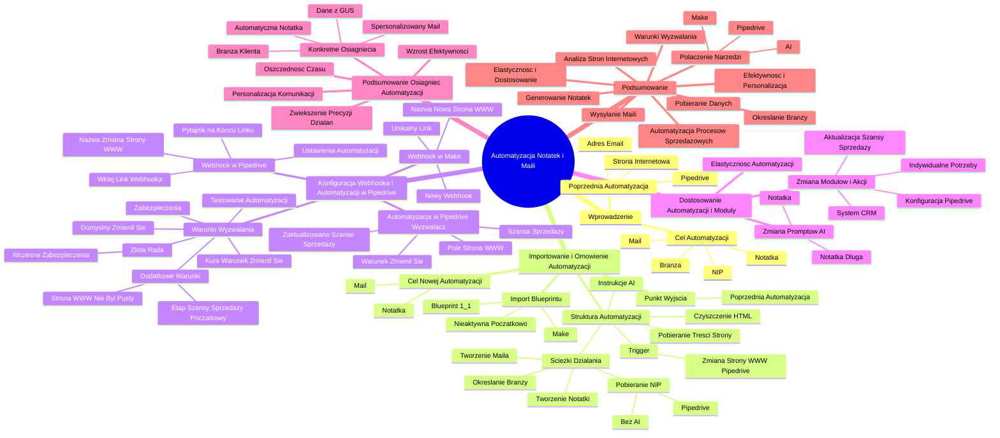

# Lekcje wideo - 4. Kim jest Twój przyszły klient - praktyka - część 2

# 💡 Diagram

___

# 🗒️ Notatka

# Notatki i Podsumowanie Transkrypcji Wideo - Automatyzacja Notatek i Maili na Podstawie Strony Internetowej 🌐✉️

## Wprowadzenie

Ten dokument zawiera szczegółowe notatki i kompleksowe podsumowanie transkrypcji wideo, poświęconej budowie automatyzacji w **Make** i **Pipedrive**. Głównym celem jest stworzenie automatyzacji, która na podstawie zmiany adresu strony internetowej w **Pipedrive** pobierze treść tej strony, przetworzy ją za pomocą sztucznej inteligencji (**AI**) 🤖 i wykona określone akcje. Akcje te obejmują tworzenie notatki 📝, określanie branży, wysyłanie maila ✉️ i pobieranie numeru NIP.  Ta automatyzacja stanowi rozszerzenie poprzedniej, która pobierała stronę internetową z adresu e-mail i zapisywała ją w szansie sprzedaży.

## Importowanie i Omówienie Automatyzacji

* **Punkt wyjścia:** Automatyzacja bazuje na wcześniejszej automatyzacji, która zapisywała stronę internetową z adresu e-mail w szansie sprzedaży w **Pipedrive**.
* **Cel nowej automatyzacji:** Stworzenie automatyzacji, która na podstawie strony internetowej:
    * Stworzy notatkę 📝.
    * Wyśle maila ✉️.
* **Import `blueprintu`:**
    * Rozpoczynamy w **Make**.
    * Importujemy nowy scenariusz (`blueprint`) o nazwie **1.1**.
    * Zaimportowana automatyzacja początkowo jest nieaktywna i wymaga konfiguracji.
* **Omówienie struktury automatyzacji (po imporcie):**
    * **Trigger:** Uruchomienie automatyzacji następuje, gdy zmieni się pole "strona www" w **Pipedrive**.
    * **Pobieranie treści strony:** Automatyzacja pobiera treść strony internetowej z podanego adresu URL.
    * **Czyszczenie HTML:** Treść strony jest oczyszczana z kodu HTML, aby była czytelna dla **AI** 🤖.
    * **Instrukcje dla AI:** Zdefiniowane są instrukcje dla sztucznej inteligencji, określające, jakie zadania ma wykonać.
    * **Ścieżki działania:** Automatyzacja zawiera kilka ścieżek, definiujących różne akcje:
        * **Tworzenie notatki 📝:** Wykorzystanie **AI** 🤖 do stworzenia notatki na podstawie treści strony.
        * **Określanie branży:** **AI** 🤖 określa branżę na podstawie treści strony.
        * **Tworzenie maila ✉️:** Generowanie spersonalizowanego maila na podstawie analizy strony.
        * **Pobieranie NIP:** Wyszukiwanie numeru NIP (bez użycia **AI**) i zapisywanie go w **Pipedrive**.

## Konfiguracja Webhooka i Automatyzacji w Pipedrive

* **Webhook w Make:**
    * Konieczność przygotowania nowego webhooka dla tej automatyzacji.
    * Tworzenie nowego webhooka w **Make** i nadanie mu nazwy, np. "nowa strona www".
    * Zapisanie webhooka i uzyskanie unikalnego linku 🔗.
    * **Ważne:** Każda automatyzacja w **Make** ma swój unikalny link webhooka 🔗.
* **Konfiguracja Webhooka w Pipedrive:**
    * W **Pipedrive** przechodzimy do ustawień automatyzacji (elementy webhook, dodaj element webhook automatyczny).
    * Dodajemy nowy webhook i nadajemy mu nazwę, np. "zmiana strony www" (dla czytelności).
    * Wklejamy skopiowany link webhooka 🔗 z **Make**.
    * **Kluczowe:** Należy upewnić się, że link webhooka 🔗 jest poprawnie wklejony, w tym **pytajnik na końcu** linku.
* **Automatyzacja w Pipedrive - Wyzwalacz:**
    * Tworzenie nowej automatyzacji w **Pipedrive**.
    * Wybór wyzwalacza automatyzacji - **"Szansa sprzedaży"**.
    * Wybór wydarzenia wyzwalającego - **"Zaktualizowano szansę sprzedaży"**.
    * Wybór pola, które ma wyzwalać automatyzację - **"strona www"**.
    * Ustawienie warunku - **"zmienił się"**. Automatyzacja uruchomi się za każdym razem, gdy wartość pola "strona www" ulegnie zmianie.
* **Warunki wyzwalania - Dodatkowe rozważania:**
    * Domyślny warunek "zmienił się" jest idealny do testowania automatyzacji.
    * **Rekomendacja:** Warto rozważyć dodanie dodatkowych warunków, aby uniknąć niepotrzebnego uruchamiania automatyzacji w środowisku produkcyjnym.
    * **Przykłady dodatkowych warunków:**
        * "strona www nie był pusty" - automatyzacja uruchomi się tylko, gdy pole "strona www" zostanie wypełnione.
        * "etap szansy sprzedaży jest początkowy" - automatyzacja uruchomi się tylko na określonym etapie szansy sprzedaży.
    * **Uzasadnienie dodatkowych warunków:** Pozwala to uniknąć niepotrzebnego obciążania automatyzacji, na przykład gdy strona www jest zmieniana wielokrotnie, a nie chcemy za każdym razem wysyłać maila powitalnego ✉️ lub tworzyć notatki 📝.
    * **Złota rada:** Zabezpieczanie automatyzacji na jak najwcześniejszym etapie (poprzez warunki wyzwalania) jest lepsze niż zabezpieczanie w samej automatyzacji.
* **Ustawienia warunków dla kursu:** Na potrzeby kursu warunek "zmienił się" jest wystarczający i ułatwia testowanie.

## Dostosowanie Automatyzacji i Moduły

* **Elastyczność automatyzacji:** Dostarczone automatyzacje są przykładami i mogą być dostosowywane do indywidualnych potrzeb i procesów biznesowych.
* **Zmiana `promptów` AI:**
    * Możliwość zmiany `promptów` (instrukcji) dla **AI** 🤖.
    * Przykład: Zmiana `promptu` z "notatka" na "notatka długa" w zależności od pożądanego poziomu szczegółowości notatki 📝.
* **Zmiana modułów i akcji:**
    * Możliwość zmiany modułów i akcji wykonywanych przez automatyzację.
    * Przykład: Zamiast tworzenia notatki 📝, można zaktualizować szansę sprzedaży w **Pipedrive**.
    * Konfiguracja modułów **Pipedrive** pozwala na wybór akcji (np. "aktualizacja szansy sprzedaży") i pól do aktualizacji.
    * Dostosowanie automatyzacji jest bardzo indywidualne i zależy od używanego systemu **CRM** i potrzeb użytkownika.

## Podsumowanie Osiągnięć Automatyzacji

* **Wzrost efektywności:** Wdrożona automatyzacja znacząco wpływa na efektywność procesu nawiązywania relacji z potencjalnym klientem.
* **Personalizacja komunikacji:** Integracja **AI** 🤖 umożliwia zautomatyzowane zbieranie kluczowych informacji o kliencie i personalizację komunikacji od pierwszego kontaktu.
* **Oszczędność czasu 🕰️:** Automatyzacja oszczędza czas 🕰️, automatyzując manualne zadania.
* **Zwiększenie precyzji działań:** Automatyzacja zwiększa precyzję działań i dostosowanie komunikacji do specyfiki klienta.
* **Konkretne osiągnięcia automatyzacji:**
    * **Przygotowanie automatycznej notatki 📝.**
    * **Pobranie danych z GUS.**
    * **Określenie branży klienta.**
    * **Wysłanie spersonalizowanego maila ✉️.**

## Podsumowanie

Przedstawiona automatyzacja demonstruje, jak połączyć **Make**, **Pipedrive** i **AI** 🤖 w celu zautomatyzowania kluczowych procesów sprzedażowych. Poprzez automatyczne pobieranie i analizowanie treści stron internetowych, system jest w stanie generować notatki 📝, określać branżę, wysyłać spersonalizowane maile ✉️ i pobierać dane, co znacząco zwiększa efektywność i personalizację działań sprzedażowych. Kluczowe jest zrozumienie elastyczności i możliwości dostosowania automatyzacji do specyficznych potrzeb biznesowych, a także rozważne konfigurowanie warunków wyzwalania, aby uniknąć niepotrzebnego obciążania systemu.

___

# 🔉 Transcript
File: Lekcje wideo - 4. Kim jest Twój przyszły klient - praktyka - część 2.mp4 
[00:00:05] Zbudowaliśmy naszą pierwszą automatyzację, która z adresu email jest w stanie pobrać stronę internetową i zapisać ją w szansie sprzedaży.
[00:00:12] I właśnie ten moment będzie punktem wyjścia do naszej kolejnej automatyzacji, tej o której właściwie jest ta lekcja, która pozwoli nam zbudować notatkę o danej stronie internetowej czy wysłać maila.
[00:00:24] Nie tracąc więc czasu, przejdźmy dalej i zaczniemy to wszystko znowu od Make'a, w którym znowu zaimportujemy sobie scenariusz.
[00:00:32] Więc jesteśmy w Make'u.
[00:00:34] Dodajemy sobie nowy scenariusz.
[00:00:36] Klikamy ponownie trzy kropeczki.
[00:00:39] Importujemy blueprint.
[00:00:41] Tym razem będzie to 1.1.
[00:00:44] Klikamy zapisz i mamy automatyzację.
[00:00:48] Oczywiście, tylko zaimportowaną, ale jeszcze nie działającą.
[00:00:52] Bo jeżeli teraz chcielibyśmy ją uruchomić, to szereg błędów nam się tutaj pojawi.
[00:00:57] Natomiast ja pokrótce omówię co jest czym.
[00:01:00] Za każdym razem, kiedy zmieni się strona pole dotyczące strony www, ta automatyzacja się uruchomi.
[00:01:05] Następnie automatyzacja pójdzie sobie pod tą stronę internetową, pobierze jej treść, oczyści z języka HTML tak, żeby AI mogło ją sobie dobrze i czytelnie zrozumieć.
[00:01:17] Tutaj mamy zapisane instrukcje dla sztucznej inteligencji, a tu mamy kilka ścieżek dotyczących tego co ma się zadziać, czyli tutaj tworzymy notatkę, tu określamy branżę, tu tworzymy mail, a tu pobieramy, wyszukujemy właściwie już bez użycia sztucznej inteligencji numer NIP i zapisujemy go w Pipedrive.
[00:01:36] I zaczynamy sobie od początku.
[00:01:38] To jest automatyzacja, ta jak i kolejne czy czy chociażby ta poprzednia, która owszem nie została zaimportowana, ale to nie jest tak, że ona działa od samego początku.
[00:01:48] Co więcej, trzeba ją będzie kilka razy uruchomić i kilka razy się zatrzymać, żeby wszystko poprawnie sobie to skonfigurować.
[00:01:55] To co musimy zrobić na starcie, to ponownie przygotować sobie ten nowy webhook.
[00:02:00] Czyli tworzymy sobie tutaj nowy webhook, nazywamy go jakoś nowa strona www.
[00:02:06] Klikamy sobie zapisz, mamy nowy link.
[00:02:09] Oczywiście każda automatyzacja ma swój unikalny link, no bo inaczej odpalałoby nam się więcej niż niż jedna automatyzacja, nawet nie wiem czy to jest fizycznie możliwe, natomiast ważne jest to na pewno w ustawieniach Pipedrive, żeby upewnić się, że kopiujemy po prostu właściwy link.
[00:02:25] Wchodzimy sobie tutaj w automatyzację, właściwie w elementy webhook, dodaj element webhook automatyczny i znowu dodajemy sobie nazwę zmiana strony www, tak żeby to wszystko po prostu było czytelne i wklejamy ten skopiowany link, pamiętając o tym pytajniku na końcu, żeby zapisać to już bez błędu.
[00:02:43] Proszę, jak sprawnie.
[00:02:44] Przechodzimy teraz do automatyzacji, tworzymy sobie nową automatyzację i musimy się zastanowić co ją ma wyzwolić.
[00:02:52] Ona będzie oczywiście wyzwalana jakimś wydarzeniem.
[00:02:54] My pracujemy sobie na szansie sprzedaży, więc to będzie klik wybieram tutaj szansę sprzedaży.
[00:03:00] Oczywiście w twoim systemie CRM to może wyglądać inaczej, ale ogólnie też bardzo zachęcam do tego, żeby nie kopiować jeden do jednego tego co teraz pokazuję, ponieważ może to nie odpowiadać twojemu procesowi biznesowemu, twojej organizacji.
[00:03:13] Faktycznie tutaj to najprawdopodobniej będzie najczęstszym wyborem, że zaktualizowano daną szansę sprzedaży.
[00:03:21] Ja sobie muszę tutaj przesunąć okienko, żebym mógł sobie kliknąć przycisk.
[00:03:26] Natomiast później co ma się zadziać, to wybieramy sobie to pole strona www i muszę określić ten warunek.
[00:03:33] U mnie będzie to warunek zmienił się, czyli za każdym razem kiedy zmieniła się wartość tego pola, ta automatyzacja w Pipedrive będzie się uruchamiać.
[00:03:41] I to jest super na czas testowania tej automatyzacji, no bo nie musimy nic więcej kombinować i to też może pozostać ogólnie, ale zachęcam do zastanowienia się, czy nie warto dodać jakiegoś kolejnego warunku, gdzie na przykład ta strona www to jest jeszcze nie wiem na przykład nie był pusty, albo może w ogóle inny warunek, czyli etap szansy sprzedaży jest na przykład jakiś tam początkowy.
[00:04:09] Dlaczego o tym mówię?
[00:04:11] Mówię o tym dlatego, że jeżeli zostawimy tylko taki warunek, to za każdym razem, kiedy zmienimy adres strony internetowej, uruchomimy całą automatyzację.
[00:04:19] Oczywiście można się przy tym zabezpieczyć też w automatyzacji, ale warto zabezpieczać się tak wcześnie jak to jest możliwe.
[00:04:25] To jest też taka dosyć złota rada, żeby po prostu nie wywoływać niepotrzebnie tych automatyzacji, bo jeżeli zmienialibyśmy stronę internetową, czyli na przykład w twojej firmie często dochodzi do tych zmian, nie wiem, to jest przykład, może tak się dziać, chociaż mało to prawdopodobne, ale jeśli, no to znowu wysłałby się mail powitalny.
[00:04:45] A nie chcemy tego, albo znowu robilibyśmy notatkę.
[00:04:49] To jest niepotrzebne, w związku z tym warto zastanowić się nad tymi warunkami.
[00:04:52] Ja je teraz takie zostawię, no bo na potrzeby tego kursu są po prostu idealne, bo będziemy mogli sobie szybko to testować i to co musimy zrobić na starcie, to ponownie przygotować sobie ten nowy webhook.
[00:05:00] Czyli tworzymy sobie tutaj nowy webhook, nazywamy go jakoś nowa strona www.
[00:05:06] Klikamy sobie zapisz, mamy nowy link.
[00:05:09] Oczywiście każda automatyzacja ma swój unikalny link, no bo inaczej odpalałoby nam się więcej niż niż jedna automatyzacja, nawet nie wiem czy to jest fizycznie możliwe, natomiast ważne jest to na pewno w ustawieniach Pipedrive, żeby upewnić się, że kopiujemy po prostu właściwy link.
[00:05:25] Wchodzimy sobie tutaj w automatyzację, właściwie w elementy webhook, dodaj element webhook automatyczny i znowu dodajemy sobie nazwę zmiana strony www, tak żeby to wszystko po prostu było czytelne i wklejamy ten skopiowany link, pamiętając o tym pytajniku na końcu, żeby zapisać to już bez błędu.
[00:05:40] Proszę, jak sprawnie.
[00:05:40] Przechodzimy teraz do automatyzacji, tworzymy sobie nową automatyzację i musimy się zastanowić co ją ma wyzwolić.
[00:05:49] Ona będzie oczywiście wyzwalana jakimś wydarzeniem.
[00:05:52] My pracujemy sobie na szansie sprzedaży, więc to będzie klik wybieram tutaj szansę sprzedaży.
[00:06:00] Oczywiście w twoim systemie CRM to może wyglądać inaczej, ale ogólnie też bardzo zachęcam do tego, żeby nie kopiować jeden do jednego tego co teraz pokazuję, ponieważ może to nie odpowiadać twojemu procesowi biznesowemu, twojej organizacji.
[00:06:13] Faktycznie tutaj to najprawdopodobniej będzie najczęstszym wyborem, że zaktualizowano daną szansę sprzedaży.
[00:06:19] Ja sobie muszę tutaj przesunąć okienko, żebym mógł sobie kliknąć przycisk.
[00:06:25] Natomiast później co ma się zadziać, to wybieramy sobie to pole strona www i muszę określić ten warunek.
[00:06:33] U mnie będzie to warunek zmienił się, czyli za każdym razem kiedy zmieniła się wartość tego pola, ta automatyzacja w Pipedrive będzie się uruchamiać.
[00:06:40] (Ekran przedstawia stronę internetową Pipedrive - szanse sprzedaży, następnie stronę Make - scenariusze, stronę Google AI Studio - Get API Key, stronę skrzynki mailowej Gmail, oraz ponownie stronę Make z diagramem automatyzacji).
[00:06:40] I to jest super na czas testowania tej automatyzacji, no bo nie musimy nic więcej kombinować i to też może pozostać ogólnie, ale zachęcam do zastanowienia się, czy nie warto dodać jakiegoś kolejnego warunku, gdzie na przykład ta strona www to jest jeszcze nie wiem na przykład nie był pusty, albo może w ogóle inny warunek, czyli etap szansy sprzedaży jest na przykład jakiś tam początkowy.
[00:07:09] Dlaczego o tym mówię?
[00:07:11] Mówię o tym dlatego, że jeżeli zostawimy tylko taki warunek, to za każdym razem, kiedy zmienimy adres strony internetowej, uruchomimy całą automatyzację.
[00:07:19] Oczywiście można się przy tym zabezpieczyć też w automatyzacji, ale warto zabezpieczać się tak wcześnie jak to jest możliwe.
[00:07:25] To jest też taka dosyć złota rada, żeby po prostu nie wywoływać niepotrzebnie tych automatyzacji, bo jeżeli zmienialibyśmy stronę internetową, czyli na przykład w twojej firmie często dochodzi do tych zmian, nie wiem, to jest przykład, może tak się dziać, chociaż mało to prawdopodobne, ale jeśli, no to znowu wysłałby się mail powitalny.
[00:07:45] A nie chcemy tego, albo znowu robilibyśmy notatkę.
[00:07:48] To jest niepotrzebne, w związku z tym warto zastanowić się nad tymi warunkami.
[00:07:52] Ja je teraz takie zostawię, no bo na potrzeby tego kursu są po prostu idealne, bo będziemy mogli sobie szybko to testować i to co musimy zrobić na starcie, to ponownie przygotować sobie ten nowy webhook.
[00:08:00] Czyli tworzymy sobie tutaj nowy webhook, nazywamy go jakoś nowa strona www.
[00:08:06] Klikamy sobie zapisz, mamy nowy link.
[00:08:09] Oczywiście każda automatyzacja ma swój unikalny link, no bo inaczej odpalałoby nam się więcej niż niż jedna automatyzacja, nawet nie wiem czy to jest fizycznie możliwe, natomiast ważne jest to na pewno w ustawieniach Pipedrive, żeby upewnić się, że kopiujemy po prostu właściwy link.
[00:08:25] Wchodzimy sobie tutaj w automatyzację, właściwie w elementy webhook, dodaj element webhook automatyczny i znowu dodajemy sobie nazwę zmiana strony www, tak żeby to wszystko po prostu było czytelne i wklejamy ten skopiowany link, pamiętając o tym pytajniku na końcu, żeby zapisać to już bez błędu.
[00:08:40] Proszę, jak sprawnie.
[00:08:40] Przechodzimy teraz do automatyzacji, tworzymy sobie nową automatyzację i musimy się zastanowić co ją ma wyzwolić.
[00:08:52] Ona będzie oczywiście wyzwalana jakimś wydarzeniem.
[00:08:55] My pracujemy sobie na szansie sprzedaży, więc to będzie klik wybieram tutaj szansę sprzedaży.
[00:09:00] Oczywiście w twoim systemie CRM to może wyglądać inaczej, ale ogólnie też bardzo zachęcam do tego, żeby nie kopiować jeden do jednego tego co teraz pokazuję, ponieważ może to nie odpowiadać twojemu procesowi biznesowemu, twojej organizacji.
[00:09:13] Faktycznie tutaj to najprawdopodobniej będzie najczęstszym wyborem, że zaktualizowano daną szansę sprzedaży.
[00:09:20] Ja sobie muszę tutaj przesunąć okienko, żebym mógł sobie kliknąć przycisk.
[00:09:26] Natomiast później co ma się zadziać, to wybieramy sobie to pole strona www i muszę określić ten warunek.
[00:09:33] U mnie będzie to warunek zmienił się, czyli za każdym razem kiedy zmieniła się wartość tego pola, ta automatyzacja w Pipedrive będzie się uruchamiać.
[00:09:40] I to jest super na czas testowania tej automatyzacji, no bo nie musimy nic więcej kombinować i to też może pozostać ogólnie, ale zachęcam do zastanowienia się, czy nie warto dodać jakiegoś kolejnego warunku, gdzie na przykład ta strona www to jest jeszcze nie wiem na przykład nie był pusty, albo może w ogóle inny warunek, czyli etap szansy sprzedaży jest na przykład jakiś tam początkowy.
[00:10:10] Dlaczego o tym mówię?
[00:10:11] Mówię o tym dlatego, że jeżeli zostawimy tylko taki warunek, to za każdym razem, kiedy zmienimy adres strony internetowej, uruchomimy całą automatyzację.
[00:10:19] Oczywiście można się przy tym zabezpieczyć też w automatyzacji, ale warto zabezpieczać się tak wcześnie jak to jest możliwe.
[00:10:25] To jest też taka dosyć złota rada, żeby po prostu nie wywoływać niepotrzebnie tych automatyzacji, bo jeżeli zmienialibyśmy stronę internetową, czyli na przykład w twojej firmie często dochodzi do tych zmian, nie wiem, to jest przykład, może tak się dziać, chociaż mało to prawdopodobne, ale jeśli, no to znowu wysłałby się mail powitalny.
[00:10:45] A nie chcemy tego, albo znowu robilibyśmy notatkę.
[00:10:48] To jest niepotrzebne, w związku z tym warto zastanowić się nad tymi warunkami.
[00:10:52] Ja je teraz takie zostawię, no bo na potrzeby tego kursu są po prostu idealne, bo będziemy mogli sobie szybko to testować.
[00:10:57] I to co musimy zrobić na starcie, to ponownie przygotować sobie ten nowy webhook.
[00:11:00] Czyli tworzymy sobie tutaj nowy webhook, nazywamy go jakoś nowa strona www.
[00:11:06] Klikamy sobie zapisz, mamy nowy link.
[00:11:09] Oczywiście każda automatyzacja ma swój unikalny link, no bo inaczej odpalałoby nam się więcej niż niż jedna automatyzacja, nawet nie wiem czy to jest fizycznie możliwe, natomiast ważne jest to na pewno w ustawieniach Pipedrive, żeby upewnić się, że kopiujemy po prostu właściwy link.
[00:11:25] Wchodzimy sobie tutaj w automatyzację, właściwie w elementy webhook, dodaj element webhook automatyczny i znowu dodajemy sobie nazwę zmiana strony www, tak żeby to wszystko po prostu było czytelne i wklejamy ten skopiowany link, pamiętając o tym pytajniku na końcu, żeby zapisać to już bez błędu.
[00:11:40] Proszę, jak sprawnie.
[00:11:40] Przechodzimy teraz do automatyzacji, tworzymy sobie nową automatyzację i musimy się zastanowić co ją ma wyzwolić.
[00:11:55] Ona będzie oczywiście wyzwalana jakimś wydarzeniem.
[01:11:58] My pracujemy sobie na szansie sprzedaży, więc to będzie klik wybieram tutaj szansę sprzedaży.
[01:12:06] Oczywiście w twoim systemie CRM to może wyglądać inaczej, ale ogólnie też bardzo zachęcam do tego, żeby nie kopiować jeden do jednego tego co teraz pokazuję, ponieważ może to nie odpowiadać twojemu procesowi biznesowemu, twojej organizacji.
[01:12:20] Faktycznie tutaj to najprawdopodobniej będzie najczęstszym wyborem, że zaktualizowano daną szansę sprzedaży.
[01:12:29] Ja sobie muszę tutaj przesunąć okienko, żebym mógł sobie kliknąć przycisk.
[01:12:35] Natomiast później co ma się zadziać, to wybieramy sobie to pole strona www i muszę określić ten warunek.
[01:12:44] U mnie będzie to warunek zmienił się, czyli za każdym razem kiedy zmieniła się wartość tego pola, ta automatyzacja w Pipedrive będzie się uruchamiać.
[01:12:51] I to jest super na czas testowania tej automatyzacji, no bo nie musimy nic więcej kombinować i to też może pozostać ogólnie, ale zachęcam do zastanowienia się, czy nie warto dodać jakiegoś kolejnego warunku, gdzie na przykład ta strona www to jest jeszcze nie wiem na przykład nie był pusty, albo może w ogóle inny warunek, czyli etap szansy sprzedaży jest na przykład jakiś tam początkowy.
[01:13:13] Dlaczego o tym mówię?
[01:13:15] Mówię o tym dlatego, że jeżeli zostawimy tylko taki warunek, to za każdym razem, kiedy zmienimy adres strony internetowej, uruchomimy całą automatyzację.
[01:13:30] Oczywiście można się przy tym zabezpieczyć też w automatyzacji, ale warto zabezpieczać się tak wcześnie jak to jest możliwe.
[00:13:36] To jest też taka dosyć złota rada, żeby po prostu nie wywoływać niepotrzebnie tych automatyzacji, bo jeżeli zmienialibyśmy stronę internetową, czyli na przykład w twojej firmie często dochodzi do tych zmian, nie wiem, to jest przykład, może tak się dziać, chociaż mało to prawdopodobne, ale jeśli, no to znowu wysłałby się mail powitalny.
[01:13:56] A nie chcemy tego, albo znowu robilibyśmy notatkę.
[01:14:00] To jest niepotrzebne, w związku z tym warto zastanowić się nad tymi warunkami.
[01:14:04] Ja je teraz takie zostawię, no bo na potrzeby tego kursu są po prostu idealne, bo będziemy mogli sobie szybko to testować i to co musimy zrobić na starcie, to ponownie przygotować sobie ten nowy webhook.
[01:14:14] Czyli tworzymy sobie tutaj nowy webhook, nazywamy go jakoś nowa strona www.
[01:14:20] Klikamy sobie zapisz, mamy nowy link.
[00:14:23] Oczywiście każda automatyzacja ma swój unikalny link, no bo inaczej odpalałoby nam się więcej niż niż jedna automatyzacja, nawet nie wiem czy to jest fizycznie możliwe, natomiast ważne jest to na pewno w ustawieniach Pipedrive, żeby upewnić się, że kopiujemy po prostu właściwy link.
[01:14:40] Wchodzimy sobie tutaj w automatyzację, właściwie w elementy webhook, dodaj element webhook automatyczny i znowu dodajemy sobie nazwę zmiana strony www, tak żeby to wszystko po prostu było czytelne i wklejamy ten skopiowany link, pamiętając o tym pytajniku na końcu, żeby zapisać to już bez błędu.
[01:15:00] Proszę, jak sprawnie.
[01:15:00] Przechodzimy teraz do automatyzacji, tworzymy sobie nową automatyzację i musimy się zastanowić co ją ma wyzwolić.
[01:15:13] Ona będzie oczywiście wyzwalana jakimś wydarzeniem.
[01:15:15] My pracujemy sobie na szansie sprzedaży, więc to będzie klik wybieram tutaj szansę sprzedaży.
[01:15:20] Oczywiście w twoim systemie CRM to może wyglądać inaczej, ale ogólnie też bardzo zachęcam do tego, żeby nie kopiować jeden do jednego tego co teraz pokazuję, ponieważ może to nie odpowiadać twojemu procesowi biznesowemu, twojej organizacji.
[01:15:31] Faktycznie tutaj to najprawdopodobniej będzie najczęstszym wyborem, że zaktualizowano daną szansę sprzedaży.
[01:15:39] Ja sobie muszę tutaj przesunąć okienko, żebym mógł sobie kliknąć przycisk.
[01:15:45] Natomiast później co ma się zadziać, to wybieramy sobie to pole strona www i muszę określić ten warunek.
[01:15:56] U mnie będzie to warunek zmienił się, czyli za każdym razem kiedy zmieniła się wartość tego pola, ta automatyzacja w Pipedrive będzie się uruchamiać.
[01:16:04] I to jest super na czas testowania tej automatyzacji, no bo nie musimy nic więcej kombinować i to też może pozostać ogólnie, ale zachęcam do zastanowienia się, czy nie warto dodać jakiegoś kolejnego warunku, gdzie na przykład ta strona www to jest jeszcze nie wiem na przykład nie był pusty, albo może w ogóle inny warunek, czyli etap szansy sprzedaży jest na przykład jakiś tam początkowy.
[01:17:14] Dlaczego o tym mówię?
[01:17:16] Mówię o tym dlatego, że jeżeli zostawimy tylko taki warunek, to za każdym razem, kiedy zmienimy adres strony internetowej, uruchomimy całą automatyzację.
[01:17:30] Oczywiście można się przy tym zabezpieczyć też w automatyzacji, ale warto zabezpieczać się tak wcześnie jak to jest możliwe.
[01:17:36] To jest też taka dosyć złota rada, żeby po prostu nie wywoływać niepotrzebnie tych automatyzacji, bo jeżeli zmienialibyśmy stronę internetową, czyli na przykład w twojej firmie często dochodzi do tych zmian, nie wiem, to jest przykład, może tak się dziać, chociaż mało to prawdopodobne, ale jeśli, no to znowu wysłałby się mail powitalny.
[01:17:56] A nie chcemy tego, albo znowu robilibyśmy notatkę.
[01:18:00] To jest niepotrzebne, w związku z tym warto zastanowić się nad tymi warunkami.
[01:18:04] Ja je teraz takie zostawię, no bo na potrzeby tego kursu są po prostu idealne, bo będziemy mogli sobie szybko to testować.
[01:18:10] I teraz co trzeba zrobić, to po prostu tutaj w tym miejscu wybrać inny prompt.
[01:18:15] Tu jest akurat prompt notatka, ale mógłby być prompt notatka długa.
[01:18:20] I w zależności od tego co to AI ma zrobić, to później trzeba tutaj będzie po prostu zwrotkę z tych danych, które mamy tutaj albo wymienić moduł, czyli to na przykład nie będzie notatka albo jakieś działanie aktualizacja szansę sprzedaży, właśnie notatka, zbudowanie jakiegoś działania, to wszystko możecie sobie tutaj konfigurować.
[01:18:53] Pokazuję to, ponieważ te automatyzacje, z którymi do was przychodzę, są tylko i wyłącznie przykładem.
[01:19:00] Mają wam pozwolić rozbudować to w taki sposób, w jaki będzie to pasowało właśnie wam, więc zobaczcie jakie to jest proste.
[01:19:07] Trzeba zdefiniować osobny prompt, który później możemy użyć w skopiowanym i wklejonym module, trzeba go tylko tutaj podmienić i trzeba będzie po prostu zamiast na przykład notatki dodać sobie inny moduł Pipedrive i załóżmy, że chcemy właśnie zaktualizować szansę sprzedaży, to możemy sobie czyli jakieś pole, to możemy sobie po prostu wybrać to i jakby wkleić odpowiednie te informacje.
[01:20:20] Co chcemy zrobić i tak dalej, to już bardzo indywidualnie w zależności też od systemu CRM, z którego korzystacie i od waszych potrzeb.
[01:20:30] Natomiast ostatecznie zapisuję to i na tym slajdzie (ekran przedstawia slajd z napisem "Co udało nam się osiągnąć" i listą punktów).
[01:20:30] Podsumowując naszą pracę, zobaczysz jak wdrożona automatyzacja znacząco wpłynęła na efektywność i jakość procesu nawiązywania relacji z potencjalnym klientem.
[01:20:40] Dzięki integracji narzędzi AI byliśmy w stanie w zautomatyzowany sposób zebrać wszystkie kluczowe informacje o kliencie, a także spersonalizować komunikację już od pierwszego kontaktu.
[01:20:53] Efektem tej pracy jest nie tylko oszczędność czasu, ale także zwiększenie precyzji naszych działań i dostosowanie komunikacji do specyfiki klienta.
[01:21:00] Przygotowanie automatycznej notatki.
[01:21:04] Pobranie danych z GUS.
[01:21:07] Określenie branży klienta.
[01:21:11] Wysłanie spersonalizowanego maila.

___
# 🏷️ Tags
#automatyzacja #Make #Pipedrive #AI #sztuczna_inteligencja #notatka #email #NIP #strona_internetowa #szansa_sprzedaży #blueprint #trigger #webhook #URL #HTML #CRM #prompt #efektywność #personalizacja #oszczędność_czasu #precyzja_działań #GUS #branża #dane #proces_sprzedażowy #warunki_wyzwalania #aktualizacja_szansy_sprzedaży #nowa_strona_www #zmiana_strony_www #import_scenariusza #konfiguracja_webhooka #pobieranie_treści_strony #czyszczenie_HTML #instrukcje_dla_AI #ścieżki_działania #tworzenie_notatki #określanie_branży #tworzenie_maila #pobieranie_NIP #dostosowanie_automatyzacji #moduły #akcje #system_CRM #proces_biznesowy #mail_powitalny #złota_rada #testowanie_automatyzacji #elementy_webhook #dodaj_element_webhook_automatyczny #zaktualizowano_szansę_sprzedaży #warunek_zmienił_się #etap_szansy_sprzedaży #prompt_notatka #prompt_notatka_długa #integracja_AI #komunikacja_z_klientem #dane_z_GUS #spersonalizowany_mail
