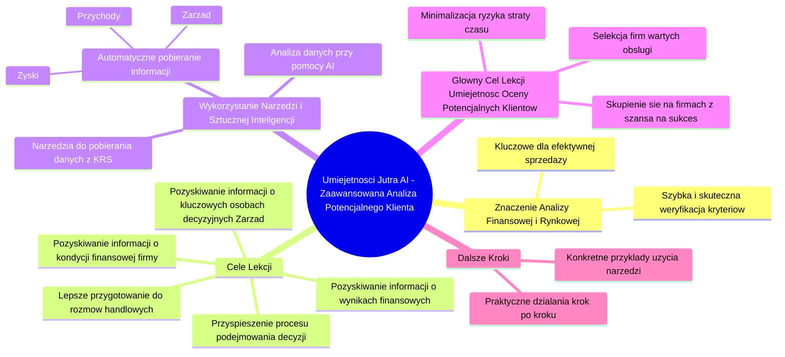

# Lekcje wideo - 5. Rozszerzona analiza klienta - wstęp

# 💡 Diagram

___

# 🗒️ Notatka

# Notatki i Podsumowanie Lekcji "Umiejętności Jutra AI" - Zaawansowana Analiza Potencjalnego Klienta 🧑‍💼

## Wprowadzenie

Ta lekcja, druga z serii "Umiejętności Jutra `AI` 🤖", koncentruje się na **zaawansowanej analizie potencjalnych klientów** w biznesie. Po zebraniu podstawowych informacji o potencjalnym kliencie, kolejnym krokiem jest dogłębne zrozumienie jego sytuacji finansowej 💰 i rynkowej 📈. Celem tej lekcji 🧑‍🏫 jest nauczenie, jak wykorzystać dostępne dane 📊 i narzędzia 🛠️, w tym **sztuczną inteligencję**, do efektywnej oceny potencjalnych klientów i podejmowania świadomych decyzji ✅ sprzedażowych.

## Kluczowe Zagadnienia Lekcji

*   **Znaczenie analizy finansowej 💰 i rynkowej 📈 klienta:**
    *   Zrozumienie kondycji finansowej i sytuacji rynkowej potencjalnego klienta jest **kluczowe dla efektywnej sprzedaży**.
    *   Pozwala to na **szybką i skuteczną weryfikację**, czy klient spełnia istotne kryteria.
*   **Cele lekcji:**
    *   Nauczenie, jak **pozyskiwać informacje** o:
        *   Kondycji finansowej firmy.
        *   Wynikach finansowych.
        *   Kluczowych osobach decyzyjnych (zarząd).
    *   Umożliwienie **lepszego przygotowania się do rozmów handlowych**.
    *   **Przyspieszenie procesu podejmowania decyzji** ✅ dotyczących klientów.
*   **Wykorzystanie narzędzi 🛠️ i sztucznej inteligencji:**
    *   Lekcja skupi się na wykorzystaniu narzędzi do **pobierania danych 📊 z rejestru KRS (Krajowy Rejestr Sądowy) 🏢**.
    *   Automatyczne pobieranie informacji takich jak:
        *   Przychody.
        *   Zyski.
        *   Skład zarządu firmy.
    *   **Analiza danych 📊 przy pomocy sztucznej inteligencji**.
*   **Główny cel lekcji - Umiejętność oceny potencjalnych klientów na podstawie twardych danych:**
    *   Zdobycie umiejętności **selekcji firm wartych obsługi** na podstawie danych 📊.
    *   **Minimalizacja ryzyka straty czasu 🕰️** na mało rokujące kontakty.
    *   **Skupienie się na firmach z realną szansą na sukces 🎉**.
*   **Dalsze kroki 👣:**
    *   Kolejne moduły będą omawiać **konkretne przykłady użycia** narzędzi 🛠️.
    *   Przejście do **praktycznych działań krok po kroku 👣** w pracy z potencjalnymi klientami.

## Podsumowanie

Druga lekcja "Umiejętności Jutra `AI` 🤖" koncentruje się na zaawansowanej analizie potencjalnych klientów poprzez wykorzystanie **danych finansowych 💰 i rynkowych 📈**. Kluczowym elementem jest nauczenie się, jak efektywnie korzystać z narzędzi 🛠️ do pobierania danych 📊 z **KRS 🏢** i analizować je za pomocą **sztucznej inteligencji**. Celem jest **usprawnienie procesu selekcji klientów**, umożliwiając skupienie się na tych, którzy rokują największe szanse na sukces 🎉, i minimalizację strat czasu 🕰️. Lekcja ta stanowi fundament do dalszych, bardziej praktycznych modułów, które pokażą, jak krok po kroku 👣 wykorzystać zdobytą wiedzę w codziennej pracy.

___

# 🔉 Transcript
File: Lekcje wideo - 5. Rozszerzona analiza klienta - wstęp.mp4 
[00:00:01] Ekran: Na białym tle czarny napis "Umiejętności Jutra AI". Poniżej napisy "Organizator Google" i "Partner edukacyjny SGH".
[00:00:05] Cześć, witaj w drugiej lekcji.
[00:00:07] Teraz, kiedy mamy podstawowe informacje o potencjalnym kliencie, czas na bardziej zaawansowaną analizę.
[00:00:13] W tej lekcji skupimy się na tym, jak wykorzystać dostępne informacje, aby dowiedzieć się jeszcze więcej o firmie i ocenić, czy warto poświęcić jej czas.
[00:00:23] W biznesie zrozumienie sytuacji finansowej i rynkowej potencjalnego klienta to klucz do efektywnej sprzedaży.
[00:00:30] Dzięki temu, że wykorzystujemy sztuczną inteligencję i narzędzia do analizy, jesteśmy w stanie szybko i skutecznie zweryfikować, czy nasz potencjalny klient spełnia kryteria, które są dla nas istotne.
[00:00:42] W tej lekcji dowiesz się, jak pozyskać informacje o kondycji finansowej firmy, jej wynikach oraz kluczowych osobach decyzyjnych.
[00:00:50] Dzięki temu będziesz mógł, mogła lepiej przygotować się do rozmów handlowych i szybciej podejmować decyzje.
[00:00:57] Wykorzystamy narzędzia, które pozwolą nam pobierać dane z rejestru KRS, aby automatycznie pobierać informacje o przychodach, zyskach i zarządzie firm, aby następnie przeanalizować te dane przy pomocy sztucznej inteligencji.
[00:01:12] Głównym celem tej lekcji jest, abyś zdobył, zdobyła umiejętności oceny potencjalnych klientów na podstawie twardych danych i dzięki temu mógł, mogła szybko wyselekcjonować firmy, które warto obsługiwać.
[00:01:25] To pomoże ci zminimalizować ryzyko straty czasu na mało rokujące kontakty i skupić się na tych, które dają realnie szansę na sukces.
[00:01:37] Zapraszam do kolejnych modułów, w których omówimy konkretne przykłady użycia i przejdziemy do praktycznych działań, aby krok po kroku wykorzystać zdobytą wiedzę w pracy z potencjalnymi klientami.
[00:01:50] Ekran: Na białym tle czarny napis "Umiejętności Jutra AI". Poniżej napisy "Organizator Google" i "Partner edukacyjny SGH".

___
# 🏷️ Tags
#umiejętności_jutra #AI #sztuczna_inteligencja #analiza_potencjalnego_klienta #potencjalni_klienci #analiza_finansowa #analiza_rynkowa #dane #narzędzia #decyzje_sprzedażowe #pozyskiwanie_informacji #kondycja_finansowa_firmy #wyniki_finansowe #osoby_decyzyjne #zarząd #rozmowy_handlowe #proces_decyzyjny #rejestr_KRS #Krajowy_Rejestr_Sądowy #przychody #zyski #selekcja_firm #minimalizacja_ryzyka #szansa_na_sukces #przykłady_użycia #praktyczne_działania #google #SGH
