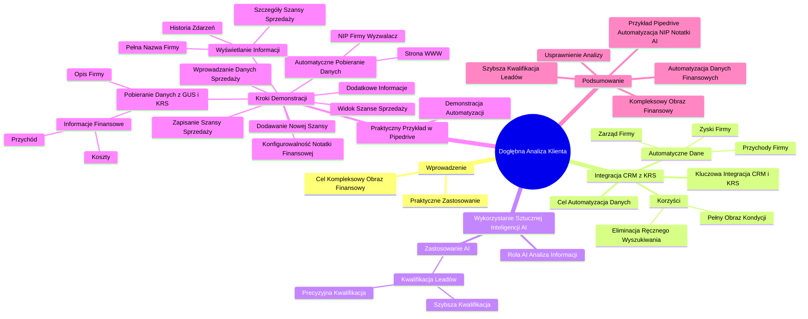

# Lekcje wideo - 6. Rozszerzona analiza klienta - przykłady

# 💡 Diagram

___

# 🗒️ Notatka

# Szczegółowe Notatki i Podsumowanie Analizy Wideo

## Wprowadzenie: Dogłębna Analiza Klienta i Jej Praktyczne Zastosowanie

Niniejsza analiza wideo skupia się na praktycznym zastosowaniu **dogłębnej analizy klienta**, demonstrując, w jaki sposób integracja systemu **CRM** z rejestrem **KRS** oraz wykorzystanie **sztucznej inteligencji (AI)** może zautomatyzować i usprawnić proces pozyskiwania oraz analizy danych finansowych klientów. Głównym celem jest szybkie i efektywne uzyskanie kompleksowego obrazu kondycji finansowej klienta.

## Integracja CRM z KRS: Automatyzacja Pobierania Danych

- **Cel integracji:** Automatyzacja procesu pozyskiwania informacji o klientach.
- **Kluczowa integracja:** Połączenie systemu **CRM** z **Krajowym Rejestrem Sądowym (KRS)** 🏢.
- **Automatycznie pobierane dane:**
    - Przychody firmy 📊
    - Zyski firmy 📈
    - Dane dotyczące zarządu firmy 🧑‍💼
- **Korzyści:**
    - Uzyskanie **pełnego obrazu kondycji finansowej klienta**.
    - **Eliminacja ręcznego wyszukiwania danych**, co pozwala oszczędzić czas 🕰️ i zredukować ryzyko błędów.

> Integracja systemu CRM z rejestrem KRS umożliwia automatyczne pobieranie informacji o przychodach, zyskach oraz zarządzie firm. Dzięki temu zyskujemy pełny obraz kondycji finansowej klienta bez konieczności manualnego przeszukiwania danych.

## Wykorzystanie Sztucznej Inteligencji (AI): Analiza i Kwalifikacja Leadów

- **Rola AI:** Analiza zgromadzonych informacji o klientach 🤖.
- **Zastosowanie AI:**
    - **Szybsza kwalifikacja leadów** (potencjalnych klientów).
    - **Bardziej precyzyjna kwalifikacja leadów**, co podnosi efektywność działań sprzedażowych.

> Sztuczna inteligencja może być wykorzystana do analizy zebranych informacji, co usprawnia szybszą i bardziej trafną kwalifikację leadów.

## Praktyczny Przykład w Pipedrive: Demonstracja Automatyzacji ⚙️

Prezentacja praktycznego przykładu automatyzacji w systemie **Pipedrive**.

### Demonstracja Krok po Kroku:

1.  **Widok "Szanse sprzedaży" w Pipedrive:**
    - Kolumny przedstawiają etapy lejka sprzedaży: "Zakwalifikowani", "Nawiązano kontakt", "Zaplanowano demo", "Złożono ofertę", "Rozpoczęto negocjacje".
    - Początkowo wszystkie kolumny mają wartość 0 PLN.

2.  **Dodawanie Nowej Szansy Sprzedaży:**
    - Otwiera się okno "Dodaj szansę sprzedaży".
    - Pola do wypełnienia: "Osoba kontaktowa", "Organizacja", "Tytuł", "Wartość", "Lejek sprzedaży", "Etap w lejku", "Etykieta", "Oczekiwana data zamknięcia", "Właściciel", "Kanał źródłowy".
    - Dodatkowe informacje o osobie kontaktowej: "Telefon", "Praca", "E-mail", "Adres".

3.  **Wprowadzanie Danych Szansy Sprzedaży:**
    - Wprowadzane są przykładowe dane:
        - Imię: Jan
        - Organizacja: Specjalnie obojętna nazwa
        - Adres e-mail: testowy
        - Adres: Dzwonna Sylwais (znany z NIP-u)

4.  **Zapisanie Szansy Sprzedaży:**
    - Po zapisaniu, w widoku "Szanse sprzedaży" pojawia się nowa szansa w kolumnie "Zakwalifikowani".
    - W tle uruchamiają się procesy automatyzacji.

5.  **Automatyczne Pobieranie Danych (Strona WWW i NIP):**
    - Automatyzacja pobiera stronę WWW firmy (jeśli jest dostępna).
    - Zapisywany jest **NIP** firmy.
    - **NIP** staje się **wyzwalaczem** dla dalszych automatyzacji.

6.  **Pobieranie Danych z GUS i KRS (Informacje Finansowe):**
    - Po krótkim czasie oczekiwania, system pobiera i wyświetla **opis firmy**.
    - Potwierdzenie poprawnego pobrania danych z **Głównego Urzędu Statystycznego (GUS)**.
    - Pobierana jest **pełna nazwa firmy** wraz z adresem (wcześniej dane były niepełne).
    - Pobierane są **informacje finansowe**:
        - Przychód
        - Koszty
    - Tworzona jest **notatka finansowa** zawierająca:
        - Szczegółowe informacje finansowe
        - **Analizę finansową wykonaną przez sztuczną inteligencję**.

7.  **Wyświetlanie Informacji w Szczegółach Szansy Sprzedaży:**
    - W sekcji "Szczegóły" szansy sprzedaży widoczne są pola: "Strona WWW", "Oferta", "NIP", "Tagi".
    - W sekcji "Organizacja" wyświetlana jest **pełna nazwa firmy** (np. "SELLWISE Szymon Negacz Spółka Komandytowa") wraz z adresem.
    - W sekcji "Historia" zapisywane są wpisy, np.: "Utworzono szansę sprzedaży", "Pobrano poprawnie dane z GUS", "Opis firmy".

8.  **Konfigurowalność Notatki Finansowej:**
    - Treść notatki finansowej jest **indywidualnie dobierana** i **dostosowywana** do potrzeb użytkownika.
    - W zaprezentowanym przykładzie notatka jest dostosowana do potrzeb szkolenia.

> Prezentowana notatka może być indywidualnie dostosowywana do konkretnych potrzeb użytkownika. W tym przypadku, jej forma została dopasowana do wymagań kursu szkoleniowego.

9.  **Możliwość Pobierania Dodatkowych Informacji:**
    - System umożliwia pobieranie jeszcze szerszego zakresu informacji o klientach (szczegóły zostaną omówione w trakcie budowy automatyzacji).

## Podsumowanie

Analiza wideo demonstruje, jak integracja systemu **CRM** (Pipedrive) z **KRS** oraz wykorzystanie **sztucznej inteligencji** może znacząco usprawnić proces dogłębnej analizy klienta. Automatyzacja pobierania danych finansowych i ich analiza za pomocą AI umożliwia szybszą i efektywniejszą kwalifikację leadów, oszczędzając czas 🕰️ i dostarczając kompleksowy obraz kondycji finansowej klienta bez konieczności ręcznego wyszukiwania danych. Zaprezentowany przykład w Pipedrive ilustruje, jak w praktyce można zautomatyzować proces pozyskiwania informacji o firmach na podstawie **NIP-u**, generując notatki finansowe i analizy wspomagane przez AI, które mogą być dostosowane do indywidualnych potrzeb.

___

# 🔉 Transcript
File: Lekcje wideo - 6. Rozszerzona analiza klienta - przykłady.mp4 
[00:00:05] Teraz, kiedy rozumiemy dlaczego dogłębna analiza klienta jest tak ważna, czas omówić konkretne przykłady zastosowania tej analizy w rzeczywistości.
[00:00:14] W tej części lekcji opowiem, przedstawię przykłady, jak integracja systemu CRM z rejestrem KRS pozwala automatycznie pobierać informacje o przychodach, zyskach oraz rządzie firm, dzięki czemu możemy uzyskać pełny obraz kondycji finansowej klienta bez konieczności ręcznego wyszukiwania tych danych.
[00:00:33] Następnie omówię, jak sztuczna inteligencja może być wykorzystana do analizy zebranych informacji, co umożliwia szybsze i bardziej trafne kwalifikowanie leadów.
[00:00:44] Jeśli jesteś gotowy do zobaczenia tego w praktyce, to zaczynamy.
[00:00:48] (Ekran: Aplikacja Pipedrive. Widok "Szanse sprzedaży" z kolumnami: "Zakwalifikowani", "Nawiązano kontakt", "Zaplanowano demo", "Złożono ofertę", "Rozpoczęto negocjacje". Wszystkie kolumny mają wartość 0 PLN.)
[00:00:49] Podobnie jak wcześniej pokażę ci, zanim zaczniemy to budować, jak działać ma automatyzacja, którą będziemy budować.
[00:00:57] Ponownie dodam szansę sprzedaży.
[00:00:57] (Ekran: Okno "Dodaj szansę sprzedaży" w aplikacji Pipedrive. Pola do wypełnienia: "Osoba kontaktowa", "Organizacja", "Tytuł", "Wartość", "Lejek sprzedaży", "Etap w lejku", "Etykieta", "Oczekiwana data zamknięcia", "Właściciel", "Kanał źródłowy". Po prawej stronie okna: "Osoba" - "Telefon", "Praca", "E-mail", "Adres".)
[00:01:00] Dodam imię Jan, organizację wpiszę specjalnie obojętnie jaką, nieważne i podam jakiś adres mailowy.
[00:01:08] Testowy raz, dwa, trzy obojętnie, również tutaj powiedzmy, że w Dzwonnie Sylwais, bo wiem, że tam mamy NIP.
[00:01:17] Klikam zapisz.
[00:01:18] (Ekran: Aplikacja Pipedrive. Widok "Szanse sprzedaży" z kolumnami: "Zakwalifikowani", "Nawiązano kontakt", "Zaplanowano demo", "Złożono ofertę", "Rozpoczęto negocjacje". W kolumnie "Zakwalifikowani" pojawia się nowa szansa sprzedaży: "Szansa sprzedaży judksdjsdjsd".)
[00:01:19] W tle uruchomią się automatyzacje, które zrobiliśmy wcześniej, czyli pobierze się ta strona www na przykład oraz zapisze się NIP.
[00:01:28] I ten NIP będzie triggerem do tych automatyzacji, którymi zajmiemy się teraz.
[00:01:34] Musimy chwileczkę poczekać.
[00:01:37] Mamy już opis firmy.
[00:01:40] (Ekran: Aplikacja Pipedrive. Widok szczegółów szansy sprzedaży "Szansa sprzedaży judksdjsdjsd". Sekcje: "Szczegóły", "Źródło", "Osoba kontaktowa", "Organizacja", "Produkty", "Przegląd". W sekcji "Szczegóły" pola: "Strona WWW", "Oferta", "NIP", "Tagi". W sekcji "Organizacja" pole "SELLWISE Szymon Negacz Spółka Komandytowa" z adresem. W sekcji "Historia" wpisy: "Utworzono szansę sprzedaży", "Pobrano poprawnie dane z GUS", "Opis firmy".)
[00:01:41] I za chwilę będziemy mieć więcej.
[00:01:42] Dobrze, mamy NIP i teraz czekamy, aż aktywują się kolejne automatyzacje, które pobiorą informacje finansowe.
[00:01:51] Wiemy już, że pobraliśmy poprawnie dane z GUS.
[00:01:55] Możemy też zobaczyć, że mamy już pełną nazwę firmy, wcześniej jej tutaj nie było, łącznie z adresem.
[00:02:01] Mamy również przychód, mamy również koszty i co ważne, mamy notatkę finansową dotyczącą szczególnych informacji finansowych oraz wykonaną przez sztuczną inteligencję analizę finansową.
[00:02:17] To co tutaj widzicie jest równie może być indywidualnie dobierane, bo tutaj akurat uznaliśmy, że taka notatka będzie na potrzeby tego szkolenia, tego kursu.
[00:02:30] W porządku, natomiast można to oczywiście dostosowywać, o czym pewnie porozmawiamy jeszcze za chwilę.
[00:02:37] W każdym razie powstała tutaj dosyć obszerna notatka na bazie tych wszystkich informacji finansowych i tak to mniej więcej działa.
[00:02:45] Możemy tutaj pobierać jeszcze więcej tych informacji, ale o tym już w trakcie budowy tej automatyzacji.
[00:02:52] Serdecznie zapraszam.
[00:02:54] (Ekran: Logo "Umiejętności Jutra AI", organizator Google, partner edukacyjny SGH.)

___
# 🏷️ Tags
#dogłębna_analiza_klienta #CRM #KRS #integracja_CRM_z_KRS #automatyzacja #dane_finansowe #sztuczna_inteligencja #AI #kwalifikacja_leadów #Pipedrive #szanse_sprzedaży #NIP #GUS #Główny_Urząd_Statystyczny #opis_firmy #pełna_nazwa_firmy #przychód #koszty #notatka_finansowa #analiza_finansowa #automatyczne_pobieranie_danych #dostosowywanie_notatki
