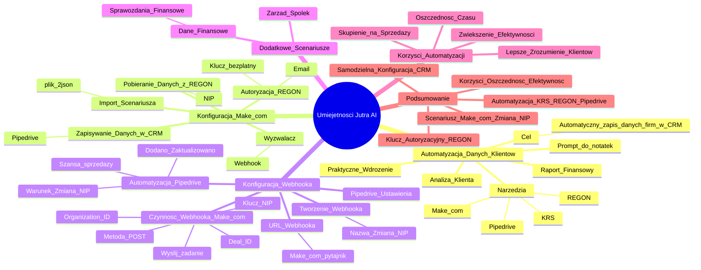

# Lekcje wideo - 7. Rozszerzona analiza klienta - praktyka - część 1

# 💡 Diagram

___

# 🗒️ Notatka

# Notatki i Podsumowanie Lekcji: "Umiejętności Jutra AI" - Praktyczne Wdrożenie Automatyzacji Pozyskiwania Danych Klientów

## Wprowadzenie

Lekcja "Umiejętności Jutra AI" koncentruje się na praktycznym zastosowaniu automatyzacji w analizie klienta. W tej części kursu Szymon Kita z Let's automate, krok po kroku demonstruje, jak wdrożyć i skonfigurować narzędzia do automatycznego pozyskiwania kluczowych informacji o potencjalnych klientach oraz ich analizy. Głównym celem jest pokazanie, jak za pomocą platformy **Make.com** i integracji z bazą **KRS** (Krajowy Rejestr Sądowy) oraz rejestrem **REGON** (GUS), można automatycznie zapisywać dane firm w systemie **CRM** (Customer Relationship Management), takim jak **Pipedrive**. Lekcja obejmuje również tworzenie automatycznego raportu dotyczącego kondycji finansowej firmy oraz konstruowanie **promptu** do notatek.

## Część Praktyczna - Automatyzacja Pozyskiwania Danych Firm z KRS/REGON do CRM

### Konfiguracja Scenariusza w Make.com

- **Cel:** Automatyczne pozyskiwanie danych firm z rejestru **REGON** (GUS) i zapisywanie ich w **CRM Pipedrive**.
- **Narzędzia:** **Make.com** (platforma do automatyzacji), **Pipedrive** (CRM), Rejestr **REGON** (GUS).
- **Wyzwalacz (Webhook):** Scenariusz w **Make.com** uruchamia się za pomocą `webhooka` aktywowanego zmianą numeru **NIP** w systemie **CRM Pipedrive**.

### Kroki Konfiguracji Scenariusza

1. **Import Scenariusza w Make.com:**
    - Zaimportuj gotowy scenariusz z pliku `2.json` do **Make.com**.
    - Scenariusz zawiera moduły odpowiedzialne za połączenie z rejestrem **REGON**.

2. **Autoryzacja w REGON (GUS):**
    - Dostęp do danych **REGON** wymaga specjalnego klucza autoryzacyjnego.
    - Klucz jest **bezpłatny** i można go uzyskać, wysyłając e-mail na wskazany adres (informacje w materiałach dodatkowych do lekcji). 📧
    - Autoryzacja w **REGON** różni się od tej z poprzedniej lekcji i wykorzystuje unikalny klucz, który należy uzyskać.

3. **Pobieranie Danych z REGON:**
    - Po otrzymaniu numeru **NIP**, scenariusz pobiera podstawowe informacje o firmie z rejestru **REGON**.

4. **Zapisywanie Danych w CRM (Pipedrive):**
    - Pobierane dane są automatycznie zapisywane w systemie **CRM Pipedrive**.
    - Wykorzystywany jest standardowy moduł zapisu danych w **CRM**.

### Konfiguracja Webhooka w Pipedrive

1. **Tworzenie Webhooka w Pipedrive:**
    - Przejdź do ustawień automatyzacji w **Pipedrive**.
    - Dodaj nowy element `webhook`.
    - Nazwij `webhooka`, np. "Zmiana NIP".
    - Wklej **URL webhooka** skopiowany z **Make.com**.
    - Dodaj znak zapytania `?` na końcu **URL webhooka**.

2. **Ustawienie Automatyzacji w Pipedrive:**
    - Dodaj automatyzację wyzwalaną wydarzeniem "Szansa sprzedaży".
    - Wybierz wydarzenie "Dodano lub zaktualizowano".
    - Ustaw warunek wyzwalania na zmianę pola "NIP" (NIP zmienił się).

3. **Konfiguracja Czynności Webhooka:**
    - Dodaj czynność "`Webhook`" w **Make.com**.
    - Wybierz "Wyślij żądanie elementu webhook".
    - Wybierz wcześniej utworzonego `webhooka` "Zmiana NIP".
    - Metoda: `POST`.
    - Klucz: **NIP** (dane potrzebne do wysłania do `webhooka`).
    - Dodaj dodatkowe dane do `webhooka`, np. `Deal ID`, `Organization ID` (identyfikatory z **Pipedrive**).

### Dodatkowe Scenariusze (Wspomniane)

- **Pobieranie Danych Finansowych i Zarządu Spółek:**
    - Planowane jest zaprezentowanie scenariusza, który oprócz podstawowych danych, pobiera informacje finansowe ze sprawozdań finansowych firm oraz dane o zarządzie spółek. 📊
    - Ten scenariusz zostanie omówiony w dalszej części lekcji.

## Korzyści z Automatyzacji

- **Oszczędność Czasu 🕰️:** Automatyzacja pozwala zaoszczędzić czas pracowników, który wcześniej byłby poświęcony na ręczne wyszukiwanie i wprowadzanie danych.
- **Zwiększenie Efektywności 🚀:** Automatyczne pozyskiwanie danych i ich analiza podnosi efektywność działań sprzedażowych oraz analizy ryzyka współpracy z firmami.
- **Skupienie na Kluczowych Działaniach Sprzedażowych 🎯:** Dzięki automatyzacji, zespoły sprzedażowe mogą skoncentrować się na budowaniu relacji z klientami i finalizacji transakcji, zamiast na żmudnym zbieraniu danych.
- **Lepsze Zrozumienie Potencjalnych Klientów 💡:** Automatyczny raport dotyczący kondycji finansowej firmy pomaga lepiej zrozumieć potencjał i ryzyka związane ze współpracą.

## Podsumowanie

Ta część lekcji "Umiejętności Jutra AI" demonstruje praktyczne wdrożenie automatyzacji procesu pozyskiwania danych o firmach z rejestrów publicznych (**REGON**) i integracji ich z systemem **CRM Pipedrive**. Szymon Kita krok po kroku pokazuje, jak skonfigurować scenariusz w **Make.com**, który na podstawie zmiany numeru **NIP** w **Pipedrive**, automatycznie pobiera dane firmy z **REGON** i zapisuje je w **CRM**. Podkreślono znaczenie bezpłatnego klucza autoryzacyjnego do **REGON** oraz korzyści wynikające z automatyzacji, takie jak oszczędność czasu i zwiększenie efektywności działań sprzedażowych. Lekcja zapowiada również omówienie kolejnych scenariuszy, w tym automatycznego pobierania danych finansowych i informacji o zarządzie spółek. Uczestnicy po tej lekcji powinni być w stanie samodzielnie skonfigurować podobne rozwiązania w swoich systemach **CRM**.

___

# 🔉 Transcript
File: Lekcje wideo - 7. Rozszerzona analiza klienta - praktyka - część 1.mp4 
[00:00:00] Ekran: Białe tło.
[00:00:01] Ekran: Napis "Umiejętności Jutra AI". Poniżej napisy "Organizator Google" i "Partner edukacyjny SGH".
[00:00:05] Ekran: Szymon Kita, CEO i co-founder Let's automate.
[00:00:05] Teraz, gdy omówiliśmy przykłady zastosowania rozszerzonej analizy klienta, czas przejść do części praktycznej tej lekcji.
[00:00:13] W tej części skupimy się na pokazaniu krok po kroku, jak wdrożyć i skonfigurować narzędzia, które umożliwiają automatyczne pozyskiwanie kluczowych informacji o potencjalnych klientach oraz ich analizę.
[00:00:25] W tej części lekcji pokażę ci jak skonfigurować scenariusz w Make.com, który pozwoli na integrację z bazą KRS i automatyczne zapisanie zebranych danych w CRM.
[00:00:35] Przejdziemy również przez proces budowania automatycznego raportu dotyczącego stanu finansowego firmy, aby lepiej zrozumieć jej potencjał i ryzyka związane ze współpracą.
[00:00:45] Co ważne, pokażę w jaki sposób konstruować prompt odpowiedzialny za stworzenie tej notatki, który będziesz mógł, mogła wykorzystać w swojej firmie i dostosować ją do swoich potrzeb.
[00:00:57] Po zakończeniu tej części będziesz w stanie samodzielnie skonfigurować podobne rozwiązania w swoim systemie CRM, co pozwoli ci skupić się na kluczowych działaniach sprzedażowych, oszczędzając czas i zwiększając efektywność.
[00:01:11] Zapraszam więc do części praktycznej, gdzie zbudujemy te narzędzia razem.
[00:01:15] Ekran: All scenarios w Make.com.
[00:01:15] W takim razie przechodzimy do budowania.
[00:01:17] Jesteśmy już w Make'u, więc możemy otworzyć nowy scenariusz.
[00:01:20] Ekran: Tworzenie nowego scenariusza w Make.com.
[00:01:20] Ponownie importujemy go z pliku.
[00:01:23] Tym razem będzie to plik 2.json.
[00:01:28] Ekran: Zaimportowany scenariusz w Make.com.
[00:01:28] Mamy zaimportowany scenariusz i teraz pokrótce omówię co tutaj się dzieje.
[00:01:32] Oczywiście scenariusz ponownie jest wyzwalany przy pomocy webhooka, tym razem aktywnego aktywowanego na podstawie zmiany numeru NIP, więc ponownie utworzymy sobie webhooka i skonfigurujemy to wszystko w systemie CRM.
[00:01:47] Natomiast później mamy takie moduły odpowiedzialne za właściwie przygotowanie się do połączenia i połączenie z rejestrem REGON udostępnianym przez GUS, czyli taką instytucję państwową.
[00:02:01] i tutaj autoryzacja przebiega w taki dosyć nietypowy sposób.
[00:02:04] My w materiałach dodatkowych do tej lekcji przekażemy informacje jak taki klucz pozwalający na dostęp do tych danych można uzyskać.
[00:02:14] Uzyskać w pełni bezpłatnie, trzeba wysłać maila na specjalny adres mailowy i poczekać kilku godzin do do kilku dni.
[00:02:22] Mówię o tym dlatego, że tutaj ta autoryzacja przebiega zupełnie inaczej niż w poprzedniej lekcji, tutaj jest ten klucz, on jest dla was niewidoczny z uwagi na to, że no nie można w takiej ilości z niego korzystać.
[00:02:37] Natomiast każdy, absolutnie każdy może go bezpłatnie uzyskać.
[00:02:41] Później jakby pobieramy sobie te dane i zapisujemy standardowo w systemie CRM, czyli u nas w Pipedrive.
[00:02:48] To jest jeden z scenariuszy, o których opowiem w trakcie trwania tej lekcji.
[00:02:55] Ten pobiera podstawowe informacje o firmie, a za chwilę przejdziemy też do scenariusza, który pobiera informacje finansowe ze sprawozdań finansowych oraz informacje o zarządzie spółek.
[00:03:08] W związku z tym zacznijmy konfigurację, czyli ponownie tworzymy sobie webhooka.
[00:03:15] Zmiana NIP.
[00:03:22] Zapisujemy, kopiujemy, klikamy okej.
[00:03:22] Ekran: Pipedrive.
[00:03:22] Przechodzimy sobie do Pipedrive'a, ponownie trzy kropeczki, automatyzację, elementy webhook, automatyczne elementy webhook.
[00:03:30] O, w sumie nie musiałem tego klikać, wystarczy element webhook, tutaj go dodajemy.
[00:03:34] Zmiana NIP.
[00:03:37] Wklejamy, dodajemy pytajnik na końcu.
[00:03:40] Zapisujemy.
[00:03:41] I możemy przejść stąd prosto do automatyzacji, gdzie dodajemy sobie automatyzację wyzwalaną wydarzeniem na podstawie szansy sprzedaży, gdzie dodano lub zaktualizowano.
[00:03:56] Znowu to jest ten sam wątek, o którym mówiłem wcześniej.
[00:03:57] Myślę, że może tutaj jak najbardziej zostać zaktualizowano.
[00:04:02] Przyda nam się to w formie właśnie tutaj na potrzebę nagrywania tej lekcji.
[00:04:08] Przejdziemy dalej i wybieramy sobie NIP.
[00:04:13] Ponownie zmienił się.
[00:04:15] Tak będzie dla nas najprościej.
[00:04:17] Następnie robimy to co robiliśmy już do tej pory, czyli chcielibyśmy ustalić jakich danych, jakie dane są nam tutaj potrzebne, w związku z tym trzeba przeklikać jakieś moduły.
[00:04:29] Widzimy, że to jest po prostu pod nazwą NIP.
[00:04:32] więc ponownie utworzymy sobie webhooka i skonfigurujemy to wszystko w systemie CRM.
[00:04:47] Natomiast później mamy takie moduły odpowiedzialne za właściwie przygotowanie się do połączenia i połączenie z rejestrem REGON udostępnianym przez GUS, czyli taką instytucję państwową.
[00:05:01] i tutaj autoryzacja przebiega w taki dosyć nietypowy sposób.
[00:05:04] My w materiałach dodatkowych do tej lekcji przekażemy informacje jak taki klucz pozwalający na dostęp do tych danych można uzyskać.
[00:05:14] Uzyskać w pełni bezpłatnie, trzeba wysłać maila na specjalny adres mailowy i poczekać kilku godzin do do kilku dni.
[00:05:22] Mówię o tym dlatego, że tutaj ta autoryzacja przebiega zupełnie inaczej niż w poprzedniej lekcji, tutaj jest ten klucz, on jest dla was niewidoczny z uwagi na to, że no nie można w takiej ilości z niego korzystać.
[00:05:36] Natomiast każdy, absolutnie każdy może go bezpłatnie uzyskać.
[00:05:40] Później jakby pobieramy sobie te dane i zapisujemy standardowo w systemie CRM, czyli u nas w Pipedrive.
[00:05:57] Ekran: Szymon Kita.
[00:05:57] I to jest jeden z scenariuszy, o których opowiem w trakcie trwania tej lekcji.
[00:06:00] Ten pobiera podstawowe informacje o firmie, a za chwilę przejdziemy też do scenariusza, który pobiera informacje finansowe ze sprawozdań finansowych oraz informacje o zarządzie spółek.
[00:06:08] W związku z tym zacznijmy konfigurację, czyli ponownie tworzymy sobie webhooka.
[00:06:16] Zmiana NIP 2.
[00:06:21] Zapisujemy.
[00:06:22] Kopiujemy.
[00:06:22] Klikamy okej.
[00:06:22] Ekran: Pipedrive.
[00:06:22] Przechodzimy sobie do Pipedrive'a, ponownie trzy kropeczki, automatyzację, elementy webhook.
[00:06:30] Automatyczne, o, w sumie nie musiałem tego klikać, wystarczy element webhook, tutaj go dodajemy.
[00:06:34] Zmiana NIP 2.
[00:06:37] Wklejamy, dodajemy pytajnik na końcu.
[00:06:40] Zapisujemy.
[00:01:11] Ekran: All scenarios w Make.com.
[00:06:40] I możemy przejść stąd prosto do automatyzacji, gdzie dodajemy sobie automatyzację wyzwalaną wydarzeniem na podstawie szansy sprzedaży, gdzie dodano lub zaktualizowano.
[00:07:00] Znowu to jest ten sam wątek, o którym mówiłem wcześniej.
[00:07:01] Myślę, że może tutaj jak najbardziej zostać zaktualizowano.
[00:07:03] Przyda nam się to w formie właśnie tutaj na potrzebę nagrywania tej lekcji.
[00:07:08] Przejdziemy dalej.
[00:07:09] I wybieramy sobie NIP.
[00:07:13] I ponownie zmienił się.
[00:07:15] Tak będzie dla nas najprościej.
[00:07:17] Następnie robimy to co robiliśmy już do tej pory, czyli chcielibyśmy ustalić jakich danych, jakie dane są nam tutaj potrzebne, w związku z tym trzeba przeklikać jakieś moduły.
[00:07:23] Widzimy, że to jest po prostu pod nazwą NIP.
[00:07:26] więc dodajemy sobie tutaj czynność webhooka.
[00:07:30] Wyślij żądanie elementu webhook.
[00:07:31] Przechodzimy dalej.
[00:07:31] Wybieramy sobie nasz webhook, czyli zmiana NIP, metodą post i kluczem dla nas będzie NIP.
[00:07:52] Oczywiście, tak jest akurat w tym scenariuszu, natomiast można to oczywiście zmienić.
[00:07:55] I tutaj również nazwa to jest NIP.
[00:08:01] Nie wiem, czy są jeszcze potrzebne dane jakieś, na pewno będzie o organizacji, więc możemy sobie zobaczyć, bo tu mamy jak się zautoryzujemy przy okazji, to już widzimy, że potrzebujemy Deal ID i Organization ID.
[00:08:15] I to pewnie będzie to samo.
[00:08:19] Tak, więc od razu możemy sobie dodać te informacje do webhooka.
[00:08:22] Mówię o tym dlatego, że tutaj ta autoryzacja przebiega zupełnie inaczej niż w poprzedniej lekcji, tutaj jest ten klucz, on jest dla was niewidoczny z uwagi na to, że no nie można w takiej ilości z niego korzystać.
[00:08:36] Natomiast każdy absolutnie każdy może go bezpłatnie uzyskać.
[00:08:40] Później jakby pobieramy sobie te dane i zapisujemy standardowo w systemie CRM, czyli u nas w Pipedrive.
[00:08:52] To jest jeden z scenariuszy, o których opowiem w trakcie trwania tej lekcji.
[00:08:57] Ten pobiera podstawowe informacje o firmie, a za chwilę przejdziemy też do scenariusza, który pobiera informacje finansowe ze sprawozdań finansowych oraz informacje o zarządzie spółek.
[00:09:08] W związku z tym zacznijmy konfigurację, czyli ponownie tworzymy sobie webhooka.
[00:11:11] Ekran: All scenarios w Make.com.
[00:11:11] Ekran: Zaimportowany scenariusz w Make.com.
[00:11:11] Ekran: Tworzenie nowego webhooka w Make.com.
[00:11:11] Ekran: Pipedrive.
[00:11:11] Ekran: Zaimportowany scenariusz w Make.com.
[00:11:11] Ekran: Tworzenie nowego webhooka w Make.com.
[00:11:11] Ekran: Pipedrive.
[00:11:11] Ekran: Zaimportowany scenariusz w Make.com.
[00:11:11] Ekran: Tworzenie nowego webhooka w Make.com.
[00:11:11] Ekran: Pipedrive.
[00:11:11] Ekran: Zaimportowany scenariusz w Make.com.
[00:11:11] Ekran: Tworzenie nowego webhooka w Make.com.
[00:11:11] Ekran: Pipedrive.
[00:11:11] Ekran: Zaimportowany scenariusz w Make.com.
[00:11:11] Ekran: Tworzenie nowego webhooka w Make.com.
[00:11:11] Ekran: Pipedrive.
[00:11:11] Ekran: Zaimportowany scenariusz w Make.com.
[00:11:11] Ekran: Tworzenie nowego webhooka w Make.com.
[00:11:11] Ekran: Pipedrive.
[00:11:11] Ekran: Zaimportowany scenariusz w Make.com.
[00:11:11] Ekran: Tworzenie nowego webhooka w Make.com.
[00:11:11] Ekran: Pipedrive.
[00:11:11] Ekran: Zaimportowany scenariusz w Make.com.
[00:11:11] Ekran: Tworzenie nowego webhooka w Make.com.
[00:11:11] Ekran: Pipedrive.
[00:11:11] Ekran: Zaimportowany scenariusz w Make.com.
[00:11:11] Ekran: Tworzenie nowego webhooka w Make.com.
[00:11:11] Ekran: Pipedrive.
[00:11:11] Ekran: Zaimportowany scenariusz w Make.com.
[00:11:11] Ekran: Tworzenie nowego webhooka w Make.com.
[00:11:11] Ekran: Pipedrive.
[00:11:11] Ekran: Zaimportowany scenariusz w Make.com.
[00:11:11] Ekran: Tworzenie nowego webhooka w Make.com.
[00:11:11] Ekran: Pipedrive.
[00:11:11] Ekran: Zaimportowany scenariusz w Make.com.
[00:11:11] Ekran: Tworzenie nowego webhooka w Make.com.
[00:11:11] Ekran: Pipedrive.
[00:11:11] Ekran: Zaimportowany scenariusz w Make.com.
[00:11:11] Ekran: Tworzenie nowego webhooka w Make.com.
[00:11:11] Ekran: Pipedrive.
[00:11:11] Ekran: Zaimportowany scenariusz w Make.com.
[00:11:11] Ekran: Tworzenie nowego webhooka w Make.com.
[00:11:11] Ekran: Pipedrive.
[00:11:11] Ekran: Zaimportowany scenariusz w Make.com.
[00:11:11] Ekran: Tworzenie nowego webhooka w Make.com.
[00:11:11] Ekran: Pipedrive.
[00:11:11] Ekran: Zaimportowany scenariusz w Make.com.
[00:11:11] Ekran: Tworzenie nowego webhooka w Make.com.
[00:11:11] Ekran: Pipedrive.
[00:11:11] Ekran: Zaimportowany scenariusz w Make.com.
[00:11:11] Ekran: Tworzenie nowego webhooka w Make.com.
[00:11:11] Ekran: Pipedrive.
[00:11:11] Ekran: Zaimportowany scenariusz w Make.com.
[00:11:11] Ekran: Tworzenie nowego webhooka w Make.com.
[00:11:11] Ekran: Pipedrive.
[00:11:11] Ekran: Zaimportowany scenariusz w Make.com.
[00:11:11] Ekran: Tworzenie nowego webhooka w Make.com.
[00:11:11] Ekran: Pipedrive.
[00:11:11] Ekran: Zaimportowany scenariusz w Make.com.
[00:11:11] Ekran: Tworzenie nowego webhooka w Make.com.
[00:11:11] Ekran: Pipedrive.
[00:11:11] Ekran: Zaimportowany scenariusz w Make.com.
[00:11:11] Ekran: Tworzenie nowego webhooka w Make.com.
[00:11:11] Ekran: Pipedrive.
[00:11:11] Ekran: Zaimportowany scenariusz w Make.com.
[00:11:11] Ekran: Tworzenie nowego webhooka w Make.com.
[00:11:11] Ekran: Pipedrive.
[00:11:11] Ekran: Zaimportowany scenariusz w Make.com.
[00:11:11] Ekran: Tworzenie nowego webhooka w Make.com.
[00:11:11] Ekran: Pipedrive.
[00:11:11] Ekran: Zaimportowany scenariusz w Make.com.
[00:11:11] Ekran: Tworzenie nowego webhooka w Make.com.
[00:11:11] Ekran: Pipedrive.
[00:11:11] Ekran: Zaimportowany scenariusz w Make.com.
[00:11:11] Ekran: Tworzenie nowego webhooka w Make.com.
[00:11:11] Ekran: Pipedrive.
[00:11:11] Ekran: Zaimportowany scenariusz w Make.com.
[00:11:11] Ekran: Tworzenie nowego webhooka w Make.com.
[00:11:11] Ekran: Pipedrive.
[00:11:11] Ekran: Zaimportowany scenariusz w Make.com.
[00:11:11] Ekran: Tworzenie nowego webhooka w Make.com.
[00:11:11] Ekran: Pipedrive.
[00:11:11] Ekran: Zaimportowany scenariusz w Make.com.
[00:11:11] Ekran: Tworzenie nowego webhooka w Make.com.
[00:11:11] Ekran: Pipedrive.
[00:11:11] Ekran: Zaimportowany scenariusz w Make.com.
[00:11:11] Ekran: Tworzenie nowego webhooka w Make.com.
[00:11:11] Ekran: Pipedrive.
[00:11:11] Ekran: Zaimportowany scenariusz w Make.com.
[00:11:11] Ekran: Tworzenie nowego webhooka w Make.com.
[00:11:11] Ekran: Pipedrive.
[00:11:11] Ekran: Zaimportowany scenariusz w Make.com.
[00:11:11] Ekran: Tworzenie nowego webhooka w Make.com.
[00:11:11] Ekran: Pipedrive.
[00:11:11] Ekran: Zaimportowany scenariusz w Make.com.
[00:11:11] Ekran: Tworzenie nowego webhooka w Make.com.
[00:11:11] Ekran: Pipedrive.
[00:11:11] Ekran: Zaimportowany scenariusz w Make.com.
[00:11:11] Ekran: Tworzenie nowego webhooka w Make.com.
[00:11:11] Ekran: Pipedrive.
[00:11:11] Ekran: Zaimportowany scenariusz w Make.com.
[00:11:11] Ekran: Tworzenie nowego webhooka w Make.com.
[00:11:11] Ekran: Pipedrive.
[00:11:11] Ekran: Zaimportowany scenariusz w Make.com.
[00:11:11] Ekran: Tworzenie nowego webhooka w Make.com.
[00:11:11] Ekran: Pipedrive.
[00:11:11] Ekran: Zaimportowany scenariusz w Make.com.
[00:11:11] Ekran: Tworzenie nowego webhooka w Make.com.
[00:11:11] Ekran: Pipedrive.
[00:11:11] Ekran: Zaimportowany scenariusz w Make.com.
[00:11:11] Ekran: Tworzenie nowego webhooka w Make.com.
[00:11:11] Ekran: Pipedrive.
[00:11:11] Ekran: Zaimportowany scenariusz w Make.com.
[00:11:11] Ekran: Tworzenie nowego webhooka w Make.com.
[00:11:11] Ekran: Pipedrive.
[00:11:11] Ekran: Zaimportowany scenariusz w Make.com.
[00:11:11] Ekran: Tworzenie nowego webhooka w Make.com.
[00:11:11] Ekran: Pipedrive.
[00:11:11] Ekran: Zaimportowany scenariusz w Make.com.
[00:11:11] Ekran: Tworzenie nowego webhooka w Make.com.
[00:11:11] Ekran: Pipedrive.
[00:11:11] Ekran: Zaimportowany scenariusz w Make.com.
[00:11:11] Ekran: Tworzenie nowego webhooka w Make.com.
[00:11:11] Ekran: Pipedrive.
[00:11:11] Ekran: Zaimportowany scenariusz w Make.com.
[00:11:11] Ekran: Tworzenie nowego webhooka w Make.com.
[00:11:11] Ekran: Pipedrive.
[00:11:11] Ekran: Zaimportowany scenariusz w Make.com.
[00:11:11] Ekran: Tworzenie nowego webhooka w Make.com.
[00:11:11] Ekran: Pipedrive.
[00:11:11] Ekran: Zaimportowany scenariusz w Make.com.
[00:11:11] Ekran: Tworzenie nowego webhooka w Make.com.
[00:11:11] Ekran: Pipedrive.
[00:11:11] Ekran: Zaimportowany scenariusz w Make.com.
[00:11:11] Ekran: Tworzenie nowego webhooka w Make.com.
[00:11:11] Ekran: Pipedrive.
[00:11:11] Ekran: Zaimportowany scenariusz w Make.com.
[00:11:11] Ekran: Tworzenie nowego webhooka w Make.com.
[00:11:11] Ekran: Pipedrive.
[00:11:11] Ekran: Zaimportowany scenariusz w Make.com.
[00:11:11] Ekran: Tworzenie nowego webhooka w Make.com.
[00:11:11] Ekran: Pipedrive.
[00:11:11] Ekran: Zaimportowany scenariusz w Make.com.
[00:11:11] Ekran: Tworzenie nowego webhooka w Make.com.
[00:11:11] Ekran: Pipedrive.
[00:11:11] Ekran: Zaimportowany scenariusz w Make.com.
[00:11:11] Ekran: Tworzenie nowego webhooka w Make.com.
[00:11:11] Ekran: Pipedrive.
[00:11:11] Ekran: Zaimportowany scenariusz w Make.com.
[00:11:11] Ekran: Tworzenie nowego webhooka w Make.com.
[00:11:11] Ekran: Pipedrive.
[00:11:11] Ekran: Zaimportowany scenariusz w Make.com.
[00:11:11] Ekran: Tworzenie nowego webhooka w Make.com.
[00:11:11] Ekran: Pipedrive.
[00:11:11] Ekran: Zaimportowany scenariusz w Make.com.
[00:11:11] Ekran: Tworzenie nowego webhooka w Make.com.
[00:11:11] Ekran: Pipedrive.
[00:11:11] Ekran: Zaimportowany scenariusz w Make.com.
[00:11:11] Ekran: Tworzenie nowego webhooka w Make.com.
[00:11:11] Ekran: Pipedrive.
[00:11:11] Ekran: Zaimportowany scenariusz w Make.com.
[00:11:11] Ekran: Tworzenie nowego webhooka w Make.com.
[00:11:11] Ekran: Pipedrive.
[00:11:11] Ekran: Zaimportowany scenariusz w Make.com.
[00:11:11] Ekran: Tworzenie nowego webhooka w Make.com.
[00:11:11] Ekran: Pipedrive.
[00:11:11] Ekran: Zaimportowany scenariusz w Make.com.
[00:11:11] Ekran: Tworzenie nowego webhooka w Make.com.
[00:11:11] Ekran: Pipedrive.
[00:11:11] Ekran: Zaimportowany scenariusz w Make.com.
[00:11:11] Ekran: Tworzenie nowego webhooka w Make.com.
[00:11:11] Ekran: Pipedrive.
[00:11:11] Ekran: Zaimportowany scenariusz w Make.com.
[00:11:11] Ekran: Tworzenie nowego webhooka w Make.com.
[00:11:11] Ekran: Pipedrive.
[00:11:11] Ekran: Zaimportowany scenariusz w Make.com.
[00:11:11] Ekran: Tworzenie nowego webhooka w Make.com.
[00:11:11] Ekran: Pipedrive.
[00:11:11] Ekran: Zaimportowany scenariusz w Make.com.
[00:11:11] Ekran: Tworzenie nowego webhooka w Make.com.
[00:11:11] Ekran: Pipedrive.
[00:11:11] Ekran: Zaimportowany scenariusz w Make.com.
[00:11:11] Ekran: Tworzenie nowego webhooka w Make.com.
[00:11:11] Ekran: Pipedrive.
[00:11:11] Ekran: Zaimportowany scenariusz w Make.com.
[00:11:11] Ekran: Tworzenie nowego webhooka w Make.com.
[00:11:11] Ekran: Pipedrive.
[00:11:11] Ekran: Zaimportowany scenariusz w Make.com.
[00:11:11] Ekran: Tworzenie nowego webhooka w Make.com.
[00:11:11] Ekran: Pipedrive.
[00:11:11] Ekran: Zaimportowany scenariusz w Make.com.
[00:11:11] Ekran: Tworzenie nowego webhooka w Make.com.
[00:11:11] Ekran: Pipedrive.
[00:11:11] Ekran: Zaimportowany scenariusz w Make.com.
[00:11:11] Ekran: Tworzenie nowego webhooka w Make.com.
[00:11:11] Ekran: Pipedrive.
[00:11:11] Ekran: Zaimportowany scenariusz w Make.com.
[00:11:11] Ekran: Tworzenie nowego webhooka w Make.com.
[00:11:11] Ekran: Pipedrive.
[00:11:11] Ekran: Zaimportowany scenariusz w Make.com.
[00:11:11] Ekran: Tworzenie nowego webhooka w Make.com.
[00:11:11] Ekran: Pipedrive.
[00:11:11] Ekran: Zaimportowany scenariusz w Make.com.
[00:11:11] Ekran: Tworzenie nowego webhooka w Make.com.
[00:11:11] Ekran: Pipedrive.
[00:11:11] Ekran: Zaimportowany scenariusz w Make.com.
[00:11:11] Ekran: Tworzenie nowego webhooka w Make.com.
[00:11:11] Ekran: Pipedrive.
[00:11:11] Ekran: Zaimportowany scenariusz w Make.com.
[00:11:11] Ekran: Tworzenie nowego webhooka w Make.com.
[00:11:11] Ekran: Pipedrive.
[00:11:11] Ekran: Zaimportowany scenariusz w Make.com.
[00:11:11] Ekran: Tworzenie nowego webhooka w Make.com.
[00:11:11] Ekran: Pipedrive.
[00:11:11] Ekran: Zaimportowany scenariusz w Make.com.
[00:11:11] Ekran: Tworzenie nowego webhooka w Make.com.
[00:11:11] Ekran: Pipedrive.
[00:11:11] Ekran: Zaimportowany scenariusz w Make.com.
[00:11:11] Ekran: Tworzenie nowego webhooka w Make.com.
[00:11:11] Ekran: Pipedrive.
[00:11:11] Ekran: Zaimportowany scenariusz w Make.com.
[00:11:11] Ekran: Tworzenie nowego webhooka w Make.com.
[00:11:11] Ekran: Pipedrive.
[00:11:11] Ekran: Zaimportowany scenariusz w Make.com.
[00:11:

___
# 🏷️ Tags
#Umiejętności_Jutra_AI #automatyzacja #analiza_klienta #Szymon_Kita #Lets_automate #Make.com #KRS #REGON #GUS #CRM #Pipedrive #webhook #NIP #Deal_ID #Organization_ID #dane_finansowe #zarząd_spółek #oszczędność_czasu #zwiększenie_efektywności #działania_sprzedażowe #potencjalni_klienci #ryzyko_współpracy #import_scenariusza #autoryzacja #klucz_autoryzacyjny #URL_webhooka #POST #szansa_sprzedaży #automatyczny_raport #prompt #integracja_KRS #integracja_REGON #integracja_CRM #bezpłatny_klucz #rejestry_publiczne #konfiguracja_scenariusza #zbieranie_danych #automatyczne_pozyskiwanie_danych #analiza_ryzyka #budowanie_relacji #finalizacja_transakcji #samodzielna_konfiguracja #system_CRM #All_scenarios #plik_JSON #zmiana_NIP #instytucja_państwowa #adres_mailowy #moduły #element_webhook #żądanie_elementu_webhook
