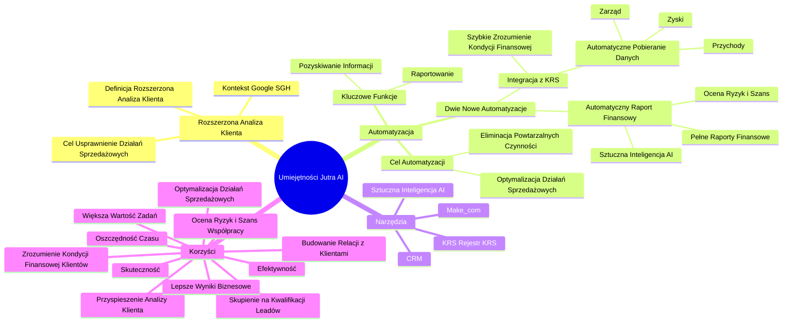

# Lekcje wideo - 8. Rozszerzona analiza klienta - praktyka - część 2

# 💡 Diagram

___

# 🗒️ Notatka

# Umiejętności Jutra AI: Rozszerzona Analiza Klienta

## Wprowadzenie

Lekcja z serii "Umiejętności Jutra AI", organizowanej przez Google we współpracy z SGH, poświęcona jest **rozszerzonej analizie klienta** i korzyściom płynącym z wdrożenia automatyzacji i sztucznej inteligencji (AI) w procesie analizy potencjalnych klientów. Prezentacja koncentruje się na integracji narzędzi takich jak **Make.com**, system **CRM**, i **KRS**, które wspierają efektywność działań sprzedażowych.

## Kluczowe Osiągnięcia i Narzędzia

### Podsumowanie Dotychczasowych Rezultatów

*   Prelegent rozpoczyna od podsumowania dotychczasowych **osiągnięć** wynikających z wdrożenia rozszerzonej analizy klienta.
*   Zwraca uwagę na **integrację narzędzi**: **Make.com** i **CRM**, które znacząco **przyspieszyły proces analizy potencjalnych klientów** ⏳.

### Automatyzacja Pozyskiwania Informacji

*   **Automatyczne pozyskiwanie kluczowych informacji o firmach** jest fundamentalne dla usprawnienia procesu.
*   Dzięki automatyzacji możliwe jest **zaoszczędzenie czasu** ⏱️ i **skupienie się na efektywnej kwalifikacji leadów**.

### Dwie Nowe Automatyzacje

*   W tej lekcji zaprezentowano **dwie nowe automatyzacje**, rozszerzające funkcjonalności omówione wcześniej.
    *   **Integracja z rejestrem KRS** 🏢:
        *   **Automatyczne pobieranie danych rejestrowych firm**, w tym:
            *   Przychody 📈
            *   Zyski 💰
            *   Informacje o zarządzie 🧑‍💼
        *   Umożliwia **szybkie zrozumienie kondycji finansowej klientów** bez manualnego wyszukiwania danych.
    *   **Automatyczny raport finansowy** 📊:
        *   Wykorzystanie **sztucznej inteligencji** 🤖 do generowania **pełnych raportów** o kondycji finansowej firmy.
        *   Wspomaga **błyskawiczną ocenę potencjalnych ryzyk i szans współpracy** z daną firmą.

## Cel Automatyzacji i Korzyści

### Eliminacja Powtarzalnych Czynności

*   Głównym celem automatyzacji jest **eliminacja powtarzalnych i czasochłonnych czynności** 🔄.
*   Pozwala to pracownikom skoncentrować się na **bardziej wartościowych zadaniach**, takich jak **budowanie relacji z klientami** 🤝.

### Optymalizacja Działań Sprzedażowych

*   Prelegent podkreśla **kluczową rolę automatyzacji procesów analizy klientów** w **optymalizacji działań sprzedażowych** 🚀.
*   Koncentracja zasobów tam, gdzie generują **największą wartość** 💎.

### Efektywność i Skuteczność

*   Automatyzacja zwiększa **szanse na skuteczne zamknięcie sprzedaży** ✅.
*   **Czas** jest wykorzystywany efektywniej ⏱️.

### Najważniejsze Zastosowanie Automatyzacji i AI

*   Podsumowując, prelegent zaznacza, że **najcenniejszym aspektem automatyzacji i sztucznej inteligencji jest ich zastosowanie** w usprawnianiu i optymalizacji procesów biznesowych, co przekłada się na większą efektywność i lepsze wyniki 🏆.

## Podsumowanie

Lekcja "Umiejętności Jutra AI" koncentruje się na praktycznym wykorzystaniu automatyzacji i sztucznej inteligencji w analizie klientów. Dzięki integracji narzędzi takich jak `Make.com`, `CRM` i `KRS`, oraz wykorzystaniu AI do tworzenia raportów finansowych, firmy mogą znacząco przyspieszyć i usprawnić proces analizy potencjalnych klientów. Automatyzacja eliminuje czasochłonne, manualne zadania, umożliwiając zespołom sprzedażowym skupienie się na budowaniu relacji i efektywnej kwalifikacji leadów. W rezultacie, firmy mogą optymalizować swoje działania sprzedażowe, zwiększać skuteczność i efektywniej wykorzystywać czas, co prowadzi do lepszych wyników biznesowych. Kluczowym przesłaniem jest podkreślenie znaczenia automatyzacji procesów analizy klientów dla osiągnięcia optymalizacji i sukcesu w sprzedaży.

___

# 🔉 Transcript
File: Lekcje wideo - 8. Rozszerzona analiza klienta - praktyka - część 2.mp4 
[00:00:00] (Na ekranie pojawia się napis "Umiejętności Jutra AI". Poniżej napisu widnieją loga "Google" jako organizatora i "SGH" jako partnera edukacyjnego.)
[00:00:04] Speaker: Dobrze. Teraz nadszedł czas, aby przeanalizować co udało nam się osiągnąć dzięki wdrożeniu rozszerzonej analizy klienta.
[00:00:13] Speaker: Podsumowując naszą pracę, zobaczysz jak zintegrowane narzędzia takie jak Make.com oraz CRM pozwoliły nam na znaczne przyspieszenie procesu analizy potencjalnych klientów.
[00:00:24] Speaker: Dzięki temu byliśmy w stanie automatycznie pozyskać kluczowe informacje o firmach, co pozwoliło zaoszczędzić czas i skupić się na właściwej kwalifikacji leadów.
[00:00:34] Speaker: W trakcie tej lekcji zbudowaliśmy dwie automatyzacje, które świetnie rozszerzają możliwości tych, które zbudowaliśmy w poprzedniej lekcji.
[00:00:42] Speaker: Po pierwsze integracja z rejestrem KRS.
[00:00:45] Speaker: Automatyczne pobranie danych rejestrowych firmach, takie jak przychody, zyski oraz informacje o zarządzie, umożliwiło szybkie zrozumienie kondycji finansowej klientów bez konieczności ręcznego poszukiwania tych informacji.
[00:00:58] Speaker: A automatyczny raport finansowy, to w tym miejscu wykorzystaliśmy sztuczną inteligencję do stworzenia takich pełnych raportów na temat stanu finansowego firmy, co pomogło w pomogło w błyskawicznej ocenie potencjalnych ryzyk i szans współpracy z daną firmą.
[00:01:17] Speaker: Każda z tych automatyzacji miała na celu eliminację powtarzalnych i czasochłonnych czynności, dzięki czemu mogliśmy skoncentrować się na bardziej wartościowych zadaniach, takich jak budowanie relacji z klientami.
[00:01:29] Speaker: Chciałbym, abyś po tej lekcji miał, miała pełną świadomość, jak ważne jest automatyzowanie procesów analizy klientów, aby optymalizować działania sprzedażowe i koncentrować swoje zasoby tam, gdzie mogą przynieść największą wartość.
[00:01:45] Speaker: Dzięki temu masz większe szanse na skuteczne zamknięcie sprzedaży, a twój czas zostanie efektywniej wykorzystany.
[00:01:53] Speaker: I to w tym zastosowaniu i automatyzacji i sztucznej inteligencji jest chyba najpiękniejsze.
[00:01:59] Speaker: Do zobaczenia.
[00:02:00] (Na ekranie pojawia się napis "Umiejętności Jutra AI". Poniżej napisu widnieją loga "Google" jako organizatora i "SGH" jako partnera edukacyjnego.)

___
# 🏷️ Tags
#Umiejętności_Jutra_AI #rozszerzona_analiza_klienta #analiza_klienta #automatyzacja #sztuczna_inteligencja #AI #Make.com #CRM #KRS #integracja_narzędzi #efektywność #działania_sprzedażowe #osiągnięcia #przyspieszenie_procesu #potencjalni_klienci #automatyczne_pozyskiwanie_informacji #oszczędność_czasu #kwalifikacja_leadów #automatyzacje #rejestr_KRS #dane_rejestrowe #przychody #zyski #zarząd #kondycja_finansowa #raport_finansowy #ryzyko #szanse_współpracy #eliminacja_czynności #budowanie_relacji #optymalizacja_działań #wartość #skuteczność #zamknięcie_sprzedaży #procesy_biznesowe #wyniki_biznesowe #SGH #Google
