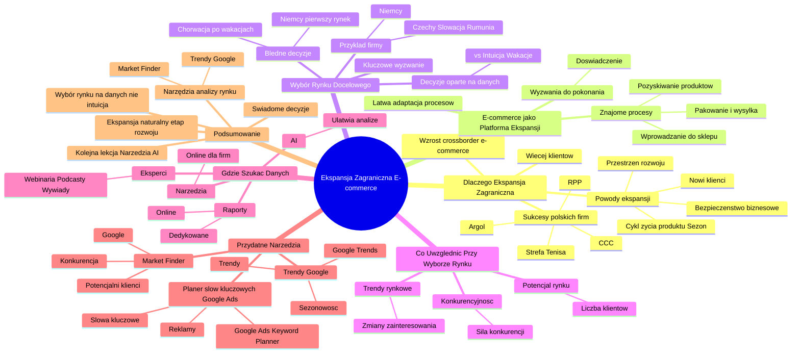

# Lekcje wideo - 1. Wybór rynku docelowego

# 💡 Diagram

___

# 🗒️ Notatka

# Ekspansja Zagraniczna Biznesu E-commerce – Notatki i Podsumowanie Lekcji

## Wprowadzenie

Ta lekcja koncentruje się na pierwszym kroku w ekspansji zagranicznej biznesu, szczególnie e-commerce, oferując jednocześnie cenne wskazówki dla firm usługowych. Główny cel to demonstracja wykorzystania narzędzi AI do usprawnienia ekspansji i podejmowania decyzji w oparciu o dane.

## Dlaczego Ekspansja Zagraniczna? 🌍

*   **Więcej klientów**: Biznes to klienci, warto więc poszukiwać ich poza lokalnym rynkiem.
*   **Dynamiczny wzrost `crossborder e-commerce`**: Już co trzeci Europejczyk kupuje online od sprzedawców z UE, a co piąty – spoza UE.
*   **Polskie firmy z sukcesami za granicą**: Przykłady firm takich jak RPP, CCC, Strefa Tenisa, Argol, które odnoszą sukcesy na rynkach europejskich.

### Powody ekspansji zagranicznej:

*   **Poszukiwanie przestrzeni i miejsca do rozwoju**.
*   **Pozyskiwanie nowych klientów**.
*   **Bezpieczeństwo biznesowe i odporność na lokalne zawirowania rynku**.
*   **Przedłużenie cyklu życia produktów lub sezonu sprzedażowego** (przykład sklepu ogrodniczego w Rumunii 🇷🇴).

## E-commerce jako Idealna Platforma Ekspansji

*   **Łatwa adaptacja procesów**: Wiele procesów e-commerce pozostaje niezmiennych przy ekspansji zagranicznej.
*   **Znajome procesy**: Pozyskiwanie produktów, wprowadzanie do sklepu, pakowanie i wysyłka pozostają podobne – zmienia się głównie kierunek dostawy.
*   **Wyzwania są do pokonania**: Nie trzeba zaczynać biznesu od zera, można bazować na dotychczasowym doświadczeniu.

## Pierwszy Krok: Wybór Rynku Docelowego 🎯

*   **Kluczowe wyzwanie**: Wybór optymalnego rynku docelowego, w który warto zainwestować.
*   **Decyzje oparte na danych**: Kluczowa jest waga podejmowania decyzji biznesowych na podstawie danych, a nie intuicji czy wrażeń z wakacji 🏖️.

### Przykłady błędnych decyzji opartych na intuicji:

*   **Chorwacja po wakacjach**: Firmy chcą rozpocząć sprzedaż w Chorwacji 🇭🇷 po urlopie, kierując się pozytywnymi wspomnieniami, lecz bez analizy danych rynkowych.
*   **Niemcy jako pierwszy rynek**: Częsty wybór, ale rynek niemiecki 🇩🇪 jest wysoce konkurencyjny. Przykład firmy z branży imprez okolicznościowych, która po nieudanym roku w Niemczech, dzięki analizie danych, wybrała rynki czeski 🇨🇿, słowacki 🇸🇰 i rumuński 🇷🇴 jako lepsze opcje.

## Co Uwzględnić Przy Wyborze Rynku? 🤔

*   **Potencjał rynku**: Liczba potencjalnych klientów zainteresowanych produktem.
*   **Trendy rynkowe**: Zmiany zainteresowania produktami na danym rynku w czasie 🕰️.
*   **Konkurencyjność**: Siła konkurencji na rynku i wysiłek potrzebny do jej pokonania.

## Gdzie Szukać Przydatnych Danych? 🔎

*   **Raporty**: Dostępne online publikacje prezentujące dane z różnych rynków, w tym raporty dedykowane konkretnym rynkom.
*   **Narzędzia**: Online narzędzia stworzone dla firm poszukujących nowych rynków, dostarczające odpowiedzi na kluczowe pytania.
*   **Wypowiedzi ekspertów**: Webinaria, podcasty, wywiady z osobami działającymi na danych rynkach, które mogą dostarczyć cennych informacji. Analiza tych materiałów jest prostsza dzięki AI 🤖.

## Przydatne Narzędzia 🧰

*   **Market Finder**: Narzędzie Google dla firm planujących ekspansję zagraniczną.
    *   Informacje o liczbie potencjalnych klientów.
    *   Dane o liczbie i sile konkurencji.
*   **Trendy Google (`Google Trends`)**: Narzędzie do analizy trendów wyszukiwania.
    *   Informacje o zmianach zainteresowania produktami w czasie.
    *   Określenie sezonowości i optymalnego czasu na rozpoczęcie kampanii reklamowych.
*   **Planer słów kluczowych Google Ads (`Google Ads Keyword Planner`)**: Narzędzie do planowania kampanii reklamowych.
    *   Szczegóły dotyczące reklamowania się na konkretne słowa kluczowe.
    *   Znane narzędzie dla reklamodawców.

## Podsumowanie

Ekspansja zagraniczna to naturalny etap rozwoju biznesu, szczególnie w e-commerce. Wybór rynku docelowego powinien opierać się na danych, a nie intuicji. Dostępnych jest wiele narzędzi, takich jak `Market Finder` i `Trendy Google`, które ułatwiają analizę potencjału rynków, trendów i konkurencji. Wykorzystanie tych narzędzi, w połączeniu z analizą danych i wiedzą ekspertów, umożliwia podejmowanie świadomych i efektywnych decyzji dotyczących ekspansji zagranicznej. Kolejna lekcja skupi się na praktycznym zastosowaniu narzędzi `Market Finder` i `Trendy Google` z wykorzystaniem AI.

___

# 🔉 Transcript
File: Lekcje wideo - 1. Wybór rynku docelowego.mp4 
[00:00:05] Z tej lekcji pokażę, jak zrobić pierwszy krok w kierunku ekspansji zagranicznej swojego biznesu.
[00:00:09] Skupimy się na przykładach z rynku e-commerce, ale będzie to cenna lekcja również dla tych, którzy świadczą usługi no i szukają dla siebie nowych szans rozwoju.
[00:00:17] Jak wiadomo, w biznesie chodzi o klientów, a tych warto poszukać no nie tylko na swoim własnym podwórku.
[00:00:22] Za chwilkę zobaczycie na przykładach, że dzięki wykorzystaniu narzędzi AI jest to dużo łatwiejsze niż mogłoby się wydawać.
[00:00:28] Crossborder e-commerce rośnie bardzo dynamicznie.
[00:00:31] Obecnie, według danych Eurostat, cytowanych w raporcie European e-commerce Report, co trzeci Europejczyk kupuje przez internet produkty od sprzedawców z innych krajów Unii Europejskiej, a co piąty spoza Unii.
[00:00:41] Warto zaprezentować im swoją ofertę i wielu właścicieli polskich sklepów internetowych już to zrozumiało.
[00:00:46] Często wykonując badania lokalnej konkurencji na innych europejskich rynkach, trafiam na przykłady polskich firm, które są już tam obecne i do tego są wysoko widoczne w wynikach wyszukiwania.
[00:00:55] Są to zarówno najwięksi gracze jak RPP czy CCC, jak i mniejsi, jeśli chodzi o skalę działania, ale równie dynamiczni.
[01:02] Liderzy rynku w swojej kategorii, jak strefa tenisa czy Argol.
[01:05] No i dlaczego polskie e-commerce w ogóle podejmują takie plany?
[01:09] Otóż szukają przestrzeni, szukają miejsca do rozwoju, szukają nowych klientów.
[01:13] Szukają również bezpieczeństwa biznesowego, odporności na zawirowania lokalnego rynku.
[01:19] No i również możliwości przedłużenia cyklu życia sprzedawanych przez siebie produktów, albo po prostu przedłużenia sezonu sprzedażowego.
[01:26] Jak na przykład właściciele sklepu z akcesoriami do ogrodów, którzy zauważyli, że po otwarciu sprzedaży w Rumunii sezon sprzedażowy rozpoczyna się dwa miesiące wcześniej i kończy dwa miesiące później.
[01:36] Dlaczego posługujemy się przykładami z branży e-commerce akurat?
[01:39] No akurat dlatego, że e-commerce to doskonałe pole do podejmowania ekspansji.
[01:43] W dużej części procesów, które działają w naszym sklepie internetowym, nie musimy wprowadzać zmian.
[01:48] W ten sam sposób pozyskujemy, wprowadzamy do sklepu, pakujemy do wysyłki produkty, tyle tylko, że trafiają one do naszych nowych klientów, pokonując znacznie większe odległości.
[01:56] Jest oczywiście kilka wyzwań, którymi należy się zająć, ale nie jest tak, że musimy uczyć się naszego biznesu od nowa.
[02:01] Możemy bazować na dotychczasowych doświadczeniach.
[02:03] (Na ekranie slajd z napisem: "Pierwszym krokiem do ekspansji zagranicznej jest wybór rynku docelowego")
[02:04] Jednym z pierwszych wyzwań na pewno jest wybór rynku docelowego.
[02:07] Który z tych rynków będzie dla mnie najlepszy?
[02:10] W który warto zainwestować?
[02:11] To właśnie przed takimi pytaniami stają właściciele sklepów internetowych, którzy myślą o ekspansji zagranicznej.
[02:16] Decyzje biznesowe warto podejmować na podstawie danych, a z mojej pracy z firmami e-commerce wynika, że nie zawsze tak bywa.
[02:22] Często spotykam się z tym, że przedsiębiorcy kierują się swoimi własnymi doświadczeniami i pewnie no nie zawsze jest to coś niewłaściwego, ale niektóre z takich sytuacji aż zmuszają nas do zastanowienia.
[02:31] Na przykład regularnie po wakacjach dostaję sporo zgłoszeń od firm, które chcą otworzyć sprzedaż w Chorwacji.
[02:36] To jest na pewno rynek wart rozważenia, ale w tym przypadku jest to po prostu próba przełożenia dobrych doświadczeń wakacyjnych na biznes i jest ona tak mocno widoczna, że trzeba się zastanowić, czy ci przedsiębiorcy posługiwali się danymi na temat chorwackiego rynku, czy po prostu skorzystali z okazji, porozglądali się trochę na miejscu, w którym byli na wakacjach.
[02:52] No i podjęli na tej podstawie decyzję co do wyboru kierunków ekspansji.
[02:56] Innym przykładem jest wybór rynku niemieckiego jako pierwszego, na którym chcemy zaistnieć.
[03:00] To jest częste wśród polskich firm, bo ten rynek jest rynkiem sąsiednim, jest rynkiem dużym, również niestety mocno konkurencyjnym.
[03:06] No i ostatnio miałem taką rozmowę z menedżerem e-commerce w sklepie oferującym stroje, akcesoria, dekoracje na różne wydarzenia i imprezy okolicznościowe.
[03:13] No i wrócił do mnie po półtora roku od naszej ostatniej rozmowy, w czasie której poradziłem mu, żeby zanim podejmie decyzję o wyborze rynku, przyjrzał mu się dokładniej, ale jednak jego pierwszym wyborem były Niemcy, podjął próbę zaistnienia na tym rynku.
[03:25] No i po roku zrezygnował i wrócił, aby przejść cały proces krok po kroku i dane zebrane w czasie warsztatu wyboru rynku pomogły mu podjąć decyzję o tym, że rynki czeski, słowacki i rumuński, one będą w jego przypadku lepszym wyborem.
[03:38] Już za chwilkę pokażę w jaki sposób znaleźć potrzebne dane i sprawnie i szybko wyciągnąć z nich wnioski za pomocą AI.
[03:44] (Na ekranie slajd z napisem: "Co brać pod uwagę przy wyborze rynku?")
[03:44] A co w ogóle jesteśmy w stanie znaleźć i co powinniśmy brać pod uwagę przy wyborze rynku.
[03:49] Na pewno pierwszym takim pytaniem jest pytanie o potencjał, o to ilu klientów na danym rynku może być zainteresowane zainteresowanych naszym produktem.
[03:56] Na pewno kolejnym pytaniem, które warto sobie postawić, jest pytanie jak to zainteresowanie naszymi produktami zmienia się w czasie, czyli jak wyglądają trendy na naszym na tym rynku, który chcemy, który chcemy dla siebie otworzyć.
[04:10] Kolejnym pytaniem jest pytanie o konkurencyjność, czyli co spotka nas na miejscu, na ile mocna konkurencja już nas tam czeka, no i ile będziemy musieli włożyć wysiłku, żeby tą lokalną konkurencję pokonać.
[04:41] (Na ekranie slajd z napisem: "Gdzie znaleźć przydatne dane?")
[04:41] Czyli te dane możemy znaleźć, jest sporo takich miejsc.
[04:44] Na pewno pierwszą taką pierwszym takim źródłem danych, które przychodzi do głowy, no to są przede wszystkim raporty, publikowane w tej chwili w sieci.
[04:53] Sporo tych raportów prezentuje dane z różnych rynków, są też raporty dedykowane konkretnym rynkom i te raporty można bez żadnego problemu odszukać i znaleźć.
[05:03] No i tylko kwestia tego, żeby wyciągnąć z nich odpowiednie wnioski.
[05:06] Także pierwszym punktem na pewno będą raporty.
[05:08] Kolejnym będą dane, które możemy wyciągnąć z narzędzi.
[05:11] Tych narzędzi też jest kilka, też kilka dzisiaj pokażę.
[05:15] Narzędzia przygotowane są z myślą często już o firmach poszukujących nowych rynków, także zawierają część odpowiedzi na te pytania, które stoją przed właścicielami sklepów internetowych.
[05:27] No i kolejna, kolejne takie źródło, tym razem trochę innej formie, to są wypowiedzi osób, które pracują na danych rynkach.
[05:31] Często te wypowiedzi mają formę webinarów, podcastów, często nie są to wypowiedzi w formie pisanych raportów, ale po prostu w formie nagranych materiałów wideo czy nagranych materiałów audio.
[05:45] No i takie takie materiały, takie źródła danych też trzeba nauczyć się analizować, ale z wykorzystaniem AI jest to dużo łatwiejsze niż do tej pory.
[05:56] (Na ekranie slajd z napisem: "Przydatne narzędzia")
[05:57] Na te przydatne narzędzia, które zostały stworzone również z myślą o tych, którzy wychodzą na rynki zagraniczne, to na pewno Market Finder, Trendy Google, no i planer słów kluczowych w Google Ads.
[06:07] O tych dwóch pierwszych opowiem trochę więcej.
[06:09] Market Finder, no to jest narzędzie, które powstało właśnie z myślą o firmach wychodzących na rynki zagraniczne, czyli znajdziemy w nim odpowiedzi na temat tego ilu klientów potencjalnych czeka na nas na tym rynku, który nas interesuje, ale też ilu potencjalnych konkurentów tam możemy znaleźć i jak wygląda siła tej konkurencji.
[06:26] To są te rzeczy, które możemy znaleźć w narzędziu Market Finder.
[06:29] Jeśli chodzi o Trendy Google, to tam możemy znaleźć z kolei odpowiedź na pytania jak to zainteresowanie naszymi produktami albo naszymi usługami zmienia się w czasie.
[06:38] Bardzo istotne, powie nam to narzędzie, kiedy rozpoczyna się sezon na nasze produkty, kiedy powinniśmy na tym rynku pojawić się z naszą kampanią reklamową.
[06:48] A jeśli chodzi o kampanie reklamowe i o szczegóły dotyczące tego w jaki sposób reklamować się przy konkretnych słowach kluczowych, no to odpowiedzi na to pytanie znajdziemy właśnie w planerze słów kluczowych Google Ads, czyli narzędziu dobrze znanym większości reklamodawców, którzy z niego korzystają.
[07:03] No i to wszystko w ramach wstępu.
[07:04] W kolejnej lekcji pokażę wam w praktyce zastosowanie narzędzi Market Finder i Trendy Google i w jaki sposób szybko wyciągnąć z nich wnioski za pomocą AI.

___
# 🏷️ Tags
#ekspansja_zagraniczna #e-commerce #AI #klienci #crossborder_e-commerce #rynek_europejski #RPP #CCC #Strefa_Tenisa #Argol #rozwój_biznesu #bezpieczeństwo_biznesowe #cykl_życia_produktu #sezon_sprzedażowy #Rumunia #adaptacja_procesów #rynek_docelowy #dane #intuicja #Chorwacja #Niemcy #rynek_czeski #rynek_słowacki #potencjał_rynku #trendy_rynkowe #konkurencyjność #raporty #narzędzia #eksperci #webinaria #podcasty #wywiady #Market_Finder #Google #Trendy_Google #Google_Trends #Planer_słów_kluczowych #Google_Ads #decyzje_biznesowe #analiza_danych #wiedza_ekspertów
