# Lekcje wideo - 2. Market Finder i Google Trends

# 💡 Diagram

```mermaid
mindmap
  root((Badanie Rynkow Zagranicznych))
    Wprowadzenie
      Narzędzia Google
        Google Market Finder
        Google Trends
    Narzędzie Market Finder
      Dostęp do narzędzia
        Wyszukiwarka Google
        Think with Google Market Finder
        Strona startowa Oferuj produkty globalnie
      Użycie Market Finder krok po kroku
        Wprowadź adres strony firmy
        Wybierz kategorię produktów
          Wyszukiwanie frazy
          Drzewo kategorii
        Potwierdź kategorię
        Mapa świata kraje z danymi
        Zgoda na dane Google
        Lista rynków potencjalnych
          Wybierz rynki z listy
          Wpisz nazwy krajów
          Przykład Niemcy Czechy Słowacja
        Potwierdź wybór krajów
        Panel z danymi
      Interpretacja danych
        Lewa strona Panelu Weryfikacja kategorii
        Prawa strona Panelu Dane rynkowe
          Zakładki z danymi
          Pierwsza zakładka Najważniejsze informacje
            Miesięczna liczba wyszukiwań
              Przykład Niemcy 2 mln Polska Czechy 100 tys Słowacja 50 tys
            Zalecana stawka Google Ads CPC
              Konkurencja i koszty dotarcia
              Przykład Niemcy 3x drożej niż Czechy Polska Słowacja
          Zakładka Profil ekonomiczny
            Gospodarka kraju
            Parytet siły nabywczej
            Dane ekonomiczne
          Zakładka Profil kraju
            Mieszkańcy
            Podział ludności wg wieku
            Grupa docelowa
      Eksport danych
        Eksport do PDF
        Jedna strona PDF
        Tabele nie rozdzielone
        Skala wydruku Dostosuj
        Format PDF
    Narzędzie Google Trends
      Dostęp do narzędzia
        Wyszukiwarka Google
        Wpisz Google Trends
      Użycie Google Trends krok po kroku
        Sekcja Odkrywaj
        Wprowadź słowo kluczowe Temat
        Wybierz Temat
          Analiza międzynarodowa
        Wybierz kraj
          Porównanie krajów
          Filtruj kraje Menu
          Przykład Polska Holandia
        Wybierz okres czasu
          Domyślnie Ostatnie 12 miesięcy
          Dłuższy okres 5 lat
      Słowo kluczowe vs Temat
        Słowo kluczowe Wyszukiwane hasło
          Konkretna fraza
          Przykład sztuczne choinki Polska
        Temat Szeroka kategoria
          Agregacja danych międzynarodowych
          Lokalne warianty językowe
          Analiza międzynarodowa Kluczowa
          Przykład Temat sztuczne choinki różne języki kraje
    Podsumowanie
      Market Finder Szybkie dane
        Potencjał rynku
        Konkurencja
        Profil ekonomiczno demograficzny
      Google Trends Analiza trendów
        Trendy wyszukiwania
        Porównanie zainteresowania Tematem
        Wybór Tematu Kluczowy
      Oba narzędzia Cenne źródło informacji
        Ekspansja zagraniczna
        Decyzje strategiczne
      Eksport PDF z Market Finder
        Dalsza analiza AI
```

___

# 🗒️ Notatka

# Google Market Finder i Google Trends: Narzędzia do Badania Rynków Zagranicznych 🌍

## Wprowadzenie

W prezentacji omówiono wykorzystanie narzędzi **Google Market Finder** 🌍 i **Google Trends** 📈 do analizy rynków zagranicznych 🌎. Paweł Bilczyński demonstruje, jak te narzędzia mogą pomóc w analizie potencjalnych rynków zagranicznych dla biznesu, koncentrując się na przykładzie producenta odzieży męskiej.

## Narzędzie Market Finder 🔍

### Dostęp do narzędzia

*   Narzędzie **Google Market Finder** 🌍 jest dostępne poprzez wyszukiwarkę Google 🌐.
*   Wystarczy wpisać w wyszukiwarce 🔍 "Market Finder" i wybrać wynik prowadzący do polskiej wersji narzędzia "Think with Google Market Finder".
*   Strona startowa: "Oferuj swoje produkty na całym świecie".

### Użycie Market Finder - krok po kroku

1.  **Wprowadź adres strony internetowej firmy** 🌐💻.
    *   Przykład: strona producenta odzieży męskiej.
2.  **Wybierz kategorię produktów** 📦🏷️, w której działa firma.
    *   Dostępne są dwa sposoby wyboru kategorii:
        *   **Wyszukiwanie frazy** w okienku wyszukiwania i wybór z sugestii.
        *   **Przeglądanie drzewa kategorii.** Zaleca się przeglądanie drzewa kategorii, aby zrozumieć strukturę narzędzia i wybrać najtrafniejszą kategorię.
3.  **Potwierdź wybraną kategorię.**
4.  **Wyświetli się mapa świata** 🗺️🌍 pokazująca kraje 🚩🌍, z których narzędzie zebrało dane 📊🔢.
5.  **Wyraź zgodę** na przekazywanie danych z konta Google.
6.  **Lista potencjalnych rynków.**
    *   Przejrzyj listę i wybierz interesujące rynki.
    *   Możesz również **wpisać nazwy krajów** w okienko wyszukiwania.
    *   Przykład wyboru: **Niemcy, Czechy, Słowacja** (częsty wybór polskich e-commerce).
7.  **Potwierdź wybór krajów.**
8.  **Wyświetli się panel** z danymi 📊🔢 dla wybranych krajów 🚩🌍.

### Interpretacja danych w Market Finder

*   **Po lewej stronie panelu:** weryfikacja wybranej kategorii.
*   **Po prawej stronie panelu:** dane rynkowe 📊🔢, dostępne w zakładkach.
    *   **Pierwsza zakładka (domyślna):** Najważniejsze informacje.
        *   **Miesięczna liczba wyszukiwań** w danej kategorii w poszczególnych krajach 🚩🌍.
            *   Przykład dla odzieży męskiej: Niemcy (2 mln wyszukiwań) > Polska > Czechy (100 tys.) > Słowacja (50 tys.).
        *   **Zalecana stawka Google Ads (CPC).**
            *   Informacja o sile konkurencji i kosztach dotarcia do klientów.
            *   Przykład: Koszty reklamy w Niemczech 3x wyższe niż w Czechach, Polsce, Słowacji.
    *   **Zakładka "Profil ekonomiczny":** Informacje o gospodarce kraju 💰📊.
        *   **Parytet siły nabywczej** i inne dane ekonomiczne.
    *   **Zakładka "Profil kraju":** Informacje o mieszkańcach 🧑‍🤝‍🧑👥.
        *   **Podział ludności według wieku** ⏳🎂 – istotne dla firm z określoną grupą docelową.

### Eksport danych z Market Finder

*   **Eksport danych do PDF** 📄⬇️ z panelu.
*   **Ważne:** Upewnij się, że dane mieszczą się **na jednej stronie PDF**, a **tabele danych nie są rozdzielone**.
    *   Unikaj rozdzielania tabel między stronami, aby narzędzia AI mogły poprawnie interpretować dane.
*   **Dostosuj skalę wydruku** (np. 50%, 30%), aby zmieścić dane na jednej stronie.
*   Zapisz plik w formacie **PDF** 📄⬇️.

## Narzędzie Google Trends 📈

### Dostęp do narzędzia

*   Narzędzie **Google Trends** 📈 jest popularne i łatwo dostępne.
*   Można je znaleźć poprzez wyszukiwarkę Google 🌐 lub bezpośrednio wpisując "Google Trends".

### Użycie Google Trends - krok po kroku

1.  Przejdź do sekcji **"Odkrywaj"** (Discover).
2.  **Wprowadź słowo kluczowe** 🔑📝 lub **temat** 💡📌 w polu wyszukiwania.
3.  **Wybierz "Temat"** 💡📌 zamiast "Wyszukiwanego hasła" dla analizy międzynarodowej.
    *   Narzędzie często podpowiada temat lub kategorię powiązaną ze słowem kluczowym 🔑📝.
4.  **Wybierz kraj** 🚩🌍 do analizy.
    *   Możliwość wyboru wielu krajów 🚩🌍 do porównania ⚖️↔️.
    *   Filtruj kraje 🚩🌍 w menu z trzema kropkami.
    *   Przykład: Porównanie Polski z Holandią.
5.  **Wybierz okres czasu.**
    *   Domyślnie "Ostatnie 12 miesięcy".
    *   Możliwość wyboru dłuższego okresu, np. 5 lat.

### Słowo kluczowe vs. Temat w Google Trends

*   **Słowo kluczowe (wyszukiwane hasło):** Konkretna fraza wpisywana przez użytkowników w wyszukiwarkę 🔍.
    *   Przykład: "sztuczne choinki" - popularne w Polsce, ale niekoniecznie w innych krajach 🚩🌍 w tym samym brzmieniu.
*   **Temat:** Szeroka kategoria, obejmująca wszystkie wyszukiwane frazy związane z danym zagadnieniem, **niezależnie od języka i lokalnych sformułowań.**
    *   Wybór **tematu** 💡📌 jest **kluczowy dla analizy międzynarodowej** 🔎🔬, ponieważ pozwala na agregację danych 📊🔢 z różnych krajów 🚩🌍, uwzględniając lokalne warianty językowe wyszukiwań.
    *   Przykład: Wybierając temat "sztuczne choinki", Google Trends 📈 uwzględni wszystkie frazy używane do wyszukiwania sztucznych choinek w różnych językach i krajach 🚩🌍.

## Podsumowanie

Paweł Bilczyński skutecznie demonstruje, jak wykorzystać **Google Market Finder** 🌍 i **Google Trends** 📈 do badania rynków zagranicznych 🌎. **Market Finder** 🌍🔍 jest przydatny do uzyskania **szybkich danych** 📊🔢 o **potencjale rynkowym**, **konkurencji** i **profilu ekonomiczno-demograficznym** wybranych krajów 🚩🌍. Z kolei **Google Trends** 📈📊 pozwala na **analizę trendów** 📈 wyszukiwania i **porównanie** ⚖️↔️ zainteresowania danym **tematem** 💡📌 w różnych krajach 🚩🌍, podkreślając znaczenie wyboru **"Tematu"** 💡📌 dla uzyskania wiarygodnych danych międzynarodowych. Oba narzędzia, w połączeniu, stanowią cenne źródło informacji dla firm planujących ekspansję na rynki zagraniczne 🌎 i mogą wspomóc podejmowanie **strategicznych decyzji biznesowych** 💼✅. Kluczowe jest poprawne eksportowanie danych 📤💾 z **Market Finder** 🌍🔍 do formatu **PDF** 📄⬇️, aby umożliwić ich dalszą analizę 🔎🔬 za pomocą narzędzi AI.

___

# 🔉 Transcript
File: Lekcje wideo - 2. Market Finder i Google Trends.mp4 
[00:00:00] Ekran: Białe tło.
[00:00:05] Ekran: Logo "Umiejętności Jutra AI". Pod spodem "Organizator Google" i "Partner edukacyjny SGH".
[00:00:05] [muzyka w tle]
[00:00:05] Ekran: Mężczyzna w okularach siedzi za biurkiem. Pod spodem napis "Paweł Bilczyński".
[00:00:05] Paweł Bilczyński: Za chwilę pokażę w jaki sposób wykorzystać narzędzie Market Finder do zdobycia informacji na temat interesujących nas rynków.
[00:00:10] Ekran: Białe tło z logiem Google.
[00:00:13] Paweł Bilczyński: Do narzędzia Google Market Finder trafiamy przez wyszukiwarkę, po prostu wystarczy wprowadzić tutaj w okienko wyszukiwania wyszukiwarki Google Market Finder i trafić do wyników wyszukiwania.
[00:00:24] Paweł Bilczyński: Ten drugi z nich położony troszeczkę niżej, w języku polskim opisany będzie tym właściwym, bo on przekieruje nas prosto do polskiej wersji tego narzędzia.
[00:00:28] Ekran: Strona "Think with Google Market Finder". Napis "Oferuj swoje produkty na całym świecie".
[00:00:33] Paweł Bilczyński: No i zaczynamy od tego, żeby wprowadzić adres swojej strony internetowej. Ja posłużę się tutaj przykładem producenta odzieży męskiej. No i po wprowadzeniu tego adresu jesteśmy proszeni o dodanie kategorii, w której działa dana firma, działa nasza firma.
[00:00:44] Ekran: Okno "Twoje kategorie produktów".
[00:00:49] Paweł Bilczyński: i możemy to zrobić na dwa sposoby. Albo zdecydować się na wybór no z okienka wyszukiwania, czyli po prostu wprowadzić tą frazę, która nas interesuje w okienku wyszukiwania i tutaj wybrać jedną z kategorii, albo, co polecam zrobić, usunąć na razie tą frazę z okienka wyszukiwania i przejść przez te kategorie, które w narzędziu są dostępne. To nam pozwoli zrozumieć trochę więcej na temat tego, jak podzielone są kategorie w narzędziu. No i które z tych kategorii odpowiada w pełni temu, co my robimy. Także warto przejść sobie przez te kategorie, przez to drzewko i zobaczyć co się kryje pod poszczególnymi kategoriami.
[00:01:27] Paweł Bilczyński: Potem jak taką kategorię wybierzemy, no to wystarczy potwierdzić i już otrzymujemy pierwsze wyniki. Jest tutaj taka mapa świata, która pokazuje kraje, z których dane narzędzie zebrało dla nas.
[00:01:40] Paweł Bilczyński: a po przejściu przez kolejny ekran, no będziemy mogli do tych danych zajrzeć. Tutaj jeszcze musimy wyrazić zgodę na przekazywanie danych z konta Google i po przejściu tego kroku
[00:01:53] Paweł Bilczyński: będziemy mogli
[00:01:56] Paweł Bilczyński: zobaczyć listę potencjalnych rynków, które mogą być dla nas interesujące. No i tą listę można sobie przejrzeć, wybrać te, które wyglądają ciekawie, jeśli chodzi o dane, albo po prostu wpisać nazwy krajów w to okienko wyszukiwania i dzięki temu też będziemy mogli do danych z tych krajów trafić. Wybieramy sobie tutaj wybierz i wprowadzamy po kolei te kraje, które nas interesują. Ja zacznę tutaj od Niemiec, Czech i Słowacji, bo to jest częsty wybór polskich e-commerce. Właśnie te rynki sąsiednie no i po
[00:02:26] Paweł Bilczyński: dzięki temu szybciej zobaczymy wyniki z narzędzia. Także po wybraniu tych krajów wystarczy wprowadzić je tutaj na tą listę, znowu kliknąć potwierdź i za moment dane z tych krajów, które wybraliśmy, pojawią się nam tutaj na ekranie.
[00:02:43] Paweł Bilczyński: No i po wprowadzeniu tych interesujących nas krajów pojawi się tutaj taki panel. Po jego lewej stronie warto jeszcze sobie sprawdzić czy mamy tą właściwą kategorię, czy jesteśmy w tej właściwej kategorii, a potem będzie można do tych danych po prawej stronie sobie tutaj zajrzeć. I te najciekawsze z nich, czyli informacje na temat tego ilu potencjalnych klientów możemy się spodziewać na danym rynku i jak wygląda konkurencja, znajdziemy właśnie tutaj w tej pierwszej zakładce. Po prawej stronie widać jak wygląda miesięczna liczba wyszukiwań w naszej kategorii w poszczególnych krajach, czyli od razu tutaj widać, że ten rynek niemiecki akurat w tym przypadku ma rzeczywiście większy potencjał, to jest 2 miliony wyszukiwań. Na rynku czeskim odpowiednio 100 i 50 000 na rynku słowackim. i dla porównania mamy też rynek polski, także widzimy, że ten rynek niemiecki o te pół miliona wyszukiwań jest przed Polską, jeśli chodzi o skalę.
[00:03:32] Paweł Bilczyński: Ale to tylko część istotnych informacji, bo druga taka część równie istotna znajduje się poniżej. Tutaj w tym panelu znajdziemy informacje na temat tego jaka jest zalecana stawka Google Ads. To nam po prostu odpowie na pytanie jak silna jest konkurencja, ile pieniędzy będziemy musieli wydać, żeby pojawić się przed naszymi potencjalnymi przed naszymi potencjalnymi klientami na tym rynku. No i widać tutaj, że koszty reklamowania się na rynku niemieckim akurat dla tej branży są prawie trzy razy wyższe niż na rynku czeskim, polskim czy słowackim. No i to nam daje od razu odpowiedź na te dwa najważniejsze pytania, czyli ilu klientów można spodziewać się na tym rynku, który nas interesuje i ile może kosztować dotarcie do nich.
[00:04:16] Paweł Bilczyński: Ale to nie wszystkie informacje, które znajdziemy w tym narzędziu. Tutaj warto sobie przejść do zakładki na przykład profil ekonomiczny, zobaczyć jak wyglądają takie informacje na temat gospodarki kraju, który nas interesuje. Jest tutaj kilka cennych zakładek, między innymi ta informująca o parytecie siły nabywczej czy inne poniżej, więc warto sobie te dane przeskrólować, dobrze się im przyjrzeć. ale to też nie wszystko. Jest tutaj jeszcze kilka zakładek. Jedna z nich to ta dotycząca już bardziej mieszkańców danego kraju, to jest ta zakładka opisana jako profil kraju. No i tutaj na przykład na końcu bardzo cenne dane dotyczące tego jak wygląda podział ludności według wieku, tak? Czyli jeśli sprzedajemy produkty dla jakiejś konkretnej grupy docelowej, dla ludzi w konkretnym wieku, no to będziemy wtedy mogli sprawdzić czy na tym rynku, który nas interesuje, na tym rynku, który badamy, te osoby w tym konkretnym wieku rzeczywiście są obecne i aktywne. No i czy po prostu będziemy mieli klientów, którzy nas interesują i czy będziemy mogli ich na tym rynku znaleźć.
[00:05:18] Paweł Bilczyński: Pokażę teraz w jaki sposób wyeksportować dane z narzędzia Market Finder tak, żeby można je było później analizować narzędziami AI. Nie jest to trudne, wystarczy z takiego miejsca, w którym te dane mamy, czyli z tego panelu, który nas interesuje, wykonać wydruk, wydruk do pliku PDF. Jedna istotna sprawa jest tylko taka, że trzeba ten wydruk wykonać tak, żeby w miarę możliwości te wszystkie dane znalazły się na jednej stronie. A jeśli nie, to znaczy jeśli się nie zmieszczą na jednej stronie, no to żeby to przejście między stronami następowało w taki sposób, żeby te istotne dane z jednej konkretnej tabeli były koło siebie na jednej stronie. Jeśli je przerzucimy na kolejną stronę, to po prostu narzędzie wtedy nie będzie wiedziało w jaki sposób je interpretować. Czyli drukując taki plik PDF, wybieramy sobie po prostu odpowiednią skalę. To może być skala 50%, 30% nawet. No i po wykonaniu takiego wydruku, jak zapiszemy plik w formacie pliku PDF, to wtedy będziemy mieli pewność, że wszystkie dane nam się na tej jednej stronie zmieszczą i też narzędzie będzie w stanie je poprawnie zinterpretować.
[00:06:19] Paweł Bilczyński: No i skoro zobaczyliśmy przed chwilą dane z rynku czeskiego, niemieckiego, słowackiego, to może teraz warto zajrzeć również na inne rynki i spróbować znaleźć sobie dane na temat innych rynków, które mogą nas interesować. Przechodzimy do takiego miejsca, do takiej zakładki, gdzie możemy wybrać potencjalne rynki ponownie. No i tutaj po prostu wystarczy usunąć te rynki, które z których danych dane już widzieliśmy. No i wprowadzić kolejne, które nas będą interesowały. Ja tutaj dla tego przykładu akurat wybiorę Rumunię, czyli taki rynek e-commerceowy na południe od Polski bardzo mocno i szybko dynamicznie się rozwijający, bardzo też budzący zainteresowanie polskich e-commerceów często. No i rynek holenderski, który z kolei potrafi zaskoczyć, bo mimo tego, że kraj jest nieduży, to nasycenie e-commerce jest tam tak silne, że okazuje się, że na tym małym stosunkowo rynku, czy w tym małym stosunkowo kraju można znaleźć wielu potencjalnych klientów. Także warto przejść sobie przez te kategorie, przez to drzewko i zobaczyć co się kryje pod poszczególnymi kategoriami.
[00:07:19] Paweł Bilczyński: Potem ja taką kategorię wybierzemy, no to wystarczy potwierdzić i już otrzymujemy pierwsze wyniki. Jest tutaj taka mapa świata, która pokazuje kraje, z których dane narzędzie zebrało dla nas. a po przejściu przez kolejny ekran, no będziemy mogli do tych danych zajrzeć. Tutaj jeszcze musimy wyrazić zgodę na przekazywanie danych z konta Google i po przejściu tego kroku
[00:07:52] Paweł Bilczyński: będziemy mogli
[00:07:56] Paweł Bilczyński: zobaczyć listę potencjalnych rynków, które mogą być dla nas interesujące. No i tą listę można sobie przejrzeć, wybrać te, które wyglądają ciekawie, jeśli chodzi o dane, albo po prostu wpisać nazwy krajów w to okienko wyszukiwania i dzięki temu też będziemy mogli do danych z tych krajów trafić. Wybieramy sobie tutaj wybierz i wprowadzamy po kolei te kraje, które nas interesują. Ja zacznę tutaj od Niemiec, Czech i Słowacji, bo to jest częsty wybór polskich e-commerce. Właśnie te rynki sąsiednie no i dzięki temu
[00:08:19] Paweł Bilczyński: szybciej zobaczymy wyniki z narzędzia. Także po wybraniu tych krajów wystarczy wprowadzić je tutaj na tą listę, znowu kliknąć potwierdź i za moment dane z tych krajów, które wybraliśmy, pojawią się nam tutaj na ekranie.
[00:08:40] Paweł Bilczyński: No i po wprowadzeniu tych interesujących nas krajów pojawi się tutaj taki panel. po jego lewej stronie warto jeszcze sobie sprawdzić czy mamy tą właściwą kategorię, czy jesteśmy w tej właściwej kategorii, a potem będzie można do tych danych po prawej stronie sobie tutaj zajrzeć. I te najciekawsze z nich, czyli informacje na temat tego ilu potencjalnych klientów możemy się spodziewać na danym rynku i jak wygląda konkurencja, znajdziemy właśnie tutaj w tej pierwszej zakładce. Po prawej stronie widać jak wygląda miesięczna liczba wyszukiwań w naszej kategorii w poszczególnych krajach, czyli od razu tutaj widać, że ten rynek niemiecki akurat w tym przypadku ma rzeczywiście większy potencjał, to jest 2 miliony wyszukiwań. Na rynku czeskim odpowiednio 100 i 50 000 na rynku słowackim. i dla porównania mamy też rynek polski, także widzimy, że ten rynek niemiecki o te pół miliona wyszukiwań jest przed Polską, jeśli chodzi o skalę.
[00:09:18] Paweł Bilczyński: Pokażę teraz narzędzie Trendy Google i to w jaki sposób je wykorzystać do badania rynków zagranicznych, tych, które mogą nas interesować jako potencjalne rynki, na które chcemy trafić. Do narzędzia Trendy Google nie jest trudno trafić, to jest narzędzie, które generalnie no jest dosyć popularne, bo po prostu prezentuje wyniki, które mówią nas nam na temat tego jakich tematów i czego użytkownicy w wyszukiwarce w danym momencie szukają. Ale jeśli chcemy znaleźć odpowiedzi no na pytania, które nas interesują, to od razu możemy przejść do sekcji Odkrywaj w tym narzędziu, czyli przechodzimy tutaj do tej sekcji Odkrywaj i tutaj jest takie pole, w które możemy wprowadzić słowo kluczowe czy ten temat, który będzie nas interesował. I warto tutaj rozróżnić właśnie między słowem kluczowym czy wyszukiwanym hasłem akurat tutaj w tym przypadku, a tematem, które to narzędzie oferuje, że tak powiem, czyli tematem, które ono ma przygotowane w swojej kategorii, bo akurat w przypadku kiedy interesują nas dane z różnych krajów, lepiej posłużyć się tym drugim rozwiązaniem, czyli nie wprowadzać tutaj tej frazy, która nas interesuje jako wyszukiwane hasło, tylko wprowadzić je tą frazę jako temat albo wybrać jeden z tych tematów, który będzie odpowiadał naszej frazie, który jest podpowiadany przez narzędzie. To się zdarza już w tej chwili bardzo często, to znaczy, że na każde praktycznie pytanie, które nas interesuje czy na każde słowo kluczowe, które tam wprowadzimy, znajdziemy jakiś temat albo jakąś inną kategorię, którą to narzędzie podpowiada.
[00:10:52] Paweł Bilczyński: Dlaczego to jest ważne? No dlatego, że gdybyśmy się posłużyli samym tylko wyszukiwanym hasłem, to otrzymalibyśmy wyniki dotyczące tego właśnie konkretnego hasła, czy jak w naszym przypadku to byłoby hasło sztuczne choinki, no ale ono wykorzystywane jest tylko przez internautów w Polsce, bo tylko w Polsce ludzie poszukują choinek właśnie stosując to wyszukiwane hasło. Także jeśli chcemy uzyskać wyniki z całego świata, porównać je między sobą z pomiędzy różnymi krajami, no to wtedy wybierajmy ten temat, który tutaj podpowiada narzędzie, bo pod tym tematem będą zgromadzone wszystkie wyszukiwane frazy, które stosują internauci w każdym z tych krajów. Oczywiście każdy robi to w swoim własnym języku. więc ważna wskazówka, żeby wybrać właśnie jeden z gotowych tutaj do dyspozycji tematów przygotowanych przez narzędzie albo kategorii, bo tak też to można określić.
[00:11:59] Paweł Bilczyński: Potem ja taką kategorię wybierzemy, no to wystarczy potwierdzić i już otrzymujemy pierwsze wyniki. Jest tutaj taka mapa świata, która pokazuje kraje, z których dane narzędzie zebrało dla nas. a po przejściu przez kolejny ekran, no będziemy mogli do tych danych zajrzeć. Tutaj jeszcze musimy wyrazić zgodę na przekazywanie danych z konta Google i po przejściu tego kroku
[00:12:50] Paweł Bilczyński: będziemy mogli
[00:12:56] Paweł Bilczyński: zobaczyć listę potencjalnych rynków, które mogą być dla nas interesujące. No i tą listę można sobie przejrzeć, wybrać te, które wyglądają ciekawie, jeśli chodzi o dane, albo po prostu wpisać nazwy krajów w to okienko wyszukiwania i dzięki temu też będziemy mogli do danych z tych krajów trafić. Wybieramy sobie tutaj wybierz i wprowadzamy po kolei te kraje, które nas interesują. Ja zacznę tutaj od Niemiec, Czech i Słowacji, bo to jest częsty wybór polskich e-commerce. Właśnie te rynki sąsiednie no i dzięki temu
[00:13:26] Paweł Bilczyński: szybciej zobaczymy wyniki z narzędzia. Także po wybraniu tych krajów wystarczy wprowadzić je tutaj na tą listę, znowu kliknąć potwierdź i za moment dane z tych krajów, które wybraliśmy, pojawią się nam tutaj na ekranie.
[00:13:40] Paweł Bilczyński: No i po wprowadzeniu tych interesujących nas krajów pojawi się tutaj taki panel. po jego lewej stronie warto jeszcze sobie sprawdzić czy mamy tą właściwą kategorię, czy jesteśmy w tej właściwej kategorii, a potem będzie można do tych danych po prawej stronie sobie tutaj zajrzeć. I te najciekawsze z nich, czyli informacje na temat tego ilu potencjalnych klientów możemy się spodziewać na danym rynku i jak wygląda konkurencja, znajdziemy właśnie tutaj w tej pierwszej zakładce. Po prawej stronie widać jak wygląda miesięczna liczba wyszukiwań w naszej kategorii w poszczególnych krajach, czyli od razu tutaj widać, że ten rynek niemiecki akurat w tym przypadku ma rzeczywiście większy potencjał, to jest 2 miliony wyszukiwań. Na rynku czeskim odpowiednio 100 i 50 000 na rynku słowackim. i dla porównania mamy też rynek polski, także widzimy, że ten rynek niemiecki o te pół miliona wyszukiwań jest przed Polską, jeśli chodzi o skalę.
[00:14:16] Paweł Bilczyński: Ale to tylko część istotnych informacji, bo druga taka część równie istotna znajduje się poniżej. Tutaj w tym panelu znajdziemy informacje na temat tego jaka jest zalecana stawka Google Ads. To nam po prostu odpowie na pytanie jak silna jest konkurencja, ile pieniędzy będziemy musieli wydać, żeby pojawić się przed naszymi potencjalnymi przed naszymi potencjalnymi klientami na tym rynku. No i widać tutaj, że koszty reklamowania się na rynku niemieckim akurat dla tej branży są prawie trzy razy wyższe niż na rynku czeskim, polskim czy słowackim. No i to nam daje od razu odpowiedź na te dwa najważniejsze pytania, czyli ilu klientów można spodziewać się na tym rynku, który nas interesuje i ile może kosztować dotarcie do nich.
[00:15:18] Paweł Bilczyński: Pokażę teraz narzędzie Trendy Google i to w jaki sposób je wykorzystać do badania rynków zagranicznych, tych, które mogą nas interesować jako potencjalne rynki, na które chcemy trafić. Do narzędzia Trendy Google nie jest trudno trafić, to jest narzędzie, które generalnie no jest dosyć popularne, bo po prostu prezentuje wyniki, które mówią nas nam na temat tego jakich tematów i czego użytkownicy w wyszukiwarce w danym momencie szukają. Ale jeśli chcemy znaleźć odpowiedzi no na pytania, które nas interesują, to od razu możemy przejść do sekcji Odkrywaj w tym narzędziu, czyli przechodzimy tutaj do tej sekcji Odkrywaj i tutaj jest takie pole, w które możemy wprowadzić słowo kluczowe czy ten temat, który będzie nas interesował. I warto tutaj rozróżnić właśnie między słowem kluczowym czy wyszukiwanym hasłem akurat tutaj w tym przypadku, a tematem, które to narzędzie oferuje, że tak powiem, czyli tematem, które ono ma przygotowane w swojej kategorii, bo akurat w przypadku kiedy interesują nas dane z różnych krajów, lepiej posłużyć się tym drugim rozwiązaniem, czyli nie wprowadzać tutaj tej frazy, która nas interesuje jako wyszukiwane hasło, tylko wprowadzić je tą frazę jako temat albo wybrać jeden z tych tematów, który będzie odpowiadał naszej frazie, który jest podpowiadany przez narzędzie. To się zdarza już w tej chwili bardzo często, to znaczy, że na każde praktycznie pytanie, które nas interesuje czy na każde słowo kluczowe, które tam wprowadzimy, znajdziemy jakiś temat albo jakąś inną kategorię, którą to narzędzie podpowiada.
[00:17:29] Paweł Bilczyński: Dlaczego to jest ważne? No dlatego, że gdybyśmy się posłużyli samym tylko wyszukiwanym hasłem, to otrzymalibyśmy wyniki dotyczące tego właśnie konkretnego hasła, czy jak w naszym przypadku to byłoby hasło sztuczne choinki, no ale ono wykorzystywane jest tylko przez internautów w Polsce, bo tylko w Polsce ludzie poszukują choinek właśnie stosując to wyszukiwane hasło. Także jeśli chcemy uzyskać wyniki z całego świata, porównać je między sobą z pomiędzy różnymi krajami, no to wtedy wybierajmy ten temat, który tutaj podpowiada narzędzie, bo pod tym tematem będą zgromadzone wszystkie wyszukiwane frazy, które stosują internauci w każdym z tych krajów. Oczywiście każdy robi to w swoim własnym języku. więc ważna wskazówka, żeby wybrać właśnie jeden z gotowych tutaj do dyspozycji tematów przygotowanych przez narzędzie.
[00:18:16] Paweł Bilczyński: No i skoro mamy już dane z interesujących nas czterech krajów, to może warto dorzucić jeszcze piąty. Zdecydujemy się na tą Holandię. Zobaczmy czy tym razem również nas zaskoczy. No i po wprowadzeniu tego tematu, które nas interesuje, wystarczy tutaj znowu klikając na menu z trzema kropkami wybrać w filtrze ten interesujący nas kraj, tak? Czyli możemy sobie tutaj wprowadzić najlepiej Polskę po to, żeby porównać sobie wyniki ze swojego rynku, który znamy najlepiej i okres czasu, który nas będzie interesował. Tutaj zaczniemy od pokazania tych danych na takim dłuższym okresie, to jest akurat 5 lat.
[00:19:17] Paweł Bilczyński: Ale możemy wprowadzić yyy poszczególne kraje i wybrać właśnie ten okres czasu, który nas interesuje ponad 10 tego menu pod trzema kropkami. No i w ten sposób, żeby te istotne dane z jednej konkretnej tabeli były koło siebie na jednej stronie. Jeśli je przerzucimy na kolejną stronę, to po prostu narzędzie wtedy nie będzie wiedziało w jaki sposób je interpretować. Czyli drukując taki plik PDF, wybieramy sobie po prostu odpowiednią skalę. To może być skala 50%, 30% nawet. No i po wykonaniu takiego wydruku, jak zapiszemy plik w formacie pliku PDF, to wtedy będziemy mieli pewność, że wszystkie dane nam się na tej jednej stronie zmieszczą i też narzędzie będzie w stanie je poprawnie zinterpretować.
[00:20:35] Paweł Bilczyński: No i teraz w jaki sposób wyeksportować dane z narzędzia Market Finder tak, żeby można je było później analizować narzędziami AI. Nie jest to trudne, wystarczy z takiego miejsca, w którym te dane mamy, czyli z tego panelu, który nas interesuje, wykonać wydruk, wydruk do pliku PDF. Jedna istotna sprawa jest tylko taka, że trzeba ten wydruk wykonać tak, żeby w miarę możliwości te wszystkie dane znalazły się na jednej stronie. A jeśli nie, to znaczy jeśli się nie zmieszczą na jednej stronie, no to żeby to przejście między stronami następowało w taki sposób, żeby te istotne dane z jednej konkretnej tabeli były koło siebie na jednej stronie. Jeśli je przerzucimy na kolejną stronę, to po prostu narzędzie wtedy nie będzie wiedziało w jaki sposób je interpretować. Czyli drukując taki plik PDF, wybieramy sobie po prostu odpowiednią skalę. To może być skala 50%, 30% nawet. No i po wykonaniu takiego wydruku, jak zapiszemy plik w formacie pliku PDF, to wtedy będziemy mieli pewność, że wszystkie dane nam się na tej jednej stronie zmieszczą i też narzędzie będzie w stanie je poprawnie zinterpretować.
[00:21:50] Paweł Bilczyński: Pokażę teraz narzędzie Trendy Google i to w jaki sposób je wykorzystać do badania rynków zagranicznych, tych, które mogą nas interesować jako potencjalne rynki, na które chcemy trafić. Do narzędzia Trendy Google nie jest trudno trafić, to jest narzędzie, które generalnie no jest dosyć popularne, bo po prostu prezentuje wyniki, które mówią nas nam na temat tego jakich tematów i czego użytkownicy w wyszukiwarce w danym momencie szukają. Ale jeśli chcemy znaleźć odpowiedzi no na pytania, które nas interesują, to od razu możemy przejść do sekcji Odkrywaj w tym narzędziu, czyli przechodzimy tutaj do tej sekcji Odkrywaj i tutaj jest takie pole, w które możemy wprowadzić słowo kluczowe czy ten temat, który będzie nas interesował. I warto tutaj rozróżnić właśnie między słowem kluczowym czy wyszukiwanym hasłem akurat tutaj w tym przypadku, a tematem, które to narzędzie oferuje, że tak powiem, czyli tematem, które ono ma przygotowane w swojej kategorii, bo akurat w przypadku kiedy interesują nas dane z różnych krajów, lepiej posłużyć się tym drugim rozwiązaniem, czyli nie wprowadzać tutaj tej frazy, która nas interesuje jako wyszukiwane hasło, tylko wprowadzić je tą frazę jako temat albo wybrać jeden z tych tematów, który będzie odpowiadał naszej frazie, który jest podpowiadany przez narzędzie. To się zdarza już w tej chwili bardzo często, to znaczy, że na każde praktycznie pytanie, które nas interesuje czy na każde słowo kluczowe, które tam wprowadzimy, znajdziemy jakiś temat albo jakąś inną kategorię, którą to narzędzie podpowiada.
[00:22:50] Paweł Bilczyński: Dlaczego to jest ważne? No dlatego, że gdybyśmy się posłużyli samym tylko wyszukiwanym hasłem, to otrzymalibyśmy wyniki dotyczące tego właśnie konkretnego hasła, czy jak w naszym przypadku to byłoby hasło sztuczne choinki, no ale ono wykorzystywane jest tylko przez internautów w Polsce, bo tylko w Polsce ludzie poszukują choinek właśnie stosując to wyszukiwane hasło. Także jeśli chcemy uzyskać wyniki z całego świata, porównać je między sobą z pomiędzy różnymi krajami, no to wtedy wybierajmy ten temat, który tutaj podpowiada narzędzie, bo pod tym tematem będą zgromadzone wszystkie wyszukiwane frazy, które stosują internauci w każdym z tych krajów. Oczywiście każdy robi to w swoim własnym języku. więc ważna wskazówka, żeby wybrać właśnie jeden z gotowych tutaj do dyspozycji tematów przygotowanych przez narzędzie.
[00:23:55] Paweł Bilczyński: Pokażę teraz narzędzie Trendy Google i to w jaki sposób je wykorzystać do badania rynków zagranicznych, tych, które mogą nas interesować jako potencjalne rynki, na które chcemy trafić. Do narzędzia Trendy Google nie jest trudno trafić, to jest narzędzie, które generalnie no jest dosyć popularne, bo po prostu prezentuje wyniki, które mówią nas nam na temat tego jakich tematów i czego użytkownicy w wyszukiwarce w danym momencie szukają. Ale jeśli chcemy znaleźć odpowiedzi no na pytania, które nas interesują, to od razu możemy przejść do sekcji Odkrywaj w tym narzędziu, czyli przechodzimy tutaj do tej sekcji Odkrywaj i tutaj jest takie pole, w które możemy wprowadzić słowo kluczowe czy ten temat, który będzie nas interesował. I warto tutaj rozróżnić właśnie między słowem kluczowym czy wyszukiwanym hasłem akurat tutaj w tym przypadku, a tematem, które to narzędzie oferuje, że tak powiem, czyli tematem, które ono ma przygotowane w swojej kategorii, bo akurat w przypadku kiedy interesują nas dane z różnych krajów, lepiej posłużyć się tym drugim rozwiązaniem, czyli nie wprowadzać tutaj tej frazy, która nas interesuje jako wyszukiwane hasło, tylko wprowadzić je tą frazę jako temat albo wybrać jeden z tych tematów, który będzie odpowiadał naszej frazie, który jest podpowiadany przez narzędzie. To się zdarza już w tej chwili bardzo często, to znaczy, że na każde praktycznie pytanie, które nas interesuje czy na każde słowo kluczowe, które tam wprowadzimy, znajdziemy jakiś temat albo jakąś inną kategorię, którą to narzędzie podpowiada.
[00:25:17] Paweł Bilczyński: Dlaczego to jest ważne? No dlatego, że gdybyśmy się posłużyli samym tylko wyszukiwanym hasłem, to otrzymalibyśmy wyniki dotyczące tego właśnie konkretnego hasła, czy jak w naszym przypadku to byłoby hasło sztuczne choinki, no ale ono wykorzystywane jest tylko przez internautów w Polsce, bo tylko w Polsce ludzie poszukują choinek właśnie stosując to wyszukiwane hasło. Także jeśli chcemy uzyskać wyniki z całego świata, porównać je między sobą z pomiędzy różnymi krajami, no to wtedy wybierajmy ten temat, który tutaj podpowiada narzędzie, bo pod tym tematem będą zgromadzone wszystkie wyszukiwane frazy, które stosują internauci w każdym z tych krajów. Oczywiście każdy robi to w swoim własnym języku. więc ważna wskazówka, żeby wybrać właśnie jeden z gotowych tutaj do dyspozycji tematów przygotowanych przez narzędzie.
[00:26:35] Paweł Bilczyński: Pokażę teraz w jaki sposób wyeksportować dane z narzędzia Market Finder tak, żeby można je było później analizować narzędziami AI. Nie jest to trudne, wystarczy z takiego miejsca, w którym te dane mamy, czyli z tego panelu, który nas interesuje, wykonać wydruk, wydruk do pliku PDF. Jedna istotna sprawa jest tylko taka, że trzeba ten wydruk wykonać tak, żeby w miarę możliwości te wszystkie dane znalazły się na jednej stronie. A jeśli nie, to znaczy jeśli się nie zmieszczą na jednej stronie, no to żeby to przejście między stronami następowało w taki sposób, żeby te istotne dane z jednej konkretnej tabeli były koło siebie na jednej stronie. Jeśli je przerzucimy na kolejną stronę, to po prostu narzędzie wtedy nie będzie wiedziało w jaki sposób je interpretować. Czyli drukując taki plik PDF, wybieramy sobie po prostu odpowiednią skalę. To może być skala 50%, 30% nawet. No i po wykonaniu takiego wydruku, jak zapiszemy plik w formacie pliku PDF, to wtedy będziemy mieli pewność, że wszystkie dane nam się na tej jednej stronie zmieszczą i też narzędzie będzie w stanie je poprawnie zinterpretować.
[00:27:50] Paweł Bilczyński: Pokażę teraz narzędzie Trendy Google i to w jaki sposób je wykorzystać do badania rynków zagranicznych, tych, które mogą nas interesować jako potencjalne rynki, na które chcemy trafić. Do narzędzia Trendy Google nie jest trudno trafić, to jest narzędzie, które generalnie no jest dosyć popularne, bo po prostu prezentuje wyniki, które mówią nas nam na temat tego jakich tematów i czego użytkownicy w wyszukiwarce w danym momencie szukają. Ale jeśli chcemy znaleźć odpowiedzi no na pytania, które nas interesują, to od razu możemy przejść do sekcji Odkrywaj w tym narzędziu, czyli przechodzimy tutaj do tej sekcji Odkrywaj i tutaj jest takie pole, w które możemy wprowadzić słowo kluczowe czy ten temat, który będzie nas interesował. I warto tutaj rozróżnić właśnie między słowem kluczowym czy wyszukiwanym hasłem akurat tutaj w tym przypadku, a tematem, które to narzędzie oferuje, że tak powiem, czyli tematem, które ono ma przygotowane w swojej kategorii, bo akurat w przypadku kiedy interesują nas dane z różnych krajów, lepiej posłużyć się tym drugim rozwiązaniem, czyli nie wprowadzać tutaj tej frazy, która nas interesuje jako wyszukiwane hasło, tylko wprowadzić je tą frazę jako temat albo wybrać jeden z tych tematów, który będzie odpowiadał naszej frazie, który jest podpowiadany przez narzędzie. To się zdarza już w tej chwili bardzo często, to znaczy, że na każde praktycznie pytanie, które nas interesuje czy na każde słowo kluczowe, które tam wprowadzimy, znajdziemy jakiś temat albo jakąś inną kategorię, którą to narzędzie podpowiada.
[00:29:17] Paweł Bilczyński: Dlaczego to jest ważne? No dlatego, że gdybyśmy się posłużyli samym tylko wyszukiwanym hasłem, to otrzymalibyśmy wyniki dotyczące tego właśnie konkretnego hasła, czy jak w naszym przypadku to byłoby hasło sztuczne choinki, no ale ono wykorzystywane jest tylko przez internautów w Polsce, bo tylko w Polsce ludzie poszukują choinek właśnie stosując to wyszukiwane hasło. Także jeśli chcemy uzyskać wyniki z całego świata, porównać je między sobą z pomiędzy różnymi krajami, no to wtedy wybierajmy ten temat, który tutaj podpowiada narzędzie, bo pod tym tematem będą zgromadzone wszystkie wyszukiwane frazy, które stosują internauci w każdym z tych krajów. Oczywiście każdy robi to w swoim własnym języku. więc ważna wskazówka, żeby wybrać właśnie jeden z gotowych tutaj do dyspozycji tematów przygotowanych przez narzędzie.
[00:30:42] Paweł Bilczyński: Pokażę teraz w jaki sposób wyeksportować dane z narzędzia Market Finder tak, żeby można je było później analizować narzędziami AI. Nie jest to trudne, wystarczy z takiego miejsca, w którym te dane mamy, czyli z tego panelu, który nas interesuje, wykonać wydruk, wydruk do pliku PDF. Jedna istotna sprawa jest tylko taka, że trzeba ten wydruk wykonać tak, żeby w miarę możliwości te wszystkie dane znalazły się na jednej stronie. A jeśli nie, to znaczy jeśli się nie zmieszczą na jednej stronie, no to żeby to przejście między stronami następowało w taki sposób, żeby te istotne dane z jednej konkretnej tabeli były koło siebie na jednej stronie. Jeśli je przerzucimy na kolejną stronę, to po prostu narzędzie wtedy nie będzie wiedziało w jaki sposób je interpretować. Czyli drukując taki plik PDF, wybieramy sobie po prostu odpowiednią skalę. To może być skala 50%, 30% nawet. No i po wykonaniu takiego wydruku, jak zapiszemy plik w formacie pliku PDF, to wtedy będziemy mieli pewność, że wszystkie dane nam się na tej jednej stronie zmieszczą i też narzędzie będzie w stanie je poprawnie zinterpretować.
[00:31:50] Paweł Bilczyński: Pokażę teraz narzędzie Trendy Google i to w jaki sposób je wykorzystać do badania rynków zagranicznych, tych, które mogą nas interesować jako potencjalne rynki, na które chcemy trafi

___
# 🏷️ Tags
#Google_Market_Finder #Google_Trends #badanie_rynków_zagranicznych #analiza_rynków_zagranicznych #rynek_zagraniczny #potencjalne_rynki #Paweł_Bilczyński #narzędzia_Google #Market_Finder #Think_with_Google_Market_Finder #oferuj_produkty_na_całym_świecie #strona_internetowa_firmy #kategoria_produktów #drzewo_kategorii #mapa_świata #dane_rynkowe #miesięczna_liczba_wyszukiwań #Google_Ads #CPC #profil_ekonomiczny #parytet_siły_nabywczej #profil_kraju #podział_ludności_według_wieku #eksport_danych_do_PDF #format_PDF #narzędzia_AI #Google_Trends #Odkrywaj #słowo_kluczowe #temat #wyszukiwane_hasło #analiza_międzynarodowa #porównanie_krajów #trendy_wyszukiwania #dane_międzynarodowe #decyzje_biznesowe #strategiczne_decyzje_biznesowe #szybkie_dane #potencjał_rynkowy #konkurencja #profil_ekonomiczno-demograficzny #wiarygodne_dane #rozszerzenie_na_rynki_zagraniczne #ekspansja_zagraniczna #sztuczne_choinki #język #lokalne_wariacje_językowe #Polska #Niemcy #Czechy #Słowacja #Holandia #Rumunia #e-commerce #odzież_męska
