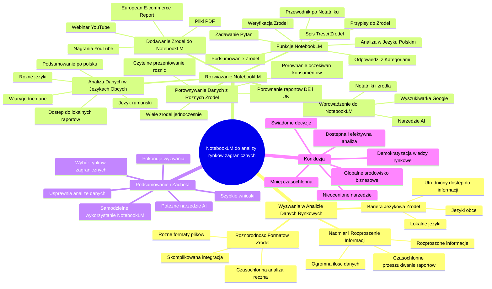

# Lekcje wideo - 3. Analiza źródeł i NotebookLM

# 💡 Diagram

___

# 🗒️ Notatka

# Notatki i Podsumowanie Transkrypcji Wideo 🎬: Umiejętności Jutra AI 🤖 - NotebookLM

## Wprowadzenie

Prezentacja wideo 🎬 omawia wykorzystanie narzędzia **NotebookLM** do analizy danych rynkowych 📊, szczególnie w kontekście wyboru rynków zagranicznych 🌍 dla biznesu 💼. Paweł Bilczyński z Salesupply wyjaśnia, w jaki sposób AI 🤖 może usprawnić proces analizy danych z różnorodnych źródeł i formatów, wspierając podejmowanie lepszych decyzji biznesowych ✅ dotyczących ekspansji międzynarodowej.

## 1. Wyzwania w Analizie Danych Rynkowych 📊

### 1.1. Nadmiar i Rozproszenie Informacji

- Dostępna jest **ogromna ilość danych** 📊 z różnorodnych źródeł, takich jak raporty 📄, badania, wypowiedzi ekspertów (webinary 💻, podcasty 🎧).
- Informacje są **rozproszone** w wielu miejscach, co utrudnia ich kompleksową analizę.
- Przeszukiwanie i analizowanie **obszernych raportów** 📄 (nawet 100-stronicowych) w celu znalezienia istotnych informacji o e-commerce jest **czasochłonne** 🕰️ i trudne.

### 1.2. Różnorodność Formatów Źródeł

- Dane występują w **różnych formatach**: pliki PDF, nagrania wideo 🎬, pliki audio 🎧.
- Zebranie i zintegrowanie informacji z różnych formatów do analizy jest **skomplikowane**.
- Ręczna analiza różnorodnych formatów jest **czasochłonna** 🕰️.

### 1.3. Bariera Językowa 🌐 Źródeł

- W kontekście internacjonalizacji, dane często dostępne są w **językach obcych** 🌐, nie tylko angielskim czy polskim.
- **Najcenniejsze dane** o lokalnych rynkach mogą być publikowane wyłącznie w **lokalnych językach** 🌐, których możemy nie znać (np. rumuński, węgierski, francuski).
- Bariera językowa utrudnia dostęp do **kluczowych informacji**.

## 2. Rozwiązanie: Narzędzie NotebookLM

### 2.1. Wprowadzenie do Narzędzia NotebookLM

- **NotebookLM** to narzędzie AI 🤖, które wspiera analizę danych z różnych źródeł.
- Dostępne jest poprzez wyszukiwarkę Google - wystarczy wpisać "NotebookLM".
- Umożliwia tworzenie notatników i dodawanie źródeł do analizy.

### 2.2. Dodawanie Źródeł do NotebookLM

- Możliwość dodawania źródeł w **różnych formatach**:
    - Pliki PDF
    - Nagrania z YouTube (link)
- Przykład: Dodanie raportu **European E-commerce Report** (PDF) oraz nagrania webinaru z YouTube.

### 2.3. Funkcje NotebookLM

- **Podsumowanie 📝 Źródeł:** Automatyczne generowanie podsumowania dodanych źródeł, wskazujące najważniejsze informacje.
- **Spis Treści Źródeł:** Umożliwia szybkie zorientowanie się w zawartości źródeł bez konieczności ich czytania/oglądania w całości.
- **Analiza w Języku Polskim:** Wyniki analizy, podsumowania i odpowiedzi na pytania generowane są w języku polskim, niezależnie od języka źródła (np. analiza raportu i filmu po angielsku daje wyniki po polsku).
- **Zadawanie Pytań ❓ w Języku Naturalnym:** Możliwość zadawania dowolnych pytań ❓ dotyczących danych w języku naturalnym (np. "Jakie rynki e-commerce są najbardziej perspektywiczne w Europie?").
- **Odpowiedzi z Podziałem na Kategorie:** Odpowiedzi są strukturyzowane i czytelne, np. podział na regiony (Europa Środkowa i Wschodnia, Południowa, Zachodnia).
- **Przypisy do Źródeł:** Możliwość przejścia do konkretnego fragmentu źródła, z którego pochodzi dana informacja (numery przypisów jak w książkach).
- **Weryfikacja Źródeł:** Pewność, że informacje pochodzą z dostarczonych źródeł oraz możliwość weryfikacji szczegółów w źródle.
- **Przewodnik po Notatniku (Gotowe Pytania ❓):** NotebookLM sugeruje zestaw predefiniowanych pytań ❓, które można zadać danym, ułatwiając eksplorację treści raportów nawet bez ich wcześniejszej znajomości.

### 2.4. Porównywanie ⚖️ Danych z Różnych Źródeł

- Możliwość analizy i porównywania ⚖️ danych z **wielu źródeł jednocześnie**.
- Przykład: Porównanie ⚖️ raportów o doświadczeniu pozakupowym na rynku niemieckim i brytyjskim.
- NotebookLM **czytelnie prezentuje różnice i podobieństwa** między rynkami.
- Ułatwia **porównanie oczekiwań konsumentów** na różnych rynkach.

### 2.5. Analiza Danych w Językach Obcych 🌐 (Przykład Rumuński)

- NotebookLM radzi sobie z analizą treści w **różnych językach** 🌐, w tym mniej popularnych (np. rumuński).
- Przykład: Analiza raportu o rumuńskim e-commerce napisanego po rumuńsku.
- **Podsumowanie 📝 i treść analizy generowane są po polsku**, umożliwiając analizę raportów w językach, których nie znamy.
- Dostęp do **lokalnych raportów** w lokalnych językach, które często zawierają najbardziej **wiarygodne i szczegółowe dane**.

## 3. Podsumowanie i Zachęta

- **NotebookLM** to potężne narzędzie AI 🤖, które **usprawnia i ułatwia analizę danych rynkowych** 📊.
- Pomaga uporać się z wyzwaniami, takimi jak **rozproszenie informacji, różnorodność formatów i bariera językowa źródeł**.
- Umożliwia **szybkie i efektywne** wyciąganie wniosków z danych, co jest kluczowe przy wyborze rynków zagranicznych 🌍.
- **Zachęcamy do samodzielnego wykorzystania NotebookLM** do analizy i wyboru rynków docelowych dla biznesu 💼.

## Konkluzja

NotebookLM prezentuje się jako **nieocenione narzędzie** dla firm planujących ekspansję zagraniczną 🌍. Dzięki niemu analiza danych rynkowych 📊 staje się **bardziej dostępna, efektywna i mniej czasochłonna** 🕰️, umożliwiając podejmowanie **bardziej świadomych i opartych na danych decyzji** ✅. Narzędzie to **demokratyzuje dostęp do wiedzy rynkowej**, pozwalając na analizę źródeł w różnych językach 🌐 i formatach, co jest szczególnie istotne w globalnym środowisku biznesowym 💼.

___

# 🔉 Transcript
File: Lekcje wideo - 3. Analiza źródeł i NotebookLM.mp4 
[00:00:00] (Białe tło.)
[00:00:05] (Na białym tle pojawia się napis "Umiejętności Jutra AI". Poniżej napisy "Organizator Google" i "Partner edukacyjny SGH".)
[00:00:05] (Mężczyzna w okularach siedzi przy biurku. Na biurku laptop, roślina, ozdoba w kształcie litery G i inne dekoracje.)
[00:00:05] Paweł Bilczyński CEE Business Development Director Salesupply
[00:00:05] W tej lekcji pokażę w jaki sposób wykorzystać narzędzie Notebook LM do tego, żeby przy pomocy AI zanalizować dane, które pomogą nam w wyborze rynku zagranicznego.
[00:00:14] (Na ekranie pojawia się slajd z tytułem "Analiza danych z różnych źródeł". Wymienione są trzy kategorie: "Raporty", "Wyniki badań", "Wypowiedzi ekspertów".)
[00:00:15] Tych danych, które do nas spływają i które możemy analizować jest naprawdę bardzo dużo, często mają formę raportów, czyli takich wyników badań z poszczególnych rynków, albo dotyczących konkretnego rynku, albo takich przekrojowych, które dotyczą wielu rynków jednocześnie.
[00:00:28] Często są to wypowiedzi ekspertów, czyli rzeczy, które mamy nagrane w formie webinarów, w formie podcastów, czyli jako takie no średnio albo bardzo trudno się nadają do takiej analizy prowadzonej przez człowieka i tutaj AI może nas wesprzeć, no i pomóc nam tą analizę przeprowadzić dużo sprawniej i dużo skuteczniej niż gdybyśmy robili ją bez tego typu narzędzi.
[00:00:48] (Na ekranie pojawia się slajd z tytułem "Wyzwania przy analizie źródeł:". Wymienione są trzy punkty: "Duże rozproszenie informacji", "Różne formaty źródeł", "Różne języki źródeł".)
[00:00:48] Jakie są wyzwania?
[00:00:49] Co jest takim problemem właśnie kiedy analizujemy dane z wielu źródeł?
[00:00:53] No przede wszystkim to, że te informacje są rozproszone pomiędzy te źródła, tych źródeł jest naprawdę dużo, no ale przejście przez nie wszystkie i zanalizowanie dokładnie treści, wynotowanie tych rzeczy, które mogą być dla nas istotne często jest trudne.
[00:01:04] Czasami jest tak, że mamy raport dotyczący nawet nie rynku e-commerce, tylko ogólnie rynku w danym kraju, albo wymiany gospodarczej między krajami i ten e-commerce jest tam gdzieś tylko ledwo wspomniany na którejś stronie raportu, który potrafi mieć nawet 100 stron, więc żeby do tych danych trafić i z nich wyciągnąć właśnie wykorzystamy narzędzie AI, ono nam pomoże poradzić sobie z tym wyzwaniem.
[00:01:30] Mamy też różne formaty tych źródeł, które analizujemy, czy które chcielibyśmy analizować, tak?
[00:01:35] Czasami to są pliki PDF, czasami to są właśnie nagrania, czasami to są pliki audio i zebranie tych informacji wszystkich w jednym miejscu i zanalizowanie ich to jest kolejna rzecz, którą narzędzie AI właśnie nam jest w stanie ułatwić, no i w ogóle umożliwić często, no bo taka analiza ręczna czy analiza prowadzona przez człowieka trwałaby zdecydowanie dłużej.
[00:01:57] No i kolejnym takim wyzwaniem, które też często się pojawia i zwłaszcza w przypadku właśnie internacjonalizacji albo wychodzenia na rynki zagraniczne, no to jest to, że często chcemy analizować dane w języku, którego nie znamy.
[00:02:09] Nie zawsze jest to polski, nie zawsze jest to angielski, a często są to języki tych krajów, które nas interesują, tak?
[00:02:15] Czyli to może być rumuński, węgierski, francuski, tych języków jest sporo, a często jest tak, że właśnie te najcenniejsze dane dotyczące konkretnego rynku tworzone przez osoby, które na tym rynku pracują i przygotowywane na przykład dla lokalnej sceny e-komersowej są właśnie przygotowywane tylko i wyłącznie i publikowane tylko i wyłącznie w tym lokalnym języku, którego możemy nie znać.
[00:02:36] Ale to też jest kolejne wyzwanie, z którym AI sobie poradzi.
[00:02:40] (Na ekranie pojawia się slajd z tytułem "Prezentacja narzędzia:" i napisem "NotebookLM".)
[00:02:40] Także za chwilkę pokażę jak narzędzie Notebook LM potrafi z tymi wyzwaniami sobie poradzić i jak wykorzystać je na potrzeby analizy rynków zagranicznych.
[00:02:48] (Ekran przeglądarki Google. W polu wyszukiwania napis "Wyszukaj w Google lub wpisz URL".)
[00:02:48] Do narzędzia Notebook LM bez żadnego problemu trafimy z wyszukiwarki, także wystarczy wpisać Notebook LM w Google i wybrać tutaj jeden z wyników.
[00:02:55] (Wyniki wyszukiwania w Google. Pierwszy wynik to "NotebookLM | Note Taking & Research Assistant Powered by AI".)
[00:02:55] No i przechodzimy w takie miejsce, gdzie będziemy mogli utworzyć nasz pierwszy notatnik, no i dodać do niego źródła, bo to o to tak naprawdę w tym narzędziu chodzi, o analizę źródeł, które dostarczamy.
[00:03:04] (Strona "NotebookLM" z napisem "Dodaj źródła". Możliwość przesłania pliku lub dodania linku.)
[00:03:05] Jeśli chodzi o tą analizę, no to możemy ją przeprowadzić na przykład dla pliku PDF, też dla nagrania z YouTube, właśnie za chwilkę pokażę dwa takie przykłady.
[00:03:12] No i klikając tutaj ten przycisk możemy właśnie takie nasze źródło sobie tutaj dodać.
[00:03:18] (Ekran "NotebookLM" z dodanym źródłem "CMI2024_Complete_light_v1.pdf".)
[00:03:18] Ja już mam taki zgrany i przygotowany raport European E-commerce Report, który no jest takim już godnym polecenia źródłem, bo on ukazuje się co roku, prezentuje europejską scenę e-commerce.
[00:03:29] No i pokazuje przekrojowo dane z e-komersów z całej Europy.
[00:03:34] (Ekran "NotebookLM" z podsumowaniem raportu "European E-commerce Report 2024".)
[00:03:34] Po umieszczeniu tutaj tego źródła musimy dać chwilkę narzędziu, ale już za moment dostajemy podsumowanie, czyli informacje jakie najważniejsze rzeczy w tym źródle się znajdują.
[00:03:43] No ale to nie wszystko, dlatego, że do tego raportu chciałbym dodać jeszcze drugie źródło, to jest zapis takiego webinaru, który odbywał się w momencie w momencie premiery tego raportu, no ale tam była taka ciekawa dyskusja ekspertów, no i chciałbym, żeby narzędzie dawało wyniki również po analizie tej właśnie nagranej części, więc wystarczy tutaj dodać link do filmu na YouTubie i on się za chwilkę tutaj pojawi jako kolejne analizowane źródło.
[00:04:12] No i pojawia się tutaj taka możliwość, żeby stworzyć sobie nawet coś w rodzaju spisu treści tych wszystkich źródeł, czyli w jednym miejscu bez czytania tego raportu czy bez przeglądania całego tego pliku z nagraniem dostaję odpowiedź, no co tam w tym pliku czy w tym nagraniu się znajduje, czyli czy będą tam informacje, których będę poszukiwał te informacje, które mogą być dla mnie cenne.
[00:04:38] No i bez względu na to czy to źródło jest w języku polskim czy w jakimś innym języku, to te wyniki dostajemy w języku polskim, czyli to jest kolejna taka korzyść, bo obydwa te źródła i raport i film były przygotowane w języku angielskim, a tutaj odpowiedź dostajemy w naszym własnym języku.
[00:05:00] I to co to narzędzie nam tutaj umożliwia, to jest również to, że możemy posłużyć się no dowolnym praktycznie pytaniem, tak?
[00:05:09] Czyli możemy zadać pytanie, które chcemy, na które chcemy uzyskać odpowiedź i zadać je w języku naturalnym, więc jeśli zapytamy jakie rynki e-commerce są najbardziej perspektywiczne w Europie, to to narzędzie po chwili analizy na podstawie tych właśnie dwóch źródeł przygotuje mi tutaj odpowiedź i to odpowiedź, która jest przygotowana w taki sposób, że no bez żadnego problemu można z niej skorzystać, to znaczy ten ta odpowiedź podzielona jest z podziałem na regiony, czyli mamy tutaj osobno opisaną Europę Środkową i Wschodnią, osobno Południową, osobno Zachodnią i wyciągnięte najciekawsze informacje dotyczące rynków, które w tych regionach europejskich się znajdują.
[00:05:48] Mało tego, jeśli interesuje nas jakieś zagadnienie albo chcemy sprawdzić skąd dana informacja się wzięła, to jest tutaj taka możliwość, żeby przeklikać się do źródeł, czyli klikamy na ten numerek, który znajduje się tak jak przypisy w książkach przy danym zdaniu, no i dostajemy link bezpośrednio do tej części raportu, w której te informacje to narzędzie AI znalazło.
[00:06:10] No i dzięki temu jesteśmy pewni po pierwsze, że to są informacje, które pochodzą z tych źródeł, które dostarczyliśmy, a po drugie jesteśmy w stanie doczytać jeszcze coś więcej, tak?
[00:06:19] No bo takie źródło sobie można otworzyć, no i przyjrzeć mu się jeszcze dokładniej.
[00:06:25] A to był przykład, który pokazywał w jaki sposób można zadać pytanie naszym danym i uzyskać na nie odpowiedź, ale możemy również skorzystać z gotowych zestawów pytań, które tutaj na podstawie analizy treści to narzędzie nam podpowiada, więc wystarczy przejść do takiej zakładki przewodnik po notatniku i jeśli ten przewodnik się otworzy, to w tym przewodniku właśnie znajdziemy gotowe pytania, tak jak to tutaj, które narzędzie podpowiada, które możemy tym naszym danym zadać i właściwie dzięki temu, nawet nie znając treści tych raportów, które wklejamy czy tych raportów, które umieszczamy w narzędziu, my możemy zorientować się szybko na jakie pytania te raporty nam są w stanie odpowiedzieć.
[00:07:03] Czyli z tej listy predefiniowanych pytań możemy skorzystać, żeby po prostu usprawnić sobie dostęp do tych danych, które w raportach się znajdują.
[00:07:13] Pokażę teraz w jaki sposób wykorzystać narzędzie Notebook LM do tego, żeby analizować dane z różnych źródeł, ale też porównywać dane pomiędzy tymi źródłami.
[00:07:23] Posłużę się tutaj takim przykładem, który przygotowałem, to są dwa takie badania, badania dotyczące doświadczenia pozakupowego, czyli tego w jaki sposób konsumenci są obsługiwani podczas i po procesie zakupu w e-commerce.
[00:07:36] Jeden z nich dotyczy rynku niemieckiego, a drugi rynku brytyjskiego.
[00:07:41] No i gdybyśmy te dwa raporty wystawili obok siebie, wydrukowane i próbowali analizować te treści, to pewnie też byłoby to możliwe, ale zajęłoby bardzo dużo czasu, a chodzi tutaj o to, żeby tą pracę sobie usprawnić i żeby szybko otrzymać odpowiedź na pytanie, no jakie są różnice w oczekiwaniach niemieckich i brytyjskich konsumentów jeśli chodzi na przykład o obsługę klienta.
[00:08:19] Takie pytanie tutaj zadałem.
[00:08:20] No i dzięki temu, że te dwa pliki mamy umieszczone jako źródła w naszym notatniku, no to dostajemy odpowiedź, która bardzo czytelnie te różnice, no i te rzeczy, które są wspólne pokazuje.
[00:08:57] Także można dzięki temu, jeśli ktoś prowadzi biznes na przykład w Niemczech i zna już tych niemieckich klientów, porównać sobie te aspekty i zorientować się czego jeszcze by mu mogło brakować na rynku brytyjskim, albo w drugą stronę.
[00:09:10] Mówiliśmy już o tym, że Notebook LM potrafi sobie poradzić z treścią w innych językach, a konkretnie w języku angielskim, no ale zobaczmy jak to wygląda w przypadku no powiedzmy trochę bardziej egzotycznych języków, takich jak rumuński na przykład.
[00:09:20] Akurat rumuński rynek e-komersowy jest takim, na który polski e-commerce czy polski komers zaglądają dosyć często, bo to jest taki szybko rosnący rynek zlokalizowany całkiem niedaleko od nas i jeśli chodzi o te raporty, które są dostępne na polskim rynku, no to nie ma ich zbyt wiele, na pewno w języku angielskim jest ich mniej niż właśnie po rumuńsku.
[00:09:52] No i jest tutaj taki raport z rynku rumuńskiego bezpośrednio o rumuńskim e-komersie, a przygotowany przez autorów po rumuńsku i po umieszczeniu go w naszym narzędziu okazuje się, że to podsumowanie i ta treść z którą mamy możliwość się zapoznać jest przygotowana bez żadnego problemu po polsku, także jest na tyle czytelna i dobrze przetłumaczona, że możemy sobie treść tego raportu zanalizować, co ma tą zaletę, że właśnie te lokalne raporty przygotowywane w lokalnych językach najczęściej zawierają najbardziej wiarygodne dane, najbardziej szczegółowe dane.
[00:10:52] No i bez nich podejmowanie decyzji o tym, żeby wychodzić na jakiś konkretny rynek, no po prostu pozbawione byłoby sporej ilości cennych danych.
[00:11:00] Zachęcam teraz do tego, żeby samodzielnie wykorzystać narzędzia, które pokazałem.
[00:11:05] No i przeprowadzić za ich pomocą analizę, która pozwoli odpowiedzieć na pytanie, który rynek może być rynkiem docelowym dla naszego biznesu.
[01:11:12] (Na ekranie ponownie pojawia się slajd z tytułem "Umiejętności Jutra AI".)

___
# 🏷️ Tags
#NotebookLM #AI #sztuczna_inteligencja #analiza_danych #dane_rynkowe #rynek_zagraniczny #ekspansja_międzynarodowa #decyzje_biznesowe #Salesupply #Paweł_Bilczyński #źródła_danych #raporty #badania #eksperci #webinary #podcasty #e-commerce #internacjonalizacja #języki_obce #bariera_językowa #język_polski #formaty_plików #PDF #YouTube #podsumowanie_źródeł #spis_treści #język_naturalny #pytania #kategorie #przypisy #weryfikacja_źródeł #przewodnik_po_notatniku #porównywanie_danych #doświadczenie_pozakupowe #rynek_niemiecki #rynek_brytyjski #oczekiwania_konsumentów #język_rumuński #lokalne_raporty #wiarygodne_dane #efektywność #wybór_rynku #rynek_docelowy #Google #SGH #umiejętności_jutra_AI #European_E-commerce_Report
