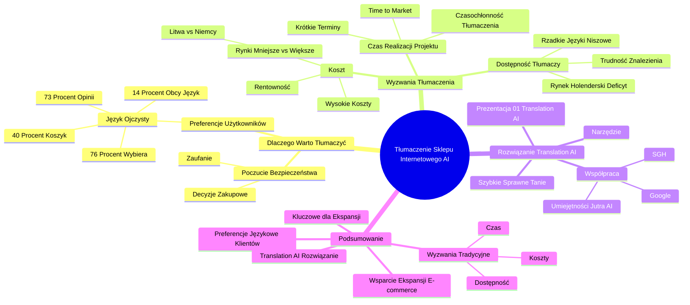

# Lekcje wideo - 4. Wyzwania przy tłumaczeniu treści sklepu

# 💡 Diagram

___

# 🗒️ Notatka

# Notatki i Podsumowanie: Tłumaczenie Sklepu Internetowego z Wykorzystaniem AI

## Wprowadzenie

Materiał wideo omawia wyzwania związane z tłumaczeniem treści sklepów internetowych na potrzeby ekspansji zagranicznej. Przedstawia rozwiązanie oparte na **sztucznej inteligencji** (`AI`) - narzędzie `Translation AI`.  Podkreślono, dlaczego tłumaczenie jest kluczowe dla sukcesu na nowych rynkach i jakie przeszkody czekają właścicieli sklepów internetowych w procesie lokalizacji.

## Dlaczego Warto Tłumaczyć Ofertę Sklepu Internetowego?

* **Preferencje użytkowników:** Klienci zdecydowanie preferują sklepy internetowe, które komunikują się z nimi w ich języku ojczystym.
    * **76%** użytkowników internetu wybiera produkty z opisami w swoim języku.
    * **73%** e-klientów oczekuje opinii o produktach w swoim języku.
    * **40%** e-konsumentów porzuci koszyk 🛒, jeśli proces zakupu nie jest dostępny w ich języku.
    * Zaledwie **14%** konsumentów kupujących za granicą akceptuje język obcy podczas zakupów online.

* **Poczucie bezpieczeństwa:** Komunikacja w języku ojczystym buduje zaufanie klienta do sklepu internetowego.
    * Bezpieczeństwo jest kluczowym czynnikiem wpływającym na decyzje zakupowe w sieci.
    * Klienci czują się pewniej, dokonując transakcji w języku, którym posługują się na co dzień.
    * Mając wybór między sklepem w języku obcym a sklepem w języku ojczystym, konsumenci wybiorą ten drugi.

## Wyzwania w Tłumaczeniu Treści Sklepu

Właściciele sklepów internetowych, planujący ekspansję na nowe rynki, napotykają szereg wyzwań związanych z tłumaczeniem sklepu.  Do głównych problemów należą:

* **Koszt:**
    * Tłumaczenia mogą generować wysokie koszty, szczególnie w kontekście rynków o mniejszym potencjale.
    * Koszt tłumaczenia na rynek o mniejszym potencjale (np. Litwa) może być porównywalny, a nawet wyższy niż na rynek o większym potencjale (np. Niemcy 🇩🇪).
    * Potencjalne przychody z mniejszych rynków są zazwyczaj znacznie niższe, co wpływa na rentowność inwestycji w tłumaczenie.

* **Dostępność Tłumaczy:**
    * Znalezienie odpowiednich tłumaczy dla niektórych języków, szczególnie tych rzadziej używanych lub niszowych, bywa trudne.
    * Na atrakcyjnych rynkach e-commerce, takich jak rynek holenderski 🇳🇱,  może występować deficyt dostępnych tłumaczy.

* **Czas Realizacji Projektu:**
    * W **e-commerce** czas wprowadzenia produktów na rynek (`time to market`) jest niezwykle istotny.
    * Krótkie terminy realizacji stanowią wyzwanie dla procesu tłumaczenia opisów produktów.
    * Szybkie wprowadzenie oferty na rynek jest kluczowe, a czasochłonność tradycyjnego tłumaczenia może być problematyczna.

## Rozwiązanie: Narzędzie Translation AI

* Narzędzie `Translation AI`  jest odpowiedzią na wymienione wyżej wyzwania.
* Umożliwia **szybkie**, **sprawne** i **stosunkowo tanie** tłumaczenie treści sklepu internetowego.
* Prezentacja narzędzia `Translation AI` (odnośnik do prezentacji: 01 Translation AI).
* Narzędzie powstało we współpracy z inicjatywą \"Umiejętności Jutra AI\", Google 🔍 i SGH (widoczne logotypy).

## Podsumowanie

Tłumaczenie treści sklepu internetowego jest **kluczowe** dla skutecznego wejścia na rynki zagraniczne. Klienci preferują zakupy w sklepach internetowych dostępnych w ich języku ojczystym, co wzmacnia ich poczucie bezpieczeństwa i pozytywnie wpływa na decyzje zakupowe.  Proces tłumaczenia tradycyjnymi metodami wiąże się jednak z wyzwaniami, takimi jak **wysokie koszty**, **ograniczona dostępność tłumaczy** i **krótkie terminy realizacji**. Narzędzie `Translation AI`  oferuje efektywne rozwiązanie tych problemów, zapewniając szybkie, ekonomiczne i sprawne tłumaczenie treści, co realnie wspiera ekspansję **e-commerce** na nowe rynki.

___

# 🔉 Transcript
File: Lekcje wideo - 4. Wyzwania przy tłumaczeniu treści sklepu.mp4 
[00:00:05] Cześć, witam w kolejnym kursie, w czasie którego pokażę w jaki sposób przetłumaczyć treści sklepu internetowego, korzystając z najnowszych rozwiązań opartych o AI.
[00:00:12] (Ekran: Slajd z tekstem: "Wyzwaniem dla sklepu wychodzącego na rynki zagraniczne staje się przetłumaczenie treści sklepu na kilka języków")
[00:00:12] Zacznijmy od tego, że to rzeczywiście jest wyzwanie dla właścicieli sklepu internetowego, w jaki sposób przetłumaczyć treść swojego sklepu, no tak, żeby ona była dostępna dla użytkowników na nowym rynku, na który chcą, na który chcą trafić.
[00:00:24] (Ekran: Slajd z tekstem: "Dlaczego warto tłumaczyć ofertę sklepu?" i wykresem kołowym z wartością 76% oraz tekstem: "użytkowników sieci wybiera produkty, których opis przygotowano w ich języku")
[00:00:26] Dlaczego to jest ważne?
[00:00:26] Dlatego, że użytkownicy no będą wybierali właśnie te sklepy, w których treści są przygotowane w ich języku, aż 76% tych użytkowników badanych odpowiada na to, że właśnie takie sklepy wybiera, takie, które są dostępne w ich języku.
[00:00:41] (Ekran: Slajd z tekstem: "Dlaczego warto tłumaczyć ofertę sklepu?" i wykresem kołowym z wartością 73% oraz tekstem: "e-klientów chce zapoznać się z opinią na temat produktu w swoim języku")
[00:00:41] Chce też zapoznawać się z opiniami na temat produktów właśnie w swoim języku, a niekoniecznie w języku obcym.
[00:00:47] (Ekran: Slajd z tekstem: "Dlaczego warto tłumaczyć ofertę sklepu?" i wykresem kołowym z wartością 40% oraz tekstem: "e-konsumentów zrezygnuje z zakupu jeśli nie będzie można sfinalizować transakcji w swoim języku")
[00:00:48] No i nawet będą rezygnować z zakupu ci konsumenci, jeśli te sklepy nie będą przygotowywane w języku, którym posługują się na co dzień.
[00:00:57] (Ekran: Slajd z tekstem: "Dlaczego warto tłumaczyć ofertę sklepu?" i wykresem kołowym z wartością 14% oraz tekstem: "tylko tylu konsumentów kupujących przez internet za granicą korzysta przy zakupach z języka obcego")
[00:00:57] Nawet ci, którzy potrafią już mówić w języku obcym, czy korzystają z języka obcego na co dzień, tak naprawdę rzadko używa go właśnie w momencie kiedy dokonuje zakupów w sklepie internetowym.
[00:01:09] (Ekran: Slajd z tekstem: "Korzystając z języka, którym posługujemy się na co dzień czujemy się bezpieczniej")
[00:01:09] Chodzi po prostu o to, że korzystając z tego języka, którym posługujemy się na co dzień, czujemy się bezpieczniej.
[00:01:13] No a wiadomo, że jeśli chcemy wydawać własne pieniądze w internecie, no to poczucie bezpieczeństwa jest takim istotnym aspektem, który gdzieś tam się z tyłu w głowie pojawia.
[00:01:24] (Ekran: Slajd z tekstem: "Poczucie bezpieczeństwa to jeden z najistotniejszych czynników wpływających na podjęcie decyzji o finalizacji transakcji w internecie")
[00:01:24] No i jeśli mamy do wyboru dwie oferty, jedna właśnie na sklepie przygotowanym w języku obcym i jedna w sklepie przygotowanym w języku, którym posługujemy się na co dzień, to w pierwszej kolejności wybierzemy tą właśnie drugą.
[00:01:37] (Ekran: Slajd z tekstem: "Wyzwania przy tłumaczeniu treści sklepu" i schematem kołowym z trzema elementami: "Dostępność", "Koszt", "Czas realizacji projektu" oraz "Tłumaczenie" w środku)
[00:01:37] Jeszcze parę słów na temat tego z jakimi wyzwaniami wiąże się wejście na nowy rynek i przed jakimi wyzwaniami stoją właściciele sklepów internetowych w sytuacji, kiedy zdecydują się na tłumaczenie tego sklepu.
[00:01:46] No przede wszystkim czasami koszt tłumaczenia jest zbyt wysoki do potencjału danego rynku.
[00:01:51] Czasami mówimy o rynkach niewielkich stosunkowo, jeśli chodzi o potencjał, często mniejszych od Polski, a czasami kilkukrotnie mniejszych od rynku polskiego, z którego polskie e-commerce startują.
[00:02:03] No i koszty tłumaczenia takiego, dla takiego rynku, czy to będzie rynek niemiecki, czy na przykład dla porównania rynek Litewski będą zbliżone, a może się nawet okazać, że w sytuacji, kiedy mówimy o rynku mniejszym, gdzie docelowo jest mniej mieszkańców i też mniejsza dostępność tłumaczy na miejscu, to ten koszt może być nawet wyższy.
[00:02:22] No a potencjalne przychody na pewno dużo, dużo mniejsze.
[00:02:27] Także to jest taka, takie pierwsze wyzwanie.
[00:02:29] Kolejne jest to takie, że faktycznie dla niektórych rynków ciężko znaleźć po prostu tłumaczy, którzy mogliby z nami pracować.
[00:02:35] Jest tylko określona liczba osób, które pracuje i zna dany język i często właśnie w przypadku rynków, które e-commercowo mogą być interesujące, jak na przykład rynek holenderski, może się okazać, że może być właśnie trudno znaleźć dobrych tłumaczy tego języka.
[00:02:52] No i trzecim takim istotnym elementem, na który warto zwrócić uwagę jest po prostu czas realizacji projektu, czyli ten czas, który mamy na wprowadzenie produktów na rynek.
[00:02:59] On często w e-commerce jest bardzo krótki, zależy nam na tym, żeby produkty jak najszybciej znalazły się na półce.
[00:03:04] No i nie mamy po prostu wtedy zbyt wiele czasu na prowadzenie tłumaczenia opisów produktów przy tym właśnie projekcie.
[00:03:12] Także to by były te trzy istotne wyzwania, a za chwilkę pokażę jak sobie z nimi poradzić na przykładzie narzędzia Translation AI, dzięki któremu będziemy mogli właśnie takie tłumaczenie przeprowadzić szybko, sprawnie i stosunkowo niskim kosztem.
[00:03:13] (Ekran: Slajd z tekstem: "Prezentacja narzędzia:" i "01 Translation AI")
[00:03:26] (Ekran: Logo "Umiejętności Jutra AI" oraz logotypy Google i SGH)

___
# 🏷️ Tags
#tlumaczenie #sklepy_internetowe #AI #sztuczna_inteligencja #Translation_AI #lokalizacja #jezyk_ojczysty #e-commerce #e-klient #e-konsument #koszyk #bezpieczenstwo #rynek_zagraniczny #koszty_tlumaczenia #dostepnosc_tlumaczy #czas_realizacji_projektu #time_to_market #rynek_niemiecki #rynek_litewski #rynek_holenderski #Umiejetnosci_Jutra_AI #Google #SGH #ekspansja_zagraniczna #decyzje_zakupowe #opinie_o_produktach
