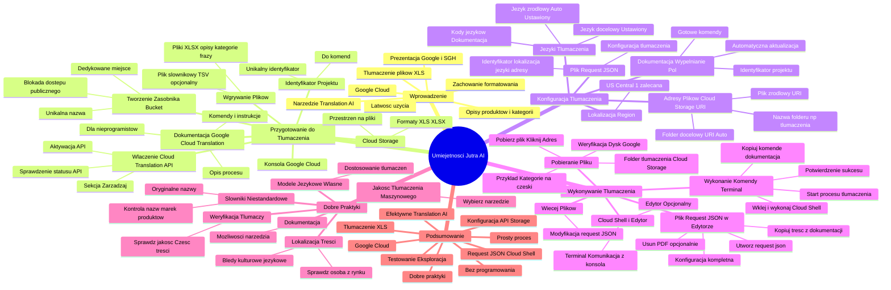

# Lekcje wideo - 5. Translation AI

# 💡 Diagram

___

# 🗒️ Notatka

# Umiejętności Jutra AI - Notatki i Podsumowanie

## Wprowadzenie

Niniejszy dokument stanowi podsumowanie prezentacji wideo "Umiejętności Jutra AI", zorganizowanej przez Google i SGH.  Przedstawiono w niej wykorzystanie narzędzia **Translation AI** w **Google Cloud** do tłumaczenia treści sklepów internetowych, w tym opisów produktów i kategorii, z plików **XLS**. Celem prezentacji było zademonstrowanie, jak łatwo, nawet bez umiejętności programistycznych, przetłumaczyć duże ilości tekstu, zachowując oryginalne formatowanie plików.

## Przygotowanie do Tłumaczenia

### Konsola Google Cloud ☁️

- Tłumaczenie odbywa się w **konsoli Google Cloud**.
- Jest to centralne miejsce konfiguracji i uruchamiania procesu tłumaczenia.

### Dokumentacja Google Cloud Translation 📖

- **Dokumentacja Google Cloud Translation** jest kluczowym zasobem, szczególnie dla osób bez doświadczenia w programowaniu.
- Zawiera wszystkie niezbędne komendy i instrukcje krok po kroku.
- Umożliwia korzystanie z narzędzia nawet bez zaawansowanej wiedzy technicznej.
- Dokumentacja szczegółowo opisuje proces tłumaczenia.

### Włączenie Cloud Translation API

- Pierwszym krokiem jest upewnienie się, że **Cloud Translation API** jest aktywne w konsoli Google Cloud.
- Status **API** należy sprawdzić w odpowiedniej zakładce konsoli.
- Aktywacja **API** jest niezbędna do korzystania z funkcji tłumaczenia.
- W sekcji "Zarządzaj" można sprawdzić i włączyć **Cloud Translation API**.

### Cloud Storage 🗄️

- Kolejnym etapem jest przejście do **Cloud Storage** w konsoli Google Cloud.
- **Cloud Storage** to przestrzeń, w której przechowywane będą pliki przeznaczone do tłumaczenia.
- Obsługiwane formaty plików to m.in. **XLS** i **XLSX**, co jest istotne w kontekście plików eksportowanych ze sklepów internetowych.

### Tworzenie Zasobnika (`Bucket`) 🗂️

- W **Cloud Storage** należy utworzyć **zasobnik** (`bucket`), czyli dedykowane miejsce na pliki do tłumaczenia.
- Nazwa zasobnika musi być unikalna.
- Po wprowadzeniu nazwy i potwierdzeniu blokady dostępu publicznego, zasobnik jest gotowy do użycia.
- Zasobnik można wypełnić plikami za pomocą opcji "Prześlij pliki".

### Wgrywanie Plików do Zasobnika

- Do zasobnika wgrywamy pliki przeznaczone do tłumaczenia.
- Przykładowe pliki:
    - Plik z opisami produktów (**XLSX**)
    - Plik z kategoriami (**XLSX**)
    - Plik z frazami z zaplecza (**XLSX**)
    - Plik słownikowy (**TSV**) - opcjonalny, do definiowania specyficznych tłumaczeń.
- Po wgraniu, pliki pojawią się w zasobniku i będą dostępne do dalszych działań.
- Z tego zasobnika odbierzemy również przetłumaczone pliki.

### Identyfikator Projektu 🔑

- Kluczowy jest **identyfikator projektu** w Google Cloud.
- Każdy projekt posiada unikalny identyfikator.
- Należy skopiować identyfikator projektu, aby wykorzystać go w komendach.
- Identyfikator projektu umożliwia identyfikację projektu, nad którym pracujemy.

## Konfiguracja Tłumaczenia

### Wypełnianie Pól w Dokumentacji 📝

- Dokumentacja Google Cloud Translation zawiera przykładowe komendy.
- W odpowiednie miejsce w dokumentacji należy wkleić skopiowany **identyfikator projektu**.
- Dokumentacja jest tak przygotowana, aby po uzupełnieniu pól, komendy były gotowe do użycia.
- Wprowadzenie danych w jednym miejscu automatycznie aktualizuje je w całej dokumentacji (w ramach sesji).

### Lokalizacja (`Region`) 🌍

- Kolejnym polem do konfiguracji jest **lokalizacja** (`region`).
- Zgodnie z dokumentacją, zalecana lokalizacja to **US Central 1**.
- Lokalizację należy wprowadzić w odpowiednim polu w dokumentacji.

### Języki Tłumaczenia 🗣️

- Należy określić język źródłowy i język docelowy tłumaczenia.
- Język źródłowy może być rozpoznawany automatycznie.
- Język docelowy musi zostać ustawiony.
- Kody języków (np. "cs" dla czeskiego) dostępne są na liście kodów języków w dokumentacji.

### Adresy Plików (`Cloud Storage URI`) 📍

- Należy podać adres pliku źródłowego z **Cloud Storage**, który ma zostać przetłumaczony.
- Adres pliku (`Cloud Storage URI`) należy wkleić w odpowiednie pole w dokumentacji.
- Następnie należy wskazać lokalizację docelową, czyli folder w **Cloud Storage**, gdzie ma trafić przetłumaczony plik.
- Folder docelowy nie musi istnieć – zostanie utworzony automatycznie.
- Można nadać folderowi docelowemu nazwę, np. "tłumaczenia".

### Plik `Request JSON` ⚙️

- Po wypełnieniu pól w dokumentacji, generowany jest plik `request JSON`.
- Plik `request JSON` zawiera konfigurację tłumaczenia.
- Zawiera informacje takie jak: identyfikator projektu, lokalizacja, języki, adresy plików.

## Wykonywanie Tłumaczenia

### Cloud Shell i Edytor 💻

- W konsoli Google Cloud należy uruchomić **Cloud Shell**.
- **Cloud Shell** to terminal umożliwiający komunikację z konsolą Google Cloud za pomocą komend.
- Opcjonalnie, obok terminala można otworzyć **Edytor Cloud Shell**.

### Plik `request.json` w Edytorze

- W **Edytorze Cloud Shell** należy utworzyć nowy plik o nazwie `request.json`.
- Treść pliku `request.json` kopiujemy z dokumentacji Google Cloud Translation.
- Należy usunąć fragment dotyczący tłumaczenia plików PDF, jeśli nie jest potrzebny.
- Plik `request.json` zawiera kompletną konfigurację procesu tłumaczenia.

### Wykonanie Komendy w Terminalu ▶️

- Z dokumentacji kopiujemy komendę do uruchomienia tłumaczenia.
- Komenda jest już częściowo wypełniona, m.in. identyfikatorem projektu.
- Wklejamy komendę do terminala **Cloud Shell** i ją wykonujemy.
- Po wykonaniu komendy rozpoczyna się proces tłumaczenia.
- Wynik wykonania komendy potwierdza pomyślne przetłumaczenie pliku.

### Pobieranie Przetłumaczonego Pliku 📥

- Po odświeżeniu zasobnika w **Cloud Storage**, powinien pojawić się nowy folder (np. "tłumaczenia").
- W folderze "tłumaczenia" znajduje się przetłumaczony plik.
- Plik można pobrać na komputer, klikając na jego nazwę lub adres.
- Przetłumaczony plik można otworzyć np. w Dysku Google, aby zweryfikować jego zawartość.
- Przykładem jest przetłumaczony plik kategorii na język czeski.

### Tłumaczenie Większej Ilości Plików 📚

- Po przetestowaniu tłumaczenia pojedynczego pliku, można przejść do tłumaczenia większej ilości plików.
- Wymaga to modyfikacji pliku `request JSON`.

## Dobre Praktyki 👍

### Dobre Praktyki Tłumaczenia Maszynowego

- **Najwyższa jakość tłumaczenia maszynowego:** Kluczowy jest wybór odpowiedniego narzędzia.
- **Weryfikacja jakości przez tłumaczy:** Zaleca się weryfikację jakości tłumaczenia maszynowego z udziałem wykwalifikowanych tłumaczy, przynajmniej dla części treści.
- **Lokalizacja treści:** Istotne jest, aby treść sklepu internetowego została sprawdzona przez osobę z danego rynku, w celu wychwycenia potencjalnych błędów kulturowych lub językowych.
- **Słowniki niestandardowe:** Możliwość wprowadzenia własnych słowników do **Translation AI** pozwala kontrolować tłumaczenie nazw marek i produktów, unikając dosłownych tłumaczeń i zachowując oryginalne nazwy.
- **Własne modele językowe:** **Translation AI** może wykorzystywać własne modele językowe, co umożliwia jeszcze lepsze dostosowanie tłumaczeń do specyficznych potrzeb.
- **Dokumentacja:** Zachęca się do korzystania z dokumentacji Google Cloud Translation, aby poznać pełen zakres możliwości narzędzia.

## Podsumowanie

Prezentacja demonstruje, jak efektywnie wykorzystać **Translation AI** w **Google Cloud** do tłumaczenia treści sklepów internetowych, w szczególności plików **XLS** z opisami produktów i kategoriami. Proces jest stosunkowo prosty, dzięki dostępnej dokumentacji i intuicyjnej konsoli Google Cloud, nawet dla osób bez doświadczenia programistycznego. Kluczowe etapy to konfiguracja **Cloud Translation API** i **Cloud Storage**, przygotowanie pliku `request JSON` oraz wykonanie komendy w **Cloud Shell**. Należy pamiętać o dobrych praktykach, takich jak weryfikacja jakości tłumaczenia i lokalizacja treści, aby zapewnić optymalne rezultaty. Zachęcamy do samodzielnego testowania narzędzia i eksploracji jego potencjału.

___

# 🔉 Transcript
File: Lekcje wideo - 5. Translation AI.mp4 
[00:00:00] Ekran: Białe tło.
[00:00:05] Ekran: Tytuł "Umiejętności Jutra AI". Pod spodem "Organizator: Google" i "Partner edukacyjny: SGH".
[00:00:05] Ekran: Mężczyzna w okularach siedzi przy biurku, za nim regał z książkami. Na biurku laptop.
[00:00:06] Ekran: Podpis "Paweł Bilczyński, CEE Business Development Director, Salesupply".
[00:00:06] Do przetłumaczenia treści sklepu wykorzystam narzędzie Translation AI dostępne w Google Cloud.
[00:00:10] Chodzi po prostu o to, żeby znaleźć narzędzie, które pozwoli nam na tłumaczenie dużej ilości tekstu przygotowanego w pliku XLS, czyli w pliku, w którym wyeksportowaliśmy opisy produktów, tą treść, która znajduje się na zapleczu sklepu.
[00:00:24] i te wszystkie informacje, które powinny zostać przetłumaczone.
[00:00:27] No i efekt końcowy tego tłumaczenia, czyli ten plik wsadowy, który później będziemy umieszczali w zapleczu sklepu, też powinien być przygotowany według dokładnie tego samego schematu.
[00:00:37] Także chodzi o to, żeby mieć narzędzie, które będzie w stanie zachować cały format jeden do jeden w taki sposób, żeby pliki po imporcie potem po prostu mogły znaleźć się we właściwym miejscu w sklepie internetowym.
[00:00:51] i właśnie Translation AI to umożliwia.
[00:00:55] Także to co na początek powinniśmy zrobić, to otworzyć sobie konsolę Google Cloud.
[00:00:59] Ekran: Konsola Google Cloud.
[00:00:59] I teraz tutaj w tym miejscu będziemy pracowali nad naszym tłumaczeniem.
[01:06] żeby ta procedura była łatwiejsza, to proponuję otworzyć sobie tutaj dokumentację z boku.
[01:09] Ekran: Dokumentacja Google Cloud Translation.
[01:09] To jest o tyle dobre rozwiązanie, że ta dokumentacja pozwoli nam pracować nawet jeśli nie mamy doświadczenia w programowaniu.
[01:17] Z tą konsolą trzeba będzie się komunikować właśnie takimi komendami programistycznymi, ale one są wszystkie dostępne tutaj w tym w tej dokumentacji.
[01:27] Także przejdźmy sobie do dokumentacji i warto otworzyć tą zakładkę, która będzie, która prezentuje właśnie korzystanie z narzędzia do tłumaczeń.
[01:38] I taka istotna sprawa, która pojawia się tutaj na początku w tej dokumentacji, no to jest wskazówka, żeby sprawdzić czy mamy włączone Cloud Translation API, czyli czy ta funkcjonalność jest włączona w naszej konsoli, więc przechodzimy sobie do miejsca, gdzie możemy wyszukać właśnie Cloud Translation API i zobaczyć czy ono jest włączone.
[01:57] To akurat w tym przypadku jest włączone, ale jeśli przejdziemy przez zarządzaj, no to będzie tutaj widać właśnie ten przełącznik, który informuje nas o stanie Cloud Translation API.
[02:11] Chodzi o to, żeby to narzędzie było włączone.
[02:16] No i kolejnym miejscem w konsoli Google Cloud, do którego teraz powinniśmy przejść, to jest Cloud Storage, bo to tutaj będziemy umieszczali nasze pliki do tłumaczenia.
[02:22] czyli przejdźmy sobie do tego Cloud Storage i możemy za chwilkę wrócić do dokumentacji.
[02:27] w tej dokumentacji tutaj u góry są wyszczególnione pliki, które są wspierane, tak jak widać pliki XLS się tutaj też mieszczą w tym katalogu, także będziemy mogli te pliki, które mamy wyeksportowane ze sklepu właśnie za pomocą tego narzędzia przetłumaczyć.
[02:41] No i teraz żeby przejść do tej części już praktycznej, no to to co powinniśmy teraz zrobić, to jest utworzenie takiego zasobnika, czyli miejsca na te pliki, które będziemy tłumaczyli.
[02:55] Ten zasobnik tworzymy tutaj znowu w konsoli w zakładce Cloud Storage.
[02:58] No i za chwilkę pojawi się okienko, gdzie będziemy mogli wprowadzić jego nazwę.
[03:03] Ważne, żeby to była nazwa unikalna.
[03:06] Jak ona zostanie wprowadzona, to tak naprawdę właściwie to jedyna rzecz, którą musimy tutaj skonfigurować.
[03:11] Klikamy utwórz.
[03:12] Potwierdzamy blokadę dostępu publicznego, to się też może przydać.
[03:18] No i przechodzimy dalej i jeśli ten zasobnik powstał, no to właściwie możemy go już wypełnić plikami po prostu przez prześlij pliki.
[03:23] Wprowadzamy tutaj te pliki, które nas interesują.
[03:28] Ja tutaj przygotowałem kilka plików, z których jeden to jest plik z przykładowymi opisami produktu, jeden plik z kategoriami, jeden plik z takimi frazami z zaplecza.
[03:38] i jest tutaj też taki plik, który później będzie można wykorzystać jako plik słownikowy.
[03:44] tutaj te akurat słownikowe pliki są w formacie TSV.
[03:48] Natomiast te pozostałe mogą być właśnie w formacie XLS albo XLSX i takie tutaj pliki do tego zasobnika wgrywamy, więc po zaznaczeniu po prostu dodajemy te wszystkie pliki i one za chwilkę w tym zasobniku się znajdą.
[04:03] No i tutaj właśnie w tym zasobniku będziemy nad nimi pracowali i też z tego zasobnika, z takiego podkatalogu będziemy potem te pliki odbierali już po przetłumaczeniu.
[04:13] Jeszcze jedną ważną informacją, o którą potrzebuję przed tym, zanim pójdziemy dalej, no to jest identyfikator naszego projektu.
[04:19] każdy taka każdy taki projekt w Google Cloud ma swój taki identyfikator unikalny, więc my pracując w tym projekcie będziemy go musieli znać po to, żeby po prostu wiedzieć w jaki sposób o którym z projektów będziemy pracowali, więc po skopiowaniu tego identyfikatora posłużymy się nim za moment w miejscu, gdzie będziemy wprowadzali komendy.
[04:44] Także kopiujemy tą nazwę i przechodzimy znowu do dokumentacji.
[04:50] I po przejściu do dokumentacji właśnie w tym miejscu będziemy mogli wkleić ten numer projektu, który został skopiowany przed chwilą.
[04:57] Chodzi po prostu o to, żeby no odnosić się cały czas do tego projektu, w którym pracujemy.
[05:04] Tutaj akurat te pliki dokumentacji są tak przygotowane, że te komendy, które się tutaj znajdują, po wypełnieniu pewnych pól będą mogły nam służyć praktycznie cały czas, dlatego że te pola będą we wszystkich miejscach, w których powinny być będą wypełnione właśnie w ten sam sposób.
[05:20] Także jeśli my sobie tutaj wprowadzimy ten numer projektu w tym miejscu, to przez cały czas korzystania z tej dokumentacji w czasie tej jednej sesji będą te wszystkie miejsca, gdzie ten numer projektu powinien zostać wprowadzony wypełnione.
[05:35] Więc pierwszym polem, które wypełniliśmy było pole z numerem projektu, a kolejnym jest z lokalizacją.
[05:39] To wprowadzamy też tutaj zgodnie z dokumentacją, najlepiej właśnie w tym polu powyżej, bo potem automatycznie zostanie wypełnione we wszystkich innych miejscach, gdzie powinno się znaleźć.
[05:58] Ja tutaj podaję US Central 1 i taką właśnie lokalizację możemy sobie tutaj wypełnić.
[06:11] będzie to jeszcze będzie jeszcze kilka pól, które będziemy tutaj musieli wypełnić.
[06:15] Jednym z nich jest na pewno informacja na temat tego z jakiego języka i na jaki język chcemy przeprowadzić.
[06:21] Jeśli chodzi o ten język, z którego będziemy tłumaczyli, no to jest tutaj taka automatyczna funkcjonalność, która te języki rozpoznaje, ale można go na wszelki wypadek wprowadzić.
[06:30] Natomiast na pewno trzeba wprowadzić ten język, na który będziemy tłumaczyli.
[06:37] żeby skorzystać z tej funkcjonalności, no to trzeba znać kody języków, ale one są tutaj dostępne w taki na takiej specjalnej liście, także tam wszystkie języki, które nas interesują na pewno znajdziemy.
[06:50] No i tymi kodami możemy się posłużyć właśnie do tego, żeby te języki ustawić.
[06:52] Także ustawiamy język, z którego tłumaczymy, język, na który tłumaczymy i kolejnym polem, które powinniśmy móc wypełnić, no to jest pole z adresem tego pliku, który będziemy tłumaczyli.
[07:04] Zaczynamy od tłumaczenia pojedynczego pliku, także potrzebny jest nam adres tego pierwszego pliku, którego będziemy tłumaczyli, to jest akurat plik z kategoriami.
[07:10] Ja tutaj teraz przykleiłem ten adres, czyli ta nasza konsola będzie już wiedziała w którym miejscu jest ten plik, który będziemy tłumaczyli.
[07:22] I to jest pierwsza rzecz, którą trzeba wypełnić, a kolejna no to lokalizację tą docelową, do której trafi plik, który przetłumaczymy.
[07:30] z tym, że tutaj już w tym drugim przypadku podajemy nie konkretny nie konkretną nazwę pliku, tylko po prostu sam folder.
[07:38] No i w tym folderze właśnie ten plik się znajdzie.
[07:40] Tego folderu nie trzeba tworzyć wcześniej, można wpisać tak jak ja tutaj wpisałem sobie po prostu dowolne słowo, które później po tłumaczeniu nam konsola stworzy taki folder i w tym folderze właśnie znajdziemy nasze tłumaczenia.
[07:50] Także ja dopisałem sobie tutaj tą nazwę tłumaczenia i właściwie mamy już gotowy taki, taką treść pliku request JSON, które będziemy mogli za chwilkę wprowadzić do konsoli, bo to będzie taki plik, który będzie nam umożliwiał konfigurację naszego projektu.
[08:13] Więc za chwilkę przechodzimy znowu do konsoli i tutaj w tym miejscu otwieramy taki edytor Cloud Shell.
[08:20] Znaczy najpierw otworzymy sobie Cloud Shell, a później jeszcze obok niego edytor.
[08:28] I teraz po przejściu do konsoli otwieramy taki terminal, który nam pozwoli na komunikację z naszą konsolą Google Cloud.
[08:36] Terminal będzie się tutaj otwierał, a my w międzyczasie otworzymy sobie jeszcze edytor.
[08:40] To właśnie w tym edytorze będziemy umieszczali ten plik request JSON, który nam będzie w który będzie zawierał wszystkie istotne dla naszego projektu informacje.
[08:50] Więc najpierw musimy go stworzyć, tworzymy nowy plik i nazywamy go request.json i zapisujemy go tutaj w takim miejscu, żeby można było edytować jego treść.
[09:04] A tą treść weźmiemy sobie z dokumentacji, czyli przechodzimy z powrotem do tego okienka, gdzie jest dokumentacja, pobieramy treść tego pliku i wracamy z powrotem do konsoli, do tego okienka, gdzie mamy otwarty edytor.
[09:16] i tak naprawdę całą treść tego pliku możemy tutaj wkleić z wyjątkiem jednego fragmentu, bo akurat ten z dokumentacji zawiera jeszcze taką komendę odnoszącą się do tłumaczenia plików PDF, to nam nie będzie potrzebne, także po usunięciu tego elementu mamy już nasz plik request JSON gotowy.
[09:33] i tak jak widać, to tutaj właśnie w tym miejscu będziemy wprowadzali zmiany, więc jeśli będziemy później też tłumaczyli większą ilość plików na raz albo na inne języki, to właśnie w tym miejscu te zmiany będziemy odnosić.
[09:47] I teraz po zapisaniu tego treści tego pliku możemy wrócić na chwilkę znowu do dokumentacji po to, żeby pobrać taką komendę, którą będziemy wykonywać w terminalu.
[09:56] Tą komendę kopiujemy.
[10:00] I otwieramy terminal.
[10:01] Ta komenda tak naprawdę jest gotowa, dlatego że mamy ją wypełnioną numerem naszego projektu, czyli te ta informacja, która tam się powinna znaleźć już się znalazła.
[10:10] No i tak naprawdę możemy już tą komendę wykonać i przystąpić do tłumaczenia.
[10:15] Po jej wykonaniu dostaniemy wynik, także faktycznie ten plik, który chcieliśmy został przetłumaczony i je on w takiej właśnie formie cyfrowej znajdzie się tutaj za chwilkę w naszym zasobniku.
[10:30] Także po odświeżeniu znajdziemy w zasobniku nowo utworzony folder folder tłumaczenia, czyli ten folder właśnie, gdzie tłumaczenia będą i ten przetłumaczony plik.
[10:40] I tutaj możemy sobie ten plik pobrać klikając na przykład na jego adres, on się w tym momencie u nas zapisze na komputerze, a my za chwilkę będziemy go mogli otworzyć w dowolnym narzędziu na przykład na dysku Google.
[10:52] Dysk Google to jest takie miejsce, gdzie możemy przyjrzeć się treści tego pliku i zobaczyć czy on faktycznie został przetłumaczony na czeski, tak jak to zostało ustalone w naszym projekcie, więc przesyłamy ten plik gotowy, który mieliśmy już ściągnięty na dysk.
[11:05] No i otwieramy go jako że to jest plik XLS, możemy go sobie tutaj bez żadnego problemu otworzyć i widzimy, że faktycznie to jest plik w języku czeskim, przetłumaczone tutaj te 19 kategorii, które mamy w sklepie na język czeski.
[11:21] No i potem jak zrobiliśmy taką próbę, to możemy teraz przystąpić do tłumaczenia większej ilości plików.
[11:26] będzie to wymagało tylko pewnej zmiany naszego pliku request JSON.
[11:38] Ekran: Slajd "Dobre praktyki:".
[11:38] Postaraj się o najlepszą możliwą jakość tłumaczenia maszynowego.
[11:38] Sprawdź jakość przy pomocy wykwalifikowanych tłumaczy.
[11:38] Zadbaj o lokalizację treści.
[11:38] Zobaczyliście przed chwilą przykład wykorzystania Translation AI do tłumaczenia treści sklepu internetowego.
[11:43] To oczywiście nie wszystkie możliwości jakie to narzędzie daje.
[11:46] Jest tam też możliwość wprowadzania własnych słowników.
[11:48] To może się przydać na przykład w momencie kiedy mamy do przetłumaczenia nazwy marek albo nazwy produktów i nie chcemy, żeby one zostały przetłumaczone tak jeden do jeden literalnie, tylko właśnie żeby zostały zachowane te oryginalne nazwy, to wprowadzamy po prostu je wtedy do takiego słownika, który dodajemy do naszego projektu i dzięki temu mamy tą pewność, że one nie zostaną niepotrzebnie przetłumaczone.
[12:10] Może też to narzędzie korzystać z naszych własnych modeli językowych, nie tylko z tych, które są dostępne i predefiniowane przygotowane wcześniej właśnie w Google Cloud.
[12:20] także zachęcam do tego, żeby samemu rozeznać te możliwości.
[12:24] Jest bardzo dobra dokumentacja, która to umożliwia, a ja jeszcze parę słów na temat tego jakie dobre praktyki warto przy takim właśnie tłumaczeniu maszynowym zachować.
[12:33] Na pewno warto zadbać o to, żeby jakość naszego tłumaczenia maszynowego była jak najlepsza, czyli wybrać właściwe narzędzie do tego.
[12:40] to jest jedna sprawa, a druga to taka, że to tłumaczenie maszynowe warto potem jeszcze jednak sprawdzić przynajmniej część z tej treści z pomocą tłumaczy, którzy na co dzień tłumaczą dany język, żeby zorientować się czy wszystko poszło tak jak trzeba.
[12:50] No i kolejna taka sprawa to już na koniec to to, żeby zadbać też o lokalizację treści, czyli żeby sklep internetowy na końcu jeszcze przyjrzała osoba, która mieszka w danym kraju, pracuje w danym w danym rynku no i jest w stanie wyłapać jakieś rzeczy, których mogłoby w tym sklepie brakować.
[13:11] Dziękuję za udział w kursie i zapraszam do tego, żeby wykorzystać te narzędzia, o których opowiadałem samodzielnie.
[13:16] Nie jest to trudne, tak jak widzieliście, do większości z nich jest dokumentacja, więc zapraszam do tego, żeby przetestować możliwości tych narzędzi na własnych przykładach.
[13:24] Ekran: Tytuł "Umiejętności Jutra AI". Pod spodem "Organizator: Google" i "Partner edukacyjny: SGH".

___
# 🏷️ Tags
#Umiejętności_Jutra_AI #Google #SGH #Translation_AI #Google_Cloud #sklepy_internetowe #opisy_produktów #kategorie #XLS #XLSX #formatowanie_plików #konsola_Google_Cloud #dokumentacja_Google_Cloud_Translation #programowanie #komendy #instrukcje #Cloud_Translation_API #API #Zarządzaj #Cloud_Storage #zasobnik #bucket #dostęp_publiczny #Prześlij_pliki #plik_słownikowy #TSV #identyfikator_projektu #request_JSON #lokalizacja #region #US_Central_1 #języki_tłumaczenia #kod_języka #Cloud_Storage_URI #folder_docelowy #Cloud_Shell #Edytor_Cloud_Shell #terminal #request.json #tłumaczenie_plików_PDF #pobieranie_pliku #Dysk_Google #weryfikacja_zawartości #tłumaczenie_maszynowe #jakość_tłumaczenia #tłumacze #lokalizacja_treści #słowniki_niestandardowe #modele_językowe #testowanie_narzędzia #Paweł_Bilczyński #Salesupply #CEE_Business_Development_Director
